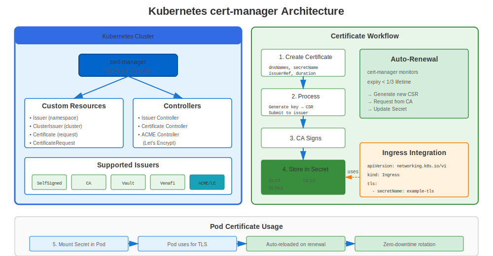
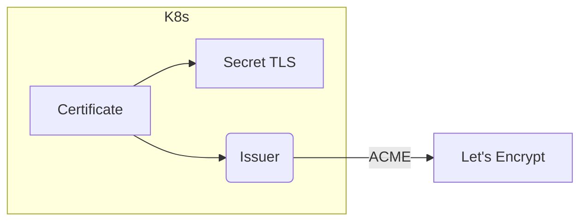

# Appendix A: Kubernetes cert-manager

`cert-manager` is a CNCF project that automates certificate issuance inside Kubernetes clusters.

## 1. Architecture



* **Issuer / ClusterIssuer** – Defines CA or ACME server.
* **Certificate** – Desired state for a cert (DNS names, duration).
* **Controller** – Reconciles resources, stores secrets.



## 2. Installation

```bash
kubectl apply -f https://github.com/cert-manager/cert-manager/releases/download/v1.14.1/cert-manager.yaml
```

## 3. Example: Ingress TLS

```yaml
apiVersion: cert-manager.io/v1
kind: ClusterIssuer
metadata:
  name: letsencrypt-prod
spec:
  acme:
    server: https://acme-v02.api.letsencrypt.org/directory
    email: admin@example.com
    privateKeySecretRef:
      name: le-key
    solvers:
    - http01:
        ingress:
          class: nginx
---
apiVersion: cert-manager.io/v1
kind: Certificate
metadata:
  name: web-tls
  namespace: default
spec:
  secretName: web-tls
  issuerRef:
    name: letsencrypt-prod
    kind: ClusterIssuer
  commonName: example.com
  dnsNames:
  - example.com
  - www.example.com
```

## 4. Renewal & Status

`kubectl describe certificate web-tls` shows condition Ready and next renewal time.


---

## 🧪 Hands-On Lab

**Lab 21: Kubernetes cert-manager**

Automate certificate management in Kubernetes

- 📁 **Location:** `labs/en_US/21-kubernetes-cert-manager/`
- ⏱️ **Time:** 50-60 minutes
- 🎯 **Level:** Advanced
