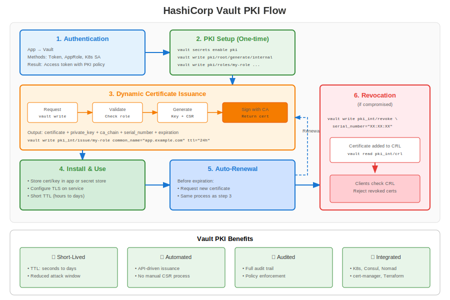

# Appendix B: HashiCorp Vault PKI



Vault provides a dynamic PKI where certificates are issued on-demand with short TTLs.

## 1. Why Vault?

* Centralised policy enforcement
* Dynamic, short-lived certs reduce revocation needs
* API-driven (REST + CLI)

## 2. Enabling PKI Engine

```bash
vault secrets enable pki
vault secrets tune -max-lease-ttl=87600h pki
vault write pki/root/generate/internal common_name="corp.example" ttl=87600h
vault write pki/config/urls issuing_certificates="https://vault.corp/v1/pki/ca" \
                                    crl_distribution_points="https://vault.corp/v1/pki/crl"
```

## 3. Roles & Issue

```bash
vault write pki/roles/web allowed_domains="web.corp" allow_subdomains=true max_ttl=72h
vault write pki/issue/web common_name=app01.web.corp ttl=24h
```

## 4. Agent Sidecar Auto-Renew

```hcl
# vault-agent.hcl
pid_file = "/var/run/agent.pid"
auto_auth {
  method "kubernetes" {
    mount_path = "auth/k8s"
    role       = "web"
  }
  sink "file" {
    config = {
      path = "/etc/tls/web.pem"
    }
  }
}
```


---

## 🧪 Hands-On Lab

**Lab 22: HashiCorp Vault PKI**

Dynamic certificate issuance with Vault

- 📁 **Location:** `labs/en_US/22-vault-pki/`
- ⏱️ **Time:** 45-55 minutes
- 🎯 **Level:** Advanced
