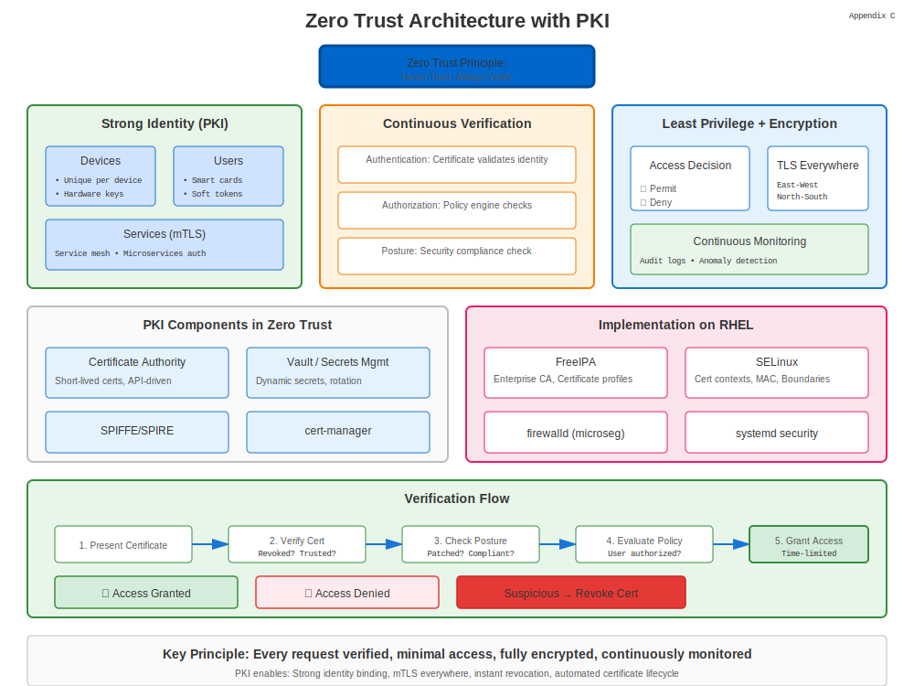

# Appendix C: Zero Trust Architecture

## PKI in Zero Trust Architecture



Zero Trust (ZT) assumes no implicit trust based on network location. Every request must be authenticated and authorised.

## 1. Google BeyondCorp & NIST SP 800-207

These frameworks recommend strong identity, transport encryption, and continuous evaluation.

## 2. PKI’s Role

* Device identity via certificates.
* mTLS for east-west traffic.
* Short-lived credentials auto-rotated.

## 3. Certificate Profile for ZT

| Extension | Purpose |
|-----------|---------|
| SAN: URI:spiffe:// | Workload ID |
| Key Usage: digitalSignature | AuthN |
| EKU: clientAuth, serverAuth | Mutual TLS |
| Validity ≤ 24h | Limit blast radius |

## 4. Policy Enforcement Points

1. **Gateways** terminate TLS and verify client certs.
2. **Service Mesh** sidecars perform mTLS transparently.
3. **Endpoint Agents** maintain device certificates.

## 5. Lab: Issue SPIFFE Certificates with cert-manager

```yaml
apiVersion: cert-manager.io/v1
kind: Certificate
metadata:
  name: spiffe-workload
spec:
  duration: 24h
  commonName: spiffe://prod/web/api
  uriSANs:
  - spiffe://prod/web/api
  issuerRef:
    name: mesh-issuer
    kind: ClusterIssuer
```
