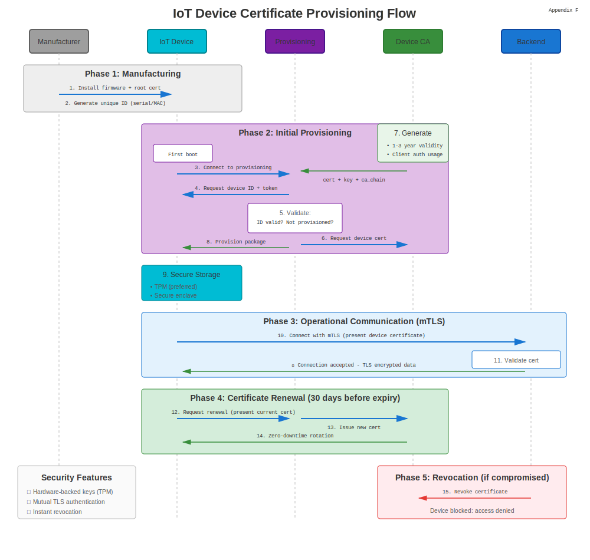
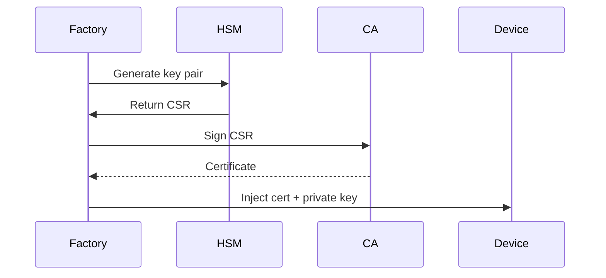

# Appendix F: IoT Certificates

## IoT Device Certificates



Internet of Things devices require unique identities for secure communication. Certificates provide cryptographic proof of device authenticity.

## 1. Why Certificates for IoT?

* **Device Identity** – Each sensor, gateway, or actuator gets a unique cert.
* **Zero-Trust Networks** – Devices authenticate mutually with cloud/edge.
* **Supply Chain Security** – Certificates provisioned at manufacturing prevent cloning.
* **OTA Updates** – Code-signing ensures firmware integrity.

## 2. Certificate Provisioning Models

### Factory Provisioning

Certificates burned into device secure storage (TPM, secure element) before shipment.



### Just-in-Time Provisioning

Device generates key on first boot, submits CSR to registration service.

```bash
# Device generates key
openssl ecparam -genkey -name prime256v1 -out device.key

# Create CSR with device serial
openssl req -new -key device.key -out device.csr -subj "/CN=device-12345/serialNumber=12345"

# Submit to enrollment API
curl -X POST https://enroll.iot.example.com/csr \
  -H "Authorization: Bearer $ENROLL_TOKEN" \
  --data-binary @device.csr -o device.crt
```

## 3. AWS IoT Core

### Register Device Certificate

```bash
# Generate key and CSR
openssl ecparam -genkey -name prime256v1 -out iot-device.key
openssl req -new -key iot-device.key -out iot-device.csr -subj "/CN=iot-device-001"

# Use AWS CLI to sign
aws iot create-certificate-from-csr --certificate-signing-request file://iot-device.csr \
  --set-as-active > cert-response.json

# Extract certificate
jq -r '.certificatePem' cert-response.json > iot-device.crt
```

### Attach Policy

```bash
aws iot attach-policy --policy-name IoTDevicePolicy --target arn:aws:iot:region:account:cert/certId
```

### MQTT Connect

```python
import paho.mqtt.client as mqtt
import ssl

client = mqtt.Client()
client.tls_set(
    ca_certs="AmazonRootCA1.pem",
    certfile="iot-device.crt",
    keyfile="iot-device.key",
    tls_version=ssl.PROTOCOL_TLSv1_2
)
client.connect("xxxxxx.iot.us-east-1.amazonaws.com", 8883)
client.publish("device/telemetry", "{'temp': 22.5}")
```

## 4. Azure IoT Hub

### X.509 Device Authentication

```bash
# Generate device cert signed by custom CA
openssl req -new -key device.key -out device.csr -subj "/CN=device-001"
openssl x509 -req -in device.csr -CA ca.crt -CAkey ca.key -CAcreateserial \
  -out device.crt -days 365 -sha256

# Upload CA to Azure IoT Hub (portal or CLI)
az iot hub certificate create --hub-name MyIoTHub --name MyCACert --path ca.crt

# Connect device
from azure.iot.device import IoTHubDeviceClient

device_client = IoTHubDeviceClient.create_from_x509_certificate(
    hostname="MyIoTHub.azure-devices.net",
    device_id="device-001",
    x509=X509(cert_file="device.crt", key_file="device.key")
)
device_client.connect()
device_client.send_message("Hello from device-001")
```

## 5. Microchip ATECC608 Secure Element

Hardware crypto chip stores private keys that never leave the silicon.

### Provisioning Flow

1. Device generates key pair inside ATECC608.
2. CSR created using on-chip key.
3. CA signs CSR, certificate stored in device EEPROM.

```c
// Arduino example with ATECC library
#include <ArduinoECCX08.h>

void setup() {
  ECCX08.begin();

  // Generate CSR
  byte csr[256];
  ECCX08.getCSR(csr);

  // Send CSR to CA via HTTP/MQTT
  // Receive signed certificate
  // Store in EEPROM
}
```

## 6. Certificate Rotation for Constrained Devices

### Short-Lived Certificates

Issue 7-day certs with automated renewal via lightweight protocols like EST (RFC 7030).

```bash
# EST simple enroll
curl --cacert ca.crt --cert current-device.crt --key device.key \
  https://est.example.com/.well-known/est/simpleenroll \
  --data-binary @new-device.csr -o renewed-device.crt
```

### Bootstrap Certificates

Initial long-lived cert used solely for enrollment, then replaced by short-lived operational certs.

## 7. LoRaWAN & Secure Join

LoRaWAN 1.1+ supports secure join with device-specific keys derived from certificates:

```text
Device → JoinRequest (signed with DevEUI cert)
Network Server → JoinAccept (encrypted session keys)
```

## 8. Best Practices Summary

| Practice | Rationale |
|----------|-----------|
| Use ECC (P-256, P-384) | Smaller keys, lower power consumption |
| Hardware Root of Trust | TPM, ATECC, or TrustZone prevent key extraction |
| Certificate Validity ≤ 1 year | Limit blast radius of compromise |
| Revocation via OCSP/CRL | Disable compromised devices remotely |
| Separate PKI for IoT | Isolate device CA from enterprise IT |

## 9. Real-World Deployments

* **Automotive** – Vehicle ECUs use certificates for V2X communication (IEEE 1609.2).
* **Industrial IoT** – PLCs and SCADA devices authenticated via IEC 62351.
* **Smart Home** – Matter protocol mandates X.509 certificates for device commissioning.

> **Security Tip:** Never embed the same private key in multiple devices. Each device must have a unique certificate to enable selective revocation.
