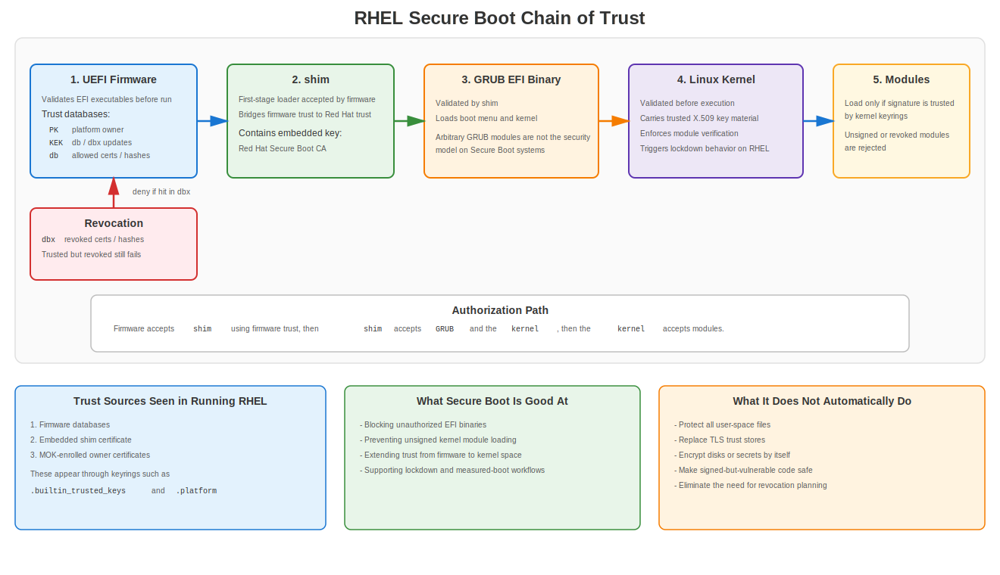
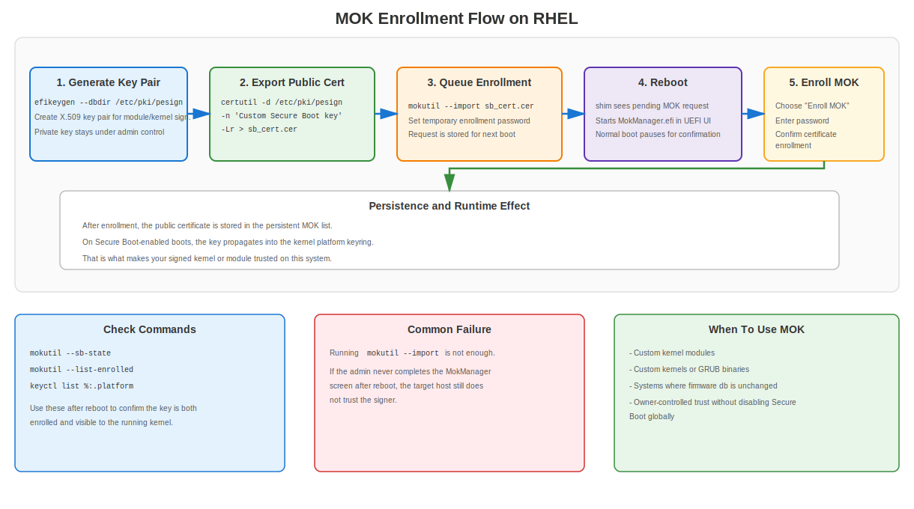
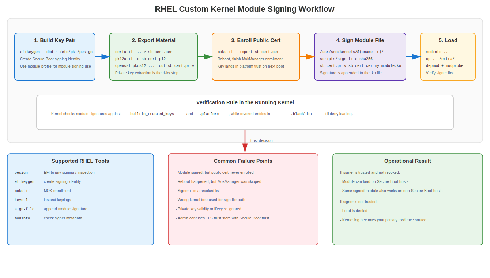

# Appendix H: Secure Boot and Certificate Usage

## Secure Boot, Trust Chains, and Certificate Operations on RHEL

Secure Boot is where firmware, boot loaders, kernels, and kernel-loaded code stop being "just files on disk" and become authenticated code objects. If you understand TLS certificates but not Secure Boot, you are missing a large part of how trust actually starts on a modern system.

This appendix focuses on three things:

1. What Secure Boot is actually doing.
2. Where certificates and keys are used in the boot chain.
3. How RHEL uses `shim`, `GRUB`, `mokutil`, `pesign`, kernel keyrings, and module signing in real deployments.

## 1. What Secure Boot Is

UEFI Secure Boot is a firmware-backed signature verification model for the boot path. The firmware checks whether an EFI executable is signed by a trusted key or certificate before it is allowed to run.

That means Secure Boot is not the same thing as:

- Full-disk encryption
- TPM-sealed secrets
- Measured Boot
- File Integrity Monitoring
- User-space application whitelisting
- TLS trust for web services

Secure Boot is specifically about authorizing code during the boot path and for kernel-space extensions such as loadable kernel modules.

In plain terms, the question Secure Boot asks is:

> "Should this firmware component, EFI binary, boot loader, kernel, or module be trusted to execute?"

## 2. Why Certificates Matter in Secure Boot

Certificates are the transport mechanism for trust. They bind a public key to an identity or policy context so a verifier can decide whether a signature should be accepted.

In the Secure Boot ecosystem, certificates and keys are used in different places:

| Location | Purpose |
|----------|---------|
| UEFI firmware variables | Store platform trust anchors and revocations |
| `shim` | Carries embedded vendor trust for next-stage verification |
| Kernel keyrings | Hold trusted keys used to authenticate modules and related artifacts |
| MOK list | Adds owner-controlled trust without rewriting firmware databases |
| Signature blocks on EFI binaries | Prove that boot components were signed by a trusted private key |

This is a different trust domain from the RHEL TLS trust store in `/etc/pki/ca-trust/`. That trust store is for user-space PKI operations such as HTTPS, LDAPS, SMTP TLS, package retrieval, and application validation. It does not decide what EFI binary the firmware boots.

## 3. The UEFI Secure Boot Trust Model

### 3.1 Core Firmware Databases

UEFI Secure Boot commonly revolves around four important variable-backed databases:

| Database | Meaning | Typical Role |
|----------|---------|--------------|
| `PK` | Platform Key | Top-level owner of platform Secure Boot policy |
| `KEK` | Key Exchange Key database | Authorizes updates to allowed and revoked signature databases |
| `db` | Allowed signatures / certificates | Trust list for EFI executables and drivers |
| `dbx` | Forbidden signatures / certificates / hashes | Revocation list used to block known-bad binaries or certs |

These are conceptually simple, but administrators routinely confuse them:

- `PK` controls the platform's Secure Boot authority.
- `KEK` controls updates to the allowlist and denylist.
- `db` says what is allowed to boot.
- `dbx` says what must never be accepted, even if it was once trusted.

### 3.2 Setup Mode vs User Mode

UEFI firmware usually has different operational states:

- **Setup Mode**: platform ownership is not finalized; key enrollment changes are possible.
- **User Mode**: Secure Boot policy is actively enforced using installed keys.
- **Custom Mode**: vendor-specific mode that may allow manual key management.

This matters because people often mistake "Secure Boot enabled in firmware menus" for "Secure Boot fully enforced with the expected trust policy." Those are not always the same state.

## 4. What Actually Gets Signed

Secure Boot is not one signature over "the system." It is a chain of separately signed or separately trusted objects.

Common authenticated objects include:

- EFI applications
- EFI boot loaders
- GRUB EFI binaries
- Linux kernels
- Loadable kernel modules
- Sometimes vendor firmware update executables

Just because a component participates in boot does not mean it is independently signed in the same way. For example:

- EFI binaries are typically authenticated as PE/COFF executables with embedded signatures.
- Kernel modules are signed in a Linux-specific way and verified by the kernel against trusted X.509 keys.
- The initramfs is part of the boot flow, but in the classic RHEL Secure Boot model it is not simply "another independently PE-signed EFI executable."

That distinction matters. Sloppy docs blur everything into "the whole boot chain is signed." That is not precise enough to troubleshoot or design policy.

## 5. RHEL Secure Boot Chain of Trust



### 5.1 High-Level Flow

On a typical RHEL system with UEFI Secure Boot enabled:

1. Firmware validates the first-stage EFI boot loader against trusted keys in firmware databases.
2. The first-stage loader is typically `shim`.
3. `shim` carries an embedded Red Hat trust anchor used to authenticate the next stage.
4. `shim` validates the RHEL GRUB EFI binary.
5. GRUB validates the kernel it loads using the public key embedded in `shim` (GRUB does not carry its own trust keys).
6. The kernel uses its trusted keyrings to validate loadable kernel modules and related kernel-space code.

That gives you a chain of authorization from firmware to kernel-space extensibility.

### 5.2 Why `shim` Exists

`shim` exists because hardware vendors broadly ship systems with Microsoft-trusted UEFI signing roots already enrolled. Red Hat can therefore have the first-stage loader signed so it is accepted by commodity hardware without asking every hardware vendor to pre-install a Red Hat-only firmware trust anchor.

After firmware accepts `shim`, `shim` becomes the bridge between firmware trust and vendor OS trust.

In practice on RHEL:

- Firmware trusts the Microsoft-recognized signature path for `shim`.
- `shim` contains an embedded Red Hat Secure Boot CA certificate.
- That embedded Red Hat certificate is used to validate GRUB and the kernel.

### 5.3 Why RHEL Does Not Rely on Arbitrary GRUB Module Loading

Under Secure Boot, RHEL does not want arbitrary unsigned code loaded inside the boot loader security boundary. Red Hat documentation explains that GRUB module loading is disabled in Secure Boot contexts because there is no broad-purpose signing and verification model for arbitrary GRUB modules equivalent to the controlled signed path Red Hat ships.

The operational point is simple:

- If you are on a Secure Boot system, do not assume "GRUB can just load anything from disk."
- The whole design is trying to keep unsigned code out of the boot path.

## 6. Certificates and Keys Used by RHEL Secure Boot

### 6.1 Firmware Certificates

Firmware trust comes from keys and certificates stored in UEFI variables (`PK`, `KEK`, `db`, `dbx`) as described in section 3.1. These are not managed with `update-ca-trust`.

### 6.2 Embedded `shim` Certificate

Red Hat documentation for RHEL 8/9/10 describes `shim` as containing a Red Hat public certificate used to authenticate GRUB and the kernel. This embedded trust is one of the reasons `shim` is central to the RHEL Secure Boot design.

### 6.3 Machine Owner Key (MOK)

The **Machine Owner Key** facility is the practical escape hatch that keeps Secure Boot usable in the real world.

Without MOK, you would be trapped between two bad options:

1. Disable Secure Boot whenever you need custom code.
2. Convince your hardware vendor to permanently add your public certificate to firmware databases.

MOK provides a third option:

- You enroll your own public certificate on the system.
- `shim` and `MokManager` manage that enrollment.
- On boot, the key is propagated into a kernel-trusted keyring so your signed custom components can be accepted.

### 6.4 Kernel Keyrings

On modern RHEL, kernel module signature verification relies on kernel keyrings, primarily:

| Keyring | Role |
|---------|------|
| `.builtin_trusted_keys` | Built-in trusted keys embedded into the kernel or loaded as part of the trusted boot path |
| `.platform` | Platform-derived trust, including keys sourced from Secure Boot databases and MOK |
| `.blacklist` | Revoked keys and hashes that must be rejected |

RHEL documentation for module signing explicitly notes:

- module signatures are checked against trusted X.509 keys from `.builtin_trusted_keys` and `.platform`
- revoked entries from the blacklist are excluded from verification
- MOK keys propagate to `.platform` on Secure Boot-enabled boots

That means trust is additive, but revocation still wins.

## 7. What Secure Boot Does and Does Not Protect

### 7.1 What It Protects

Secure Boot is designed to reduce the chance that the system executes unauthorized boot-path code such as:

- tampered EFI binaries
- rogue boot loaders
- modified kernels
- unsigned or untrusted kernel modules

### 7.2 What It Does Not Automatically Solve

Secure Boot does not automatically protect:

- user-space binaries
- shell scripts
- configuration files
- secrets at rest
- runtime memory tampering after a system is already compromised
- TLS server identity for services
- local privilege escalation through signed-but-vulnerable code

Secure Boot is a boot authorization control. It is not a complete host integrity framework.

### 7.3 Secure Boot vs Measured Boot vs TPM

People mash these together because they all touch startup trust. That is lazy thinking.

They are related, but different:

| Feature | Main Function |
|---------|---------------|
| Secure Boot | Blocks execution of unauthorized code in the boot path |
| Measured Boot | Records boot measurements into TPM PCRs |
| TPM | Stores protected secrets and measurements; can seal data to boot state |
| IMA appraisal | Extends integrity policy beyond early boot into file appraisal and runtime loading decisions |

A practical RHEL implication:

- Secure Boot decides whether code is accepted to boot or load.
- TPM-based workflows may depend on PCR values that reflect Secure Boot policy and firmware database state.

If firmware keys or revocation databases change, TPM measurements can change as well. That matters for LUKS auto-unlock, attestation, and sealed-secret workflows.

## 8. Kernel Lockdown on RHEL

On RHEL, booting in EFI Secure Boot mode activates kernel lockdown behavior. This is important because Secure Boot alone is not enough if the running kernel still exposes interfaces that let privileged users tamper with kernel memory or bypass trust decisions.

Lockdown is intended to close that gap.

Typical restrictions include limits or outright blocks on things like:

- loading unsigned modules
- direct kernel image modification paths
- direct access interfaces such as `/dev/mem`
- some unsigned `kexec` paths
- interfaces that could weaken the boot trust boundary

This is why admins sometimes see messages like:

```text
Lockdown: X: Y is restricted; see man kernel_lockdown.7
```

That is not random kernel drama. It is Secure Boot policy following through into runtime enforcement.

## 9. The RHEL Administrator's Mental Model

If you only keep one model in your head, keep this one:

1. Firmware trusts keys in `db` and rejects keys or hashes in `dbx`.
2. Firmware authorizes `shim`.
3. `shim` authorizes Red Hat's next-stage boot components and also supports MOK operations.
4. MOK lets you add owner-controlled public certificates.
5. The kernel trusts built-in and platform/MOK-derived keys for module verification.
6. Lockdown prevents obvious runtime bypasses.

If any one of those steps is broken, your custom boot or module workflow fails.

## 10. Secure Boot on RHEL: Daily Operational Checks

### 10.1 Check Whether Secure Boot Is Enabled

```bash
sudo mokutil --sb-state
```

Typical output is along the lines of:

```text
SecureBoot enabled
```

### 10.2 Check for Secure Boot and Integrity Messages in the Kernel Log

```bash
sudo dmesg | grep -Ei 'secure boot|integrity|lockdown|EFI: Loaded cert'
```

On RHEL systems, integrity log messages often show where keys came from, such as:

- `UEFI:db`
- embedded `shim`
- `UEFI:MokListRT`

### 10.3 List Trusted Platform Keys

```bash
sudo keyctl list %:.platform
sudo keyctl list %:.builtin_trusted_keys
sudo keyctl list %:.blacklist
```

What you are looking for:

- firmware-derived certificates
- MOK-enrolled certificates
- revoked hashes or keys in `.blacklist`

### 10.4 Inspect Signatures on EFI Binaries

On RHEL, `pesign` is the supported tool path for inspecting and adding signatures to relevant EFI binaries:

```bash
sudo pesign --show-signature --in /boot/efi/EFI/redhat/shimx64.efi
sudo pesign --show-signature --in /boot/efi/EFI/redhat/grubx64.efi
```

On AArch64 systems, the names commonly change to `shimaa64.efi` and `grubaa64.efi`.

## 11. Key RHEL Packages and Tools

When working with custom Secure Boot signing on RHEL 8/9/10, Red Hat documentation centers on these tools:

```bash
sudo dnf install pesign openssl kernel-devel mokutil keyutils
```

Main roles:

| Tool | Purpose |
|------|---------|
| `pesign` | Sign and inspect EFI binaries and kernels |
| `efikeygen` | Generate a Secure Boot-oriented X.509 key pair in the `pesign` database |
| `mokutil` | Enroll and inspect Machine Owner Keys and Secure Boot state |
| `keyctl` | Inspect kernel keyrings |
| `sign-file` | Append Linux kernel module signatures |
| `certutil` / `pk12util` | Export keys and certificates from the NSS database used by `pesign` |
| `openssl` | Extract or transform key material when needed |

## 12. Generating a Custom Secure Boot Key on RHEL

### 12.1 Generate a Key for Module Signing

Red Hat documents `efikeygen` as the standard way to create a self-signed X.509 pair for Secure Boot workflows:

```bash
sudo efikeygen \
  --dbdir /etc/pki/pesign \
  --self-sign \
  --module \
  --common-name 'CN=Organization signing key' \
  --nickname 'Custom Secure Boot key'
```

### 12.2 Generate a Key for Kernel Signing

```bash
sudo efikeygen \
  --dbdir /etc/pki/pesign \
  --self-sign \
  --kernel \
  --common-name 'CN=Organization signing key' \
  --nickname 'Custom Secure Boot key'
```

### 12.3 FIPS-Aware Note

Red Hat documentation notes that in FIPS mode you may need to specify the NSS token explicitly:

```bash
sudo efikeygen \
  --dbdir /etc/pki/pesign \
  --self-sign \
  --kernel \
  --common-name 'CN=Organization signing key' \
  --nickname 'Custom Secure Boot key' \
  --token 'NSS FIPS 140-2 Certificate DB'
```

The generated material is stored under `/etc/pki/pesign/`.

## 13. Enrolling the Public Certificate with MOK



This is the step people skip, and then they waste hours blaming Secure Boot instead of their own process.

Generating a key is not enough. The target system must trust the corresponding public certificate.

### 13.1 Export the Public Certificate

```bash
sudo certutil -d /etc/pki/pesign \
  -n 'Custom Secure Boot key' \
  -Lr > sb_cert.cer
```

### 13.2 Import It into MOK

```bash
sudo mokutil --import sb_cert.cer
```

You will be prompted to set a temporary enrollment password.

### 13.3 Reboot and Complete Enrollment

On the next boot:

1. `shim` notices the pending enrollment.
2. `MokManager.efi` starts.
3. You choose `Enroll MOK`.
4. You enter the password you set during `mokutil --import`.
5. The certificate is added to the persistent MOK list.

Once enrolled on a Secure Boot-enabled system, the key is propagated into the `.platform` keyring on subsequent boots.

## 14. Signing Custom Kernel Modules on RHEL



This is one of the most common real-world Secure Boot tasks. Out-of-tree drivers, vendor modules, HBA agents, monitoring probes, or security products often fail here.

### 14.1 Export the Public Certificate

Export the public certificate as described in section 13.1 to produce `sb_cert.cer`.

### 14.2 Export the Private Key from the NSS Database

```bash
sudo pk12util -o sb_cert.p12 \
  -n 'Custom Secure Boot key' \
  -d /etc/pki/pesign
```

Then extract the private key:

```bash
openssl pkcs12 \
  -in sb_cert.p12 \
  -out sb_cert.priv \
  -nocerts \
  -noenc
```

That produces an unencrypted private key. Treat that file like a live weapon, because that is what it is.

### 14.3 Sign the Module

```bash
sudo /usr/src/kernels/$(uname -r)/scripts/sign-file \
  sha256 \
  sb_cert.priv \
  sb_cert.cer \
  my_module.ko
```

This appends the module signature directly to the kernel module file.

### 14.4 Verify the Signer

```bash
modinfo my_module.ko | grep signer
```

### 14.5 Load the Module

```bash
sudo insmod my_module.ko
```

or after placing it under the module tree:

```bash
sudo cp my_module.ko /lib/modules/$(uname -r)/extra/
sudo depmod -a
sudo modprobe my_module
```

### 14.6 Validity-Date Operational Warning

Red Hat documentation warns administrators to sign kernels and modules within the certificate validity period and also notes that `sign-file` does not warn about bad timing decisions. Do not treat the absence of a tool warning as proof that your signing workflow is sane.

## 15. Signing Kernels and EFI Binaries on RHEL

### 15.1 Sign a Kernel on x86_64

```bash
sudo pesign \
  --certificate 'Custom Secure Boot key' \
  --in vmlinuz-version \
  --sign \
  --out vmlinuz-version.signed
```

Inspect the result:

```bash
sudo pesign --show-signature --in vmlinuz-version.signed
```

Replace the unsigned image with the signed one:

```bash
sudo mv vmlinuz-version.signed vmlinuz-version
```

If you skip this step, the system still boots the unsigned original.

### 15.2 Sign a GRUB EFI Binary on x86_64

```bash
sudo pesign \
  --in /boot/efi/EFI/redhat/grubx64.efi \
  --out /boot/efi/EFI/redhat/grubx64.efi.signed \
  --certificate 'Custom Secure Boot key' \
  --sign
```

Inspect the result:

```bash
sudo pesign --in /boot/efi/EFI/redhat/grubx64.efi.signed --show-signature
```

Replace the unsigned binary with the signed one:

```bash
sudo mv /boot/efi/EFI/redhat/grubx64.efi.signed /boot/efi/EFI/redhat/grubx64.efi
```

### 15.3 AArch64 Note

On AArch64 systems, you will typically work with:

- `/boot/efi/EFI/redhat/shimaa64.efi`
- `/boot/efi/EFI/redhat/grubaa64.efi`

RHEL documentation also covers the decompression/recompression workflow for signing kernel images on 64-bit ARM.

## 16. Where Secure Boot Trust Appears Inside the Running RHEL Kernel

RHEL documentation shows that a Secure Boot-enabled system can expose evidence of loaded trust sources in both kernel logs and keyrings.

Examples of what you may see:

- Microsoft certificate entries sourced from UEFI `db`
- Red Hat Secure Boot keys sourced from embedded `shim`
- owner-enrolled keys sourced from `MokListRT`
- revocations reflected in `.blacklist`

That gives you three different trust sources in play:

1. Firmware trust
2. Embedded vendor trust
3. Owner-added trust

If you do not know which of the three your system is using for a given module or EFI binary, you are troubleshooting blind.

## 17. Secure Boot Revocation and `dbx`

Revocation is where a lot of "but it used to work" incidents come from.

The `dbx` database contains revoked signatures, certificates, or hashes. If an object chains to a revoked entry, the system rejects it even if it used to be trusted.

Operational consequences:

- old boot loaders can stop working after revocation updates
- vulnerable or deprecated signatures can become unacceptable
- lab systems that never receive firmware updates drift into weird compatibility states
- custom boot chains break if you anchored them to something that later lands in revocation data

Inside Linux, revoked entries are represented through the blacklist keyring. That is why trust alone is not enough; the object must also not be revoked.

## 18. Microsoft 2011 Secure Boot Certificate Expiration

The Microsoft UEFI CA 2011 signing certificate, which has been the primary trust anchor used by firmware to validate `shim` on virtually all x86_64 commodity hardware, is scheduled to expire on June 27, 2026.

This does not mean existing systems immediately stop booting. Systems that already have the 2011 certificate enrolled in firmware `db` will continue to accept binaries signed with that certificate after the expiration date. However, Microsoft will no longer sign new binaries with the 2011 key after expiration, so future `shim` updates must be signed with the replacement Microsoft UEFI CA 2023 certificate.

### 18.1 What Red Hat Has Done

Red Hat released new `shim` binaries for all supported RHEL 8, RHEL 9, and RHEL 10 releases on x86_64 that are dual-signed with both the Microsoft 2011 and Microsoft 2023 Secure Boot signing certificates. This means the new `shim` will boot on systems that have either or both certificates enrolled in firmware.

On AArch64, starting with RHEL 9.7 and RHEL 10.0, the `shim` binary is signed only with the Microsoft 2023 certificate.

### 18.2 Checking Which Certificate Signed Your shim

```bash
sudo pesign -S -i /boot/efi/EFI/redhat/shimx64.efi
```

If you see `Microsoft Windows UEFI Driver Publisher`, that is the 2011 certificate path. If you see references to the 2023 certificate, the system is using the updated signing path.

### 18.3 What Administrators Must Do

1. **Update `shim`** on all supported RHEL systems to get the dual-signed version before relying on firmware updates that add the 2023 certificate.
2. **Watch for firmware updates** from hardware vendors that enroll the Microsoft 2023 certificate into the UEFI `db`. Without the 2023 certificate in firmware, future `shim` binaries signed only with the 2023 key will not be accepted.
3. **Be aware of TPM impact**: updates to UEFI `db` will change TPM Platform Configuration Register (PCR) values, particularly PCR7. If you use TPM-based auto-unlock for LUKS-encrypted volumes, Measured Boot attestation, or secrets sealed against PCR7, those bindings will break after `db` changes. The recommended approach is to first reseal against a PCR value that did not change (such as PCR0), reboot, and then reseal against the new PCR7 value.
4. **Legacy systems** (old physical servers, appliances, or systems that never receive firmware updates) that cannot enroll the 2023 certificate will remain limited to booting `shim` binaries signed with the 2011 certificate.

### 18.4 Why This Matters for This Book

This is a concrete, real-world example of every concept this appendix covers: firmware trust databases, certificate lifecycle, revocation risk, TPM measurement sensitivity, and the operational cost of ignoring signing certificate management. If your organization did not know this was coming, your Secure Boot lifecycle management has a gap.

## 19. Secure Boot and RHEL Version Notes

### 19.1 RHEL 7

RHEL 7 established the basic Red Hat Secure Boot model:

- `shim` as first-stage loader
- Red Hat embedded key in `shim`
- signed GRUB and kernel
- MOK for owner-added trust
- signed kernel modules required on Secure Boot-enabled systems

RHEL 7 documentation also makes an important point that many people miss: classic Secure Boot is about kernel-space code integrity, not blanket validation of all user-space content.

### 19.2 RHEL 8

RHEL 8 keeps the same overall model, with improved public documentation around:

- `.builtin_trusted_keys`
- `.platform`
- `.blacklist`
- `efikeygen`
- `pesign`
- MOK enrollment procedures

RHEL 8 docs also explicitly show that MOK-enrolled keys propagate to `.platform`.

### 19.3 RHEL 9

RHEL 9 documents the same core trust path and is stricter and clearer operationally around:

- module signature validation against trusted keyrings
- MOK-driven platform trust
- signing custom kernels and modules
- lockdown behavior on Secure Boot systems

RHEL 9 is the practical baseline if you are designing a modern RHEL Secure Boot workflow today.

### 19.4 RHEL 10

RHEL 10 documentation continues the same toolchain and trust model for custom kernel and module signing with `pesign`, `mokutil`, `efikeygen`, `keyctl`, and kernel keyrings.

The important point is continuity: this is not a random feature that changes shape every release. The tool names and trust concepts stay recognizable across supported RHEL generations.

## 20. Common RHEL Use Cases

### 20.1 Third-Party Driver Deployment

Common examples:

- storage controller drivers
- monitoring agents with kernel modules
- endpoint security modules
- custom network drivers
- vendor hardware management modules

If the module is unsigned or signed by an untrusted key, the system refuses it on a Secure Boot-enabled host.

### 20.2 Custom Kernel Builds

If you build your own kernel, firmware and the boot chain do not care that it came from your CI pipeline. They only care whether the image is signed by a trusted key and whether the system has that trust anchor enrolled.

### 20.3 Environments Removing Vendor Trust Anchors

Some organizations want tighter control and reduce reliance on default third-party trust anchors. That is possible, but it means you own the full chain:

- signing policy
- private-key protection
- firmware trust management
- GRUB/kernel signing
- revocation strategy
- recovery path if your signing infrastructure fails

Most teams underestimate that operational burden.

### 20.4 Virtual Machines

Secure Boot also matters in virtualized environments if the guest firmware exposes UEFI Secure Boot support. Do not assume that "it is only a VM" means boot trust is irrelevant. Virtual infrastructure is one of the easiest places for unsigned custom images to proliferate.

## 21. Troubleshooting Secure Boot on RHEL

### 21.1 Fast Checks

```bash
sudo mokutil --sb-state
sudo mokutil --list-enrolled
sudo keyctl list %:.platform
sudo keyctl list %:.blacklist
sudo dmesg | grep -Ei 'secure boot|lockdown|integrity|module|cert'
```

### 21.2 Typical Failure Patterns

| Symptom | Likely Cause |
|---------|--------------|
| Module will not load | Unsigned module or signer not trusted |
| Module shows signer but still fails | Key not enrolled on target system, wrong keyring path, or revoked signer |
| MOK import ran but trust not visible | Enrollment not completed in `MokManager` after reboot |
| EFI binary fails to boot | Missing trusted signature, bad replacement workflow, or revoked certificate/hash |
| Behavior changed after firmware update | `db`/`dbx` changes altered trust or revocation state |
| TPM-unlock workflow breaks after key updates | PCR measurements changed after Secure Boot database updates |

### 21.3 Kernel Log Clues

Look for messages mentioning:

- `integrity`
- `MokListRT`
- `EFI: Loaded cert`
- `Lockdown`
- `module verification failed`

If you do not inspect the kernel log, you are guessing.

## 22. Best Practices for Secure Boot Certificate Management

### 22.1 Separate Roles

Do not use one signing key for everything unless you enjoy turning one compromise into a platform-wide incident.

Prefer separate keys for:

- boot loaders / EFI binaries
- kernels
- third-party or internal kernel modules
- emergency or break-glass workflows

### 22.2 Protect the Private Key Properly

Prefer:

- offline signing
- HSM-backed or token-backed key storage where possible
- minimal operator access
- audited signing steps
- certificate rotation planning

Avoid:

- leaving unencrypted extracted keys on build hosts
- copying signing material across ad hoc CI jobs
- long-lived throwaway lab keys reused in production

### 22.3 Keep MOK Enrollment Narrow

Every extra trusted certificate expands what the platform can accept. Enroll only what you need. "Just add another MOK to get it working" is how trust sprawl starts.

### 22.4 Track Revocation and Firmware Updates

If you depend on custom Secure Boot trust:

- monitor firmware and `dbx` updates
- test recovery paths before broad rollout
- validate boot on staging hardware
- understand the impact on TPM-sealed secrets and attestation

### 22.5 Keep Secure Boot and TLS PKI Mentally Separate

The same X.509 concepts appear in both areas, but the operational worlds are different.

Do not confuse:

- firmware trust databases with `/etc/pki/ca-trust`
- MOK enrollment with CA trust anchor installation
- module signing keys with web TLS server certificates

They use related cryptography, but they solve different problems.

## 23. Hard Truths Administrators Usually Learn Late

1. Secure Boot is easy until you need custom code.
2. Custom code is easy until you need durable signing operations.
3. Durable signing operations are easy until you need revocation, rotation, attestation, and fleet recovery.

Most teams do not fail Secure Boot because the cryptography is too hard. They fail because their operational model is sloppy:

- no key ownership model
- no certificate lifecycle planning
- no test hardware
- no rollback path
- no idea what is trusted by firmware vs `shim` vs MOK vs kernel keyrings

That is not a technical limitation. That is process failure.

## 24. Quick Reference

```text
┌──────────────────────────────────────────────────────────────────────┐
│ RHEL SECURE BOOT QUICK REFERENCE                                     │
├──────────────────────────────────────────────────────────────────────┤
│ Check state:        mokutil --sb-state                               │
│ List MOKs:          mokutil --list-enrolled                          │
│ List platform keys: keyctl list %:.platform                          │
│ Built-in keys:      keyctl list %:.builtin_trusted_keys              │
│ Revocations:        keyctl list %:.blacklist                         │
│ View EFI signature: pesign --show-signature --in <efi-binary>        │
│                                                                      │
│ RHEL boot path:     firmware -> shim -> GRUB -> kernel -> modules    │
│                                                                      │
│ Firmware DBs:       PK / KEK / db / dbx                              │
│ Owner trust:        MOK -> .platform                                 │
│ Kernel trust:       .builtin_trusted_keys + .platform                │
│ Revocation:         .blacklist / dbx                                 │
│                                                                      │
│ Common packages:    pesign openssl kernel-devel mokutil keyutils     │
└──────────────────────────────────────────────────────────────────────┘
```

## 25. Key Takeaways

1. Secure Boot is a certificate-driven authorization chain for boot and kernel-space code.
2. On RHEL, `shim` is the bridge between firmware trust and Red Hat-controlled trust.
3. MOK is the critical mechanism for adding owner-controlled trust without rewriting firmware databases.
4. Kernel module loading depends on trusted keyrings, not on the user-space CA bundle.
5. Revocation matters as much as trust; `dbx` and `.blacklist` can break "previously working" artifacts.
6. If you are signing custom modules or kernels, the problem is not just cryptography. It is lifecycle management.

## 26. Official RHEL Reading Worth Keeping Nearby

- RHEL 8/9/10 kernel management documentation on signing kernels and modules for Secure Boot
- RHEL 7 kernel administration and Secure Boot guidance
- `kernel_lockdown(7)`
- `mokutil(1)`
- `keyctl(1)`
- `pesign(1)`
