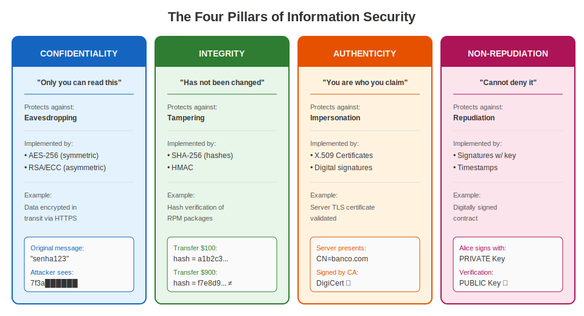
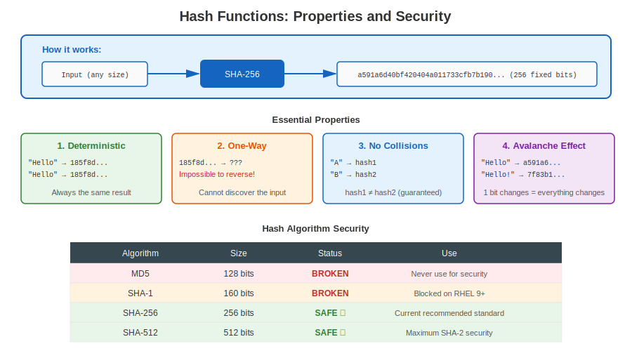
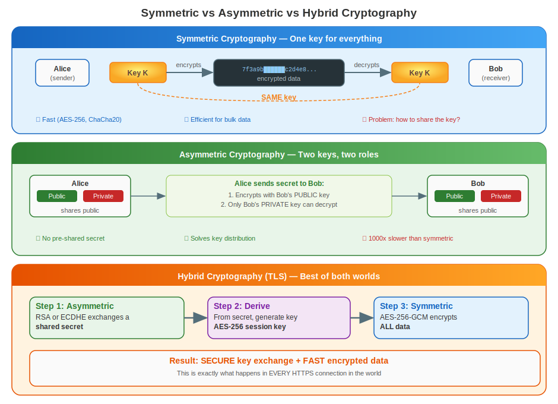
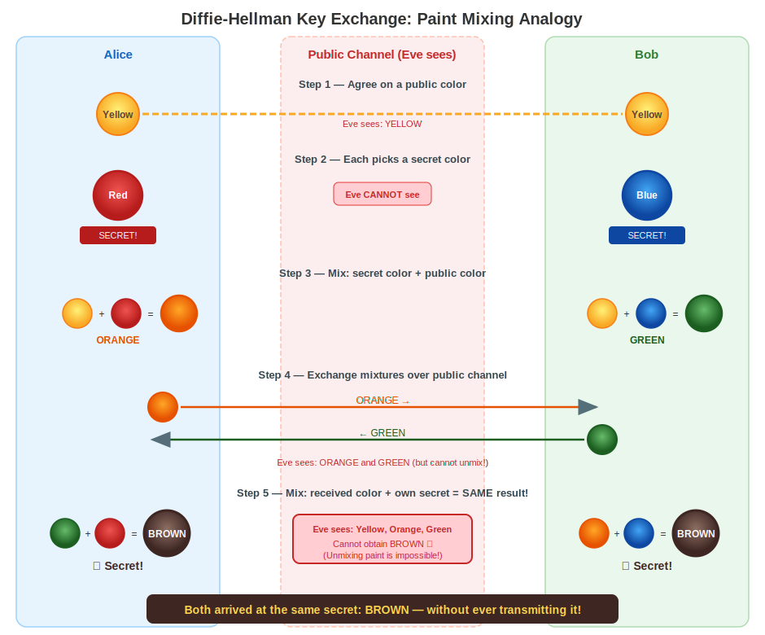
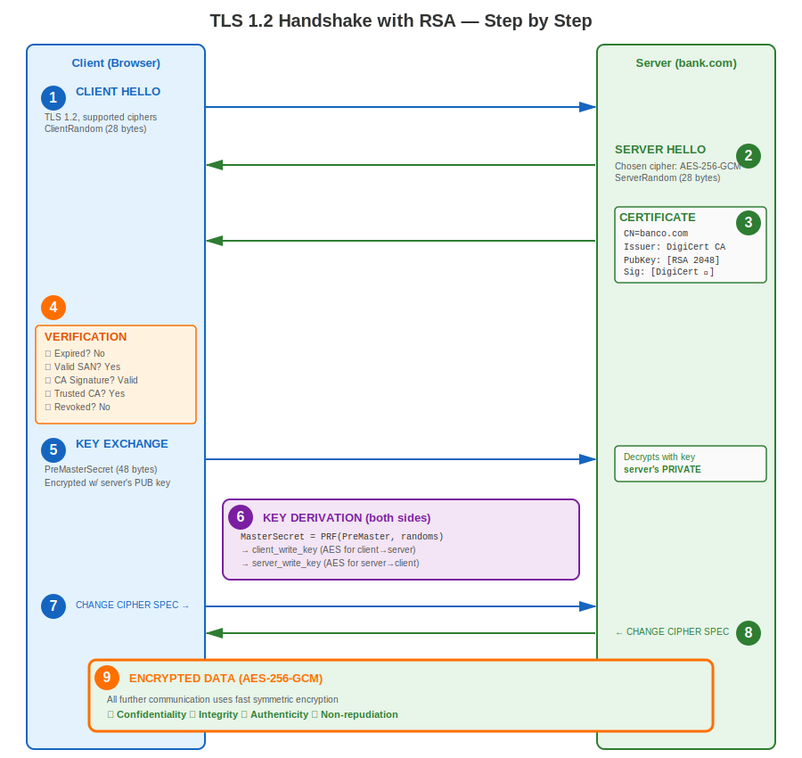
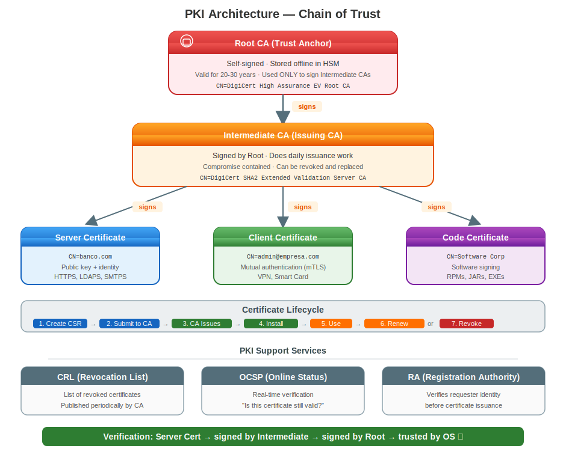
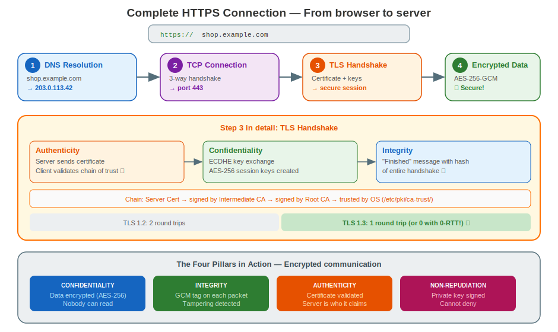

# Chapter 1: Cryptography, PKI Structure & Fundamentals

> **Before You Begin:** This chapter builds the conceptual foundation you need before touching a single certificate. By the end, you will understand *why* cryptography exists, *how* it works at a practical level, and *what* happens behind the scenes when two machines establish a secure connection.

---

## 1.1 Why Use Cryptography?

Imagine sending a postcard. Anyone who handles it—postal workers, neighbors, strangers—can read it. Now imagine the postcard contains your bank password. That is what unencrypted network traffic looks like.

Every packet traveling across a network can be **intercepted**, **read**, **modified**, or **forged**. Without cryptography:

| Threat | What happens | Real-world example |
|--------|-------------|-------------------|
| **Eavesdropping** | Attacker reads your data | Capturing passwords on public Wi-Fi |
| **Tampering** | Attacker modifies data in transit | Injecting malware into a software download |
| **Impersonation** | Attacker pretends to be someone else | Fake banking website collecting credentials |
| **Repudiation** | Sender denies having sent a message | Denying a financial transaction |

Cryptography solves **all four** of these problems. It is not optional in modern systems—it is the foundation of every secure communication.

---

## 1.2 The Four Pillars of Information Security

Cryptography provides four fundamental guarantees. Every secure system relies on a combination of these:

### Confidentiality — "Only you can read this"

Confidentiality ensures that data is readable **only by the intended recipient**. Even if an attacker intercepts the data, they see only meaningless noise.

**How it is implemented:**
- **Symmetric encryption** (AES-256): Same key encrypts and decrypts. Fast, used for bulk data.
- **Asymmetric encryption** (RSA, ECC): Public key encrypts, private key decrypts. Used for key exchange.

**What it protects against:** Eavesdropping.

### Integrity — "This has not been changed"

Integrity guarantees that data has **not been altered** between sender and receiver. If even a single bit changes, the modification is detected.

**How it is implemented:**
- **Hash functions** (SHA-256): Produce a fixed-size fingerprint of data.
- **HMAC**: Hash combined with a secret key for authenticated integrity.
- **Digital signatures**: Hash signed with a private key.

```
 Original:  "Transfer $100 to Bob"  → SHA-256 → a1b2c3d4...
 Tampered:  "Transfer $900 to Bob"  → SHA-256 → f7e8d9c0...  ← DIFFERENT!
```

**What it protects against:** Tampering.

### Authenticity — "You are who you say you are"

Authenticity proves the **identity of the communicating party**. When you connect to your bank's website, you need assurance that it is actually your bank, not an impersonator.

**How it is implemented:**
- **Digital certificates** (X.509): Bind a public key to an identity.
- **Certificate Authorities (CAs)**: Trusted third parties that verify identities.
- **Digital signatures**: Prove that a message was created by the claimed sender.

**What it protects against:** Impersonation.

### Non-Repudiation — "You cannot deny this"

Non-repudiation ensures that the sender **cannot deny** having sent a message or performed an action. This is the digital equivalent of a handwritten signature on a contract.

**How it is implemented:**
- **Digital signatures with private keys**: Only the key holder can produce the signature.
- **Timestamping**: Proves when an action occurred.
- **Audit logs with cryptographic integrity**: Tamper-evident records.

**What it protects against:** Repudiation (denying responsibility).



### Summary: The Four Pillars

| Pillar | Question it answers | Implemented by | Protects against |
|--------|-------------------|---------------|-----------------|
| **Confidentiality** | Can anyone else read this? | Encryption (AES, RSA) | Eavesdropping |
| **Integrity** | Has this been modified? | Hashes (SHA-256), HMAC | Tampering |
| **Authenticity** | Who sent this? | Certificates, signatures | Impersonation |
| **Non-repudiation** | Can the sender deny it? | Digital signatures | Repudiation |

---

## 1.3 Hash Functions: Digital Fingerprints

A hash function takes an input of **any size** and produces an output of **fixed size**. Think of it as a fingerprint for data.



### Properties and Examples

**1. Deterministic** — Same input always produces the same output.
```
SHA-256("Hello") → 185f8db32271...  (always)
SHA-256("Hello") → 185f8db32271...  (always)
```

**2. One-Way (Pre-image Resistance)** — You cannot reverse-engineer the input from the output.
```
185f8db32271... → ???  (computationally infeasible to find input)
```

**3. Collision Resistant** — It is practically impossible to find two different inputs that produce the same output.
```
SHA-256("input A") → hash1
SHA-256("input B") → hash2
hash1 ≠ hash2  (with overwhelming probability)
```

**4. Avalanche Effect** — A tiny change in input produces a completely different output.
```
SHA-256("Hello World")  → a591a6d40bf420404a011733cfb7b190...
SHA-256("Hello World!") → 7f83b1657ff1fc53b92dc18148a1d65d...
                                     ↑ completely different!
```

### Are Hashes Safe?

Not all hash algorithms are equal. Some have been **broken**:

| Algorithm | Output Size | Status | Why |
|-----------|------------|--------|-----|
| **MD5** | 128 bits | **BROKEN** | Collisions found in seconds. Never use for security. |
| **SHA-1** | 160 bits | **BROKEN** | Google demonstrated a practical collision in 2017 (SHAttered). |
| **SHA-256** | 256 bits | **SAFE** | No known practical attacks. Current standard. |
| **SHA-384** | 384 bits | **SAFE** | Higher security margin. |
| **SHA-512** | 512 bits | **SAFE** | Maximum security for SHA-2 family. |
| **SHA-3** | 256+ bits | **SAFE** | Different design (Keccak). Future-proof alternative. |
| **BLAKE2** | 256+ bits | **SAFE** | Very fast, used in modern applications. |

**"Broken" means:** An attacker can find two different inputs that produce the same hash (collision). This allows forging documents, certificates, or signatures.

```bash
# Verify for yourself — compute hashes on any RHEL system:
echo -n "Hello World" | sha256sum
# a591a6d40bf420404a011733cfb7b190d62c65bf0bcda32b57b277d9ad9f146e

echo -n "Hello World" | md5sum
# b10a8db164e0754105b7a99be72e3fe5  ← DO NOT trust this for security!
```

### Real-World Uses of Hashes

| Use case | How | Example |
|----------|-----|---------|
| **Password storage** | Store hash, not password | `/etc/shadow` on Linux |
| **File integrity** | Compare hash before/after | `sha256sum package.rpm` |
| **Digital signatures** | Sign the hash, not the data | Certificate signing |
| **Deduplication** | Identify identical files | Backup systems |
| **Blockchain** | Chain of hashes | Bitcoin proof-of-work |

---

## 1.4 Symmetric vs Asymmetric Cryptography



### Symmetric: One Key for Everything

Both sender and receiver share the **same secret key**. Like a padlock where both parties have a copy of the same key.

| Property | Value |
|----------|-------|
| **Speed** | Very fast (hardware-accelerated AES) |
| **Key size** | 128 or 256 bits |
| **Problem** | How do you share the key securely in the first place? |
| **Examples** | AES-128, AES-256, ChaCha20 |

### Asymmetric: Two Keys, Two Roles

Each party has a **key pair**: a public key (share freely) and a private key (never share).

| Property | Value |
|----------|-------|
| **Speed** | Slow (1000x slower than symmetric) |
| **Key size** | 2048–4096 bits (RSA) or 256 bits (ECC) |
| **Advantage** | No need to share a secret key beforehand |
| **Examples** | RSA, ECDSA, Ed25519 |

### Why We Need Both: Hybrid Encryption

Asymmetric cryptography solves the key distribution problem, but it is too slow for bulk data. The solution: use asymmetric to exchange a symmetric key, then use symmetric for the actual data.

This is exactly what happens in every HTTPS connection.

---

## 1.5 Understanding Key Exchange: The Color Mixing Analogy

Before diving into the real TLS/RSA handshake, let's build intuition with a visual analogy. This explains **Diffie-Hellman key exchange**, the mechanism used in modern TLS to establish a shared secret.

### The Problem

Alice and Bob want to agree on a **shared secret color** that Eve (the eavesdropper) cannot figure out, even though Eve can see everything they send each other.



### Why Eve Cannot Cheat

Mixing paint is **easy to do** but **impossible to reverse**. You cannot separate mixed paint back into its components. In mathematics, this is analogous to:

- **Easy:** Multiply two large primes → get a product (mixing)
- **Hard:** Factor a large product → find the primes (unmixing)

This is the **one-way function** that makes cryptography work.

### From Colors to Numbers

| Color Analogy | Cryptographic Equivalent |
|---------------|------------------------|
| Public color (Yellow) | Public parameters (large prime, generator) |
| Alice's secret (Red) | Alice's private key |
| Bob's secret (Blue) | Bob's private key |
| Mixed color sent (Orange/Green) | Public key (computed from private) |
| Final shared secret (Brown) | Shared session key |
| "Cannot unmix paint" | Discrete logarithm problem is computationally hard |

---

## 1.6 The TLS Handshake: How a Secure Connection Really Works

Now let's see what actually happens when your browser connects to `https://bank.com`. This combines **everything** we've learned: hashes, asymmetric crypto, symmetric crypto, certificates, and key exchange.



### Step-by-Step Walkthrough

**Step 1-2 (Hello):** Client and server exchange capabilities and random numbers. These randoms add freshness—they ensure every session is unique even between the same parties.

**Step 3 (Certificate):** The server proves its identity by sending its X.509 certificate containing its public key.

**Step 4 (Verification):** This is the critical trust step. The client walks the **chain of trust**:

Each signature is verified using the **issuer's public key**. If any link breaks, the handshake fails.

**Step 5 (Key Exchange):** The client generates 48 bytes of random data (PreMasterSecret), encrypts it with the server's public RSA key, and sends it. Only the server's private key can decrypt this—this is the asymmetric magic.

**Step 6 (Key Derivation):** Both sides independently compute the same session keys using a Pseudo-Random Function (PRF). This is where we transition from slow asymmetric to fast symmetric.

**Step 7-9 (Encrypted Communication):** From here on, everything is encrypted with AES-256—thousands of times faster than RSA.

### Modern TLS 1.3: Simpler and Faster

TLS 1.3 simplified the handshake by removing RSA key exchange (forward secrecy is now mandatory) and reducing round trips:

---

## 1.7 PKI Structure: The Trust Architecture

Public Key Infrastructure (PKI) is the system that manages digital certificates and public keys. It answers the question: **"How do I know this public key really belongs to bank.com?"**



### Why a Chain?

Root CAs are **extremely valuable**—if compromised, every certificate they ever signed becomes untrusted. So Root CAs are:
- Stored in offline, air-gapped hardware security modules (HSMs)
- Used only to sign Intermediate CA certificates
- Valid for 20-30 years

Intermediate CAs do the daily work of issuing certificates. If compromised:
- Only that Intermediate's certificates are affected
- The Root can revoke the Intermediate and create a new one
- Damage is contained

### Revocation: What Happens When Trust Breaks

When a private key is compromised or a certificate should no longer be trusted:

| Method | How it works | Trade-off |
|--------|-------------|-----------|
| **CRL** (Certificate Revocation List) | CA publishes a list of revoked serial numbers | Can be stale (updated periodically) |
| **OCSP** (Online Certificate Status Protocol) | Client asks CA "is this cert still valid?" in real-time | Requires network, privacy concern |
| **OCSP Stapling** | Server fetches its own OCSP response and attaches it to the handshake | Best of both worlds |

---

## 1.8 Putting It All Together: A Complete Example

Let's trace a complete HTTPS connection from start to finish, seeing every concept in action:



---

## 1.9 Key Takeaways

Before moving on to RHEL-specific certificate management, make sure you understand:

| Concept | One-sentence summary |
|---------|---------------------|
| **Hashes** | One-way fingerprints that detect any change (use SHA-256+). |
| **Symmetric encryption** | Same key encrypts and decrypts—fast but key distribution is hard. |
| **Asymmetric encryption** | Public/private key pairs—solves key distribution but is slow. |
| **Hybrid encryption** | Use asymmetric to exchange keys, then symmetric for data (TLS does this). |
| **Digital signatures** | Hash + private key = proof of identity and integrity. |
| **Certificates** | Bind a public key to an identity, signed by a trusted CA. |
| **PKI** | The trust architecture: Root CA → Intermediate CA → End-entity certificate. |
| **TLS handshake** | Authenticates server, exchanges keys, then encrypts everything. |
| **Forward secrecy** | Use ephemeral keys (ECDHE) so past sessions stay safe even if keys leak. |

---

**Chapter Navigation**

| | [Next: Chapter 2 - Introduction to Certificates on RHEL →](02-intro.html) |
|:---|---:|
