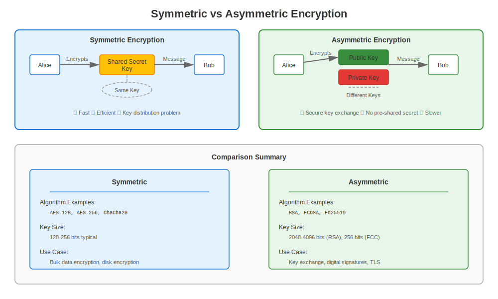
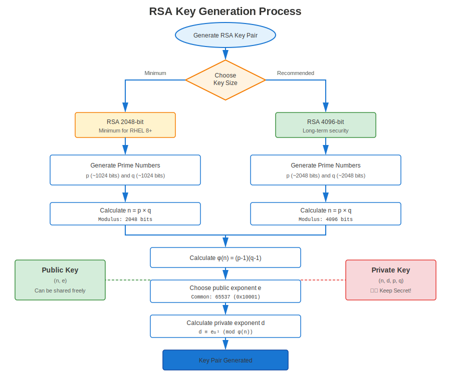
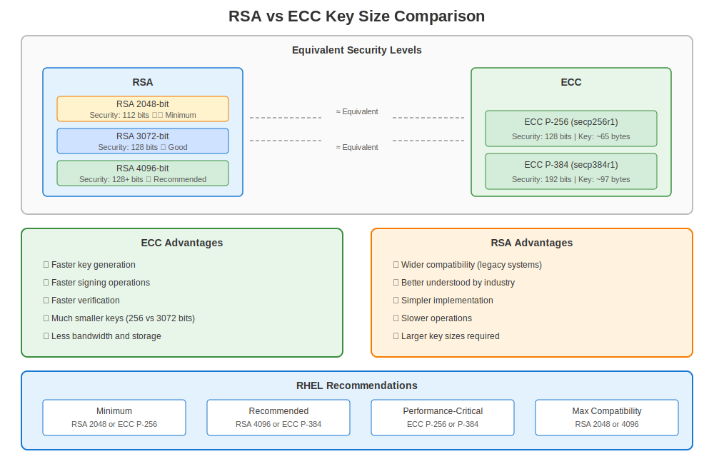

# Chapter 4: Basic Cryptography for RHEL Admins

> **Practical Focus:** Learn the cryptography concepts you need to manage certificates on RHEL - no PhD required!

## 4.1 Symmetric vs Asymmetric



Symmetric crypto (e.g., AES) relies on a *single* shared secret.  In contrast, asymmetric crypto provides two complementary keys:

* **Public key** — share freely, used for encryption or signature verification.
* **Private key** — keep secret, used for decryption or signing.

## 4.2 RSA in a Nutshell



1. Select two large primes *p* and *q*.
2. Compute modulus `n = p × q`.
3. Derive public exponent `e` and private exponent `d` such that `e × d ≡ 1 (mod φ(n))`.
4. The pair `(n, e)` is public; `(n, d)` is private.

Strength derives from the difficulty of factoring *n*.

## 4.3 Elliptic-Curve Cryptography (ECC)



ECC offers comparable security with much smaller key sizes by operating over points on elliptic curves.  Popular curves include `secp256r1` (P-256) and Curve25519.

| Algorithm | 128-bit security key size |
|-----------|---------------------------|
| RSA | 3072 bits |
| ECC | 256 bits |

## 4.4 Key Generation Lab (OpenSSL)

```bash
# Generate 3072-bit RSA private key
openssl genpkey -algorithm RSA -pkeyopt rsa_keygen_bits:3072 -out rsa.key.pem

# Extract public key
openssl pkey -in rsa.key.pem -pubout -out rsa.pub.pem

# Generate P-256 EC key-pair
openssl ecparam -genkey -name prime256v1 -out ec.key.pem
openssl pkey -in ec.key.pem -pubout -out ec.pub.pem
```

We will reuse these keys in later chapters to create certificates.

## 4.5 Hybrid Encryption

In TLS a symmetric session key is exchanged *using* asymmetric crypto (RSA or ECDHE).  This yields the best of both worlds: efficiency and secure key exchange.

---

## 4.6 RHEL-Specific Considerations

### Key Generation on RHEL by Version

**RHEL 7 (OpenSSL 1.0.2k):**
```bash
# Old style (still works on all versions)
openssl genrsa -out server.key 2048

# Extract public key
openssl rsa -in server.key -pubout -out server.pub
```

**RHEL 8+ (OpenSSL 1.1.1k / 3.5.5):**
```bash
# Modern style (recommended)
openssl genpkey -algorithm RSA -out server.key -pkeyopt rsa_keygen_bits:2048

# Extract public key
openssl pkey -in server.key -pubout -out server.pub
```

### Minimum Key Sizes by RHEL Version

| RHEL Version | Minimum RSA | Minimum ECC | Enforced By |
|--------------|-------------|-------------|-------------|
| RHEL 7 | None (weak allowed) | None | Manual config |
| RHEL 8 | 2048 bits | P-256 | crypto-policy DEFAULT |
| RHEL 9 | 2048 bits | P-256 | crypto-policy DEFAULT |
| RHEL 10 | 2048 bits | P-256 | crypto-policy DEFAULT |

**Recommendation:** Always use RSA 2048+ or ECC P-256+ for compatibility!

### Testing on RHEL

```bash
# Generate test key pair (RHEL 8+)
openssl genpkey -algorithm RSA -out test.key -pkeyopt rsa_keygen_bits:2048

# Verify key
openssl pkey -in test.key -text -noout

# Create test data
echo "Hello RHEL" > message.txt

# Sign with private key
openssl dgst -sha256 -sign test.key -out message.sig message.txt

# Verify with public key
openssl dgst -sha256 -verify test.pub -signature message.sig message.txt
# Verified OK
```

---

## Quick Reference

```
┌─────────────────────────────────────────────────────────┐
│ CRYPTOGRAPHY FOR RHEL ADMINS                            │
├─────────────────────────────────────────────────────────┤
│ Asymmetric:   Public key (share) + Private key (secret) │
│ Algorithms:   RSA, ECC (Elliptic Curve)                 │
│                                                         │
│ RSA Sizes:    2048 bits (minimum on RHEL 8+)            │
│               4096 bits (recommended)                   │
│                                                         │
│ ECC Curves:   P-256 (secp256r1) - minimum               │
│               P-384 (secp384r1) - recommended           │
│                                                         │
│ RHEL 7:       openssl genrsa -out key 2048              │
│ RHEL 8/9/10:  openssl genpkey -algorithm RSA -out key   │
│                                                         │
│ Use case:     TLS/SSL certificates                      │
│ Security:     Private key MUST be protected (chmod 600) │
└─────────────────────────────────────────────────────────┘
```

---

## 🧪 Hands-On Lab

**Lab 02: Key Generation**

Practice generating cryptographic key pairs in this hands-on exercise:
- Generate RSA keys (2048-bit and 4096-bit)
- Generate ECC keys (P-256 and P-384)
- Extract public keys from private keys
- Compare key sizes and performance

- 📁 **Location:** `labs/en_US/02-key-generation/`
- ⏱️ **Time:** 20-25 minutes
- 🎯 **Level:** Beginner

---

**Chapter Navigation**

| [← Previous: Chapter 3 - RHEL Certificate Tools Overview](03-rhel-tools-overview.md) | [Next: Chapter 5 - X.509 Certificates on RHEL →](05-x509-on-rhel.md) |
|:---|---:|
