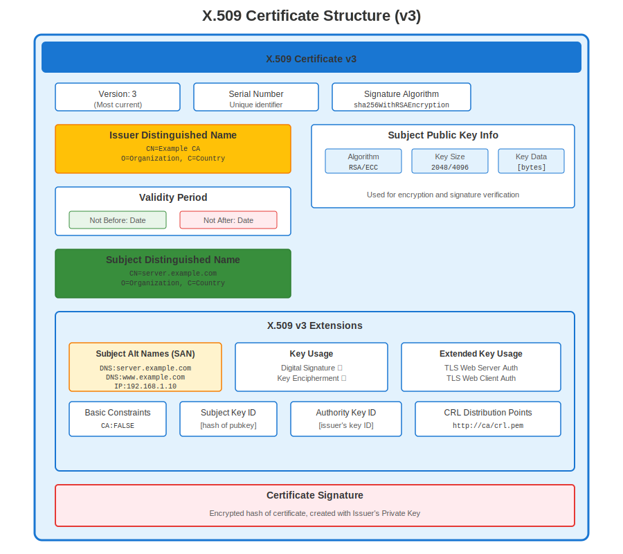
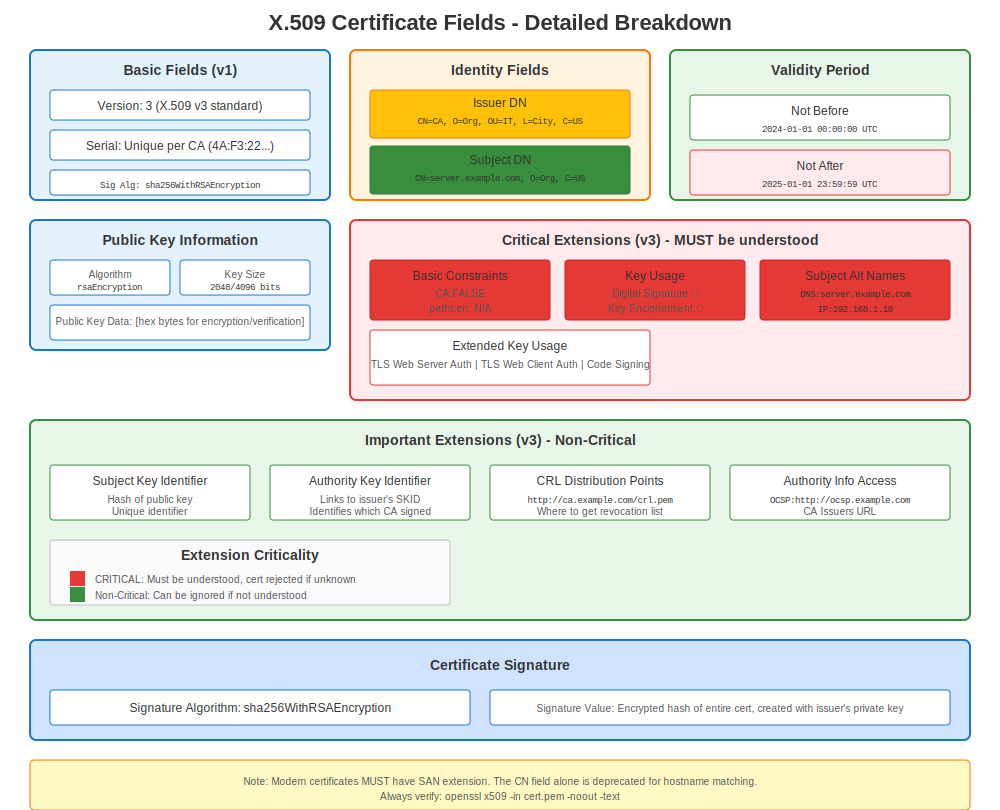
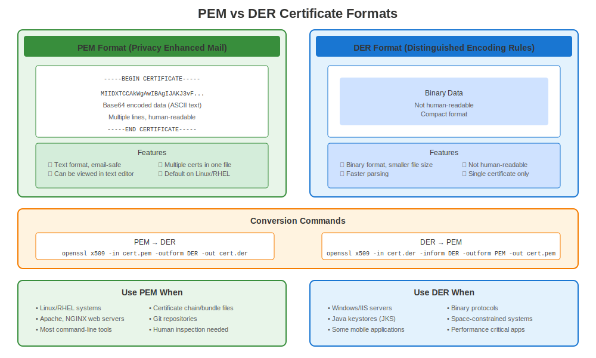

# Chapter 5: X.509 Certificates on RHEL

> **Standard Format:** X.509 is the certificate standard used everywhere on RHEL. Learn its structure and how to work with it on Red Hat systems.

## 5.1 Origins of the Standard

X.509 emerged from the X.500 directory project (ITU-T, 1988) to define a standard *identity certificate*—a document that binds a public key to a subject name, signed by a trusted authority.

## 5.2 Certificate Anatomy



| Field | Purpose |
|-------|---------|
| Version | Usually v3 (adds extensions) |
| Serial Number | Unique per CA |
| Signature Algorithm | e.g., `sha256WithRSAEncryption` |
| Issuer | Distinguished Name (DN) of CA |
| Validity | `Not Before` & `Not After` dates |
| Subject | DN of entity (CN, O, C…) |
| Subject Public Key Info | Algorithm + Key |
| Extensions | Key Usage, SAN, CRL DP, etc. |
| Signature | CA’s digital signature |



## 5.3 Common Extensions

* **Subject Alternative Name (SAN)** — Hosts/IPs bound to cert.
* **Key Usage / Extended Key Usage** — Permitted operations (TLS server, code signing…).
* **Basic Constraints** — Indicates if cert can sign others (`CA:TRUE`).

## 5.4 Viewing a Certificate

```bash
openssl x509 -in server.crt -noout -text
```

Observe each section matches the table above.

## 5.5 PEM vs DER Encodings



* **PEM** — Base64 + `-----BEGIN CERTIFICATE-----` headers (most common on RHEL).
* **DER** — Binary ASN.1, useful for embedded devices.

---

## 5.6 X.509 on RHEL Systems

### Certificate Locations on RHEL

```bash
# Standard RHEL certificate locations
/etc/pki/tls/certs/          # Server certificates (public)
/etc/pki/tls/private/        # Private keys (mode 600!)
/etc/pki/ca-trust/           # Trusted CA certificates
/etc/pki/nssdb/              # NSS database (Firefox, etc.)

# Service-specific locations
/etc/httpd/conf/ssl.crt/     # Apache (alternative)
/etc/nginx/certs/            # NGINX (custom)
/var/lib/pgsql/data/         # PostgreSQL
/etc/openldap/certs/         # OpenLDAP
```

### Viewing Certificates on RHEL

```bash
# View full certificate details
openssl x509 -in /etc/pki/tls/certs/server.crt -noout -text

# Quick checks (RHEL sysadmin focus)
openssl x509 -in server.crt -noout -subject             # Who is it for?
openssl x509 -in server.crt -noout -issuer              # Who signed it?
openssl x509 -in server.crt -noout -dates               # When is it valid?
openssl x509 -in server.crt -noout -ext subjectAltName  # SANs (critical!)

# Check if expired
openssl x509 -in server.crt -noout -checkend 0
# Exit 0 = valid, Exit 1 = expired
```

### RHEL Version Differences for X.509

| RHEL Version | OpenSSL | Validation Strictness | Key Changes |
|--------------|---------|----------------------|-------------|
| **RHEL 7** | 1.0.2k | Standard | SANs recommended |
| **RHEL 8** | 1.1.1k | Stricter | SANs strongly recommended |
| **RHEL 9** | 3.5.5 | Very strict | SANs required, SHA-1 blocked |
| **RHEL 10** | 3.5.5 | Very strict | Same as RHEL 9 |

**Key Point:** Modern browsers and RHEL 9+ **require** SANs (Subject Alternative Names)!

### Creating X.509 Certificates on RHEL

```bash
# Complete workflow on RHEL

# Step 1: Generate private key
openssl genpkey -algorithm RSA -out server.key -pkeyopt rsa_keygen_bits:2048

# Step 2: Create CSR (Certificate Signing Request)
openssl req -new -key server.key -out server.csr \
  -subj "/C=US/ST=State/O=Company/CN=server.example.com" \
  -addext "subjectAltName=DNS:server.example.com,DNS:www.example.com"

# Step 3: Self-signed (testing only!)
openssl x509 -req -days 365 -in server.csr -signkey server.key -out server.crt

# Step 4: View your X.509 certificate
openssl x509 -in server.crt -noout -text

# Step 5: Install on RHEL
sudo cp server.crt /etc/pki/tls/certs/
sudo cp server.key /etc/pki/tls/private/
sudo chmod 600 /etc/pki/tls/private/server.key
```

---

## Quick Reference

```
┌─────────────────────────────────────────────────────────────────┐
│ X.509 CERTIFICATES ON RHEL                                      │
├─────────────────────────────────────────────────────────────────┤
│ Standard:  X.509 v3 (with extensions)                           │
│ Encoding:  PEM (Base64, human-readable)                         │
│                                                                 │
│ View:      openssl x509 -in cert.crt -noout -text               │
│ Subject:   openssl x509 -in cert.crt -noout -subject            │
│ Expiry:    openssl x509 -in cert.crt -noout -dates              │
│ SANs:      openssl x509 -in cert.crt -noout -ext subjectAltName │
│                                                                 │
│ Location:  /etc/pki/tls/certs/ (certificates)                   │
│            /etc/pki/tls/private/ (keys, mode 600!)              │
│                                                                 │
│ Critical:  SANs are REQUIRED on RHEL 9+                         │
│            SHA-256+ signature required on RHEL 8+               │
└─────────────────────────────────────────────────────────────────┘
```

---

## 🧪 Hands-On Lab

**Lab 04: X.509 Certificates**

Create self-signed certificates, generate CSRs, inspect certificates, and convert formats

- 📁 **Location:** `labs/en_US/04-x509-certificates/`
- ⏱️ **Time:** 25-30 minutes
- 🎯 **Level:** Beginner

---

**Chapter Navigation**

| [← Previous: Chapter 4 - Basic Cryptography for RHEL Admins](04-basic-cryptography.md) | [Next: Chapter 6 - RHEL Trust Store Deep Dive →](06-rhel-trust-store.md) |
|:---|---:|
