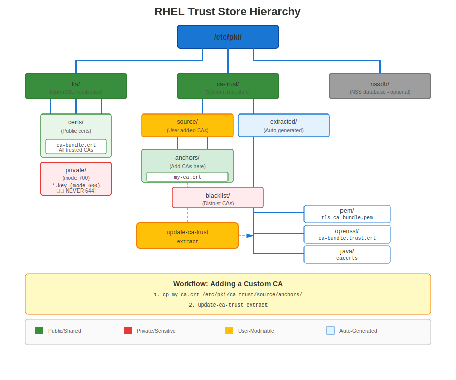
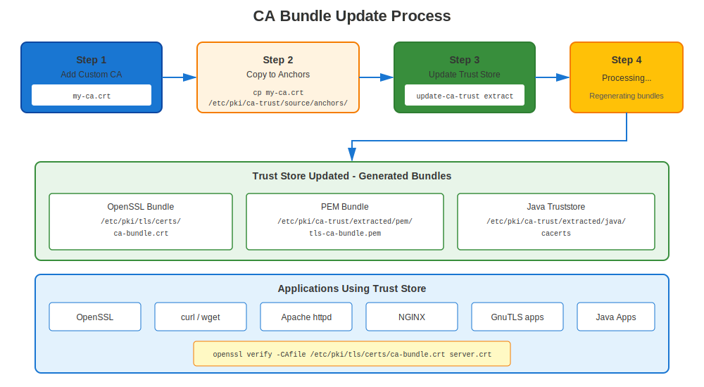

# Chapter 6: RHEL Trust Store Deep Dive

> **Trust Architecture:** Understanding how RHEL validates certificates and manages trusted CAs is essential for troubleshooting certificate problems. This chapter goes beyond the basics: it covers the internal mechanics of `update-ca-trust`, how p11-kit processes trust sources, what happens with duplicate certificates, and how to debug trust issues with `trust list`.

## 6.1 RHEL Trust Store Architecture



### How RHEL Validates Certificates

When any application on RHEL validates a certificate:

1. **Check certificate signature** using issuer's public key
2. **Find issuer certificate** in trust store
3. **Repeat until reaching trusted root** CA
4. **Verify root CA is trusted** by RHEL system

**Trust store location:** `/etc/pki/ca-trust/`

### The Role of p11-kit

RHEL's trust store is not a flat file that applications read directly. It is a managed system built on top of **p11-kit**, which provides a PKCS#11 trust module. The key components are:

| Component | Role |
|-----------|------|
| `p11-kit` | Middleware that loads trust modules and exposes them via PKCS#11 |
| `p11-kit-trust` | The trust module (`/usr/lib64/pkcs11/p11-kit-trust.so`) that reads source certificates |
| `update-ca-trust` | Shell script that invokes `p11-kit extract` to regenerate extracted bundles |
| `trust` | CLI front-end to inspect and modify trust objects managed by p11-kit |

Applications like `curl`, `wget`, OpenSSL, GnuTLS, and NSS all consume the **extracted** bundles. They never read the source directories directly.

---

## 6.2 Trust Store Directory Structure

**RHEL 7/8:**
```
/etc/pki/ca-trust/
├── source/
│   ├── anchors/                   ← Admin-added trusted CA certificates
│   ├── blacklist/                 ← Admin-added distrusted certificates
│   └── ca-bundle.legacy.crt       ← Legacy bundle (compatibility only)
├── extracted/
│   ├── pem/
│   │   ├── tls-ca-bundle.pem      ← For TLS clients (curl, wget, Python...)
│   │   ├── email-ca-bundle.pem    ← For S/MIME email validation
│   │   └── objsign-ca-bundle.pem  ← For code signing verification
│   ├── openssl/
│   │   └── ca-bundle.trust.crt    ← OpenSSL "trusted certificate" format
│   ├── java/
│   │   └── cacerts                ← Java JKS keystore
│   └── edk2/
│       └── cacerts.bin            ← UEFI firmware format
└── README

/usr/share/pki/ca-trust-source/
├── anchors/                       ← Package-provided trust anchors (from RPMs)
├── blacklist/                     ← Package-provided distrusted certificates
└── ca-bundle.trust.p11-kit        ← Mozilla CA bundle shipped by ca-certificates RPM
```

**RHEL 9/10+:** The `blacklist/` directory was renamed to `blocklist/`:
```
/etc/pki/ca-trust/
├── source/
│   ├── anchors/                   ← Admin-added trusted CA certificates
│   ├── blocklist/                 ← Admin-added distrusted certificates
│   └── ca-bundle.legacy.crt       ← Legacy bundle (compatibility only)
├── extracted/
│   └── (same structure as above)
└── README

/usr/share/pki/ca-trust-source/
├── anchors/                       ← Package-provided trust anchors (from RPMs)
├── blocklist/                     ← Package-provided distrusted certificates
└── ca-bundle.trust.p11-kit        ← Mozilla CA bundle shipped by ca-certificates RPM
```

> **Naming convention:** Throughout this chapter, `blacklist/` refers to the RHEL 7/8 directory name and `blocklist/` refers to the RHEL 9/10+ directory name. Both serve the same purpose. When you see a path like `source/blacklist/`, substitute `source/blocklist/` on RHEL 9+.

### Source Directories Priority

The `update-ca-trust` pipeline reads certificates from multiple source directories, processed in a defined order:

| Priority | Directory | Managed by |
|----------|-----------|------------|
| 1 (lowest) | `/usr/share/pki/ca-trust-source/` | RPM packages (`ca-certificates`) |
| 2 (highest) | `/etc/pki/ca-trust/source/` | System administrator |

Within each location:

- `anchors/` — Certificates placed here are treated as **trusted CAs**
- `blacklist/` (RHEL 7/8) or `blocklist/` (RHEL 9+) — Certificates placed here are treated as **explicitly distrusted**

The `/etc/pki/` paths always override `/usr/share/pki/` paths. This follows the standard RHEL convention: `/usr/share/` holds package defaults, `/etc/` holds admin customizations.

---

## 6.3 What Happens When You Run `update-ca-trust`

### The Execution Pipeline

`update-ca-trust` is a shell script (inspect it yourself: `cat /usr/bin/update-ca-trust`). When you execute `sudo update-ca-trust`, the following sequence occurs:

**Step 1: Collect all trust sources**

p11-kit reads every certificate file from these directories:

```
/usr/share/pki/ca-trust-source/anchors/
/usr/share/pki/ca-trust-source/blacklist/    ← RHEL 7/8
/usr/share/pki/ca-trust-source/blocklist/    ← RHEL 9+
/usr/share/pki/ca-trust-source/ca-bundle.trust.p11-kit
/etc/pki/ca-trust/source/anchors/
/etc/pki/ca-trust/source/blacklist/          ← RHEL 7/8
/etc/pki/ca-trust/source/blocklist/          ← RHEL 9+
```

It accepts PEM (`.pem`, `.crt`), DER (`.der`), and p11-kit trust objects (`.p11-kit`) formats.

**Step 2: Parse trust attributes**

For each certificate, p11-kit determines its trust disposition. The PEM format of the certificate file matters:

- **`-----BEGIN TRUSTED CERTIFICATE-----`** (OpenSSL "trusted" format) — Contains the certificate **plus** auxiliary trust data: explicit lists of trusted and rejected key usage OIDs. p11-kit reads these embedded trust/reject attributes directly.
- **`-----BEGIN CERTIFICATE-----`** (plain PEM) or DER — Contains **only** the certificate with no trust metadata. p11-kit assigns trust based solely on the directory where the file is placed (`anchors/` = trusted, `blacklist/`/`blocklist/` = distrusted).
- **`.p11-kit` format files** — Contain PKCS#11 trust objects with fine-grained attributes (`trusted`, `x-distrusted`, purpose OIDs). Used by the `ca-bundle.trust.p11-kit` file shipped with the `ca-certificates` package.

> **Critical:** The `BEGIN TRUSTED CERTIFICATE` and `BEGIN CERTIFICATE` formats are **not interchangeable**. A `BEGIN TRUSTED CERTIFICATE` file carries auxiliary trust data — explicit lists of trusted and/or rejected use OIDs. When no uses are listed (empty trust attributes), p11-kit interprets this as "trusted for nothing" — effectively distrusted. If the same certificate also exists as a plain `BEGIN CERTIFICATE` (which implies trust for all purposes), p11-kit detects contradictory trust assertions and **marks the certificate as distrusted**. This conflict occurs in two cases: (1) the `BEGIN TRUSTED CERTIFICATE` has explicit rejected uses, or (2) it has **empty** trust attributes (no trusted uses, no rejected uses). See Section 6.6 for details.

**Step 3: Merge and resolve conflicts**

When the same certificate (matched by its DER-encoded content) appears in multiple source locations, p11-kit applies merge rules:

1. **Distrust wins over trust.** If a certificate appears in both `anchors/` and `blacklist/`/`blocklist/`, it is distrusted.
2. **Admin overrides packages.** Trust attributes set in `/etc/pki/ca-trust/source/` override those from `/usr/share/pki/ca-trust-source/`.
3. **Explicit attributes override defaults.** A `.p11-kit` file with specific purpose restrictions overrides the blanket trust given to a plain PEM in `anchors/`.
4. **Conflicting trust formats cause distrust.** If the same certificate (identical fingerprint) appears as both `BEGIN TRUSTED CERTIFICATE` (or `.p11-kit`) and `BEGIN CERTIFICATE`, distrust occurs in **two** cases:
   - The `BEGIN TRUSTED CERTIFICATE` has **explicit rejected uses** — the rejection contradicts the plain PEM's implicit full trust.
   - The `BEGIN TRUSTED CERTIFICATE` has **empty trust attributes** (no trusted uses, no rejected uses) — p11-kit interprets "no uses listed" as "trusted for nothing," which contradicts the plain PEM's implicit "trusted for all purposes."

   In both cases, p11-kit **marks the certificate as distrusted**.

> **This is the single most common cause of unexpected distrust.** An administrator copies a plain PEM file into `source/anchors/` not realizing that the same certificate already exists in `ca-bundle.trust.p11-kit` with rejected use attributes or empty trust. The result: the CA is distrusted after `update-ca-trust`, and services that depend on it break silently.

**Step 4: Extract to format-specific bundles**

p11-kit runs extraction commands for each output format:

```bash
# PEM bundle for TLS (most commonly consumed)
p11-kit extract --format=pem-bundle \
    --filter=ca-anchors \
    --overwrite \
    --purpose=server-auth \
    /etc/pki/ca-trust/extracted/pem/tls-ca-bundle.pem

# PEM bundle for email (S/MIME)
p11-kit extract --format=pem-bundle \
    --filter=ca-anchors \
    --overwrite \
    --purpose=email-protection \
    /etc/pki/ca-trust/extracted/pem/email-ca-bundle.pem

# PEM bundle for code signing
p11-kit extract --format=pem-bundle \
    --filter=ca-anchors \
    --overwrite \
    --purpose=code-signing \
    /etc/pki/ca-trust/extracted/pem/objsign-ca-bundle.pem

# OpenSSL "trusted certificate" format (includes trust/reject attributes)
p11-kit extract --format=openssl-bundle \
    --filter=certificates \
    --overwrite \
    /etc/pki/ca-trust/extracted/openssl/ca-bundle.trust.crt

# Java keystore
p11-kit extract --format=java-cacerts \
    --filter=ca-anchors \
    --overwrite \
    --purpose=server-auth \
    /etc/pki/ca-trust/extracted/java/cacerts

# UEFI EDK2 format
p11-kit extract --format=edk2-cacerts \
    --filter=ca-anchors \
    --overwrite \
    --purpose=server-auth \
    /etc/pki/ca-trust/extracted/edk2/cacerts.bin
```

**Step 5: Update compatibility symlinks**

The system maintains symlinks so that legacy paths point to the extracted bundles:

```bash
/etc/pki/tls/certs/ca-bundle.crt → /etc/pki/ca-trust/extracted/pem/tls-ca-bundle.pem
/etc/pki/tls/certs/ca-bundle.trust.crt → /etc/pki/ca-trust/extracted/openssl/ca-bundle.trust.crt
/etc/pki/java/cacerts → /etc/pki/ca-trust/extracted/java/cacerts
```

### `update-ca-trust` vs `update-ca-trust extract`

These are **functionally identical**. The `update-ca-trust` script accepts `extract` as a subcommand, but running `update-ca-trust` with no arguments defaults to the `extract` action. There is no difference in behavior.

```bash
# These two commands produce identical results:
sudo update-ca-trust
sudo update-ca-trust extract
```

The `extract` subcommand exists for explicitness in scripts and documentation. Historically, `update-ca-trust` also supported `enable` and `disable` subcommands (to switch between the new p11-kit-managed trust store and the legacy flat-file approach), but those are no longer relevant on modern RHEL systems where p11-kit management is always active.

```bash
# Check current status (informational only on modern RHEL)
update-ca-trust check
```

### Verifying What Changed

After running `update-ca-trust`, you can verify the result:

```bash
# Count trusted CAs in the PEM bundle
grep -c '^-----BEGIN CERTIFICATE-----' /etc/pki/ca-trust/extracted/pem/tls-ca-bundle.pem

# List all trusted CAs via p11-kit
trust list --filter=ca-anchors | grep "label:" | wc -l

# Check if a specific CA is present
trust list | grep -A 4 "My Company CA"
```

---

## 6.4 Adding Custom CA Certificates



### Step-by-Step

```bash
# Step 1: Copy CA certificate (PEM or DER format)
sudo cp company-ca.crt /etc/pki/ca-trust/source/anchors/

# Step 2: Update trust store
sudo update-ca-trust

# Step 3: Verify addition
trust list | grep -i "company"

# Step 4: Test
curl https://internal-server.example.com
```

**Works identically on RHEL 7, 8, 9, 10.**

### Adding with Purpose Restrictions

If a CA should only be trusted for TLS server authentication (not email signing or code signing), use the `trust` command instead of the simple file copy approach:

```bash
# Trust only for TLS server authentication
sudo trust anchor --store /path/to/company-ca.crt

# Or with explicit purpose restriction via p11-kit format
# Create a .p11-kit file with restricted trust:
cat > /tmp/company-ca.p11-kit <<'EOF'
[p11-kit-object-v1]
class: x-certificate-extension
label: "My Company CA"
x-public-key-info: <extracted-from-cert>

[p11-kit-object-v1]
class: certificate
label: "My Company CA"
certificate-type: x-509
java-midp-security-domain: 0
trusted: true
x-distrusted: false

[p11-kit-object-v1]
class: x-certificate-extension
label: "My Company CA"
object-id: 2.5.29.37
value: "%06%08%2b%06%01%05%05%07%03%01"
EOF
```

The `trust anchor --store` command handles this automatically and is the recommended approach on RHEL 8+.

---

## 6.5 RHEL Version Trust Store Features

### Trust Management Evolution

| RHEL Version | trust Command | Distrusting | Distrust Directory | Notes |
|--------------|---------------|-------------|-------------------|-------|
| **RHEL 7** | Basic | Limited | `blacklist/` | Manual management |
| **RHEL 8** | Enhanced | Full support | `blacklist/` | p11-kit integration |
| **RHEL 9** | Enhanced | Full support | **`blocklist/`** | Renamed from `blacklist/` |
| **RHEL 10** | Enhanced | Full support | **`blocklist/`** | Same as RHEL 9 |

**RHEL 8+ Enhancement:**
```bash
# Advanced trust management (RHEL 8+)
trust anchor /path/to/ca.crt --purpose server-auth
trust anchor --remove "pkcs11:id=%CERT_ID%"
trust list --filter=ca-anchors

# Distrust a compromised CA
# RHEL 7/8:
sudo cp compromised.crt /etc/pki/ca-trust/source/blacklist/
# RHEL 9+:
sudo cp compromised.crt /etc/pki/ca-trust/source/blocklist/

sudo update-ca-trust
```

---

## 6.6 Duplicate Certificates: What Happens and How to Handle Them

### PEM Format Variants and Trust Implications

Before discussing duplicates, it is essential to understand the three PEM header formats RHEL uses, because the format itself carries trust semantics:

| PEM Header | Trust Data | Where It Appears |
|------------|-----------|------------------|
| `-----BEGIN CERTIFICATE-----` | **None** — raw X.509 certificate only | Files you download, CSR responses, manual exports |
| `-----BEGIN TRUSTED CERTIFICATE-----` | **Embedded** — includes auxiliary trust/reject OID lists | OpenSSL extracted bundle (`ca-bundle.trust.crt`), some vendor-provided files |
| `.p11-kit` format (not PEM) | **Structured** — PKCS#11 trust objects with fine-grained attributes | `ca-bundle.trust.p11-kit` shipped by `ca-certificates` RPM |

You can inspect the trust attributes embedded in a `BEGIN TRUSTED CERTIFICATE` file:

```bash
# Show the auxiliary trust data
openssl x509 -in cert.crt -noout -text -trustout 2>/dev/null | grep -A 5 "Trusted Uses\|Rejected Uses"
```

A `BEGIN TRUSTED CERTIFICATE` file with "Rejected Uses: TLS Web Server Authentication" and a `BEGIN CERTIFICATE` file for the same cert (which carries no rejection information) are **contradictory** from p11-kit's perspective. The same applies to a `BEGIN TRUSTED CERTIFICATE` with **no trust/reject uses at all** — p11-kit interprets empty trust as "trusted for nothing," which contradicts the implicit full trust of a plain `BEGIN CERTIFICATE`.

### Understanding "Duplicate" Certificates

Two certificates can be duplicates at different levels:

| Match Level | What It Means | How p11-kit Treats It |
|-------------|---------------|----------------------|
| **Identical DER encoding, same format** | Byte-for-byte same certificate, same trust wrapping | Deduplicated — appears once in output |
| **Identical DER encoding, different trust format** | Same certificate but one has `BEGIN TRUSTED CERTIFICATE` / `.p11-kit` attributes and the other has `BEGIN CERTIFICATE` | **DISTRUSTED if the trusted format has rejected uses OR empty trust attributes (no uses listed = "trusted for nothing")** |
| **Same Subject + Serial + Issuer, different DER** | Same logical certificate but re-encoded | Treated as **separate objects** — both are loaded |
| **Same Subject DN, different Serial** | Different certificates for the same entity (e.g., reissued CA) | Both valid, both loaded independently |

The critical distinction: **p11-kit matches duplicates by DER-encoded certificate content**, not by metadata fields. However, "matching" the DER content is only half the story — what happens next depends entirely on whether the **trust wrapping formats agree**:

- If the raw certificate DER bytes are identical **and** all sources agree on trust disposition → deduplicated, trusted
- If the raw certificate DER bytes are identical **but** one source has **rejected use OIDs** embedded and the other does not → **contradictory trust assertions → DISTRUSTED**
- If the raw certificate DER bytes are identical **but** one source has `BEGIN TRUSTED CERTIFICATE` with **empty trust attributes** (no trusted uses, no rejected uses) → p11-kit interprets this as "trusted for nothing" → **contradicts implicit full trust → DISTRUSTED**
- If the raw certificate DER bytes are identical and one source has `BEGIN TRUSTED CERTIFICATE` with **explicit trusted uses only** (no rejected uses) → certificate is accepted with the specified trust purposes
- If the raw certificate DER bytes differ (even by a single byte) → p11-kit treats them as **separate certificates** and both are included

### Scenario: Conflicting Trust Formats (Most Dangerous)

This is the single most common and most damaging "duplicate" problem. It happens silently when an administrator copies a certificate into `source/anchors/` not realizing the same certificate already exists in the system bundle with **rejected use OIDs** or **empty trust attributes** in its trust data.

**Example:**

```
/usr/share/pki/ca-trust-source/ca-bundle.trust.p11-kit
  → Contains "My Corp CA" as a p11-kit trust object with specific trust attributes
    INCLUDING rejected uses (e.g., "Rejected Uses: TLS Web Server Authentication")
    OR with empty trust attributes (no trusted uses, no rejected uses listed)

/etc/pki/ca-trust/source/anchors/my-corp-ca.crt
  → Same "My Corp CA" as plain PEM (-----BEGIN CERTIFICATE-----)
    (no trust attributes — relies on directory placement for implicit trust)
```

**Result:** The same certificate DER content now has **contradictory trust descriptions**. The p11-kit trust object either explicitly rejects certain uses, or lists no uses at all (which p11-kit interprets as "trusted for nothing"). The plain PEM carries no trust metadata, implying trust for all purposes. p11-kit cannot reconcile these contradictions, and **marks the certificate as distrusted**. After running `update-ca-trust`:

- The certificate disappears from `tls-ca-bundle.pem`
- `trust list` shows it with `trust: distrusted`
- All services relying on this CA start failing with `certificate verify failed`

This same problem occurs with the OpenSSL `BEGIN TRUSTED CERTIFICATE` format when it contains rejected uses OR empty trust:

```
/etc/pki/ca-trust/extracted/openssl/ca-bundle.trust.crt
  → Contains the certificate as -----BEGIN TRUSTED CERTIFICATE-----
    (with "Rejected Uses" OIDs embedded, OR with no trust/reject uses at all)

/etc/pki/ca-trust/source/anchors/certificate.crt
  → Same certificate as -----BEGIN CERTIFICATE-----
    (no embedded trust data — no rejection information)
```

**Result:** Same outcome — the rejection or empty trust in one source contradicts the implicit full trust in the other, certificate marked as **distrusted**.

> **Key insight:** In a `BEGIN TRUSTED CERTIFICATE`, "no trust/reject uses listed" does **NOT** mean "trusted for all purposes." It means "trusted for **nothing**." This is the critical distinction from a plain `BEGIN CERTIFICATE` in `anchors/`, where directory placement grants implicit full trust. To debug, search for duplicate certificates across `/etc/pki/ca-trust/source/` and `/usr/share/pki/ca-trust-source/` and check if any `BEGIN TRUSTED CERTIFICATE` exists with no Reject or empty trust that would conflict with a plain PEM copy.

**How to fix it:**

```bash
# Option 1: Remove the plain PEM duplicate from anchors/
sudo rm /etc/pki/ca-trust/source/anchors/my-corp-ca.crt
sudo update-ca-trust

# Option 2: If you NEED the cert in anchors/, convert it to the
# trusted format matching the existing trust attributes:
openssl x509 -in my-corp-ca.crt -addtrust serverAuth \
    -addtrust emailProtection -out my-corp-ca-trusted.crt
sudo cp my-corp-ca-trusted.crt /etc/pki/ca-trust/source/anchors/
sudo update-ca-trust

# Verify the fix
trust list --filter=ca-anchors | grep -A 3 "My Corp CA"
```

### Scenario: Explicit Distrusting

```
/usr/share/pki/ca-trust-source/ca-bundle.trust.p11-kit
  → Contains "Legacy Corp CA" with full trust

/etc/pki/ca-trust/source/blacklist/legacy-corp-ca.crt    ← RHEL 7/8
/etc/pki/ca-trust/source/blocklist/legacy-corp-ca.crt    ← RHEL 9+
  → Same "Legacy Corp CA" as plain PEM, placed in distrust directory
```

**Result:** Distrust wins by design. The certificate is excluded from `tls-ca-bundle.pem` and marked as distrusted in the OpenSSL bundle. This is the expected behavior when an admin intentionally distrusts a CA.

### Scenario: Nearly Identical Certificates (Different DER)

A subtler problem occurs when two certificates look the same but are not byte-for-byte identical:

- A CA certificate was downloaded from two different sources with slightly different PEM line wrapping
- A CA certificate was re-encoded (PEM → DER → PEM) and gained different header metadata
- A CA was reissued with the same Subject DN but a new key pair and serial number

In these cases, p11-kit treats them as **distinct certificates**, and both end up in the extracted bundles. This can cause:

- Confusing `trust list` output with apparent duplicates
- Increased bundle size (cosmetic issue)
- Chain building confusion if one copy is distrusted and the other is trusted but they have different DER content

### How to Detect Duplicate Certificates

**Method 1: Fingerprint + format comparison**

Extract fingerprints from all source certificates and check for duplicates, including what format each file uses:

```bash
# Scan all source directories for duplicate SHA-256 fingerprints
# AND report the PEM format of each file
for dir in /usr/share/pki/ca-trust-source/anchors \
           /etc/pki/ca-trust/source/anchors; do
    for cert in "$dir"/*.crt "$dir"/*.pem 2>/dev/null; do
        [ -f "$cert" ] || continue
        fp=$(openssl x509 -in "$cert" -noout -fingerprint -sha256 2>/dev/null)
        fmt=$(head -1 "$cert" 2>/dev/null)
        [ -n "$fp" ] && echo "$fp  [$fmt]  $cert"
    done
done | sort

# Look for same fingerprint appearing with different formats:
# If you see the same fingerprint with both "BEGIN CERTIFICATE" and
# "BEGIN TRUSTED CERTIFICATE", that is the source of a trust conflict.
```

If the same fingerprint appears with different PEM headers, you have found a trust format conflict that will cause distrust.

**Method 2: Using `trust list` to spot duplicates**

```bash
# Extract all labels and look for duplicates
trust list --filter=ca-anchors | grep "^    label:" | sort | uniq -c | sort -rn | head -20
```

If any label appears more than once, investigate further:

```bash
# Show full details for a suspected duplicate
trust list | grep -B 2 -A 10 "label: DigiCert Global Root G2"
```

**Method 3: Compare the extracted bundle against source files**

```bash
# Count certificates in the PEM bundle
grep -c 'BEGIN CERTIFICATE' /etc/pki/ca-trust/extracted/pem/tls-ca-bundle.pem

# Count unique certificates by fingerprint
awk '/BEGIN CERT/,/END CERT/' /etc/pki/ca-trust/extracted/pem/tls-ca-bundle.pem | \
    csplit -z -f /tmp/cert- - '/BEGIN CERTIFICATE/' '{*}' 2>/dev/null
for f in /tmp/cert-*; do
    openssl x509 -in "$f" -noout -fingerprint -sha256 2>/dev/null
done | sort -u | wc -l
rm -f /tmp/cert-*
```

If the certificate count exceeds the unique fingerprint count, duplicates exist in the extracted bundle.

### How to Identify Differences Between Suspected Duplicates

When you have two certificate files that appear to be the same CA, compare them at four levels:

**Level 1: Check the PEM format (most common cause of conflicts)**

```bash
# Check what PEM header each file uses
head -1 cert1.crt
head -1 cert2.crt

# "-----BEGIN CERTIFICATE-----"         → plain PEM, no trust data
# "-----BEGIN TRUSTED CERTIFICATE-----" → OpenSSL trusted format, HAS trust data
```

If one says `BEGIN CERTIFICATE` and the other says `BEGIN TRUSTED CERTIFICATE`, you have found the problem. They will cause a trust conflict even if the underlying certificate is identical.

**Level 2: Compare DER-encoded certificate content**

```bash
# Compare DER-encoded content (strips PEM headers, whitespace differences)
openssl x509 -in cert1.crt -outform DER -out /tmp/cert1.der
openssl x509 -in cert2.crt -outform DER -out /tmp/cert2.der
diff /tmp/cert1.der /tmp/cert2.der && echo "IDENTICAL DER" || echo "DIFFERENT DER"
```

**Level 3: Compare certificate fields**

```bash
# Compare subject, issuer, serial, validity, and key
for field in subject issuer serial dates fingerprint pubkey; do
    echo "=== $field ==="
    echo "cert1: $(openssl x509 -in cert1.crt -noout -$field 2>/dev/null)"
    echo "cert2: $(openssl x509 -in cert2.crt -noout -$field 2>/dev/null)"
done
```

**Level 4: Compare embedded trust attributes (if TRUSTED CERTIFICATE format)**

```bash
# Show trust attributes for each file
echo "=== cert1 trust attributes ==="
openssl x509 -in cert1.crt -noout -text -trustout 2>/dev/null | grep -A 5 "Trusted Uses\|Rejected Uses"
echo "=== cert2 trust attributes ==="
openssl x509 -in cert2.crt -noout -text -trustout 2>/dev/null | grep -A 5 "Trusted Uses\|Rejected Uses"
```

**Common findings:**

| Observation | Likely Explanation | Impact |
|------------|-------------------|--------|
| Same fingerprint, same PEM format | Harmless duplicate — p11-kit deduplicates | None |
| Same fingerprint, **different PEM format** (trusted format has rejected uses OR empty trust) | Trust contradiction — rejected uses or "trusted for nothing" vs implicit full trust | **Certificate marked DISTRUSTED** |
| Same subject + serial, different fingerprint | Re-encoded or tampered certificate | Both loaded as separate objects |
| Same subject, different serial | Reissued CA certificate (new key pair or renewed) | Both loaded independently |
| Same subject + serial + fingerprint, different `trust list` output | Same certificate with different trust attributes applied | Possible distrust |

### Cleaning Up Duplicates

**If the certificate is already in the system bundle (most common case):**

A certificate in `anchors/` that already exists in `ca-bundle.trust.p11-kit` is **not always harmless** — if the system bundle copy has rejected use OIDs or empty trust attributes, the plain PEM duplicate causes distrust. Always check the trust attributes before assuming a duplicate is benign.

```bash
# 1. Check the format of the file in anchors/
head -1 /etc/pki/ca-trust/source/anchors/suspect.crt

# 2. Find the fingerprint
openssl x509 -in /etc/pki/ca-trust/source/anchors/suspect.crt -noout -fingerprint -sha256

# 3. Check if that certificate exists in the system bundle
trust list | grep -B5 -A5 "<subject from the cert>"

# 4. If the certificate already exists in the system bundle with proper
#    trust attributes, remove the duplicate from anchors/:
sudo rm /etc/pki/ca-trust/source/anchors/suspect.crt
sudo update-ca-trust

# 5. Verify the certificate is now trusted (not distrusted)
trust list --filter=ca-anchors | grep -A 3 "<subject from the cert>"
```

**If you need to keep the certificate in anchors/ (custom CA not in system bundle):**

```bash
# Ensure the file format matches what p11-kit expects.
# For custom CAs not in the system bundle, plain PEM is fine:
openssl x509 -in suspect.crt -out /etc/pki/ca-trust/source/anchors/suspect.crt
sudo update-ca-trust
```

---

## 6.7 Using `trust list` to Identify Distrusted Certificates

The `trust list` command is the primary tool for inspecting the state of the trust store after `update-ca-trust` has been run.

### Basic Usage

```bash
# List all trust objects (trusted + distrusted)
trust list

# List only trusted CA anchors
trust list --filter=ca-anchors

# List only distrusted certificates
trust list --filter=blacklist     # RHEL 7/8
trust list --filter=blocklist     # RHEL 9+

# List all certificates (without filtering by trust disposition)
trust list --filter=certificates
```

### Anatomy of `trust list` Output

Each entry in `trust list` output looks like this:

```
pkcs11:id=%DE%28%F4%A4%FF%E5%B9%2F%A3%C5%03%D1%A3%49%A7%F9%96%2A%82%12;type=cert
    type: certificate
    label: DigiCert Global Root G2
    trust: anchor
    category: authority

pkcs11:id=%01%02%03...;type=cert
    type: certificate
    label: Legacy Compromised CA
    trust: distrusted
    category: authority
```

| Field | Meaning |
|-------|---------|
| `pkcs11:id=...` | PKCS#11 URI uniquely identifying this object |
| `type` | Always `certificate` for CA certs |
| `label` | Human-readable name (CN from the certificate subject) |
| `trust: anchor` | Certificate is **trusted** as a CA |
| `trust: distrusted` | Certificate is **explicitly distrusted** |
| `category: authority` | Certificate is a CA (has Basic Constraints CA:TRUE) |
| `category: other-entry` | Certificate is an end-entity or unclassified |

### Finding Distrusted Certificates

```bash
# List all distrusted certificates with their labels
trust list --filter=blacklist     # RHEL 7/8
trust list --filter=blocklist     # RHEL 9+

# Count distrusted certificates
trust list --filter=blocklist | grep "^pkcs11:" | wc -l    # RHEL 9+

# Search for a specific distrusted certificate
trust list --filter=blocklist | grep -B 1 -A 4 "Symantec"  # RHEL 9+
```

### Tracing a Distrusted Certificate to Its Source

When `trust list --filter=blacklist` (RHEL 7/8) or `trust list --filter=blocklist` (RHEL 9+) shows a certificate you did not expect to be distrusted, you need to find where the distrust originates:

```bash
# Step 1: Get the label of the distrusted certificate
trust list --filter=blacklist     # RHEL 7/8
trust list --filter=blocklist     # RHEL 9+
# Example output:
# pkcs11:id=%AB%CD...;type=cert
#     type: certificate
#     label: Suspicious CA
#     trust: distrusted
#     category: authority

# Step 2: Check admin distrust directory
# RHEL 7/8: blacklist/  |  RHEL 9+: blocklist/
for distrust_dir in /etc/pki/ca-trust/source/blacklist \
                    /etc/pki/ca-trust/source/blocklist; do
    [ -d "$distrust_dir" ] || continue
    echo "=== $distrust_dir ==="
    ls -la "$distrust_dir"/
    for f in "$distrust_dir"/*; do
        [ -f "$f" ] || continue
        subj=$(openssl x509 -in "$f" -noout -subject 2>/dev/null)
        echo "$f: $subj"
    done
done

# Step 3: Check package-provided distrust directory
for distrust_dir in /usr/share/pki/ca-trust-source/blacklist \
                    /usr/share/pki/ca-trust-source/blocklist; do
    [ -d "$distrust_dir" ] || continue
    echo "=== $distrust_dir ==="
    ls -la "$distrust_dir"/
    for f in "$distrust_dir"/*; do
        [ -f "$f" ] || continue
        subj=$(openssl x509 -in "$f" -noout -subject 2>/dev/null)
        echo "$f: $subj"
    done
done

# Step 4: Check the main p11-kit bundle for inline distrust attributes
grep -A 5 "Suspicious CA" /usr/share/pki/ca-trust-source/ca-bundle.trust.p11-kit
# Look for "x-distrusted: true" or "nss-mozilla-ca-policy: false"
```

**Interpretation of results:**

| Found in | Meaning | Action |
|----------|---------|--------|
| `/etc/pki/ca-trust/source/blacklist/` (RHEL 7/8) or `blocklist/` (RHEL 9+) | Admin explicitly distrusted it | Intentional — verify with team if unexpected |
| `/usr/share/pki/ca-trust-source/blacklist/` (RHEL 7/8) or `blocklist/` (RHEL 9+) | RPM package distrusted it | Mozilla/Red Hat revoked trust — check security advisories |
| `ca-bundle.trust.p11-kit` with distrust attributes | Mozilla removed trust upstream | Normal — CA was distrusted by Mozilla NSS root program |
| **Not in any distrust directory** | Likely a trust format conflict — same cert exists as both `BEGIN CERTIFICATE` and `BEGIN TRUSTED CERTIFICATE` / `.p11-kit` | Check `source/anchors/` for a plain PEM duplicate of a cert already in the system bundle (Section 6.6) |

### Practical Example: Debugging a Distrusted CA

A service fails with `certificate verify failed` and you suspect the CA was distrusted:

```bash
# 1. Identify the CA from the failing certificate
openssl x509 -in /etc/pki/tls/certs/server.crt -noout -issuer
# issuer=CN = Internal Corp CA, O = CorpCo

# 2. Check if the issuer is trusted
trust list --filter=ca-anchors | grep -A 3 "Internal Corp CA"
# No output means it's NOT in the trusted anchors

# 3. Check if it's actively distrusted
trust list --filter=blacklist | grep -A 3 "Internal Corp CA"   # RHEL 7/8
trust list --filter=blocklist | grep -A 3 "Internal Corp CA"   # RHEL 9+
# If found here, the CA is explicitly distrusted

# 4. Check if it's present at all
trust list | grep -A 3 "Internal Corp CA"
# If not found anywhere, it was never added to the trust store

# 5. If distrusted, find the source file (checks both RHEL 7/8 and 9+ paths)
find /etc/pki/ca-trust/source/blacklist/ \
     /etc/pki/ca-trust/source/blocklist/ \
     /usr/share/pki/ca-trust-source/blacklist/ \
     /usr/share/pki/ca-trust-source/blocklist/ \
     -type f 2>/dev/null | while read f; do
    if openssl x509 -in "$f" -noout -subject 2>/dev/null | grep -qi "Internal Corp CA"; then
        echo "FOUND: $f"
    fi
done

# 6. If NOT found in any distrust directory, check for trust format conflicts:
#    look for a plain PEM in anchors/ that duplicates a cert in the system bundle
for f in /etc/pki/ca-trust/source/anchors/*; do
    [ -f "$f" ] || continue
    if openssl x509 -in "$f" -noout -subject 2>/dev/null | grep -qi "Internal Corp CA"; then
        echo "DUPLICATE IN ANCHORS: $f"
        echo "  Format: $(head -1 "$f")"
        echo "  Check if the same cert exists in ca-bundle.trust.p11-kit with different trust format"
    fi
done

# 7. Also check the main p11-kit bundle
grep -B 2 -A 10 "Internal Corp CA" \
    /usr/share/pki/ca-trust-source/ca-bundle.trust.p11-kit
```

### Restoring Trust for a Distrusted Certificate

If you determine a certificate was incorrectly distrusted:

```bash
# If the distrust entry is in /etc/pki/ (admin-managed)
# RHEL 7/8:
sudo rm /etc/pki/ca-trust/source/blacklist/the-cert.crt
# RHEL 9+:
sudo rm /etc/pki/ca-trust/source/blocklist/the-cert.crt

sudo update-ca-trust

# If the distrust comes from the ca-certificates package, you need to
# override it by adding the certificate as a trusted anchor:
sudo cp the-cert.crt /etc/pki/ca-trust/source/anchors/
sudo update-ca-trust
# Note: this works because admin anchors override package-level distrust
# for certificates matched by DER content.

# Verify the certificate is now trusted
trust list --filter=ca-anchors | grep -A 3 "The Cert Label"
```

> **Warning:** Overriding a Mozilla/Red Hat distrust decision should only be done if you have a specific business reason and understand the security implications. CAs are distrusted for cause (compromise, mis-issuance, policy violations).

---

## 6.8 Advanced Debugging with `trust` and `p11-kit`

### Inspecting Individual Trust Objects

```bash
# Dump the full PKCS#11 attributes for a specific certificate
trust dump --filter="pkcs11:id=%DE%28%F4%A4..." 

# List all attributes of all trust objects (verbose, large output)
trust dump
```

### Verifying the Extraction Pipeline

If you suspect `update-ca-trust` is not producing the expected output:

```bash
# Run the extraction manually with verbose output
p11-kit extract --format=pem-bundle \
    --filter=ca-anchors \
    --purpose=server-auth \
    /tmp/test-tls-bundle.pem

# Compare with the system bundle
diff <(sort /tmp/test-tls-bundle.pem) \
     <(sort /etc/pki/ca-trust/extracted/pem/tls-ca-bundle.pem)

# Run with p11-kit debug logging
P11_KIT_DEBUG=all update-ca-trust 2>&1 | head -100
```

### Checking Certificate Chain Completeness

```bash
# Verify a server certificate against the system trust store
openssl verify -CAfile /etc/pki/ca-trust/extracted/pem/tls-ca-bundle.pem server.crt

# If the chain has intermediates, include them:
openssl verify -CAfile /etc/pki/ca-trust/extracted/pem/tls-ca-bundle.pem \
    -untrusted intermediate.crt server.crt

# Show the full chain that OpenSSL would build:
openssl verify -show_chain -CAfile /etc/pki/ca-trust/extracted/pem/tls-ca-bundle.pem server.crt
```

### Cross-checking the OpenSSL Bundle

The OpenSSL "trusted certificate" format (`ca-bundle.trust.crt`) includes embedded trust/reject attributes that are distinct from the plain PEM bundle. You can inspect them:

```bash
# Show trust attributes for certificates in the OpenSSL bundle
openssl x509 -in /etc/pki/ca-trust/extracted/openssl/ca-bundle.trust.crt \
    -noout -text -trustout 2>/dev/null | grep -A 2 "Trusted Uses\|Rejected Uses"
```

### Checking the Java Keystore

```bash
# List all entries in the Java trust store
keytool -list -cacerts -storepass changeit 2>/dev/null | grep "trustedCertEntry" | wc -l

# Search for a specific CA
keytool -list -cacerts -storepass changeit 2>/dev/null | grep -i "company"
```

---

## 6.9 Troubleshooting Trust Issues

### Systematic Approach

**Symptom:** Certificate verification failed

**Step 1: Identify what certificate is failing and who issued it**

```bash
# Get the issuer chain from a remote server
openssl s_client -connect server.example.com:443 -showcerts </dev/null 2>/dev/null | \
    openssl x509 -noout -issuer -subject

# Or from a local certificate file
openssl x509 -in server.crt -noout -issuer -subject -serial
```

**Step 2: Check if the issuer CA is in the trust store**

```bash
trust list --filter=ca-anchors | grep -i "ISSUER_CN_HERE"
```

**Step 3: Check if the issuer CA is distrusted**

```bash
trust list --filter=blacklist | grep -i "ISSUER_CN_HERE"    # RHEL 7/8
trust list --filter=blocklist | grep -i "ISSUER_CN_HERE"    # RHEL 9+
```

**Step 4: If missing, add it**

```bash
sudo cp issuer-ca.crt /etc/pki/ca-trust/source/anchors/
sudo update-ca-trust
```

**Step 5: If distrusted, find the source and decide on action**

```bash
# Trace the distrust source (see Section 6.7)
# Checks both RHEL 7/8 (blacklist) and RHEL 9+ (blocklist) paths
find /etc/pki/ca-trust/source/blacklist/ \
     /etc/pki/ca-trust/source/blocklist/ \
     /usr/share/pki/ca-trust-source/blacklist/ \
     /usr/share/pki/ca-trust-source/blocklist/ \
     -name '*.crt' -o -name '*.pem' 2>/dev/null | while read f; do
    openssl x509 -in "$f" -noout -subject 2>/dev/null
done
```

### Common Trust Store Problems

| Problem | Cause | Solution |
|---------|-------|----------|
| CA not found after adding to anchors/ | Forgot to run `update-ca-trust` | Run `sudo update-ca-trust` |
| **CA distrusted after adding to anchors/** | **Plain PEM conflicts with existing `TRUSTED CERTIFICATE` or `.p11-kit` format that has rejected uses or empty trust** | **Remove the duplicate from anchors/ — the system bundle already has it (Section 6.6)** |
| CA still distrusted after adding to anchors/ | DER content differs from distrusted copy | Compare fingerprints; ensure identical certificate |
| Java app doesn't trust CA | Java keystore not regenerated | Run `sudo update-ca-trust` (rebuilds `cacerts`) |
| Trust restored after reboot | Admin added cert to `/usr/share/` (overwritten by RPM updates) | Always use `/etc/pki/ca-trust/source/anchors/` |
| `trust list` shows duplicate entries | Same subject CA from multiple sources with different DER content | Identify and remove the redundant source file |
| `update-ca-trust` silently fails | Corrupted certificate file in sources | Check for syntax errors: `openssl x509 -in suspect.crt -noout` |

---

## Quick Reference

```
┌───────────────────────────────────────────────────────────────────────────────┐
│ RHEL TRUST STORE QUICK REFERENCE                                              │
├───────────────────────────────────────────────────────────────────────────────┤
│                                                                               │
│  Add CA:       sudo cp ca.crt /etc/pki/ca-trust/source/anchors/               │
│                sudo update-ca-trust                                           │
│                                                                               │
│  Distrust:     sudo cp bad.crt /etc/pki/ca-trust/source/blacklist/            │
│                (RHEL 7/8) or .../source/blocklist/ (RHEL 9+)                  │
│                sudo update-ca-trust                                           │
│                                                                               │
│  Verify:       trust list --filter=ca-anchors | grep "CA Name"                │
│                openssl verify -CAfile /etc/pki/ca-trust/extracted/            │
│                    pem/tls-ca-bundle.pem cert.crt                             │
│                                                                               │
│  Distrusted:   trust list --filter=blacklist  (RHEL 7/8)                      │
│                trust list --filter=blocklist  (RHEL 9+)                       │
│                                                                               │
│  Duplicates:   trust list --filter=ca-anchors | grep "label:" |               │
│                    sort | uniq -c | sort -rn                                  │
│                                                                               │
│  Compare:      openssl x509 -in a.crt -outform DER | sha256sum                │
│                openssl x509 -in b.crt -outform DER | sha256sum                │
│                                                                               │
│  Debug:        P11_KIT_DEBUG=all update-ca-trust 2>&1                         │
│                                                                               │
│  Source dirs:  /etc/pki/ca-trust/source/{anchors,blacklist|blocklist}/        │
│                /usr/share/pki/ca-trust-source/{anchors,blacklist|blocklist}/  │
│                                                                               │
│  Extracted:    /etc/pki/ca-trust/extracted/pem/tls-ca-bundle.pem              │
│                /etc/pki/ca-trust/extracted/openssl/ca-bundle.trust.crt        │
│                /etc/pki/ca-trust/extracted/java/cacerts                       │
│                                                                               │
│  Pipeline:     update-ca-trust = update-ca-trust extract (identical)          │
│                                                                               │
│  Priority:     blacklist/blocklist > anchors                                  │
│                /etc/pki/ > /usr/share/pki/                                    │
│                .p11-kit attributes > plain PEM defaults                       │
│                                                                               │
│  DANGER:       Never add a plain "BEGIN CERTIFICATE" PEM to anchors/          │
│                if the same cert already exists in the system bundle           │
│                as "BEGIN TRUSTED CERTIFICATE" or .p11-kit format.             │
│                Empty trust (no uses) = "trusted for nothing" = DISTRUSTED.    │
│                Rejected uses + plain PEM → also DISTRUSTED.                   │
└───────────────────────────────────────────────────────────────────────────────┘
```

---

## 🧪 Hands-On Lab

**Lab 05: Trust Store Management**

Add custom CAs to the system trust store, manage trust attributes, detect duplicates, and debug distrusted certificates.

- 📁 **Location:** `labs/en_US/05-trust-store/`
- ⏱️ **Time:** 45 minutes
- 🎯 **Level:** Intermediate

---

**Chapter Navigation**

| [← Previous: Chapter 5 - X.509 Certificates on RHEL](05-x509-on-rhel.md) | [Next: Chapter 7 - Digital Signatures & Verification on RHEL →](07-signatures-verification.md) |
|:---|---:|
