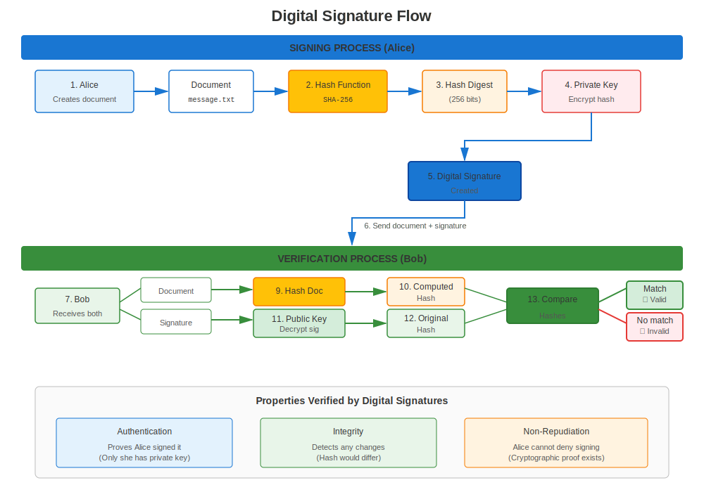
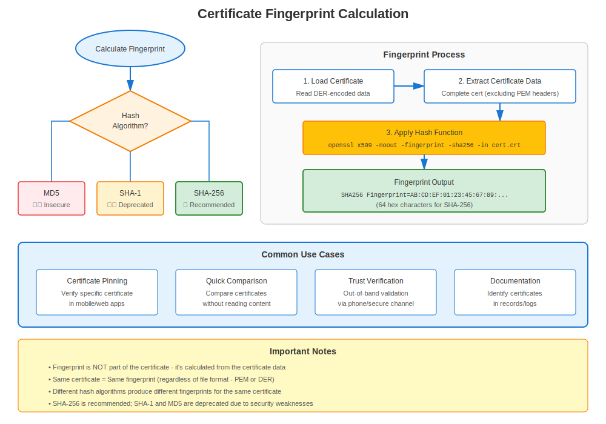

# Chapter 7: Digital Signatures & Verification on RHEL

> **How Trust Works:** Learn how digital signatures enable certificate validation on RHEL systems.

## 7.1 Cryptographic Hash Functions

Properties:
1. Deterministic
2. Pre-image resistance
3. Collision resistance
4. Avalanche effect

Popular algorithms: SHA-256, SHA-3, BLAKE2.

## 7.2 Building Signatures



1. Calculate hash of message.
2. Encrypt hash with *private* key → signature.
3. Receiver decrypts signature with *public* key and compares with their own hash.

## 7.3 Certificate Fingerprints



A fingerprint is simply the hash of the DER-encoded certificate, used to uniquely identify it, e.g.,

```bash
openssl x509 -in server.crt -noout -fingerprint -sha256
```

## 7.4 Lab: Sign & Verify a File

```bash
# sign
openssl dgst -sha256 -sign rsa.key.pem -out report.sig report.pdf
# verify
openssl dgst -sha256 -verify rsa.pub.pem -signature report.sig report.pdf
```

## 7.5 Summary

Signatures tie data to identities; hashes ensure integrity.  Together they underpin certificate validation and all PKI operations.

---

## 7.6 Signature Algorithms on RHEL

### Approved by RHEL Version

| Algorithm | RHEL 7 | RHEL 8 | RHEL 9 | RHEL 10 |
|-----------|--------|--------|--------|---------|
| **SHA-256** | ✅ Yes | ✅ Yes | ✅ Yes | ✅ Yes |
| **SHA-384** | ✅ Yes | ✅ Yes | ✅ Yes | ✅ Yes |
| **SHA-512** | ✅ Yes | ✅ Yes | ✅ Yes | ✅ Yes |
| **SHA-1** | ✅ Yes | ⚠️ Deprecated | ❌ Blocked | ❌ Blocked |
| **MD5** | ✅ Yes | ⚠️ Legacy only | ❌ Blocked | ❌ Blocked |

**Critical:** RHEL 9+ blocks SHA-1 and MD5 for security!

### Verifying Certificates on RHEL

```bash
# Verify certificate chain
openssl verify /etc/pki/tls/certs/server.crt

# Verify against specific CA
openssl verify -CAfile /etc/pki/tls/certs/ca-bundle.crt server.crt

# Check signature algorithm
openssl x509 -in server.crt -noout -text | grep "Signature Algorithm"
# Must be SHA-256+ on RHEL 8+
```

---

## Quick Reference

```
┌──────────────────────────────────────────────────────────┐
│ DIGITAL SIGNATURES ON RHEL                               │
├──────────────────────────────────────────────────────────┤
│ Purpose:      Prove authenticity and integrity           │
│ How:          Hash + Private key = Signature             │
│ Verify:       Signature + Public key = Original hash     │
│                                                          │
│ Approved:     SHA-256, SHA-384, SHA-512                  │
│ Deprecated:   SHA-1 (blocked on RHEL 9+)                 │
│ Blocked:      MD5 (blocked on RHEL 9+)                   │
│                                                          │
│ Verify cert:  openssl verify cert.crt                    │
│ Check alg:    openssl x509 -noout -text | grep Signature │
│ Fingerprint:  openssl x509 -noout -fingerprint -sha256   │
└──────────────────────────────────────────────────────────┘
```

---

## 🧪 Hands-On Lab

**Lab 03: Digital Signatures**

Sign files, verify signatures, and detect tampering

- 📁 **Location:** `labs/en_US/03-digital-signatures/`
- ⏱️ **Time:** 20 minutes
- 🎯 **Level:** Beginner

---

**Chapter Navigation**

| [← Previous: Chapter 6 - RHEL Trust Store Deep Dive](06-rhel-trust-store.md) | [Next: Chapter 8 - RHEL Versions & Certificate Evolution →](../part-02-version-specific/08-rhel-versions-overview.md) |
|:---|---:|
