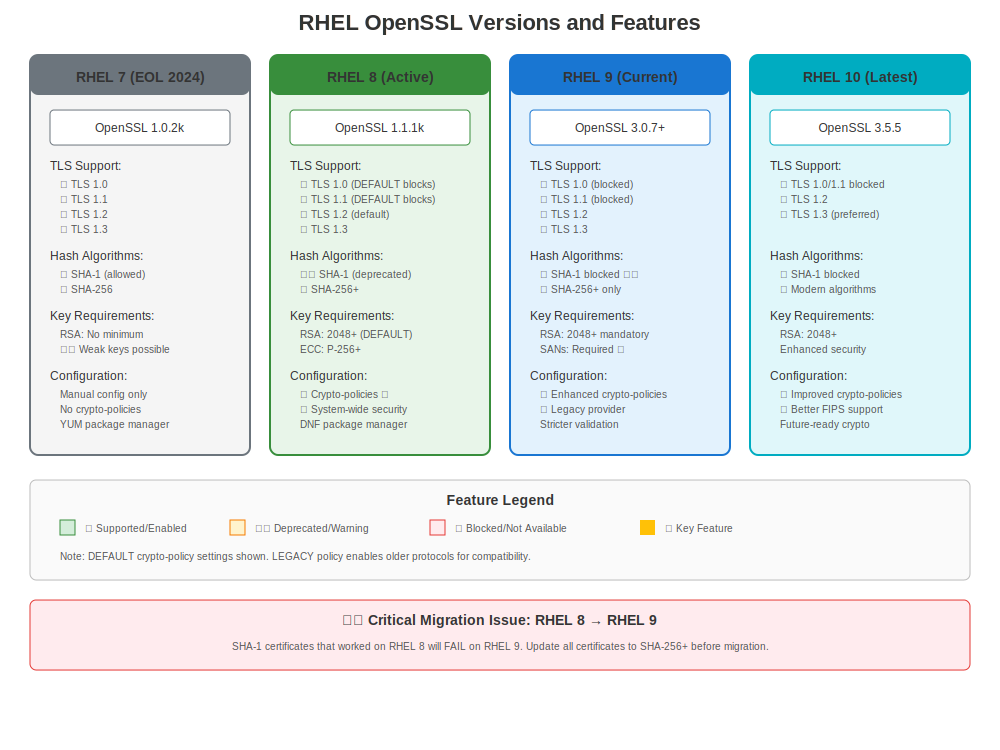

# Chapter 8: RHEL Versions & Certificate Evolution

> **Learning Objective:** Understand how certificate management differs across RHEL 7, 8, 9, and 10 so you can quickly identify version-specific behaviors when troubleshooting.

---

## 8.1 Why RHEL Version Matters

When troubleshooting certificate issues on RHEL, the **first question** should always be: "What RHEL version am I on?"

Certificate management has evolved significantly across RHEL versions. What works on RHEL 7 may fail on RHEL 9. Understanding these differences is crucial for:

- ✅ Choosing the right troubleshooting approach
- ✅ Identifying version-specific errors
- ✅ Planning migrations
- ✅ Writing compatible automation scripts

---

## 8.2 Quick Version Check

```bash
# Method 1: Check /etc/redhat-release
cat /etc/redhat-release
# Output examples:
#   Red Hat Enterprise Linux Server release 7.9 (Maipo)
#   Red Hat Enterprise Linux release 8.10 (Ootpa)
#   Red Hat Enterprise Linux release 9.8 (Plow)
#   Red Hat Enterprise Linux release 10.2 (Coughlan)

# Method 2: Use rpm
rpm -q --queryformat '%{VERSION}\n' redhat-release

# Method 3: Check OpenSSL version (indirect but useful)
openssl version
# RHEL 7: OpenSSL 1.0.2k family
# RHEL 8: OpenSSL 1.1.1 family
# RHEL 9: OpenSSL 3.x
# RHEL 10: OpenSSL 3.x
```

---

## 8.3 RHEL Version Overview


| RHEL Version | GA Date | Lifecycle Note | OpenSSL Version | Key Certificate Feature |
|--------------|---------|--------------|-----------------|------------------------|
| **RHEL 7** | June 2014 | June 2024 base life cycle; extended options vary | 1.0.2k family | Traditional manual management |
| **RHEL 8** | May 2019 | May 2029 | 1.1.1 family | **Crypto-policies introduced** |
| **RHEL 9** | May 2022 | May 2032 | 3.x | OpenSSL 3.x, stricter defaults |
| **RHEL 10** | May 2025 | May 2035 | 3.x | Continued hardening, PQC prep |

> **Source:** [Red Hat Product Life Cycle](https://access.redhat.com/support/policy/updates/errata)
>
> Use the product life cycle page for exact EUS/ELS/add-on details; the table above is a major-version planning view, not a contract summary.



---

## 8.4 Major Differences Summary

### RHEL 7 (Legacy)

**Characteristics:**
- ✅ Stable, well-understood
- ✅ Maximum compatibility
- ⚠️ TLS 1.0/1.1 enabled by default
- ⚠️ Weak ciphers allowed
- ⚠️ Manual certificate management

**Package Family:** `openssl-1.0.2k*`

**When You'll See It:**
- Legacy systems not yet migrated
- Applications requiring old TLS versions
- Conservative environments

**Key Command:**
```bash
# Generate key (RHEL 7 style)
openssl genrsa -out server.key 2048
```

---

### RHEL 8 (Widely Deployed)

**Characteristics:**
- ✅ **System-wide crypto-policies** (game changer!)
- ✅ TLS 1.2+ by default
- ✅ certmonger for auto-renewal
- ✅ Modern cipher suites
- ⚠️ Breaking changes from RHEL 7

**Package Family:** `openssl-1.1.1*`

**Key Innovation - Crypto-Policies:**
```bash
# View current policy
update-crypto-policies --show
# DEFAULT, LEGACY, FUTURE, or FIPS

# System-wide security control!
sudo update-crypto-policies --set FUTURE
```

**When You'll See It:**
- Most enterprise deployments
- Modern applications
- FreeIPA environments

**Key Command:**
```bash
# Generate key (RHEL 8 modern style)
openssl genpkey -algorithm RSA -pkeyopt rsa_keygen_bits:2048 -out server.key
```

---

### RHEL 9 (Modern Standard)

**Characteristics:**
- ✅ OpenSSL 3.5.5 with provider architecture
- ✅ TLS 1.2+ mandatory
- ✅ Enhanced crypto-policies
- ✅ Stricter certificate validation
- ⚠️ OpenSSL 3.x API changes
- ⚠️ Legacy algorithms disabled

**Package Family:** `openssl-3*`

**Major Change - Provider Architecture:**
```bash
# List crypto providers
openssl list -providers
# default, fips, legacy, base

# Legacy algorithms require explicit provider
openssl md5 -provider legacy file.txt
```

**When You'll See It:**
- New deployments
- Security-conscious environments
- Latest application versions

**Key Command:**
```bash
# Generate EC key (RHEL 9)
openssl genpkey -algorithm EC -pkeyopt ec_paramgen_curve:P-256 -out ec.key
```

---

### RHEL 10 (Current Release)

**Characteristics:**
- ✅ Same OpenSSL 3.5.5 as RHEL 9.8
- ✅ Continued security hardening
- ✅ Post-quantum cryptography preparation
- ✅ Enhanced container certificate support
- ⚠️ Even stricter defaults
- ⚠️ Additional legacy removals

**Package Family:** `openssl-3*`

> **Note:** RHEL 10.0 GA was May 20, 2025. Features and capabilities may evolve across minor versions (10.1, 10.2, etc.). Always consult official documentation for your specific RHEL 10.x release.

**Key Focus:**
- Quantum-resistant cryptography foundation
- Modern security practices
- Container and cloud-native workloads

**When You'll See It:**
- Brand new deployments
- Cutting-edge security requirements
- Future-proofing initiatives

---

## 8.5 Critical Version Differences

### TLS Version Support

| TLS Version | RHEL 7 | RHEL 8 | RHEL 9 | RHEL 10 |
|-------------|--------|--------|--------|---------|
| TLS 1.0 | ✅ Yes | ⚠️ LEGACY only | ❌ No | ❌ No |
| TLS 1.1 | ✅ Yes | ⚠️ LEGACY only | ❌ No | ❌ No |
| TLS 1.2 | ✅ Yes | ✅ Yes | ✅ Yes | ✅ Yes |
| TLS 1.3 | ❌ No | ✅ Yes | ✅ Yes (preferred) | ✅ Yes (preferred) |

### Certificate Tools Availability

| Tool | RHEL 7 | RHEL 8 | RHEL 9 | RHEL 10 |
|------|--------|--------|--------|---------|
| `openssl` | 1.0.2k | 1.1.1k | 3.5.5 | 3.5.5 |
| `certutil` (NSS) | ✅ Yes | ✅ Yes | ✅ Yes | ✅ Yes |
| `update-ca-trust` | ✅ Yes | ✅ Enhanced | ✅ Enhanced | ✅ Enhanced |
| `certmonger` | ✅ Yes | ✅ Enhanced | ✅ Enhanced | ✅ Enhanced |
| `crypto-policies` | ❌ No | ✅ Yes | ✅ Enhanced | ✅ Enhanced |
| `authconfig` | ✅ Yes | ❌ No (use authselect) | ❌ No | ❌ No |

### Key Cipher/Algorithm Changes

| Algorithm/Feature | RHEL 7 | RHEL 8 | RHEL 9 | RHEL 10 |
|-------------------|--------|--------|--------|---------|
| 3DES | ✅ Yes | ⚠️ LEGACY | ❌ No | ❌ No |
| RC4 | ✅ Yes | ❌ No | ❌ No | ❌ No |
| MD5 signatures | ✅ Yes | ⚠️ LEGACY | ❌ No | ❌ No |
| SHA-1 signatures | ✅ Yes | ⚠️ Deprecated | ❌ No | ❌ No |
| RSA < 2048 bits | ✅ Yes | ❌ No | ❌ No | ❌ No |
| DSA keys | ✅ Yes | ⚠️ LEGACY | ❌ No | ❌ No |

---

## 8.6 Common Version-Specific Issues

### RHEL 7 Issues
```bash
# Problem: Old cipher suites accepted
# Impact: Security vulnerabilities
# Solution: Manual Apache/NGINX cipher configuration
```

### RHEL 8 Issues
```bash
# Problem: Application fails after migration from RHEL 7
# Reason: TLS 1.0/1.1 disabled by default
# Quick Fix: Temporarily use LEGACY policy (not recommended long-term)
sudo update-crypto-policies --set LEGACY

# Better Fix: Update application to support TLS 1.2+
```

### RHEL 9 Issues
```bash
# Problem: OpenSSL commands fail with provider errors
# Reason: OpenSSL 3.x provider architecture
# Fix: Specify provider explicitly
openssl md5 -provider legacy file.txt

# Problem: SHA-1 certificates rejected
# Reason: Stricter validation
# Fix: Reissue certificates with SHA-256+
```

### RHEL 10 Issues
```bash
# Problem: Even stricter defaults than RHEL 9
# Impact: Legacy certificates may fail validation
# Solution: Ensure all certificates use modern algorithms
#           Check RHEL 10.x specific documentation for your minor version
```

---

## 8.7 Migration Impact

### RHEL 7 → RHEL 8
**Certificate Impact:** MODERATE
- TLS 1.0/1.1 disabled
- Weak ciphers removed
- certmonger integration required for automation

**Action Required:**
1. Audit TLS versions in use
2. Update cipher configurations
3. Test applications with TLS 1.2+
4. Consider crypto-policies

### RHEL 8 → RHEL 9
**Certificate Impact:** HIGH
- OpenSSL 3.x API changes
- Legacy algorithm removal
- Stricter certificate validation
- Provider architecture changes

**Action Required:**
1. Test all certificate operations
2. Update custom scripts using OpenSSL
3. Validate certificate chain integrity
4. Check for SHA-1 usage

### RHEL 9 → RHEL 10
**Certificate Impact:** LOW-MODERATE
- Same OpenSSL base (3.5.5)
- Incremental hardening
- Policy refinements

**Action Required:**
1. Review RHEL 10.x documentation
2. Test crypto-policy compatibility
3. Validate modern algorithm usage

---

## 8.8 Choosing the Right Approach

### For Troubleshooting

```bash
# Always start with version check
cat /etc/redhat-release

# Then check OpenSSL version
openssl version

# For RHEL 8+: Check crypto-policy
update-crypto-policies --show 2>/dev/null || echo "Pre-RHEL 8"
```

### Quick Reference Decision Tree

```
Is it RHEL 7?
├─ YES → Check for legacy TLS/cipher issues
│        Manual configuration likely needed
│        Consider migration planning
│
└─ NO → Is it RHEL 8?
    ├─ YES → Check crypto-policies first!
    │        Use certmonger for automation
    │        Consider RHEL 9 upgrade
    │
    └─ NO → Is it RHEL 9 or 10?
        └─ YES → Check OpenSSL 3.x provider issues
                 Verify modern algorithms in use
                 Leverage enhanced tooling
```

---

## 8.9 Key Takeaways

1. **Always check RHEL version first** when troubleshooting
2. **RHEL 8 introduced crypto-policies** - game changer for certificate management
3. **RHEL 9 uses OpenSSL 3.x** - significant API and behavior changes
4. **RHEL 10 continues RHEL 9 foundation** - incremental improvements
5. **Legacy algorithms progressively removed** across versions
6. **Migration testing is critical** - certificate behavior changes significantly

---

## 8.10 What's Next?

Now that you understand RHEL version differences, we'll dive deeper into:

- **Chapter 9:** RHEL 7 Certificate Management (detailed)
- **Chapter 10:** RHEL 8 & Crypto-Policies (detailed)
- **Chapter 11:** RHEL 9 Modern Security (detailed)
- **Chapter 12:** RHEL 10 Current Features (detailed)

---

## Quick Reference Card

```
┌────────────────────────────────────────────────────────────┐
│ RHEL VERSION QUICK REFERENCE                               │
├─────────────┬───────────┬──────────────┬───────────────────┤
│ RHEL 7      │ 1.0.2k    │ Manual       │ Legacy-friendly   │
│ RHEL 8      │ 1.1.1k    │ Crypto-pols  │ Widely deployed   │
│ RHEL 9      │ 3.5.5     │ OpenSSL 3.x  │ Modern secure     │
│ RHEL 10     │ 3.5.5     │ Hardened     │ Future-ready      │
└─────────────┴───────────┴──────────────┴───────────────────┘

Check version:  cat /etc/redhat-release
Check OpenSSL:  openssl version
Check policy:   update-crypto-policies --show  (RHEL 8+)
```
---

**Chapter Navigation**

| [← Previous: Chapter 7 - Digital Signatures & Verification on RHEL](../part-01-fundamentals/07-signatures-verification.md) | [Next: Chapter 9 - RHEL 7 Certificate Management →](09-rhel7-management.md) |
|:---|---:|
