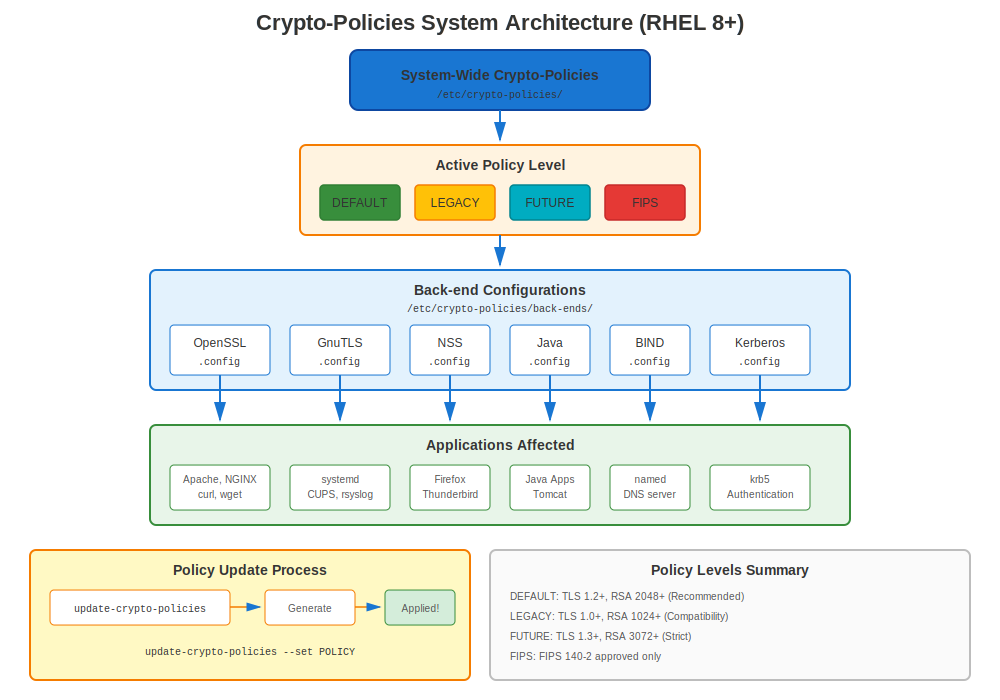
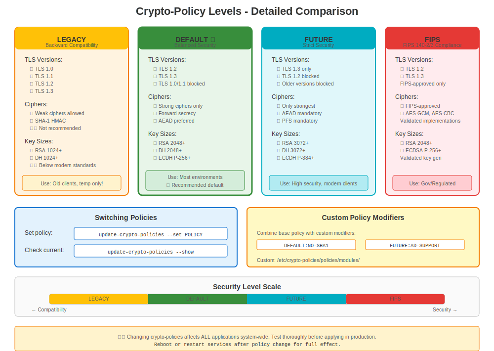

# Chapter 10: RHEL 8 & Crypto-Policies

> **Game Changer:** RHEL 8 introduced crypto-policies, revolutionizing how certificates and cryptography are managed system-wide. This is the most important feature to understand for RHEL 8.

---

## 10.1 What Changed in RHEL 8?

**Release:** May 7, 2019
**Support Until:** May 31, 2029
**Current Version:** RHEL 8.10 (as of 2024)

**Major Certificate-Related Changes:**

| Feature | RHEL 7 | RHEL 8 |
|---------|--------|--------|
| OpenSSL | 1.0.2k | 1.1.1k-14 |
| TLS 1.3 | ❌ No | ✅ Yes |
| Crypto-Policies | ❌ No | ✅ **NEW!** |
| TLS 1.0/1.1 | ✅ Enabled | ❌ Disabled (DEFAULT) |
| certmonger | Basic | Enhanced |
| Default Security | Mixed | Stronger |

**Package:** `openssl-1.1.1k-14.el8_6.x86_64`

---

## 10.2 Understanding Crypto-Policies



### The Revolutionary Idea

**RHEL 7 Problem:**
```
❌ Configure Apache:     SSLProtocol, SSLCipherSuite
❌ Configure NGINX:      ssl_protocols, ssl_ciphers
❌ Configure Postfix:    smtpd_tls_protocols
❌ Configure OpenLDAP:   olcTLSProtocolMin
❌ Configure every application differently!
```

**RHEL 8 Solution:**
```
✅ Set ONE system-wide policy
✅ All applications automatically comply!
```

### How It Works

```
┌────────────────────────────────────────┐
│  update-crypto-policies --set DEFAULT  │  ← Single command
└──────────────────┬─────────────────────┘
                   │
       ┌───────────┴────────────┐
       │ Crypto-Policies System │
       └───────────┬────────────┘
                   │
    ┌──────────────┼──────────────┐
    ▼              ▼              ▼
 OpenSSL        GnuTLS         NSS
 Postfix        Apache         NGINX
 OpenSSH        Kerberos       BIND
 (all apps!)    (automatic!)   (consistent!)
```

---

## 10.3 Available Crypto-Policies



### The Four Main Policies

```bash
# Check current policy
update-crypto-policies --show

# Policies available in RHEL 8:
```

| Policy | TLS Versions | Min RSA | SHA-1 | 3DES | Use Case |
|--------|--------------|---------|-------|------|----------|
| **DEFAULT** | 1.2, 1.3 | 2048 | ❌ No | ❌ No | Standard (recommended) |
| **LEGACY** | 1.0+, all | 1024 | ⚠️ Yes | ⚠️ Yes | Old systems compatibility |
| **FUTURE** | 1.2, 1.3 | 3072 | ❌ No | ❌ No | Stricter security |
| **FIPS** | 1.2, 1.3 | 2048 | ❌ No | ❌ No | Federal compliance |

### Policy Details

**DEFAULT Policy:**
```yaml
TLS Versions: 1.2, 1.3
Minimum RSA/DH: 2048 bits
Minimum ECC: secp256r1 (P-256)
Ciphers: AES-GCM, ChaCha20-Poly1305, AES-CBC
Signatures: SHA-256, SHA-384, SHA-512
Blocked: MD5, SHA-1 signatures, 3DES, RC4, DSS
```

**LEGACY Policy:**
```yaml
TLS Versions: 1.0, 1.1, 1.2, 1.3
Minimum RSA/DH: 1024 bits
Ciphers: Includes 3DES, weak ciphers
Signatures: Allows SHA-1
Use: Only for old systems compatibility (temporary!)
```

**FUTURE Policy:**
```yaml
TLS Versions: 1.2, 1.3 (stricter ciphers)
Minimum RSA/DH: 3072 bits
Minimum ECC: secp384r1 (P-384)
Signatures: SHA-384, SHA-512 preferred
Blocked: Everything in DEFAULT, plus more
```

**FIPS Policy:**
```yaml
TLS Versions: 1.2, 1.3
Algorithms: Only FIPS 140-2 approved
Requires: FIPS mode enabled
Strictest: Federal compliance requirements
```

---

## 10.4 Changing Crypto-Policies

### Basic Policy Changes

```bash
#============================================#
# VIEW CURRENT POLICY
#============================================#

update-crypto-policies --show
# DEFAULT


#============================================#
# SET POLICY
#============================================#

# Set to FUTURE (stricter)
sudo update-crypto-policies --set FUTURE

# Set to LEGACY (less secure, for compatibility)
sudo update-crypto-policies --set LEGACY

# Set to FIPS (requires FIPS mode enabled)
sudo fips-mode-setup --enable
sudo reboot
sudo update-crypto-policies --set FIPS

# Return to DEFAULT
sudo update-crypto-policies --set DEFAULT


#============================================#
# APPLY POLICY (restart services)
#============================================#

# Crypto-policies update config files, but services must restart
sudo systemctl restart httpd nginx postfix

# Or reboot (ensures everything picks up new policy)
sudo reboot
```

### What Happens When You Change Policy

```bash
# Example: Switching to FUTURE policy

# Before:
update-crypto-policies --show
# DEFAULT

# After:
sudo update-crypto-policies --set FUTURE

# Changes happen in:
ls -l /etc/crypto-policies/back-ends/
# opensslcnf.config      ← OpenSSL config updated
# gnutls.config          ← GnuTLS config updated
# nss.config             ← NSS config updated
# bind.config            ← BIND config updated
# ... and more

# View OpenSSL policy applied:
cat /etc/crypto-policies/back-ends/opensslcnf.config
```

---

## 10.5 Policy Impact on Certificates

### DEFAULT Policy Impact

```bash
#============================================#
# WHAT DEFAULT POLICY ALLOWS/BLOCKS
#============================================#

# ✅ ALLOWED:
- TLS 1.2, 1.3
- RSA 2048+ bits
- AES-128-GCM, AES-256-GCM
- ChaCha20-Poly1305
- SHA-256, SHA-384, SHA-512 signatures

# ❌ BLOCKED:
- TLS 1.0, 1.1
- RSA < 2048 bits
- 3DES, RC4, DES
- MD5, SHA-1 signatures
- DSA keys
- Export ciphers
```

### Testing Against Current Policy

```bash
#============================================#
# TEST IF YOUR CERTIFICATE WORKS
#============================================#

# Test TLS 1.2
openssl s_client -connect server.example.com:443 -tls1_2

# Test TLS 1.3
openssl s_client -connect server.example.com:443 -tls1_3

# Test specific cipher
openssl s_client -connect server.example.com:443 \
  -cipher 'ECDHE-RSA-AES256-GCM-SHA384'

# See what ciphers are available under current policy
openssl ciphers -v | head -20
```

---

## 10.6 OpenSSL 1.1.1 Features (RHEL 8)

### New Features

```bash
#============================================#
# TLS 1.3 SUPPORT (New in RHEL 8!)
#============================================#

# Test TLS 1.3
openssl s_client -connect server.example.com:443 -tls1_3

# TLS 1.3 benefits:
# - Faster handshake
# - Forward secrecy mandatory
# - Removed outdated features


#============================================#
# MODERN KEY GENERATION
#============================================#

# Old style (still works)
openssl genrsa -out server.key 2048

# New style (preferred on RHEL 8)
openssl genpkey -algorithm RSA -out server.key \
  -pkeyopt rsa_keygen_bits:2048

# EC keys (elliptic curve)
openssl genpkey -algorithm EC -out ec.key \
  -pkeyopt ec_paramgen_curve:P-256


#============================================#
# IMPROVED CSR GENERATION
#============================================#

# CSR with SANs (much easier than RHEL 7!)
openssl req -new -key server.key -out server.csr \
  -subj "/CN=server.example.com" \
  -addext "subjectAltName=DNS:server.example.com,DNS:www.example.com,IP:10.0.0.100"

# Verify SANs
openssl req -in server.csr -noout -text | grep -A2 "Subject Alternative Name"
```

---

## 10.7 certmonger Enhancements in RHEL 8

### Improved Features

```bash
#============================================#
# CERTMONGER ON RHEL 8
#============================================#

# Better IPA integration
sudo ipa-getcert request \
  -f /etc/pki/tls/certs/web.crt \
  -k /etc/pki/tls/private/web.key \
  -D web.example.com \
  -K host/web.example.com@REALM \
  -C "systemctl reload httpd"  # Post-save command (improved!)

# Enhanced status output
sudo getcert list -v

# Better error reporting
sudo getcert list -f /etc/pki/tls/certs/web.crt
# Shows detailed error messages if renewal fails
```

**RHEL 8 certmonger improvements:**
- ✅ Better error messages
- ✅ Post-save command support
- ✅ Improved IPA integration
- ✅ More reliable renewal

---

## 10.8 Common RHEL 8 Scenarios

### Scenario 1: Migrated from RHEL 7, TLS 1.0 App Breaks

**Problem:**
```bash
# Application worked on RHEL 7
# After migration to RHEL 8: connection failures
```

**Diagnosis:**
```bash
# Check crypto-policy
update-crypto-policies --show
# DEFAULT  ← TLS 1.0/1.1 disabled!

# Check application logs
journalctl -xe | grep -i tls
# "wrong version number" or "no shared cipher"
```

**Quick Fix (Temporary):**
```bash
# Use LEGACY policy to allow TLS 1.0/1.1
sudo update-crypto-policies --set LEGACY
sudo systemctl restart <service>
```

**Proper Fix:**
```bash
# Update application to support TLS 1.2+
# Or configure application specifically (opt-out of policy)
```

### Scenario 2: Need to Support Old Clients

**Problem:** Windows Server 2008, Java 7 clients can't connect

**Solution:**
```bash
# Option 1: LEGACY policy (not recommended long-term)
sudo update-crypto-policies --set LEGACY

# Option 2: Custom policy module
# Create /etc/crypto-policies/policies/modules/COMPAT-OLD-CLIENTS.pmod
sudo update-crypto-policies --set DEFAULT:COMPAT-OLD-CLIENTS

# Option 3: Opt-out specific service
# Configure that service to allow TLS 1.0/1.1
```

### Scenario 3: Testing Before Production

```bash
#============================================#
# TEST CRYPTO-POLICY IMPACT
#============================================#

# Current policy
CURRENT=$(update-crypto-policies --show)

# Test with FUTURE policy
sudo update-crypto-policies --set FUTURE
sudo systemctl restart httpd

# Run tests
curl https://localhost/
# Application test suite

# If problems:
sudo update-crypto-policies --set $CURRENT  # Revert
sudo systemctl restart httpd
```

---

## 10.9 Per-Application Overrides

### When to Override

Sometimes you need ONE application to opt-out of system policy:

**Example:** Legacy app needs TLS 1.0, but you want DEFAULT for everything else

```bash
#============================================#
# APACHE OVERRIDE (Opt-Out)
#============================================#

# /etc/httpd/conf.d/ssl.conf
# Add this to re-enable TLS 1.0 for Apache only:
SSLProtocol all

# Or use Include to load crypto-policy
Include /etc/crypto-policies/back-ends/httpd.config
# Then override specific settings after

# ⚠️ Note: This opts OUT of crypto-policies for Apache
# You now manage Apache TLS manually again
```

**Better:** Use policy modules (see Chapter 23 for details)

---

## 10.10 Troubleshooting Crypto-Policy Issues

### Common Issues

**Issue 1: "no shared cipher"**

```bash
# Diagnosis
update-crypto-policies --show
# DEFAULT

# Test what ciphers are available
openssl ciphers -v

# Check client request
openssl s_client -connect localhost:443 -cipher 'ALL'

# Solution: Temporarily use LEGACY to identify issue
sudo update-crypto-policies --set LEGACY
# If works → cipher compatibility issue
# Proper fix: Update client or create custom policy
```

**Issue 2: Service fails after policy change**

```bash
# Symptom
sudo systemctl status httpd
# Failed to start

# Check logs
sudo journalctl -xe -u httpd | grep -i tls

# Revert policy
sudo update-crypto-policies --set DEFAULT
sudo systemctl restart httpd
```

---

## 10.11 Best Practices for RHEL 8

### Recommendation: Use DEFAULT Policy

```bash
# For most environments:
sudo update-crypto-policies --set DEFAULT

# Reasons:
✅ Balanced security/compatibility
✅ Tested by Red Hat
✅ Meets modern standards
✅ Blocks known weak algorithms
✅ Works with most clients
```

### When to Use Other Policies

**Use LEGACY when:**
- Temporarily supporting very old clients
- Migration period from RHEL 7
- Testing compatibility
- **But:** Plan to move back to DEFAULT ASAP!

**Use FUTURE when:**
- High-security requirements
- All clients are modern
- Want strictest settings
- Planning ahead

**Use FIPS when:**
- Federal compliance required
- Government contracts
- Regulated industries
- Security certifications needed

---

## 10.12 Key Takeaways (RHEL 8)

1. **Crypto-policies are THE feature** - Learn them well
2. **DEFAULT policy is good** - Don't change without reason
3. **TLS 1.3 now available** - Faster and more secure
4. **OpenSSL 1.1.1** - Modern features, better syntax
5. **certmonger enhanced** - Better automation
6. **Migration from RHEL 7** - Test thoroughly
7. **Plan for RHEL 9** - OpenSSL 3.x coming

---

## Quick Reference

```
┌───────────────────────────────────────────────────────────────┐
│ RHEL 8 CRYPTO-POLICIES QUICK REFERENCE                        │
├───────────────────────────────────────────────────────────────┤
│ OpenSSL:        1.1.1k-14                                     │
│ TLS:            1.2, 1.3 (DEFAULT policy)                     │
│ Feature:        System-wide crypto-policies                   │
│                                                               │
│ View policy:    update-crypto-policies --show                 │
│ Set policy:     sudo update-crypto-policies --set <POLICY>    │
│ Policies:       DEFAULT, LEGACY, FUTURE, FIPS                 │
│                                                               │
│ Config files:   /etc/crypto-policies/back-ends/               │
│ Restart:        systemctl restart <services>                  │
│                                                               │
│ Generate key:   openssl genpkey -algorithm RSA -out key.pem   │
│ CSR with SANs:  openssl req -new -addext "subjectAltName=..." │
└───────────────────────────────────────────────────────────────┘
```
---

**Chapter Navigation**

| [← Previous: Chapter 9 - RHEL 7 Certificate Management](09-rhel7-management.md) | [Next: Chapter 11 - RHEL 9 Modern Security →](11-rhel9-modern-security.md) |
|:---|---:|
