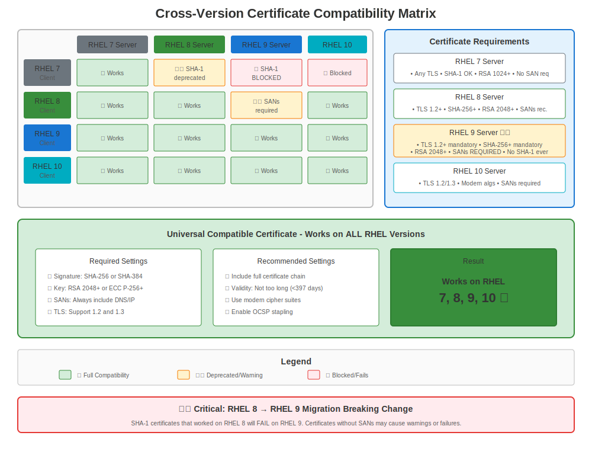

# Chapter 13: Cross-Version Compatibility

> **Real-World Challenge:** Your environment probably has RHEL 7, 8, and 9 systems all talking to each other. How do you make certificates work across all versions?

---

## 13.1 The Mixed Environment Reality



Most enterprises don't upgrade everything at once. You'll encounter:

```
Production Environment (Typical):
├── Legacy App Server (RHEL 7)
├── Database Server (RHEL 8)
├── Web Tier (RHEL 9)
├── Management Node (RHEL 10)
└── Clients: Windows, Mac, Linux, Mobile
```

**Challenge:** These systems have different:
- TLS version support
- Cipher suites
- Certificate validation rules
- OpenSSL versions
- Crypto-policies (or lack thereof)

---

## 13.2 Common Compatibility Issues

### Issue 1: TLS Version Mismatches

**Scenario:** RHEL 9 server (TLS 1.2+ only) ← RHEL 7 client (TLS 1.0/1.1 default)

```bash
# RHEL 7 client trying to connect to RHEL 9 server
curl https://rhel9-server.example.com/
# Error: SSL routines:ssl3_get_record:wrong version number

# Why: RHEL 7 tries TLS 1.0 first, RHEL 9 rejects it
```

**Solution:**
```bash
# Option 1: Update RHEL 7 client to use TLS 1.2
# Edit /etc/httpd/conf.d/ssl.conf (if Apache client)
SSLProtocol all -SSLv3 -TLSv1 -TLSv1.1

# Option 2: Temporary LEGACY policy on RHEL 9 (NOT recommended)
# sudo update-crypto-policies --set LEGACY  # On RHEL 9 server

# Option 3: Best - Upgrade RHEL 7 systems!
```

### Issue 2: Cipher Suite Mismatches

**Scenario:** Modern server doesn't support old client ciphers

```bash
# RHEL 7 client → RHEL 9 server
openssl s_client -connect rhel9-server:443 -cipher '3DES'
# Error: no shared cipher
```

**Why:** 3DES is blocked in RHEL 8+ DEFAULT policy

**Solution:**
```bash
# Check what ciphers are available
openssl ciphers -v 'HIGH:!aNULL:!MD5' | head

# Test specific cipher on client
openssl s_client -connect server:443 -cipher 'AES256-GCM-SHA384'

# On RHEL 9 server, if you MUST support old clients:
sudo update-crypto-policies --set LEGACY  # Temporary!
```

### Issue 3: Certificate Validation Differences

**Scenario:** SHA-1 signed certificate

```
Certificate with SHA-1 signature:
├── ✅ Works on RHEL 7
├── ❌ Rejected by RHEL 8 DEFAULT
├── ❌ Rejected by RHEL 9
└── ❌ Rejected by RHEL 10
```

**Solution:**
```bash
# Reissue certificate with SHA-256 or better
openssl req -new -key server.key -out server.csr -sha256

# Verify signature algorithm
openssl x509 -in cert.crt -noout -text | grep "Signature Algorithm"
# Should show: sha256WithRSAEncryption (or better)
```

---

## 13.3 Compatibility Matrix

### Client → Server Compatibility

| Client ↓ Server → | RHEL 7 Server | RHEL 8 Server (DEFAULT) | RHEL 9 Server (DEFAULT) | RHEL 10 Server |
|-------------------|---------------|-------------------------|-------------------------|----------------|
| **RHEL 7 Client** | ✅ Full | ⚠️ TLS 1.0/1.1 issue | ⚠️ TLS 1.0/1.1 issue | ⚠️ TLS 1.0/1.1 issue |
| **RHEL 8 Client** | ✅ Full | ✅ Full | ✅ Full | ✅ Full |
| **RHEL 9 Client** | ⚠️ Weak cipher warning | ✅ Full | ✅ Full | ✅ Full |
| **RHEL 10 Client** | ⚠️ Weak cipher warning | ✅ Full | ✅ Full | ✅ Full |
| **Windows 10** | ✅ Full | ✅ Full | ✅ Full | ✅ Full |
| **Windows Server 2012** | ✅ Full | ⚠️ May need TLS 1.0/1.1 | ⚠️ May need TLS 1.0/1.1 | ⚠️ May need TLS 1.0/1.1 |
| **Old Java 7** | ✅ Full | ❌ No TLS 1.2 | ❌ No TLS 1.2 | ❌ No TLS 1.2 |

**Legend:**
- ✅ Works without changes
- ⚠️ Works with configuration changes
- ❌ Incompatible without major updates

---

## 13.4 Certificate Requirements for Maximum Compatibility

### The "Universal" Certificate Profile

To work across all RHEL versions (7-10) and external clients:

```bash
# Certificate Requirements:
✅ RSA key: 2048 bits minimum (4096 for future-proofing)
✅ Signature: SHA-256 or better (not SHA-1!)
✅ Subject Alternative Names (SANs) required
✅ Validity: ≤ 365 days (browser requirement)
✅ Key Usage: Proper extensions set

❌ Avoid: SHA-1 signatures
❌ Avoid: RSA < 2048 bits
❌ Avoid: Missing SANs
❌ Avoid: CN-only certificates
```

### Generate a Compatible Certificate

```bash
#============================================#
# STEP 1: Generate Key (works on all RHEL versions)
#============================================#

# RSA 2048 (minimum, compatible)
openssl genpkey -algorithm RSA -out universal.key -pkeyopt rsa_keygen_bits:2048

# Or RSA 4096 (better, still compatible)
openssl genpkey -algorithm RSA -out universal.key -pkeyopt rsa_keygen_bits:4096


#============================================#
# STEP 2: Create CSR with SANs
#============================================#

openssl req -new -key universal.key -out universal.csr \
  -subj "/C=US/ST=State/L=City/O=Company/CN=server.example.com" \
  -addext "subjectAltName=DNS:server.example.com,DNS:www.example.com,IP:10.0.0.100" \
  -addext "keyUsage=digitalSignature,keyEncipherment" \
  -addext "extendedKeyUsage=serverAuth,clientAuth"


#============================================#
# STEP 3: Verify CSR
#============================================#

openssl req -in universal.csr -noout -text | grep -A2 "Subject Alternative Name"
# Should show your SANs

openssl req -in universal.csr -noout -text | grep "Public-Key"
# Should show: Public-Key: (2048 bit) or higher
```

---

## 13.5 Testing Cross-Version Compatibility

### Test Suite Script

```bash
#!/bin/bash
# test-cert-compatibility.sh
# Tests if certificate works from various RHEL versions

SERVER_HOST="server.example.com"
SERVER_PORT="443"
CERT_FILE="/etc/pki/tls/certs/server.crt"

echo "=== Certificate Compatibility Test Suite ==="
echo ""

#============================================#
# TEST 1: Certificate Properties
#============================================#

echo "1. Certificate Properties:"
echo "   Signature Algorithm:"
openssl x509 -in "$CERT_FILE" -noout -text | grep "Signature Algorithm" | head -1

echo "   Key Size:"
openssl x509 -in "$CERT_FILE" -noout -text | grep "Public-Key"

echo "   SANs:"
openssl x509 -in "$CERT_FILE" -noout -ext subjectAltName 2>/dev/null || echo "   No SANs found!"

echo ""


#============================================#
# TEST 2: TLS Version Support
#============================================#

echo "2. TLS Version Support:"

for version in tls1 tls1_1 tls1_2 tls1_3; do
  if openssl s_client -connect "$SERVER_HOST:$SERVER_PORT" -"$version" </dev/null 2>&1 | grep -q "Cipher"; then
    echo "   ${version//_/.}: ✅ Supported"
  else
    echo "   ${version//_/.}: ❌ Not supported"
  fi
done

echo ""


#============================================#
# TEST 3: Cipher Suite Compatibility
#============================================#

echo "3. Common Cipher Tests:"

# Modern cipher (RHEL 8+)
if openssl s_client -connect "$SERVER_HOST:$SERVER_PORT" -cipher 'ECDHE-RSA-AES256-GCM-SHA384' </dev/null 2>&1 | grep -q "Cipher"; then
  echo "   Modern cipher (ECDHE-RSA-AES256-GCM-SHA384): ✅"
else
  echo "   Modern cipher: ❌"
fi

# Legacy cipher (RHEL 7)
if openssl s_client -connect "$SERVER_HOST:$SERVER_PORT" -cipher 'AES256-SHA' </dev/null 2>&1 | grep -q "Cipher"; then
  echo "   Legacy cipher (AES256-SHA): ✅ (may indicate LEGACY policy)"
else
  echo "   Legacy cipher: ❌ (good for security)"
fi


#============================================#
# TEST 4: Certificate Validation
#============================================#

echo ""
echo "4. Certificate Validation:"

if openssl verify -CAfile /etc/pki/tls/certs/ca-bundle.crt "$CERT_FILE" | grep -q "OK"; then
  echo "   Trust chain: ✅ Valid"
else
  echo "   Trust chain: ❌ Invalid"
fi

echo ""
echo "=== Test Complete ==="
```

Usage:
```bash
chmod +x test-cert-compatibility.sh
sudo ./test-cert-compatibility.sh
```

---

## 13.6 Handling Specific Compatibility Scenarios

### Scenario 1: RHEL 7 Client → RHEL 9 Server

**Problem:** Connection fails with TLS version error

**Client-Side Fix (RHEL 7):**
```bash
# For curl
curl --tlsv1.2 https://rhel9-server/

# For wget
wget --secure-protocol=TLSv1_2 https://rhel9-server/

# For applications using OpenSSL, set environment variable
export OPENSSL_CONF=/etc/pki/tls/openssl-tls12.cnf

# Create custom config
cat > /etc/pki/tls/openssl-tls12.cnf << 'EOF'
openssl_conf = default_conf

[default_conf]
ssl_conf = ssl_sect

[ssl_sect]
system_default = system_default_sect

[system_default_sect]
MinProtocol = TLSv1.2
CipherString = DEFAULT@SECLEVEL=1
EOF
```

**Server-Side Fix (RHEL 9) - NOT RECOMMENDED:**
```bash
# Only if absolutely necessary and temporarily!
sudo update-crypto-policies --set LEGACY
sudo systemctl restart httpd  # Or your service
```

### Scenario 2: Mixed CA Trust

**Problem:** Corporate CA trusted on some systems but not others

**Solution:** Consistent trust store across all versions

```bash
#============================================#
# DEPLOYMENT SCRIPT (run on all RHEL versions)
#============================================#

#!/bin/bash
# deploy-corporate-ca.sh

CA_CERT_URL="http://pki.example.com/ca-chain.crt"
CA_CERT_FILE="/etc/pki/ca-trust/source/anchors/corporate-ca-chain.crt"

# Download CA certificate
curl -o "$CA_CERT_FILE" "$CA_CERT_URL"

# Update trust store (works on all RHEL versions)
update-ca-trust extract

# Verify
if trust list | grep -q "Corporate Root CA"; then
  echo "✅ Corporate CA installed successfully"
else
  echo "❌ Corporate CA installation failed"
  exit 1
fi
```

### Scenario 3: Application Using Old TLS Library

**Problem:** Java 7 application can't connect to modern servers

**Check Java TLS Support:**
```bash
# Check Java version
java -version

# Test TLS support
java -Djavax.net.debug=ssl:handshake -jar app.jar 2>&1 | grep "TLS"
```

**Options:**
```bash
# Option 1: Upgrade Java (best)
sudo dnf install java-11-openjdk

# Option 2: Enable TLS 1.2 in Java 7 (if upgrade impossible)
# Add to Java startup:
-Dhttps.protocols=TLSv1.2

# Option 3: Use wrapper script
#!/bin/bash
export JAVA_OPTS="-Dhttps.protocols=TLSv1.2 -Djavax.net.ssl.trustStore=/etc/pki/java/cacerts"
java $JAVA_OPTS -jar /path/to/app.jar
```

---

## 13.7 Crypto-Policy Compatibility

### Understanding Policy Impact Across Versions

```bash
#============================================#
# RHEL 7 (No crypto-policies)
#============================================#

# Manual configuration in each app
# Apache: /etc/httpd/conf.d/ssl.conf
# NGINX: /etc/nginx/nginx.conf
# Postfix: /etc/postfix/main.cf


#============================================#
# RHEL 8/9/10 (crypto-policies)
#============================================#

# System-wide control
update-crypto-policies --set DEFAULT

# To support RHEL 7 clients, might need:
update-crypto-policies --set LEGACY  # Temporarily!
```

### Policy Equivalents for Mixed Environments

If you need to maintain compatibility:

**Option A: Use LEGACY on modern systems (not recommended long-term)**
```bash
# On RHEL 8/9/10 servers
sudo update-crypto-policies --set LEGACY
```

**Option B: Configure RHEL 7 to match DEFAULT (recommended)**
```bash
# On RHEL 7, manually configure to match RHEL 8+ DEFAULT
# Apache example:
SSLProtocol all -SSLv3 -TLSv1 -TLSv1.1
SSLCipherSuite HIGH:!aNULL:!MD5:!3DES:!CAMELLIA
SSLHonorCipherOrder on
```

---

## 13.8 Migration Path: Gradual Upgrade

### Phase 1: Prepare RHEL 7 (Pre-Migration)

```bash
# 1. Reissue all certificates with SHA-256+
# 2. Test TLS 1.2 compatibility
# 3. Update cipher configurations
# 4. Document current certificate inventory
```

### Phase 2: Deploy RHEL 8 (Transition)

```bash
# 1. Start with LEGACY policy
sudo update-crypto-policies --set LEGACY

# 2. Deploy services
# 3. Test thoroughly
# 4. Gradually switch to DEFAULT
sudo update-crypto-policies --set DEFAULT
```

### Phase 3: Upgrade to RHEL 9 (Modernization)

```bash
# 1. All clients should be RHEL 8+ or TLS 1.2 capable
# 2. Use DEFAULT policy
# 3. Monitor for compatibility issues
# 4. Consider FUTURE policy after stabilization
```

---

## 13.9 Troubleshooting Cross-Version Issues

### Diagnostic Commands

```bash
#============================================#
# ON CLIENT
#============================================#

# Test specific TLS version
openssl s_client -connect server:443 -tls1_2

# Test with verbose output
curl -v --tlsv1.2 https://server/

# Check client OpenSSL
openssl version
openssl ciphers -v


#============================================#
# ON SERVER
#============================================#

# Check crypto-policy (RHEL 8+)
update-crypto-policies --show

# Check OpenSSL config
openssl version
cat /etc/crypto-policies/back-ends/opensslcnf.config

# Test server certificate
openssl s_client -connect localhost:443 -servername $(hostname)

# Check service logs
sudo journalctl -xe | grep -i tls
sudo tail -f /var/log/httpd/ssl_error_log
```

### Common Error Messages

| Error | Cause | Solution |
|-------|-------|----------|
| "wrong version number" | TLS version mismatch | Update client to TLS 1.2+ |
| "no shared cipher" | Cipher incompatibility | Check crypto-policy or cipher config |
| "certificate verify failed" | Trust or validation issue | Check CA trust, certificate validity |
| "sslv3 alert handshake failure" | Protocol incompatibility | Update TLS versions |
| "unsafe legacy renegotiation" | Old OpenSSL on client | Update client OpenSSL |

---

## 13.10 Best Practices for Mixed Environments

### 1. Standardize Certificate Issuance

```yaml
# Certificate Standard (example)
Algorithm: RSA
Key Size: 2048 bits minimum (4096 preferred)
Signature: SHA-256 or better
Validity: 365 days maximum
SANs: Always include
Extensions: Proper key usage set
```

### 2. Maintain Consistent Trust Stores

```bash
# Deploy script for all systems
for host in rhel7-hosts rhel8-hosts rhel9-hosts; do
  ssh "$host" 'sudo cp /path/to/ca.crt /etc/pki/ca-trust/source/anchors/ && sudo update-ca-trust'
done
```

### 3. Test Before Deploying

```bash
# Test matrix
RHEL 7 client → RHEL 7 server ✓
RHEL 7 client → RHEL 8 server ✓
RHEL 7 client → RHEL 9 server ✓
RHEL 8 client → RHEL 7 server ✓
RHEL 8 client → RHEL 9 server ✓
RHEL 9 client → RHEL 8 server ✓
```

### 4. Document Your Environment

```markdown
## Certificate Compatibility Matrix

### Servers:
- App Server 1: RHEL 7.9, TLS 1.0-1.2, RSA 2048
- Database: RHEL 8.10, DEFAULT policy, RSA 2048
- Web Tier: RHEL 9.8, DEFAULT policy, RSA 4096

### Known Limitations:
- RHEL 7 systems require TLS 1.0/1.1 for legacy app X
- Database requires specific cipher: AES256-GCM-SHA384

### Upgrade Plan:
- Q1 2025: Migrate App Server 1 to RHEL 8
- Q2 2025: Update all certificates to RSA 4096
```

---

## 13.11 Key Takeaways

1. **Mixed environments are normal** - Plan for compatibility
2. **TLS 1.2+ is the minimum** for modern systems
3. **SHA-256+ signatures required** for RHEL 8+
4. **Crypto-policies changed everything** (RHEL 8+)
5. **Test across all versions** before deploying
6. **Document everything** - especially exceptions
7. **Upgrade path is gradual** - don't rush, test thoroughly

---

## Quick Reference

```
┌──────────────────────────────────────────────────────────────┐
│ CROSS-VERSION COMPATIBILITY CHECKLIST                        │
├──────────────────────────────────────────────────────────────┤
│ ✅ RSA 2048+ bits                                            │
│ ✅ SHA-256+ signature                                        │
│ ✅ SANs included                                             │
│ ✅ TLS 1.2+ support                                          │
│ ✅ Modern ciphers                                            │
│ ✅ Consistent CA trust                                       │
│ ✅ Tested across all versions                                │
└──────────────────────────────────────────────────────────────┘

Test command:
openssl s_client -connect server:443 -tls1_2 -servername server

Check policy (RHEL 8+):
update-crypto-policies --show
```
---

**Chapter Navigation**

| [← Previous: Chapter 12 - RHEL 10 Current Features](12-rhel10-current.md) | [Next: Chapter 14 - Apache httpd on RHEL →](../part-03-services/14-apache-httpd.md) |
|:---|---:|
