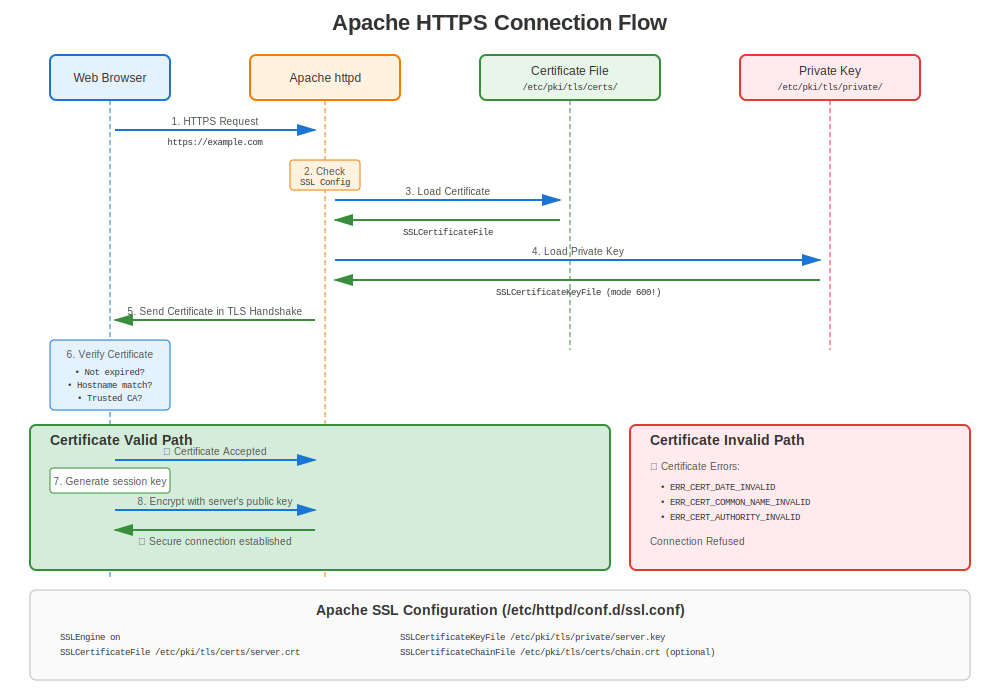
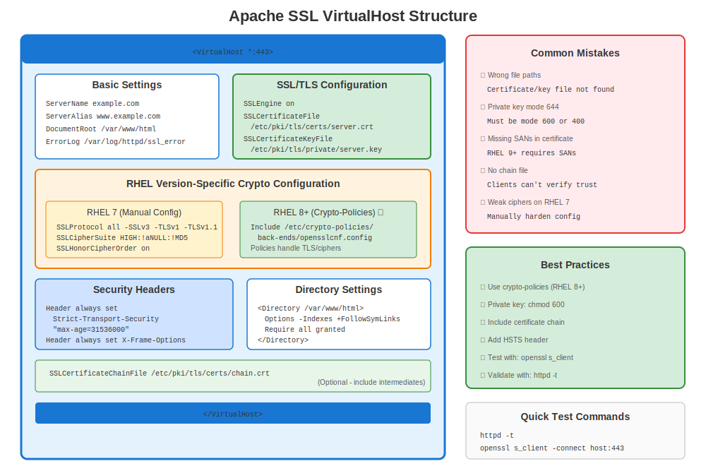

# Chapter 14: Apache httpd on RHEL

> **Most Common:** Apache (httpd) is the most widely deployed web server on RHEL. Master Apache HTTPS configuration across all RHEL versions.

---

## 14.1 Apache on RHEL Overview



**Package Name:** `httpd`
**SSL/TLS Module:** `mod_ssl`
**Config Location:** `/etc/httpd/conf.d/ssl.conf`
**Certificate Path:** `/etc/pki/tls/certs/`
**Key Path:** `/etc/pki/tls/private/`

### Version Comparison

| RHEL Version | Apache Version | OpenSSL | Config Approach |
|--------------|----------------|---------|-----------------|
| RHEL 7 | 2.4.6 | 1.0.2k | Manual SSL configuration |
| RHEL 8 | 2.4.37+ | 1.1.1k | Manual + crypto-policies |
| RHEL 9 | 2.4.53+ | 3.5.5 | Crypto-policies preferred |
| RHEL 10 | 2.4.62+ | 3.5.5 | Crypto-policies optimal |

---

## 14.2 Installation

### RHEL 7

```bash
#============================================#
# INSTALL APACHE WITH SSL (RHEL 7)
#============================================#

sudo yum install httpd mod_ssl -y
sudo systemctl enable httpd
sudo systemctl start httpd

# Open firewall
sudo firewall-cmd --permanent --add-service=http
sudo firewall-cmd --permanent --add-service=https
sudo firewall-cmd --reload

# Verify
systemctl status httpd
```

### RHEL 8/9/10

```bash
#============================================#
# INSTALL APACHE WITH SSL (RHEL 8/9/10)
#============================================#

sudo dnf install httpd mod_ssl -y
sudo systemctl enable httpd
sudo systemctl start httpd

# Open firewall
sudo firewall-cmd --permanent --add-service=http
sudo firewall-cmd --permanent --add-service=https
sudo firewall-cmd --reload

# Verify
systemctl status httpd
ss -tlnp | grep :443  # Check if listening on 443
```

---

## 14.3 Basic SSL Configuration



### Default SSL Configuration

```bash
# Main SSL config file
/etc/httpd/conf.d/ssl.conf

# Key directives:
SSLEngine on
SSLCertificateFile /etc/pki/tls/certs/localhost.crt
SSLCertificateKeyFile /etc/pki/tls/private/localhost.key
```

### Complete Virtual Host Example

```apache
#============================================#
# /etc/httpd/conf.d/ssl.conf
# Or /etc/httpd/conf.d/mysite-ssl.conf
#============================================#

<VirtualHost *:443>
    ServerName www.example.com
    ServerAlias example.com
    DocumentRoot /var/www/html

    # Enable SSL/TLS
    SSLEngine on

    # Certificate files
    SSLCertificateFile      /etc/pki/tls/certs/www.example.com.crt
    SSLCertificateKeyFile   /etc/pki/tls/private/www.example.com.key
    SSLCertificateChainFile /etc/pki/tls/certs/chain.crt

    # TLS protocols (RHEL 7 - manual config)
    SSLProtocol             all -SSLv3 -TLSv1 -TLSv1.1

    # Cipher suite (RHEL 7 - manual)
    SSLCipherSuite          HIGH:!aNULL:!MD5:!3DES:!RC4
    SSLHonorCipherOrder     on

    # HSTS (recommended)
    Header always set Strict-Transport-Security "max-age=31536000; includeSubDomains"

    # Logging
    ErrorLog  /var/log/httpd/ssl_error_log
    CustomLog /var/log/httpd/ssl_access_log combined
</VirtualHost>
```

---

## 14.4 Version-Specific Configuration

### RHEL 7: Manual SSL Configuration

```apache
#============================================#
# APACHE SSL - RHEL 7 BEST PRACTICES
#============================================#

<VirtualHost *:443>
    ServerName www.example.com
    SSLEngine on

    # Certificates
    SSLCertificateFile      /etc/pki/tls/certs/www.crt
    SSLCertificateKeyFile   /etc/pki/tls/private/www.key
    SSLCertificateChainFile /etc/pki/tls/certs/chain.crt

    # REQUIRED: Disable old TLS versions manually
    SSLProtocol all -SSLv2 -SSLv3 -TLSv1 -TLSv1.1

    # REQUIRED: Strong ciphers only
    SSLCipherSuite ECDHE-ECDSA-AES256-GCM-SHA384:ECDHE-RSA-AES256-GCM-SHA384:ECDHE-ECDSA-CHACHA20-POLY1305:ECDHE-RSA-CHACHA20-POLY1305:ECDHE-ECDSA-AES128-GCM-SHA256:ECDHE-RSA-AES128-GCM-SHA256
    SSLHonorCipherOrder on

    # Security headers
    Header always set Strict-Transport-Security "max-age=31536000"
    Header always set X-Frame-Options DENY
    Header always set X-Content-Type-Options nosniff
</VirtualHost>
```

### RHEL 8/9/10: Crypto-Policies Integrated

```apache
#============================================#
# APACHE SSL - RHEL 8/9/10 WITH CRYPTO-POLICIES
#============================================#

<VirtualHost *:443>
    ServerName www.example.com
    SSLEngine on

    # Certificates
    SSLCertificateFile      /etc/pki/tls/certs/www.crt
    SSLCertificateKeyFile   /etc/pki/tls/private/www.key
    SSLCertificateChainFile /etc/pki/tls/certs/chain.crt

    # NO NEED to set SSLProtocol or SSLCipherSuite!
    # Crypto-policies handles it automatically
    # (unless you have specific requirements)

    # Security headers (still manual)
    Header always set Strict-Transport-Security "max-age=31536000"
    Header always set X-Frame-Options DENY
    Header always set X-Content-Type-Options nosniff
</VirtualHost>
```

**Key Difference:** On RHEL 8+, crypto-policies automatically configures TLS versions and ciphers!

### Checking Crypto-Policy Integration

```bash
#============================================#
# VERIFY CRYPTO-POLICY (RHEL 8/9/10)
#============================================#

# Check current policy
update-crypto-policies --show

# View Apache-specific policy
cat /etc/crypto-policies/back-ends/httpd.config

# Apache automatically includes this
grep -r "crypto-policies" /etc/httpd/
```

---

## 14.5 Certificate Generation for Apache

### Complete Workflow

```bash
#============================================#
# GENERATE CERTIFICATE FOR APACHE (ALL VERSIONS)
#============================================#

# Step 1: Generate private key
sudo openssl genpkey -algorithm RSA \
  -out /etc/pki/tls/private/www.example.com.key \
  -pkeyopt rsa_keygen_bits:2048

# Step 2: Set permissions
sudo chmod 600 /etc/pki/tls/private/www.example.com.key
sudo chown root:root /etc/pki/tls/private/www.example.com.key

# Step 3: Generate CSR with SANs
sudo openssl req -new \
  -key /etc/pki/tls/private/www.example.com.key \
  -out /tmp/www.example.com.csr \
  -subj "/C=US/ST=State/L=City/O=Company/CN=www.example.com" \
  -addext "subjectAltName=DNS:www.example.com,DNS:example.com"

# Step 4: Submit CSR to CA, receive certificate

# Step 5: Install certificate
sudo cp www.example.com.crt /etc/pki/tls/certs/
sudo chmod 644 /etc/pki/tls/certs/www.example.com.crt

# Step 6: If using intermediate certificates, install chain
sudo cp chain.crt /etc/pki/tls/certs/www.example.com-chain.crt

# Step 7: Update Apache config (see section 13.3)

# Step 8: Test configuration
sudo apachectl configtest

# Step 9: Reload Apache
sudo systemctl reload httpd

# Step 10: Test HTTPS
curl -v https://www.example.com/
openssl s_client -connect www.example.com:443 -servername www.example.com
```

---

## 14.6 certmonger Integration (Automation!)

### Using certmonger with Apache

```bash
#============================================#
# AUTOMATE APACHE CERTIFICATES WITH CERTMONGER
#============================================#

# Install certmonger
# RHEL 8/9/10
sudo dnf install certmonger

# RHEL 7
# sudo yum install certmonger

sudo systemctl enable --now certmonger

# FreeIPA / internal CA workflow
sudo ipa-getcert request \
  -f /etc/pki/tls/certs/www.example.com.crt \
  -k /etc/pki/tls/private/www.example.com.key \
  -D www.example.com \
  -K host/www.example.com@REALM \
  -C "systemctl reload httpd"  # Auto-reload Apache after renewal!

# Check status
sudo getcert list

# For public Let's Encrypt certificates, use certbot in section 14.7.
```

**Benefits:**
- ✅ Automatic renewal
- ✅ No downtime (reload, not restart)
- ✅ Tracks expiration
- ✅ Email alerts on failure

---

## 14.7 Let's Encrypt with certbot

> **⚠️ IMPORTANT: EPEL Required**
>
> certbot is **NOT** available in official RHEL repositories. It requires EPEL (Extra Packages for Enterprise Linux), a **community-maintained** repository.
>
> For production RHEL environments, consider:
> - FreeIPA with certmonger (recommended for RHEL)
> - Manual certificate management
> - Commercial CA with certmonger

```bash
#============================================#
# CERTBOT SETUP (REQUIRES EPEL!)
#============================================#

# Step 1: Enable EPEL
# RHEL 7:
# sudo yum install https://dl.fedoraproject.org/pub/epel/epel-release-latest-7.noarch.rpm -y

# RHEL 8:
# sudo dnf install https://dl.fedoraproject.org/pub/epel/epel-release-latest-8.noarch.rpm -y

# RHEL 9/10:
sudo dnf install epel-release -y

# Step 2: Install certbot
# RHEL 7:
# sudo yum install certbot python2-certbot-apache -y

# RHEL 8/9/10:
sudo dnf install certbot python3-certbot-apache -y

# Step 3: Obtain certificate (automated!)
sudo certbot --apache -d www.example.com -d example.com

# Step 4: Certbot automatically:
#  - Generates certificate
#  - Configures Apache
#  - Sets up renewal timer
#  - Enables HTTPS redirect

# Step 5: Test automatic renewal
sudo certbot renew --dry-run

# Check renewal timer
systemctl list-timers | grep certbot
```

**Pros:**
- ✅ Fully automated
- ✅ Free certificates
- ✅ Apache config handled automatically

**Cons:**
- ❌ Requires EPEL (not officially supported by Red Hat)
- ❌ External dependency (Let's Encrypt)
- ⚠️ Domain must be publicly accessible

---

## 14.8 Troubleshooting Apache HTTPS

### Common Issues Checklist

```bash
#============================================#
# APACHE SSL TROUBLESHOOTING CHECKLIST
#============================================#

# 1. Check if mod_ssl is loaded
sudo httpd -M | grep ssl_module
# Should show: ssl_module (shared)

# 2. Check configuration syntax
sudo apachectl configtest
# Should show: Syntax OK

# 3. Check certificate files exist
ls -l /etc/pki/tls/certs/www.crt
ls -l /etc/pki/tls/private/www.key

# 4. Verify permissions
ls -l /etc/pki/tls/private/www.key
# Should be: -rw------- (600)

# 5. Check SELinux context
ls -Z /etc/pki/tls/certs/www.crt
ls -Z /etc/pki/tls/private/www.key
# Should show: cert_t

# 6. Test certificate/key pair match
CERT_MOD=$(openssl x509 -noout -modulus -in /etc/pki/tls/certs/www.crt | openssl md5)
KEY_MOD=$(openssl rsa -noout -modulus -in /etc/pki/tls/private/www.key | openssl md5)
[ "$CERT_MOD" = "$KEY_MOD" ] && echo "✅ Match" || echo "❌ No match!"

# 7. Check if port 443 is listening
ss -tlnp | grep :443

# 8. Check firewall
sudo firewall-cmd --list-services | grep https

# 9. Test locally
curl -vk https://localhost/

# 10. Check logs
sudo tail -f /var/log/httpd/ssl_error_log
```

### Common Errors and Solutions

| Error Message | Cause | Solution |
|---------------|-------|----------|
| "SSLCertificateFile: file does not exist" | Wrong path | Fix path in ssl.conf |
| "Permission denied" on key file | Wrong permissions | `chmod 600` on key |
| "certificate verify failed" | Chain issue | Install intermediate certs |
| "SSLCertificateKeyFile: file does not exist" | Missing key | Generate or restore key |
| "Private key does not match certificate" | Cert/key mismatch | Regenerate CSR with correct key |
| "SSL Library Error" | mod_ssl not loaded | Install mod_ssl package |
| "ca md too weak" (RHEL 9+) | SHA-1 signature | Reissue with SHA-256+ |
| "name mismatch" | Hostname doesn't match CN/SAN | Fix certificate SANs |

---

## 14.9 Version-Specific Troubleshooting

### RHEL 7 Specific

```bash
#============================================#
# RHEL 7 APACHE ISSUES
#============================================#

# Issue: Modern browsers reject TLS 1.0/1.1
# Solution: Disable old TLS in ssl.conf
SSLProtocol all -SSLv2 -SSLv3 -TLSv1 -TLSv1.1

# Issue: Weak ciphers flagged by scan
# Solution: Use strong ciphers
SSLCipherSuite ECDHE-RSA-AES256-GCM-SHA384:ECDHE-RSA-AES128-GCM-SHA256:HIGH:!aNULL:!MD5
SSLHonorCipherOrder on

# Issue: No SANs in certificate
# Solution: Reissue with SANs (see 13.5)

# Test
openssl s_client -connect localhost:443 -tls1_2
```

### RHEL 8/9/10 Specific

```bash
#============================================#
# RHEL 8/9/10 APACHE ISSUES
#============================================#

# Issue: Service fails after crypto-policy change
# Diagnosis:
update-crypto-policies --show
sudo journalctl -xe -u httpd | grep -i tls

# Solution 1: Verify policy is correct
sudo update-crypto-policies --set DEFAULT

# Solution 2: Check if you manually override policy
grep -E "SSLProtocol|SSLCipherSuite" /etc/httpd/conf.d/*.conf
# If found, remove (let crypto-policy handle it)

# Issue: "no shared cipher" error
# Diagnosis: Client too old or policy too strict
# Temporary solution:
sudo update-crypto-policies --set LEGACY
sudo systemctl restart httpd

# Proper solution: Update client or create custom policy module
```

---

## 14.10 Security Best Practices

### Hardened Apache SSL Configuration

```apache
#============================================#
# HARDENED SSL CONFIG (ALL VERSIONS)
#============================================#

<VirtualHost *:443>
    ServerName secure.example.com

    SSLEngine on
    SSLCertificateFile      /etc/pki/tls/certs/secure.crt
    SSLCertificateKeyFile   /etc/pki/tls/private/secure.key

    # RHEL 7: Manual TLS config
    # SSLProtocol TLSv1.2 TLSv1.3
    # SSLCipherSuite ECDHE-RSA-AES256-GCM-SHA384:ECDHE-RSA-AES128-GCM-SHA256
    # SSLHonorCipherOrder on

    # RHEL 8/9/10: Crypto-policies handle above automatically

    # HSTS (force HTTPS for 1 year)
    Header always set Strict-Transport-Security "max-age=31536000; includeSubDomains; preload"

    # Prevent clickjacking
    Header always set X-Frame-Options "DENY"

    # Prevent MIME-type sniffing
    Header always set X-Content-Type-Options "nosniff"

    # Disable server signature
    ServerSignature Off
    ServerTokens Prod

    # OCSP Stapling (RHEL 8/9/10)
    SSLUseStapling on
    SSLStaplingCache "shmcb:/var/run/ocsp(128000)"

    # Client certificate auth (optional)
    # SSLVerifyClient require
    # SSLVerifyDepth 3
    # SSLCACertificateFile /etc/pki/tls/certs/client-ca.crt
</VirtualHost>

# Outside VirtualHost (global SSL settings)
SSLStaplingCache "shmcb:/var/run/ocsp(128000)"
```

---

## 14.11 HTTP to HTTPS Redirect

### Force HTTPS

```apache
#============================================#
# REDIRECT HTTP → HTTPS
#============================================#

# Method 1: Separate VirtualHost
<VirtualHost *:80>
    ServerName www.example.com
    Redirect permanent / https://www.example.com/
</VirtualHost>

<VirtualHost *:443>
    ServerName www.example.com
    # ... SSL config ...
</VirtualHost>

# Method 2: mod_rewrite
<VirtualHost *:80>
    ServerName www.example.com

    RewriteEngine On
    RewriteCond %{HTTPS} off
    RewriteRule ^(.*)$ https://%{HTTP_HOST}$1 [R=301,L]
</VirtualHost>
```

---

## 14.12 Testing Apache HTTPS

### Comprehensive Testing

```bash
#============================================#
# APACHE HTTPS TESTING SUITE
#============================================#

# Test 1: Configuration syntax
sudo apachectl configtest

# Test 2: SSL module loaded
sudo httpd -M | grep ssl

# Test 3: Port listening
ss -tlnp | grep :443

# Test 4: Local connection
curl -vk https://localhost/

# Test 5: Actual hostname
curl -v https://www.example.com/

# Test 6: Certificate validation
openssl s_client -connect www.example.com:443 -servername www.example.com

# Test 7: TLS 1.2
openssl s_client -connect www.example.com:443 -tls1_2

# Test 8: TLS 1.3 (RHEL 8+)
openssl s_client -connect www.example.com:443 -tls1_3

# Test 9: Check certificate details from server
echo | openssl s_client -connect www.example.com:443 -servername www.example.com 2>&1 | \
  openssl x509 -noout -text | head -30

# Test 10: Online test (external)
# Use: https://www.ssllabs.com/ssltest/
```

---

## 14.13 Performance Optimization

### SSL/TLS Performance Tuning

```apache
#============================================#
# PERFORMANCE TUNING
#============================================#

<VirtualHost *:443>
    # ... basic config ...

    # Session cache (improves performance)
    SSLSessionCache         "shmcb:/var/cache/httpd/ssl_scache(512000)"
    SSLSessionCacheTimeout  300

    # OCSP Stapling (reduces client-side lookup)
    SSLUseStapling on
    SSLStaplingCache "shmcb:/var/run/ocsp(128000)"

    # Keep-Alive (reuse connections)
    KeepAlive On
    MaxKeepAliveRequests 100
    KeepAliveTimeout 5

    # HTTP/2 (RHEL 8/9/10)
    Protocols h2 h2c http/1.1
</VirtualHost>
```

---

## 14.14 Monitoring Apache HTTPS

### What to Monitor

```bash
#============================================#
# APACHE HTTPS MONITORING
#============================================#

# Certificate expiration
openssl s_client -connect localhost:443 -servername $(hostname -f) 2>/dev/null | \
  openssl x509 -noout -dates

# Service status
systemctl status httpd

# Connection count
ss -tn | grep :443 | wc -l

# Error log monitoring
sudo tail -f /var/log/httpd/ssl_error_log

# certmonger status (if used)
sudo getcert list -f /etc/pki/tls/certs/www.crt

# Access log analysis
sudo tail -f /var/log/httpd/ssl_access_log | grep -E "HTTP/[12]"
```

---

## 14.15 Quick Troubleshooting Guide

```
Apache HTTPS Not Working?

├─ Apache won't start?
│  ├─ Check: apachectl configtest
│  ├─ Check: journalctl -xe -u httpd
│  └─ Fix: Configuration errors
│
├─ Can't connect to port 443?
│  ├─ Check: ss -tlnp | grep :443
│  ├─ Check: firewall-cmd --list-services
│  └─ Fix: Open firewall, start httpd
│
├─ Certificate warnings in browser?
│  ├─ Check: Certificate expiration
│  ├─ Check: Hostname match (CN/SANs)
│  ├─ Check: Trust chain
│  └─ Fix: Renew cert, fix SANs, install CA
│
├─ "No shared cipher" error?
│  ├─ Check: update-crypto-policies --show
│  ├─ Check: Client TLS version
│  └─ Fix: Update policy or client
│
└─ Permission errors?
   ├─ Check: ls -lZ /etc/pki/tls/private/*.key
   ├─ Check: SELinux denials
   └─ Fix: chmod 600, restorecon
```

---

## 14.16 Key Takeaways

1. **Apache + mod_ssl** is the standard RHEL web server
2. **RHEL 7:** Manual TLS configuration required
3. **RHEL 8/9/10:** Crypto-policies simplify configuration
4. **certmonger integration** enables automation
5. **certbot requires EPEL** (not officially supported)
6. **Always use SANs** in certificates
7. **Test thoroughly** before production deployment

---

## Quick Reference Card

```
┌───────────────────────────────────────────────────────────────────┐
│ APACHE HTTPD HTTPS QUICK REFERENCE                                │
├───────────────────────────────────────────────────────────────────┤
│ Install:      dnf install httpd mod_ssl                           │
│ Config:       /etc/httpd/conf.d/ssl.conf                          │
│ Certs:        /etc/pki/tls/certs/                                 │
│ Keys:         /etc/pki/tls/private/ (mode 600!)                   │
│                                                                   │
│ Test config:  apachectl configtest                                │
│ Reload:       systemctl reload httpd                              │
│ Logs:         /var/log/httpd/ssl_error_log                        │
│                                                                   │
│ certmonger:   ipa-getcert request ... -C "systemctl reload httpd" │
│ certbot:      certbot --apache (requires EPEL!)                   │
│                                                                   │
│ Test:         curl -v https://localhost/                          │
│               openssl s_client -connect host:443                  │
└───────────────────────────────────────────────────────────────────┘

⚠️ RHEL 8/9/10: Let crypto-policies handle TLS/cipher config
⚠️ certbot requires EPEL (not officially supported)
```

---

## 🧪 Hands-On Lab

**Lab 06: Apache HTTPS Setup**

Configure Apache with SSL/TLS across RHEL versions

- 📁 **Location:** `labs/en_US/06-apache-https/`
- ⏱️ **Time:** 30-40 minutes
- 🎯 **Level:** Intermediate

---

**Chapter Navigation**

| [← Previous: Chapter 13 - Cross-Version Compatibility](../part-02-version-specific/13-cross-version-compatibility.md) | [Next: Chapter 15 - NGINX on RHEL →](15-nginx.md) |
|:---|---:|
