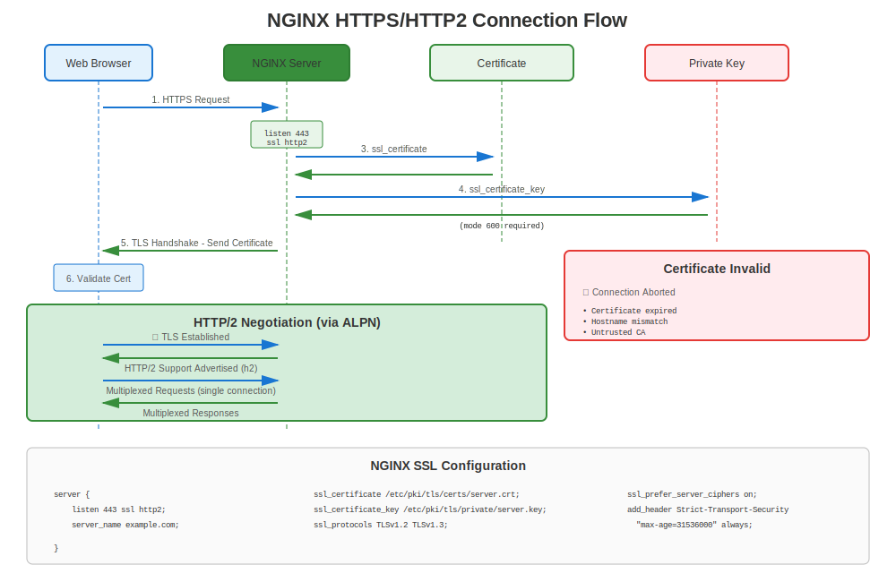

# Chapter 15: NGINX on RHEL

> **High Performance:** NGINX is a popular high-performance web server and reverse proxy. Learn how to configure NGINX with TLS certificates on RHEL.

---

## 15.1 NGINX on RHEL Overview



**Package Name:** `nginx`
**Config Location:** `/etc/nginx/nginx.conf`
**Certificate Path:** `/etc/pki/tls/certs/` or `/etc/nginx/certs/`
**Key Path:** `/etc/pki/tls/private/` or `/etc/nginx/certs/`

### Installation Sources by RHEL Version

| RHEL Version | NGINX Source | How to Install |
|--------------|--------------|----------------|
| RHEL 7 | **EPEL** (community) | Enable EPEL, then `yum install nginx` |
| RHEL 8 | **AppStream** (official) | `dnf module install nginx:1.20` |
| RHEL 9 | **AppStream** (official) | `dnf install nginx` |
| RHEL 10 | **AppStream** (official) | `dnf install nginx` |

> **Note:** RHEL 7 requires EPEL for NGINX. RHEL 8+ includes NGINX in official repos.

---

## 15.2 Installation

### RHEL 7

```bash
#============================================#
# INSTALL NGINX (RHEL 7 - REQUIRES EPEL)
#============================================#

# Step 1: Enable EPEL
sudo yum install epel-release -y

# Step 2: Install NGINX
sudo yum install nginx -y

# Step 3: Enable and start
sudo systemctl enable nginx
sudo systemctl start nginx

# Step 4: Open firewall
sudo firewall-cmd --permanent --add-service=http
sudo firewall-cmd --permanent --add-service=https
sudo firewall-cmd --reload

# Verify
systemctl status nginx
curl http://localhost/
```

### RHEL 8

```bash
#============================================#
# INSTALL NGINX (RHEL 8 - FROM APPSTREAM)
#============================================#

# List available NGINX modules
dnf module list nginx

# Install specific version
sudo dnf module install nginx:1.20 -y

# Or install default
sudo dnf install nginx -y

# Enable and start
sudo systemctl enable nginx
sudo systemctl start nginx

# Open firewall
sudo firewall-cmd --permanent --add-service=http
sudo firewall-cmd --permanent --add-service=https
sudo firewall-cmd --reload
```

### RHEL 9/10

```bash
#============================================#
# INSTALL NGINX (RHEL 9/10)
#============================================#

sudo dnf install nginx -y

sudo systemctl enable nginx
sudo systemctl start nginx

# Open firewall
sudo firewall-cmd --permanent --add-service=http
sudo firewall-cmd --permanent --add-service=https
sudo firewall-cmd --reload

# Verify
systemctl status nginx
ss -tlnp | grep :443
```

---

## 15.3 Basic HTTPS Configuration

### Minimal TLS Setup

```nginx
#============================================#
# /etc/nginx/nginx.conf or /etc/nginx/conf.d/default.conf
#============================================#

server {
    listen 80;
    server_name www.example.com;

    # Redirect HTTP to HTTPS
    return 301 https://$server_name$request_uri;
}

server {
    listen 443 ssl http2;
    server_name www.example.com;

    # Certificate files
    ssl_certificate     /etc/pki/tls/certs/www.example.com.crt;
    ssl_certificate_key /etc/pki/tls/private/www.example.com.key;

    # TLS protocols
    ssl_protocols TLSv1.2 TLSv1.3;

    # Ciphers
    ssl_ciphers HIGH:!aNULL:!MD5;
    ssl_prefer_server_ciphers on;

    # Root directory
    root /usr/share/nginx/html;
    index index.html;

    location / {
        try_files $uri $uri/ =404;
    }
}
```

### Hardened Production Configuration

```nginx
#============================================#
# PRODUCTION-GRADE NGINX HTTPS CONFIG
#============================================#

server {
    listen 443 ssl http2;
    server_name api.example.com;

    # Certificates
    ssl_certificate     /etc/pki/tls/certs/api.example.com.crt;
    ssl_certificate_key /etc/pki/tls/private/api.example.com.key;

    # TLS versions
    ssl_protocols TLSv1.2 TLSv1.3;

    # Strong ciphers
    ssl_ciphers 'ECDHE-ECDSA-AES256-GCM-SHA384:ECDHE-RSA-AES256-GCM-SHA384:ECDHE-ECDSA-CHACHA20-POLY1305:ECDHE-RSA-CHACHA20-POLY1305:ECDHE-ECDSA-AES128-GCM-SHA256:ECDHE-RSA-AES128-GCM-SHA256';
    ssl_prefer_server_ciphers on;

    # DH parameters (optional, for perfect forward secrecy)
    ssl_dhparam /etc/nginx/dhparam.pem;

    # SSL session optimization
    ssl_session_cache shared:SSL:10m;
    ssl_session_timeout 10m;
    ssl_session_tickets off;

    # OCSP Stapling
    ssl_stapling on;
    ssl_stapling_verify on;
    ssl_trusted_certificate /etc/pki/tls/certs/chain.crt;
    resolver 8.8.8.8 8.8.4.4 valid=300s;
    resolver_timeout 5s;

    # HSTS
    add_header Strict-Transport-Security "max-age=31536000; includeSubDomains; preload" always;

    # Security headers
    add_header X-Frame-Options DENY always;
    add_header X-Content-Type-Options nosniff always;
    add_header X-XSS-Protection "1; mode=block" always;

    # Logging
    access_log /var/log/nginx/api_access.log;
    error_log /var/log/nginx/api_error.log;

    location / {
        proxy_pass http://backend_servers;
        proxy_set_header Host $host;
        proxy_set_header X-Real-IP $remote_addr;
        proxy_set_header X-Forwarded-For $proxy_add_x_forwarded_for;
        proxy_set_header X-Forwarded-Proto $scheme;
    }
}
```

---

## 15.4 Certificate Setup

### Generate Certificates for NGINX

```bash
#============================================#
# CERTIFICATE GENERATION FOR NGINX
#============================================#

# Step 1: Create certs directory (optional)
sudo mkdir -p /etc/nginx/certs
sudo chmod 755 /etc/nginx/certs

# Step 2: Generate private key
sudo openssl genpkey -algorithm RSA \
  -out /etc/pki/tls/private/api.example.com.key \
  -pkeyopt rsa_keygen_bits:2048

# Step 3: Set permissions
sudo chmod 600 /etc/pki/tls/private/api.example.com.key
sudo chown root:nginx /etc/pki/tls/private/api.example.com.key

# Step 4: Generate CSR
sudo openssl req -new \
  -key /etc/pki/tls/private/api.example.com.key \
  -out /tmp/api.example.com.csr \
  -subj "/CN=api.example.com" \
  -addext "subjectAltName=DNS:api.example.com,DNS:www.api.example.com"

# Step 5: Submit to CA, receive certificate

# Step 6: Install certificate
sudo cp api.example.com.crt /etc/pki/tls/certs/
sudo chmod 644 /etc/pki/tls/certs/api.example.com.crt
```

---

## 15.5 certmonger Integration

### Automated Renewal with certmonger

```bash
#============================================#
# CERTMONGER + NGINX
#============================================#

# Install certmonger
# RHEL 8/9/10
sudo dnf install certmonger

# RHEL 7
# sudo yum install certmonger

sudo systemctl enable --now certmonger

# Request certificate from FreeIPA / internal CA
sudo ipa-getcert request \
  -f /etc/pki/tls/certs/nginx.example.com.crt \
  -k /etc/pki/tls/private/nginx.example.com.key \
  -D nginx.example.com \
  -K host/nginx.example.com@REALM \
  -C "systemctl reload nginx"  # Auto-reload on renewal!

# Monitor status
sudo getcert list

# For public Let's Encrypt certificates, use certbot in section 15.6.
```

---

## 15.6 Let's Encrypt with certbot

> **⚠️ IMPORTANT: EPEL Required**
>
> certbot is **NOT** available in official RHEL repositories. It requires EPEL, a **community-maintained** repository.
>
> **Installation:** All RHEL versions require EPEL, but the enablement command differs by version. See [Chapter 24](../part-04-automation/24-letsencrypt-certbot.md) for the full certbot workflow.

### RHEL 7

```bash
# Step 1: Enable EPEL
sudo yum install https://dl.fedoraproject.org/pub/epel/epel-release-latest-7.noarch.rpm -y

# Step 2: Install certbot with NGINX plugin
sudo yum install certbot python2-certbot-nginx -y
```

### RHEL 8

```bash
# Step 1: Enable EPEL
sudo dnf install https://dl.fedoraproject.org/pub/epel/epel-release-latest-8.noarch.rpm -y
# Or, with an active subscription:
# sudo dnf install epel-release -y

# Step 2: Install certbot with NGINX plugin
sudo dnf install certbot python3-certbot-nginx -y
```

### RHEL 9/10

```bash
# Step 1: Enable EPEL
sudo dnf install epel-release -y

# Step 2: Install certbot with NGINX plugin
sudo dnf install certbot python3-certbot-nginx -y
```

### Obtain and configure the certificate (all versions)

```bash
# Step 3: Obtain and install certificate (automated!)
sudo certbot --nginx -d www.example.com -d example.com

# Certbot will:
#  ✅ Generate certificate from Let's Encrypt
#  ✅ Update NGINX configuration automatically
#  ✅ Set up HTTP to HTTPS redirect
#  ✅ Configure auto-renewal

# Step 4: Verify auto-renewal timer
systemctl list-timers | grep certbot

# Step 5: Test renewal (dry run)
sudo certbot renew --dry-run

# Certificate renews automatically every 60 days!
```

**Remember:** EPEL is community-supported, not Red Hat supported. For enterprise production, consider FreeIPA + certmonger.

---

## 15.7 Reverse Proxy with TLS

### NGINX as TLS Termination Proxy

```nginx
#============================================#
# NGINX REVERSE PROXY WITH TLS
#============================================#

upstream backend_servers {
    server 10.0.1.10:8080;
    server 10.0.1.11:8080;
    server 10.0.1.12:8080;
}

server {
    listen 443 ssl http2;
    server_name proxy.example.com;

    # TLS termination here
    ssl_certificate     /etc/pki/tls/certs/proxy.crt;
    ssl_certificate_key /etc/pki/tls/private/proxy.key;

    ssl_protocols TLSv1.2 TLSv1.3;
    ssl_ciphers HIGH:!aNULL:!MD5;

    # Proxy to backends (HTTP)
    location / {
        proxy_pass http://backend_servers;
        proxy_set_header Host $host;
        proxy_set_header X-Real-IP $remote_addr;
        proxy_set_header X-Forwarded-For $proxy_add_x_forwarded_for;
        proxy_set_header X-Forwarded-Proto https;
    }
}
```

---

## 15.8 Troubleshooting NGINX HTTPS

### Diagnostic Commands

```bash
#============================================#
# NGINX HTTPS TROUBLESHOOTING
#============================================#

# Test configuration syntax
sudo nginx -t

# Show full configuration (with includes)
sudo nginx -T

# Check SSL certificate paths
sudo nginx -T | grep ssl_certificate

# Verify certificate file
sudo openssl x509 -in /etc/pki/tls/certs/nginx.crt -noout -text

# Verify key file
sudo openssl rsa -in /etc/pki/tls/private/nginx.key -check

# Check cert/key pair match
CERT=$(openssl x509 -noout -modulus -in /etc/pki/tls/certs/nginx.crt | openssl md5)
KEY=$(openssl rsa -noout -modulus -in /etc/pki/tls/private/nginx.key | openssl md5)
[ "$CERT" = "$KEY" ] && echo "✅ Match" || echo "❌ Mismatch!"

# Check if NGINX is listening on 443
ss -tlnp | grep :443

# Check SELinux context
ls -Z /etc/pki/tls/certs/nginx.crt
ls -Z /etc/pki/tls/private/nginx.key

# Test HTTPS locally
curl -vk https://localhost/

# Check logs
sudo tail -f /var/log/nginx/error.log
```

### Common NGINX HTTPS Errors

| Error | Cause | Solution |
|-------|-------|----------|
| "SSL: error:0200100D..." | Permission denied on key | `chmod 600` on key file |
| "no ssl configured for the server" | Missing `ssl` on listen | Add `listen 443 ssl;` |
| "cannot load certificate" | File not found or invalid | Check path and cert format |
| "PEM_read_bio:no start line" | Wrong format | Ensure cert is PEM format |
| "key values mismatch" | Cert/key don't match | Regenerate with correct key |
| "nginx: [emerg] bind() failed" | Port already in use | Check `ss -tlnp \| grep :443` |

---

## 15.9 Version-Specific Configuration

### RHEL 7: Manual TLS Configuration

```nginx
#============================================#
# NGINX RHEL 7 - MANUAL SSL CONFIG
#============================================#

server {
    listen 443 ssl;
    server_name www.example.com;

    ssl_certificate     /etc/pki/tls/certs/www.crt;
    ssl_certificate_key /etc/pki/tls/private/www.key;

    # REQUIRED: Manually disable weak TLS
    ssl_protocols TLSv1.2;  # No TLS 1.0/1.1!

    # REQUIRED: Manually set strong ciphers
    ssl_ciphers 'ECDHE-RSA-AES256-GCM-SHA384:ECDHE-RSA-AES128-GCM-SHA256:HIGH:!aNULL:!MD5';
    ssl_prefer_server_ciphers on;

    # Security headers
    add_header Strict-Transport-Security "max-age=31536000" always;

    root /usr/share/nginx/html;
}
```

### RHEL 8/9/10: Crypto-Policies Aware

```nginx
#============================================#
# NGINX RHEL 8/9/10 - WITH CRYPTO-POLICIES
#============================================#

server {
    listen 443 ssl http2;
    server_name www.example.com;

    ssl_certificate     /etc/pki/tls/certs/www.crt;
    ssl_certificate_key /etc/pki/tls/private/www.key;

    # Minimal TLS config - crypto-policies handle the rest!
    ssl_protocols TLSv1.2 TLSv1.3;
    ssl_ciphers HIGH:!aNULL:!MD5;
    ssl_prefer_server_ciphers on;

    # Or completely rely on crypto-policies:
    # (remove ssl_protocols and ssl_ciphers)
    # NGINX will use system crypto-policy

    # Session optimization
    ssl_session_cache shared:SSL:10m;
    ssl_session_timeout 10m;

    # OCSP Stapling
    ssl_stapling on;
    ssl_stapling_verify on;
    ssl_trusted_certificate /etc/pki/tls/certs/chain.crt;

    # HSTS
    add_header Strict-Transport-Security "max-age=31536000; includeSubDomains" always;

    root /usr/share/nginx/html;
}
```

---

## 15.10 Performance Optimization

### SSL/TLS Performance Tuning

```nginx
#============================================#
# NGINX SSL PERFORMANCE OPTIMIZATION
#============================================#

http {
    # SSL session cache (reduces handshake overhead)
    ssl_session_cache shared:SSL:50m;
    ssl_session_timeout 1d;
    ssl_session_tickets off;

    # Buffer sizes
    ssl_buffer_size 4k;  # Smaller = lower latency, larger = better throughput

    server {
        listen 443 ssl http2;
        server_name fast.example.com;

        ssl_certificate     /etc/pki/tls/certs/fast.crt;
        ssl_certificate_key /etc/pki/tls/private/fast.key;

        # Use HTTP/2 for multiplexing
        # (already enabled in listen directive)

        # Enable OCSP Stapling (reduces client lookup time)
        ssl_stapling on;
        ssl_stapling_verify on;

        # Keep-alive
        keepalive_timeout 70;
        keepalive_requests 100;

        location / {
            proxy_pass http://backend;
            proxy_http_version 1.1;
            proxy_set_header Connection "";
        }
    }
}
```

---

## 15.11 Multiple Certificates (SNI)

### Server Name Indication (SNI)

```nginx
#============================================#
# MULTIPLE DOMAINS WITH DIFFERENT CERTIFICATES
#============================================#

# Site 1
server {
    listen 443 ssl http2;
    server_name site1.example.com;

    ssl_certificate     /etc/pki/tls/certs/site1.crt;
    ssl_certificate_key /etc/pki/tls/private/site1.key;

    root /var/www/site1;
}

# Site 2
server {
    listen 443 ssl http2;
    server_name site2.example.com;

    ssl_certificate     /etc/pki/tls/certs/site2.crt;
    ssl_certificate_key /etc/pki/tls/private/site2.key;

    root /var/www/site2;
}

# Site 3 (wildcard)
server {
    listen 443 ssl http2;
    server_name *.apps.example.com;

    ssl_certificate     /etc/pki/tls/certs/wildcard.apps.crt;
    ssl_certificate_key /etc/pki/tls/private/wildcard.apps.key;

    root /var/www/apps;
}
```

---

## 15.12 Client Certificate Authentication

### Mutual TLS (mTLS) with NGINX

```nginx
#============================================#
# NGINX WITH CLIENT CERTIFICATE AUTH
#============================================#

server {
    listen 443 ssl http2;
    server_name secure.example.com;

    # Server certificates
    ssl_certificate     /etc/pki/tls/certs/secure.crt;
    ssl_certificate_key /etc/pki/tls/private/secure.key;

    # Client certificate verification
    ssl_client_certificate /etc/pki/tls/certs/client-ca.crt;
    ssl_verify_client on;  # or 'optional'
    ssl_verify_depth 3;

    # Pass client cert info to backend
    location / {
        proxy_pass http://backend;
        proxy_set_header X-SSL-Client-Cert $ssl_client_cert;
        proxy_set_header X-SSL-Client-DN $ssl_client_s_dn;
        proxy_set_header X-SSL-Client-Verify $ssl_client_verify;
    }
}
```

---

## 15.13 Testing NGINX HTTPS

### Comprehensive Test Suite

```bash
#============================================#
# NGINX HTTPS TESTING
#============================================#

# Test 1: Configuration syntax
sudo nginx -t
# nginx: configuration file /etc/nginx/nginx.conf test is successful

# Test 2: Show effective configuration
sudo nginx -T | grep -A10 "server_name www.example.com"

# Test 3: Port listening
ss -tlnp | grep nginx

# Test 4: Local HTTPS
curl -vk https://localhost/

# Test 5: Hostname-based
curl -v https://www.example.com/

# Test 6: Check certificate from server
echo | openssl s_client -connect www.example.com:443 -servername www.example.com 2>&1 | \
  openssl x509 -noout -subject -dates

# Test 7: TLS 1.2
openssl s_client -connect www.example.com:443 -tls1_2

# Test 8: TLS 1.3 (RHEL 8+)
openssl s_client -connect www.example.com:443 -tls1_3

# Test 9: HTTP/2 support
curl -I --http2 https://www.example.com/

# Test 10: Security headers
curl -I https://www.example.com/ | grep -i "strict-transport"
```

---

## 15.14 Common Issues and Solutions

### Issue 1: "Permission denied" on Private Key

```bash
# Symptom
sudo nginx -t
# nginx: [emerg] SSL_CTX_use_PrivateKey_file() failed (SSL: error:0200100D:system library:fopen:Permission denied)

# Check permissions
ls -l /etc/pki/tls/private/nginx.key

# Fix
sudo chmod 600 /etc/pki/tls/private/nginx.key
sudo chown root:nginx /etc/pki/tls/private/nginx.key

# If SELinux issue:
sudo restorecon -v /etc/pki/tls/private/nginx.key
```

### Issue 2: Certificate Chain Not Sent

```bash
# Test from client
openssl s_client -connect www.example.com:443 -showcerts

# If shows only server cert (not intermediates):
# Create certificate bundle
cat server.crt intermediate.crt > /etc/pki/tls/certs/bundle.crt

# Update NGINX config
ssl_certificate /etc/pki/tls/certs/bundle.crt;

# Reload
sudo systemctl reload nginx
```

### Issue 3: OCSP Stapling Not Working

```bash
# Test OCSP stapling
openssl s_client -connect www.example.com:443 -status -tlsextdebug 2>&1 | grep -A17 "OCSP"

# Common causes:
# 1. No resolver configured
# Fix: Add to nginx.conf:
resolver 8.8.8.8 8.8.4.4 valid=300s;

# 2. Missing trusted certificate chain
# Fix:
ssl_trusted_certificate /etc/pki/tls/certs/chain.crt;

# 3. Firewall blocks OCSP requests
# Fix: Allow outbound HTTPS
```

---

## 15.15 Security Best Practices

### Checklist

```markdown
✅ Use TLS 1.2+ only (disable 1.0/1.1)
✅ Strong ciphers with forward secrecy (ECDHE)
✅ Enable HSTS with long max-age
✅ Enable OCSP Stapling
✅ Use HTTP/2
✅ Proper file permissions (600 for keys)
✅ SELinux contexts correct
✅ Certificate validity ≤ 90 days with auto-renewal
✅ Include comprehensive SANs
✅ Security headers enabled
```

---

## 15.16 Key Takeaways

1. **NGINX available in AppStream** (RHEL 8+) or EPEL (RHEL 7)
2. **Crypto-policies simplify config** on RHEL 8/9/10
3. **certmonger integrates well** with automatic reload
4. **certbot requires EPEL** on all RHEL versions
5. **SNI enables multiple certs** on same IP
6. **mTLS possible** for client authentication
7. **Test thoroughly** - syntax, connectivity, security

---

## Quick Reference Card

```
┌──────────────────────────────────────────────────────────────┐
│ NGINX HTTPS QUICK REFERENCE                                  │
├──────────────────────────────────────────────────────────────┤
│ Install:      dnf install nginx (RHEL 8/9/10)                │
│               yum install epel-release nginx (RHEL 7)        │
│                                                              │
│ Config:       /etc/nginx/nginx.conf                          │
│               /etc/nginx/conf.d/*.conf                       │
│                                                              │
│ Basic SSL:    listen 443 ssl http2;                          │
│               ssl_certificate /path/to/cert.crt;             │
│               ssl_certificate_key /path/to/key.key;          │
│                                                              │
│ Test:         nginx -t                                       │
│ Reload:       systemctl reload nginx                         │
│ Logs:         /var/log/nginx/error.log                       │
│                                                              │
│ certbot:      certbot --nginx (requires EPEL!)               │
│ certmonger:   ipa-getcert ... -C "systemctl reload nginx"    │
└──────────────────────────────────────────────────────────────┘

⚠️ certbot requires EPEL on all RHEL versions
✅ Use certmonger for enterprise environments
```

---

## 🧪 Hands-On Lab

**Lab 07: NGINX HTTPS Setup**

Configure NGINX with SSL/TLS and security best practices

- 📁 **Location:** `labs/en_US/07-nginx-https/`
- ⏱️ **Time:** 30-35 minutes
- 🎯 **Level:** Intermediate

---

**Chapter Navigation**

| [← Previous: Chapter 14 - Apache httpd on RHEL](14-apache-httpd.md) | [Next: Chapter 16 - Postfix Mail Server TLS →](16-postfix-mail.md) |
|:---|---:|
