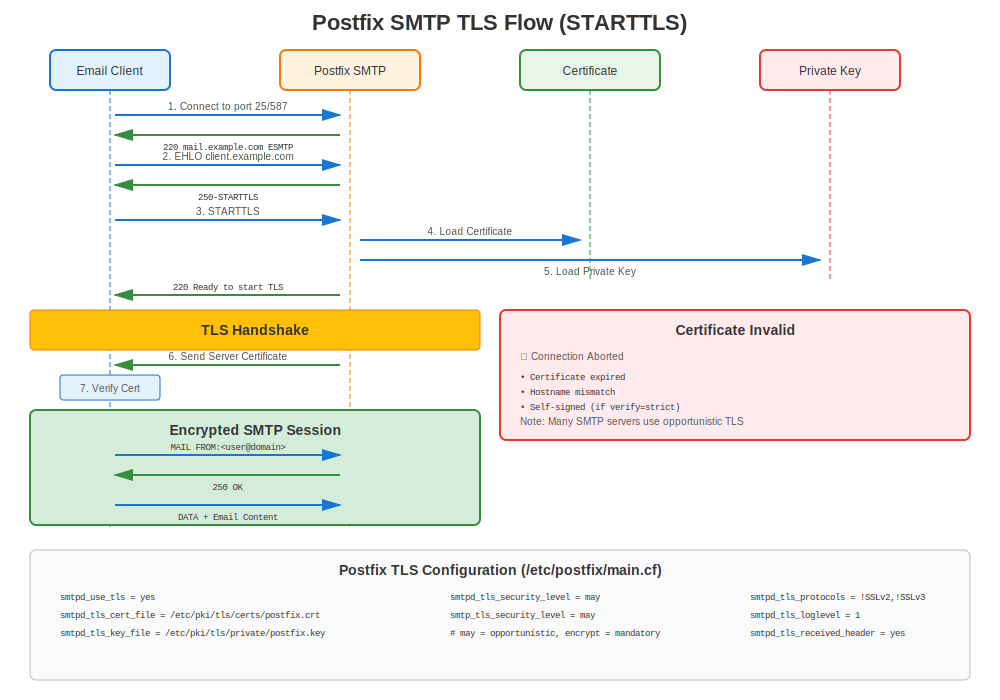

# Chapter 16: Postfix Mail Server TLS

> **Email Security:** Learn how to configure TLS encryption for Postfix mail servers on RHEL, protecting email communications with certificates.

---

## 16.1 Postfix on RHEL Overview



**Package Name:** `postfix`
**Config Location:** `/etc/postfix/main.cf`
**Certificate Path:** `/etc/pki/tls/certs/`
**Key Path:** `/etc/pki/tls/private/`
**Ports:** 25 (SMTP), 465 (SMTPS), 587 (Submission with STARTTLS)

### Why TLS for Email?

- ✅ **Encrypt email in transit** (prevent eavesdropping)
- ✅ **Authenticate mail servers** (prevent impersonation)
- ✅ **Meet compliance requirements** (HIPAA, PCI-DSS)
- ✅ **Prevent spam/phishing** (SPF, DKIM, DMARC work better with TLS)

---

## 16.2 Installation

### All RHEL Versions

```bash
#============================================#
# INSTALL POSTFIX
#============================================#

# Install Postfix
sudo dnf install postfix -y

# Stop and disable Sendmail (if present)
sudo systemctl stop sendmail 2>/dev/null
sudo systemctl disable sendmail 2>/dev/null

# Enable Postfix
sudo systemctl enable postfix
sudo systemctl start postfix

# Open firewall
sudo firewall-cmd --permanent --add-service=smtp
sudo firewall-cmd --permanent --add-service=smtps
sudo firewall-cmd --permanent --add-service=smtp-submission
sudo firewall-cmd --reload

# Verify
systemctl status postfix
ss -tlnp | grep -E ':(25|465|587)'
```

---

## 16.3 Server-Side TLS Configuration

### Receiving Mail with TLS (SMTPD)

```bash
#============================================#
# /etc/postfix/main.cf - SERVER (RECEIVING) TLS
#============================================#

# Certificate files
smtpd_tls_cert_file = /etc/pki/tls/certs/mail.example.com.crt
smtpd_tls_key_file = /etc/pki/tls/private/mail.example.com.key
smtpd_tls_CAfile = /etc/pki/tls/certs/ca-bundle.crt

# TLS security level
smtpd_tls_security_level = may  # or 'encrypt' to require TLS

# Logging
smtpd_tls_loglevel = 1
smtpd_tls_received_header = yes

# Session cache (performance)
smtpd_tls_session_cache_database = btree:${data_directory}/smtpd_scache

# Authentication - only over TLS
smtpd_tls_auth_only = yes

# RHEL 7: Specify protocols manually
# smtpd_tls_protocols = !SSLv2, !SSLv3, !TLSv1, !TLSv1.1
# smtpd_tls_mandatory_protocols = !SSLv2, !SSLv3, !TLSv1, !TLSv1.1

# RHEL 8/9/10: Crypto-policies handle protocols automatically
# (no need to specify smtpd_tls_protocols)
```

**Security Levels Explained:**

| Level | Behavior | Use Case |
|-------|----------|----------|
| `none` | TLS disabled | Not recommended |
| `may` | TLS optional (opportunistic) | Standard (compatible) |
| `encrypt` | TLS required | High security environments |
| `dane` | DNSSEC-based validation | Advanced setups |

---

## 16.4 Client-Side TLS Configuration

### Sending Mail with TLS (SMTP)

```bash
#============================================#
# /etc/postfix/main.cf - CLIENT (SENDING) TLS
#============================================#

# Certificate files (optional for client)
smtp_tls_cert_file = /etc/pki/tls/certs/mail.example.com.crt
smtp_tls_key_file = /etc/pki/tls/private/mail.example.com.key
smtp_tls_CAfile = /etc/pki/tls/certs/ca-bundle.crt

# TLS security level for outbound
smtp_tls_security_level = may  # or 'encrypt' to require

# Logging
smtp_tls_loglevel = 1

# Session cache
smtp_tls_session_cache_database = btree:${data_directory}/smtp_scache

# RHEL 7: Specify protocols
# smtp_tls_protocols = !SSLv2, !SSLv3, !TLSv1, !TLSv1.1
# smtp_tls_mandatory_protocols = !SSLv2, !SSLv3, !TLSv1, !TLSv1.1

# RHEL 8/9/10: Crypto-policies handle it
```

---

## 16.5 Complete Postfix TLS Setup

### Full Configuration Example

```bash
#============================================#
# COMPLETE POSTFIX TLS CONFIGURATION
#============================================#

# 1. Generate certificate and key
sudo openssl genpkey -algorithm RSA \
  -out /etc/pki/tls/private/mail.example.com.key \
  -pkeyopt rsa_keygen_bits:2048

sudo chmod 600 /etc/pki/tls/private/mail.example.com.key

# 2. Generate CSR
sudo openssl req -new \
  -key /etc/pki/tls/private/mail.example.com.key \
  -out /tmp/mail.example.com.csr \
  -subj "/CN=mail.example.com" \
  -addext "subjectAltName=DNS:mail.example.com,DNS:smtp.example.com"

# 3. Get certificate from CA, install it
sudo cp mail.example.com.crt /etc/pki/tls/certs/
sudo chmod 644 /etc/pki/tls/certs/mail.example.com.crt

# 4. Edit /etc/postfix/main.cf
sudo vi /etc/postfix/main.cf

# Add TLS configuration (see sections 16.3 and 16.4)

# 5. Test configuration
sudo postfix check

# 6. Reload Postfix
sudo systemctl reload postfix

# 7. Test SMTP TLS
openssl s_client -starttls smtp -connect mail.example.com:25
```

---

## 16.6 SMTPS (Port 465) Configuration

### Enable SMTPS Service

```bash
#============================================#
# /etc/postfix/master.cf - ENABLE SMTPS
#============================================#

# Uncomment or add SMTPS service (port 465)
smtps     inet  n       -       n       -       -       smtpd
  -o syslog_name=postfix/smtps
  -o smtpd_tls_wrappermode=yes
  -o smtpd_sasl_auth_enable=yes
  -o smtpd_recipient_restrictions=permit_sasl_authenticated,reject
  -o milter_macro_daemon_name=ORIGINATING

# Reload
sudo systemctl reload postfix

# Verify
ss -tlnp | grep :465
```

### Test SMTPS

```bash
# Connect to SMTPS (immediate TLS, no STARTTLS)
openssl s_client -connect mail.example.com:465

# Should show TLS handshake immediately
```

---

## 16.7 Submission Port (587) with STARTTLS

### Enable Submission Service

```bash
#============================================#
# /etc/postfix/master.cf - ENABLE SUBMISSION
#============================================#

# Uncomment or add submission service (port 587)
submission inet n       -       n       -       -       smtpd
  -o syslog_name=postfix/submission
  -o smtpd_tls_security_level=encrypt
  -o smtpd_sasl_auth_enable=yes
  -o smtpd_recipient_restrictions=permit_sasl_authenticated,reject
  -o milter_macro_daemon_name=ORIGINATING

# Reload
sudo systemctl reload postfix

# Verify
ss -tlnp | grep :587
```

### Test Submission Port

```bash
# Test STARTTLS on port 587
openssl s_client -starttls smtp -connect mail.example.com:587

# Should show:
# STARTTLS
# 220 2.0.0 Ready to start TLS
```

---

## 16.8 certmonger Integration

### Automated Certificate Management for Postfix

```bash
#============================================#
# CERTMONGER + POSTFIX
#============================================#

# Install certmonger
# RHEL 8/9/10
sudo dnf install certmonger

# RHEL 7
# sudo yum install certmonger
sudo systemctl enable --now certmonger

# Request certificate from FreeIPA
sudo ipa-getcert request \
  -f /etc/pki/tls/certs/mail.example.com.crt \
  -k /etc/pki/tls/private/mail.example.com.key \
  -D mail.example.com \
  -K host/mail.example.com@REALM \
  -C "postfix reload"  # Auto-reload Postfix after renewal

# Check status
sudo getcert list

# Postfix automatically uses renewed certificate!
```

---

## 16.9 Client Certificate Authentication

### Require Client Certificates (mTLS for SMTP)

```bash
#============================================#
# /etc/postfix/main.cf - CLIENT CERT AUTH
#============================================#

# Server certificates (as before)
smtpd_tls_cert_file = /etc/pki/tls/certs/mail.crt
smtpd_tls_key_file = /etc/pki/tls/private/mail.key

# Client certificate verification
smtpd_tls_CAfile = /etc/pki/tls/certs/client-ca.crt
smtpd_tls_ask_ccert = yes
smtpd_tls_req_ccert = yes  # Require client cert

# Map certificate to user
smtpd_recipient_restrictions =
  permit_tls_clientcerts,
  reject

# Reload
sudo postfix reload
```

**Test with client certificate:**
```bash
openssl s_client -starttls smtp \
  -connect mail.example.com:25 \
  -cert client.crt \
  -key client.key \
  -CAfile ca.crt
```

---

## 16.10 Troubleshooting Postfix TLS

### Diagnostic Commands

```bash
#============================================#
# POSTFIX TLS TROUBLESHOOTING
#============================================#

# Check Postfix configuration
sudo postconf | grep -i tls

# Test configuration syntax
sudo postfix check

# View specific TLS settings
sudo postconf smtpd_tls_cert_file smtpd_tls_key_file

# Check certificate files exist
ls -l /etc/pki/tls/certs/mail.crt
ls -l /etc/pki/tls/private/mail.key

# Verify cert/key pair match
CERT_MOD=$(openssl x509 -noout -modulus -in /etc/pki/tls/certs/mail.crt | openssl md5)
KEY_MOD=$(openssl rsa -noout -modulus -in /etc/pki/tls/private/mail.key | openssl md5)
[ "$CERT_MOD" = "$KEY_MOD" ] && echo "✅ Match" || echo "❌ Mismatch!"

# Test SMTP STARTTLS
openssl s_client -starttls smtp -connect mail.example.com:25

# Test SMTPS (port 465)
openssl s_client -connect mail.example.com:465

# Check logs
sudo tail -f /var/log/maillog | grep -i tls

# Check Postfix queue
mailq

# Verbose logging (for troubleshooting)
sudo postconf smtpd_tls_loglevel=2
sudo postfix reload
# Check /var/log/maillog for detailed TLS info
```

### Common Postfix TLS Issues

| Error | Cause | Solution |
|-------|-------|----------|
| "SSL_accept error" | Certificate/key issue | Verify cert/key pair match |
| "No shared cipher" | Cipher incompatibility | Check crypto-policy or client |
| "certificate verify failed" | Trust chain broken | Install intermediate certs |
| "Permission denied" on key | Wrong permissions | `chmod 600` on key file |
| "TLS is required but not available" | TLS not enabled | Set `smtpd_tls_security_level = may` |
| "STARTTLS failed" | Client TLS issue | Check client TLS support |

---

## 16.11 Version-Specific Considerations

### RHEL 7

```bash
#============================================#
# POSTFIX TLS - RHEL 7 SPECIFIC
#============================================#

# /etc/postfix/main.cf

# MUST manually specify TLS protocols
smtpd_tls_protocols = !SSLv2, !SSLv3, !TLSv1, !TLSv1.1
smtpd_tls_mandatory_protocols = !SSLv2, !SSLv3, !TLSv1, !TLSv1.1

smtp_tls_protocols = !SSLv2, !SSLv3, !TLSv1, !TLSv1.1
smtp_tls_mandatory_protocols = !SSLv2, !SSLv3, !TLSv1, !TLSv1.1

# MUST manually specify ciphers
smtpd_tls_mandatory_ciphers = high
smtpd_tls_ciphers = high

smtp_tls_mandatory_ciphers = high
smtp_tls_ciphers = high

# Exclude weak ciphers
smtpd_tls_mandatory_exclude_ciphers = aNULL, eNULL, EXPORT, DES, RC4, MD5, PSK, aECDH, EDH-DSS-DES-CBC3-SHA, EDH-RSA-DES-CBC3-SHA, KRB5-DES, CBC3-SHA
```

### RHEL 8/9/10

```bash
#============================================#
# POSTFIX TLS - RHEL 8/9/10 WITH CRYPTO-POLICIES
#============================================#

# /etc/postfix/main.cf

# Certificate files
smtpd_tls_cert_file = /etc/pki/tls/certs/mail.crt
smtpd_tls_key_file = /etc/pki/tls/private/mail.key
smtpd_tls_CAfile = /etc/pki/tls/certs/ca-bundle.crt

# TLS settings (crypto-policies handle protocols/ciphers!)
smtpd_tls_security_level = may
smtpd_tls_auth_only = yes
smtpd_tls_loglevel = 1

# Client TLS
smtp_tls_cert_file = /etc/pki/tls/certs/mail.crt
smtp_tls_key_file = /etc/pki/tls/private/mail.key
smtp_tls_security_level = may
smtp_tls_loglevel = 1

# That's it! Much simpler than RHEL 7
# crypto-policies automatically configure TLS versions and ciphers
```

**Key Difference:** RHEL 8+ relies on crypto-policies, making configuration much simpler!

---

## 16.12 Testing Postfix TLS

### Comprehensive Test Suite

```bash
#============================================#
# POSTFIX TLS TESTING
#============================================#

# Test 1: STARTTLS on port 25
openssl s_client -starttls smtp -connect mail.example.com:25

# Look for:
# - "250-STARTTLS" in server capabilities
# - Successful TLS handshake
# - Certificate details

# Test 2: SMTPS on port 465 (direct TLS)
openssl s_client -connect mail.example.com:465

# Test 3: Submission port 587 with STARTTLS
openssl s_client -starttls smtp -connect mail.example.com:587

# Test 4: Verify certificate from server
echo "QUIT" | openssl s_client -starttls smtp -connect mail.example.com:25 2>&1 | \
  openssl x509 -noout -subject -dates

# Test 5: Send test email
echo "Test email" | mail -s "TLS Test" test@example.com

# Test 6: Check TLS in logs
sudo tail -f /var/log/maillog | grep TLS

# Test 7: Check if TLS is being used
sudo postconf | grep -i tls | grep -i level
```

---

## 16.13 Security Best Practices

### Hardened Postfix TLS Configuration

```bash
#============================================#
# HARDENED POSTFIX TLS CONFIG
#============================================#

# /etc/postfix/main.cf

# Server TLS (receiving mail)
smtpd_tls_cert_file = /etc/pki/tls/certs/mail.crt
smtpd_tls_key_file = /etc/pki/tls/private/mail.key
smtpd_tls_CAfile = /etc/pki/tls/certs/ca-bundle.crt

# REQUIRE TLS for authentication
smtpd_tls_security_level = may
smtpd_tls_auth_only = yes

# Client TLS (sending mail)
smtp_tls_cert_file = /etc/pki/tls/certs/mail.crt
smtp_tls_key_file = /etc/pki/tls/private/mail.key
smtp_tls_security_level = may

# RHEL 7: Manually disable weak protocols
smtpd_tls_protocols = !SSLv2, !SSLv3, !TLSv1, !TLSv1.1
smtp_tls_protocols = !SSLv2, !SSLv3, !TLSv1, !TLSv1.1

# Mandatory for authenticated connections
smtpd_tls_mandatory_protocols = !SSLv2, !SSLv3, !TLSv1, !TLSv1.1

# Cipher settings (RHEL 7)
smtpd_tls_mandatory_ciphers = high
smtpd_tls_exclude_ciphers = aNULL, eNULL, EXPORT, DES, RC4, MD5, PSK, aECDH, EDH-DSS-DES-CBC3-SHA, EDH-RSA-DES-CBC3-SHA, KRB5-DES, CBC3-SHA

# Session caching
smtpd_tls_session_cache_database = btree:${data_directory}/smtpd_scache
smtp_tls_session_cache_database = btree:${data_directory}/smtp_scache

# Enhanced logging (temporary for troubleshooting)
smtpd_tls_loglevel = 1
smtp_tls_loglevel = 1

# Performance
smtpd_tls_session_cache_timeout = 3600s
tls_random_source = dev:/dev/urandom
```

---

## 16.14 Dovecot IMAP/POP3 with TLS

### Dovecot Configuration

While this chapter focuses on Postfix (SMTP), Dovecot often runs alongside for IMAP/POP3:

```bash
#============================================#
# DOVECOT TLS (/etc/dovecot/conf.d/10-ssl.conf)
#============================================#

# Enable SSL
ssl = required

# Certificate files
ssl_cert = </etc/pki/tls/certs/mail.example.com.crt
ssl_key = </etc/pki/tls/private/mail.example.com.key

# CA for client cert verification (optional)
#ssl_ca = </etc/pki/tls/certs/ca-bundle.crt

# RHEL 8/9/10: crypto-policies handle it

# TLS protocols (RHEL 7)
#ssl_min_protocol = TLSv1.2

# Cipher suite preferences
#ssl_cipher_list = HIGH:!aNULL:!MD5

# Reload
sudo systemctl reload dovecot
```

**Test IMAPS:**
```bash
openssl s_client -connect mail.example.com:993

# Test POP3S
openssl s_client -connect mail.example.com:995
```

---

## 16.15 Common Scenarios

### Scenario 1: Opportunistic TLS (Standard)

**Goal:** Accept both encrypted and unencrypted connections

```bash
# /etc/postfix/main.cf
smtpd_tls_security_level = may  # Optional TLS
smtp_tls_security_level = may   # Optional TLS

# Why: Maximum compatibility
# Drawback: Some connections may not be encrypted
```

### Scenario 2: Mandatory TLS (High Security)

**Goal:** Reject unencrypted connections

```bash
# /etc/postfix/main.cf
smtpd_tls_security_level = encrypt  # REQUIRE TLS
smtp_tls_security_level = encrypt   # REQUIRE TLS

# Why: Maximum security
# Drawback: Old systems may fail to connect
```

### Scenario 3: Client Certificate for Relay

**Goal:** Allow relay only with valid client certificate

```bash
# /etc/postfix/main.cf
smtpd_tls_cert_file = /etc/pki/tls/certs/mail.crt
smtpd_tls_key_file = /etc/pki/tls/private/mail.key
smtpd_tls_CAfile = /etc/pki/tls/certs/client-ca.crt

smtpd_tls_ask_ccert = yes
smtpd_tls_req_ccert = yes

smtpd_recipient_restrictions =
  permit_tls_clientcerts,
  reject_unauth_destination

# Only clients with valid cert from client-ca.crt can relay
```

---

## 16.16 Monitoring Postfix TLS

### What to Monitor

```bash
#============================================#
# POSTFIX TLS MONITORING
#============================================#

# Check TLS usage in logs
sudo grep "TLS connection established" /var/log/maillog | tail -20

# Count TLS vs non-TLS connections
sudo grep "connect from" /var/log/maillog | grep -c "TLS"

# Check for TLS errors
sudo grep "TLS" /var/log/maillog | grep -i error

# Monitor certificate expiration
openssl x509 -in /etc/pki/tls/certs/mail.crt -noout -checkend $((86400*30))

# certmonger status (if used)
sudo getcert list -f /etc/pki/tls/certs/mail.crt

# Check queue for TLS failures
mailq
```

### Monitoring Script

```bash
#!/bin/bash
# monitor-postfix-tls.sh

echo "=== Postfix TLS Monitoring ==="

# Certificate expiration
echo "1. Certificate Expiration:"
openssl x509 -in /etc/pki/tls/certs/mail.crt -noout -enddate

# TLS connections today
echo ""
echo "2. TLS Connections Today:"
sudo grep "$(date '+%b %e')" /var/log/maillog | grep "TLS connection" | wc -l

# TLS errors today
echo ""
echo "3. TLS Errors Today:"
sudo grep "$(date '+%b %e')" /var/log/maillog | grep -i "tls.*error" | tail -5

# Service status
echo ""
echo "4. Postfix Status:"
systemctl is-active postfix

# Listening ports
echo ""
echo "5. Listening on:"
ss -tlnp | grep master | grep -E ':(25|465|587)'
```

---

## 16.17 Common Issues and Solutions

### Issue 1: Certificate Not Trusted by Clients

**Symptom:** Clients get "untrusted certificate" warnings

**Diagnosis:**
```bash
# Test certificate chain
openssl s_client -starttls smtp -connect mail.example.com:25 -showcerts

# Check if intermediate certificates included
sudo postconf smtpd_tls_cert_file
# Should include full chain or use smtpd_tls_chain_files
```

**Solution:**
```bash
# Option 1: Include chain in certificate file
cat server.crt intermediate.crt > /etc/pki/tls/certs/mail-chain.crt

# Update config
sudo postconf -e 'smtpd_tls_cert_file = /etc/pki/tls/certs/mail-chain.crt'
sudo postfix reload

# Option 2: Use separate chain file (Postfix 3.4+)
sudo postconf -e 'smtpd_tls_chain_files = /etc/pki/tls/certs/chain.crt'
```

### Issue 2: "Permission denied" on Private Key

**Symptom:** Postfix won't start, logs show permission error

**Fix:**
```bash
# Set correct permissions
sudo chmod 600 /etc/pki/tls/private/mail.key
sudo chown root:postfix /etc/pki/tls/private/mail.key

# Fix SELinux context
sudo restorecon -v /etc/pki/tls/private/mail.key

# Restart Postfix
sudo systemctl restart postfix
```

### Issue 3: TLS Not Offered to Clients

**Symptom:** STARTTLS not shown in EHLO response

**Diagnosis:**
```bash
# Telnet to server
telnet mail.example.com 25
# Type: EHLO test
# Should show: 250-STARTTLS

# If not shown, check config
sudo postconf smtpd_tls_security_level
# Should be 'may' or 'encrypt', not 'none'
```

**Solution:**
```bash
sudo postconf -e 'smtpd_tls_security_level = may'
sudo postfix reload
```

---

## 16.18 Version Comparison Table

| Feature | RHEL 7 | RHEL 8 | RHEL 9 | RHEL 10 |
|---------|--------|--------|--------|---------|
| **Postfix Version** | 2.10.x | 3.3.x+ | 3.5.x+ | 3.8.x+ |
| **OpenSSL** | 1.0.2k | 1.1.1k | 3.5.5 | 3.5.5 |
| **TLS Config** | Manual | Crypto-policies | Crypto-policies | Crypto-policies |
| **Default TLS** | May include 1.0/1.1 | TLS 1.2+ | TLS 1.2+ | TLS 1.3 preferred |
| **certmonger** | Basic | Enhanced | Enhanced | Enhanced |

---

## 16.19 Quick Setup Script

```bash
#!/bin/bash
# setup-postfix-tls.sh - Complete Postfix TLS setup

DOMAIN="example.com"
HOSTNAME="mail.$DOMAIN"

echo "=== Postfix TLS Setup for $HOSTNAME ==="

# 1. Install Postfix
sudo dnf install -y postfix

# 2. Generate certificate (or use certmonger)
sudo openssl genpkey -algorithm RSA \
  -out /etc/pki/tls/private/$HOSTNAME.key \
  -pkeyopt rsa_keygen_bits:2048

sudo chmod 600 /etc/pki/tls/private/$HOSTNAME.key

# 3. Generate self-signed for testing (replace with proper cert!)
sudo openssl req -new -x509 -days 365 \
  -key /etc/pki/tls/private/$HOSTNAME.key \
  -out /etc/pki/tls/certs/$HOSTNAME.crt \
  -subj "/CN=$HOSTNAME" \
  -addext "subjectAltName=DNS:$HOSTNAME,DNS:smtp.$DOMAIN"

# 4. Configure Postfix
sudo postconf -e "smtpd_tls_cert_file = /etc/pki/tls/certs/$HOSTNAME.crt"
sudo postconf -e "smtpd_tls_key_file = /etc/pki/tls/private/$HOSTNAME.key"
sudo postconf -e "smtpd_tls_security_level = may"
sudo postconf -e "smtpd_tls_auth_only = yes"
sudo postconf -e "smtpd_tls_loglevel = 1"

sudo postconf -e "smtp_tls_cert_file = /etc/pki/tls/certs/$HOSTNAME.crt"
sudo postconf -e "smtp_tls_key_file = /etc/pki/tls/private/$HOSTNAME.key"
sudo postconf -e "smtp_tls_security_level = may"

# 5. Open firewall
sudo firewall-cmd --permanent --add-service=smtp
sudo firewall-cmd --permanent --add-service=smtps
sudo firewall-cmd --permanent --add-service=smtp-submission
sudo firewall-cmd --reload

# 6. Start Postfix
sudo systemctl enable postfix
sudo systemctl restart postfix

# 7. Test
echo "Testing SMTP STARTTLS..."
echo "QUIT" | openssl s_client -starttls smtp -connect localhost:25 2>&1 | grep -E "(CONNECTED|subject=)"

echo "✅ Postfix TLS setup complete!"
echo "⚠️ Replace self-signed cert with proper certificate from CA"
```

---

## 16.20 Key Takeaways

1. **Postfix supports TLS** on ports 25 (STARTTLS), 465 (SMTPS), 587 (Submission)
2. **RHEL 7 requires manual TLS config** (protocols, ciphers)
3. **RHEL 8+ uses crypto-policies** (much simpler!)
4. **Security levels:** `none`, `may`, `encrypt`, `dane`
5. **certmonger works great** with Postfix
6. **Always test** with `openssl s_client -starttls smtp`
7. **Monitor logs** for TLS errors

---

## Quick Reference Card

```
┌──────────────────────────────────────────────────────────────┐
│ POSTFIX TLS QUICK REFERENCE                                  │
├──────────────────────────────────────────────────────────────┤
│ Config:       /etc/postfix/main.cf                           │
│ Certs:        smtpd_tls_cert_file = /path/to/cert.crt        │
│ Keys:         smtpd_tls_key_file = /path/to/key.key          │
│ Security:     smtpd_tls_security_level = may|encrypt         │
│                                                              │
│ Test:         openssl s_client -starttls smtp -connect :25   │
│ Reload:       postfix reload                                 │
│ Check:        postfix check                                  │
│ Logs:         tail -f /var/log/maillog | grep TLS            │
│                                                              │
│ Ports:        25 (SMTP+STARTTLS)                             │
│               465 (SMTPS - direct TLS)                       │
│               587 (Submission with STARTTLS)                 │
│                                                              │
│ certmonger:   ipa-getcert ... -C "postfix reload"            │
└──────────────────────────────────────────────────────────────┘

⚠️ RHEL 7: Manual protocol/cipher config needed
✅ RHEL 8/9/10: Crypto-policies handle TLS settings
```

---

## 🧪 Hands-On Lab

**Lab 08: Postfix TLS**

Configure TLS for Postfix mail server

- 📁 **Location:** `labs/en_US/08-postfix-tls/`
- ⏱️ **Time:** 30 minutes
- 🎯 **Level:** Intermediate

---

**Chapter Navigation**

| [← Previous: Chapter 15 - NGINX on RHEL](15-nginx.md) | [Next: Chapter 17 - OpenLDAP & Directory Services →](17-openldap-ldaps.md) |
|:---|---:|
