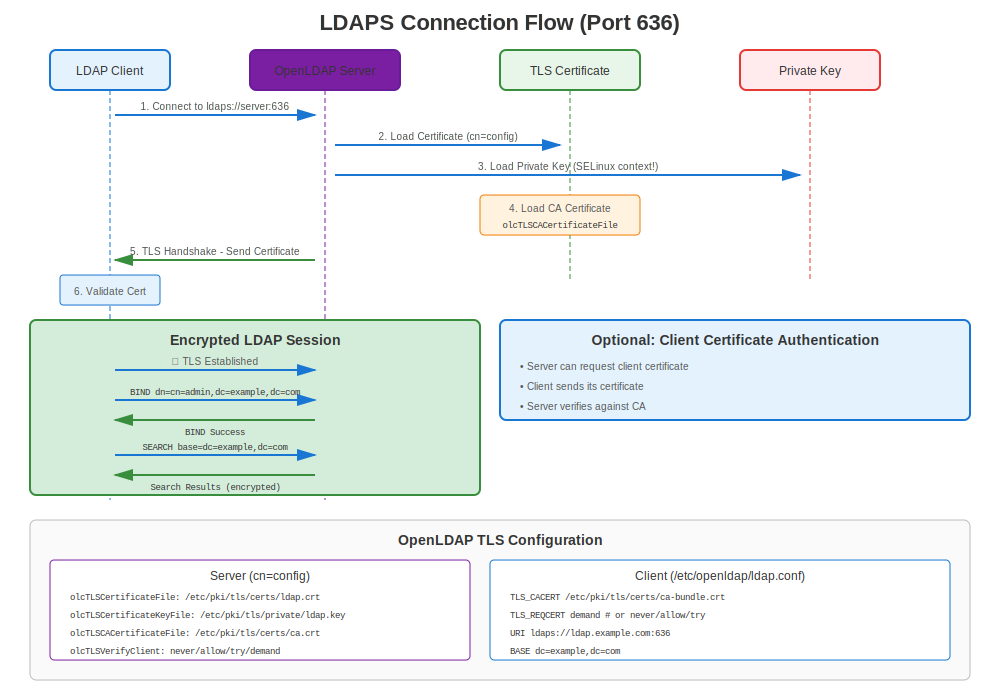

# Chapter 17: OpenLDAP & Directory Services

> **Enterprise Directory:** Learn how to secure OpenLDAP directory services with TLS/SSL on RHEL, protecting user authentication and directory queries.

---

## 17.1 LDAP vs LDAPS vs STARTTLS



### Three Ways to Secure LDAP

| Method | Port | Encryption | Use Case |
|--------|------|------------|----------|
| **LDAP** | 389 | ❌ None | Legacy, not recommended |
| **LDAPS** | 636 | ✅ TLS from start | Preferred, encrypted |
| **LDAP+STARTTLS** | 389 | ✅ Upgrade to TLS | Alternative to LDAPS |

**Recommendation:** Use LDAPS (port 636) for simplicity and security.

---

## 17.2 OpenLDAP Installation

### All RHEL Versions

```bash
#============================================#
# INSTALL OPENLDAP SERVER
#============================================#

# Install OpenLDAP server
sudo dnf install openldap-servers openldap-clients -y

# Start and enable
sudo systemctl enable slapd
sudo systemctl start slapd

# Open firewall
sudo firewall-cmd --permanent --add-service=ldap
sudo firewall-cmd --permanent --add-service=ldaps
sudo firewall-cmd --reload

# Verify
systemctl status slapd
ss -tlnp | grep -E ':(389|636)'
```

---

## 17.3 Generating Certificates for LDAP

### Certificate Requirements

LDAP certificates should include:
- ✅ **CN** matching LDAP server hostname
- ✅ **SANs** with LDAP server FQDN
- ✅ **Server Authentication** key usage
- ✅ **Valid trust chain**

```bash
#============================================#
# GENERATE LDAP SERVER CERTIFICATE
#============================================#

# Step 1: Generate private key
sudo openssl genpkey -algorithm RSA \
  -out /etc/openldap/certs/ldap.key \
  -pkeyopt rsa_keygen_bits:2048

# Step 2: Set permissions (important!)
sudo chmod 600 /etc/openldap/certs/ldap.key
sudo chown ldap:ldap /etc/openldap/certs/ldap.key

# Step 3: Generate CSR
sudo openssl req -new \
  -key /etc/openldap/certs/ldap.key \
  -out /tmp/ldap.csr \
  -subj "/CN=ldap.example.com" \
  -addext "subjectAltName=DNS:ldap.example.com,DNS:dir.example.com"

# Step 4: Get certificate from CA

# Step 5: Install certificate
sudo cp ldap.crt /etc/openldap/certs/
sudo chmod 644 /etc/openldap/certs/ldap.crt
sudo chown ldap:ldap /etc/openldap/certs/ldap.crt

# Step 6: Install CA certificate
sudo cp ca.crt /etc/openldap/certs/
sudo chmod 644 /etc/openldap/certs/ca.crt
```

---

## 17.4 OpenLDAP TLS Configuration

### Method 1: cn=config (Dynamic Configuration)

```bash
#============================================#
# CONFIGURE TLS WITH cn=config (PREFERRED)
#============================================#

# Create LDIF file
cat > /tmp/tls-config.ldif << EOF
dn: cn=config
changetype: modify
add: olcTLSCertificateFile
olcTLSCertificateFile: /etc/openldap/certs/ldap.crt
-
add: olcTLSCertificateKeyFile
olcTLSCertificateKeyFile: /etc/openldap/certs/ldap.key
-
add: olcTLSCACertificateFile
olcTLSCACertificateFile: /etc/openldap/certs/ca.crt
-
replace: olcTLSProtocolMin
olcTLSProtocolMin: 3.2
EOF

# Apply configuration
sudo ldapmodify -Y EXTERNAL -H ldapi:/// -f /tmp/tls-config.ldif

# Restart slapd
sudo systemctl restart slapd

# Verify
sudo slapcat -b "cn=config" | grep -i tls
```

### Method 2: slapd.conf (Legacy)

```bash
#============================================#
# CONFIGURE TLS WITH slapd.conf (LEGACY)
#============================================#

# Edit /etc/openldap/slapd.conf

TLSCertificateFile      /etc/openldap/certs/ldap.crt
TLSCertificateKeyFile   /etc/openldap/certs/ldap.key
TLSCACertificateFile    /etc/openldap/certs/ca.crt

# RHEL 7: Manually specify TLS version
TLSProtocolMin          1.2

# Restart
sudo systemctl restart slapd
```

---

## 17.5 Client Configuration

### Configure LDAP Client for TLS

```bash
#============================================#
# /etc/openldap/ldap.conf - CLIENT CONFIG
#============================================#

# Server URI (use ldaps:// for port 636)
URI ldaps://ldap.example.com

# CA certificate for validation
TLS_CACERT /etc/pki/tls/certs/ca-bundle.crt

# Certificate verification
TLS_REQCERT demand  # require valid certificate

# RHEL 7: Specify minimum TLS version
# TLS_PROTOCOL_MIN 1.2
```

### Test LDAP Client Connection

```bash
#============================================#
# TEST LDAPS CLIENT CONNECTION
#============================================#

# Test LDAPS (port 636)
ldapsearch -H ldaps://ldap.example.com:636 \
  -D "cn=admin,dc=example,dc=com" \
  -W \
  -b "dc=example,dc=com" \
  "(objectClass=*)"

# Test LDAP with STARTTLS (port 389)
ldapsearch -H ldap://ldap.example.com:389 -ZZ \
  -D "cn=admin,dc=example,dc=com" \
  -W \
  -b "dc=example,dc=com"

# -ZZ enforces STARTTLS (fails if unavailable)
# -Z attempts STARTTLS (continues without if unavailable)
```

---

## 17.6 FreeIPA Integration

**Note:** FreeIPA is covered in detail in Chapter 19. This is a quick overview.

### FreeIPA Automatically Handles LDAPS

```bash
#============================================#
# FREEIPA LDAPS (AUTOMATIC!)
#============================================#

# FreeIPA automatically configures LDAPS
# No manual certificate config needed!

# Test FreeIPA LDAPS
ldapsearch -H ldaps://ipa.example.com:636 \
  -D "uid=admin,cn=users,cn=accounts,dc=example,dc=com" \
  -W \
  -b "dc=example,dc=com"

# FreeIPA certificates managed by certmonger automatically
sudo getcert list | grep -A10 "Directory Server"
```

---

## 17.7 Testing OpenLDAP TLS

### Comprehensive Testing

```bash
#============================================#
# OPENLDAP TLS TESTING
#============================================#

# Test 1: Check if slapd is listening
ss -tlnp | grep slapd
# Should show ports 389 and/or 636

# Test 2: Test LDAPS connection with OpenSSL
openssl s_client -connect ldap.example.com:636

# Look for:
# - Successful TLS handshake
# - Certificate details
# - Verify return code: 0 (ok)

# Test 3: Test with ldapsearch (anonymous)
ldapsearch -H ldaps://ldap.example.com:636 \
  -x -b "" -s base "(objectClass=*)" namingContexts

# Test 4: Test authenticated query
ldapsearch -H ldaps://ldap.example.com:636 \
  -D "cn=admin,dc=example,dc=com" \
  -W \
  -b "dc=example,dc=com" \
  "(uid=*)"

# Test 5: Test STARTTLS
ldapsearch -H ldap://ldap.example.com:389 -ZZ \
  -x -b "" -s base

# Test 6: Verify certificate from server
echo | openssl s_client -connect ldap.example.com:636 2>&1 | \
  openssl x509 -noout -subject -issuer -dates
```

---

## 17.8 Troubleshooting OpenLDAP TLS

### Diagnostic Commands

```bash
#============================================#
# OPENLDAP TLS DIAGNOSTICS
#============================================#

# Check slapd configuration
sudo slapcat -b "cn=config" | grep -i tls

# Check certificate files
sudo ls -lZ /etc/openldap/certs/

# Verify permissions
# Key should be readable by 'ldap' user
sudo -u ldap cat /etc/openldap/certs/ldap.key >/dev/null && \
  echo "✅ Key readable" || echo "❌ Permission denied"

# Check SELinux context
ls -Z /etc/openldap/certs/*.{crt,key}

# Check slapd logs
sudo journalctl -u slapd -f

# Test with verbose OpenSSL
openssl s_client -connect ldap.example.com:636 -showcerts -debug

# Test STARTTLS
ldapsearch -H ldap://ldap.example.com:389 -ZZ -d 1
```

### Common OpenLDAP TLS Issues

| Error | Cause | Solution |
|-------|-------|----------|
| "TLS: can't connect" | Certificate/key not readable | Check ownership: `chown ldap:ldap` |
| "TLS: hostname does not match" | CN/SAN mismatch | Regenerate cert with correct hostname |
| "Certificate verification failed" | CA not trusted | Add CA to client's trust store |
| "Permission denied" on key | Wrong ownership/permissions | `chmod 600`, `chown ldap:ldap` |
| "TLS engine not initialized" | TLS not configured | Add TLS directives to config |
| "error:14094410:SSL routines" | Protocol/cipher mismatch | Check crypto-policy (RHEL 8+) |

---

## 17.9 Client Certificate Authentication

### Require Client Certificates

```bash
#============================================#
# OPENLDAP WITH CLIENT CERT AUTH
#============================================#

# Server configuration (cn=config)
cat > /tmp/client-cert.ldif << EOF
dn: cn=config
changetype: modify
add: olcTLSVerifyClient
olcTLSVerifyClient: demand
-
add: olcTLSCACertificateFile
olcTLSCACertificateFile: /etc/openldap/certs/client-ca.crt
EOF

sudo ldapmodify -Y EXTERNAL -H ldapi:/// -f /tmp/client-cert.ldif

# Restart
sudo systemctl restart slapd
```

**Client connection with certificate:**
```bash
# Client must provide certificate
ldapsearch -H ldaps://ldap.example.com:636 \
  -x -b "dc=example,dc=com" \
  -ZZ

# Configure client cert in /etc/openldap/ldap.conf:
TLS_CERT /etc/openldap/certs/client.crt
TLS_KEY /etc/openldap/certs/client.key
```

---

## 17.10 Version-Specific Considerations

### RHEL 7

```bash
#============================================#
# OPENLDAP TLS - RHEL 7
#============================================#

# Manual TLS protocol specification
# In slapd.conf or cn=config:
TLSProtocolMin 1.2

# Or with cn=config:
olcTLSProtocolMin: 3.2  # 3.1=TLS1.0, 3.2=TLS1.1, 3.3=TLS1.2

# Manual cipher configuration
TLSCipherSuite HIGH:!aNULL:!MD5:!3DES

# Test
openssl s_client -connect ldap.example.com:636 -tls1_2
```

### RHEL 8/9/10

```bash
#============================================#
# OPENLDAP TLS - RHEL 8/9/10
#============================================#

# Crypto-policies automatically configure TLS
# No need to specify TLSProtocolMin or ciphers!

# Just configure certificates:
olcTLSCertificateFile: /etc/openldap/certs/ldap.crt
olcTLSCertificateKeyFile: /etc/openldap/certs/ldap.key
olcTLSCACertificateFile: /etc/openldap/certs/ca.crt

# Crypto-policy handles the rest
update-crypto-policies --show
```

---

## 17.11 certmonger with OpenLDAP

### Automated Certificate Management

```bash
#============================================#
# CERTMONGER + OPENLDAP
#============================================#

# Install certmonger
# RHEL 8/9/10
sudo dnf install certmonger

# RHEL 7
# sudo yum install certmonger
sudo systemctl enable --now certmonger

# Request certificate from FreeIPA
sudo ipa-getcert request \
  -f /etc/openldap/certs/ldap.crt \
  -k /etc/openldap/certs/ldap.key \
  -D ldap.example.com \
  -K ldap/ldap.example.com@REALM \
  -C "systemctl restart slapd"  # Restart slapd after renewal

# Set proper ownership
sudo chown ldap:ldap /etc/openldap/certs/ldap.{crt,key}
sudo chmod 600 /etc/openldap/certs/ldap.key

# Monitor
sudo getcert list
```

---

## 17.12 Troubleshooting LDAPS

### Diagnostic Steps

```bash
#============================================#
# LDAPS TROUBLESHOOTING
#============================================#

# Step 1: Verify slapd is listening on 636
ss -tlnp | grep 636

# Step 2: Check certificate configuration
sudo slapcat -b "cn=config" | grep olcTLS

# Step 3: Test certificate file
sudo openssl x509 -in /etc/openldap/certs/ldap.crt -noout -text

# Step 4: Test key file
sudo openssl rsa -in /etc/openldap/certs/ldap.key -check

# Step 5: Verify cert/key match
CERT_MOD=$(openssl x509 -noout -modulus -in /etc/openldap/certs/ldap.crt | openssl md5)
KEY_MOD=$(openssl rsa -noout -modulus -in /etc/openldap/certs/ldap.key | openssl md5)
[ "$CERT_MOD" = "$KEY_MOD" ] && echo "✅ Match" || echo "❌ Mismatch!"

# Step 6: Check permissions
ls -l /etc/openldap/certs/
# Key should be owned by ldap:ldap with mode 600

# Step 7: Test connection
openssl s_client -connect ldap.example.com:636

# Step 8: Check logs
sudo journalctl -u slapd | grep -i tls

# Step 9: Test from client
ldapsearch -H ldaps://ldap.example.com:636 -x -b "" -s base

# Step 10: Check SELinux
sudo ausearch -m avc -ts recent | grep ldap
```

---

## 17.13 Common Issues and Solutions

### Issue 1: "TLS: can't accept" Error

**Symptom:** LDAPS connection refused

**Diagnosis:**
```bash
sudo journalctl -u slapd | grep "TLS: can't accept"
```

**Causes & Solutions:**
```bash
# Cause 1: Key not readable by ldap user
sudo chown ldap:ldap /etc/openldap/certs/ldap.key
sudo chmod 600 /etc/openldap/certs/ldap.key

# Cause 2: SELinux blocking
sudo restorecon -Rv /etc/openldap/certs/
# Or check for denials:
sudo ausearch -m avc -ts recent | grep ldap

# Cause 3: Certificate/key mismatch
# Regenerate CSR with correct key
```

### Issue 2: "TLS: hostname does not match"

**Symptom:** Client gets hostname mismatch error

**Diagnosis:**
```bash
# Check certificate CN and SANs
openssl x509 -in /etc/openldap/certs/ldap.crt -noout -subject -ext subjectAltName
```

**Solution:**
```bash
# Reissue certificate with correct hostname in SANs
openssl req -new -key /etc/openldap/certs/ldap.key -out /tmp/ldap.csr \
  -subj "/CN=ldap.example.com" \
  -addext "subjectAltName=DNS:ldap.example.com,DNS:ldap,IP:10.0.0.10"

# Or on client side: allow looser verification (NOT recommended for production)
# In /etc/openldap/ldap.conf:
TLS_REQCERT allow  # instead of 'demand'
```

### Issue 3: Certificate Not Trusted

**Symptom:** "Certificate verification failed"

**Solution:**
```bash
# Add CA to system trust store
sudo cp ldap-ca.crt /etc/pki/ca-trust/source/anchors/
sudo update-ca-trust

# Or specify CA in client config
# /etc/openldap/ldap.conf:
TLS_CACERT /etc/openldap/certs/ca.crt
```

---

## 17.14 Security Best Practices

### Hardened OpenLDAP TLS Configuration

```ldif
#============================================#
# HARDENED LDAP TLS CONFIG (cn=config)
#============================================#

dn: cn=config
changetype: modify
replace: olcTLSCertificateFile
olcTLSCertificateFile: /etc/openldap/certs/ldap.crt
-
replace: olcTLSCertificateKeyFile
olcTLSCertificateKeyFile: /etc/openldap/certs/ldap.key
-
replace: olcTLSCACertificateFile
olcTLSCACertificateFile: /etc/openldap/certs/ca.crt
-
replace: olcTLSProtocolMin
olcTLSProtocolMin: 3.3
-
replace: olcTLSCipherSuite
olcTLSCipherSuite: HIGH:!aNULL:!MD5:!RC4
-
add: olcTLSVerifyClient
olcTLSVerifyClient: never
```

**Apply:**
```bash
sudo ldapmodify -Y EXTERNAL -H ldapi:/// -f hardened-tls.ldif
sudo systemctl restart slapd
```

---

## 17.15 Integration with System Services

### SSSD with LDAPS (System Authentication)

```bash
#============================================#
# CONFIGURE SSSD TO USE LDAPS
#============================================#

# /etc/sssd/sssd.conf

[domain/example.com]
id_provider = ldap
auth_provider = ldap
ldap_uri = ldaps://ldap.example.com:636
ldap_search_base = dc=example,dc=com
ldap_tls_cacert = /etc/pki/tls/certs/ca-bundle.crt
ldap_tls_reqcert = demand

# Restart SSSD
sudo systemctl restart sssd

# Test
id ldapuser@example.com
```

---

## 17.16 Monitoring LDAP TLS

### Monitoring Commands

```bash
#============================================#
# MONITOR LDAP TLS
#============================================#

# Check certificate expiration
openssl s_client -connect ldap.example.com:636 2>/dev/null | \
  openssl x509 -noout -dates

# Check TLS connections
sudo journalctl -u slapd | grep "TLS established"

# Count LDAPS vs LDAP connections
sudo journalctl -u slapd --since today | grep -c "conn=.*LDAPS"
sudo journalctl -u slapd --since today | grep -c "conn=.*LDAP"

# Check for TLS errors
sudo journalctl -u slapd | grep -i "tls.*error"

# certmonger status (if used)
sudo getcert list -d /etc/openldap/certs
```

---

## 17.17 Key Takeaways

1. **LDAPS (port 636)** is simpler than STARTTLS
2. **Certificate ownership critical** - Must be readable by `ldap` user
3. **cn=config preferred** over slapd.conf (modern RHEL)
4. **FreeIPA handles LDAPS automatically** - Much easier!
5. **Client configuration matters** - Set TLS_CACERT correctly
6. **Test thoroughly** - Use `openssl s_client` and `ldapsearch -ZZ`
7. **certmonger automates** certificate renewal

---

## Quick Reference Card

```
┌──────────────────────────────────────────────────────────────┐
│ OPENLDAP TLS QUICK REFERENCE                                 │
├──────────────────────────────────────────────────────────────┤
│ Config:       cn=config (dynamic) or slapd.conf (legacy)     │
│ Certs:        /etc/openldap/certs/                           │
│ Ownership:    chown ldap:ldap *.{crt,key}                    │
│ Permissions:  chmod 600 ldap.key                             │
│                                                              │
│ LDAPS:        Port 636 (TLS from start)                      │
│ STARTTLS:     Port 389 (upgrade to TLS)                      │
│                                                              │
│ Test LDAPS:   openssl s_client -connect host:636             │
│ Test STLS:    ldapsearch -H ldap://host:389 -ZZ              │
│                                                              │
│ Client:       /etc/openldap/ldap.conf                        │
│               TLS_CACERT /path/to/ca.crt                     │
│               TLS_REQCERT demand                             │
│                                                              │
│ Logs:         journalctl -u slapd | grep TLS                 │
└──────────────────────────────────────────────────────────────┘

⚠️ Key must be owned by 'ldap' user!
✅ Use FreeIPA for easier LDAP+TLS management
```

---

## 🧪 Hands-On Lab

**Lab 09: OpenLDAP LDAPS**

Configure LDAPS for secure directory services

- 📁 **Location:** `labs/en_US/09-openldap-ldaps/`
- ⏱️ **Time:** 35-40 minutes
- 🎯 **Level:** Intermediate

---

**Chapter Navigation**

| [← Previous: Chapter 16 - Postfix Mail Server TLS](16-postfix-mail.md) | [Next: Chapter 18 - Database TLS (PostgreSQL, MySQL) →](18-database-tls.md) |
|:---|---:|
