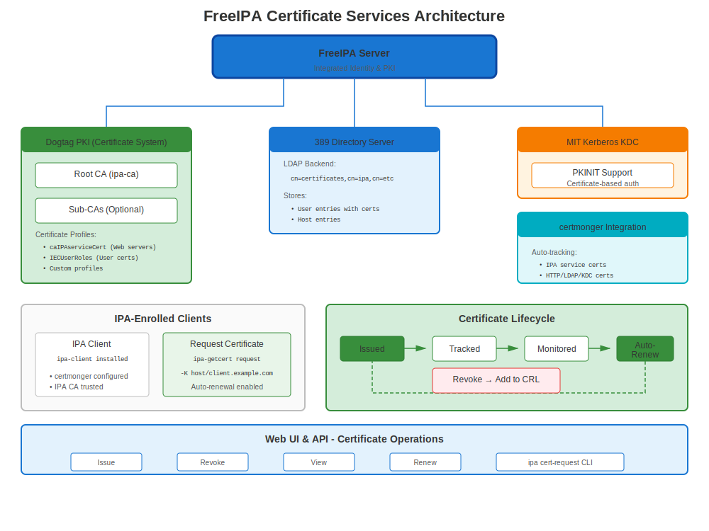
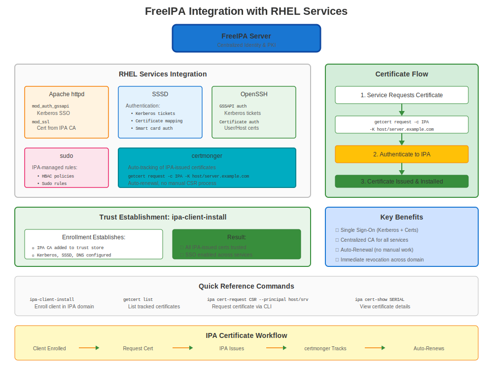

# Chapter 19: FreeIPA Certificate Services

> **Enterprise CA:** FreeIPA is Red Hat's integrated identity and certificate management solution. It's the recommended way to run an internal CA on RHEL.

---

## 19.1 What is FreeIPA?



**FreeIPA** (Identity, Policy, Audit) is an integrated security information management solution combining:
- 🔐 **Identity Management** (LDAP directory)
- 🎫 **Authentication** (Kerberos)
- 🔏 **Certificate Authority** (Dogtag PKI)
- 📋 **Policy Management** (sudo, HBAC)
- 🔍 **DNS** (BIND integration)

### Why FreeIPA for Certificates?

**Instead of:**
- ❌ Manually managing certificates per server
- ❌ External CA costs
- ❌ Complex PKI infrastructure

**FreeIPA Provides:**
- ✅ Internal CA (free!)
- ✅ Automatic certificate enrollment
- ✅ Auto-renewal via certmonger
- ✅ Certificate profiles
- ✅ Web UI and CLI management
- ✅ Integration with RHEL services

---

## 19.2 FreeIPA Installation (Server)

### Prerequisites

```bash
#============================================#
# PREREQUISITES FOR FREEIPA SERVER
#============================================#

# Requirements:
# - RHEL 7/8/9/10
# - Minimum 2 GB RAM (4 GB recommended)
# - Fully qualified hostname
# - Proper DNS resolution
# - Static IP address

# Verify hostname
hostnamectl
# Must show FQDN: ipa.example.com

# Verify DNS
nslookup $(hostname -f)

# Set hostname if needed
sudo hostnamectl set-hostname ipa.example.com
```

### Install FreeIPA Server

```bash
#============================================#
# INSTALL FREEIPA SERVER
#============================================#

# Install packages
sudo dnf install ipa-server ipa-server-dns -y

# Run installation wizard
sudo ipa-server-install \
  --realm EXAMPLE.COM \
  --domain example.com \
  --ds-password 'DirectoryPassword123!' \
  --admin-password 'AdminPassword123!' \
  --hostname ipa.example.com \
  --setup-dns \
  --forwarder 8.8.8.8 \
  --forwarder 8.8.4.4 \
  --unattended

# Installation takes 5-15 minutes

# Open firewall
sudo firewall-cmd --add-service={http,https,dns,ntp,freeipa-ldap,freeipa-ldaps,freeipa-replication} --permanent
sudo firewall-cmd --reload

# Verify
sudo ipactl status

# Should show multiple services running:
# - Directory Service (389-ds)
# - Certificate Authority (pki-tomcatd)
# - Kerberos KDC
# - Apache Web Server
# - DNS (named)
```

### Access FreeIPA Web UI

```bash
# Get Kerberos ticket
kinit admin
# Password: AdminPassword123!

# Access Web UI
# https://ipa.example.com/
# Username: admin
# Password: AdminPassword123!
```

---

## 19.3 Enrolling Clients

### Client Installation

```bash
#============================================#
# ENROLL CLIENT TO FREEIPA
#============================================#

# On client system (web01.example.com)

# Install IPA client
sudo dnf install ipa-client -y

# Enroll
sudo ipa-client-install \
  --domain example.com \
  --realm EXAMPLE.COM \
  --server ipa.example.com \
  --principal admin \
  --password 'AdminPassword123!' \
  --mkhomedir \
  --unattended

# Verify
sudo ipa-client-install --uninstall  # Just kidding, don't run this!

# Verify enrollment
ipa ping
# Pong!

# Check certificate tracking
sudo getcert list
# Shows certmonger tracking host certificate
```

---

## 19.4 Requesting Certificates from FreeIPA

### Method 1: Web UI

1. Navigate to https://ipa.example.com/
2. Identity → Hosts → Select host → Actions → New Certificate
3. Or: Identity → Services → Add service → Request certificate

### Method 2: CLI (Recommended)

```bash
#============================================#
# REQUEST CERTIFICATE FROM FREEIPA
#============================================#

# For HTTP service on web01
sudo ipa-getcert request \
  -f /etc/pki/tls/certs/web01.crt \
  -k /etc/pki/tls/private/web01.key \
  -K HTTP/web01.example.com@EXAMPLE.COM \
  -D web01.example.com \
  -C "systemctl reload httpd"

# For custom service
sudo ipa-getcert request \
  -f /etc/pki/tls/certs/myapp.crt \
  -k /etc/pki/tls/private/myapp.key \
  -K myapp/web01.example.com@EXAMPLE.COM \
  -D myapp.example.com

# Check status
sudo getcert list

# Wait for MONITORING status (cert issued)
```

### Method 3: ipa cert-request (Advanced)

```bash
#============================================#
# ADVANCED: IPA CERT-REQUEST
#============================================#

# Generate CSR
openssl req -new -key server.key -out server.csr \
  -subj "/CN=server.example.com"

# Request certificate via IPA
ipa cert-request server.csr \
  --principal HTTP/server.example.com@EXAMPLE.COM

# Get certificate ID from output
# Certificate: MIIDXTCCAkWgAwIBAgI...
# Request ID: 12345

# Retrieve certificate
ipa cert-show 12345 --out server.crt
```

---

## 19.5 Certificate Profiles

### Available Profiles

```bash
#============================================#
# FREEIPA CERTIFICATE PROFILES
#============================================#

# List available profiles
ipa certprofile-find

# Common profiles:
# - caIPAserviceCert: Service certificates (HTTP, LDAP, etc.)
# - IECUserRoles: User certificates
# - smimeUserCert: S/MIME email certificates
# - caSelfSignedCert: Self-signed CA

# View profile details
ipa certprofile-show caIPAserviceCert

# Create custom profile
ipa certprofile-import MyCustomProfile \
  --file custom-profile.cfg \
  --store TRUE
```

### Using Specific Profile

```bash
# Request with specific profile
sudo ipa-getcert request \
  -f /etc/pki/tls/certs/custom.crt \
  -k /etc/pki/tls/private/custom.key \
  -K HTTP/web01.example.com@EXAMPLE.COM \
  -T caIPAserviceCert  # Specify profile
```

---

## 19.6 Automatic Renewal

### How It Works

**FreeIPA + certmonger = Automatic Certificate Lifecycle!**

```bash
#============================================#
# AUTOMATIC RENEWAL WITH FREEIPA
#============================================#

# certmonger automatically:
# 1. Tracks certificate expiration
# 2. Submits renewal request to IPA
# 3. Obtains renewed certificate
# 4. Saves to file
# 5. Runs post-save command (e.g., reload httpd)

# Check renewal status
sudo getcert list

# Example output:
# Request ID '20240101000000':
#   status: MONITORING
#   stuck: no
#   key pair storage: type=FILE,location='/etc/pki/tls/private/web.key'
#   certificate: type=FILE,location='/etc/pki/tls/certs/web.crt'
#   CA: IPA
#   issuer: CN=Certificate Authority,O=EXAMPLE.COM
#   subject: CN=web01.example.com,O=EXAMPLE.COM
#   expires: 2025-01-01 00:00:00 UTC
#   pre-save command:
#   post-save command: systemctl reload httpd
#   track: yes
#   auto-renew: yes

# Renewal happens automatically ~28 days before expiry!
```

### Manual Renewal (If Needed)

```bash
# Force renewal now
sudo ipa-getcert resubmit -f /etc/pki/tls/certs/web.crt

# Or by request ID
sudo ipa-getcert resubmit -i 20240101000000

# Check if successful
sudo getcert list -f /etc/pki/tls/certs/web.crt
```

---

## 19.7 FreeIPA as Enterprise CA

### CA Certificate Management

```bash
#============================================#
# FREEIPA CA MANAGEMENT
#============================================#

# View CA certificate
ipa ca-show ipa

# Export CA certificate
ipa ca-show ipa --certificate --out /tmp/ipa-ca.crt

# Install on clients (automatic during ipa-client-install)
# Manual: Copy to trust store
sudo cp /tmp/ipa-ca.crt /etc/pki/ca-trust/source/anchors/
sudo update-ca-trust

# Renew CA certificate (when needed)
sudo ipa-cacert-manage renew

# Check CA expiration
sudo getcert list -d /var/lib/ipa | grep "CA:"
```

### Sub-CAs (Advanced)

```bash
#============================================#
# FREEIPA SUB-CA (RHEL 8+)
#============================================#

# Create sub-CA
ipa ca-add subca \
  --subject "CN=SubCA,O=EXAMPLE.COM" \
  --desc "Department Sub-CA"

# Issue certificate from sub-CA
sudo ipa-getcert request \
  -f /etc/pki/tls/certs/dept.crt \
  -k /etc/pki/tls/private/dept.key \
  -X subca \
  -K HTTP/dept.example.com@EXAMPLE.COM
```

---

## 19.8 Service Integration Examples



### Apache with FreeIPA Certificates

```bash
#============================================#
# APACHE + FREEIPA COMPLETE SETUP
#============================================#

# 1. Enroll system to IPA (if not already)
sudo ipa-client-install

# 2. Request certificate for Apache
sudo ipa-getcert request \
  -f /etc/pki/tls/certs/$(hostname -f).crt \
  -k /etc/pki/tls/private/$(hostname -f).key \
  -K HTTP/$(hostname -f)@EXAMPLE.COM \
  -D $(hostname -f) \
  -C "systemctl reload httpd"

# 3. Wait for certificate
until sudo getcert list -f /etc/pki/tls/certs/$(hostname -f).crt | grep -q "MONITORING"; do
  sleep 5
  echo "Waiting for certificate..."
done

# 4. Configure Apache to use it
# /etc/httpd/conf.d/ssl.conf:
# SSLCertificateFile /etc/pki/tls/certs/$(hostname -f).crt
# SSLCertificateKeyFile /etc/pki/tls/private/$(hostname -f).key

# 5. Reload Apache
sudo systemctl reload httpd

# Certificate auto-renews!
```

### LDAP with FreeIPA Certificates

```bash
# FreeIPA's own LDAP service automatically uses IPA certificates
# No manual configuration needed!

# Test
ldapsearch -H ldaps://ipa.example.com:636 -x -b "dc=example,dc=com"
```

---

## 19.9 Troubleshooting FreeIPA Certificates

### Common Issues

**Issue 1: CA_UNREACHABLE**

```bash
# Symptom
sudo getcert list
# status: CA_UNREACHABLE

# Diagnosis
# 1. Check IPA server connectivity
ipa ping

# 2. Check Kerberos ticket
klist

# 3. Renew ticket if expired
kinit -k host/$(hostname -f)@EXAMPLE.COM

# 4. Check IPA services
ssh ipa.example.com "sudo ipactl status"

# 5. Retry
sudo ipa-getcert resubmit -i <request-id>
```

**Issue 2: Certificate Request Denied**

```bash
# Check request status
sudo getcert list -v

# Common causes:
# 1. Service principal doesn't exist
ipa service-find HTTP/$(hostname -f)

# If not found, add it:
ipa service-add HTTP/$(hostname -f)

# 2. Host not enrolled
ipa host-show $(hostname -f)

# 3. Insufficient permissions
# Must request as enrolled host principal
```

**Issue 3: Certificate Not Renewed**

```bash
# Check certmonger logs
sudo journalctl -u certmonger | tail -50

# Check IPA CA status
sudo ipactl status | grep "CA"

# Force renewal
sudo ipa-getcert resubmit -f /etc/pki/tls/certs/web.crt

# Check CA certificate expiration
sudo openssl x509 -in /etc/ipa/ca.crt -noout -dates
```

---

## 19.10 Advanced Features

### IdM ACME Support (RHEL 9+)

**FreeIPA can expose its own internal ACME server. This is not Let's Encrypt.**

```bash
#============================================#
# ENABLE ACME ON FREEIPA (RHEL 9+)
#============================================#

# On IPA server (RHEL 9+)
sudo ipa-acme-manage enable

# Verify ACME is available
curl https://ipa.example.com/acme/directory

# On client: Use certbot or another ACME client against the IPA ACME directory
sudo certbot register --server https://ipa.example.com/acme/directory
sudo certbot certonly --server https://ipa.example.com/acme/directory \
  -d web01.example.com

# This uses your IdM / FreeIPA CA, not the public Let's Encrypt service
```

### Certificate Hold/Revocation

```bash
#============================================#
# REVOKE CERTIFICATES
#============================================#

# Put certificate on hold (temporary)
ipa cert-revoke 12345 --revocation-reason 6

# Revoke permanently
ipa cert-revoke 12345 --revocation-reason 1

# Reasons:
# 0: unspecified
# 1: keyCompromise
# 2: cACompromise
# 4: superseded
# 6: certificateHold (can be removed)

# Remove from hold
ipa cert-remove-hold 12345

# Check revocation status
ipa cert-show 12345
```

---

## 19.11 Monitoring FreeIPA PKI

### Health Checks

```bash
#============================================#
# FREEIPA PKI HEALTH MONITORING
#============================================#

# Check IPA overall status
sudo ipactl status

# Check CA subsystem
sudo systemctl status pki-tomcatd@pki-tomcat

# Check certificate expirations
ipa-healthcheck --source ipahealthcheck.ipa.certs

# Check certificate tracking
sudo getcert list | grep -E "(Request|status|expires)"

# Monitor CA certificate
openssl x509 -in /etc/ipa/ca.crt -noout -dates

# Check for expiring certificates
ipa cert-find --validnotafter-from=$(date -d '+60 days' +%Y-%m-%d)
```

---

## 19.12 Backup and Recovery

### Backup IPA Server

```bash
#============================================#
# BACKUP FREEIPA (INCLUDING CA)
#============================================#

# Full backup
sudo ipa-backup --data --online

# Backup location
ls -lh /var/lib/ipa/backup/

# Include CA keys (offline backup only!)
sudo ipactl stop
sudo ipa-backup --data --gpg
# Enter GPG passphrase
sudo ipactl start
```

### Restore IPA Server

```bash
# Restore from backup
sudo ipactl stop
sudo ipa-restore /var/lib/ipa/backup/ipa-full-YYYY-MM-DD-HH-MM-SS/
sudo ipactl start
```

---

## 19.13 Best Practices

### FreeIPA Certificate Best Practices

```markdown
✅ Use FreeIPA for all internal certificates
✅ Let certmonger handle renewal (don't manually renew)
✅ Use service principals (HTTP/host, ldap/host, etc.)
✅ Add SANs when requesting certificates
✅ Set post-save commands (-C flag) for service reload
✅ Monitor IPA server health regularly
✅ Backup IPA server weekly (including CA keys)
✅ Have at least 2 IPA replicas (HA)
✅ Monitor CA certificate expiration
✅ Test certificate renewal before expiry
✅ Use certificate profiles for standardization
```

---

## 19.14 Integration Examples

### Complete Service Setup with FreeIPA

```bash
#!/bin/bash
# setup-service-with-ipa.sh
# Complete workflow for service certificate from FreeIPA

SERVICE_NAME="HTTP"  # Or LDAP, postgresql, etc.
HOST=$(hostname -f)
PRINCIPAL="${SERVICE_NAME}/${HOST}@EXAMPLE.COM"
CERT_FILE="/etc/pki/tls/certs/${HOST}.crt"
KEY_FILE="/etc/pki/tls/private/${HOST}.key"
POST_COMMAND="systemctl reload httpd"

echo "=== Requesting Certificate from FreeIPA ==="

# 1. Ensure service principal exists
if ! ipa service-show "${SERVICE_NAME}/${HOST}" &>/dev/null; then
  echo "Creating service principal..."
  ipa service-add "${SERVICE_NAME}/${HOST}"
fi

# 2. Request certificate
sudo ipa-getcert request \
  -f "$CERT_FILE" \
  -k "$KEY_FILE" \
  -K "$PRINCIPAL" \
  -D "$HOST" \
  -C "$POST_COMMAND"

# 3. Wait for certificate
echo "Waiting for certificate issuance..."
until sudo getcert list -f "$CERT_FILE" | grep -q "MONITORING"; do
  sleep 5
done

# 4. Verify
echo "✅ Certificate issued!"
sudo openssl x509 -in "$CERT_FILE" -noout -subject -issuer -dates

# 5. Certificate will auto-renew!
echo "✅ Certificate tracking enabled - auto-renewal active"
```

---

## 19.15 Key Takeaways

1. **FreeIPA is Red Hat's recommended internal CA**
2. **Combines identity + certificates + authentication**
3. **certmonger integration is automatic**
4. **Certificates auto-renew** (no manual work!)
5. **Use service principals** (HTTP/host, ldap/host)
6. **IdM ACME can expose an internal ACME endpoint** in RHEL 9+; keep it distinct from Let's Encrypt
7. **Web UI and CLI** both available
8. **Scales to enterprise** - Supports replicas, sub-CAs

---

## Quick Reference Card

```
┌──────────────────────────────────────────────────────────────┐
│ FREEIPA CERTIFICATE SERVICES QUICK REFERENCE                 │
├──────────────────────────────────────────────────────────────┤
│ Install:       dnf install ipa-server                        │
│ Setup:         ipa-server-install                            │
│ Status:        ipactl status                                 │
│ Web UI:        https://ipa.example.com/                      │
│                                                              │
│ Enroll:        ipa-client-install                            │
│ Request:       ipa-getcert request -K service/host@REALM     │
│ List:          getcert list                                  │
│ Resubmit:      ipa-getcert resubmit -f /path/to/cert.crt     │
│                                                              │
│ Principal:     HTTP/host.example.com@REALM                   │
│                ldap/host.example.com@REALM                   │
│                postgresql/host.example.com@REALM             │
│                                                              │
│ Auto-renewal:  Automatic via certmonger                      │
│ ACME:          ipa-acme-manage enable (RHEL 9+)              │
└──────────────────────────────────────────────────────────────┘

✅ Best for internal enterprise certificate management
✅ Fully integrated with RHEL
✅ No manual renewal needed!
```
---

**Chapter Navigation**

| [← Previous: Chapter 18 - Database TLS (PostgreSQL, MySQL)](18-database-tls.md) | [Next: Chapter 20 - Other RHEL Services with Certificates →](20-other-rhel-services.md) |
|:---|---:|
