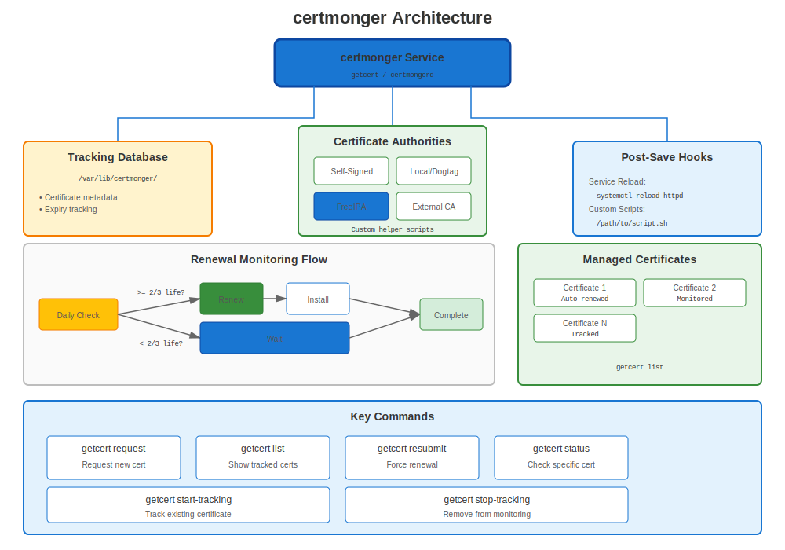
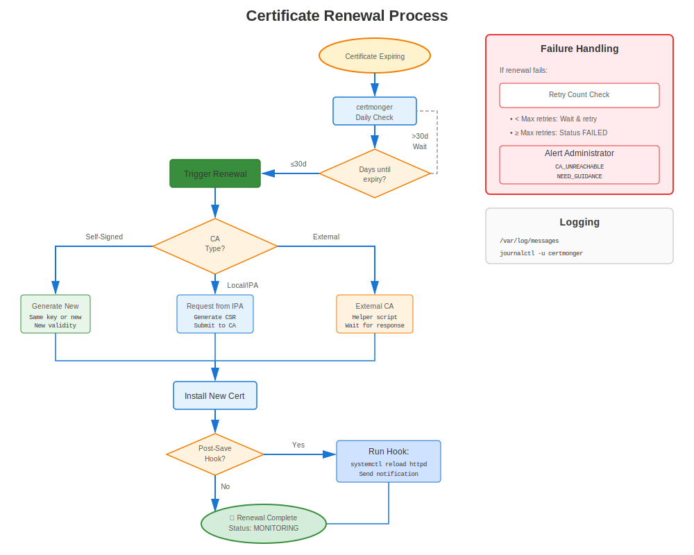
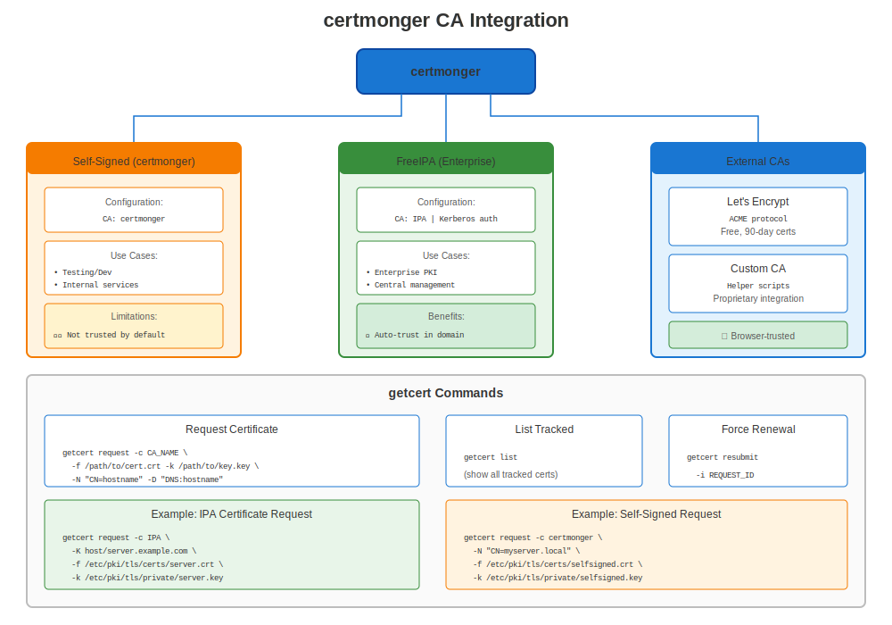

# Chapter 22: certmonger Mastery

> **Set It and Forget It:** certmonger is RHEL's built-in certificate automation tool. Master it and you'll never manually renew a certificate again.

---

## 22.1 What is certmonger?



**certmonger** is a certificate tracking and automatic renewal daemon for RHEL.

**Think of it as:**
- 📋 **Certificate tracker** - Monitors expiration dates
- 🔄 **Auto-renewer** - Renews before expiry
- 🔗 **CA integrator** - Works with FreeIPA, local/internal CAs, and custom external CA helpers
- ⚙️ **Service integration** - Runs commands after renewal

### Why certmonger?

**Without certmonger:**
```
❌ Manual tracking of expiration dates
❌ Calendar reminders to renew
❌ Manual CSR generation
❌ Manual service restart after renewal
❌ Risk of missing renewals → outages
```

**With certmonger:**
```
✅ Automatic tracking
✅ Automatic renewal
✅ Automatic service reload
✅ Centralized monitoring
✅ No manual intervention!
```

---

## 22.2 Installation and Setup



### Installation by RHEL Version

```bash
#============================================#
# INSTALL CERTMONGER
#============================================#

# RHEL 8/9/10
sudo dnf install certmonger -y

# RHEL 7
# sudo yum install certmonger -y

# Enable and start
sudo systemctl enable certmonger
sudo systemctl start certmonger

# Verify
systemctl status certmonger
sudo getcert list  # Should show empty list initially
```

---

## 22.3 Basic Usage



### Requesting a Certificate

```bash
#============================================#
# BASIC CERTIFICATE REQUEST
#============================================#

# Self-signed (for testing)
sudo getcert request \
  -f /etc/pki/tls/certs/test.crt \
  -k /etc/pki/tls/private/test.key

# From FreeIPA / IdM
sudo ipa-getcert request \
  -f /etc/pki/tls/certs/web.crt \
  -k /etc/pki/tls/private/web.key \
  -K HTTP/$(hostname -f)@REALM \
  -D $(hostname -f)

# For public Let's Encrypt certificates, use certbot (Chapter 24).
# certmonger is the native choice for IPA, local CA, and helper-based workflows.
```

### Checking Status

```bash
#============================================#
# CHECK CERTIFICATE STATUS
#============================================#

# List all tracked certificates
sudo getcert list

# Check specific certificate by file
sudo getcert list -f /etc/pki/tls/certs/web.crt

# Check by request ID
sudo getcert list -i 20240101000000

# Verbose output
sudo getcert list -v
```

**Status Values:**
- `MONITORING`: ✅ Certificate issued, tracking expiration
- `SUBMITTING`: 🔄 Submitting request to CA
- `CA_UNREACHABLE`: ❌ Can't reach CA server
- `CA_REJECTED`: ❌ CA rejected request
- `NEED_KEY_GEN_PIN`: ⏸️ Waiting for PIN (HSM/token)
- `PRE_SAVE_COMMAND`: 🔄 Running pre-save script
- `POST_SAVE_COMMAND`: 🔄 Running post-save script

---

## 22.4 Advanced Options

### Complete Request with All Options

```bash
#============================================#
# COMPLETE CERTMONGER REQUEST
#============================================#

sudo ipa-getcert request \
  -f /etc/pki/tls/certs/web.example.com.crt \              # Certificate file
  -k /etc/pki/tls/private/web.example.com.key \            # Private key file
  -K HTTP/web.example.com@EXAMPLE.COM \                    # Kerberos principal
  -D web.example.com \                                     # DNS name (SAN)
  -D www.example.com \                                     # Additional SAN
  -D api.example.com \                                     # Another SAN
  -U id-kp-serverAuth \                                    # Extended key usage
  -N CN=web.example.com,O=Example,C=US \                   # Subject DN
  -g 2048 \                                                # Key size
  -G rsa \                                                 # Key type
  -T caIPAserviceCert \                                    # IPA profile
  -C "systemctl reload httpd" \                            # Post-save command
  -B "systemctl stop httpd" \                              # Pre-save command
  -v \                                                     # Verbose
  -w                                                       # Wait for completion

# Check status
sudo getcert list -f /etc/pki/tls/certs/web.example.com.crt
```

**Key Options Explained:**

| Option | Purpose | Example |
|--------|---------|---------|
| `-f` | Certificate file path | `/etc/pki/tls/certs/web.crt` |
| `-k` | Private key file path | `/etc/pki/tls/private/web.key` |
| `-K` | Kerberos principal | `HTTP/web.example.com@REALM` |
| `-D` | DNS SAN | `web.example.com` |
| `-N` | Subject DN | `CN=web,O=Example` |
| `-C` | Post-save command | `systemctl reload httpd` |
| `-B` | Pre-save command | `systemctl stop httpd` |
| `-c` | CA name | `IPA` or `external-ca` |
| `-T` | Certificate profile | `caIPAserviceCert` |
| `-g` | Key size | `2048` or `4096` |
| `-G` | Key type | `rsa` or `ec` |

---

## 22.5 Working with Different CAs

### FreeIPA (Recommended for Internal)

```bash
#============================================#
# CERTMONGER + FREEIPA
#============================================#

# Prerequisites: System enrolled to IPA
ipa-client-install

# Request certificate
sudo ipa-getcert request \
  -f /etc/pki/tls/certs/internal.crt \
  -k /etc/pki/tls/private/internal.key \
  -K HTTP/$(hostname -f)@REALM \
  -D $(hostname -f) \
  -C "systemctl reload httpd"

# certmonger automatically:
# ✅ Submits request to IPA CA
# ✅ Obtains certificate
# ✅ Saves to file
# ✅ Runs reload command
# ✅ Tracks expiration
# ✅ Renews ~28 days before expiry
```

### Public ACME Requires certbot

```bash
#============================================#
# PUBLIC ACME VS NATIVE CERTMONGER WORKFLOWS
#============================================#

# Public Let's Encrypt certificate:
# Use certbot, not a fake certmonger CA profile.
sudo certbot certonly --apache -d public.example.com

# Native FreeIPA / IdM certificate:
sudo ipa-getcert request \
  -f /etc/pki/tls/certs/internal.crt \
  -k /etc/pki/tls/private/internal.key \
  -K HTTP/$(hostname -f)@REALM \
  -D $(hostname -f) \
  -C "systemctl reload httpd"
```

### External CA (Manual Submission)

```bash
#============================================#
# CERTMONGER WITH EXTERNAL CA
#============================================#

# Configure external CA helper
sudo getcert add-ca -c external-ca \
  -e '/usr/local/bin/external-ca-submit.sh'

# Request certificate
sudo getcert request \
  -c external-ca \
  -f /etc/pki/tls/certs/external.crt \
  -k /etc/pki/tls/private/external.key

# Helper script must:
# 1. Read CSR from stdin
# 2. Submit to external CA
# 3. Return certificate on stdout
```

---

## 22.6 Managing Tracked Certificates

### Modify Tracking

```bash
#============================================#
# MODIFY EXISTING CERTIFICATE TRACKING
#============================================#

# Update post-save command without rekeying
sudo getcert stop-tracking -f /etc/pki/tls/certs/web.crt
sudo getcert start-tracking \
  -f /etc/pki/tls/certs/web.crt \
  -k /etc/pki/tls/private/web.key \
  -C "systemctl reload httpd"
# Re-add -c, -K, -D, etc. if your original tracking entry used them

# Add additional SAN
sudo getcert resubmit -f /etc/pki/tls/certs/web.crt \
  -D additional.example.com

# Stop tracking (keep certificate)
sudo getcert stop-tracking -f /etc/pki/tls/certs/web.crt

# Remove completely
sudo getcert stop-tracking -f /etc/pki/tls/certs/web.crt -r

# Start tracking existing certificate
sudo getcert start-tracking \
  -f /etc/pki/tls/certs/existing.crt \
  -k /etc/pki/tls/private/existing.key
```

### Force Renewal

```bash
#============================================#
# FORCE IMMEDIATE RENEWAL
#============================================#

# By file path
sudo ipa-getcert resubmit -f /etc/pki/tls/certs/web.crt

# By request ID
sudo getcert resubmit -i 20240101000000

# Wait for renewal
sudo getcert list -f /etc/pki/tls/certs/web.crt
# Wait for status: MONITORING
```

---

## 22.7 Renewal Timing

### Understanding Renewal Windows

```
Certificate Lifecycle (365 days):

Day   0: Certificate issued
      │
      │ [Normal operation]
      │
Day 243: Renewal window starts (certmonger attempts renewal)
      │ (2/3 of cert lifetime: 365 × 2/3 ≈ 243 days)
      │
      │ [Renewal attempts every 8 hours if CA available]
      │
Day 335: Warning if not yet renewed (30 days left)
      │
Day 350: Critical if not yet renewed (15 days left)
      │
Day 365: Certificate expires → SERVICE OUTAGE if not renewed!
```

**Default Behavior:**
- Renewal starts at 2/3 of certificate lifetime
- 365-day cert → Renews at day 243 (122 days remaining)
- 90-day cert → Renews at day 60 (30 days remaining)

---

## 22.8 Post-Save Commands

### Reload vs Restart

```bash
#============================================#
# POST-SAVE COMMAND STRATEGIES
#============================================#

# PREFER: reload (no downtime)
-C "systemctl reload httpd"
-C "systemctl reload nginx"
-C "postfix reload"

# SOMETIMES NEEDED: restart
-C "systemctl restart slapd"  # OpenLDAP requires restart
-C "systemctl restart postgresql"  # PostgreSQL requires restart

# MULTIPLE COMMANDS: Use script
-C "/usr/local/bin/after-cert-renewal.sh"

# Script example:
#!/bin/bash
# /usr/local/bin/after-cert-renewal.sh
systemctl reload httpd
systemctl reload nginx
systemctl reload postfix
logger "Certificates renewed via certmonger"
```

---

## 22.9 Troubleshooting certmonger

### Common Issues

**Issue 1: CA_UNREACHABLE**

```bash
# Symptom
sudo getcert list
# status: CA_UNREACHABLE

# Diagnosis
# For FreeIPA:
ipa ping  # Check IPA connectivity
klist  # Check Kerberos ticket

# Fix
kinit -k host/$(hostname -f)@REALM  # Renew host ticket
sudo ipa-getcert resubmit -f /etc/pki/tls/certs/web.crt

# Check IPA server
ssh ipa-server "sudo ipactl status"
```

**Issue 2: CA_REJECTED**

```bash
# Symptom
sudo getcert list
# status: CA_REJECTED
# ca-error: Server at https://ipa.example.com/ipa/xml unwilling to issue certificate

# Common causes:
# 1. Service principal doesn't exist
ipa service-show HTTP/$(hostname -f)
# If not found:
ipa service-add HTTP/$(hostname -f)

# 2. Host not enrolled
ipa host-show $(hostname -f)

# 3. Permission issue
# Check IPA permissions

# Retry
sudo ipa-getcert resubmit -f /etc/pki/tls/certs/web.crt
```

**Issue 3: Renewal Not Happening**

```bash
# Check certmonger is running
systemctl status certmonger

# Check certificate status
sudo getcert list -f /etc/pki/tls/certs/web.crt

# Check certmonger logs
sudo journalctl -u certmonger -f

# Force renewal
sudo ipa-getcert resubmit -f /etc/pki/tls/certs/web.crt

# Check renewal window
# Certificate renews at 2/3 of lifetime
# Check "expires" date in getcert list output
```

---

## 22.10 IdM ACME vs Public Let's Encrypt

### Keep the Workflows Separate

```bash
#============================================#
# CHOOSE THE RIGHT TOOL FOR THE RIGHT CA
#============================================#

# Public Let's Encrypt certificate:
# Use certbot (see Chapter 24).
sudo certbot certonly --apache -d public.example.com -d www.public.example.com

# Native FreeIPA / IdM certificate:
# Use certmonger + ipa-getcert.
sudo ipa-getcert request \
  -f /etc/pki/tls/certs/internal.example.com.crt \
  -k /etc/pki/tls/private/internal.example.com.key \
  -K HTTP/internal.example.com@REALM \
  -D internal.example.com \
  -C "systemctl reload httpd"

# If IdM ACME is enabled, its ACME directory is your IPA server,
# not Let's Encrypt:
sudo certbot certonly \
  --server https://ipa.example.com/acme/directory \
  -d host.example.com
```

**Important distinction:**
- **Let's Encrypt** = public internet ACME CA
- **IdM/FreeIPA ACME** = your internal IPA CA exposing an ACME endpoint
- **certmonger** = native RHEL tracker/renewer for IPA and helper-based workflows

---

## 22.11 Monitoring certmonger

### Status Monitoring

```bash
#============================================#
# MONITOR CERTMONGER
#============================================#

# Overview of all certificates
sudo getcert list

# Count certificates by status
sudo getcert list | grep "status:" | sort | uniq -c

# Find certificates expiring soon (30 days)
for cert in $(sudo getcert list | grep "certificate:" | sed -n "s/.*location='\\([^']*\\)'.*/\\1/p"); do
  if ! openssl x509 -in "$cert" -noout -checkend $((86400*30)) 2>/dev/null; then
    echo "⚠️ Expires soon: $cert"
  fi
done

# Check certmonger logs
sudo journalctl -u certmonger --since today

# Watch for renewal activity
sudo journalctl -u certmonger -f

# Check next renewal time
sudo getcert list | grep -A15 "Request ID" | grep "expires"
```

### Health Check Script

```bash
#!/bin/bash
# certmonger-health-check.sh

echo "=== certmonger Health Check ==="

# certmonger running?
if systemctl is-active --quiet certmonger; then
  echo "✅ certmonger is running"
else
  echo "❌ certmonger is NOT running!"
  exit 1
fi

# Count tracked certificates
TOTAL=$(sudo getcert list | grep -c "Request ID")
echo "📋 Tracking $TOTAL certificates"

# Check status breakdown
echo ""
echo "Status breakdown:"
sudo getcert list | grep "status:" | sort | uniq -c

# Check for problems
PROBLEMS=$(sudo getcert list | grep "status:" | grep -v "MONITORING" | wc -l)
if [ $PROBLEMS -gt 0 ]; then
  echo ""
  echo "⚠️ $PROBLEMS certificates need attention:"
  sudo getcert list | grep -B5 "status:" | grep -E "(Request ID|status:)" | grep -v "MONITORING"
fi

# Check expiration warnings
echo ""
echo "Certificates expiring in 30 days:"
sudo getcert list | grep -A10 "Request ID" | grep "expires:" | \
  while read line; do
    # Parse and check expiry
    # (simplified - production script would parse dates properly)
    echo "$line"
  done
```

---

## 22.12 certmonger Configuration

### Main Configuration File

```bash
#============================================#
# CERTMONGER CONFIGURATION
#============================================#

# Config location
/etc/certmonger/certmonger.conf

# Database location (tracked certificates)
/var/lib/certmonger/

# List configured CAs
sudo getcert list-cas

# Add custom CA
sudo getcert add-ca -c my-ca \
  -e '/usr/local/bin/my-ca-submit.sh'

# Remove CA
sudo getcert remove-ca -c my-ca
```

---

## 22.13 Best Practices

### certmonger Best Practices

```markdown
✅ **Always use post-save commands** (-C flag) to reload services
✅ **Track all production certificates** with certmonger
✅ **Monitor status weekly** with `getcert list`
✅ **Test renewal** before expiry with `resubmit`
✅ **Use verbose mode** (-v) when troubleshooting
✅ **Set up monitoring** for CA_UNREACHABLE status
✅ **Document request IDs** in your certificate inventory
✅ **Use IPA/certmonger for internal** certs, certbot for public Let's Encrypt
✅ **Keep certmonger logs** for audit trail
✅ **Test post-save commands** independently before use
```

### What to Track with certmonger

```bash
# ✅ TRACK with certmonger:
- Web server certificates (Apache, NGINX)
- Mail server certificates (Postfix, Dovecot)
- LDAP server certificates (OpenLDAP)
- Application certificates (APIs, microservices)
- Service certificates (any TLS-enabled service)

# ❌ DON'T track with certmonger:
- CA root certificates (managed separately)
- Client certificates for users (different lifecycle)
- Test/temporary certificates
- Certificates you manage with other tools (certbot)
```

---

## 22.14 certmonger vs certbot

### When to Use Which?

| Feature | certmonger | certbot |
|---------|------------|---------|
| **RHEL Native** | ✅ Yes (included) | ❌ No (EPEL required) |
| **FreeIPA Support** | ✅ Native | ❌ No |
| **Public Let's Encrypt ACME** | ❌ Use certbot instead | ✅ Yes (all versions) |
| **Internal CA** | ✅ Excellent | ❌ No |
| **Apache/NGINX Config** | ⏸️ Manual | ✅ Automatic |
| **Service Integration** | ✅ Post-save commands | ⏸️ Limited |
| **Renewal Timing** | 2/3 of lifetime | 30 days before |
| **Red Hat Support** | ✅ Yes | ❌ No (EPEL) |

**Recommendation:**
- **Internal/Enterprise:** Use certmonger + FreeIPA
- **Public/Simple:** Use certbot (but know it requires EPEL)
- **Public certificates on any RHEL version:** Use certbot for Let's Encrypt

---

## 22.15 Advanced Scenarios

### Scenario 1: High Availability Certificate Renewal

```bash
# Multiple servers with same service

# Server 1:
sudo ipa-getcert request \
  -f /etc/pki/tls/certs/shared-service.crt \
  -k /etc/pki/tls/private/shared-service.key \
  -K HTTP/service.example.com@REALM \
  -D service.example.com \
  -C "systemctl reload httpd"

# Server 2: Same configuration
# Result: Each server manages its own cert independently
# Or: Use shared cert (copy files, not recommended)
```

### Scenario 2: Wildcard Certificate

```bash
# Request wildcard from FreeIPA
sudo ipa-getcert request \
  -f /etc/pki/tls/certs/wildcard.crt \
  -k /etc/pki/tls/private/wildcard.key \
  -K HTTP/*.example.com@REALM \
  -D *.example.com \
  -D example.com \
  -C "/usr/local/bin/reload-all-services.sh"
```

### Scenario 3: EC Keys (Elliptic Curve)

```bash
# Request with EC key
sudo ipa-getcert request \
  -f /etc/pki/tls/certs/ec-cert.crt \
  -k /etc/pki/tls/private/ec-cert.key \
  -K HTTP/$(hostname -f)@REALM \
  -G ec \
  -g nistp256  # or nistp384, nistp521
```

---

## 22.16 Key Takeaways

1. **certmonger is RHEL's certificate automation**
2. **Set it and forget it** - Automatic renewal
3. **Works best with FreeIPA, internal CAs, and helper-based renewals**
4. **Post-save commands** reload services automatically
5. **Tracks expiration** and renews at 2/3 of lifetime
6. **MONITORING status** means all is well
7. **getcert list** is your main monitoring tool

---

## Quick Reference Card

```
┌──────────────────────────────────────────────────────────────┐
│ CERTMONGER MASTERY QUICK REFERENCE                           │
├──────────────────────────────────────────────────────────────┤
│ Install:      dnf install certmonger (yum on RHEL 7)         │
│ Start:        systemctl enable --now certmonger              │
│                                                              │
│ Request:      ipa-getcert request -f cert -k key -K principal│
│ List:         getcert list                                   │
│ Status:       getcert list -f /path/to/cert.crt              │
│ Resubmit:     ipa-getcert resubmit -f /path/to/cert.crt      │
│ Stop track:   getcert stop-tracking -f /path/to/cert.crt     │
│                                                              │
│ Status:       MONITORING = ✅ Good                           │
│               CA_UNREACHABLE = ❌ Check IPA/CA               │
│               CA_REJECTED = ❌ Check principal/permissions   │
│                                                              │
│ Logs:         journalctl -u certmonger -f                    │
│ Renewal:      Automatic at 2/3 of cert lifetime              │
│ Post-save:    -C "systemctl reload <service>"                │
└──────────────────────────────────────────────────────────────┘

✅ Native RHEL tool (Red Hat supported)
✅ Perfect for FreeIPA integration
✅ Best fit for FreeIPA and tracked renewal workflows
```

---

## 🧪 Hands-On Lab

**Lab 11: certmonger Basics**

Automate certificate renewal with certmonger

- 📁 **Location:** `labs/en_US/11-certmonger-basics/`
- ⏱️ **Time:** 30-35 minutes
- 🎯 **Level:** Intermediate

---

**Chapter Navigation**

| [← Previous: Chapter 21 - Service Certificate Best Practices](../part-03-services/21-service-best-practices.md) | [Next: Chapter 23 - Crypto-Policies Deep Dive →](23-crypto-policies-deep-dive.md) |
|:---|---:|
