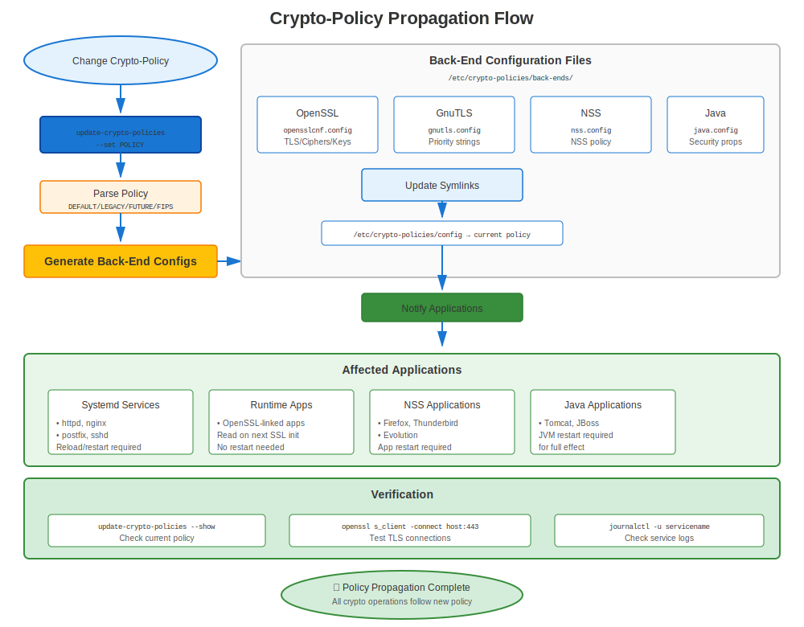

# Chapter 23: Crypto-Policies Deep Dive

> **Revolutionary Feature:** RHEL 8+ crypto-policies provide system-wide cryptographic configuration. Master this and you control security across all applications with one command.

---

## 23.1 The Problem crypto-policies Solves

### Before Crypto-Policies (RHEL 7)

```
Configure security individually for EVERY application:

Apache:      /etc/httpd/conf.d/ssl.conf
             SSLProtocol, SSLCipherSuite

NGINX:       /etc/nginx/nginx.conf
             ssl_protocols, ssl_ciphers

Postfix:     /etc/postfix/main.cf
             smtpd_tls_protocols, smtpd_tls_mandatory_ciphers

OpenLDAP:    olcTLSProtocolMin, olcTLSCipherSuite

PostgreSQL:  ssl_min_protocol_version

OpenSSH:     /etc/ssh/sshd_config
             Ciphers, MACs, KexAlgorithms

... and 20+ more applications!

Result: Inconsistent security, configuration nightmare
```

### After Crypto-Policies (RHEL 8/9/10)

```
✅ Set ONE system-wide policy
✅ All applications automatically comply
✅ Consistent security across the system
✅ Change policy in seconds, not hours
```

**Game changer for enterprise management!**

---

## 23.2 How Crypto-Policies Work



### Architecture

```
┌──────────────────────────────────────────────────┐
│       update-crypto-policies --set DEFAULT       │
│              (Administrator command)             │
└───────────────────────┬──────────────────────────┘
                        │
                        ▼
┌──────────────────────────────────────────────────┐
│  /etc/crypto-policies/back-ends/                 │
│  (Generated config files for each library)       │
│  ├─ opensslcnf.config                            │
│  ├─ gnutls.config                                │
│  ├─ nss.config                                   │
│  ├─ bind.config                                  │
│  └─ ... more ...                                 │
└───────────────────────┬──────────────────────────┘
                        │
            ┌───────────┼───────────┐
            ▼           ▼           ▼
         OpenSSL     GnuTLS        NSS
            ↓           ↓           ↓
         Apache      NGINX       Firefox
         Postfix     vsftpd      Thunderbird
         OpenSSH     wget        Java apps
```

**Key Insight:** Applications read from back-end files, not directly from policy!

---

## 23.3 The Four Main Policies

### Policy Comparison

| Policy | TLS Versions | Min RSA | SHA-1 | 3DES | Min DH | Use Case |
|--------|--------------|---------|-------|------|--------|----------|
| **DEFAULT** | 1.2, 1.3 | 2048 | ❌ | ❌ | 2048 | ✅ Recommended |
| **LEGACY** | 1.0+ | 1024 | ⚠️ | ⚠️ | 1024 | Compatibility only |
| **FUTURE** | 1.2, 1.3 | 3072 | ❌ | ❌ | 3072 | High security |
| **FIPS** | 1.2, 1.3 | 2048 | ❌ | ❌ | 2048 | Federal compliance |

### DEFAULT Policy Details

```yaml
# Balanced security and compatibility
Protocols:
  - TLS 1.2
  - TLS 1.3

Minimum Key Sizes:
  - RSA: 2048 bits
  - DH: 2048 bits
  - ECC: secp256r1 (P-256)

Allowed Ciphers:
  - AES-128-GCM
  - AES-256-GCM
  - ChaCha20-Poly1305
  - AES-128-CBC
  - AES-256-CBC

Signature Algorithms:
  - SHA-256
  - SHA-384
  - SHA-512

Blocked:
  - TLS 1.0, 1.1
  - MD5
  - SHA-1 signatures
  - 3DES, RC4, DES
  - RSA < 2048 bits
  - Export ciphers
```

---

## 23.4 Viewing and Changing Policies

### Basic Commands

```bash
#============================================#
# CRYPTO-POLICY BASIC OPERATIONS
#============================================#

# View current policy
update-crypto-policies --show
# Output: DEFAULT

# List available policies
ls /usr/share/crypto-policies/policies/
# DEFAULT.pol  FUTURE.pol  LEGACY.pol  FIPS.pol

# Set policy
sudo update-crypto-policies --set FUTURE

# You MUST restart services for changes to take effect!
sudo systemctl restart httpd nginx postfix slapd

# Or reboot (ensures everything picks up changes)
sudo reboot
```

### What Happens When You Change Policy

```bash
#============================================#
# BEHIND THE SCENES
#============================================#

# Before
update-crypto-policies --show
# DEFAULT

# Change
sudo update-crypto-policies --set FUTURE

# Updates generated:
ls -l /etc/crypto-policies/back-ends/
# -rw-r--r--. opensslcnf.config    ← Updated!
# -rw-r--r--. gnutls.config        ← Updated!
# -rw-r--r--. nss.config           ← Updated!
# -rw-r--r--. bind.config          ← Updated!
# ... all back-ends updated ...

# View OpenSSL config
cat /etc/crypto-policies/back-ends/opensslcnf.config
# Shows actual OpenSSL configuration applied
```

---

## 23.5 Subpolicies (RHEL 9+)

### Policy Modifiers

**RHEL 9 introduced subpolicies** - fine-tune existing policies!

```bash
#============================================#
# CRYPTO-POLICY SUBPOLICIES (RHEL 9+)
#============================================#

# Base policy with modifier
sudo update-crypto-policies --set DEFAULT:NO-SHA1

# Multiple modifiers
sudo update-crypto-policies --set DEFAULT:NO-SHA1:GOST

# Available subpolicy modules
ls /usr/share/crypto-policies/policies/modules/
# AD-SUPPORT.pmod
# GOST.pmod
# NO-CAMELLIA.pmod
# NO-SHA1.pmod
# NO-ENFORCE-EMS.pmod
# ...and more

# View module details
cat /usr/share/crypto-policies/policies/modules/NO-SHA1.pmod
```

**Common Subpolicies:**

| Subpolicy | Effect | Use Case |
|-----------|--------|----------|
| `NO-SHA1` | Completely disable SHA-1 | Extra security |
| `AD-SUPPORT` | Enable AD compatibility | Mixed Windows/Linux |
| `GOST` | Enable GOST algorithms | Russian requirements |
| `NO-CAMELLIA` | Disable Camellia cipher | Specific compliance |
| `NO-ENFORCE-EMS` | Disable Extended Master Secret | Compatibility |

---

## 23.6 Creating Custom Policy Modules

### Custom Module Example

```bash
#============================================#
# CREATE CUSTOM POLICY MODULE
#============================================#

# Create custom module
sudo vi /etc/crypto-policies/policies/modules/CUSTOM-SECURITY.pmod

# Example content:
min_rsa_size = 4096
min_dh_size = 3072
min_dsa_size = 3072
sha1_in_certs = 0
arbitrary_dh_groups = 0
ssh_certs = 0

# Apply
sudo update-crypto-policies --set DEFAULT:CUSTOM-SECURITY

# Restart services
sudo systemctl restart httpd nginx postfix

# Verify
openssl ciphers -v | grep -E "RSA|DH"
```

---

## 23.7 Per-Application Overrides

### When to Override

Sometimes ONE application needs different settings than system policy:

**Example:** Legacy application needs TLS 1.1, but system uses DEFAULT

### Apache Override

```apache
#============================================#
# APACHE CRYPTO-POLICY OVERRIDE
#============================================#

# /etc/httpd/conf.d/ssl.conf

# Option 1: Include crypto-policy, then override
Include /etc/crypto-policies/back-ends/httpd.config

# Then add overrides:
SSLProtocol all -SSLv3  # Re-enable TLS 1.0/1.1

# Option 2: Completely opt-out
# Don't include crypto-policy file
# Manually configure everything:
SSLProtocol TLSv1.1 TLSv1.2 TLSv1.3
SSLCipherSuite HIGH:!aNULL:!MD5

# ⚠️ Warning: You now manage Apache TLS manually
# System crypto-policy changes won't affect Apache
```

**Better Approach:** Create custom policy module instead of per-app overrides!

---

## 23.8 Testing Policy Impact

### Before Changing Policy

```bash
#============================================#
# TEST POLICY CHANGE IMPACT
#============================================#

# 1. Document current state
update-crypto-policies --show > /tmp/current-policy.txt
systemctl list-units --type=service --state=running > /tmp/running-services.txt

# 2. Test applications
curl https://localhost/
psql -h localhost  # etc.

# 3. Change policy on test system first
sudo update-crypto-policies --set FUTURE

# 4. Restart services
sudo systemctl restart httpd nginx postfix

# 5. Test thoroughly
./test-all-services.sh

# 6. If problems: Revert
sudo update-crypto-policies --set DEFAULT

# 7. If successful: Document and deploy to production
```

---

## 23.9 Policy Impact on Certificates

### What Policies Control

**Crypto-policies affect:**
- ✅ TLS protocol versions allowed
- ✅ Cipher suites available
- ✅ Minimum key sizes accepted
- ✅ Signature algorithms allowed
- ✅ Diffie-Hellman parameters
- ✅ Certificate validation strictness

**Crypto-policies DON'T affect:**
- ❌ Which certificates to use (still configured per service)
- ❌ Certificate file locations
- ❌ CA trust store (that's update-ca-trust)
- ❌ Certificate issuance

### Certificate Compatibility Matrix

| Certificate Type | DEFAULT | LEGACY | FUTURE | FIPS |
|------------------|---------|--------|--------|------|
| RSA 1024 bit | ❌ | ⚠️ | ❌ | ❌ |
| RSA 2048 bit | ✅ | ✅ | ❌ | ✅ |
| RSA 3072 bit | ✅ | ✅ | ✅ | ✅ |
| RSA 4096 bit | ✅ | ✅ | ✅ | ✅ |
| EC P-256 | ✅ | ✅ | ❌ | ✅ |
| EC P-384 | ✅ | ✅ | ✅ | ✅ |
| SHA-1 signature | ❌ | ⚠️ | ❌ | ❌ |
| SHA-256 signature | ✅ | ✅ | ✅ | ✅ |

---

## 23.10 Troubleshooting Crypto-Policies

### Common Issues

**Issue 1: Application Fails After Policy Change**

```bash
# Symptom
sudo update-crypto-policies --set FUTURE
sudo systemctl restart httpd
# httpd fails to start

# Diagnosis
sudo journalctl -xe -u httpd | grep -i cipher

# Common cause: Application has hard-coded weak ciphers

# Solution 1: Revert policy
sudo update-crypto-policies --set DEFAULT

# Solution 2: Update application config
# Remove hard-coded cipher specifications

# Solution 3: Create custom policy module
```

**Issue 2: "No Shared Cipher"**

```bash
# Symptom: Clients can't connect

# Test
openssl s_client -connect server:443

# If shows "no shared cipher":

# Check policy
update-crypto-policies --show

# Test client capabilities
openssl s_client -connect server:443 -cipher 'ALL' -tls1_2

# Temporary fix (not recommended long-term):
sudo update-crypto-policies --set LEGACY

# Proper fix: Update client to support TLS 1.2+ and modern ciphers
```

**Issue 3: Policy Doesn't Seem to Apply**

```bash
# Check if application is overriding policy

# Apache
grep -r "SSLProtocol\|SSLCipherSuite" /etc/httpd/
# If found: App is overriding policy

# NGINX
grep -r "ssl_protocols\|ssl_ciphers" /etc/nginx/
# If found: App is overriding policy

# Solution: Remove overrides, let crypto-policy handle it
# Or: Document why override is necessary
```

---

## 23.11 Best Practices

### Recommendations

```markdown
✅ **Use DEFAULT policy** for most environments
✅ **Test before deploying** new policies
✅ **Document policy choices** and reasons
✅ **Restart services** after policy changes
✅ **Avoid per-app overrides** when possible
✅ **Use subpolicies** (RHEL 9+) for fine-tuning
✅ **Monitor for compatibility** issues
✅ **Keep LEGACY temporary** if used
✅ **Plan migrations** when changing policies
✅ **Update clients** rather than weaken policy
```

### When to Use Each Policy

**DEFAULT:**
- ✅ Most production environments
- ✅ Balanced security/compatibility
- ✅ Recommended starting point
- ✅ Tested and maintained by Red Hat

**LEGACY:**
- ⚠️ Temporary during migrations only!
- ⚠️ Supporting very old clients
- ⚠️ Testing compatibility issues
- ❌ Never long-term!

**FUTURE:**
- ✅ High-security environments
- ✅ All clients are modern
- ✅ Want strongest settings
- ✅ Planning for future standards

**FIPS:**
- ✅ Federal compliance required
- ✅ Government contracts
- ✅ Regulated industries
- ✅ Certification requirements

---

## 23.12 FIPS Policy Deep Dive

### Enabling FIPS Mode

```bash
#============================================#
# ENABLE FIPS MODE
#============================================#

# Check current status
fips-mode-setup --check
# FIPS mode is disabled.

# Enable FIPS mode
sudo fips-mode-setup --enable

# MUST reboot
sudo reboot

# Verify after reboot
fips-mode-setup --check
# FIPS mode is enabled.

# Crypto-policy automatically set to FIPS
update-crypto-policies --show
# FIPS
```

**FIPS Mode Requirements:**
- Must be enabled at install OR with fips-mode-setup
- Requires reboot
- Affects entire system
- Only FIPS-approved algorithms available
- Performance impact (~10-20% slower)

### FIPS Policy Specifics

```bash
# What FIPS policy allows:
✅ TLS 1.2, 1.3
✅ RSA 2048+ bits
✅ AES-128, AES-256 (GCM mode)
✅ SHA-256, SHA-384, SHA-512
✅ ECDHE key exchange

# What FIPS blocks:
❌ TLS 1.0, 1.1
❌ RSA < 2048 bits
❌ 3DES, RC4, DES
❌ MD5, SHA-1
❌ Non-approved algorithms
❌ CBC mode ciphers (in some cases)
```

---

## 23.13 Monitoring and Auditing

### Check Policy Compliance

```bash
#============================================#
# VERIFY CRYPTO-POLICY COMPLIANCE
#============================================#

# Current policy
update-crypto-policies --show

# Which applications use crypto-policies?
ls -l /etc/crypto-policies/back-ends/

# Verify OpenSSL follows policy
openssl ciphers -v | head -20

# Check specific application config
# Apache
cat /etc/crypto-policies/back-ends/httpd.config

# Test actual connection
openssl s_client -connect localhost:443 -tls1_3

# Verify no overrides
grep -r "SSLProtocol\|SSLCipherSuite" /etc/httpd/ | grep -v crypto-policies
# Should be empty or commented out
```

---

## 23.14 Troubleshooting Workflow

### Systematic Approach

```
Application fails after policy change?
    │
    ├─ Step 1: Identify error
    │   └─ Check logs: journalctl -xe
    │
    ├─ Step 2: Verify policy active
    │   └─ update-crypto-policies --show
    │
    ├─ Step 3: Test with LEGACY
    │   └─ sudo update-crypto-policies --set LEGACY
    │   └─ If works → cipher/protocol issue
    │
    ├─ Step 4: Identify incompatibility
    │   └─ openssl s_client -cipher 'ALL' -tls1
    │   └─ Find what client/server needs
    │
    ├─ Step 5: Choose solution
    │   ├─ A) Update client (best)
    │   ├─ B) Create custom module (good)
    │   └─ C) Per-app override (last resort)
    │
    └─ Step 6: Document and deploy
        └─ Why override needed, plan to remove
```

---

## 23.15 Key Takeaways

1. **Crypto-policies are RHEL 8+ only** (not in RHEL 7)
2. **DEFAULT policy is recommended** for most cases
3. **Changes require service restarts** to take effect
4. **Affects ALL crypto applications** system-wide
5. **Subpolicies provide fine-tuning** (RHEL 9+)
6. **Avoid per-app overrides** when possible
7. **Test before deploying** new policies
8. **LEGACY is temporary only!**

---

## Quick Reference Card

```
┌──────────────────────────────────────────────────────────────┐
│ CRYPTO-POLICIES QUICK REFERENCE                              │
├──────────────────────────────────────────────────────────────┤
│ Available:    RHEL 8, 9, 10 only (not RHEL 7)                │
│                                                              │
│ View:         update-crypto-policies --show                  │
│ Set:          sudo update-crypto-policies --set <POLICY>     │
│ Policies:     DEFAULT, LEGACY, FUTURE, FIPS                  │
│                                                              │
│ Subpolicy:    update-crypto-policies --set DEFAULT:NO-SHA1   │
│               (RHEL 9+ only)                                 │
│                                                              │
│ Back-ends:    /etc/crypto-policies/back-ends/                │
│ Modules:      /usr/share/crypto-policies/policies/modules/   │
│                                                              │
│ After change: systemctl restart <services>                   │
│               OR reboot                                      │
│                                                              │
│ DEFAULT:      TLS 1.2+, RSA 2048+, No SHA-1                  │
│ LEGACY:       TLS 1.0+, allows weak (temporary only!)        │
│ FUTURE:       TLS 1.2+, RSA 3072+, strictest                 │
│ FIPS:         Federal compliance (requires FIPS mode)        │
└──────────────────────────────────────────────────────────────┘

⚠️ RHEL 7 doesn't have crypto-policies (manual config only)
✅ DEFAULT works for 95% of environments
```

---

## 🧪 Hands-On Lab

**Lab 12: Crypto-Policies**

Understand and configure system-wide crypto-policies

- 📁 **Location:** `labs/en_US/12-crypto-policies/`
- ⏱️ **Time:** 25-30 minutes
- 🎯 **Level:** Intermediate

---

**Chapter Navigation**

| [← Previous: Chapter 22 - certmonger Mastery](22-certmonger-mastery.md) | [Next: Chapter 24 - Let's Encrypt & certbot →](24-letsencrypt-certbot.md) |
|:---|---:|
