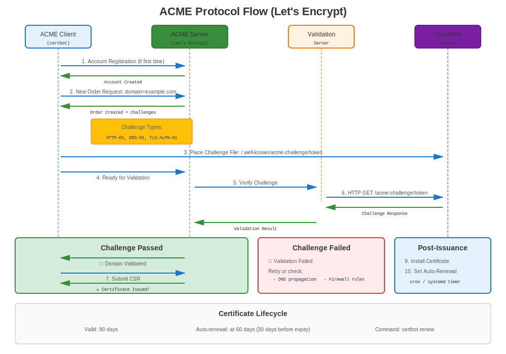
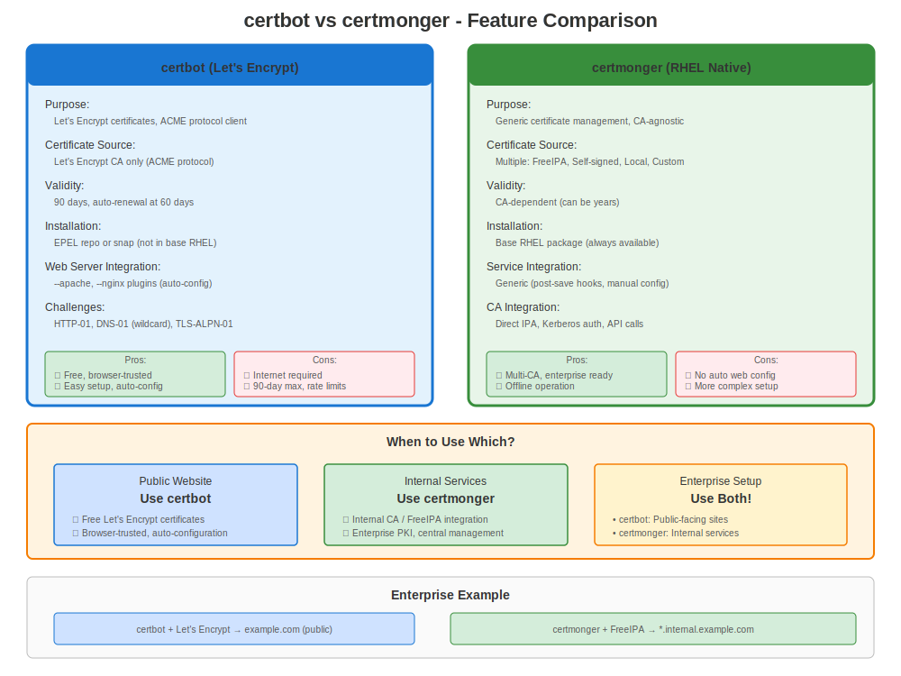

# Chapter 24: Let's Encrypt & certbot

> **Free Public Certificates:** Let's Encrypt provides free, automated certificates for public-facing websites. Learn how to use it on RHEL with certbot.

---

## 24.1 What is Let's Encrypt?



**Let's Encrypt** is a free, automated, and open Certificate Authority.

**Key Features:**
- ✅ **Free certificates** (no cost)
- ✅ **Automated issuance** (via ACME protocol)
- ✅ **Auto-renewal** (every 60-90 days)
- ✅ **Widely trusted** (in all major browsers)
- ✅ **Domain validation** (DV certificates)

**Limitations:**
- ❌ **Public domains only** (must be internet-accessible for validation)
- ❌ **90-day validity** (short-lived, requires automation)
- ❌ **Domain Validation only** (no Organization or Extended Validation)
- ❌ **No wildcard with HTTP-01** (requires DNS-01 challenge)

---

## 24.2 Let's Encrypt on RHEL: Public ACME and Native Alternatives



### Method 1: certbot (Traditional)

> **⚠️ CRITICAL: EPEL Required**
>
> **certbot is NOT available in official RHEL repositories.**
>
> It requires **EPEL** (Extra Packages for Enterprise Linux), a **community-maintained** repository that is **NOT officially supported by Red Hat**.
>
> **For Enterprise Production Environments:**
> - Consider FreeIPA with certmonger (Chapter 19)
> - Or commercial CA with certmonger (Chapter 22)
> - Or manual certificate management
>
> **EPEL is suitable for:**
> - Development/testing environments
> - Small deployments where EPEL risk is acceptable
> - Situations where free certificates outweigh support concerns

**certbot Tool:**
- Full automation
- Apache/NGINX plugins
- Automatic configuration
- Renewal timers
- ⚠️ Requires EPEL

### Method 2: certmonger for Internal/Private CAs

**Native RHEL Solution:**
- ✅ No EPEL needed
- ✅ Red Hat supported
- ✅ Best fit for FreeIPA / IdM and local CA workflows
- ⏸️ Manual web server config (no Apache/NGINX plugins)
- ❌ Not a direct replacement for certbot with public Let's Encrypt

**We'll use certbot for public Let's Encrypt and certmonger for native internal workflows.**

---

## 24.3 certbot Installation

### RHEL 7

```bash
#============================================#
# INSTALL CERTBOT ON RHEL 7 (REQUIRES EPEL!)
#============================================#

# ⚠️ WARNING: Enabling third-party repository

# Step 1: Enable EPEL
sudo yum install https://dl.fedoraproject.org/pub/epel/epel-release-latest-7.noarch.rpm -y

# Verify EPEL enabled
yum repolist | grep epel

# Step 2: Install certbot
sudo yum install certbot python2-certbot-apache python2-certbot-nginx -y

# Verify
certbot --version
```

### RHEL 8

```bash
#============================================#
# INSTALL CERTBOT ON RHEL 8 (REQUIRES EPEL!)
#============================================#

# ⚠️ WARNING: Enabling third-party repository

# Step 1: Enable EPEL
sudo dnf install https://dl.fedoraproject.org/pub/epel/epel-release-latest-8.noarch.rpm -y

# Or if you have subscription:
sudo dnf install epel-release -y

# Step 2: Install certbot
sudo dnf install certbot python3-certbot-apache python3-certbot-nginx -y

# Verify
certbot --version
```

### RHEL 9/10

```bash
#============================================#
# INSTALL CERTBOT ON RHEL 9/10 (REQUIRES EPEL!)
#============================================#

# ⚠️ WARNING: Enabling third-party repository

# Step 1: Enable EPEL
sudo dnf install epel-release -y

# Step 2: Install certbot
sudo dnf install certbot python3-certbot-apache python3-certbot-nginx -y

# Verify
certbot --version
```

> **Remember:** EPEL is community-supported. For enterprise production, consider FreeIPA + certmonger (native RHEL solution).

---

## 24.4 certbot Usage - Apache

### Automatic Apache Configuration

```bash
#============================================#
# CERTBOT WITH APACHE (AUTOMATED!)
#============================================#

# Prerequisites:
# - Apache installed and running
# - Port 80 accessible from internet
# - Domain resolves to this server
# - EPEL repository enabled

# Obtain certificate and auto-configure Apache
sudo certbot --apache -d www.example.com -d example.com

# certbot will:
# 1. Generate certificate from Let's Encrypt
# 2. Automatically configure Apache SSL
# 3. Set up HTTP→HTTPS redirect
# 4. Configure auto-renewal

# Interactive prompts:
# - Email address (for renewal notices)
# - Agree to ToS
# - Redirect HTTP to HTTPS? (choose yes)

# Non-interactive (automation):
sudo certbot --apache \
  -d www.example.com \
  -d example.com \
  --non-interactive \
  --agree-tos \
  --email admin@example.com \
  --redirect

# Certificate location:
# /etc/letsencrypt/live/www.example.com/fullchain.pem
# /etc/letsencrypt/live/www.example.com/privkey.pem
```

---

## 24.5 certbot Usage - NGINX

### Automatic NGINX Configuration

```bash
#============================================#
# CERTBOT WITH NGINX (AUTOMATED!)
#============================================#

# Prerequisites:
# - NGINX installed and running
# - Port 80 accessible
# - Domain resolves to server

# Obtain and configure
sudo certbot --nginx -d api.example.com

# Non-interactive
sudo certbot --nginx \
  -d api.example.com \
  --non-interactive \
  --agree-tos \
  --email admin@example.com \
  --redirect

# certbot updates NGINX config automatically!
# No manual SSL configuration needed
```

---

## 24.6 certbot Manual Mode (Standalone)

### Without Web Server Plugin

```bash
#============================================#
# CERTBOT STANDALONE (NO PLUGIN)
#============================================#

# Use when:
# - Web server not Apache/NGINX
# - Want manual control over config
# - Using custom web server

# Obtain certificate only (doesn't configure server)
sudo certbot certonly --standalone \
  -d app.example.com \
  --non-interactive \
  --agree-tos \
  --email admin@example.com

# Certificate saved to:
# /etc/letsencrypt/live/app.example.com/fullchain.pem
# /etc/letsencrypt/live/app.example.com/privkey.pem

# Manually configure your service to use it
# Apache example:
# SSLCertificateFile /etc/letsencrypt/live/app.example.com/fullchain.pem
# SSLCertificateKeyFile /etc/letsencrypt/live/app.example.com/privkey.pem
```

---

## 24.7 Renewal

### Automatic Renewal

```bash
#============================================#
# CERTBOT AUTO-RENEWAL
#============================================#

# certbot automatically sets up renewal timer
systemctl list-timers | grep certbot
# Should show: certbot-renew.timer

# View timer details
systemctl status certbot-renew.timer

# Test renewal (dry run - doesn't actually renew)
sudo certbot renew --dry-run

# Force actual renewal (if needed)
sudo certbot renew --force-renewal

# Check certificate expiration
sudo certbot certificates

# Renewal runs twice daily
# Renews certificates expiring within 30 days
```

### Renewal Hooks

```bash
#============================================#
# RENEWAL HOOKS (DEPLOY COMMANDS)
#============================================#

# Add hook to reload service after renewal
sudo certbot renew --deploy-hook "systemctl reload nginx"

# Or create hook script
sudo vi /etc/letsencrypt/renewal-hooks/deploy/reload-services.sh

#!/bin/bash
systemctl reload httpd
systemctl reload nginx
systemctl reload postfix

sudo chmod +x /etc/letsencrypt/renewal-hooks/deploy/reload-services.sh

# Hooks in /etc/letsencrypt/renewal-hooks/:
# - pre/: Run before renewal
# - post/: Run after renewal (even if failed)
# - deploy/: Run after successful renewal only
```

---

## 24.8 Wildcard Certificates

### DNS-01 Challenge Required

```bash
#============================================#
# WILDCARD CERTIFICATE (DNS CHALLENGE)
#============================================#

# Wildcard requires DNS-01 challenge
# (can't use HTTP-01 for *.example.com)

# Manual DNS challenge
sudo certbot certonly --manual \
  --preferred-challenges dns \
  -d "*.example.com" \
  -d "example.com"

# certbot will prompt you to:
# 1. Create TXT record in DNS
# 2. Wait for propagation
# 3. Press Enter to continue

# DNS automation with plugins (if available)
# sudo certbot certonly --dns-route53 -d "*.example.com"
# (requires DNS provider plugin)
```

---

## 24.9 Where certmonger Fits

### Use certmonger for Internal or Private CA Workflows

```bash
#============================================#
# CERTMONGER FOR IPA / INTERNAL CA WORKFLOWS
#============================================#

# Install certmonger
# RHEL 8/9/10
sudo dnf install certmonger -y

# RHEL 7
# sudo yum install certmonger -y

sudo systemctl enable --now certmonger

# Request an internal certificate from FreeIPA / IdM
sudo ipa-getcert request \
  -f /etc/pki/tls/certs/internal.example.com.crt \
  -k /etc/pki/tls/private/internal.example.com.key \
  -K HTTP/internal.example.com@REALM \
  -D internal.example.com \
  -C "systemctl reload httpd"

# Check status
sudo getcert list
```

**Keep these workflows separate:**

| Use Case | Recommended Tool |
|----------|------------------|
| Public internet certificate from Let's Encrypt | `certbot` |
| Internal service certificate from FreeIPA / IdM | `certmonger` with `ipa-getcert` |
| ACME against your own IdM ACME endpoint | `certbot` or another ACME client |

> **Important:** IdM ACME, when enabled, is your own FreeIPA / IdM CA exposing an ACME endpoint. It is not Let's Encrypt.

---

## 24.10 Troubleshooting certbot

### Common Issues

**Issue 1: Challenge Validation Failed**

```bash
# Symptom
sudo certbot --apache -d example.com
# Error: Challenge validation failed

# Common causes:
# 1. Port 80 not accessible
curl http://example.com/.well-known/acme-challenge/test
# Should be accessible from internet

# 2. Firewall blocking
sudo firewall-cmd --list-services | grep http

# 3. DNS not resolving
nslookup example.com

# 4. Another service on port 80
ss -tlnp | grep :80
```

**Issue 2: Renewal Failed**

```bash
# Check renewal logs
sudo cat /var/log/letsencrypt/letsencrypt.log

# Common causes:
# - Port 80 blocked
# - DNS changed
# - Rate limit hit

# Test renewal manually
sudo certbot renew --dry-run
```

**Issue 3: Permission Errors**

```bash
# Fix certbot permissions
sudo chmod 0755 /etc/letsencrypt/{live,archive}
sudo chmod 0644 /etc/letsencrypt/live/*/fullchain.pem
sudo chmod 0600 /etc/letsencrypt/live/*/privkey.pem
```

---

## 24.11 Best Practices

### certbot Best Practices

```markdown
✅ **Use certbot for public-facing sites only**
✅ **Ensure port 80 accessible** (HTTP-01 challenge)
✅ **Test renewal regularly** (certbot renew --dry-run)
✅ **Monitor renewal timer** (systemctl status certbot-renew.timer)
✅ **Set up email notifications** for failures
✅ **Use renewal hooks** to reload services
✅ **Backup /etc/letsencrypt/** directory
✅ **Document EPEL dependency** in runbooks
✅ **Have fallback plan** if EPEL unavailable
✅ **For internal services, use certmonger + FreeIPA/local CA**
```

### When to Use certbot

**✅ Good Use Cases:**
- Public-facing websites
- Development/staging environments
- Small deployments
- Cost-sensitive projects
- Quick HTTPS setup

**❌ Consider Alternatives:**
- Enterprise production (use FreeIPA)
- Internal-only services (use FreeIPA)
- Strict vendor support required (no EPEL)
- Air-gapped environments (no internet)
- Compliance requiring commercial CA

---

## 24.12 Alternative: FreeIPA for Internal

### Comparison

**For INTERNAL services:**

```bash
# Instead of Let's Encrypt (public CA)
# Use FreeIPA (internal CA)

# FreeIPA advantages for internal:
✅ No internet dependency
✅ Red Hat supported
✅ Works offline
✅ No EPEL needed
✅ Integrated with RHEL
✅ Certificate profiles
✅ Centralized management

# Setup:
sudo ipa-getcert request \
  -f /etc/pki/tls/certs/internal.crt \
  -k /etc/pki/tls/private/internal.key \
  -K HTTP/$(hostname -f)@REALM \
  -C "systemctl reload httpd"

# See Chapter 19 for FreeIPA details
```

---

## 24.13 Migration from certbot to certmonger

### When Moving Internal Services to FreeIPA / IdM

If you are replacing public Let's Encrypt certificates with internal PKI for non-public services, move the service to FreeIPA / IdM rather than trying to make `certmonger` talk directly to Let's Encrypt.

```bash
#============================================#
# MIGRATE CERTBOT → CERTMONGER FOR INTERNAL PKI
#============================================#

# Step 1: Inventory existing certbot-managed certificates
sudo certbot certificates

# Step 2: Request the replacement internal certificate from IPA
sudo ipa-getcert request \
  -f /etc/pki/tls/certs/internal.example.com.crt \
  -k /etc/pki/tls/private/internal.example.com.key \
  -K HTTP/internal.example.com@REALM \
  -D internal.example.com \
  -C "systemctl reload httpd"

# Step 3: Update Apache/NGINX config
# Change from /etc/letsencrypt/live/... to /etc/pki/tls/...

# Step 4: Reload and verify
sudo systemctl reload httpd
sudo getcert list

# Step 5: Disable certbot renewals only after all public certs are gone
sudo systemctl disable --now certbot-renew.timer
```

---

## 24.14 Rate Limits

### Let's Encrypt Limits

**Be aware of rate limits:**

| Limit Type | Value | Period |
|------------|-------|--------|
| Certificates per domain | 50 | per week |
| Duplicate certificates | 5 | per week |
| Failed validations | 5 | per hour |
| New accounts | 10 | per IP per 3 hours |

**Avoid hitting limits:**
- ✅ Use --dry-run for testing
- ✅ Use staging environment first
- ✅ Don't request same cert repeatedly
- ✅ Plan deployments carefully

**Staging Environment:**
```bash
# Test against staging (doesn't count against limits)
sudo certbot --apache \
  -d test.example.com \
  --test-cert  # Uses staging environment

# When ready, get production cert:
sudo certbot --apache -d test.example.com
```

---

## 24.15 Complete Examples

### Example 1: Apache with certbot

```bash
#!/bin/bash
# setup-apache-letsencrypt.sh

DOMAIN="www.example.com"
EMAIL="admin@example.com"

echo "=== Apache + Let's Encrypt Setup ==="
echo "⚠️ Requires EPEL repository"

# 1. Install Apache
sudo dnf install -y httpd

# 2. Enable EPEL
sudo dnf install -y epel-release

# 3. Install certbot
sudo dnf install -y certbot python3-certbot-apache

# 4. Ensure port 80 open
sudo firewall-cmd --add-service=http --permanent
sudo firewall-cmd --add-service=https --permanent
sudo firewall-cmd --reload

# 5. Start Apache
sudo systemctl enable --now httpd

# 6. Obtain certificate
sudo certbot --apache \
  -d "$DOMAIN" \
  --non-interactive \
  --agree-tos \
  --email "$EMAIL" \
  --redirect

# 7. Verify
sudo certbot certificates

# 8. Test
curl -I https://$DOMAIN/

echo "✅ Apache + Let's Encrypt configured!"
echo "⚠️ Remember: certbot requires EPEL (community-supported)"
```

### Example 2: NGINX with certbot

```bash
#!/bin/bash
# setup-nginx-letsencrypt.sh

DOMAIN="api.example.com"
EMAIL="admin@example.com"

echo "=== NGINX + Let's Encrypt Setup ==="

# 1. Install NGINX
sudo dnf install -y nginx

# 2. Install certbot
sudo dnf install -y epel-release
sudo dnf install -y certbot python3-certbot-nginx

# 3. Create basic NGINX config
sudo tee /etc/nginx/conf.d/$DOMAIN.conf << EOF
server {
    listen 80;
    server_name $DOMAIN;
    root /usr/share/nginx/html;
}
EOF

# 4. Start NGINX
sudo systemctl enable --now nginx

# 5. Obtain certificate
sudo certbot --nginx \
  -d "$DOMAIN" \
  --non-interactive \
  --agree-tos \
  --email "$EMAIL"

# 6. certbot automatically updates NGINX config!

# 7. Verify
curl -I https://$DOMAIN/

echo "✅ NGINX + Let's Encrypt configured!"
```

---

## 24.16 Backup and Restore

### Backup Let's Encrypt Certificates

```bash
#============================================#
# BACKUP CERTBOT/LETSENCRYPT
#============================================#

# Backup entire letsencrypt directory
sudo tar czf letsencrypt-backup-$(date +%Y%m%d).tar.gz \
  /etc/letsencrypt/

# Store backup securely (contains private keys!)

# Restore
sudo tar xzf letsencrypt-backup-YYYYMMDD.tar.gz -C /

# Verify
sudo certbot certificates
```

---

## 24.17 Key Takeaways

1. **Let's Encrypt provides free certificates** for public domains
2. **certbot requires EPEL** on ALL RHEL versions (not officially supported)
3. **certbot automates** Apache/NGINX configuration
4. **90-day validity** requires automatic renewal
5. **certmonger remains the native choice** for FreeIPA/internal CA workflows
6. **For internal services:** Use FreeIPA instead
7. **Test with --dry-run** to avoid rate limits
8. **Monitor renewal timer** - check it's running

---

## Quick Reference Card

```
┌──────────────────────────────────────────────────────────────┐
│ LET'S ENCRYPT & CERTBOT QUICK REFERENCE                      │
├──────────────────────────────────────────────────────────────┤
│ ⚠️ REQUIRES EPEL (community repository, not Red Hat!)        │
│                                                              │
│ Install:      dnf install epel-release                       │
│               dnf install certbot python3-certbot-apache     │
│                                                              │
│ Apache:       certbot --apache -d example.com                │
│ NGINX:        certbot --nginx -d example.com                 │
│ Standalone:   certbot certonly --standalone -d example.com   │
│                                                              │
│ Test:         certbot renew --dry-run                        │
│ Renew:        certbot renew (automatic via timer)            │
│ List:         certbot certificates                           │
│                                                              │
│ Certs:        /etc/letsencrypt/live/<domain>/                │
│               fullchain.pem, privkey.pem                     │
│                                                              │
│ Timer:        systemctl status certbot-renew.timer           │
│ Logs:         /var/log/letsencrypt/letsencrypt.log           │
│                                                              │
│ Alternative:  certmonger + FreeIPA / internal CA              │
│               ipa-getcert request ...                        │
└──────────────────────────────────────────────────────────────┘

⚠️ certbot NOT available in official RHEL repos
⚠️ EPEL is community-supported, not Red Hat supported
✅ For enterprise: Consider FreeIPA + certmonger (Chapter 19)
✅ Use certmonger for FreeIPA / internal CA renewals
```

---

## 🧪 Hands-On Lab

**Lab 13: Let's Encrypt & Certbot**

Obtain and auto-renew Let's Encrypt certificates

- 📁 **Location:** `labs/en_US/13-letsencrypt-certbot/`
- ⏱️ **Time:** 30-40 minutes
- 🎯 **Level:** Intermediate

---

**Chapter Navigation**

| [← Previous: Chapter 23 - Crypto-Policies Deep Dive](23-crypto-policies-deep-dive.md) | [Next: Chapter 25 - Ansible Automation for Certificates →](25-ansible-automation.md) |
|:---|---:|
