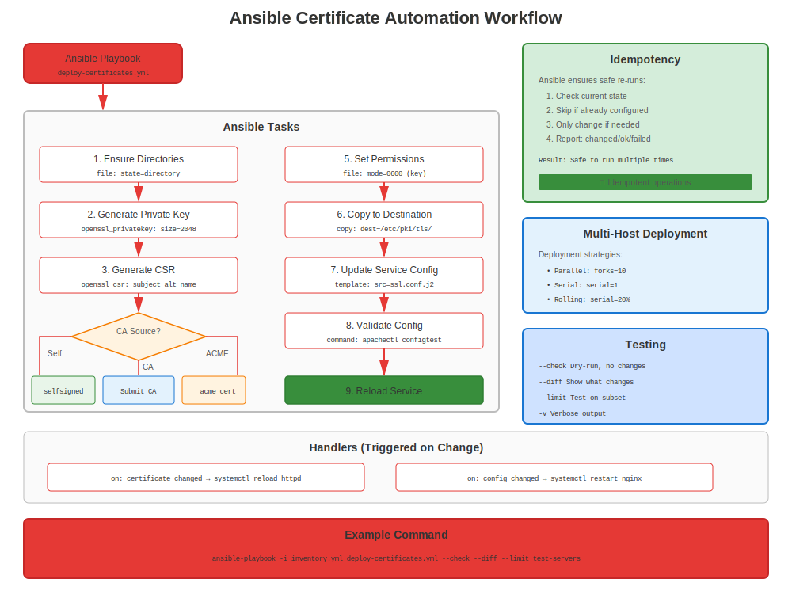

# Chapter 25: Ansible Automation for Certificates

> **Scale Up:** Manage certificates across hundreds of RHEL systems with Ansible. Automate deployment, renewal, and monitoring at enterprise scale.

---

## 25.1 Why Ansible for Certificates?



**Manual Management:**
```
❌ SSH to 100 servers individually
❌ Copy certificates one by one
❌ Configure services manually
❌ Track renewals per server
❌ Hope you didn't miss any
```

**Ansible Automation:**
```
✅ Deploy certificates to 100 servers in minutes
✅ Consistent configuration
✅ Idempotent (safe to run repeatedly)
✅ Version controlled (Git)
✅ Auditable (who changed what when)
✅ Rollback capable
```

---

## 25.2 Prerequisites

### Install Ansible on RHEL

```bash
#============================================#
# INSTALL ANSIBLE
#============================================#

# RHEL 8/9/10
sudo dnf install ansible-core -y

# Or from Ansible repository for latest
sudo dnf install epel-release  # If using EPEL
sudo dnf install ansible -y

# Verify
ansible --version

# Install community.crypto collection (ESSENTIAL!)
ansible-galaxy collection install community.crypto
```

---

## 25.3 Ansible Inventory for Certificate Management

### Example Inventory

```ini
#============================================#
# inventory/hosts.ini
#============================================#

[webservers]
web01.example.com
web02.example.com
web03.example.com

[mailservers]
mail01.example.com

[databases]
db01.example.com
db02.example.com

[all:vars]
ansible_user=ansible
ansible_become=yes
ansible_python_interpreter=/usr/bin/python3
```

---

## 25.4 Generate Certificates with Ansible

### Playbook: Generate Private Keys

```yaml
#============================================#
# playbooks/generate-keys.yml
#============================================#

---
- name: Generate Private Keys for RHEL Servers
  hosts: webservers
  become: yes

  tasks:
    - name: Install OpenSSL
      dnf:
        name: openssl
        state: present

    - name: Generate private key
      community.crypto.openssl_privatekey:
        path: "/etc/pki/tls/private/{{ inventory_hostname }}.key"
        size: 2048
        type: RSA
        mode: '0600'
        owner: root
        group: root

    - name: Verify key generated
      stat:
        path: "/etc/pki/tls/private/{{ inventory_hostname }}.key"
      register: key_file

    - name: Show result
      debug:
        msg: "Key generated: {{ key_file.stat.exists }}"
```

### Playbook: Generate CSRs

```yaml
#============================================#
# playbooks/generate-csrs.yml
#============================================#

---
- name: Generate Certificate Signing Requests
  hosts: webservers
  become: yes

  tasks:
    - name: Generate CSR
      community.crypto.openssl_csr:
        path: "/tmp/{{ inventory_hostname }}.csr"
        privatekey_path: "/etc/pki/tls/private/{{ inventory_hostname }}.key"
        common_name: "{{ inventory_hostname }}"
        subject_alt_name:
          - "DNS:{{ inventory_hostname }}"
          - "DNS:{{ inventory_hostname_short }}"
        key_usage:
          - digitalSignature
          - keyEncipherment
        extended_key_usage:
          - serverAuth
        organization_name: "Example Company"
        country_name: "US"

    - name: Fetch CSR to control node
      fetch:
        src: "/tmp/{{ inventory_hostname }}.csr"
        dest: "csrs/{{ inventory_hostname }}.csr"
        flat: yes
```

---

## 25.5 Deploy Certificates with Ansible

### Playbook: Deploy Certificates to Apache

```yaml
#============================================#
# playbooks/deploy-apache-certs.yml
#============================================#

---
- name: Deploy Certificates to Apache Servers
  hosts: webservers
  become: yes

  vars:
    cert_source_dir: "/path/to/certificates"

  tasks:
    - name: Install Apache and mod_ssl
      dnf:
        name:
          - httpd
          - mod_ssl
        state: present

    - name: Deploy certificate
      copy:
        src: "{{ cert_source_dir }}/{{ inventory_hostname }}.crt"
        dest: "/etc/pki/tls/certs/{{ inventory_hostname }}.crt"
        mode: '0644'
        owner: root
        group: root
      notify: reload apache

    - name: Deploy private key
      copy:
        src: "{{ cert_source_dir }}/{{ inventory_hostname }}.key"
        dest: "/etc/pki/tls/private/{{ inventory_hostname }}.key"
        mode: '0600'
        owner: root
        group: root
        no_log: yes  # Don't log private key
      notify: reload apache

    - name: Configure Apache SSL
      template:
        src: templates/ssl.conf.j2
        dest: /etc/httpd/conf.d/ssl.conf
        mode: '0644'
      notify: reload apache

    - name: Ensure Apache is running
      service:
        name: httpd
        state: started
        enabled: yes

  handlers:
    - name: reload apache
      service:
        name: httpd
        state: reloaded
```

---

## 25.6 Certificate Validation with Ansible

### Playbook: Validate Certificates

```yaml
#============================================#
# playbooks/validate-certificates.yml
#============================================#

---
- name: Validate Certificates on RHEL Servers
  hosts: all
  become: yes

  tasks:
    - name: Find all certificates
      find:
        paths: /etc/pki/tls/certs/
        patterns: '*.crt'
      register: certificates

    - name: Check certificate expiration
      community.crypto.x509_certificate_info:
        path: "{{ item.path }}"
      register: cert_info
      loop: "{{ certificates.files }}"
      loop_control:
        label: "{{ item.path }}"

    - name: Identify expiring certificates (30 days)
      set_fact:
        expiring_certs: "{{ expiring_certs | default([]) + [item.item.path] }}"
      when:
        - (item.not_after | to_datetime('%Y%m%d%H%M%SZ')) - (ansible_date_time.iso8601 | to_datetime) < '30 days'
      loop: "{{ cert_info.results }}"
      loop_control:
        label: "{{ item.item.path }}"

    - name: Report expiring certificates
      debug:
        msg: "⚠️ Certificate expiring soon: {{ item }}"
      loop: "{{ expiring_certs | default([]) }}"
      when: expiring_certs is defined
```

---

## 25.7 certmonger Management with Ansible

### Playbook: Setup certmonger Tracking

```yaml
#============================================#
# playbooks/setup-certmonger.yml
#============================================#

---
- name: Configure certmonger Tracking
  hosts: webservers
  become: yes

  tasks:
    - name: Install certmonger
      dnf:
        name: certmonger
        state: present

    - name: Ensure certmonger is running
      service:
        name: certmonger
        state: started
        enabled: yes

    - name: Request certificate from FreeIPA
      command: >
        ipa-getcert request
        -f /etc/pki/tls/certs/{{ inventory_hostname }}.crt
        -k /etc/pki/tls/private/{{ inventory_hostname }}.key
        -K HTTP/{{ inventory_hostname }}@EXAMPLE.COM
        -D {{ inventory_hostname }}
        -C "systemctl reload httpd"
      args:
        creates: /etc/pki/tls/certs/{{ inventory_hostname }}.crt

    - name: Check certmonger status
      command: getcert list
      register: cert_status
      changed_when: false

    - name: Display status
      debug:
        var: cert_status.stdout_lines
```

---

## 25.8 Certificate Monitoring with Ansible

### Playbook: Certificate Expiration Report

```yaml
#============================================#
# playbooks/cert-expiration-report.yml
#============================================#

---
- name: Generate Certificate Expiration Report
  hosts: all
  become: yes
  gather_facts: yes

  tasks:
    - name: Get certificate expiration for Apache
      shell: |
        if [ -f /etc/pki/tls/certs/{{ inventory_hostname }}.crt ]; then
          openssl x509 -in /etc/pki/tls/certs/{{ inventory_hostname }}.crt -noout -enddate | cut -d= -f2
        else
          echo "No certificate found"
        fi
      register: cert_expiry
      changed_when: false

    - name: Calculate days until expiration
      set_fact:
        days_left: "{{ ((cert_expiry.stdout | to_datetime('%b %d %H:%M:%S %Y %Z')) - (ansible_date_time.iso8601 | to_datetime)).days }}"
      when: cert_expiry.stdout != "No certificate found"

    - name: Add to report
      set_fact:
        cert_report: |
          {{ inventory_hostname }},{{ cert_expiry.stdout }},{{ days_left | default('N/A') }}
      delegate_to: localhost
      delegate_facts: yes

    - name: Save report
      copy:
        content: "{{ hostvars | dict2items | map(attribute='value.cert_report') | join('\n') }}"
        dest: "/tmp/cert-expiration-report.csv"
      delegate_to: localhost
      run_once: yes
```

---

## 25.9 Complete Certificate Deployment Workflow

### End-to-End Automation

```yaml
#============================================#
# playbooks/full-cert-deployment.yml
#============================================#

---
- name: Complete Certificate Deployment
  hosts: webservers
  become: yes

  vars:
    cert_domain: "example.com"
    cert_base_path: "/etc/pki/tls"

  pre_tasks:
    - name: Gather facts
      setup:

  tasks:
    # 1. Ensure directories exist
    - name: Ensure certificate directories exist
      file:
        path: "{{ item }}"
        state: directory
        mode: '0755'
      loop:
        - "{{ cert_base_path }}/certs"
        - "{{ cert_base_path }}/private"

    # 2. Generate private key (if not exists)
    - name: Generate private key
      community.crypto.openssl_privatekey:
        path: "{{ cert_base_path }}/private/{{ inventory_hostname }}.key"
        size: 2048
        mode: '0600'

    # 3. Deploy certificate (from controller)
    - name: Deploy certificate
      copy:
        src: "files/certs/{{ inventory_hostname }}.crt"
        dest: "{{ cert_base_path }}/certs/{{ inventory_hostname }}.crt"
        mode: '0644'
      notify: reload httpd

    # 4. Deploy CA bundle
    - name: Deploy CA bundle
      copy:
        src: "files/ca-bundle.crt"
        dest: "{{ cert_base_path }}/certs/ca-bundle.crt"
        mode: '0644'

    # 5. Configure Apache
    - name: Deploy Apache SSL configuration
      template:
        src: templates/apache-ssl.conf.j2
        dest: /etc/httpd/conf.d/ssl.conf
        mode: '0644'
      notify: reload httpd

    # 6. Validate configuration
    - name: Test Apache configuration
      command: apachectl configtest
      changed_when: false

    # 7. Ensure firewall open
    - name: Open HTTPS in firewall
      firewalld:
        service: https
        permanent: yes
        state: enabled
        immediate: yes

    # 8. Ensure Apache running
    - name: Ensure Apache is running
      service:
        name: httpd
        state: started
        enabled: yes

  handlers:
    - name: reload httpd
      service:
        name: httpd
        state: reloaded
```

---

## 25.10 Ansible Roles for Certificates

### Create Reusable Role

```bash
#============================================#
# CREATE ANSIBLE ROLE FOR CERTIFICATES
#============================================#

# Create role structure
ansible-galaxy role init certificates

# Directory structure:
certificates/
├── defaults/
│   └── main.yml          # Default variables
├── files/
│   └── ca-bundle.crt     # CA certificates
├── handlers/
│   └── main.yml          # Service reload handlers
├── tasks/
│   └── main.yml          # Main tasks
├── templates/
│   └── ssl.conf.j2       # Config templates
└── vars/
    └── main.yml          # Variables
```

### Example Role Tasks

```yaml
#============================================#
# roles/certificates/tasks/main.yml
#============================================#

---
- name: Install certificate management tools
  dnf:
    name:
      - openssl
      - certmonger
    state: present

- name: Ensure certificate directories
  file:
    path: "{{ item }}"
    state: directory
    mode: '0755'
  loop:
    - /etc/pki/tls/certs
    - /etc/pki/tls/private

- name: Deploy certificates
  include_tasks: deploy-cert.yml
  loop: "{{ certificates }}"
  loop_control:
    loop_var: cert

- name: Setup certmonger tracking
  include_tasks: setup-certmonger.yml
  when: use_certmonger | default(false)
```

### Use the Role

```yaml
#============================================#
# playbook.yml
#============================================#

---
- name: Deploy Certificates
  hosts: webservers
  become: yes

  roles:
    - role: certificates
      vars:
        certificates:
          - name: "{{ inventory_hostname }}"
            service: httpd
            principal: "HTTP/{{ inventory_hostname }}@REALM"
```

---

## 25.11 Best Practices

### Ansible Certificate Management Best Practices

```markdown
✅ **Use community.crypto collection** for certificate tasks
✅ **Vault-encrypt private keys** (ansible-vault)
✅ **Use no_log for sensitive data** (keys, passwords)
✅ **Test on staging first** before production
✅ **Use handlers** for service reloads (avoid unnecessary restarts)
✅ **Make playbooks idempotent** (safe to run multiple times)
✅ **Version control** playbooks in Git
✅ **Document variables** and requirements
✅ **Tag tasks** for selective execution
✅ **Use roles** for reusability
```

### Security Considerations

```yaml
# Encrypt private keys with ansible-vault
ansible-vault encrypt files/private-keys/*.key

# Use no_log for sensitive tasks
- name: Deploy private key
  copy:
    src: "{{ key_file }}"
    dest: "/etc/pki/tls/private/server.key"
  no_log: yes

# Use vault for passwords
# group_vars/all/vault.yml (encrypted)
admin_password: !vault |
          $ANSIBLE_VAULT;1.1;AES256
          ...
```

---

## 25.12 Complete Examples

### Example 1: Deploy CA to All Servers

```yaml
---
- name: Deploy Corporate CA to All RHEL Servers
  hosts: all
  become: yes

  tasks:
    - name: Copy CA certificate
      copy:
        src: files/corporate-ca.crt
        dest: /etc/pki/ca-trust/source/anchors/corporate-ca.crt
        mode: '0644'

    - name: Update CA trust
      command: update-ca-trust extract
      changed_when: true

    - name: Verify CA installed
      command: trust list
      register: trust_list
      changed_when: false

    - name: Confirm CA present
      assert:
        that:
          - "'Corporate CA' in trust_list.stdout"
        fail_msg: "Corporate CA not in trust store!"
```

### Example 2: Mass Certificate Renewal Check

```yaml
---
- name: Check Certificate Expiration Across Fleet
  hosts: all
  become: yes

  tasks:
    - name: Check certmonger status
      command: getcert list
      register: certmonger_status
      changed_when: false
      failed_when: false

    - name: Check for CA_UNREACHABLE
      set_fact:
        has_issue: true
      when: "'CA_UNREACHABLE' in certmonger_status.stdout"

    - name: Report problems
      debug:
        msg: "⚠️ {{ inventory_hostname }} has CA_UNREACHABLE certificates!"
      when: has_issue | default(false)

    - name: Create problem report
      lineinfile:
        path: "/tmp/cert-problems.txt"
        line: "{{ inventory_hostname }}: CA_UNREACHABLE"
        create: yes
      delegate_to: localhost
      when: has_issue | default(false)
```

---

## 25.13 Key Takeaways

1. **Ansible enables mass certificate deployment**
2. **community.crypto collection essential** for certificate tasks
3. **Use ansible-vault** for private keys
4. **Idempotent playbooks** are critical
5. **Test on staging** before production
6. **Combine with certmonger** for best results
7. **Version control** everything in Git

---

## Quick Reference Card

```
┌────────────────────────────────────────────────────────────────────┐
│ ANSIBLE CERTIFICATE AUTOMATION QUICK REFERENCE                     │
├────────────────────────────────────────────────────────────────────┤
│ Install:        dnf install ansible-core                           │
│ Collection:     ansible-galaxy collection install community.crypto │
│                                                                    │
│ Generate key:   community.crypto.openssl_privatekey                │
│ Generate CSR:   community.crypto.openssl_csr                       │
│ Get cert info:  community.crypto.x509_certificate_info             │
│                                                                    │
│ Deploy cert:    copy module (with mode: '0644')                    │
│ Deploy key:     copy module (with mode: '0600', no_log: yes)       │
│                                                                    │
│ Vault:          ansible-vault encrypt <file>                       │
│                 ansible-vault decrypt <file>                       │
│                                                                    │
│ Run:            ansible-playbook playbook.yml                      │
│ Dry run:        ansible-playbook playbook.yml --check              │
│ Specific:       ansible-playbook playbook.yml --tags certs         │
└────────────────────────────────────────────────────────────────────┘

✅ Use community.crypto collection
✅ Encrypt private keys with ansible-vault
✅ Use no_log for sensitive data
```

---

## 🧪 Hands-On Lab

**Lab 14: Ansible Automation**

Automate certificate deployment with Ansible

- 📁 **Location:** `labs/en_US/14-ansible-automation/`
- ⏱️ **Time:** 40-50 minutes
- 🎯 **Level:** Advanced

---

**Chapter Navigation**

| [← Previous: Chapter 24 - Let's Encrypt & certbot](24-letsencrypt-certbot.md) | [Next: Chapter 26 - Monitoring & Alerting on RHEL →](26-monitoring-alerting.md) |
|:---|---:|
