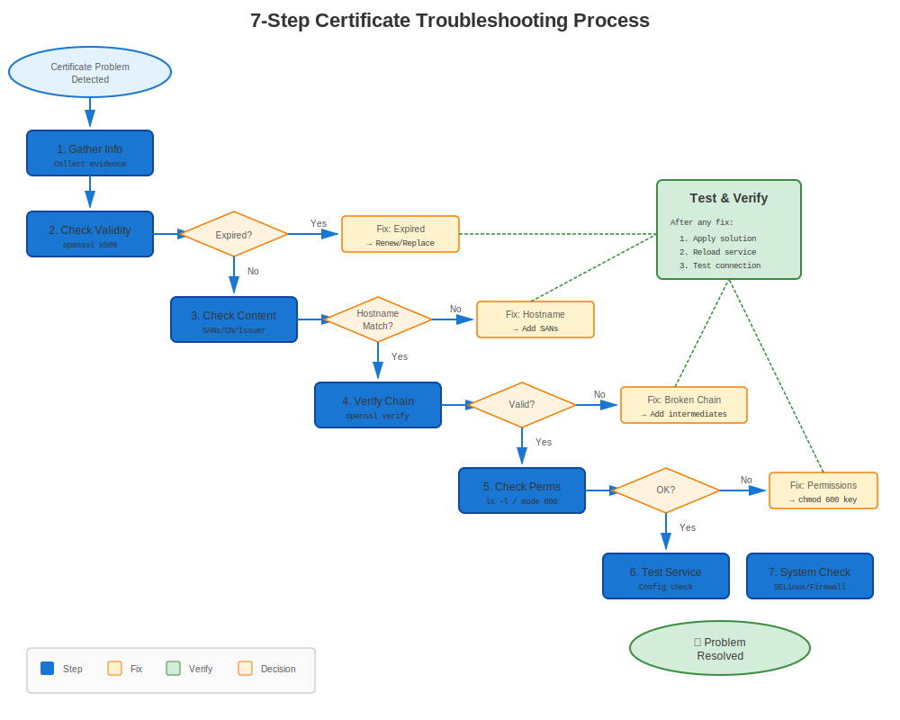
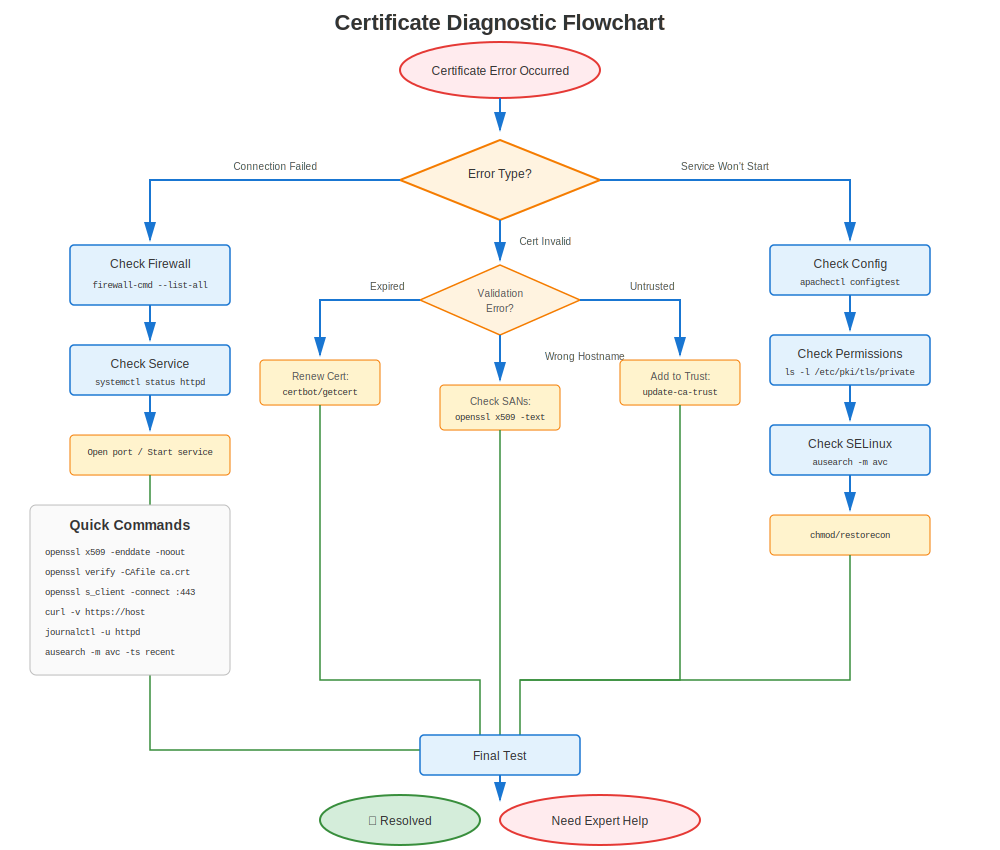

# Chapter 27: RHEL Certificate Troubleshooting Methodology

> **Critical Skill:** This chapter teaches you a systematic approach to troubleshoot ANY certificate issue on RHEL systems. Master this methodology and you'll solve problems in minutes instead of hours.

---

## 27.1 The Problem





Certificate issues are frustrating:
- Error messages are cryptic
- Root causes are hidden
- Multiple layers involved (OpenSSL, service config, SELinux, crypto-policies)
- Varies by RHEL version

**Random troubleshooting doesn't work.** You need a system.

---

## 27.2 The Systematic Approach

Follow this 7-step methodology for EVERY certificate issue:

```
Step 1: Identify RHEL Version & Environment
Step 2: Verify Basic Certificate Properties
Step 3: Check Trust Chain & CA Validation
Step 4: Verify Service Configuration
Step 5: Check System-Level Settings
Step 6: Test Certificate Functionality
Step 7: Review Logs & Error Details
```

**Rule:** Never skip steps. Each provides critical diagnostic information.

---

## 27.3 Step 1: Identify RHEL Version & Environment

### Why It Matters
Certificate behavior differs significantly across RHEL versions.

### Quick Checks

```bash
#============================================#
# RHEL VERSION CHECK
#============================================#

# 1. Check RHEL version
cat /etc/redhat-release
# Output example: Red Hat Enterprise Linux release 9.8 (Plow)

# 2. Check OpenSSL version
openssl version
# RHEL 7: OpenSSL 1.0.2k
# RHEL 8: OpenSSL 1.1.1k
# RHEL 9/10: OpenSSL 3.5.5

# 3. Check crypto-policy (RHEL 8+)
update-crypto-policies --show 2>/dev/null
# DEFAULT, LEGACY, FUTURE, or FIPS

# 4. Check FIPS mode
fips-mode-setup --check 2>/dev/null
# FIPS mode is enabled/disabled

# 5. Check SELinux status
getenforce
# Enforcing, Permissive, or Disabled
```

### What to Document

Create a troubleshooting note with:
```
RHEL Version: _______
OpenSSL Version: _______
Crypto-Policy: _______ (if RHEL 8+)
FIPS Mode: _______
SELinux: _______
Service: _______ (Apache, NGINX, Postfix, etc.)
```

---

## 27.4 Step 2: Verify Basic Certificate Properties

### The Five Essential Checks

```bash
#============================================#
# CHECK 1: Certificate Expiration
#============================================#

# View certificate dates
openssl x509 -in /path/to/cert.crt -noout -dates

# Output:
# notBefore=Jan 1 00:00:00 2024 GMT
# notAfter=Jan 1 23:59:59 2025 GMT   ← Must be in the future!

# Quick check if expired
openssl x509 -in /path/to/cert.crt -noout -checkend 0
# Exit 0 = valid, Exit 1 = expired

# Check expiration in X days
openssl x509 -in /path/to/cert.crt -noout -checkend $((86400*30))
# Check if expires in next 30 days


#============================================#
# CHECK 2: Certificate Subject/Hostname
#============================================#

# View subject (who certificate is for)
openssl x509 -in /path/to/cert.crt -noout -subject
# subject=CN=server.example.com

# View Subject Alternative Names (SANs) - CRITICAL!
openssl x509 -in /path/to/cert.crt -noout -ext subjectAltName
# X509v3 Subject Alternative Name:
#     DNS:server.example.com, DNS:www.example.com

# ⚠️ Modern browsers REQUIRE SANs (CN alone is insufficient)


#============================================#
# CHECK 3: Certificate/Key Pair Match
#============================================#

# Get certificate modulus
openssl x509 -noout -modulus -in /path/to/cert.crt | openssl md5

# Get key modulus
openssl rsa -noout -modulus -in /path/to/cert.key | openssl md5

# ✅ If MD5 hashes match → cert and key are paired
# ❌ If different → WRONG KEY!


#============================================#
# CHECK 4: Certificate Issuer
#============================================#

# View who signed this certificate
openssl x509 -in /path/to/cert.crt -noout -issuer
# issuer=C=US, O=Let's Encrypt, CN=R3

# Self-signed? (subject == issuer)
openssl x509 -in /path/to/cert.crt -noout -subject -issuer | sort | uniq -d
# If output is not empty → self-signed


#============================================#
# CHECK 5: Certificate Algorithm & Key Size
#============================================#

# View signature algorithm
openssl x509 -in /path/to/cert.crt -noout -text | grep "Signature Algorithm"
# Signature Algorithm: sha256WithRSAEncryption   ← Good
# Signature Algorithm: sha1WithRSAEncryption     ← Bad (deprecated)

# View public key size
openssl x509 -in /path/to/cert.crt -noout -text | grep "Public-Key"
# Public-Key: (2048 bit)   ← Minimum
# Public-Key: (4096 bit)   ← Better

# ⚠️ RHEL 8+ rejects < 2048 bit keys by default
# ⚠️ RHEL 9+ rejects SHA-1 signatures by default
```

### Quick Validation Script

```bash
#!/bin/bash
# quick-cert-check.sh
CERT=$1

echo "=== Certificate Quick Check ==="
echo ""
echo "File: $CERT"
echo ""

echo "1. Expiration:"
openssl x509 -in "$CERT" -noout -dates

echo ""
echo "2. Subject:"
openssl x509 -in "$CERT" -noout -subject

echo ""
echo "3. SANs:"
openssl x509 -in "$CERT" -noout -ext subjectAltName 2>/dev/null || echo "No SANs found"

echo ""
echo "4. Issuer:"
openssl x509 -in "$CERT" -noout -issuer

echo ""
echo "5. Algorithm & Key:"
openssl x509 -in "$CERT" -noout -text | grep -E "(Signature Algorithm|Public-Key)"

echo ""
echo "6. Still valid?"
if openssl x509 -in "$CERT" -noout -checkend 0 >/dev/null 2>&1; then
    echo "✅ Certificate is valid"
else
    echo "❌ Certificate has expired!"
fi
```

Usage:
```bash
bash quick-cert-check.sh /etc/pki/tls/certs/server.crt
```

---

## 27.5 Step 3: Check Trust Chain & CA Validation

### Understanding the Chain

```
Root CA (must be trusted by system)
  └─ Intermediate CA(s)
      └─ Server Certificate (your certificate)
```

### Verify Trust Chain

```bash
#============================================#
# CHECK COMPLETE CERTIFICATE CHAIN
#============================================#

# Method 1: Verify against system CA bundle
openssl verify /path/to/cert.crt
# /path/to/cert.crt: OK   ← Good!
# error 20: unable to get local issuer certificate   ← Missing CA!

# Method 2: Verify with specific CA file
openssl verify -CAfile /etc/pki/tls/certs/ca-bundle.crt /path/to/cert.crt

# Method 3: Show full chain
openssl s_client -connect server.example.com:443 -showcerts


#============================================#
# CHECK IF CA IS TRUSTED BY RHEL
#============================================#

# List all trusted CAs
trust list | grep -i "certificate-authority"

# Search for specific CA
trust list | grep -i "Let's Encrypt"

# Check if specific CA file is trusted
trust list --filter=ca-anchors | grep -A5 "pkcs11"


#============================================#
# VIEW CERTIFICATE CHAIN
#============================================#

# Extract and view full chain from server
openssl s_client -connect server.example.com:443 -showcerts 2>/dev/null | \
  awk '/BEGIN CERT/,/END CERT/ {print}'

# View chain from file (if bundled)
openssl crl2pkcs7 -nocrl -certfile /path/to/chain.crt | \
  openssl pkcs7 -print_certs -text -noout


#============================================#
# CHECK INTERMEDIATE CERTIFICATES
#============================================#

# Common issue: Missing intermediate certificate!
# Server should send: [Server Cert] → [Intermediate] → [Root]
# But only sends: [Server Cert]
# Result: Client can't validate chain!

# Test from another machine
echo | openssl s_client -connect server.example.com:443 -servername server.example.com 2>&1 | \
  grep -E "(verify return code|Verify return code)"
# Verify return code: 0 (ok)   ← Good
# Verify return code: 21 (unable to verify the first certificate)   ← Missing intermediate!
```

### Common Trust Issues

| Error Code | Meaning | Solution |
|------------|---------|----------|
| 0 | OK | ✅ No issues |
| 19 | Self-signed certificate in chain | Add CA to trust store |
| 20 | Unable to get local issuer cert | Missing CA or intermediate |
| 21 | Unable to verify first certificate | Missing intermediate cert |
| 27 | Certificate not trusted | CA not in system trust store |

---

## 27.6 Step 4: Verify Service Configuration

### Service-Specific Checks

```bash
#============================================#
# APACHE (httpd)
#============================================#

# Check SSL configuration
sudo apachectl -t -D DUMP_VHOSTS | grep -A5 ":443"

# View SSL cert paths
sudo grep -r "SSLCertificateFile\|SSLCertificateKeyFile" /etc/httpd/

# Test configuration syntax
sudo apachectl configtest

# Check SSL modules loaded
sudo httpd -M | grep ssl


#============================================#
# NGINX
#============================================#

# Test configuration
sudo nginx -t

# View SSL paths
sudo grep -r "ssl_certificate\|ssl_certificate_key" /etc/nginx/

# Check certificate files referenced
sudo nginx -T | grep "ssl_certificate"


#============================================#
# POSTFIX (Mail)
#============================================#

# View TLS settings
sudo postconf | grep -i tls

# Check cert/key paths
sudo postconf smtpd_tls_cert_file smtpd_tls_key_file

# Test TLS
openssl s_client -connect localhost:25 -starttls smtp


#============================================#
# OPENLDAP
#============================================#

# Check TLS settings
sudo grep -i "TLSCert\|TLSKey" /etc/openldap/slapd.conf /etc/openldap/slapd.d/* 2>/dev/null

# Test LDAPS
openssl s_client -connect localhost:636


#============================================#
# POSTGRESQL
#============================================#

# Check SSL settings
sudo -u postgres psql -c "SHOW ssl_cert_file; SHOW ssl_key_file;"

# Test SSL connection
psql "host=localhost sslmode=require"
```

### File Permissions Check

```bash
#============================================#
# VERIFY PERMISSIONS (CRITICAL!)
#============================================#

# Certificate files (public) should be readable
ls -l /etc/pki/tls/certs/*.crt
# -rw-r--r-- (644)   ← Good

# Key files (private) should be protected
ls -l /etc/pki/tls/private/*.key
# -rw------- (600) or -rw-r----- (640)   ← Good
# -rw-r--r-- (644)   ← BAD! Too permissive!

# Check ownership
ls -l /etc/pki/tls/private/*.key
# Should be owned by service user or root

# Fix permissions if needed
sudo chmod 600 /etc/pki/tls/private/server.key
sudo chown root:root /etc/pki/tls/private/server.key
```

---

## 27.7 Step 5: Check System-Level Settings

### RHEL Version-Specific

```bash
#============================================#
# RHEL 8/9/10: CHECK CRYPTO-POLICIES
#============================================#

# Current policy
update-crypto-policies --show
# DEFAULT, LEGACY, FUTURE, or FIPS

# If service fails with "no shared cipher" or similar:
# Temporarily test with LEGACY policy
sudo update-crypto-policies --set LEGACY
sudo systemctl restart <service>

# Test if it works now
# If YES → cipher/TLS version incompatibility
# If NO → different issue

# Revert to DEFAULT
sudo update-crypto-policies --set DEFAULT


#============================================#
# CHECK FIPS MODE (All Versions)
#============================================#

fips-mode-setup --check
# FIPS mode is enabled.

# In FIPS mode, additional restrictions apply:
# - Only approved algorithms
# - Stricter key requirements
# - Some ciphers disabled


#============================================#
# CHECK SELINUX (Critical!)
#============================================#

# SELinux status
getenforce
# Enforcing, Permissive, or Disabled

# Check for certificate-related denials
sudo ausearch -m avc -ts recent | grep -i cert

# Check SELinux context of cert files
ls -Z /etc/pki/tls/certs/server.crt
# system_u:object_r:cert_t:s0   ← Correct

# If wrong, relabel
sudo restorecon -v /etc/pki/tls/certs/server.crt
sudo restorecon -v /etc/pki/tls/private/server.key


#============================================#
# CHECK FIREWALL
#============================================#

# Verify service port is open
sudo firewall-cmd --list-all | grep -E "(https|443|ldaps|636)"

# If not open
sudo firewall-cmd --add-service=https --permanent
sudo firewall-cmd --reload
```

---

## 27.8 Step 6: Test Certificate Functionality

### Live Connection Tests

```bash
#============================================#
# TEST HTTPS/TLS CONNECTION
#============================================#

# Method 1: openssl s_client (most detailed)
openssl s_client -connect server.example.com:443 -servername server.example.com

# Look for:
# - "Verify return code: 0 (ok)"   ← Good
# - Certificate chain display
# - Cipher negotiated
# - Protocol version (TLS 1.2/1.3)

# Method 2: curl (quick test)
curl -v https://server.example.com/
# Look for:
# * SSL connection using TLSv1.3
# * Server certificate:
# *  subject: CN=server.example.com
# *  issuer: CN=Let's Encrypt Authority

# Method 3: Test with specific TLS version
openssl s_client -connect server.example.com:443 -tls1_2
openssl s_client -connect server.example.com:443 -tls1_3


#============================================#
# TEST FROM CLIENT PERSPECTIVE
#============================================#

# Test DNS resolution
nslookup server.example.com
# Must resolve to correct IP

# Test network connectivity
telnet server.example.com 443
nc -zv server.example.com 443

# Test with different clients
curl --insecure https://server.example.com/   # Bypass cert check
wget --no-check-certificate https://server.example.com/
```

### Certificate Validation Tests

```bash
#============================================#
# VALIDATE SPECIFIC ASPECTS
#============================================#

# Test hostname matching
openssl s_client -connect server.example.com:443 -servername server.example.com 2>&1 | \
  grep "verify return"

# Test with wrong hostname (should fail)
openssl s_client -connect server.example.com:443 -servername wrong.example.com 2>&1 | \
  grep "verify return"

# Test expiration
openssl s_client -connect server.example.com:443 2>&1 | openssl x509 -noout -dates

# Test cipher strength
openssl s_client -connect server.example.com:443 -cipher 'HIGH:!aNULL:!MD5'
```

---

## 27.9 Step 7: Review Logs & Error Details

### Where to Look

```bash
#============================================#
# SERVICE LOGS
#============================================#

# Apache
sudo tail -f /var/log/httpd/error_log
sudo tail -f /var/log/httpd/ssl_error_log

# NGINX
sudo tail -f /var/log/nginx/error.log

# Postfix
sudo tail -f /var/log/maillog

# System journal (all services)
sudo journalctl -u httpd.service -f
sudo journalctl -u nginx.service -f
sudo journalctl -xe | grep -i cert


#============================================#
# CERTMONGER LOGS (Auto-Renewal)
#============================================#

# certmonger status
sudo getcert list

# certmonger logs
sudo journalctl -u certmonger.service -f

# Detailed status for specific cert
sudo getcert list -i <request-id>


#============================================#
# SELINUX DENIALS
#============================================#

# Recent AVC denials
sudo ausearch -m avc -ts recent

# Certificate-related denials
sudo ausearch -m avc -ts today | grep -i cert


#============================================#
# OPENSSL/TLS ERRORS
#============================================#

# Common in logs:
# - "SSL_CTX_use_certificate:ca md too weak" → Weak signature algorithm
# - "unable to get local issuer certificate" → Missing CA
# - "certificate has expired" → Expired cert
# - "certificate verify failed" → Chain validation failure
# - "no shared cipher" → Cipher mismatch
# - "wrong version number" → Protocol mismatch
```

---

## 27.10 Decision Trees

### Quick Diagnostic Flowchart

```
Certificate Issue
    │
    ├─ Service won't start?
    │   ├─ Check file paths in config
    │   ├─ Check file permissions (600 for keys)
    │   ├─ Check cert/key pair match
    │   └─ Check SELinux context
    │
    ├─ Connection fails with "certificate verify failed"?
    │   ├─ Check CA trust (Step 3)
    │   ├─ Check intermediate certificates
    │   └─ Check crypto-policy (RHEL 8+)
    │
    ├─ "Certificate has expired"?
    │   ├─ Verify with: openssl x509 -noout -dates
    │   ├─ Check certmonger status
    │   └─ Renew certificate
    │
    ├─ "Hostname does not match"?
    │   ├─ Check SANs: openssl x509 -noout -ext subjectAltName
    │   ├─ Verify DNS resolution
    │   └─ Check server_name/ServerName directive
    │
    └─ "No shared cipher" / "wrong version number"?
        ├─ Check crypto-policy (RHEL 8+)
        ├─ Check TLS version compatibility
        └─ Test with: openssl s_client -tls1_2
```

---

## 27.11 Troubleshooting Toolkit

### Essential Commands

```bash
# Quick reference card for troubleshooting

# 1. IDENTIFY
cat /etc/redhat-release
openssl version
update-crypto-policies --show

# 2. VERIFY CERTIFICATE
openssl x509 -in cert.crt -noout -text
openssl x509 -in cert.crt -noout -dates
openssl x509 -in cert.crt -noout -subject

# 3. CHECK TRUST
openssl verify cert.crt
trust list | grep -i "authority"

# 4. TEST CONNECTION
openssl s_client -connect host:443 -servername host
curl -v https://host/

# 5. CHECK PERMISSIONS
ls -lZ /etc/pki/tls/certs/cert.crt
ls -lZ /etc/pki/tls/private/key.key

# 6. CHECK LOGS
sudo journalctl -xe | grep -i cert
sudo tail -f /var/log/httpd/ssl_error_log
```

### Create Your Troubleshooting Checklist

```markdown
## Certificate Issue Troubleshooting Checklist

### Environment
- [ ] RHEL Version: _______
- [ ] OpenSSL Version: _______
- [ ] Crypto-Policy (RHEL 8+): _______
- [ ] FIPS Mode: _______
- [ ] SELinux: _______
- [ ] Service: _______

### Certificate Checks
- [ ] Certificate expiration date
- [ ] Subject/hostname matches
- [ ] SANs present and correct
- [ ] Certificate/key pair match
- [ ] Signature algorithm (SHA-256 or stronger; no SHA-1 or MD5)
- [ ] Key size (>= 2048 bits)

### Trust Chain
- [ ] Certificate validates with system CA bundle
- [ ] Intermediate certificates present
- [ ] Root CA trusted by system

### Service Configuration
- [ ] Correct file paths in config
- [ ] File permissions correct (600 for keys)
- [ ] SELinux contexts correct
- [ ] Service config syntax valid

### System Settings
- [ ] Crypto-policy compatible (RHEL 8+)
- [ ] FIPS requirements met (if applicable)
- [ ] Firewall allows connections
- [ ] No SELinux denials

### Testing
- [ ] Connection test with openssl s_client
- [ ] Connection test with curl
- [ ] Hostname verification passes

### Logs
- [ ] Service logs reviewed
- [ ] System journal checked
- [ ] SELinux audit log checked
```

---

## 27.12 Key Takeaways

1. **Always follow the 7-step methodology** - don't skip steps
2. **Check RHEL version first** - behavior varies significantly
3. **Verify basic certificate properties** before complex troubleshooting
4. **Trust chain issues** are the most common problem
5. **File permissions** cause many "mysterious" failures
6. **Crypto-policies** (RHEL 8+) affect everything
7. **SELinux** can block certificate access
8. **Logs tell the story** - always check them

---

## 27.13 Practice Scenarios

See upcoming chapters for detailed troubleshooting of:
- **Chapter 28:** Common RHEL Certificate Errors
- **Chapter 29:** Service-Specific Troubleshooting
- **Chapter 30:** certmonger Troubleshooting
- **Chapter 31:** Crypto-Policy Troubleshooting
- **Chapter 32:** SOS Report Analysis
- **Chapter 33:** Emergency Procedures

---

## Quick Reference

```
┌────────────────────────────────────────────────────────────┐
│ 7-STEP TROUBLESHOOTING METHOD                              │
├────────────────────────────────────────────────────────────┤
│ 1. Identify: RHEL version, OpenSSL, crypto-policy          │
│ 2. Verify: Expiry, hostname, key match, algorithm          │
│ 3. Trust: CA validation, chain, intermediates              │
│ 4. Config: Service files, paths, permissions               │
│ 5. System: Crypto-policy, FIPS, SELinux, firewall          │
│ 6. Test: Live connections, curl, openssl s_client          │
│ 7. Logs: Service logs, journal, SELinux audit              │
└────────────────────────────────────────────────────────────┘
```

---

## 🧪 Hands-On Lab

**Lab 15: Troubleshooting Scenarios**

Practice diagnosing and fixing an expired certificate problem (one implemented scenario)

- 📁 **Location:** `labs/en_US/15-troubleshooting-scenarios/`
- ⏱️ **Time:** 15-20 minutes
- 🎯 **Level:** Advanced

---

**Chapter Navigation**

| [← Previous: Chapter 26 - Monitoring & Alerting on RHEL](../part-04-automation/26-monitoring-alerting.md) | [Next: Chapter 28 - Common RHEL Certificate Errors →](28-common-errors.md) |
|:---|---:|
