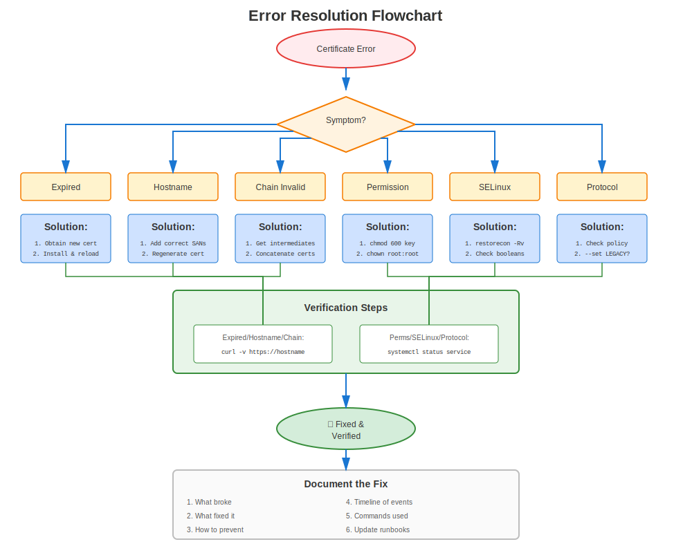

# Chapter 28: Common RHEL Certificate Errors

> **Learn from Others' Pain:** This chapter catalogs the most common certificate errors on RHEL, organized by type and version. When you encounter an error, look here first!

---

## 28.1 Using This Chapter




**How to use this troubleshooting guide:**

1. **See an error?** Search this chapter for the error message
2. **Service won't start?** Check Section 28.3 (Configuration Errors)
3. **Connection fails?** Check Section 28.4 (Validation Errors)
4. **After RHEL upgrade?** Check Section 28.7 (Version-Specific)
5. **Not sure?** Use the methodology from Chapter 27

---

## 28.2 Most Common Errors (Top 10)

### Quick Reference Table

| #  | Error | Common Cause | Quick Fix |
|----|-------|--------------|-----------|
| 1 | Certificate expired | Forgot to renew | Renew certificate |
| 2 | unable to get local issuer | Missing CA in trust store | Add CA to `/etc/pki/ca-trust/source/anchors/` |
| 3 | certificate verify failed | Chain incomplete | Install intermediate certs |
| 4 | Permission denied | Wrong file permissions | `chmod 600` on key file |
| 5 | hostname does not match | CN/SAN mismatch | Reissue with correct SANs |
| 6 | no shared cipher | Cipher incompatibility | Check crypto-policy (RHEL 8+) |
| 7 | ca md too weak | SHA-1 signature (RHEL 9+) | Reissue with SHA-256+ |
| 8 | wrong version number | TLS version mismatch | Check client TLS support |
| 9 | CA_UNREACHABLE | certmonger can't reach IPA | Check IPA connectivity |
| 10 | SELinux denying access | Wrong SELinux context | `restorecon` on cert files |

---

## 28.3 Configuration Errors

### Error: "SSLCertificateFile: file does not exist or is empty"

**Services:** Apache

**Symptom:**
```
AH00526: Syntax error on line 100 of /etc/httpd/conf.d/ssl.conf:
SSLCertificateFile: file '/etc/pki/tls/certs/server.crt' does not exist or is empty
```

**Diagnosis:**
```bash
ls -l /etc/pki/tls/certs/server.crt
# ls: cannot access '/etc/pki/tls/certs/server.crt': No such file or directory
```

**Solutions:**
```bash
# Solution 1: Fix path in config
sudo vi /etc/httpd/conf.d/ssl.conf
# Correct the SSLCertificateFile path

# Solution 2: Install certificate to expected location
sudo cp server.crt /etc/pki/tls/certs/

# Solution 3: Restore from backup
sudo cp /var/backups/certificates/latest/server.crt /etc/pki/tls/certs/
```

### Error: "Private key does not match this certificate"

**Services:** Apache, NGINX, Postfix

**Symptom:**
```
SSL Library Error: error:0B080074:x509 certificate routines:
X509_check_private_key:key values mismatch
```

**Diagnosis:**
```bash
# Check if cert and key match
CERT_MOD=$(openssl x509 -noout -modulus -in /etc/pki/tls/certs/server.crt | openssl md5)
KEY_MOD=$(openssl rsa -noout -modulus -in /etc/pki/tls/private/server.key | openssl md5)

echo "Cert: $CERT_MOD"
echo "Key:  $KEY_MOD"
# If different → mismatch!
```

**Cause:** Certificate was issued for a different private key

**Solution:**
```bash
# Regenerate CSR with the CORRECT key
openssl req -new -key /etc/pki/tls/private/server.key -out server.csr \
  -subj "/CN=server.example.com"

# Submit CSR to CA, get new certificate
# Install new certificate
```

### Error: "Permission denied" on Private Key

**Services:** All

**Symptom:**
```
Permission denied: Can't open PEM file '/etc/pki/tls/private/server.key'
```

**Diagnosis:**
```bash
ls -l /etc/pki/tls/private/server.key
# -rw-r--r--. 1 root root  ← Too permissive!

# Check if service user can read it
sudo -u apache cat /etc/pki/tls/private/server.key >/dev/null
# Permission denied
```

**Solution:**
```bash
# Set correct permissions
sudo chmod 600 /etc/pki/tls/private/server.key
sudo chown apache:apache /etc/pki/tls/private/server.key

# For services that need specific ownership:
# OpenLDAP:
sudo chown ldap:ldap /etc/openldap/certs/ldap.key

# PostgreSQL:
sudo chown postgres:postgres /var/lib/pgsql/data/server.key

# MySQL:
sudo chown mysql:mysql /etc/mysql/certs/server.key
```

---

## 28.4 Validation Errors

### Error: "certificate verify failed"

**Services:** All

**Full Error:**
```
SSL_connect: error:14090086:SSL routines:ssl3_get_server_certificate:certificate verify failed
```

**Common Causes:**

**Cause 1: Self-signed certificate not trusted**
```bash
# Diagnosis
openssl verify /etc/pki/tls/certs/server.crt
# error 18: self signed certificate

# Solution: Add to trust store
sudo cp server.crt /etc/pki/ca-trust/source/anchors/
sudo update-ca-trust
```

**Cause 2: Missing CA certificate**
```bash
# Diagnosis
openssl verify /etc/pki/tls/certs/server.crt
# error 20: unable to get local issuer certificate

# Solution: Add CA certificate
sudo cp ca.crt /etc/pki/ca-trust/source/anchors/
sudo update-ca-trust
```

**Cause 3: Missing intermediate certificate**
```bash
# Diagnosis
openssl s_client -connect server.example.com:443 -showcerts
# Verify return code: 21 (unable to verify the first certificate)

# Solution: Include intermediate in cert file
cat server.crt intermediate.crt > /etc/pki/tls/certs/server-chain.crt
# Update service config to use server-chain.crt
```

### Error: "certificate has expired"

**Services:** All

**Symptom:**
```
SSL_connect: error:14090086:SSL routines:ssl3_get_server_certificate:certificate has expired
```

**Diagnosis:**
```bash
# Check expiration
openssl x509 -in /etc/pki/tls/certs/server.crt -noout -dates
# notAfter=Jan 15 23:59:59 2024 GMT  ← In the past!
```

**Solutions:**
```bash
# Solution 1: If certmonger tracking
sudo ipa-getcert resubmit -f /etc/pki/tls/certs/server.crt

# Solution 2: Manual renewal
# Generate new CSR, submit to CA, install new cert

# Solution 3: Emergency - temporary self-signed
sudo /usr/local/bin/emergency-self-signed-cert.sh $(hostname -f)
# See Chapter 33 for emergency procedures
```

### Error: "hostname (or IP address) does not match certificate"

**Services:** All (especially browsers)

**Full Error:**
```
SSL: certificate subject name 'server.example.com' does not match target host name 'www.example.com'
```

**Diagnosis:**
```bash
# Check certificate CN and SANs
openssl x509 -in /etc/pki/tls/certs/server.crt -noout -subject -ext subjectAltName

# Output:
# subject=CN=server.example.com
# X509v3 Subject Alternative Name:
#     DNS:server.example.com
#
# Problem: Accessing www.example.com but cert only has server.example.com
```

**Solution:**
```bash
# Reissue certificate with correct SANs
openssl req -new -key server.key -out server.csr \
  -subj "/CN=www.example.com" \
  -addext "subjectAltName=DNS:www.example.com,DNS:server.example.com,DNS:example.com"

# Or use wildcard: *.example.com
```

---

## 28.5 Trust Chain Errors

### Error: "unable to get local issuer certificate"

**Error Code:** 20

**Symptom:**
```bash
openssl verify /etc/pki/tls/certs/server.crt
# error 20 at 0 depth lookup: unable to get local issuer certificate
```

**Cause:** CA that signed the certificate is not in system trust store

**Solution:**
```bash
# Get CA certificate (from CA or extract from chain)
# Add to trust store
sudo cp issuing-ca.crt /etc/pki/ca-trust/source/anchors/
sudo update-ca-trust

# Verify
openssl verify /etc/pki/tls/certs/server.crt
# /etc/pki/tls/certs/server.crt: OK
```

### Error: "unable to verify the first certificate"

**Error Code:** 21

**Symptom:**
```bash
openssl s_client -connect server.example.com:443
# Verify return code: 21 (unable to verify the first certificate)
```

**Cause:** Server sending certificate without intermediate(s)

**Diagnosis:**
```bash
# Count certificates in chain
openssl s_client -connect server.example.com:443 -showcerts 2>&1 | \
  grep -c "BEGIN CERTIFICATE"
# If shows 1: Only server cert (missing intermediate!)
# Should show 2+: Server + intermediate(s)
```

**Solution:**
```bash
# Create certificate bundle with intermediate
cat server.crt intermediate.crt > /etc/pki/tls/certs/server-bundle.crt

# Update service config
# Apache:
SSLCertificateFile /etc/pki/tls/certs/server-bundle.crt

# Or use SSLCertificateChainFile (Apache):
SSLCertificateChainFile /etc/pki/tls/certs/intermediate.crt

# NGINX:
ssl_certificate /etc/pki/tls/certs/server-bundle.crt;

# Reload service
```

---

## 28.6 Crypto-Policy Errors (RHEL 8/9/10)

### Error: "no shared cipher"

**Services:** All (RHEL 8/9/10)

**Symptom:**
```
SSL routines:SSL23_GET_SERVER_HELLO:sslv3 alert handshake failure
```

**Diagnosis:**
```bash
# Check current policy
update-crypto-policies --show
# DEFAULT

# Test connection showing ciphers
openssl s_client -connect server:443 -cipher 'ALL'

# Check what ciphers are available under current policy
openssl ciphers -v | head -20
```

**Common Causes & Solutions:**

**Cause 1: Client too old (needs TLS 1.0)**
```bash
# Temporary test with LEGACY
sudo update-crypto-policies --set LEGACY
sudo systemctl restart httpd

# If works → client compatibility issue
# Proper fix: Update client or create custom policy module
```

**Cause 2: Server crypto-policy too strict**
```bash
# If using FUTURE policy with old clients
update-crypto-policies --show
# FUTURE

# Temporary: Use DEFAULT
sudo update-crypto-policies --set DEFAULT
sudo systemctl restart services
```

### Error: "SSL routines:tls_post_process_client_hello:no shared cipher"

**Services:** All (RHEL 9+)

**Symptom:** Client can't negotiate cipher with server

**Solution:**
```bash
# RHEL 9: Check if client using very old ciphers
# May need LEGACY policy temporarily

# Check server configuration for overrides
grep -r "SSLCipherSuite\|ssl_ciphers" /etc/httpd/ /etc/nginx/

# If hard-coded ciphers found, remove them
# Let crypto-policy handle it
```

---

## 28.7 RHEL Version-Specific Errors

### RHEL 7 Specific Errors

**Error: "dh key too small"**
```
SSL routines:ssl3_check_cert_and_algorithm:dh key too small
```

**Cause:** Default DH parameters too small for modern clients

**Solution:**
```bash
# Generate stronger DH parameters
openssl dhparam -out /etc/pki/tls/dhparams.pem 2048

# Apache: Add to ssl.conf
SSLOpenSSLConfCmd DHParameters "/etc/pki/tls/dhparams.pem"

# NGINX: Add to config
ssl_dhparam /etc/pki/tls/dhparams.pem;
```

### RHEL 8/9/10 Specific Errors

**Error: "ca md too weak" (RHEL 9+)**
```
error 3 at 0 depth lookup: CA md too weak
```

**Cause:** Certificate has SHA-1 signature (blocked on RHEL 9+)

**Diagnosis:**
```bash
openssl x509 -in server.crt -noout -text | grep "Signature Algorithm"
# Signature Algorithm: sha1WithRSAEncryption  ← Problem!
```

**Solution:**
```bash
# Reissue certificate with SHA-256 or better
# No workaround - SHA-1 is blocked for security

# Request new certificate
openssl req -new -key server.key -out server.csr -sha256 \
  -subj "/CN=server.example.com"
```

**Error: "Provider 'legacy' could not be loaded" (RHEL 9+)**
```
openssl: error while loading shared libraries: Provider 'legacy' could not be loaded
```

**Cause:** Trying to use legacy algorithm without provider

**Solution:**
```bash
# Use legacy provider explicitly
openssl md5 -provider legacy file.txt

# Or update to use modern algorithm
openssl sha256 file.txt
```

---

## 28.8 SELinux Errors

### Error: SELinux Preventing Access to Certificate

**Symptom:**
```
audit: type=1400 audit(timestamp): avc: denied { read } for pid=1234 comm="httpd"
name="server.key" dev="sda1" ino=12345 scontext=system_u:system_r:httpd_t:s0
tcontext=unconfined_u:object_r:admin_home_t:s0 tclass=file permissive=0
```

**Diagnosis:**
```bash
# Check for AVC denials
sudo ausearch -m avc -ts recent | grep cert

# Check SELinux context
ls -Z /etc/pki/tls/certs/server.crt
ls -Z /etc/pki/tls/private/server.key
```

**Solution:**
```bash
# Fix SELinux context
sudo restorecon -Rv /etc/pki/tls/

# Verify
ls -Z /etc/pki/tls/certs/server.crt
# system_u:object_r:cert_t:s0  ← Correct

# If still issues, check if SELinux is blocking
sudo ausearch -m avc -ts recent

# Generate policy if needed
sudo ausearch -m avc -ts recent | audit2allow -M mycert
sudo semodule -i mycert.pp
```

---

## 28.9 certmonger Errors

### Error: CA_UNREACHABLE

**Symptom:**
```bash
sudo getcert list
# status: CA_UNREACHABLE
```

**Diagnosis:**
```bash
# Check IPA connectivity
ipa ping

# Check Kerberos ticket
klist

# Check IPA services
ssh ipa-server "sudo ipactl status"
```

**Solutions:**
```bash
# Solution 1: Renew Kerberos ticket
kinit -k host/$(hostname -f)@REALM

# Solution 2: Check network connectivity
ping ipa.example.com

# Solution 3: Restart certmonger
sudo systemctl restart certmonger

# Solution 4: Resubmit request
sudo ipa-getcert resubmit -f /etc/pki/tls/certs/server.crt
```

### Error: CA_REJECTED

**Symptom:**
```bash
sudo getcert list
# status: CA_REJECTED
# ca-error: Server unwilling to issue certificate
```

**Common Causes:**

**Cause 1: Service principal doesn't exist**
```bash
# Check if principal exists
ipa service-show HTTP/$(hostname -f)

# If not found, add it
ipa service-add HTTP/$(hostname -f)

# Resubmit
sudo ipa-getcert resubmit -f /etc/pki/tls/certs/server.crt
```

**Cause 2: Host not enrolled to IPA**
```bash
# Check enrollment
ipa host-show $(hostname -f)

# If not enrolled
sudo ipa-client-install
```

---

## 28.10 GPG/PGP Legacy Key Errors

### Error: "skipped PGP-2 keys" on Import

**Tool:** GnuPG (gpg)

**Symptom:**
```
$ gpg --allow-old-cipher-algos --import keyfile.asc
gpg: Total number processed: 2
gpg:     skipped PGP-2 keys: 2
```

The key is silently rejected — even with `--allow-old-cipher-algos`.

**Cause:** The key file contains **OpenPGP version 3** keys (PGP 2.x era). Modern GnuPG (2.2+) refuses to import v3 key packets entirely. These keys typically use RSA with MD5 signatures, both of which are cryptographically obsolete.

**Diagnosis — Inspect the key packets:**
```bash
gpg --list-packets keyfile.asc
```

Example output:
```
# off=0 ctb=95 tag=5 hlen=3 plen=930
:key packet: [obsolete version 3]
# off=933 ctb=b4 tag=13 hlen=2 plen=27
:user ID packet: "User Name <user@example.org>"
# off=962 ctb=89 tag=2 hlen=3 plen=277
:signature packet: algo 1, keyid A1B2C3D4E5F60789
        version 3, created 1034280585, md5len 5, sigclass 0x10
        digest algo 1, begin of digest a1 26
        data: [2047 bits]
```

The critical indicators are:
- `:key packet: [obsolete version 3]` — v3 format, rejected by modern GnuPG
- `algo 1` — RSA (encrypt or sign)
- `digest algo 1` — MD5 (cryptographically broken)
- `version 3` on the signature — old signature format
- `sigclass 0x10` — generic certification of a User ID

**Solution:** There is no way to "upgrade" a v3 key. You must generate a new modern key and retire the old one:

```bash
# 1. Generate a modern key (Ed25519 + Curve25519)
gpg --full-generate-key
#    Choose: (9) ECC (sign and encrypt)
#    Curve:  ed25519 (signing), cv25519 (encryption)

# 2. Verify the new key
gpg --list-keys --keyid-format long

# 3. If you still control the old key, cross-sign for trust continuity
gpg --default-key OLDKEYID --sign-key NEWKEYID

# 4. Generate a revocation certificate for the old key
gpg --output revoke-old.asc --gen-revoke OLDKEYID

# 5. Publish the new key
gpg --send-keys NEWKEYID

# 6. Revoke the old key
gpg --import revoke-old.asc
gpg --send-keys OLDKEYID
```

After migration, update all systems that reference the old key (CI/CD, package signing, email encryption).

---

### Understanding `gpg --list-packets` Output

When debugging GPG key issues, `gpg --list-packets` shows the raw OpenPGP packet structure. Here is a complete reference for interpreting the output.

#### Packet Header Fields

Each packet line starts with:
```
# off=0 ctb=95 tag=5 hlen=3 plen=930
```

| Field | Meaning |
|-------|---------|
| `off` | Byte offset in the file (start position of this packet) |
| `ctb` | Cipher Type Byte (raw header byte in hex, encodes format + tag) |
| `tag` | Packet type (decoded — see table below) |
| `hlen` | Header length in bytes |
| `plen` | Payload length in bytes |

#### Packet Tags (tag=)

| Tag | Packet Type |
|-----|-------------|
| 1 | Public-Key Encrypted Session Key |
| 2 | Signature |
| 3 | Symmetric-Key Encrypted Session Key |
| 4 | One-Pass Signature |
| 5 | Public Key |
| 6 | Secret Key |
| 7 | Secret Subkey |
| 8 | Compressed Data |
| 9 | Symmetrically Encrypted Data |
| 10 | Marker |
| 11 | Literal Data |
| 12 | Trust |
| 13 | User ID |
| 14 | Public Subkey |
| 17 | User Attribute |
| 18 | Encrypted + Integrity Protected Data |
| 19 | Modification Detection Code |

#### Public-Key Algorithm IDs (algo)

| ID | Algorithm |
|----|-----------|
| 1 | RSA (encrypt or sign) |
| 2 | RSA (encrypt-only) |
| 3 | RSA (sign-only) |
| 16 | Elgamal (encrypt-only) |
| 17 | DSA |
| 18 | ECDH |
| 19 | ECDSA |
| 21 | Diffie-Hellman |
| 22 | EdDSA (Ed25519, etc.) |

#### Digest (Hash) Algorithm IDs (digest algo)

| ID | Algorithm | Status |
|----|-----------|--------|
| 1 | MD5 | **Broken** — do not use |
| 2 | SHA-1 | **Deprecated** — blocked on RHEL 9+ |
| 3 | RIPEMD-160 | Legacy |
| 8 | SHA-256 | **Recommended** |
| 9 | SHA-384 | Strong |
| 10 | SHA-512 | Strong |
| 11 | SHA-224 | Acceptable |

#### Signature Classes (sigclass)

| Code | Meaning |
|------|---------|
| 0x00 | Binary document signature |
| 0x01 | Canonical text signature |
| 0x02 | Standalone signature |
| 0x10 | Generic key certification |
| 0x11 | Persona certification |
| 0x12 | Casual certification |
| 0x13 | Positive certification |
| 0x18 | Subkey binding |
| 0x19 | Primary key binding |
| 0x1F | Direct key signature |
| 0x20 | Key revocation |
| 0x28 | Subkey revocation |
| 0x30 | Certification revocation |
| 0x40 | Timestamp |
| 0x50 | Third-party confirmation |

#### Key Packet Versions

| Version | Era | Status |
|---------|-----|--------|
| 3 | PGP 2.x (1990s) | **Obsolete** — uses MD5 internally, rejected by modern GnuPG |
| 4 | OpenPGP RFC 4880 (2007) | Current standard |
| 5 | Draft (crypto-refresh) | Emerging |

#### Signature Packet Fields

For a signature like:
```
:signature packet: algo 1, keyid A1B2C3D4E5F60789
        version 3, created 1034280585, md5len 5, sigclass 0x10
        digest algo 1, begin of digest a1 26
        data: [2047 bits]
```

| Field | Meaning |
|-------|---------|
| `algo 1` | Public-key algorithm used (RSA) |
| `keyid` | Short identifier of the signing key |
| `version 3` | Signature format version (v3 = legacy) |
| `created` | Unix timestamp of signature creation |
| `md5len` | Length of MD5 prefix (v3 legacy artifact) |
| `sigclass 0x10` | Signature type (generic key certification) |
| `digest algo 1` | Hash algorithm (MD5) |
| `begin of digest` | First 2 bytes of hash (for quick verification checks) |
| `data: [2047 bits]` | RSA signature data (~2048-bit key) |

---

## 28.11 RPM Signature Errors After RHEL Upgrade

### Error: "Certificate invalid: policy violation — SHA1 is not considered secure"

**Tools:** RPM, DNF

**Symptom:**

After upgrading to RHEL 9+ or RHEL 10, RPM commands produce signature verification errors for third-party packages:

```
$ rpm -qa
error: Verifying a signature using certificate
  D4E7A923F10B82C6459831AE5F6C0D9BA47E31D2
  (Third-Party Vendor (Release signing) <security@vendor.example.com>):
  1. Certificate 5F6C0D9BA47E31D2 invalid: policy violation
      because: No binding signature at time 2024-08-12T10:44:42Z
      because: Policy rejected non-revocation signature
               (PositiveCertification) requiring second pre-image resistance
      because: SHA1 is not considered secure
  2. Certificate 5F6C0D9BA47E31D2 invalid: policy violation
      because: No binding signature at time 2026-04-16T19:46:38Z
      because: Policy rejected non-revocation signature
               (PositiveCertification) requiring second pre-image resistance
      because: SHA1 is not considered secure
```

RPM commands still function but produce excessive error output for every package signed with the affected key.

**Cause:** Third-party GPG signing keys that use SHA-1 for their binding signatures (self-certifications) are rejected by RHEL 9+ crypto-policies (SHA-1 blocked by default) and RHEL 10 (SHA-1 support removed entirely). Packages installed before the upgrade retain their old SHA-1 signatures in the RPM database.

**Diagnosis:**

```bash
# List all imported GPG keys in the RPM database
rpm -q gpg-pubkey --qf '%{NAME}-%{VERSION}-%{RELEASE}\t%{SUMMARY}\n'
```

**Solution:**

```bash
# 1. Remove the old third-party signing key
#    The certificate ID 5F6C0D9BA47E31D2 maps to version a47e31d2 in RPM
rpm -e --allmatches gpg-pubkey-a47e31d2-6142699d

# 2. Import the vendor's updated key
rpm --import https://vendor.example.com/keys/signing.asc

# 3. Verify errors are gone
rpm -qa > /dev/null
```

> **Key ID mapping:** The certificate ID in the error (e.g., `5F6C0D9BA47E31D2`) corresponds to the RPM `gpg-pubkey` version in lowercase hex (`a47e31d2`). If `rpm -e` reports "not installed", list all keys with `rpm -q gpg-pubkey --qf '...'` to find the exact version-release string.

---

## 28.12 RPM Database Corruption After RHEL Upgrade

### Error: "Malformed MPI" / "non-conformant OpenPGP implementation"

**Tools:** RPM

**Symptom:**

After upgrading to RHEL 9+ or RHEL 10, RPM reports a corrupt signature on every database query:

```
error: rpmdbNextIterator: skipping h#       9
Header RSA signature: BAD (header tag 268: invalid OpenPGP signature:
  Parsing an OpenPGP packet:
  Failed to parse Signature Packet
      because: Signature appears to be created by a non-conformant
               OpenPGP implementation, see
               <https://github.com/rpm-software-management/rpm/issues/2351>.
      because: Malformed MPI: leading bit is not set: expected bit 8 to
               be set in   110010 (32))
Header SHA256 digest: OK
Header SHA1 digest: OK
```

**Cause:** Some third-party packages were signed using non-standard OpenPGP implementations that produce malformed MPI (Multi-Precision Integer) values in RSA signatures. The older RPM in RHEL 7/8 tolerated these, but the Sequoia-PGP based parser in RHEL 9+/10 rejects them.

**Diagnosis:**

```bash
# Identify the broken package using the header number from the error (h# 9)
rpm -q --nosignature --querybynumber 9
```

**Solution:**

```bash
# 1. Backup the RPM database
tar zcvf /var/preserve/rpmdb-$(date +"%d%m%Y").tar.gz /usr/lib/sysimage/rpm/
# Note: on RHEL 8/9, the database is in /var/lib/rpm/

# 2. Identify the damaged package
rpm -q --nosignature --querybynumber <NUMBER_FROM_ERROR>

# 3. Remove the package with the broken signature
rpm -e --nosignature --nodigest <package-name>
# If removal fails, remove just the database entry:
rpm -e --justdb --nodeps <package-name>

# 4. Rebuild the RPM database
rpm --rebuilddb

# 5. Verify errors are resolved
rpm -qa > /dev/null

# 6. Reinstall from an updated repository
dnf install <package-name>
```

> **Note:** On RHEL 10, the RPM database is in `/usr/lib/sysimage/rpm/`. On RHEL 8/9, it's in `/var/lib/rpm/`.

> **Reference:** [RPM issue #2351](https://github.com/rpm-software-management/rpm/issues/2351) documents the stricter MPI parsing introduced with the Sequoia-PGP backend.

---

### Combined Scenario: Both Errors After Upgrade

When upgrading from RHEL 7/8 to RHEL 9+/10, both errors often appear simultaneously. Resolve them in this order:

1. **Remove old SHA-1 signing keys** and import updated vendor keys
2. **Rebuild the RPM database** with `rpm --rebuilddb`
3. **If malformed MPI errors persist**, identify affected packages by header number (`rpm -q --nosignature --querybynumber <N>`), remove them, and reinstall from updated repositories

---

## 28.13 Browser/Client Errors

### Error: "NET::ERR_CERT_COMMON_NAME_INVALID"

**Symptom:** Browser shows "Your connection is not private"

**Cause:** Hostname doesn't match certificate CN or SANs

**Diagnosis:**
```bash
# Check what you're accessing
echo "Accessing: www.example.com"

# Check certificate SANs
openssl s_client -connect www.example.com:443 2>&1 | \
  openssl x509 -noout -ext subjectAltName
# X509v3 Subject Alternative Name:
#     DNS:server.example.com  ← Doesn't include www.example.com!
```

**Solution:**
```bash
# Reissue certificate with correct SANs
openssl req -new -key server.key -out server.csr \
  -subj "/CN=www.example.com" \
  -addext "subjectAltName=DNS:www.example.com,DNS:server.example.com,DNS:example.com"
```

### Error: "NET::ERR_CERT_AUTHORITY_INVALID"

**Symptom:** Browser doesn't trust certificate

**Cause:** CA not in browser's trust store (self-signed or internal CA)

**For Internal CA:**
```bash
# Distribute CA certificate to clients
# Users need to install CA in their browser

# Or add to system trust (Linux clients)
sudo cp corporate-ca.crt /etc/pki/ca-trust/source/anchors/
sudo update-ca-trust
```

**For Self-Signed (Testing Only):**
```bash
# Don't use self-signed in production!
# Get proper certificate from CA
```

---

## 28.14 Firewall/Network Errors

### Error: Connection Timeout

**Symptom:** Can't connect to HTTPS port

**Diagnosis:**
```bash
# Check if service listening
ss -tlnp | grep :443

# Check firewall
sudo firewall-cmd --list-services | grep https

# Test locally
curl -vk https://localhost/

# Test remotely
telnet server.example.com 443
```

**Solution:**
```bash
# Open firewall
sudo firewall-cmd --add-service=https --permanent
sudo firewall-cmd --reload

# Verify
sudo firewall-cmd --list-all
```

---

## 28.15 Error Message Dictionary

### Quick Lookup Table

| Error Message | Error Code | Cause | Chapter |
|---------------|------------|-------|---------|
| "certificate has expired" | - | Expired cert | 28.4 |
| "unable to get local issuer" | 20 | Missing CA | 28.4 |
| "unable to verify first cert" | 21 | Missing intermediate | 28.4 |
| "self signed certificate" | 18 | Self-signed not trusted | 28.4 |
| "certificate verify failed" | - | General validation | 28.4 |
| "ca md too weak" | 3 | SHA-1 signature | 28.7 |
| "no shared cipher" | - | Cipher mismatch | 28.6 |
| "wrong version number" | - | TLS version mismatch | 28.6 |
| "Permission denied" | - | File permissions | 28.3 |
| "key values mismatch" | - | Cert/key don't pair | 28.3 |
| "hostname does not match" | - | CN/SAN mismatch | 28.4 |
| "CA_UNREACHABLE" | - | certmonger can't reach IPA | 28.9 |
| "CA_REJECTED" | - | IPA rejected request | 28.9 |
| "skipped PGP-2 keys" | - | GPG v3 key import rejected | 28.10 |
| "SHA1 is not considered secure" | - | Third-party GPG key uses SHA-1 | 28.11 |
| "Malformed MPI" | - | Non-conformant OpenPGP signature | 28.12 |

---

## 28.16 Quick Diagnostic Commands

### Universal Troubleshooting Commands

```bash
#============================================#
# RUN THESE FOR ANY CERTIFICATE ERROR
#============================================#

# 1. Check RHEL version
cat /etc/redhat-release

# 2. Check certificate file
openssl x509 -in /path/to/cert.crt -noout -text

# 3. Check expiration
openssl x509 -in /path/to/cert.crt -noout -dates

# 4. Check trust
openssl verify /path/to/cert.crt

# 5. Check permissions
ls -lZ /path/to/cert.crt
ls -lZ /path/to/key.key

# 6. Check cert/key match
openssl x509 -noout -modulus -in cert.crt | openssl md5
openssl rsa -noout -modulus -in key.key | openssl md5

# 7. Test connection
openssl s_client -connect server:443

# 8. Check logs
sudo journalctl -xe | grep -i cert
sudo tail -f /var/log/httpd/ssl_error_log

# 9. Check SELinux
sudo ausearch -m avc -ts recent | grep cert

# 10. Check crypto-policy (RHEL 8+)
update-crypto-policies --show
```

---

## 28.17 Error Resolution Flowchart

```
Certificate Error Occurred
    │
    ├─ Service won't start?
    │   ├─ Check config syntax
    │   ├─ Check file paths
    │   ├─ Check permissions (600 for keys)
    │   └─ Check SELinux context
    │
    ├─ Connection fails?
    │   ├─ Check firewall
    │   ├─ Check service listening
    │   ├─ Test with openssl s_client
    │   └─ Check network routing
    │
    ├─ Certificate validation error?
    │   ├─ Check expiration
    │   ├─ Check trust chain
    │   ├─ Check hostname match
    │   └─ Check intermediate certs
    │
    ├─ Cipher/protocol error?
    │   ├─ Check crypto-policy (RHEL 8+)
    │   ├─ Check TLS versions
    │   └─ Test with different TLS version
    │
    └─ certmonger error?
        ├─ CA_UNREACHABLE → Check IPA connectivity
        ├─ CA_REJECTED → Check principal exists
        └─ See Chapter 30
```

---

## 28.18 Key Takeaways

1. **Most errors are predictable** - Common patterns
2. **Always check expiration first** - #1 cause of issues
3. **Permissions matter** - 600 for keys, 644 for certs
4. **Trust chain critical** - Missing CA or intermediate
5. **RHEL version matters** - Different errors per version
6. **crypto-policies affect everything** (RHEL 8+)
7. **SELinux can block** - Check contexts
8. **Reference Chapter 27** for systematic approach

---

## Quick Reference Card

```
┌───────────────────────────────────────────────────────────────────┐
│ COMMON CERTIFICATE ERRORS QUICK REFERENCE                         │
├───────────────────────────────────────────────────────────────────┤
│ Expired:           Check: openssl x509 -noout -dates              │
│                    Fix: Renew certificate                         │
│                                                                   │
│ Trust:             Check: openssl verify cert.crt                 │
│                    Fix: Add CA to /etc/pki/ca-trust/...           │
│                                                                   │
│ Hostname:          Check: openssl x509 -noout -ext subjectAltName │
│                    Fix: Reissue with correct SANs                 │
│                                                                   │
│ Permissions:       Check: ls -lZ cert.crt key.key                 │
│                    Fix: chmod 600 key.key                         │
│                                                                   │
│ Cert/Key match:    Check: Compare MD5 of modulus                  │
│                    Fix: Regenerate CSR with correct key           │
│                                                                   │
│ No shared cipher:  Check: update-crypto-policies --show           │
│                    Fix: Update policy or client                   │
│                                                                   │
│ SELinux:           Check: ausearch -m avc | grep cert             │
│                    Fix: restorecon -Rv /etc/pki/tls/              │
└───────────────────────────────────────────────────────────────────┘

Always start with: Chapter 27 (7-step methodology)
```

---

**Chapter Navigation**

| [← Previous: Chapter 27 - RHEL Certificate Troubleshooting Methodology](27-troubleshooting-methodology.md) | [Next: Chapter 29 - Service-Specific Troubleshooting →](29-service-troubleshooting.md) |
|:---|---:|
