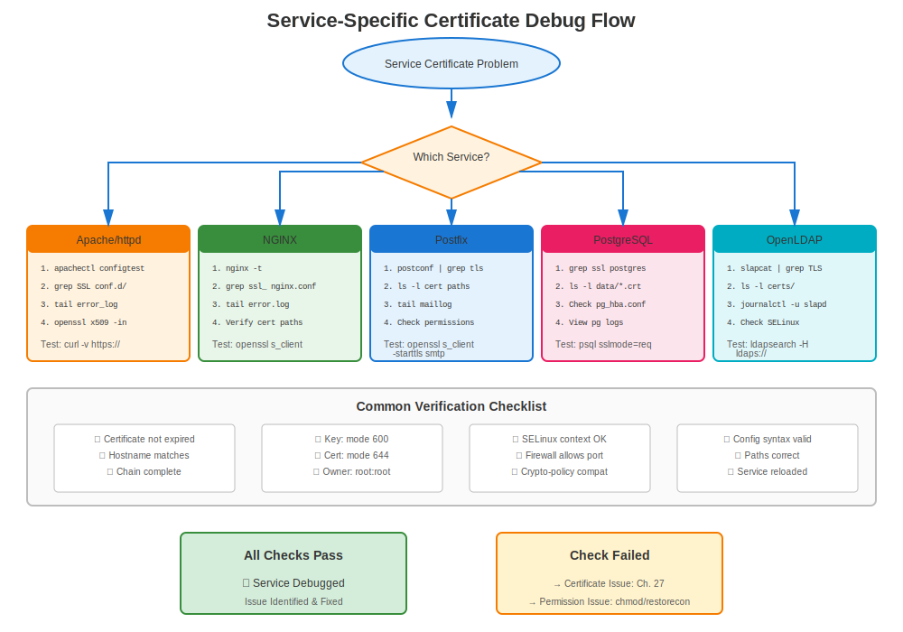

# Chapter 29: Service-Specific Troubleshooting

> **Service by Service:** Each RHEL service has unique certificate requirements and failure modes. This chapter provides targeted troubleshooting for each major service.

---

## 29.1 Apache httpd Troubleshooting



### Apache Won't Start

**Diagnostic Steps:**
```bash
#============================================#
# APACHE CERTIFICATE TROUBLESHOOTING
#============================================#

# Step 1: Check Apache status
systemctl status httpd
sudo journalctl -xe -u httpd

# Step 2: Test configuration
sudo apachectl configtest
# Look for SSL-related errors

# Step 3: Check if mod_ssl loaded
sudo httpd -M | grep ssl
# Should show: ssl_module (shared)

# Step 4: Verify certificate files
ls -l /etc/pki/tls/certs/*.crt
ls -l /etc/pki/tls/private/*.key

# Step 5: Check permissions
ls -l /etc/pki/tls/private/server.key
# Should be: -rw------- (600)

# Step 6: Verify cert/key match
CERT_MOD=$(openssl x509 -noout -modulus -in /etc/pki/tls/certs/server.crt | openssl md5)
KEY_MOD=$(openssl rsa -noout -modulus -in /etc/pki/tls/private/server.key | openssl md5)
[ "$CERT_MOD" = "$KEY_MOD" ] && echo "✅ Match" || echo "❌ Mismatch!"

# Step 7: Check SELinux
sudo ausearch -m avc -ts recent | grep httpd | grep cert
```

### Common Apache SSL Errors

| Error | Cause | Solution |
|-------|-------|----------|
| "SSLCertificateFile: file does not exist" | Wrong path | Fix path in ssl.conf |
| "key values mismatch" | Cert/key don't pair | Regenerate with correct key |
| "unable to load certificate" | File format issue | Ensure PEM format |
| "Syntax error" in ssl.conf | Config typo | Run `apachectl configtest` |
| "unable to verify certificate" | Chain issue | Add intermediate cert |

---

## 29.2 NGINX Troubleshooting

### NGINX SSL/TLS Issues

**Diagnostic Steps:**
```bash
#============================================#
# NGINX CERTIFICATE TROUBLESHOOTING
#============================================#

# Step 1: Test configuration
sudo nginx -t

# Step 2: Show full config
sudo nginx -T | grep ssl_certificate

# Step 3: Check certificate files
ls -l /etc/pki/tls/certs/nginx.crt
ls -l /etc/pki/tls/private/nginx.key

# Step 4: Verify cert/key pair
openssl x509 -noout -modulus -in /etc/pki/tls/certs/nginx.crt | openssl md5
openssl rsa -noout -modulus -in /etc/pki/tls/private/nginx.key | openssl md5

# Step 5: Check NGINX error log
sudo tail -50 /var/log/nginx/error.log | grep -i ssl

# Step 6: Check if NGINX running
systemctl status nginx
ss -tlnp | grep nginx
```

### Common NGINX SSL Errors

| Error | Cause | Solution |
|-------|-------|----------|
| "SSL: error:0200100D" | Permission denied on key | `chmod 600` on key |
| "no \"ssl\" is defined" | Missing ssl in listen | Add `listen 443 ssl;` |
| "cannot load certificate" | File not found | Check path |
| "PEM_read_bio:no start line" | Wrong format | Ensure PEM format |
| "nginx: [emerg] bind() failed" | Port in use | Check what's on port 443 |

---

## 29.3 Postfix Troubleshooting

### Postfix TLS Issues

**Diagnostic Steps:**
```bash
#============================================#
# POSTFIX TLS TROUBLESHOOTING
#============================================#

# Step 1: Check Postfix TLS config
sudo postconf | grep -i tls

# Step 2: View specific settings
sudo postconf smtpd_tls_cert_file smtpd_tls_key_file

# Step 3: Test configuration
sudo postfix check

# Step 4: Check certificate files
ls -l $(sudo postconf -h smtpd_tls_cert_file)
ls -l $(sudo postconf -h smtpd_tls_key_file)

# Step 5: Test SMTP TLS
openssl s_client -starttls smtp -connect localhost:25

# Step 6: Check mail logs
sudo tail -f /var/log/maillog | grep -i tls

# Step 7: Check if STARTTLS offered
telnet localhost 25
# Type: EHLO test
# Should show: 250-STARTTLS
```

### Common Postfix TLS Errors

| Error | Cause | Solution |
|-------|-------|----------|
| "SSL_accept error" | Cert/key issue | Check cert/key pair |
| "TLS is required but not available" | TLS not enabled | Set security_level = may |
| "no shared cipher" | Cipher mismatch | Check crypto-policy |
| "certificate verify failed" | Chain issue | Install intermediate |
| "Permission denied" | Key permissions | `chmod 600` on key |

---

## 29.4 OpenLDAP Troubleshooting

### LDAPS Issues

**Diagnostic Steps:**
```bash
#============================================#
# OPENLDAP TLS TROUBLESHOOTING
#============================================#

# Step 1: Check if slapd listening on 636
ss -tlnp | grep 636

# Step 2: Check TLS configuration
sudo slapcat -b "cn=config" | grep -i tls

# Step 3: Verify certificate files
ls -l /etc/openldap/certs/ldap.{crt,key}

# Step 4: Check ownership
# CRITICAL: Must be owned by ldap user!
ls -l /etc/openldap/certs/
# Should show: ldap:ldap

# Step 5: Test LDAPS connection
openssl s_client -connect localhost:636

# Step 6: Test with ldapsearch
ldapsearch -H ldaps://localhost:636 -x -b "" -s base

# Step 7: Check slapd logs
sudo journalctl -u slapd | grep -i tls
```

### Common OpenLDAP TLS Errors

| Error | Cause | Solution |
|-------|-------|----------|
| "TLS: can't accept" | Key not readable | `chown ldap:ldap` on key |
| "TLS: hostname does not match" | CN/SAN mismatch | Reissue with correct hostname |
| "certificate verify failed" | CA not trusted | Add CA to trust store |
| "Permission denied" | Wrong ownership | `chown ldap:ldap` |
| "TLS engine not initialized" | TLS not configured | Add TLS directives |

---

## 29.5 PostgreSQL Troubleshooting

### PostgreSQL SSL Issues

**Diagnostic Steps:**
```bash
#============================================#
# POSTGRESQL SSL TROUBLESHOOTING
#============================================#

# Step 1: Check if SSL enabled
sudo -u postgres psql -c "SHOW ssl;"

# Step 2: View SSL settings
sudo -u postgres psql -c "SHOW ssl_cert_file; SHOW ssl_key_file;"

# Step 3: Check certificate files
ls -l /var/lib/pgsql/data/server.{crt,key}

# Step 4: Check ownership
# Must be owned by postgres user
ls -l /var/lib/pgsql/data/server.key
# -rw------- postgres postgres

# Step 5: Test SSL connection
psql "host=localhost sslmode=require"

# Step 6: Check PostgreSQL logs
sudo tail -f /var/lib/pgsql/data/log/postgresql-*.log | grep -i ssl

# Step 7: Check permissions
sudo -u postgres stat /var/lib/pgsql/data/server.key
```

### Common PostgreSQL SSL Errors

| Error | Cause | Solution |
|-------|-------|----------|
| "could not load server certificate" | Permission denied | `chown postgres:postgres`, `chmod 600` |
| "private key file has wrong permissions" | Too permissive | `chmod 600` on key |
| "SSL connection has been closed unexpectedly" | Trust issue | Check client CA trust |
| "SSL is not enabled" | SSL off in config | Set `ssl = on` |

---

## 29.6 MySQL/MariaDB Troubleshooting

### Database SSL Issues

**Diagnostic Steps:**
```bash
#============================================#
# MYSQL/MARIADB SSL TROUBLESHOOTING
#============================================#

# Step 1: Check if SSL available
mysql -u root -p -e "SHOW VARIABLES LIKE 'have_ssl';"
# Should show: YES

# Step 2: View SSL variables
mysql -u root -p -e "SHOW VARIABLES LIKE '%ssl%';"

# Step 3: Check certificate files
ls -l /etc/mysql/certs/{ca,server}.{crt,key}

# Step 4: Check ownership
# Must be readable by mysql user
ls -l /etc/mysql/certs/
# mysql:mysql

# Step 5: Test SSL connection
mysql --ssl-mode=REQUIRED -h localhost -u root -p

# Step 6: Check connection status
mysql -u root -p -e "STATUS" | grep SSL

# Step 7: Check error log
sudo tail -f /var/log/mariadb/mariadb.log | grep -i ssl
```

---

## 29.7 Cross-Service Issues

### Certificate Works in One Service, Fails in Another

**Scenario:** Same certificate works in Apache but fails in Postfix

**Diagnosis:**
```bash
# Apache works
curl -v https://localhost/
# ✅ OK

# Postfix fails
openssl s_client -starttls smtp -connect localhost:25
# ❌ Error

# Why? Different requirements!
```

**Common Causes:**

**Cause 1: File ownership**
- Apache: Runs as root (can read root-owned keys)
- Postfix: Runs as postfix (needs readable key)
- OpenLDAP: Runs as ldap (needs ldap-owned key)

**Cause 2: File locations**
- Apache: /etc/pki/tls/
- PostgreSQL: /var/lib/pgsql/data/
- OpenLDAP: /etc/openldap/certs/

**Cause 3: Format requirements**
- Most services: Separate cert and key files
- HAProxy: Combined PEM file
- Cockpit: Combined cert+key

---

## 29.8 Troubleshooting Toolkit

### Service-Specific Test Commands

```bash
#============================================#
# TEST EACH SERVICE
#============================================#

# Apache HTTPS
curl -v https://localhost/
openssl s_client -connect localhost:443

# NGINX HTTPS
curl -v https://localhost:8443/  # If custom port
openssl s_client -connect localhost:443

# Postfix SMTP
openssl s_client -starttls smtp -connect localhost:25
openssl s_client -connect localhost:465  # SMTPS

# Dovecot IMAP
openssl s_client -connect localhost:993  # IMAPS
openssl s_client -connect localhost:995  # POP3S

# OpenLDAP
openssl s_client -connect localhost:636  # LDAPS
ldapsearch -H ldaps://localhost:636 -x -b ""

# PostgreSQL
psql "host=localhost sslmode=require"

# MySQL/MariaDB
mysql --ssl-mode=REQUIRED -h localhost -u root -p

# Cockpit
openssl s_client -connect localhost:9090
```

---

## 29.9 Key Takeaways

1. **Each service has unique requirements** - Ownership, location, format
2. **Always check service-specific logs** first
3. **Test with service-specific commands** (not just openssl)
4. **Permissions critical** - Different users for different services
5. **File locations matter** - Service-dependent paths
6. **Configuration syntax** varies by service
7. **Reference service chapters** (Ch 14-21) for detailed config

---

## Quick Reference Card

```
┌─────────────────────────────────────────────────────────────┐
│ SERVICE-SPECIFIC TROUBLESHOOTING                            │
├─────────────────────────────────────────────────────────────┤
│ Apache:      apachectl configtest                           │
│              tail -f /var/log/httpd/ssl_error_log           │
│                                                             │
│ NGINX:       nginx -t                                       │
│              tail -f /var/log/nginx/error.log               │
│                                                             │
│ Postfix:     postfix check                                  │
│              tail -f /var/log/maillog | grep TLS            │
│                                                             │
│ OpenLDAP:    slapcat -b "cn=config" | grep TLS              │
│              journalctl -u slapd | grep TLS                 │
│              chown ldap:ldap (CRITICAL!)                    │
│                                                             │
│ PostgreSQL:  psql -c "SHOW ssl;"                            │
│              chown postgres:postgres (CRITICAL!)            │
│                                                             │
│ MySQL:       mysql -e "SHOW VARIABLES LIKE '%ssl%';"        │
│              chown mysql:mysql (CRITICAL!)                  │
└─────────────────────────────────────────────────────────────┘

⚠️ File ownership is service-specific!
✅ Always check logs for each service
```
---

**Chapter Navigation**

| [← Previous: Chapter 28 - Common RHEL Certificate Errors](28-common-errors.md) | [Next: Chapter 30 - certmonger Troubleshooting →](30-certmonger-issues.md) |
|:---|---:|
