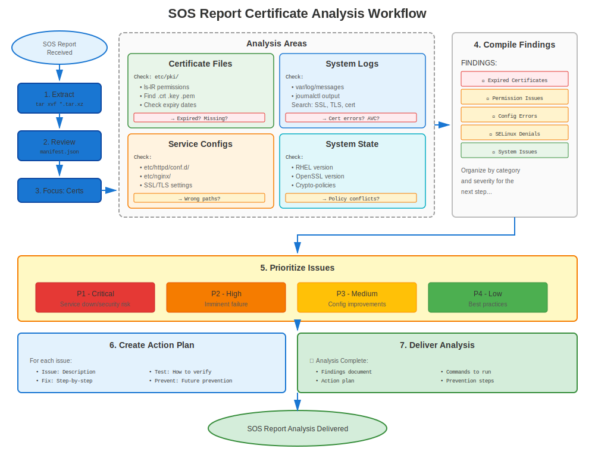

# Chapter 32: SOS Report Analysis

> **Support Essential:** SOS reports are RHEL's system diagnostic tool. Learn how to extract certificate information from SOS reports for troubleshooting.

---

## 32.1 What is an SOS Report?



**sosreport** is Red Hat's diagnostic data collection tool.

**Contains:**
- ✅ System configuration files
- ✅ Log files
- ✅ Command outputs
- ✅ Package lists
- ✅ Certificate information
- ✅ Security settings
- ❌ Private keys (excluded for security!)

**Use Cases:**
- Opening Red Hat support cases
- Post-incident analysis
- Pre-migration audits
- Security compliance checks

---

## 32.2 Generating an SOS Report

### Basic SOS Report Generation

```bash
#============================================#
# GENERATE SOS REPORT
#============================================#

# Install sos (usually pre-installed)
sudo dnf install sos -y

# Generate report
sudo sos report

# Interactive prompts:
# - Case ID (optional)
# - Description
# - Confirm

# Output:
# /var/tmp/sosreport-hostname-YYYYMMDDHHMMSS.tar.xz

# Extract
tar xf /var/tmp/sosreport-*.tar.xz
cd sosreport-*/
```

### Certificate-Focused SOS Report

```bash
#============================================#
# SOS REPORT WITH CERTIFICATE FOCUS
#============================================#

# Generate with specific plugins
sudo sos report \
  --batch \
  --enable-plugins crypto,openssl,certmonger,freeipa \
  --case-id "CASE12345"

# Or specify what to include
sudo sos report \
  --batch \
  -o crypto \
  -o openssl \
  -o certmonger \
  -o pki
```

---

## 32.3 Finding Certificate Information in SOS

### Key Locations in SOS Report

```bash
#============================================#
# CERTIFICATE-RELATED FILES IN SOS REPORT
#============================================#

# After extracting sosreport-*.tar.xz:
cd sosreport-*/

# Certificate files (public only, no private keys!)
ls -la etc/pki/tls/certs/
ls -la etc/pki/ca-trust/source/anchors/

# certmonger tracking
cat sos_commands/certmonger/getcert_list

# OpenSSL version
cat sos_commands/crypto/openssl_version

# Crypto-policy (RHEL 8+)
cat sos_commands/crypto/update-crypto-policies_--show

# Trust store
ls -la etc/pki/ca-trust/extracted/

# Service configurations
cat etc/httpd/conf.d/ssl.conf
cat etc/nginx/nginx.conf
cat etc/postfix/main.cf | grep tls

# Certificate expiration check
cat sos_commands/crypto/openssl_x509_-in_*

# System info
cat etc/redhat-release
cat sos_commands/kernel/uname_-a
```

---

## 32.4 Analyzing Certificate Issues from SOS

### Certificate Expiration Analysis

```bash
#============================================#
# CHECK CERTIFICATE EXPIRATION IN SOS
#============================================#

# Navigate to SOS report directory
cd sosreport-hostname-*/

# Find all certificate inspection outputs
find sos_commands/crypto/ -name "*x509*" -type f

# Check each certificate
for cert_output in sos_commands/crypto/openssl_x509_*.txt; do
  echo "=== $cert_output ==="
  grep -E "(Subject:|Not After)" "$cert_output"
  echo ""
done

# Or extract expiration dates
grep -r "Not After" sos_commands/crypto/ | sort
```

### certmonger Status Analysis

```bash
#============================================#
# ANALYZE CERTMONGER FROM SOS
#============================================#

# certmonger list output
cat sos_commands/certmonger/getcert_list

# Look for:
# - status: CA_UNREACHABLE  ← Problem!
# - status: CA_REJECTED     ← Problem!
# - expires: <date>         ← Check if soon

# Count certificates by status
grep "status:" sos_commands/certmonger/getcert_list | sort | uniq -c

# Find problematic certificates
grep -B10 "CA_UNREACHABLE\|CA_REJECTED" sos_commands/certmonger/getcert_list
```

### Crypto-Policy Analysis (RHEL 8+)

```bash
#============================================#
# CHECK CRYPTO-POLICY IN SOS
#============================================#

# Current policy
cat sos_commands/crypto/update-crypto-policies_--show

# Check for overrides
grep -r "SSLProtocol\|SSLCipherSuite" etc/httpd/
grep -r "ssl_protocols\|ssl_ciphers" etc/nginx/
grep -r "tls_protocols" etc/postfix/main.cf

# If overrides found: Document that service opts out of crypto-policy
```

---

## 32.5 Common SOS Report Findings

### Finding 1: Expired Certificates

**In SOS Report:**
```bash
# Check certificate expirations
grep "Not After" sos_commands/crypto/* | \
  while read line; do
    # Parse and check if expired
    echo "$line"
  done
```

**Red Flags:**
- Certificates expired before SOS report generation
- Certificates expiring within 30 days
- Multiple expired certificates

### Finding 2: certmonger Issues

**In SOS Report:**
```bash
# Check certmonger status
cat sos_commands/certmonger/getcert_list | grep -A15 "Request ID"

# Common issues:
# - Multiple CA_UNREACHABLE (IPA connectivity issue)
# - CA_REJECTED (permissions/principal issue)
# - Old expiration dates with no renewal (certmonger not working)
```

### Finding 3: Missing Intermediate Certificates

**In SOS Report:**
```bash
# Check certificate chain
# If service config points to cert without intermediate:
grep "SSLCertificateFile" etc/httpd/conf.d/ssl.conf
# /etc/pki/tls/certs/server.crt  ← Check if this includes chain

# Check actual certificate
openssl x509 -in etc/pki/tls/certs/server.crt -noout -text
# Look for: Issuer (if not well-known, need intermediate)
```

---

## 32.6 SOS Report Checklist for Certificates

### Systematic Analysis

```markdown
## SOS Report Certificate Analysis Checklist

### System Information
- [ ] RHEL version (`cat etc/redhat-release`)
- [ ] OpenSSL version (`cat sos_commands/crypto/openssl_version`)
- [ ] Crypto-policy (`cat sos_commands/crypto/update-crypto-policies*`)
- [ ] FIPS mode (`grep FIPS sos_commands/crypto/*`)

### Certificate Files
- [ ] List certificates (`ls etc/pki/tls/certs/`)
- [ ] Check permissions (`ls -la etc/pki/tls/private/`)
- [ ] Verify ownership
- [ ] Check SELinux contexts (`ls -Z etc/pki/tls/`)

### Certificate Validity
- [ ] Check expirations (`grep "Not After" sos_commands/crypto/*`)
- [ ] Identify expired certificates
- [ ] Identify certificates expiring soon (< 30 days)
- [ ] Check signature algorithms (SHA-1 = problem on RHEL 9+)

### certmonger Status (if used)
- [ ] certmonger running? (`cat sos_commands/systemd/systemctl_list-units`)
- [ ] Tracked certificates (`cat sos_commands/certmonger/getcert_list`)
- [ ] Any CA_UNREACHABLE or CA_REJECTED?
- [ ] Renewal schedule appropriate?

### Service Configurations
- [ ] Apache SSL config (`cat etc/httpd/conf.d/ssl.conf`)
- [ ] NGINX SSL config (`cat etc/nginx/nginx.conf`)
- [ ] Postfix TLS config (`grep tls etc/postfix/main.cf`)
- [ ] OpenLDAP TLS config
- [ ] Certificate paths correct?

### Trust Store
- [ ] Custom CAs (`ls etc/pki/ca-trust/source/anchors/`)
- [ ] Trust bundle updated
- [ ] Blacklisted certs (RHEL 8+)

### Logs
- [ ] Recent certificate errors (`grep -i cert var/log/messages`)
- [ ] SSL/TLS errors in service logs
- [ ] SELinux denials (`grep AVC var/log/audit/audit.log | grep cert`)

### Recommendations
- [ ] List certificate issues found
- [ ] Prioritize by severity
- [ ] Suggest remediation steps
```

---

## 32.7 Automated SOS Analysis Script

### Certificate Issue Finder

```bash
#!/bin/bash
# analyze-sos-certificates.sh
# Automated certificate issue detection in SOS reports

SOS_DIR=$1

if [ -z "$SOS_DIR" ] || [ ! -d "$SOS_DIR" ]; then
  echo "Usage: $0 /path/to/sosreport-directory"
  exit 1
fi

cd "$SOS_DIR"

echo "=== SOS Report Certificate Analysis ==="
echo "Report: $(basename $SOS_DIR)"
echo ""

# System info
echo "System Information:"
echo "  RHEL Version: $(cat etc/redhat-release 2>/dev/null)"
echo "  OpenSSL: $(cat sos_commands/crypto/openssl_version 2>/dev/null | head -2)"
if [ -f sos_commands/crypto/update-crypto-policies_--show ]; then
  echo "  Crypto-Policy: $(cat sos_commands/crypto/update-crypto-policies_--show)"
fi
echo ""

# Certificate expiration
echo "Certificate Expiration:"
if [ -d sos_commands/crypto ]; then
  grep -h "Not After" sos_commands/crypto/openssl_x509_* 2>/dev/null | \
    while read line; do
      echo "  $line"
    done
else
  echo "  No certificate data found"
fi
echo ""

# certmonger status
echo "certmonger Status:"
if [ -f sos_commands/certmonger/getcert_list ]; then
  STATUS_COUNT=$(grep "status:" sos_commands/certmonger/getcert_list | sort | uniq -c)
  echo "$STATUS_COUNT"

  # Highlight problems
  if grep -q "CA_UNREACHABLE\|CA_REJECTED" sos_commands/certmonger/getcert_list; then
    echo "  ⚠️ Issues found:"
    grep -B5 "CA_UNREACHABLE\|CA_REJECTED" sos_commands/certmonger/getcert_list | \
      grep -E "(Request ID|status:)" | head -20
  fi
else
  echo "  certmonger not installed or no data"
fi
echo ""

# Check for common issues
echo "Potential Issues:"
ISSUES=0

# Expired certs (basic check)
if grep -q "Not After.*202[0-3]" sos_commands/crypto/* 2>/dev/null; then
  echo "  ⚠️ Potentially expired certificates found"
  ((ISSUES++))
fi

# certmonger problems
if grep -q "CA_UNREACHABLE" sos_commands/certmonger/getcert_list 2>/dev/null; then
  echo "  ⚠️ certmonger CA_UNREACHABLE status found"
  ((ISSUES++))
fi

# SELinux denials
if grep -q "avc.*denied.*cert" var/log/audit/audit.log 2>/dev/null; then
  echo "  ⚠️ SELinux denials related to certificates"
  ((ISSUES++))
fi

if [ $ISSUES -eq 0 ]; then
  echo "  ✅ No obvious issues detected"
fi

echo ""
echo "=== Analysis Complete ==="
```

---

## 32.8 Key Files to Check in SOS

### Critical Certificate Files

```
sosreport-hostname-YYYYMMDDHHMMSS/
├── etc/
│   ├── pki/
│   │   ├── tls/certs/                     ← Certificates (public)
│   │   ├── ca-trust/                      ← Trust store
│   │   └── nssdb/                         ← NSS databases
│   ├── httpd/conf.d/ssl.conf              ← Apache config
│   ├── nginx/nginx.conf                   ← NGINX config
│   └── postfix/main.cf                    ← Postfix config
│
├── sos_commands/
│   ├── crypto/
│   │   ├── openssl_version                ← OpenSSL version
│   │   ├── openssl_x509_*                 ← Certificate inspections
│   │   └── update-crypto-policies_--show  ← Policy
│   │
│   ├── certmonger/
│   │   └── getcert_list                   ← certmonger status
│   │
│   ├── systemd/
│   │   └── systemctl_list-units           ← Service status
│   │
│   └── networking/
│       └── ss_-tulpn                      ← Listening ports
│
└── var/log/
    ├── messages                           ← System log
    ├── httpd/ssl_error_log                ← Apache SSL errors
    └── audit/audit.log                    ← SELinux denials
```

---

## 32.9 Common SOS Report Scenarios

### Scenario 1: Website Down - Certificate Issue?

**Analysis Steps:**
```bash
# 1. Check if httpd was running
grep "httpd.service" sos_commands/systemd/systemctl_list-units
# active (running) ← Service was up

# 2. Check SSL error log
tail var/log/httpd/ssl_error_log
# Look for certificate-related errors

# 3. Check certificate expiration
cat sos_commands/crypto/openssl_x509_*server.crt* | grep "Not After"

# 4. Check Apache config
cat etc/httpd/conf.d/ssl.conf | grep -E "SSLCertificate"

# 5. Check if files existed
ls -l etc/pki/tls/certs/ | grep server
```

### Scenario 2: certmonger Renewal Failures

**Analysis Steps:**
```bash
# 1. Check certmonger status
cat sos_commands/certmonger/getcert_list

# 2. Look for CA_UNREACHABLE
grep "CA_UNREACHABLE" sos_commands/certmonger/getcert_list

# 3. Check IPA connectivity (if using FreeIPA)
grep "ipa" var/log/messages | tail -50

# 4. Check Kerberos tickets
cat sos_commands/kerberos/klist* 2>/dev/null

# 5. Identify when renewal should have happened
# Look for expiration dates, calculate 2/3 of lifetime
```

---

## 32.10 Key Takeaways

1. **SOS reports are invaluable** for remote troubleshooting
2. **No private keys included** (security!)
3. **Certificate information IS included** (public certs, config, logs)
4. **certmonger status preserved** in getcert_list output
5. **Crypto-policy recorded** (RHEL 8+)
6. **Use for post-incident analysis** and audits
7. **Automate analysis** with scripts

---

## Quick Reference Card

```
┌──────────────────────────────────────────────────────────────┐
│ SOS REPORT CERTIFICATE ANALYSIS                              │
├──────────────────────────────────────────────────────────────┤
│ Generate:   sudo sos report                                  │
│ Extract:    tar xf sosreport-*.tar.xz                        │
│                                                              │
│ Key Files:  etc/pki/tls/certs/                               │
│             etc/httpd/conf.d/ssl.conf                        │
│             sos_commands/certmonger/getcert_list             │
│             sos_commands/crypto/openssl_version              │
│             sos_commands/crypto/update-crypto-policies*      │
│             var/log/httpd/ssl_error_log                      │
│                                                              │
│ Common checks:                                               │
│   - Certificate expiration dates                             │
│   - certmonger status                                        │
│   - Service configurations                                   │
│   - crypto-policy setting                                    │
│   - SELinux denials                                          │
└──────────────────────────────────────────────────────────────┘

⚠️ Private keys NOT included (security)
✅ Perfect for remote troubleshooting
```
---

**Chapter Navigation**

| [← Previous: Chapter 31 - Crypto-Policy Troubleshooting](31-crypto-policy-issues.md) | [Next: Chapter 33 - Emergency Procedures →](33-emergency-procedures.md) |
|:---|---:|
