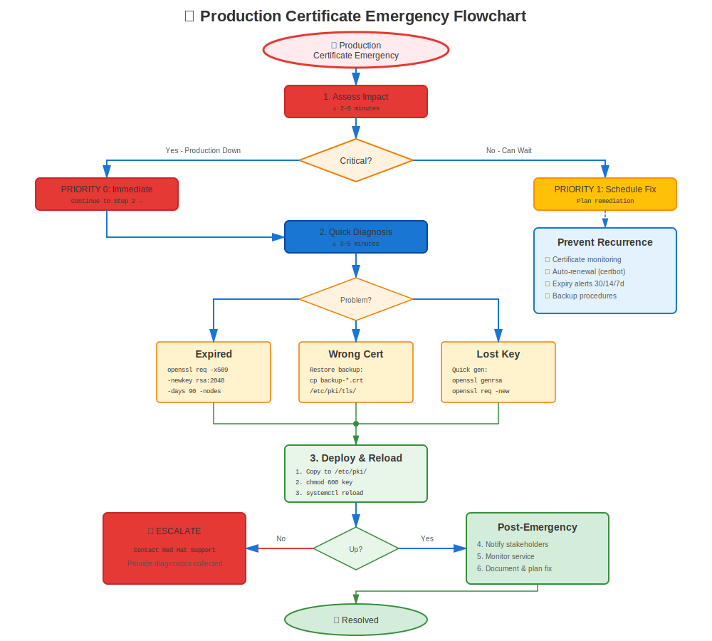

# Chapter 33: Emergency Procedures

> **Production Down:** When certificates break and services are offline, you need quick, reliable procedures. This chapter is your emergency playbook.

---

## 33.1 Emergency Response Philosophy



**When production is down:**
- ⏰ **Speed matters** - Every minute counts
- 🎯 **Fix first, investigate later** - Get services running
- 📝 **Document everything** - For post-mortem
- 🔄 **Temporary is OK** - Proper fix comes after recovery

**This chapter provides:**
- Quick diagnostic procedures
- Emergency workarounds
- Temporary certificates
- Roll back procedures
- Communication templates

---

## 33.2 Quick Diagnostic (First 60 Seconds)

### Triage Questions

```bash
#============================================#
# EMERGENCY TRIAGE - 60 SECONDS
#============================================#

# Q1: What's broken?
systemctl status httpd nginx postfix

# Q2: When did it break?
journalctl -xe --since "10 minutes ago" | grep -i cert

# Q3: Certificate expired?
openssl x509 -in /etc/pki/tls/certs/server.crt -noout -dates

# Q4: Recent changes?
rpm -qa --last | head -20        # Recent package updates
ausearch -m SYSCALL --start recent | grep cert  # Recent cert file access

# Q5: Disk full?
df -h /etc/pki

# Q6: SELinux blocking?
ausearch -m avc -ts recent | grep cert
```

### Decision Tree (First Response)

```
Certificate Issue Detected
    │
    ├─ Service won't start?
    │   ├─ File not found → Quick Fix #1: Restore from backup
    │   ├─ Permission denied → Quick Fix #2: Fix permissions
    │   └─ Invalid cert → Quick Fix #3: Use temporary cert
    │
    ├─ Certificate expired?
    │   └─ Quick Fix #4: Generate temp self-signed OR restore backup
    │
    ├─ Chain validation failure?
    │   └─ Quick Fix #5: Add missing CA OR use LEGACY policy
    │
    └─ Unknown/Complex?
        └─ Escalate + Apply Quick Fix #6: Rollback to last known good
```

---

## 33.3 Quick Fix #1: Restore from Backup

**Scenario:** Certificate/key file missing or corrupted

**Time:** 2-5 minutes

```bash
#!/bin/bash
# emergency-restore-cert.sh

SERVICE=$1  # apache, nginx, postfix, etc.
BACKUP_DIR="/var/backups/certificates"

echo "=== EMERGENCY: Restoring $SERVICE Certificate ==="

# Stop service
systemctl stop $SERVICE

# Find most recent backup
LATEST=$(ls -dt $BACKUP_DIR/*/ | head -2)
echo "Using backup from: $LATEST"

# Restore certificate
if [ -f "$LATEST/${SERVICE}.crt" ]; then
  cp "$LATEST/${SERVICE}.crt" /etc/pki/tls/certs/
  chmod 644 /etc/pki/tls/certs/${SERVICE}.crt
  echo "✅ Certificate restored"
else
  echo "❌ No backup found for $SERVICE"
  exit 1
fi

# Restore key
if [ -f "$LATEST/${SERVICE}.key" ]; then
  cp "$LATEST/${SERVICE}.key" /etc/pki/tls/private/
  chmod 600 /etc/pki/tls/private/${SERVICE}.key
  echo "✅ Private key restored"
fi

# Start service
systemctl start $SERVICE

# Test
sleep 2
systemctl status $SERVICE

if systemctl is-active --quiet $SERVICE; then
  echo "✅ SUCCESS: $SERVICE is running"
  exit 0
else
  echo "❌ FAILED: $SERVICE did not start"
  journalctl -xe -u $SERVICE | tail -20
  exit 1
fi
```

---

## 33.4 Quick Fix #2: Fix Permissions Emergency

**Scenario:** Service fails with "permission denied" on certificate files

**Time:** 30 seconds

```bash
#!/bin/bash
# emergency-fix-permissions.sh

echo "=== EMERGENCY: Fixing Certificate Permissions ==="

# Fix certificate directory
chmod 755 /etc/pki/tls/certs/
chmod 644 /etc/pki/tls/certs/*.crt 2>/dev/null

# Fix private key directory
chmod 711 /etc/pki/tls/private/
chmod 600 /etc/pki/tls/private/*.key 2>/dev/null

# Fix ownership (adjust for your service)
chown root:root /etc/pki/tls/certs/*.crt 2>/dev/null
chown root:root /etc/pki/tls/private/*.key 2>/dev/null

# Fix SELinux contexts
restorecon -Rv /etc/pki/tls/

echo "✅ Permissions fixed"

# Show results
echo ""
echo "Certificate permissions:"
ls -lZ /etc/pki/tls/certs/*.crt 2>/dev/null | head -5

echo ""
echo "Key permissions:"
ls -lZ /etc/pki/tls/private/*.key 2>/dev/null | head -5
```

---

## 33.5 Quick Fix #3: Generate Temporary Self-Signed Certificate

**Scenario:** Certificate expired or invalid, need immediate fix

**Time:** 1-2 minutes

**⚠️ WARNING:** Self-signed certs cause browser warnings! Only for emergency internal use!

```bash
#!/bin/bash
# emergency-self-signed-cert.sh

HOSTNAME=${1:-$(hostname -f)}
DAYS=${2:-30}
CERT_PATH="/etc/pki/tls/certs/${HOSTNAME}-temp.crt"
KEY_PATH="/etc/pki/tls/private/${HOSTNAME}-temp.key"

echo "=== EMERGENCY: Generating Temporary Self-Signed Certificate ==="
echo "Hostname: $HOSTNAME"
echo "Valid for: $DAYS days"

# Generate self-signed certificate
openssl req -x509 -nodes -days $DAYS \
  -newkey rsa:2048 \
  -keyout "$KEY_PATH" \
  -out "$CERT_PATH" \
  -subj "/C=US/ST=Emergency/L=Emergency/O=Emergency/CN=$HOSTNAME" \
  -addext "subjectAltName=DNS:$HOSTNAME,DNS:$(hostname -s)"

if [ $? -eq 0 ]; then
  # Set permissions
  chmod 600 "$KEY_PATH"
  chmod 644 "$CERT_PATH"

  echo "✅ Temporary certificate generated"
  echo "   Certificate: $CERT_PATH"
  echo "   Key: $KEY_PATH"
  echo ""
  echo "⚠️ CRITICAL: This is a TEMPORARY fix!"
  echo "   - Request proper certificate immediately"
  echo "   - Document this emergency action"
  echo "   - Plan proper replacement within $DAYS days"
  echo ""
  echo "To use with Apache:"
  echo "  SSLCertificateFile $CERT_PATH"
  echo "  SSLCertificateKeyFile $KEY_PATH"

  # Show certificate
  openssl x509 -in "$CERT_PATH" -noout -text | grep -E "(Subject:|Not After)"
else
  echo "❌ FAILED to generate certificate"
  exit 1
fi
```

---

## 33.6 Quick Fix #4: Emergency Certificate Renewal

**Scenario:** Certificate expired, need proper renewal ASAP

**Time:** 5-15 minutes (depends on CA)

```bash
#!/bin/bash
# emergency-renew-cert.sh

CERT_PATH=$1
KEY_PATH=$2
HOSTNAME=$3

echo "=== EMERGENCY: Renewing Expired Certificate ==="

# Generate new CSR
CSR_PATH="/tmp/emergency-$(date +%s).csr"

openssl req -new -key "$KEY_PATH" -out "$CSR_PATH" \
  -subj "/CN=$HOSTNAME" \
  -addext "subjectAltName=DNS:$HOSTNAME"

if [ $? -eq 0 ]; then
  echo "✅ CSR generated: $CSR_PATH"
  echo ""
  echo "NEXT STEPS:"
  echo "1. Submit CSR to CA immediately:"
  echo "   cat $CSR_PATH"
  echo ""
  echo "2. While waiting for CA:"
  echo "   - Use temporary self-signed cert (see Quick Fix #3)"
  echo "   - Or restore from backup (see Quick Fix #1)"
  echo ""
  echo "3. Once CA returns certificate:"
  echo "   cp new-cert.crt $CERT_PATH"
  echo "   systemctl reload <service>"

  # If using FreeIPA
  if command -v ipa-getcert &>/dev/null; then
    echo ""
    echo "4. If using FreeIPA, try automatic renewal:"
    echo "   sudo ipa-getcert resubmit -f $CERT_PATH"
  fi
else
  echo "❌ FAILED to generate CSR"
  exit 1
fi
```

---

## 33.7 Quick Fix #5: Trust Chain Emergency

**Scenario:** "Unable to get local issuer certificate" error

**Time:** 1-2 minutes

```bash
#!/bin/bash
# emergency-fix-trust.sh

CA_CERT=$1  # Path to CA certificate

if [ -z "$CA_CERT" ] || [ ! -f "$CA_CERT" ]; then
  echo "❌ Usage: $0 /path/to/ca-cert.crt"
  exit 1
fi

echo "=== EMERGENCY: Adding CA to Trust Store ==="

# Copy CA to trust anchors
cp "$CA_CERT" /etc/pki/ca-trust/source/anchors/

# Update trust store
update-ca-trust extract

echo "✅ CA added to system trust store"

# Verify
if trust list | grep -q "$(basename "$CA_CERT" .crt)"; then
  echo "✅ VERIFIED: CA is now trusted"
else
  echo "⚠️ Warning: Could not verify CA was added"
fi

# Test certificate validation
echo ""
echo "Test your certificate now:"
echo "  openssl verify /path/to/your/cert.crt"
```

**Alternative: Temporary LEGACY Policy (RHEL 8+)**

```bash
# If trust issue is due to weak algorithms
# TEMPORARY - revert after proper fix!

echo "=== EMERGENCY: Setting LEGACY Crypto Policy ==="
update-crypto-policies --show  # Save current
sudo update-crypto-policies --set LEGACY
systemctl restart <service>

echo "⚠️ CRITICAL: This is temporary!"
echo "Proper fix required within 24 hours"
```

---

## 33.8 Quick Fix #6: Rollback to Last Known Good

**Scenario:** Recent change broke everything, need to revert

**Time:** 2-5 minutes

```bash
#!/bin/bash
# emergency-rollback.sh

echo "=== EMERGENCY: Rolling Back to Last Known Good Configuration ==="

# Stop service
systemctl stop httpd

# Backup current (broken) state
TIMESTAMP=$(date +%Y%m%d-%H%M%S)
mkdir -p /var/backups/emergency/$TIMESTAMP
cp -a /etc/pki/tls/certs/*.crt /var/backups/emergency/$TIMESTAMP/ 2>/dev/null
cp -a /etc/pki/tls/private/*.key /var/backups/emergency/$TIMESTAMP/ 2>/dev/null
cp -a /etc/httpd/conf.d/ssl.conf /var/backups/emergency/$TIMESTAMP/ 2>/dev/null

# Restore from last backup
LAST_GOOD="/var/backups/certificates/last-known-good"
if [ -d "$LAST_GOOD" ]; then
  cp -a "$LAST_GOOD"/*.crt /etc/pki/tls/certs/
  cp -a "$LAST_GOOD"/*.key /etc/pki/tls/private/
  cp -a "$LAST_GOOD"/ssl.conf /etc/httpd/conf.d/ 2>/dev/null

  # Fix permissions
  chmod 644 /etc/pki/tls/certs/*.crt
  chmod 600 /etc/pki/tls/private/*.key

  echo "✅ Rolled back to last known good"
else
  echo "❌ No last-known-good backup found!"
  echo "Looking for any recent backup..."
  ls -ldt /var/backups/certificates/*/ | head -5
  exit 1
fi

# Start service
systemctl start httpd

# Verify
sleep 2
if systemctl is-active --quiet httpd; then
  echo "✅ SUCCESS: Service restored"
else
  echo "❌ Service still not starting"
  journalctl -xe -u httpd | tail -20
  exit 1
fi
```

---

## 33.9 Service-Specific Emergency Procedures

### Apache (httpd) Emergency Recovery

```bash
#============================================#
# APACHE EMERGENCY RECOVERY
#============================================#

# 1. Stop Apache
systemctl stop httpd

# 2. Check configuration syntax
apachectl configtest
# If fails, fix or restore ssl.conf from backup

# 3. Check certificate files exist
ls -l /etc/pki/tls/certs/server.crt
ls -l /etc/pki/tls/private/server.key

# 4. Emergency: Disable SSL temporarily
mv /etc/httpd/conf.d/ssl.conf /etc/httpd/conf.d/ssl.conf.disabled
systemctl start httpd
# Service now runs on HTTP only (port 80)

# 5. Fix certificates, then re-enable SSL
mv /etc/httpd/conf.d/ssl.conf.disabled /etc/httpd/conf.d/ssl.conf
systemctl reload httpd
```

### NGINX Emergency Recovery

```bash
#============================================#
# NGINX EMERGENCY RECOVERY
#============================================#

# 1. Stop NGINX
systemctl stop nginx

# 2. Test configuration
nginx -t
# If fails, check which line/file has issue

# 3. Emergency: Comment out SSL config
sed -i 's/^\(\s*ssl_certificate\)/# \1/' /etc/nginx/nginx.conf
sed -i 's/^\(\s*listen.*443\)/# \1/' /etc/nginx/nginx.conf
sed -i 's/^\(\s*listen.*ssl\)/# \1/' /etc/nginx/nginx.conf

# 4. Start on HTTP only
systemctl start nginx

# 5. Fix certificates, restore SSL config
# Uncomment lines or restore from backup
systemctl reload nginx
```

### certmonger Emergency

```bash
#============================================#
# CERTMONGER EMERGENCY RECOVERY
#============================================#

# 1. Check certmonger status
systemctl status certmonger
getcert list

# 2. If cert shows CA_UNREACHABLE
# Check IPA connectivity
ipa ping

# 3. Emergency: Stop tracking, manual renewal
REQUEST_ID=$(getcert list | grep "Request ID" | head -1 | awk -F"'" '{print $2}')
getcert stop-tracking -i $REQUEST_ID

# 4. Manual renewal with IPA
ipa-getcert request -f /etc/pki/tls/certs/server.crt \
  -k /etc/pki/tls/private/server.key \
  -D $(hostname -f) \
  -K host/$(hostname -f)@REALM

# 5. If IPA unavailable, use temporary self-signed
./emergency-self-signed-cert.sh
```

---

## 33.10 Communication Templates

### Incident Notification (Internal)

```
Subject: [URGENT] Certificate Issue - <Service> Down

INCIDENT SUMMARY:
- Service: <Apache/NGINX/etc>
- Impact: <Production/Staging> website down
- Started: <Time>
- Status: Investigating / Applying fix / Resolved

ROOT CAUSE:
- Certificate expired on <Date>
- OR: Certificate file permissions incorrect
- OR: CA trust chain missing

IMMEDIATE ACTION TAKEN:
- Temporary self-signed certificate applied
- Service restored at <Time>

NEXT STEPS:
- Request proper certificate from CA
- Replace temporary cert by <Date/Time>
- Post-mortem scheduled for <Date>

WORKAROUND:
- Users may see security warnings (expected)
- Service is functional despite warnings
```

### Customer Communication (External)

```
Subject: Service Restoration - Brief Outage

Dear Customers,

We experienced a brief service interruption between <Start Time> and
<End Time> due to a certificate configuration issue. The service has
been fully restored.

You may notice a temporary security warning. This is expected and
safe to proceed. We are working to replace the temporary certificate
with a permanent one within the next few hours.

We apologize for any inconvenience.

Status updates: <URL>
Support: <Email/Phone>
```

---

## 33.11 Post-Emergency Checklist

After emergency recovery:

```markdown
## Post-Emergency Checklist

### Immediate (Within 1 Hour)
- [ ] Service confirmed running
- [ ] Monitoring restored
- [ ] Stakeholders notified
- [ ] Temporary fix documented

### Short-Term (Within 24 Hours)
- [ ] Proper certificate obtained
- [ ] Temporary cert replaced
- [ ] Configuration validated
- [ ] Backups verified working

### Follow-Up (Within 1 Week)
- [ ] Root cause analysis completed
- [ ] Post-mortem document created
- [ ] Prevention measures identified
- [ ] Monitoring/alerting improved
- [ ] Documentation updated
- [ ] Team debriefed

### Prevention
- [ ] Add monitoring for this scenario
- [ ] Update runbooks
- [ ] Schedule earlier renewals
- [ ] Automate if possible
- [ ] Test recovery procedures
```

---

## 33.12 Emergency Contacts and Resources

### Keep This Handy

```markdown
## Emergency Certificate Response Card

### Quick Commands
openssl x509 -in cert.crt -noout -dates      # Check expiry
systemctl status <service>                    # Service status
journalctl -xe -u <service>                   # Recent logs
getcert list                                  # certmonger status

### Emergency Scripts Location
/usr/local/bin/emergency-*.sh

### Backup Location
/var/backups/certificates/

### Last Known Good
/var/backups/certificates/last-known-good/

### CA Information
CA URL: <URL>
CA Contact: <Email/Phone>
FreeIPA Server: <Hostname>

### Escalation
Team Lead: <Name> <Phone>
Manager: <Name> <Phone>
On-Call: <Pager/Phone>

### Documentation
Runbooks: <Wiki URL>
Previous Incidents: <Ticket System>
```

---

## 33.13 Emergency Scenarios Playbook

### Scenario 1: Certificate Expired (Production Down)

**Impact:** HIGH - Service unavailable
**Time Pressure:** Critical
**Response:**

1. **Assess (30 seconds)**
   ```bash
   openssl x509 -in /etc/pki/tls/certs/server.crt -noout -dates
   ```

2. **Quick Fix (2 minutes)**
   ```bash
   ./emergency-self-signed-cert.sh $(hostname -f) 30
   # Update service config to use temp cert
   systemctl restart <service>
   ```

3. **Communicate (5 minutes)**
   - Notify stakeholders
   - Update status page

4. **Proper Fix (15-60 minutes)**
   ```bash
   # Request new cert from CA
   # OR use certmonger
   ipa-getcert resubmit -f /etc/pki/tls/certs/server.crt
   ```

5. **Replace temp cert, verify, document**

### Scenario 2: Wrong Certificate Deployed

**Impact:** MEDIUM - Service up but errors
**Time Pressure:** Moderate
**Response:**

1. **Stop bleeding** - Rollback
   ```bash
   ./emergency-rollback.sh
   ```

2. **Verify service restored**

3. **Identify correct certificate**

4. **Deploy correct cert with validation**

5. **Document what went wrong**

### Scenario 3: CA Server Down (Can't Renew)

**Impact:** MEDIUM - Future renewals blocked
**Time Pressure:** Depends on cert expiry
**Response:**

1. **Check cert expiry timeline**
   ```bash
   openssl x509 -in cert.crt -noout -checkend $((86400*7))
   ```

2. **If > 7 days:** Wait for CA recovery, monitor

3. **If < 7 days:**
   - Generate temporary self-signed
   - Contact CA support
   - Escalate to management

4. **Alternative:** Use different CA temporarily

### Scenario 4: SELinux Blocking Certificates

**Impact:** LOW-MEDIUM - Service won't start
**Time Pressure:** Moderate
**Response:**

1. **Check denials**
   ```bash
   ausearch -m avc -ts recent | grep cert
   ```

2. **Quick fix - Relabel**
   ```bash
   restorecon -Rv /etc/pki/tls/
   ```

3. **If persists - Temporary permissive**
   ```bash
   setenforce 0  # TEMPORARY!
   systemctl restart <service>
   ```

4. **Proper fix - Generate policy**
   ```bash
   audit2allow -a -M mycert
   semodule -i mycert.pp
   setenforce 1
   ```

---

## 33.14 Emergency Toolkit

### Create Emergency Response Kit

```bash
#!/bin/bash
# create-emergency-kit.sh
# Creates a portable emergency response kit

KIT_DIR="/root/cert-emergency-kit"
mkdir -p "$KIT_DIR"

# Copy emergency scripts
cp emergency-*.sh "$KIT_DIR/"

# Create quick reference
cat > "$KIT_DIR/QUICK_REFERENCE.txt" << 'EOF'
=== CERTIFICATE EMERGENCY QUICK REFERENCE ===

1. CHECK STATUS
   systemctl status <service>
   openssl x509 -in cert.crt -noout -dates

2. EXPIRED CERT
   ./emergency-self-signed-cert.sh $(hostname -f)

3. MISSING FILES
   ./emergency-restore-cert.sh <service>

4. PERMISSIONS
   ./emergency-fix-permissions.sh

5. ROLLBACK
   ./emergency-rollback.sh

6. LOGS
   journalctl -xe -u <service>
   tail -f /var/log/httpd/ssl_error_log

===========================
Last Updated: $(date)
EOF

# Set permissions
chmod 700 "$KIT_DIR"
chmod 755 "$KIT_DIR"/*.sh

echo "✅ Emergency kit created: $KIT_DIR"
ls -lh "$KIT_DIR"
```

---

## 33.15 Key Takeaways

1. **Speed over perfection** in emergencies
2. **Temporary fixes are OK** - Fix properly later
3. **Communication is critical** - Keep stakeholders informed
4. **Document everything** - For post-mortem
5. **Practice emergency procedures** - Don't wait for real incident
6. **Have backups ready** - Test them regularly
7. **Know your escalation path** - When to call for help
8. **Post-mortem is mandatory** - Learn and improve

---

## Quick Reference Card

```
┌──────────────────────────────────────────────────────────────┐
│ CERTIFICATE EMERGENCY RESPONSE                               │
├──────────────────────────────────────────────────────────────┤
│ EXPIRED CERT:  ./emergency-self-signed-cert.sh $(hostname)   │
│ MISSING FILE:  ./emergency-restore-cert.sh <service>         │
│ PERMISSIONS:   ./emergency-fix-permissions.sh                │
│ TRUST ISSUE:   ./emergency-fix-trust.sh /path/to/ca.crt      │
│ ROLLBACK:      ./emergency-rollback.sh                       │
│                                                              │
│ DISABLE SSL:   mv ssl.conf ssl.conf.disabled                 │
│                systemctl restart <service>                   │
│                                                              │
│ CHECK EXPIRY:  openssl x509 -in cert.crt -noout -dates       │
│ SERVICE LOGS:  journalctl -xe -u <service>                   │
└──────────────────────────────────────────────────────────────┘

⚠️ REMEMBER: Fix first, investigate later!
```

---

## 🧪 Hands-On Lab

**Lab 16: Emergency Procedures**

Learn rapid certificate recovery techniques for production emergencies

- 📁 **Location:** `labs/en_US/16-emergency-procedures/`
- ⏱️ **Time:** 30-40 minutes
- 🎯 **Level:** Advanced

---

**Chapter Navigation**

| [← Previous: Chapter 32 - SOS Report Analysis](32-sos-report-analysis.md) | [Next: Chapter 34 - RHEL Migration Planning & Preparation →](../part-06-migration/34-migration-planning.md) |
|:---|---:|
