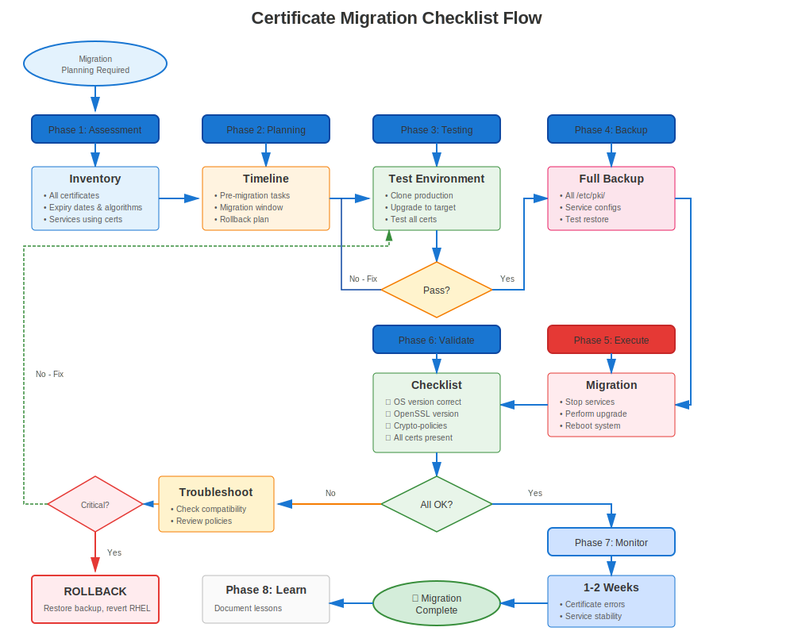

# Chapter 34: RHEL Migration Planning & Preparation

> **Plan for Success:** RHEL migrations require careful certificate planning. Learn how to audit, prepare, and plan certificate migration to avoid outages.

---

## 34.1 Why Certificate Planning Matters



**Without Planning:**
```
❌ Upgrade RHEL → Certificates fail validation
❌ Services won't start
❌ Production outage
❌ Rollback required
❌ Failed migration
```

**With Planning:**
```
✅ Pre-audit identifies issues
✅ Certificates prepared in advance
✅ Test migration successful
✅ Production migration smooth
✅ No certificate-related outages
```

---

## 34.2 Pre-Migration Certificate Audit

### Complete Certificate Inventory

```bash
#!/bin/bash
# pre-migration-cert-audit.sh
# Complete certificate audit before RHEL migration

echo "=== Pre-Migration Certificate Audit ==="
echo "System: $(hostname)"
echo "Current RHEL: $(cat /etc/redhat-release)"
echo "Date: $(date)"
echo ""

# Find all certificates
echo "=== Certificate Inventory ==="
find /etc/pki/tls/certs/ /etc/httpd/ /etc/nginx/ /etc/postfix/ /etc/openldap/ \
  -name "*.crt" -o -name "*.pem" 2>/dev/null | \
  while read cert; do
    if openssl x509 -in "$cert" -noout 2>/dev/null; then
      echo "Certificate: $cert"
      echo "  Subject: $(openssl x509 -in "$cert" -noout -subject)"
      echo "  Issuer: $(openssl x509 -in "$cert" -noout -issuer)"
      echo "  Expires: $(openssl x509 -in "$cert" -noout -enddate | cut -d= -f2)"

      # Check signature algorithm
      SIG_ALG=$(openssl x509 -in "$cert" -noout -text | grep "Signature Algorithm" | head -2)
      echo "  Signature: $SIG_ALG"

      # Check key size
      KEY_SIZE=$(openssl x509 -in "$cert" -noout -text | grep "Public-Key" | grep -oP '\d+')
      echo "  Key Size: $KEY_SIZE bits"

      # Flag issues
      if echo "$SIG_ALG" | grep -qi "sha1"; then
        echo "  ⚠️ WARNING: SHA-1 signature (will fail on RHEL 9+)"
      fi

      if [ "$KEY_SIZE" -lt 2048 ]; then
        echo "  ⚠️ WARNING: Key < 2048 bits (may fail on RHEL 8+)"
      fi

      if ! openssl x509 -in "$cert" -noout -ext subjectAltName 2>/dev/null | grep -q "DNS:"; then
        echo "  ⚠️ WARNING: Certificat missing SAN"
      fi

      # Check expiration
      if ! openssl x509 -in "$cert" -noout -checkend $((86400*90)); then
        echo "  ⚠️ WARNING: Expires within 90 days"
      fi

      echo ""
    fi
  done

# certmonger tracking
echo "=== certmonger Tracked Certificates ==="
if command -v getcert &>/dev/null; then
  sudo getcert list | grep -E "(Request ID|certificate:|status:)"
else
  echo "certmonger not installed"
fi

# Custom CAs
echo ""
echo "=== Custom CAs in Trust Store ==="
ls -la /etc/pki/ca-trust/source/anchors/

# Service configurations
echo ""
echo "=== Service Certificate Configurations ==="
echo "Apache:"
grep -h "SSLCertificate" /etc/httpd/conf.d/*.conf 2>/dev/null | grep -v "^#"

echo ""
echo "NGINX:"
grep -rh "ssl_certificate" /etc/nginx/ 2>/dev/null | grep -v "^#"

echo ""
echo "Postfix:"
sudo postconf | grep -E "smtpd_tls_cert|smtp_tls_cert"

echo ""
echo "=== Audit Complete ==="
echo "Save this output for migration reference!"
```

---

## 34.3 Certificate Issues to Fix Before Migration

### Critical Pre-Migration Fixes

**Fix 1: SHA-1 Signatures (RHEL 8→9)**
```bash
# Find SHA-1 signed certificates
for cert in /etc/pki/tls/certs/*.crt; do
  if openssl x509 -in "$cert" -noout -text 2>/dev/null | \
     grep -qi "Signature Algorithm.*sha1"; then
    echo "⚠️ SHA-1: $cert"
  fi
done

# Action: Reissue ALL SHA-1 certificates before migrating to RHEL 9
```

**Fix 2: Small Keys (< 2048 bits)**
```bash
# Find small keys
for cert in /etc/pki/tls/certs/*.crt; do
  SIZE=$(openssl x509 -in "$cert" -noout -text 2>/dev/null | \
         grep "Public-Key" | grep -oP '\d+')
  if [ "$SIZE" -lt 2048 ] 2>/dev/null; then
    echo "⚠️ Small key ($SIZE): $cert"
  fi
done

# Action: Reissue with 2048+ bit keys
```

**Fix 3: Missing SANs**
```bash
# Find certificates without SANs
for cert in /etc/pki/tls/certs/*.crt; do
  if ! openssl x509 -in "$cert" -noout -ext subjectAltName 2>/dev/null | grep -q "DNS:"; then
    echo "⚠️ No SANs: $cert"
  fi
done

# Action: Reissue with proper SANs (required for modern browsers)
```

**Fix 4: Expiring Soon**
```bash
# Find certificates expiring within migration window
for cert in /etc/pki/tls/certs/*.crt; do
  if ! openssl x509 -in "$cert" -noout -checkend $((86400*90)) 2>/dev/null; then
    echo "⚠️ Expiring soon: $cert"
    openssl x509 -in "$cert" -noout -enddate
  fi
done

# Action: Renew before migration to avoid mid-migration expiration
```

---

## 34.4 Backup Strategy

### What to Backup

```bash
#============================================#
# PRE-MIGRATION CERTIFICATE BACKUP
#============================================#

BACKUP_DIR="/var/backups/pre-migration-$(date +%Y%m%d)"
mkdir -p "$BACKUP_DIR"

# Backup certificates and keys
sudo tar czf "$BACKUP_DIR/certificates.tar.gz" \
  /etc/pki/tls/ \
  /etc/pki/ca-trust/source/anchors/ \
  /etc/pki/nssdb/

# Backup service configurations
sudo tar czf "$BACKUP_DIR/service-configs.tar.gz" \
  /etc/httpd/conf.d/*.conf \
  /etc/nginx/nginx.conf \
  /etc/nginx/conf.d/ \
  /etc/postfix/main.cf \
  /etc/openldap/ \
  /var/lib/pgsql/data/postgresql.conf \
  /var/lib/pgsql/data/pg_hba.conf \
  2>/dev/null

# Backup certmonger database
sudo tar czf "$BACKUP_DIR/certmonger.tar.gz" \
  /var/lib/certmonger/

# Save certmonger list
sudo getcert list > "$BACKUP_DIR/certmonger-list.txt" 2>/dev/null

# Save crypto-policy (RHEL 8+)
update-crypto-policies --show > "$BACKUP_DIR/crypto-policy.txt" 2>/dev/null

# Create inventory CSV
./pre-migration-cert-audit.sh > "$BACKUP_DIR/certificate-inventory.txt"

# Set permissions
sudo chmod 700 "$BACKUP_DIR"

echo "✅ Backup complete: $BACKUP_DIR"
ls -lh "$BACKUP_DIR"
```

---

## 34.5 Testing Plan

### Test Environment Setup

```markdown
## Migration Testing Checklist

### Test Environment
- [ ] Clone production to test VM/container
- [ ] Same RHEL version as production
- [ ] Same certificates (copies, not originals!)
- [ ] Same service configurations
- [ ] Network isolated from production

### Test Migration
- [ ] Run migration on test system
- [ ] Verify all services start
- [ ] Test certificate validation
- [ ] Check crypto-policy (RHEL 7→8/9)
- [ ] Test client connections
- [ ] Verify certmonger tracking (if used)
- [ ] Document any issues

### Issue Resolution
- [ ] Fix issues found in test
- [ ] Update migration plan
- [ ] Re-test
- [ ] Document workarounds

### Production Readiness
- [ ] Test migration successful
- [ ] Issues documented and resolved
- [ ] Rollback plan ready
- [ ] Team trained
- [ ] Maintenance window scheduled
```

---

## 34.6 Migration Timeline

### Sample Migration Schedule

```
Week 1-2: Planning & Audit
├─ Complete certificate inventory
├─ Identify issues (SHA-1, small keys, etc.)
├─ Plan remediation
└─ Set up test environment

Week 3-4: Remediation
├─ Reissue problematic certificates
├─ Update configurations
├─ Test in current environment
└─ Verify automation works

Week 5-6: Testing
├─ Clone production to test
├─ Perform test migration
├─ Validate certificates post-migration
├─ Document issues and fixes
└─ Update migration runbook

Week 7: Pre-Migration Prep
├─ Final certificate audit
├─ Renew expiring certificates
├─ Complete backups
├─ Brief team
└─ Verify rollback plan

Week 8: Migration
├─ Maintenance window
├─ Execute migration
├─ Validate certificates
├─ Monitor for 24-48 hours
└─ Document lessons learned
```

---

## 34.7 Rollback Planning

### Certificate Rollback Procedure

```bash
#============================================#
# CERTIFICATE ROLLBACK PLAN
#============================================#

# If migration fails due to certificate issues:

# Step 1: RHEL rollback (using leapp or snapshots)
# See RHEL migration documentation

# Step 2: Restore certificates (if needed)
sudo tar xzf /var/backups/pre-migration-YYYYMMDD/certificates.tar.gz -C /

# Step 3: Restore service configs
sudo tar xzf /var/backups/pre-migration-YYYYMMDD/service-configs.tar.gz -C /

# Step 4: Restore certmonger
sudo tar xzf /var/backups/pre-migration-YYYYMMDD/certmonger.tar.gz -C /

# Step 5: Restart services
sudo systemctl restart httpd nginx postfix slapd

# Step 6: Verify
curl -v https://localhost/
sudo getcert list
```

---

## 34.8 Communication Plan

### Stakeholder Communication Template

```markdown
## RHEL Migration - Certificate Impact Assessment

### Migration Details
- **From:** RHEL X.Y
- **To:** RHEL X.Y
- **Date:** YYYY-MM-DD
- **Window:** XX:00 - XX:00 UTC

### Certificate Impact Analysis
- **Total Certificates:** XX
- **Certificates Requiring Action:** XX
- **Services Affected:** Apache, NGINX, Postfix, LDAP, etc.

### Pre-Migration Actions Required
- [ ] Reissue XX SHA-1 certificates
- [ ] Renew XX expiring certificates
- [ ] Update XX service configurations
- [ ] Test crypto-policy compatibility (RHEL 8+)

### During Migration
- **Expected Downtime:** X hours
- **Certificate Validation:** Post-migration
- **Rollback Plan:** Available if needed

### Post-Migration Validation
- [ ] All services start successfully
- [ ] Certificate validation working
- [ ] crypto-policy applied (RHEL 8+)
- [ ] certmonger tracking maintained
- [ ] Client connections successful

### Risk Mitigation
- Full backups completed
- Test migration successful
- Rollback procedure documented
- Team on standby

### Contact
- **Migration Lead:** Name <email>
- **Escalation:** Manager <email>
```

---

## 34.9 Migration Checklist

### Complete Pre-Migration Checklist

```markdown
## Certificate Migration Readiness Checklist

### Audit & Inventory (Week 1-3)
- [ ] Complete certificate inventory
- [ ] Document all certificate locations
- [ ] Identify all services using certificates
- [ ] Map certificate to service dependencies
- [ ] Document custom CAs in use

### Issue Identification (Week 2-4)
- [ ] Identify SHA-1 signed certificates
- [ ] Identify small keys (< 2048 bits)
- [ ] Identify certificates without SANs
- [ ] Identify expiring certificates (< 180 days)
- [ ] Identify hard-coded TLS configs (vs crypto-policy)

### Remediation (Week 3-6)
- [ ] Reissue all SHA-1 certificates
- [ ] Reissue small key certificates
- [ ] Add SANs to all certificates
- [ ] Renew expiring certificates
- [ ] Remove hard-coded TLS configs (prepare for crypto-policy)

### Testing (Week 5-7)
- [ ] Set up test environment
- [ ] Clone production certificates to test
- [ ] Perform test migration
- [ ] Validate all services start
- [ ] Test client connections
- [ ] Test crypto-policy (RHEL 7→8/9)
- [ ] Document issues found
- [ ] Resolve issues in test
- [ ] Re-test until clean

### Backup (Week 7)
- [ ] Full system backup
- [ ] Certificate-specific backup
- [ ] Service configuration backup
- [ ] certmonger database backup
- [ ] Test restore procedure

### Documentation (Week 7)
- [ ] Migration runbook complete
- [ ] Rollback procedure documented
- [ ] Issue workarounds documented
- [ ] Team briefed
- [ ] Stakeholders notified

### Final Prep (Day before)
- [ ] Verify backups
- [ ] Verify test environment
- [ ] Review runbook
- [ ] Confirm maintenance window
- [ ] Team roles assigned
```

---

## 34.10 Key Takeaways

1. **Plan ahead** - Start 6-8 weeks before migration
2. **Audit thoroughly** - Know every certificate
3. **Fix issues early** - Don't wait until migration day
4. **Test extensively** - Multiple test runs
5. **Backup everything** - Certificates, configs, certmonger DB
6. **Document clearly** - Runbook, rollback, issues
7. **Communicate proactively** - Keep stakeholders informed

---

## Quick Reference Card

```
┌──────────────────────────────────────────────────────────────┐
│ MIGRATION PLANNING QUICK REFERENCE                           │
├──────────────────────────────────────────────────────────────┤
│ Timeline:     6-8 weeks before migration                     │
│                                                              │
│ Pre-audit:    Find all certificates                          │
│               Check signatures (SHA-1 → SHA-256)             │
│               Check key sizes (< 2048 → 2048+)               │
│               Check SANs (missing → add)                     │
│               Check expiration (< 180 days → renew)          │
│                                                              │
│ Backup:       tar czf certs.tar.gz /etc/pki/tls/             │
│               getcert list > certmonger-list.txt             │
│               update-crypto-policies --show > policy.txt     │
│                                                              │
│ Test:         Clone to test environment                      │
│               Perform test migration                         │
│               Validate certificates work                     │
│               Document and fix issues                        │
└──────────────────────────────────────────────────────────────┘

⚠️ SHA-1 certificates WILL FAIL on RHEL 9+
⚠️ crypto-policies introduced in RHEL 8
✅ Test multiple times before production
```
---

**Chapter Navigation**

| [← Previous: Chapter 33 - Emergency Procedures](../part-05-troubleshooting/33-emergency-procedures.md) | [Next: Chapter 35 - RHEL 7→8 Migration →](35-rhel7-to-8.md) |
|:---|---:|
