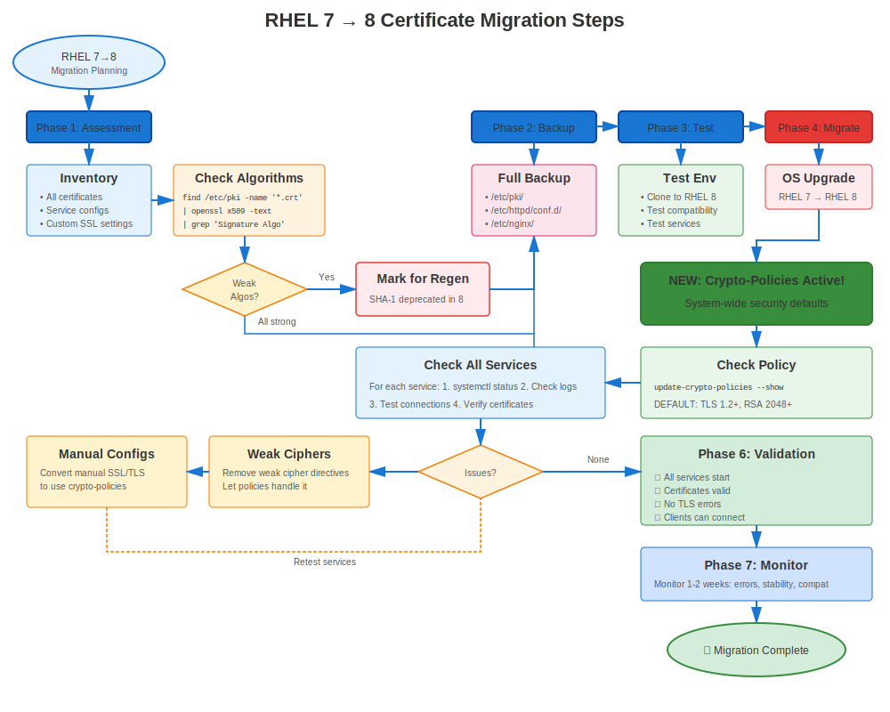

# Chapter 35: RHEL 7→8 Migration

> **Big Jump:** Migrating from RHEL 7 to RHEL 8 introduces crypto-policies - a revolutionary change in certificate management. Plan carefully!

---

## 35.1 Certificate Impact: MODERATE-HIGH



### What Changes

| Feature | RHEL 7 | RHEL 8 | Impact |
|---------|--------|--------|--------|
| **OpenSSL** | 1.0.2k | 1.1.1k | Moderate |
| **TLS Versions** | 1.0/1.1/1.2 | 1.2/1.3 (DEFAULT) | **HIGH** |
| **Crypto-Policies** | None | **NEW!** | **HIGH** |
| **Default Ciphers** | Mixed | Stricter | Moderate |
| **certmonger** | Basic | Enhanced | Low |
| **Management** | Manual | Automated (crypto-policies) | **HIGH** |

**Key Change:** **crypto-policies** revolutionizes TLS management!

---

## 35.2 Pre-Migration Preparation

### Certificate-Specific Pre-Migration Tasks

```bash
#============================================#
# RHEL 7→8 CERTIFICATE PREPARATION
#============================================#

# Task 1: Audit all certificates (see Ch 34)
./pre-migration-cert-audit.sh > rhel7-cert-audit.txt

# Task 2: Check for TLS 1.0/1.1 dependencies
# Review service configs
grep -r "TLSv1\|TLSv1.1" /etc/httpd/ /etc/nginx/ /etc/postfix/

# Task 3: Identify manual cipher configurations
# These will be overridden by crypto-policies!
grep -r "SSLCipherSuite\|ssl_ciphers\|smtp.*ciphers" /etc/httpd/ /etc/nginx/ /etc/postfix/

# Task 4: Test TLS 1.2 compatibility
# Ensure all clients support TLS 1.2+

# Task 5: Backup everything
sudo tar czf rhel7-complete-backup-$(date +%Y%m%d).tar.gz \
  /etc/pki/ \
  /etc/httpd/ \
  /etc/nginx/ \
  /etc/postfix/ \
  /var/lib/certmonger/
```

---

## 35.3 Migration Using leapp

### The leapp Utility

**IMPORTANT:** Use `leapp` for RHEL 7→8 migration (NOT `redhat-upgrade-tool`!)

**leapp** is Red Hat's supported upgrade utility for RHEL 7→8 and 8→9.

```bash
#============================================#
# RHEL 7→8 MIGRATION WITH LEAPP
#============================================#

# Prerequisites
# - RHEL 7.9 (latest)
# - Valid Red Hat subscription
# - All updates applied
# - Backups complete

# Step 1: Update RHEL 7 to latest
sudo yum update -y
sudo reboot

# Step 2: Install leapp
sudo yum install leapp-upgrade -y

# Step 3: Run pre-upgrade check
sudo leapp preupgrade

# Review report:
cat /var/log/leapp/leapp-report.txt

# Common certificate-related inhibitors:
# - SHA-1 certificates
# - Weak cipher configurations
# - Unsupported packages

# Step 4: Fix issues identified
# Reissue SHA-1 certificates
# Update configurations

# Step 5: Perform upgrade
sudo leapp upgrade

# System downloads RHEL 8, prepares upgrade
# Reboots automatically

# Step 6: After reboot, system is RHEL 8!
cat /etc/redhat-release
# Red Hat Enterprise Linux release 8.X (Ootpa)
```

---

## 35.4 Post-Migration Certificate Validation

### Immediate Post-Migration Checks

```bash
#============================================#
# POST-MIGRATION CERTIFICATE VALIDATION
#============================================#

# Check 1: Verify RHEL 8
cat /etc/redhat-release
openssl version
# Should show: OpenSSL 1.1.1k

# Check 2: Verify crypto-policy
update-crypto-policies --show
# DEFAULT (should be set automatically)

# Check 3: Check certificate files still present
ls -la /etc/pki/tls/certs/
ls -la /etc/pki/tls/private/

# Check 4: Verify permissions unchanged
ls -l /etc/pki/tls/private/*.key
# Should still be 600

# Check 5: Check custom CAs
ls -la /etc/pki/ca-trust/source/anchors/

# Check 6: Update trust store (just in case)
sudo update-ca-trust

# Check 7: Verify certmonger tracking
sudo getcert list
# All certificates should still be tracked

# Check 8: Check service configurations
# crypto-policies may have updated them
cat /etc/crypto-policies/back-ends/httpd.config
```

---

## 35.5 Service Restart and Testing

### Restart All Services

```bash
#============================================#
# RESTART SERVICES AFTER MIGRATION
#============================================#

# Restart certificate-using services
sudo systemctl restart httpd
sudo systemctl restart nginx
sudo systemctl restart postfix
sudo systemctl restart slapd
sudo systemctl restart postgresql
sudo systemctl restart mariadb

# Check service status
systemctl status httpd nginx postfix | grep "Active:"

# Test each service
curl -v https://localhost/                             # Apache/NGINX
openssl s_client -connect localhost:443                # HTTPS
openssl s_client -starttls smtp -connect localhost:25  # Postfix
openssl s_client -connect localhost:636                # LDAPS
```

---

## 35.6 Common RHEL 7→8 Certificate Issues

### Issue 1: TLS 1.0/1.1 Clients Can't Connect

**Symptom:** Old clients fail after migration

**Cause:** DEFAULT crypto-policy blocks TLS 1.0/1.1

**Quick Fix (Temporary):**
```bash
sudo update-crypto-policies --set LEGACY
sudo systemctl restart httpd nginx postfix
```

**Proper Fix:**
```bash
# Update clients to support TLS 1.2+
# Or create custom policy module
```

### Issue 2: Hard-Coded Ciphers Conflict with crypto-policy

**Symptom:** Service won't start or behaves unexpectedly

**Cause:** Old config has SSLCipherSuite that conflicts

**Fix:**
```bash
# Remove hard-coded cipher configs
# Let crypto-policy handle it

# Apache: Remove from ssl.conf
# SSLProtocol ...
# SSLCipherSuite ...

# NGINX: Remove from nginx.conf
# ssl_protocols ...
# ssl_ciphers ...

# Postfix: Remove from main.cf
# smtpd_tls_protocols ...
# smtpd_tls_mandatory_ciphers ...
```

### Issue 3: certmonger Tracking Lost

**Symptom:** `getcert list` shows empty or missing certificates

**Rare but possible if migration had issues**

**Fix:**
```bash
# Restore certmonger database from backup
sudo systemctl stop certmonger
sudo tar xzf /var/backups/pre-migration-*/certmonger.tar.gz -C /
sudo systemctl start certmonger

# Verify
sudo getcert list
```

---

## 35.7 Crypto-Policy Transition

### Adopting Crypto-Policies

**RHEL 7:** No crypto-policies, manual config per service
**RHEL 8:** crypto-policies manage TLS system-wide

```bash
#============================================#
# TRANSITION TO CRYPTO-POLICIES
#============================================#

# After migration to RHEL 8:

# Step 1: Check current policy
update-crypto-policies --show
# DEFAULT

# Step 2: Remove manual TLS configs from services
# (Let crypto-policy handle it)

# Step 3: Test with DEFAULT policy
sudo systemctl restart httpd nginx postfix

# Step 4: If old clients need TLS 1.0/1.1 (temporary!)
sudo update-crypto-policies --set LEGACY

# Step 5: Plan to move back to DEFAULT
# Update clients, then:
sudo update-crypto-policies --set DEFAULT
```

---

## 35.8 Migration Runbook Example

### Step-by-Step Execution

```markdown
## RHEL 7→8 Migration Runbook - Certificate Section

### Pre-Migration (T-24 hours)
- [ ] Verify backups complete and tested
- [ ] Verify all certificates valid > 90 days
- [ ] No SHA-1 certificates remaining
- [ ] Test environment migration successful

### Migration Window Start (T=0)
- [ ] Announce maintenance window
- [ ] Take final backup
- [ ] Run: `sudo leapp upgrade`
- [ ] System reboots automatically

### Post-Reboot (T+30 min)
- [ ] Verify RHEL 8: `cat /etc/redhat-release`
- [ ] Check crypto-policy: `update-crypto-policies --show`
- [ ] Verify certificates present: `ls /etc/pki/tls/certs/`
- [ ] Check certmonger: `sudo getcert list`

### Service Validation (T+45 min)
- [ ] Restart all services
- [ ] Test Apache: `curl -v https://localhost/`
- [ ] Test NGINX: `curl -v https://localhost:8443/`
- [ ] Test Postfix: `openssl s_client -starttls smtp -connect localhost:25`
- [ ] Test LDAP: `ldapsearch -H ldaps://localhost:636 -x -b ""`
- [ ] Test databases (if applicable)

### Client Testing (T+60 min)
- [ ] Test from Windows clients
- [ ] Test from Linux clients
- [ ] Test from application clients
- [ ] Verify no TLS errors

### Monitoring (T+2 hours to T+48 hours)
- [ ] Monitor logs for certificate errors
- [ ] Monitor service health
- [ ] Check certmonger renewals
- [ ] Verify no crypto-policy issues

### Completion
- [ ] Document any issues encountered
- [ ] Update runbook with lessons learned
- [ ] Close maintenance window
- [ ] Notify stakeholders of successful migration
```

---

## 35.9 Key Takeaways

1. **Use leapp utility** for RHEL 7→8 migration (supported method)
2. **crypto-policies are NEW** in RHEL 8 - Major change!
3. **TLS 1.0/1.1 disabled by default** - Test client compatibility
4. **Remove manual TLS configs** - Let crypto-policy manage
5. **Test extensively** before production migration
6. **LEGACY policy available** for compatibility (temporary!)
7. **certmonger tracking should survive** migration

---

## Quick Reference Card

```
┌──────────────────────────────────────────────────────────────┐
│ RHEL 7→8 MIGRATION CERTIFICATE CHECKLIST                     │
├──────────────────────────────────────────────────────────────┤
│ Before:       Audit all certificates                         │
│               Reissue SHA-1 certificates                     │
│               Test TLS 1.2 compatibility                     │
│               Backup everything                              │
│                                                              │
│ Migration:    Use leapp upgrade (NOT redhat-upgrade-tool!)   │
│               System reboots automatically                   │
│                                                              │
│ After:        Verify RHEL 8                                  │
│               Check crypto-policy (DEFAULT)                  │
│               Restart all services                           │
│               Test client connections                        │
│               Monitor for 48 hours                           │
│                                                              │
│ New Feature:  crypto-policies (system-wide TLS control)      │
│ Blocked:      TLS 1.0/1.1 (in DEFAULT policy)                │
│ Fallback:     LEGACY policy (if needed, temporary!)          │
└──────────────────────────────────────────────────────────────┘

✅ Use leapp (officially supported)
⚠️ Major change: crypto-policies introduced
⚠️ Test client TLS 1.2 support before migration
```

---

## 🧪 Hands-On Lab

**Lab 17: RHEL 7→8 Migration**

Migrate certificates during OS upgrade to RHEL 8

- 📁 **Location:** `labs/en_US/17-rhel7to8-migration/`
- ⏱️ **Time:** 40-50 minutes
- 🎯 **Level:** Advanced

---

**Chapter Navigation**

| [← Previous: Chapter 34 - RHEL Migration Planning & Preparation](34-migration-planning.md) | [Next: Chapter 36 - RHEL 8→9 Migration →](36-rhel8-to-9.md) |
|:---|---:|
