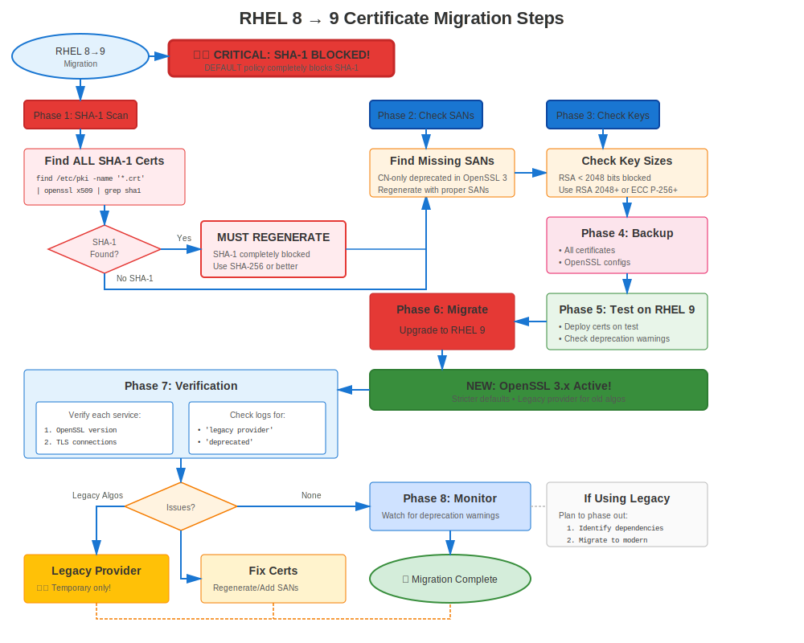

# Chapter 36: RHEL 8→9 Migration

> **OpenSSL 3.x Transition:** RHEL 8→9 brings OpenSSL 3.x with provider architecture and stricter validation. Plan carefully for this significant change.

---

## 36.1 Certificate Impact: HIGH



### What Changes

| Feature | RHEL 8 | RHEL 9 | Impact |
|---------|--------|--------|--------|
| **OpenSSL** | 1.1.1k | **3.5.5** | **HIGH** |
| **Architecture** | Traditional | **Provider-based** | **HIGH** |
| **TLS 1.0/1.1** | LEGACY policy | **Completely removed** | **HIGH** |
| **SHA-1** | Deprecated | **Blocked** | **HIGH** |
| **Validation** | Standard | **Stricter** | Moderate |
| **Crypto-Policies** | Basic | **Subpolicies** | Low |
| **certmonger** | Enhanced | **Still native for IPA/tracking** | Low |

**Key Change:** **OpenSSL 3.x** is a major architectural change!

---

## 36.2 Pre-Migration Requirements

### Critical Certificate Fixes

**Requirement 1: NO SHA-1 Signatures**
```bash
#============================================#
# CHECK FOR SHA-1 (WILL FAIL ON RHEL 9!)
#============================================#

# Find SHA-1 signed certificates
for cert in /etc/pki/tls/certs/*.crt; do
  SIG=$(openssl x509 -in "$cert" -noout -text 2>/dev/null | \
        grep "Signature Algorithm" | head -2)
  if echo "$SIG" | grep -qi "sha1"; then
    echo "🚨 CRITICAL: SHA-1 signature: $cert"
    echo "   $SIG"
    echo "   ⚠️ MUST reissue before RHEL 9 migration!"
  fi
done

# Action: Reissue ALL SHA-1 certificates before migration
# No exceptions - they WILL fail on RHEL 9
```

**Requirement 2: All Certificates Valid**
```bash
# Ensure no expired certificates
for cert in /etc/pki/tls/certs/*.crt; do
  if ! openssl x509 -in "$cert" -noout -checkend 0 2>/dev/null; then
    echo "❌ Expired: $cert"
  fi
done
```

**Requirement 3: Test Custom Applications**
```bash
# If you have custom applications using OpenSSL
# They may need updates for OpenSSL 3.x API
rpm -qa | grep -E "custom|local"

# Test these applications in RHEL 9 environment before migration
```

---

## 36.3 Migration Using leapp

### RHEL 8→9 Upgrade Process

```bash
#============================================#
# RHEL 8→9 MIGRATION WITH LEAPP
#============================================#

# Prerequisites
# - RHEL 8.10 (latest recommended)
# - Valid subscription
# - All updates applied
# - Backups complete
# - SHA-1 certificates reissued!

# Step 1: Update RHEL 8 fully
sudo dnf update -y
sudo reboot

# Step 2: Install leapp
sudo dnf install leapp-upgrade -y

# Step 3: Run pre-upgrade check
sudo leapp preupgrade

# Review report
cat /var/log/leapp/leapp-report.txt

# Certificate-related checks:
# - SHA-1 certificate warnings
# - OpenSSL compatibility
# - Custom app compatibility

# Step 4: Address inhibitors
# Fix any blocking issues

# Step 5: Perform upgrade
sudo leapp upgrade

# Downloads RHEL 9, prepares upgrade
# Reboots to perform upgrade
# Reboots again into RHEL 9

# Step 6: Verify RHEL 9
cat /etc/redhat-release
# Red Hat Enterprise Linux release 9.X (Plow)

openssl version
# OpenSSL 3.5.5
```

---

## 36.4 Post-Migration Validation

### Certificate-Specific Validation

```bash
#============================================#
# POST-MIGRATION CERTIFICATE VALIDATION (RHEL 9)
#============================================#

# Check 1: OpenSSL version
openssl version
# OpenSSL 3.5.5  ← Confirm

# Check 2: Check providers
openssl list -providers
# Should show: default, fips, legacy, base

# Check 3: Verify certificates still present
ls -la /etc/pki/tls/certs/
ls -la /etc/pki/tls/private/

# Check 4: Test certificate validation
for cert in /etc/pki/tls/certs/*.crt; do
  openssl verify "$cert" 2>&1 | grep -v "OK" && echo "Issue: $cert"
done

# Check 5: Verify crypto-policy
update-crypto-policies --show
# DEFAULT (should be maintained)

# Check 6: Test certificate operations
openssl x509 -in /etc/pki/tls/certs/server.crt -noout -text

# Check 7: Verify certmonger tracking
sudo getcert list
# All certificates should still be tracked

# Check 8: Check trust store
trust list | head -20
```

---

## 36.5 Service Validation

### Test All Services

```bash
#============================================#
# SERVICE VALIDATION POST-MIGRATION
#============================================#

# Restart services
sudo systemctl restart httpd nginx postfix slapd postgresql mariadb 2>/dev/null

# Test each service
echo "Testing Apache..."
curl -v https://localhost/ 2>&1 | grep -E "(SSL connection|subject:)"

echo "Testing with OpenSSL 3.x..."
openssl s_client -connect localhost:443 -tls1_3

echo "Testing Postfix..."
openssl s_client -starttls smtp -connect localhost:25 </dev/null

echo "Testing LDAPS..."
openssl s_client -connect localhost:636 </dev/null

# Check for provider errors
sudo journalctl --since "1 hour ago" | grep -i "provider\|unsupported"
```

---

## 36.6 Common RHEL 8→9 Issues

### Issue 1: SHA-1 Certificates Rejected

**Symptom:**
```
openssl verify server.crt
# error 3 at 0 depth lookup: CA md too weak
```

**Cause:** Certificate has SHA-1 signature (blocked on RHEL 9)

**Solution:**
```bash
# NO WORKAROUND - Must reissue
# This should have been done pre-migration!

# Emergency: Reissue immediately
openssl req -new -key server.key -out server.csr -sha256
# Submit to CA, install new certificate
```

### Issue 2: Legacy Algorithm Errors

**Symptom:**
```
openssl md5 file.txt
# Error: unsupported
```

**Cause:** MD5 and other legacy algorithms require explicit provider

**Solution:**
```bash
# Use legacy provider
openssl md5 -provider legacy file.txt

# Better: Update to use SHA-256
openssl sha256 file.txt
```

### Issue 3: Custom Application OpenSSL 3.x Incompatibility

**Symptom:** Custom application fails with OpenSSL errors

**Cause:** Application compiled against OpenSSL 1.1.1, API changed in 3.x

**Solution:**
```bash
# Recompile application against OpenSSL 3.x
# Or update application code for new API

# Temporary workaround (if available):
# Use compat library (if provided)
```

---

## 36.7 crypto-policy Considerations

### Crypto-Policy After Migration

```bash
#============================================#
# CRYPTO-POLICY POST-MIGRATION
#============================================#

# Check current policy (should be maintained)
update-crypto-policies --show

# RHEL 9 supports subpolicies!
# Example: Completely disable SHA-1
sudo update-crypto-policies --set DEFAULT:NO-SHA1

# List available modules
ls /usr/share/crypto-policies/policies/modules/

# Test policy
sudo systemctl restart httpd
curl -v https://localhost/
```

---

## 36.8 certmonger After Migration

### Verify certmonger Functionality

```bash
#============================================#
# CERTMONGER POST-MIGRATION
#============================================#

# Check certmonger status
systemctl status certmonger

# List tracked certificates
sudo getcert list

# Check for issues
sudo getcert list | grep "status:" | grep -v "MONITORING"

# If using FreeIPA, test connectivity
ipa ping

# Force test renewal
sudo ipa-getcert resubmit -f /etc/pki/tls/certs/test.crt

# RHEL 9 still uses certmonger for IPA, local CA, and tracking workflows
# Use certbot separately for public Let's Encrypt certificates
```

---

## 36.9 Migration Runbook

### Certificate-Focused Runbook

```markdown
## RHEL 8→9 Migration - Certificate Section

### Pre-Migration (T-24 hours)
- [ ] Verify NO SHA-1 certificates (critical!)
- [ ] All certificates valid > 90 days
- [ ] Backups complete and tested
- [ ] Test migration successful
- [ ] Custom apps tested on RHEL 9

### Migration Window Start (T=0)
- [ ] Final backup
- [ ] Run: `sudo leapp upgrade`
- [ ] System reboots (twice)

### Post-Reboot Validation (T+45 min)
- [ ] Verify RHEL 9: `cat /etc/redhat-release`
- [ ] Verify OpenSSL 3.5.5: `openssl version`
- [ ] Check providers: `openssl list -providers`
- [ ] Verify certificates: `ls /etc/pki/tls/certs/`
- [ ] Check crypto-policy: `update-crypto-policies --show`
- [ ] Verify certmonger: `sudo getcert list`

### Service Restart (T+60 min)
- [ ] Restart all certificate-using services
- [ ] Test Apache/NGINX
- [ ] Test Postfix
- [ ] Test LDAP
- [ ] Test databases

### Certificate Validation (T+90 min)
- [ ] No SHA-1 rejections
- [ ] All certificates validate: `openssl verify`
- [ ] TLS 1.3 working: `openssl s_client -tls1_3`
- [ ] No provider errors in logs
- [ ] certmonger status all MONITORING

### Client Testing (T+2 hours)
- [ ] Test from all client types
- [ ] Verify no compatibility issues
- [ ] Check application functionality

### Post-Migration (24-48 hours)
- [ ] Monitor for OpenSSL 3.x issues
- [ ] Check certmonger renewals
- [ ] Monitor service logs
- [ ] Document any issues
```

---

## 36.10 Key Takeaways

1. **OpenSSL 3.x is major change** - Provider architecture is new
2. **SHA-1 MUST be eliminated** before migration - No exceptions!
3. **Use leapp for migration** (officially supported)
4. **Test custom applications** on RHEL 9 first
5. **Stricter validation** catches more issues (good for security!)
6. **certmonger remains the native tracker** for IPA and managed renewals on RHEL 9
7. **Subpolicies available** for fine-tuning

---

## Quick Reference Card

```
┌──────────────────────────────────────────────────────────────┐
│ RHEL 8→9 MIGRATION CERTIFICATE CHECKLIST                     │
├──────────────────────────────────────────────────────────────┤
│ CRITICAL:   NO SHA-1 certificates! (will be rejected)        │
│             Reissue all SHA-1 certs before migration         │
│                                                              │
│ Before:     Verify NO SHA-1 signatures                       │
│             Test custom apps on RHEL 9                       │
│             Backup everything                                │
│                                                              │
│ Migration:  Use leapp upgrade                                │
│             System reboots twice                             │
│                                                              │
│ After:      Verify OpenSSL 3.5.5                             │
│             Check providers: openssl list -providers         │
│             Test legacy algorithms need -provider legacy     │
│             Restart all services                             │
│             Verify certmonger tracking maintained            │
│                                                              │
│ New:        Provider architecture                            │
│             Subpolicies (DEFAULT:NO-SHA1)                    │
│             certmonger tracking still intact                 │
└──────────────────────────────────────────────────────────────┘

🚨 SHA-1 is BLOCKED - reissue before migration!
✅ OpenSSL 3.x brings stricter security
✅ Use certmonger for IPA/tracked renewals; certbot for public ACME
```

---

## 🧪 Hands-On Lab

**Lab 18: RHEL 8→9 Migration**

Handle OpenSSL 3.x and stricter security in RHEL 9

- 📁 **Location:** `labs/en_US/18-rhel8to9-migration/`
- ⏱️ **Time:** 40-50 minutes
- 🎯 **Level:** Advanced

---

**Chapter Navigation**

| [← Previous: Chapter 35 - RHEL 7→8 Migration](35-rhel7-to-8.md) | [Next: Chapter 37 - Migration Troubleshooting & Recovery →](37-migration-troubleshooting.md) |
|:---|---:|
