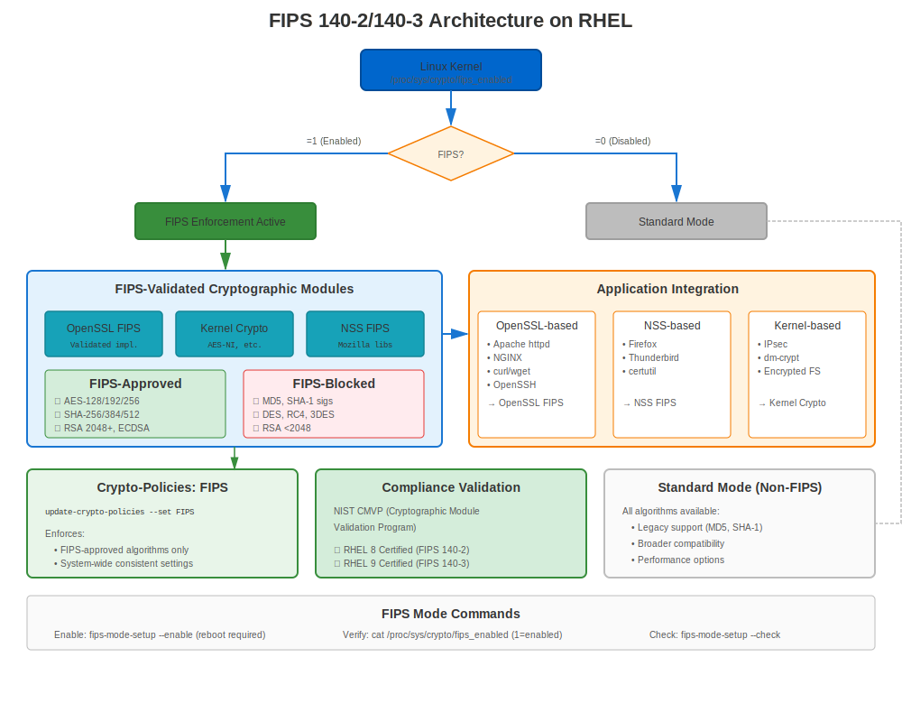
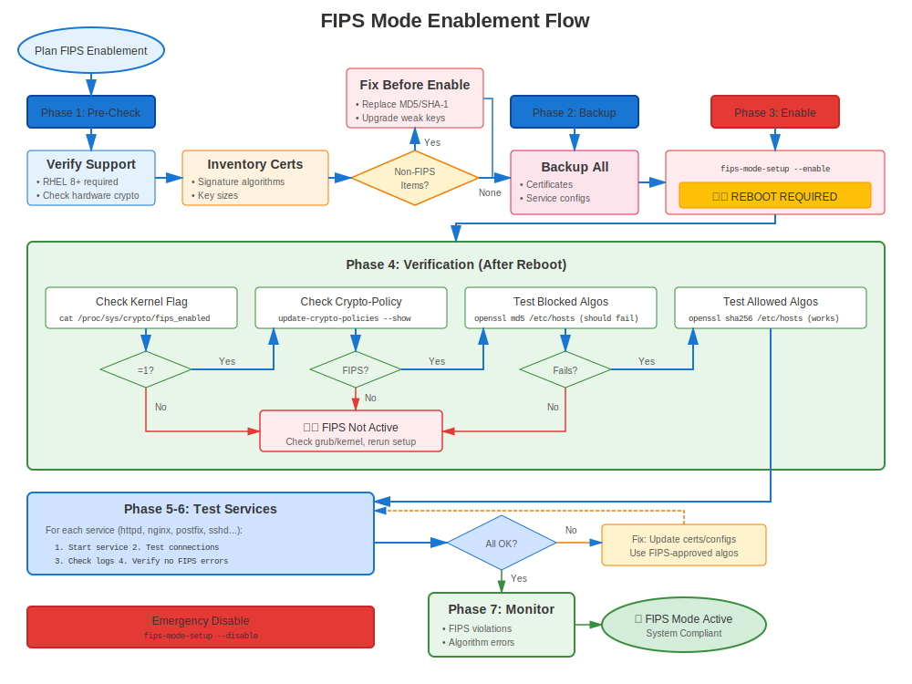

# Chapter 38: FIPS Mode Complete Guide

> **Federal Compliance:** FIPS 140-2/140-3 compliance is required for US federal systems and many regulated industries. Learn how to enable and manage FIPS mode on RHEL.

---

## 38.1 What is FIPS?





**FIPS** = Federal Information Processing Standards

**FIPS 140-2/140-3** = Cryptographic Module Validation Program

**Purpose:**
- ✅ Validate cryptographic modules meet security requirements
- ✅ Ensure proper implementation of approved algorithms
- ✅ Required for US federal government systems
- ✅ Often required for: Banking, healthcare, defense contractors

### FIPS Validation Status by RHEL Version

| RHEL Version | FIPS Status | Standard | Notes |
|--------------|-------------|----------|-------|
| **RHEL 7** | Validated | **FIPS 140-2** | OpenSSL 1.0.2 modules validated |
| **RHEL 8** | Validated | **FIPS 140-2** | OpenSSL 1.1.1, NSS, libgcrypt validated |
| **RHEL 9** | Validated | **FIPS 140-2** | OpenSSL 3.x provider, transition to 140-3 in progress |
| **RHEL 10** | In process | **FIPS 140-2/140-3** | Transition ongoing, check current status |

> **Important:** As of 2025, RHEL 9 uses FIPS 140-2 validated modules. The transition to FIPS 140-3 is in progress but not yet complete. Always verify current validation status at https://csrc.nist.gov/projects/cryptographic-module-validation-program

---

## 38.2 Enabling FIPS Mode

### Installation-Time FIPS (Recommended)

**Best Practice:** Enable FIPS during RHEL installation

```bash
# At installation boot prompt, add:
fips=1

# System installs in FIPS mode from the start
# All cryptographic operations are FIPS-compliant from boot
```

**Why Installation-Time is Better:**
- Kernel properly configured
- All packages installed in FIPS mode
- No post-install migration needed
- Cleaner FIPS state

### Post-Installation FIPS (RHEL 8/9/10)

```bash
#============================================#
# ENABLE FIPS MODE POST-INSTALLATION
#============================================#

# Check current FIPS status
fips-mode-setup --check
# FIPS mode is disabled.

# Enable FIPS mode
sudo fips-mode-setup --enable

# Output shows what will change:
# - Kernel boot parameters
# - Crypto policy
# - System reconfiguration

# MUST REBOOT!
sudo reboot

# After reboot, verify
fips-mode-setup --check
# FIPS mode is enabled.

# Verify crypto-policy
update-crypto-policies --show
# FIPS

# Verify FIPS provider loaded (RHEL 9+)
openssl list -providers | grep fips
#   fips
#     name: OpenSSL FIPS Provider
#     version: 3.5.5
#     status: active
```

---

## 38.3 FIPS Requirements for Certificates

### Approved Algorithms

**FIPS-Approved for Certificates:**
```
✅ RSA: 2048, 3072, 4096 bits
✅ ECC: P-256 (secp256r1), P-384 (secp384r1), P-521 (secp521r1)
✅ Signatures: SHA-256, SHA-384, SHA-512
✅ TLS: 1.2, 1.3 only
```

**Blocked in FIPS Mode:**
```
❌ RSA < 2048 bits
❌ MD5, SHA-1
❌ TLS 1.0, 1.1
❌ 3DES, RC4, DES
❌ DSA keys
❌ Non-approved elliptic curves
```

---

## 38.4 Generating FIPS-Compliant Certificates

### FIPS-Compliant Key Generation

```bash
#============================================#
# GENERATE FIPS-COMPLIANT KEYS
#============================================#

# Verify FIPS mode enabled
fips-mode-setup --check

# Generate RSA 2048 key (FIPS-compliant)
openssl genpkey -algorithm RSA -out fips-server.key \
  -pkeyopt rsa_keygen_bits:2048

# RSA 3072 (stronger, still FIPS-compliant)
openssl genpkey -algorithm RSA -out fips-server.key \
  -pkeyopt rsa_keygen_bits:3072

# EC P-256 (FIPS-approved curve)
openssl genpkey -algorithm EC -out fips-ec.key \
  -pkeyopt ec_paramgen_curve:P-256

# EC P-384 (stronger, FIPS-approved)
openssl genpkey -algorithm EC -out fips-ec.key \
  -pkeyopt ec_paramgen_curve:P-384

# Verify key generated in FIPS mode
openssl pkey -in fips-server.key -check
```

### FIPS-Compliant CSR

```bash
#============================================#
# GENERATE FIPS-COMPLIANT CSR
#============================================#

# CSR with SHA-256 (FIPS-approved)
openssl req -new -key fips-server.key -out fips-server.csr \
  -sha256 \
  -subj "/C=US/O=Federal Agency/CN=secure.example.gov" \
  -addext "subjectAltName=DNS:secure.example.gov"

# SHA-384 (stronger, FIPS-approved)
openssl req -new -key fips-server.key -out fips-server.csr \
  -sha384 \
  -subj "/C=US/O=Federal Agency/CN=secure.example.gov"

# ❌ NEVER use SHA-1 or MD5 in FIPS mode
# They will be rejected!
```

---

## 38.5 FIPS Mode Verification

### Complete FIPS Verification

```bash
#============================================#
# VERIFY FIPS MODE IS ACTIVE
#============================================#

# Check 1: fips-mode-setup
fips-mode-setup --check
# FIPS mode is enabled.

# Check 2: Kernel parameter
cat /proc/cmdline | grep fips
# Should show: fips=1

# Check 3: Crypto-policy
update-crypto-policies --show
# FIPS

# Check 4: OpenSSL FIPS provider (RHEL 9+)
openssl list -providers
# Should show fips provider as active

# Check 5: Test FIPS-only operation
# Try non-FIPS algorithm (should fail)
echo "test" | openssl md5
# Error: disabled for FIPS  ← Good!

# Check 6: Verify certificate operations use FIPS
openssl version -a | grep FIPS
```

---

## 38.6 FIPS Crypto-Policy

### Understanding FIPS Policy

```bash
#============================================#
# FIPS CRYPTO-POLICY DETAILS
#============================================#

# Policy is automatically set to FIPS when FIPS mode enabled
update-crypto-policies --show
# FIPS

# What FIPS policy enforces:
cat /etc/crypto-policies/back-ends/opensslcnf.config

# Key settings:
# - TLS 1.2 minimum
# - Only FIPS-approved ciphers
# - Only FIPS-approved signature algorithms
# - Minimum 2048-bit keys
```

**Cannot change from FIPS policy while in FIPS mode!**

---

## 38.7 Services in FIPS Mode

### Apache in FIPS Mode

```bash
#============================================#
# APACHE IN FIPS MODE
#============================================#

# Apache automatically uses FIPS policy
# No manual configuration needed!

# Verify
sudo systemctl restart httpd

# Test
openssl s_client -connect localhost:443

# Should show:
# - TLS 1.2 or 1.3
# - FIPS-approved cipher
# - No weak algorithms

# View actual Apache FIPS config
cat /etc/crypto-policies/back-ends/httpd.config
```

### Other Services

**All services automatically comply with FIPS policy:**
- NGINX → Uses FIPS ciphers/protocols
- Postfix → FIPS-compliant TLS
- OpenSSH → FIPS algorithms only
- Databases → FIPS-approved SSL

---

## 38.8 Common FIPS Issues

### Issue 1: Non-FIPS Algorithm Attempted

**Symptom:**
```
Error: disabled for FIPS
```

**Examples:**
```bash
# MD5 (not FIPS-approved)
openssl md5 file.txt
# Error: digital envelope routines:EVP_DigestInit_ex:disabled for fips

# SHA-1 signature (not FIPS-approved for signing)
openssl dgst -sha1 -sign key.pem file.txt
# Error: disabled for fips
```

**Solution:**
```bash
# Use FIPS-approved algorithms
openssl sha256 file.txt  # Use SHA-256 instead of MD5
openssl dgst -sha256 -sign key.pem file.txt  # Use SHA-256 for signing
```

### Issue 2: Legacy Application Incompatible

**Symptom:** Application fails in FIPS mode

**Cause:** Application uses non-FIPS algorithms (MD5, SHA-1, weak ciphers)

**Solutions:**
```bash
# Solution 1: Update application to use FIPS algorithms

# Solution 2: If application can't be updated:
# May not be able to run in FIPS mode
# Consider if FIPS is actually required

# Solution 3: Container isolation (advanced)
# Run non-FIPS app in container without FIPS
```

---

## 38.9 Disabling FIPS Mode

### When and How to Disable

```bash
#============================================#
# DISABLE FIPS MODE (if needed)
#============================================#

# Check current status
fips-mode-setup --check

# Disable FIPS
sudo fips-mode-setup --disable

# MUST REBOOT
sudo reboot

# After reboot
fips-mode-setup --check
# FIPS mode is disabled.

# Crypto-policy reverts to DEFAULT
update-crypto-policies --show
# DEFAULT
```

**Note:** Disabling FIPS may have compliance implications!

---

## 38.10 Key Takeaways

1. **FIPS 140-2 is current standard** on RHEL (140-3 transition in progress)
2. **Enable at installation** for cleanest FIPS state
3. **Post-install enable requires reboot**
4. **Only FIPS-approved algorithms** allowed
5. **Crypto-policy automatically set to FIPS**
6. **Services automatically comply**
7. **Test applications** before enabling FIPS in production

---

## Quick Reference Card

```
┌──────────────────────────────────────────────────────────────┐
│ FIPS MODE QUICK REFERENCE                                    │
├──────────────────────────────────────────────────────────────┤
│ Status:       fips-mode-setup --check                        │
│ Enable:       sudo fips-mode-setup --enable && reboot        │
│ Disable:      sudo fips-mode-setup --disable && reboot       │
│                                                              │
│ Standard:     FIPS 140-2 (validated)                         │
│               FIPS 140-3 (transition in progress)            │
│                                                              │
│ Approved:     RSA 2048+, ECC P-256/384/521                   │
│               SHA-256/384/512                                │
│               TLS 1.2/1.3                                    │
│                                                              │
│ Blocked:      MD5, SHA-1, TLS 1.0/1.1                        │
│               RSA < 2048, 3DES, RC4                          │
│                                                              │
│ Policy:       Automatically set to FIPS                      │
│ Verify:       openssl list -providers | grep fips            │
└──────────────────────────────────────────────────────────────┘

⚠️ FIPS 140-2 is current (140-3 transition ongoing)
⚠️ Requires reboot to enable/disable
✅ All RHEL services automatically comply
```

---

## 🧪 Hands-On Lab

**Lab 19: FIPS Mode Configuration**

Enable and configure FIPS 140-2 compliance mode

- 📁 **Location:** `labs/en_US/19-fips-mode/`
- ⏱️ **Time:** 40-50 minutes
- 🎯 **Level:** Advanced

---

**Chapter Navigation**

| [← Previous: Chapter 37 - Migration Troubleshooting & Recovery](../part-06-migration/37-migration-troubleshooting.md) | [Next: Chapter 39 - FIPS-Compliant Certificates →](39-fips-certificates.md) |
|:---|---:|
