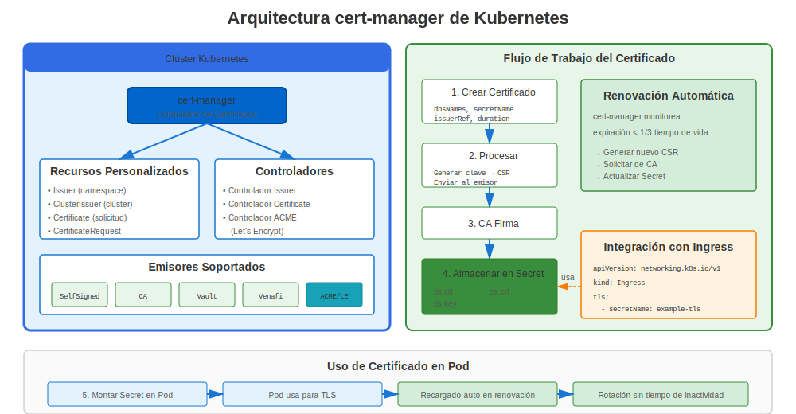
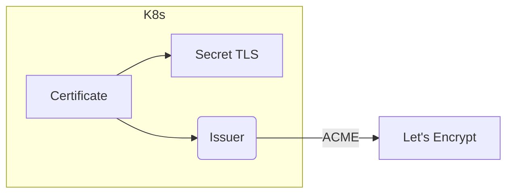

# Apéndice A: cert-manager de Kubernetes

`cert-manager` es un proyecto CNCF que automatiza la emisión de certificados dentro de clusters Kubernetes.

## 1. Arquitectura



* **Issuer / ClusterIssuer** – Define CA o servidor ACME.
* **Certificate** – Estado deseado para un cert (nombres DNS, duración).
* **Controller** – Reconcilia recursos, almacena secretos.



## 2. Instalación

```bash
kubectl apply -f https://github.com/cert-manager/cert-manager/releases/download/v1.14.1/cert-manager.yaml
```

## 3. Ejemplo: TLS Ingress

```yaml
apiVersion: cert-manager.io/v1
kind: ClusterIssuer
metadata:
  name: letsencrypt-prod
spec:
  acme:
    server: https://acme-v02.api.letsencrypt.org/directory
    email: admin@example.com
    privateKeySecretRef:
      name: le-key
    solvers:
    - http01:
        ingress:
          class: nginx
---
apiVersion: cert-manager.io/v1
kind: Certificate
metadata:
  name: web-tls
  namespace: default
spec:
  secretName: web-tls
  issuerRef:
    name: letsencrypt-prod
    kind: ClusterIssuer
  commonName: example.com
  dnsNames:
  - example.com
  - www.example.com
```

## 4. Renovación y Estado

`kubectl describe certificate web-tls` muestra condición Ready y próximo tiempo de renovación.


---

## 🧪 Laboratorio Práctico

**Lab 21: cert-manager de Kubernetes**

Automatice gestión de certificados en Kubernetes

- 📁 **Ubicación:** `labs/es_ES/21-kubernetes-cert-manager/`
- ⏱️ **Tiempo:** 50-60 minutos
- 🎯 **Nivel:** Avanzado
