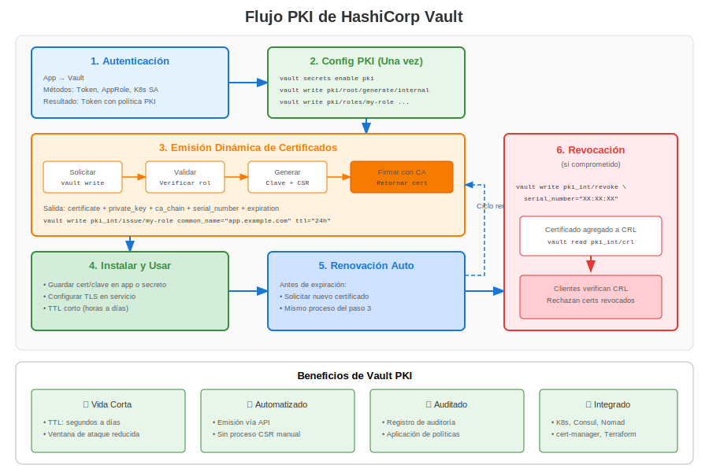

# Apéndice B: PKI de HashiCorp Vault



Vault proporciona una PKI dinámica donde los certificados se emiten bajo demanda con TTLs cortos.

## 1. ¿Por Qué Vault?

* Aplicación centralizada de políticas
* Certs dinámicos de corta duración reducen necesidades de revocación
* Impulsado por API (REST + CLI)

## 2. Habilitar Motor PKI

```bash
vault secrets enable pki
vault secrets tune -max-lease-ttl=87600h pki
vault write pki/root/generate/internal common_name="corp.example" ttl=87600h
vault write pki/config/urls issuing_certificates="https://vault.corp/v1/pki/ca" \
                                    crl_distribution_points="https://vault.corp/v1/pki/crl"
```

## 3. Roles y Emisión

```bash
vault write pki/roles/web allowed_domains="web.corp" allow_subdomains=true max_ttl=72h
vault write pki/issue/web common_name=app01.web.corp ttl=24h
```

## 4. Renovación Automática Sidecar del Agente

```hcl
# vault-agent.hcl
pid_file = "/var/run/agent.pid"
auto_auth {
  method "kubernetes" {
    mount_path = "auth/k8s"
    role       = "web"
  }
  sink "file" {
    config = {
      path = "/etc/tls/web.pem"
    }
  }
}
```


---

## 🧪 Laboratorio Práctico

**Lab 22: PKI de HashiCorp Vault**

Emisión dinámica de certificados con Vault

- 📁 **Ubicación:** `labs/es_ES/22-vault-pki/`
- ⏱️ **Tiempo:** 45-55 minutos
- 🎯 **Nivel:** Avanzado
