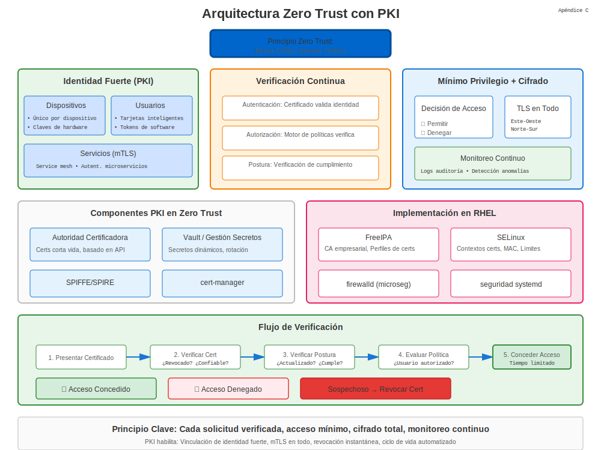

# Apéndice C: Arquitectura Zero Trust

## PKI en Arquitectura Zero Trust



Zero Trust (ZT) asume ninguna confianza implícita basada en ubicación de red. Cada solicitud debe autenticarse y autorizarse.

## 1. Google BeyondCorp y NIST SP 800-207

Estos marcos recomiendan identidad fuerte, cifrado de transporte y evaluación continua.

## 2. Rol de PKI

* Identidad de dispositivo vía certificados.
* mTLS para tráfico este-oeste.
* Credenciales de corta duración auto-rotadas.

## 3. Perfil de Certificado para ZT

| Extensión | Propósito |
|-----------|-----------|
| SAN: URI:spiffe:// | ID de Carga de Trabajo |
| Key Usage: digitalSignature | AuthN |
| EKU: clientAuth, serverAuth | TLS Mutuo |
| Validity ≤ 24h | Limitar radio de explosión |

## 4. Puntos de Aplicación de Política

1. **Gateways** terminan TLS y verifican certs de cliente.
2. **Service Mesh** sidecars realizan mTLS transparentemente.
3. **Agentes de Endpoint** mantienen certificados de dispositivo.

## 5. Lab: Emitir Certificados SPIFFE con cert-manager

```yaml
apiVersion: cert-manager.io/v1
kind: Certificate
metadata:
  name: spiffe-workload
spec:
  duration: 24h
  commonName: spiffe://prod/web/api
  uriSANs:
  - spiffe://prod/web/api
  issuerRef:
    name: mesh-issuer
    kind: ClusterIssuer
```
