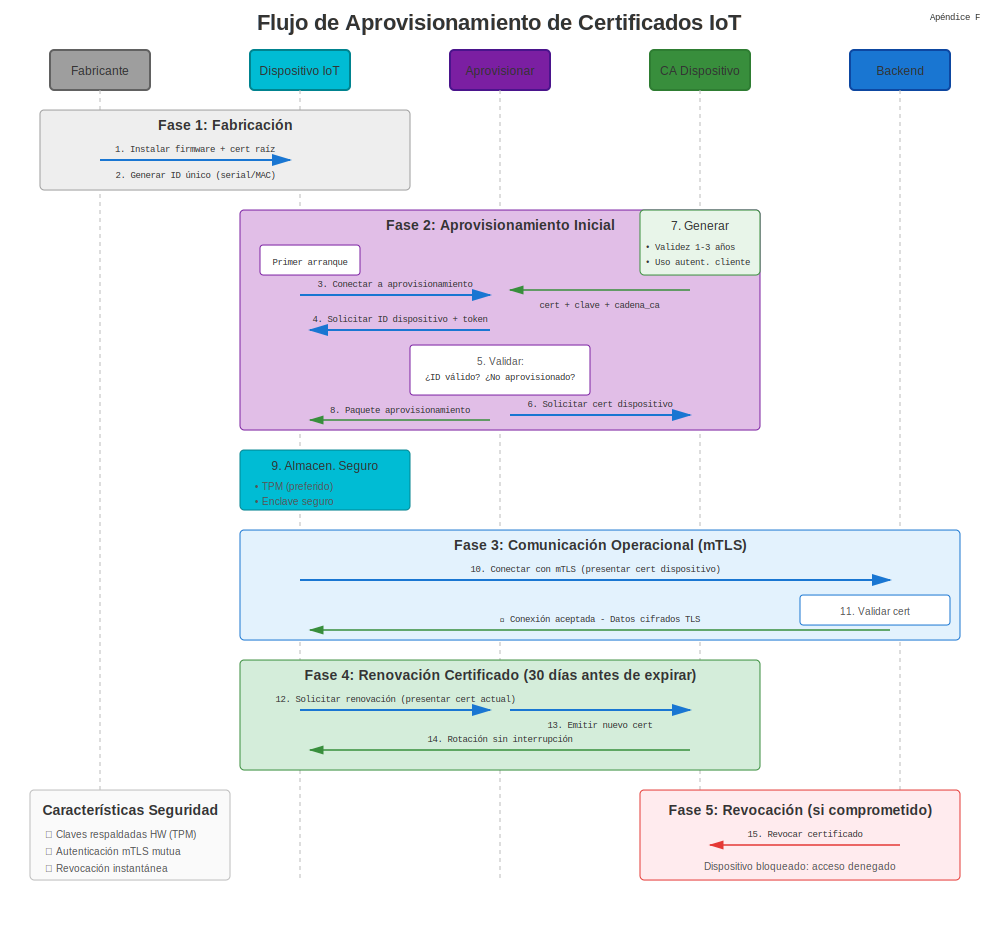
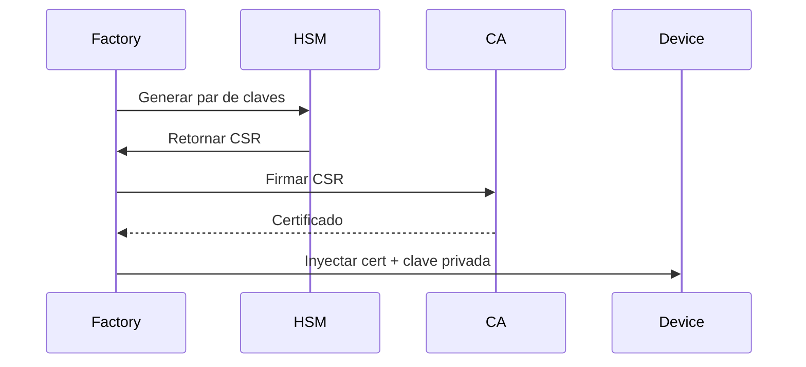

# Apéndice F: Certificados IoT

## Certificados de Dispositivos IoT



Los dispositivos Internet de las Cosas requieren identidades únicas para comunicación segura. Los certificados proporcionan prueba criptográfica de autenticidad del dispositivo.

## 1. ¿Por Qué Certificados para IoT?

* **Identidad de Dispositivo** – Cada sensor, gateway o actuador obtiene un cert único.
* **Redes Zero-Trust** – Los dispositivos se autentican mutuamente con nube/edge.
* **Seguridad de Cadena de Suministro** – Certificados aprovisionados en fabricación previenen clonación.
* **Actualizaciones OTA** – La firma de código asegura integridad del firmware.

## 2. Modelos de Aprovisionamiento de Certificados

### Aprovisionamiento de Fábrica

Certificados grabados en almacenamiento seguro del dispositivo (TPM, elemento seguro) antes del envío.



### Aprovisionamiento Justo a Tiempo

El dispositivo genera clave en primer arranque, envía CSR a servicio de registro.

```bash
# El dispositivo genera clave
openssl ecparam -genkey -name prime256v1 -out device.key

# Crear CSR con serial del dispositivo
openssl req -new -key device.key -out device.csr -subj "/CN=device-12345/serialNumber=12345"

# Enviar a API de inscripción
curl -X POST https://enroll.iot.example.com/csr \
  -H "Authorization: Bearer $ENROLL_TOKEN" \
  --data-binary @device.csr -o device.crt
```

## 3. AWS IoT Core

### Registrar Certificado de Dispositivo

```bash
# Generar clave y CSR
openssl ecparam -genkey -name prime256v1 -out iot-device.key
openssl req -new -key iot-device.key -out iot-device.csr -subj "/CN=iot-device-001"

# Usar AWS CLI para firmar
aws iot create-certificate-from-csr --certificate-signing-request file://iot-device.csr \
  --set-as-active > cert-response.json

# Extraer certificado
jq -r '.certificatePem' cert-response.json > iot-device.crt
```

### Adjuntar Política

```bash
aws iot attach-policy --policy-name IoTDevicePolicy --target arn:aws:iot:region:account:cert/certId
```

### Conexión MQTT

```python
import paho.mqtt.client as mqtt
import ssl

client = mqtt.Client()
client.tls_set(
    ca_certs="AmazonRootCA1.pem",
    certfile="iot-device.crt",
    keyfile="iot-device.key",
    tls_version=ssl.PROTOCOL_TLSv1_2
)
client.connect("xxxxxx.iot.us-east-1.amazonaws.com", 8883)
client.publish("device/telemetry", "{'temp': 22.5}")
```

## 4. Azure IoT Hub

### Autenticación X.509 de Dispositivo

```bash
# Generar cert de dispositivo firmado por CA personalizada
openssl req -new -key device.key -out device.csr -subj "/CN=device-001"
openssl x509 -req -in device.csr -CA ca.crt -CAkey ca.key -CAcreateserial \
  -out device.crt -days 365 -sha256

# Cargar CA a Azure IoT Hub (portal o CLI)
az iot hub certificate create --hub-name MyIoTHub --name MyCACert --path ca.crt

# Conectar dispositivo
from azure.iot.device import IoTHubDeviceClient

device_client = IoTHubDeviceClient.create_from_x509_certificate(
    hostname="MyIoTHub.azure-devices.net",
    device_id="device-001",
    x509=X509(cert_file="device.crt", key_file="device.key")
)
device_client.connect()
device_client.send_message("Hola desde device-001")
```

## 5. Microchip ATECC608 Elemento Seguro

Chip crypto de hardware almacena claves privadas que nunca salen del silicio.

### Flujo de Aprovisionamiento

1. El dispositivo genera par de claves dentro de ATECC608.
2. CSR creado usando clave en chip.
3. CA firma CSR, certificado almacenado en EEPROM del dispositivo.

```c
// Ejemplo Arduino con biblioteca ATECC
#include <ArduinoECCX08.h>

void setup() {
  ECCX08.begin();

  // Generar CSR
  byte csr[256];
  ECCX08.getCSR(csr);

  // Enviar CSR a CA vía HTTP/MQTT
  // Recibir certificado firmado
  // Almacenar en EEPROM
}
```

## 6. Rotación de Certificados para Dispositivos Restringidos

### Certificados de Corta Duración

Emitir certs de 7 días con renovación automatizada vía protocolos ligeros como EST (RFC 7030).

```bash
# Inscripción simple EST
curl --cacert ca.crt --cert current-device.crt --key device.key \
  https://est.example.com/.well-known/est/simpleenroll \
  --data-binary @new-device.csr -o renewed-device.crt
```

### Certificados Bootstrap

Cert inicial de larga duración usado solo para inscripción, luego reemplazado por certs operacionales de corta duración.

## 7. LoRaWAN y Secure Join

LoRaWAN 1.1+ soporta secure join con claves específicas de dispositivo derivadas de certificados:

```text
Dispositivo → JoinRequest (firmado con cert DevEUI)
Network Server → JoinAccept (claves de sesión cifradas)
```

## 8. Resumen de Mejores Prácticas

| Práctica | Razón |
|----------|-------|
| Usar ECC (P-256, P-384) | Claves más pequeñas, menor consumo de energía |
| Hardware Root of Trust | TPM, ATECC, o TrustZone previenen extracción de clave |
| Validez de Certificado ≤ 1 año | Limitar radio de explosión de compromiso |
| Revocación vía OCSP/CRL | Deshabilitar dispositivos comprometidos remotamente |
| PKI Separada para IoT | Aislar CA de dispositivo de IT empresarial |

## 9. Despliegues del Mundo Real

* **Automotriz** – ECUs de vehículo usan certificados para comunicación V2X (IEEE 1609.2).
* **IoT Industrial** – PLCs y dispositivos SCADA autenticados vía IEC 62351.
* **Smart Home** – El protocolo Matter exige certificados X.509 para comisionamiento de dispositivo.

> **Consejo de Seguridad:** Nunca embeber la misma clave privada en múltiples dispositivos. Cada dispositivo debe tener un certificado único para habilitar revocación selectiva.
