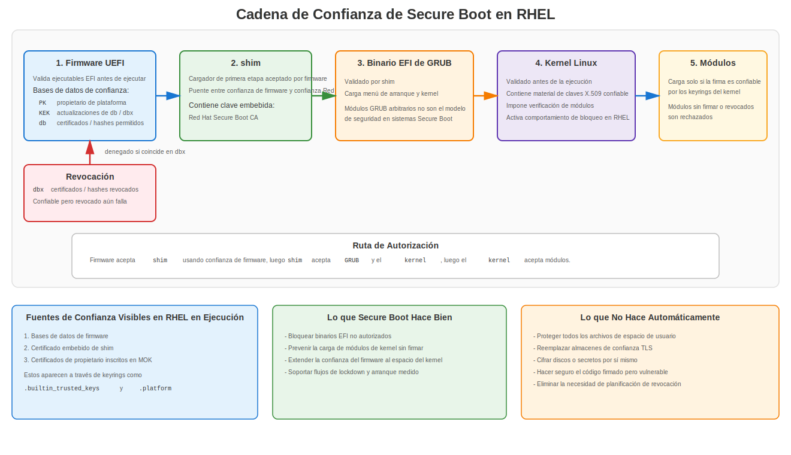
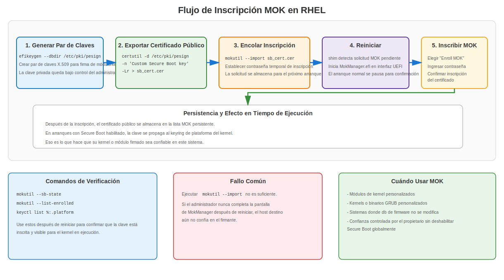
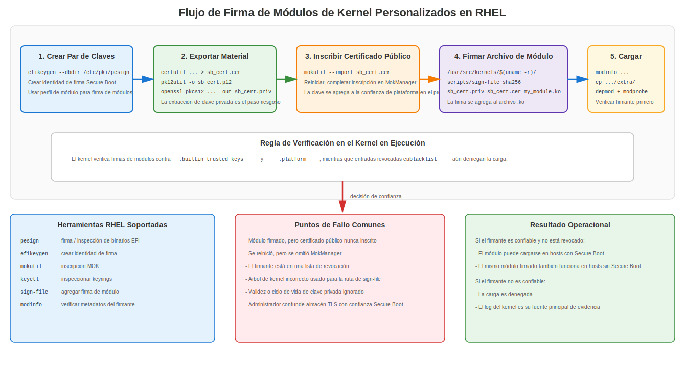

# Apéndice H: Secure Boot y Uso de Certificados

## Secure Boot, cadenas de confianza y operaciones con certificados en RHEL

Secure Boot es donde el firmware, los cargadores de arranque, los kernels y el código cargado por el kernel dejan de ser "simples archivos en disco" y se convierten en objetos de código autenticados. Si entiendes los certificados TLS pero no Secure Boot, te falta una gran parte de cómo realmente comienza la confianza en un sistema moderno.

Este apéndice se centra en tres cosas:

1. Qué hace realmente Secure Boot.
2. Dónde se usan certificados y claves en la cadena de arranque.
3. Cómo RHEL usa `shim`, `GRUB`, `mokutil`, `pesign`, los keyrings del kernel y la firma de módulos en despliegues reales.

## 1. Qué es Secure Boot

UEFI Secure Boot es un modelo de verificación de firmas respaldado por firmware para la ruta de arranque. El firmware comprueba si un ejecutable EFI está firmado por una clave o certificado de confianza antes de permitir su ejecución.

Eso significa que Secure Boot no es lo mismo que:

- Cifrado de disco completo
- Secretos sellados con TPM
- Measured Boot
- Monitoreo de integridad de archivos
- Lista blanca de aplicaciones en espacio de usuario
- Confianza TLS para servicios web

Secure Boot trata específicamente de autorizar código durante la ruta de arranque y para extensiones del espacio del kernel, como los módulos de kernel cargables.

En términos simples, la pregunta que Secure Boot formula es:

> "¿Debería confiarse en este componente de firmware, binario EFI, cargador de arranque, kernel o módulo para su ejecución?"

## 2. Por qué los certificados importan en Secure Boot

Los certificados son el mecanismo de transporte de la confianza. Vinculan una clave pública a una identidad o contexto de política para que un verificador pueda decidir si una firma debe ser aceptada.

En el ecosistema de Secure Boot, los certificados y las claves se usan en diferentes lugares:

| Ubicación | Propósito |
|-----------|-----------|
| Variables de firmware UEFI | Almacenan anclas de confianza de la plataforma y revocaciones |
| `shim` | Contiene confianza embebida del proveedor para verificación de la siguiente etapa |
| Keyrings del kernel | Mantienen claves de confianza usadas para autenticar módulos y artefactos relacionados |
| Lista MOK | Añade confianza controlada por el propietario sin reescribir las bases de datos del firmware |
| Bloques de firma en binarios EFI | Demuestran que los componentes de arranque fueron firmados por una clave privada de confianza |

Este es un dominio de confianza diferente al almacén de confianza TLS de RHEL en `/etc/pki/ca-trust/`. Ese almacén de confianza es para operaciones PKI en espacio de usuario como HTTPS, LDAPS, SMTP TLS, obtención de paquetes y validación de aplicaciones. No decide qué binario EFI arranca el firmware.

## 3. El modelo de confianza de UEFI Secure Boot

### 3.1 Bases de datos principales del firmware

UEFI Secure Boot gira comúnmente en torno a cuatro bases de datos importantes respaldadas por variables:

| Base de datos | Significado | Rol típico |
|---------------|-------------|------------|
| `PK` | Platform Key | Propietario de nivel superior de la política de Secure Boot de la plataforma |
| `KEK` | Key Exchange Key database | Autoriza actualizaciones a las bases de datos de firmas permitidas y revocadas |
| `db` | Firmas / certificados permitidos | Lista de confianza para ejecutables y controladores EFI |
| `dbx` | Firmas / certificados / hashes prohibidos | Lista de revocación usada para bloquear binarios o certificados conocidos como maliciosos |

Son conceptualmente simples, pero los administradores los confunden rutinariamente:

- `PK` controla la autoridad de Secure Boot de la plataforma.
- `KEK` controla las actualizaciones de la lista de permitidos y la lista de denegados.
- `db` indica qué está permitido arrancar.
- `dbx` indica qué nunca debe ser aceptado, incluso si alguna vez fue de confianza.

### 3.2 Setup Mode vs User Mode

El firmware UEFI generalmente tiene diferentes estados operacionales:

- **Setup Mode**: la propiedad de la plataforma no está finalizada; los cambios de inscripción de claves son posibles.
- **User Mode**: la política de Secure Boot se aplica activamente usando las claves instaladas.
- **Custom Mode**: modo específico del proveedor que puede permitir la gestión manual de claves.

Esto importa porque la gente a menudo confunde "Secure Boot habilitado en los menús del firmware" con "Secure Boot completamente aplicado con la política de confianza esperada." No siempre son el mismo estado.

## 4. Qué se firma realmente

Secure Boot no es una firma sobre "el sistema." Es una cadena de objetos firmados o confiados por separado.

Los objetos autenticados comunes incluyen:

- Aplicaciones EFI
- Cargadores de arranque EFI
- Binarios EFI de GRUB
- Kernels de Linux
- Módulos de kernel cargables
- A veces ejecutables de actualización de firmware del proveedor

El hecho de que un componente participe en el arranque no significa que esté firmado de forma independiente de la misma manera. Por ejemplo:

- Los binarios EFI se autentican típicamente como ejecutables PE/COFF con firmas embebidas.
- Los módulos del kernel se firman de una manera específica de Linux y son verificados por el kernel contra claves X.509 de confianza.
- El initramfs es parte del flujo de arranque, pero en el modelo clásico de Secure Boot de RHEL no es simplemente "otro ejecutable EFI firmado con PE de forma independiente."

Esa distinción importa. La documentación descuidada difumina todo en "toda la cadena de arranque está firmada." Eso no es lo suficientemente preciso para solucionar problemas o diseñar políticas.

## 5. Cadena de confianza de Secure Boot en RHEL



### 5.1 Flujo de alto nivel

En un sistema RHEL típico con UEFI Secure Boot habilitado:

1. El firmware valida el cargador de arranque EFI de primera etapa contra las claves de confianza en las bases de datos del firmware.
2. El cargador de primera etapa es típicamente `shim`.
3. `shim` contiene un ancla de confianza embebida de Red Hat usada para autenticar la siguiente etapa.
4. `shim` valida el binario EFI de GRUB de RHEL.
5. GRUB valida el kernel que carga usando la clave pública embebida en `shim` (GRUB no lleva sus propias claves de confianza).
6. El kernel usa sus keyrings de confianza para validar los módulos de kernel cargables y otro código del espacio del kernel.

Eso te da una cadena de autorización desde el firmware hasta la extensibilidad del espacio del kernel.

### 5.2 Por qué existe `shim`

`shim` existe porque los fabricantes de hardware envían ampliamente sistemas con raíces de firma UEFI confiadas por Microsoft ya inscritas. Red Hat puede por lo tanto tener el cargador de primera etapa firmado para que sea aceptado por hardware comercial sin pedir a cada fabricante de hardware que preinstale un ancla de confianza de firmware exclusiva de Red Hat.

Después de que el firmware acepta `shim`, `shim` se convierte en el puente entre la confianza del firmware y la confianza del sistema operativo del proveedor.

En la práctica en RHEL:

- El firmware confía en la ruta de firma reconocida por Microsoft para `shim`.
- `shim` contiene un certificado CA de Secure Boot de Red Hat embebido.
- Ese certificado embebido de Red Hat se usa para validar GRUB y el kernel.

### 5.3 Por qué RHEL no depende de la carga arbitraria de módulos de GRUB

Bajo Secure Boot, RHEL no quiere que se cargue código arbitrario sin firmar dentro del perímetro de seguridad del cargador de arranque. La documentación de Red Hat explica que la carga de módulos de GRUB está deshabilitada en contextos de Secure Boot porque no existe un modelo de firma y verificación de propósito general para módulos de GRUB arbitrarios equivalente a la ruta firmada controlada que Red Hat distribuye.

El punto operacional es simple:

- Si estás en un sistema con Secure Boot, no asumas que "GRUB puede simplemente cargar cualquier cosa desde el disco."
- Todo el diseño intenta mantener el código sin firmar fuera de la ruta de arranque.

## 6. Certificados y claves usados por Secure Boot en RHEL

### 6.1 Certificados del firmware

La confianza del firmware proviene de claves y certificados almacenados en variables UEFI (`PK`, `KEK`, `db`, `dbx`) como se describe en la sección 3.1. Estos no se gestionan con `update-ca-trust`.

### 6.2 Certificado embebido en `shim`

La documentación de Red Hat para RHEL 8/9/10 describe `shim` como contenedor de un certificado público de Red Hat usado para autenticar GRUB y el kernel. Esta confianza embebida es una de las razones por las que `shim` es central en el diseño de Secure Boot de RHEL.

### 6.3 Machine Owner Key (MOK)

La facilidad **Machine Owner Key** es la válvula de escape práctica que mantiene Secure Boot usable en el mundo real.

Sin MOK, estarías atrapado entre dos malas opciones:

1. Deshabilitar Secure Boot cada vez que necesites código personalizado.
2. Convencer a tu fabricante de hardware de que añada permanentemente tu certificado público a las bases de datos del firmware.

MOK proporciona una tercera opción:

- Inscribes tu propio certificado público en el sistema.
- `shim` y `MokManager` gestionan esa inscripción.
- En el arranque, la clave se propaga a un keyring de confianza del kernel para que tus componentes personalizados firmados puedan ser aceptados.

### 6.4 Keyrings del kernel

En RHEL moderno, la verificación de firmas de módulos del kernel depende de los keyrings del kernel, principalmente:

| Keyring | Rol |
|---------|-----|
| `.builtin_trusted_keys` | Claves de confianza integradas embebidas en el kernel o cargadas como parte de la ruta de arranque de confianza |
| `.platform` | Confianza derivada de la plataforma, incluyendo claves provenientes de las bases de datos de Secure Boot y MOK |
| `.blacklist` | Claves y hashes revocados que deben ser rechazados |

La documentación de RHEL para la firma de módulos señala explícitamente:

- las firmas de módulos se verifican contra claves X.509 de confianza de `.builtin_trusted_keys` y `.platform`
- las entradas revocadas de la blacklist se excluyen de la verificación
- las claves MOK se propagan a `.platform` en arranques con Secure Boot habilitado

Eso significa que la confianza es aditiva, pero la revocación siempre prevalece.

## 7. Qué protege y qué no protege Secure Boot

### 7.1 Qué protege

Secure Boot está diseñado para reducir la posibilidad de que el sistema ejecute código no autorizado en la ruta de arranque, como:

- binarios EFI manipulados
- cargadores de arranque maliciosos
- kernels modificados
- módulos del kernel sin firmar o no confiables

### 7.2 Qué no resuelve automáticamente

Secure Boot no protege automáticamente:

- binarios de espacio de usuario
- scripts de shell
- archivos de configuración
- secretos en reposo
- manipulación de memoria en tiempo de ejecución después de que un sistema ya ha sido comprometido
- identidad de servidor TLS para servicios
- escalación de privilegios local a través de código firmado pero vulnerable

Secure Boot es un control de autorización de arranque. No es un marco completo de integridad del host.

### 7.3 Secure Boot vs Measured Boot vs TPM

La gente mezcla estos conceptos porque todos tocan la confianza en el arranque. Eso es pensar con pereza.

Están relacionados, pero son diferentes:

| Característica | Función principal |
|----------------|-------------------|
| Secure Boot | Bloquea la ejecución de código no autorizado en la ruta de arranque |
| Measured Boot | Registra mediciones de arranque en los PCRs del TPM |
| TPM | Almacena secretos protegidos y mediciones; puede sellar datos al estado del arranque |
| IMA appraisal | Extiende la política de integridad más allá del arranque temprano hacia la evaluación de archivos y decisiones de carga en tiempo de ejecución |

Una implicación práctica en RHEL:

- Secure Boot decide si el código es aceptado para arrancar o cargarse.
- Los flujos de trabajo basados en TPM pueden depender de valores de PCR que reflejan la política de Secure Boot y el estado de las bases de datos del firmware.

Si las claves del firmware o las bases de datos de revocación cambian, las mediciones del TPM también pueden cambiar. Eso importa para el desbloqueo automático de LUKS, la atestación y los flujos de trabajo con secretos sellados.

## 8. Kernel Lockdown en RHEL

En RHEL, arrancar en modo EFI Secure Boot activa el comportamiento de kernel lockdown. Esto es importante porque Secure Boot por sí solo no es suficiente si el kernel en ejecución aún expone interfaces que permiten a usuarios privilegiados manipular la memoria del kernel o evadir decisiones de confianza.

Lockdown está diseñado para cerrar esa brecha.

Las restricciones típicas incluyen límites o bloqueos directos sobre cosas como:

- cargar módulos sin firmar
- rutas de modificación directa de la imagen del kernel
- interfaces de acceso directo como `/dev/mem`
- algunas rutas de `kexec` sin firmar
- interfaces que podrían debilitar el límite de confianza del arranque

Por eso los administradores a veces ven mensajes como:

```text
Lockdown: X: Y is restricted; see man kernel_lockdown.7
```

Eso no es drama aleatorio del kernel. Es la política de Secure Boot extendiéndose hacia la aplicación en tiempo de ejecución.

## 9. El modelo mental del administrador de RHEL

Si solo vas a retener un modelo en tu cabeza, que sea este:

1. El firmware confía en las claves en `db` y rechaza claves o hashes en `dbx`.
2. El firmware autoriza `shim`.
3. `shim` autoriza los componentes de arranque de la siguiente etapa de Red Hat y también soporta operaciones MOK.
4. MOK te permite añadir certificados públicos controlados por el propietario.
5. El kernel confía en claves integradas y derivadas de la plataforma/MOK para la verificación de módulos.
6. Lockdown previene evasiones obvias en tiempo de ejecución.

Si cualquiera de esos pasos está roto, tu flujo de trabajo personalizado de arranque o módulos falla.

## 10. Secure Boot en RHEL: verificaciones operacionales diarias

### 10.1 Comprobar si Secure Boot está habilitado

```bash
sudo mokutil --sb-state
```

La salida típica es algo como:

```text
SecureBoot enabled
```

### 10.2 Comprobar mensajes de Secure Boot e integridad en el log del kernel

```bash
sudo dmesg | grep -Ei 'secure boot|integrity|lockdown|EFI: Loaded cert'
```

En sistemas RHEL, los mensajes del log de integridad a menudo muestran de dónde provienen las claves, como:

- `UEFI:db`
- `shim` embebido
- `UEFI:MokListRT`

### 10.3 Listar claves de confianza de la plataforma

```bash
sudo keyctl list %:.platform
sudo keyctl list %:.builtin_trusted_keys
sudo keyctl list %:.blacklist
```

Lo que debes buscar:

- certificados derivados del firmware
- certificados inscritos mediante MOK
- hashes o claves revocadas en `.blacklist`

### 10.4 Inspeccionar firmas en binarios EFI

En RHEL, `pesign` es la herramienta soportada para inspeccionar y añadir firmas a los binarios EFI relevantes:

```bash
sudo pesign --show-signature --in /boot/efi/EFI/redhat/shimx64.efi
sudo pesign --show-signature --in /boot/efi/EFI/redhat/grubx64.efi
```

En sistemas AArch64, los nombres comúnmente cambian a `shimaa64.efi` y `grubaa64.efi`.

## 11. Paquetes y herramientas clave de RHEL

Al trabajar con firma personalizada de Secure Boot en RHEL 8/9/10, la documentación de Red Hat se centra en estas herramientas:

```bash
sudo dnf install pesign openssl kernel-devel mokutil keyutils
```

Roles principales:

| Herramienta | Propósito |
|-------------|-----------|
| `pesign` | Firmar e inspeccionar binarios EFI y kernels |
| `efikeygen` | Generar un par de claves X.509 orientado a Secure Boot en la base de datos de `pesign` |
| `mokutil` | Inscribir e inspeccionar Machine Owner Keys y el estado de Secure Boot |
| `keyctl` | Inspeccionar keyrings del kernel |
| `sign-file` | Añadir firmas a módulos del kernel de Linux |
| `certutil` / `pk12util` | Exportar claves y certificados desde la base de datos NSS usada por `pesign` |
| `openssl` | Extraer o transformar material de claves cuando sea necesario |

## 12. Generar una clave personalizada de Secure Boot en RHEL

### 12.1 Generar una clave para firma de módulos

La documentación de Red Hat indica `efikeygen` como la forma estándar de crear un par X.509 autofirmado para flujos de trabajo de Secure Boot:

```bash
sudo efikeygen \
  --dbdir /etc/pki/pesign \
  --self-sign \
  --module \
  --common-name 'CN=Organization signing key' \
  --nickname 'Custom Secure Boot key'
```

### 12.2 Generar una clave para firma de kernels

```bash
sudo efikeygen \
  --dbdir /etc/pki/pesign \
  --self-sign \
  --kernel \
  --common-name 'CN=Organization signing key' \
  --nickname 'Custom Secure Boot key'
```

### 12.3 Nota sobre FIPS

La documentación de Red Hat señala que en modo FIPS puede ser necesario especificar el token NSS explícitamente:

```bash
sudo efikeygen \
  --dbdir /etc/pki/pesign \
  --self-sign \
  --kernel \
  --common-name 'CN=Organization signing key' \
  --nickname 'Custom Secure Boot key' \
  --token 'NSS FIPS 140-2 Certificate DB'
```

El material generado se almacena bajo `/etc/pki/pesign/`.

## 13. Inscripción del certificado público con MOK



Este es el paso que la gente se salta, y luego pierde horas culpando a Secure Boot en lugar de a su propio proceso.

Generar una clave no es suficiente. El sistema de destino debe confiar en el certificado público correspondiente.

### 13.1 Exportar el certificado público

```bash
sudo certutil -d /etc/pki/pesign \
  -n 'Custom Secure Boot key' \
  -Lr > sb_cert.cer
```

### 13.2 Importarlo en MOK

```bash
sudo mokutil --import sb_cert.cer
```

Se te pedirá que establezcas una contraseña temporal de inscripción.

### 13.3 Reiniciar y completar la inscripción

En el siguiente arranque:

1. `shim` detecta la inscripción pendiente.
2. `MokManager.efi` se inicia.
3. Eliges `Enroll MOK`.
4. Introduces la contraseña que estableciste durante `mokutil --import`.
5. El certificado se añade a la lista MOK persistente.

Una vez inscrito en un sistema con Secure Boot habilitado, la clave se propaga al keyring `.platform` en los arranques posteriores.

## 14. Firma de módulos de kernel personalizados en RHEL



Esta es una de las tareas de Secure Boot más comunes en el mundo real. Los controladores fuera del árbol, módulos de proveedores, agentes HBA, sondas de monitoreo o productos de seguridad a menudo fallan aquí.

### 14.1 Exportar el certificado público

Exporta el certificado público como se describe en la sección 13.1 para producir `sb_cert.cer`.

### 14.2 Exportar la clave privada desde la base de datos NSS

```bash
sudo pk12util -o sb_cert.p12 \
  -n 'Custom Secure Boot key' \
  -d /etc/pki/pesign
```

Luego extrae la clave privada:

```bash
openssl pkcs12 \
  -in sb_cert.p12 \
  -out sb_cert.priv \
  -nocerts \
  -noenc
```

Eso produce una clave privada sin cifrar. Trata ese archivo como un arma cargada, porque eso es lo que es.

### 14.3 Firmar el módulo

```bash
sudo /usr/src/kernels/$(uname -r)/scripts/sign-file \
  sha256 \
  sb_cert.priv \
  sb_cert.cer \
  my_module.ko
```

Esto añade la firma del módulo directamente al archivo del módulo del kernel.

### 14.4 Verificar el firmante

```bash
modinfo my_module.ko | grep signer
```

### 14.5 Cargar el módulo

```bash
sudo insmod my_module.ko
```

o después de colocarlo bajo el árbol de módulos:

```bash
sudo cp my_module.ko /lib/modules/$(uname -r)/extra/
sudo depmod -a
sudo modprobe my_module
```

### 14.6 Advertencia operacional sobre fechas de validez

La documentación de Red Hat advierte a los administradores que firmen kernels y módulos dentro del período de validez del certificado y también señala que `sign-file` no advierte sobre malas decisiones de temporización. No trates la ausencia de una advertencia de la herramienta como prueba de que tu flujo de trabajo de firma es correcto.

## 15. Firma de kernels y binarios EFI en RHEL

### 15.1 Firmar un kernel en x86_64

```bash
sudo pesign \
  --certificate 'Custom Secure Boot key' \
  --in vmlinuz-version \
  --sign \
  --out vmlinuz-version.signed
```

Inspeccionar el resultado:

```bash
sudo pesign --show-signature --in vmlinuz-version.signed
```

Reemplazar la imagen sin firmar con la firmada:

```bash
sudo mv vmlinuz-version.signed vmlinuz-version
```

Si omites este paso, el sistema aún arranca la original sin firmar.

### 15.2 Firmar un binario EFI de GRUB en x86_64

```bash
sudo pesign \
  --in /boot/efi/EFI/redhat/grubx64.efi \
  --out /boot/efi/EFI/redhat/grubx64.efi.signed \
  --certificate 'Custom Secure Boot key' \
  --sign
```

Inspeccionar el resultado:

```bash
sudo pesign --in /boot/efi/EFI/redhat/grubx64.efi.signed --show-signature
```

Reemplazar el binario sin firmar con el firmado:

```bash
sudo mv /boot/efi/EFI/redhat/grubx64.efi.signed /boot/efi/EFI/redhat/grubx64.efi
```

### 15.3 Nota sobre AArch64

En sistemas AArch64, trabajarás típicamente con:

- `/boot/efi/EFI/redhat/shimaa64.efi`
- `/boot/efi/EFI/redhat/grubaa64.efi`

La documentación de RHEL también cubre el flujo de trabajo de descompresión/recompresión para firmar imágenes del kernel en ARM de 64 bits.

## 16. Dónde aparece la confianza de Secure Boot dentro del kernel RHEL en ejecución

La documentación de RHEL muestra que un sistema con Secure Boot habilitado puede exponer evidencia de fuentes de confianza cargadas tanto en los logs del kernel como en los keyrings.

Ejemplos de lo que puedes ver:

- Entradas de certificados de Microsoft provenientes de UEFI `db`
- Claves de Secure Boot de Red Hat provenientes de `shim` embebido
- Claves inscritas por el propietario provenientes de `MokListRT`
- Revocaciones reflejadas en `.blacklist`

Eso te da tres fuentes de confianza diferentes en juego:

1. Confianza del firmware
2. Confianza embebida del proveedor
3. Confianza añadida por el propietario

Si no sabes cuál de las tres está usando tu sistema para un módulo o binario EFI dado, estás solucionando problemas a ciegas.

## 17. Revocación de Secure Boot y `dbx`

La revocación es de donde provienen muchos de los incidentes de "pero antes funcionaba."

La base de datos `dbx` contiene firmas, certificados o hashes revocados. Si un objeto encadena hacia una entrada revocada, el sistema lo rechaza incluso si antes era de confianza.

Consecuencias operacionales:

- los cargadores de arranque antiguos pueden dejar de funcionar después de actualizaciones de revocación
- las firmas vulnerables o deprecadas pueden volverse inaceptables
- los sistemas de laboratorio que nunca reciben actualizaciones de firmware derivan hacia estados de compatibilidad extraños
- las cadenas de arranque personalizadas se rompen si las anclaste a algo que luego aparece en los datos de revocación

Dentro de Linux, las entradas revocadas se representan a través del keyring blacklist. Por eso la confianza sola no es suficiente; el objeto también debe no estar revocado.

## 18. Expiración del certificado de Secure Boot de Microsoft 2011

El certificado de firma Microsoft UEFI CA 2011, que ha sido el ancla de confianza principal usada por el firmware para validar `shim` en prácticamente todo el hardware comercial x86_64, está programado para expirar el 27 de junio de 2026.

Esto no significa que los sistemas existentes dejen de arrancar inmediatamente. Los sistemas que ya tienen el certificado 2011 inscrito en el firmware `db` continuarán aceptando binarios firmados con ese certificado después de la fecha de expiración. Sin embargo, Microsoft ya no firmará nuevos binarios con la clave 2011 después de la expiración, por lo que las futuras actualizaciones de `shim` deben estar firmadas con el certificado de reemplazo Microsoft UEFI CA 2023.

### 18.1 Qué ha hecho Red Hat

Red Hat publicó nuevos binarios de `shim` para todas las versiones soportadas de RHEL 8, RHEL 9 y RHEL 10 en x86_64 que están doblemente firmados con los certificados de firma de Secure Boot de Microsoft 2011 y Microsoft 2023. Esto significa que el nuevo `shim` arrancará en sistemas que tengan cualquiera de los dos certificados o ambos inscritos en el firmware.

En AArch64, a partir de RHEL 9.7 y RHEL 10.0, el binario `shim` está firmado únicamente con el certificado Microsoft 2023.

### 18.2 Comprobar qué certificado firmó tu shim

```bash
sudo pesign -S -i /boot/efi/EFI/redhat/shimx64.efi
```

Si ves `Microsoft Windows UEFI Driver Publisher`, esa es la ruta del certificado 2011. Si ves referencias al certificado 2023, el sistema está usando la ruta de firma actualizada.

### 18.3 Qué deben hacer los administradores

1. **Actualizar `shim`** en todos los sistemas RHEL soportados para obtener la versión con doble firma antes de depender de actualizaciones de firmware que añadan el certificado 2023.
2. **Estar atentos a las actualizaciones de firmware** de los fabricantes de hardware que inscriban el certificado Microsoft 2023 en la UEFI `db`. Sin el certificado 2023 en el firmware, los futuros binarios de `shim` firmados solo con la clave 2023 no serán aceptados.
3. **Tener en cuenta el impacto en el TPM**: las actualizaciones de UEFI `db` cambiarán los valores del Platform Configuration Register (PCR) del TPM, particularmente PCR7. Si usas desbloqueo automático basado en TPM para volúmenes cifrados con LUKS, atestación de Measured Boot o secretos sellados contra PCR7, esas vinculaciones se romperán después de los cambios en `db`. El enfoque recomendado es primero resellar contra un valor de PCR que no haya cambiado (como PCR0), reiniciar y luego resellar contra el nuevo valor de PCR7.
4. **Los sistemas heredados** (servidores físicos antiguos, appliances o sistemas que nunca reciben actualizaciones de firmware) que no pueden inscribir el certificado 2023 quedarán limitados a arrancar binarios de `shim` firmados con el certificado 2011.

### 18.4 Por qué esto importa para este libro

Este es un ejemplo concreto y del mundo real de cada concepto que cubre este apéndice: bases de datos de confianza del firmware, ciclo de vida de certificados, riesgo de revocación, sensibilidad de las mediciones del TPM y el costo operacional de ignorar la gestión de certificados de firma. Si tu organización no sabía que esto iba a pasar, tu gestión del ciclo de vida de Secure Boot tiene una brecha.

## 19. Secure Boot y notas de versión de RHEL

### 19.1 RHEL 7

RHEL 7 estableció el modelo básico de Secure Boot de Red Hat:

- `shim` como cargador de primera etapa
- Clave embebida de Red Hat en `shim`
- GRUB y kernel firmados
- MOK para confianza añadida por el propietario
- Módulos del kernel firmados requeridos en sistemas con Secure Boot habilitado

La documentación de RHEL 7 también hace un punto importante que mucha gente pasa por alto: el Secure Boot clásico trata sobre la integridad del código en espacio del kernel, no sobre la validación general de todo el contenido en espacio de usuario.

### 19.2 RHEL 8

RHEL 8 mantiene el mismo modelo general, con documentación pública mejorada en torno a:

- `.builtin_trusted_keys`
- `.platform`
- `.blacklist`
- `efikeygen`
- `pesign`
- Procedimientos de inscripción MOK

La documentación de RHEL 8 también muestra explícitamente que las claves inscritas mediante MOK se propagan a `.platform`.

### 19.3 RHEL 9

RHEL 9 documenta la misma ruta de confianza central y es más estricto y claro operacionalmente en torno a:

- validación de firmas de módulos contra keyrings de confianza
- confianza de plataforma impulsada por MOK
- firma de kernels y módulos personalizados
- comportamiento de lockdown en sistemas con Secure Boot

RHEL 9 es la línea base práctica si estás diseñando un flujo de trabajo moderno de Secure Boot en RHEL hoy en día.

### 19.4 RHEL 10

La documentación de RHEL 10 continúa con el mismo conjunto de herramientas y modelo de confianza para la firma personalizada de kernels y módulos con `pesign`, `mokutil`, `efikeygen`, `keyctl` y keyrings del kernel.

El punto importante es la continuidad: esta no es una característica aleatoria que cambia de forma en cada versión. Los nombres de las herramientas y los conceptos de confianza se mantienen reconocibles a través de las generaciones soportadas de RHEL.

## 20. Casos de uso comunes en RHEL

### 20.1 Despliegue de controladores de terceros

Ejemplos comunes:

- controladores de controladora de almacenamiento
- agentes de monitoreo con módulos del kernel
- módulos de seguridad de endpoint
- controladores de red personalizados
- módulos de gestión de hardware del proveedor

Si el módulo no está firmado o está firmado por una clave no confiable, el sistema lo rechaza en un host con Secure Boot habilitado.

### 20.2 Compilaciones personalizadas del kernel

Si compilas tu propio kernel, al firmware y la cadena de arranque no les importa que provenga de tu pipeline de CI. Solo les importa si la imagen está firmada por una clave de confianza y si el sistema tiene esa ancla de confianza inscrita.

### 20.3 Entornos que eliminan anclas de confianza del proveedor

Algunas organizaciones quieren un control más estricto y reducen la dependencia de anclas de confianza predeterminadas de terceros. Eso es posible, pero significa que tú eres responsable de toda la cadena:

- política de firma
- protección de la clave privada
- gestión de confianza del firmware
- firma de GRUB/kernel
- estrategia de revocación
- ruta de recuperación si tu infraestructura de firma falla

La mayoría de los equipos subestiman esa carga operacional.

### 20.4 Máquinas virtuales

Secure Boot también importa en entornos virtualizados si el firmware del invitado expone soporte de UEFI Secure Boot. No asumas que "es solo una VM" significa que la confianza en el arranque es irrelevante. La infraestructura virtual es uno de los lugares más fáciles para que proliferen imágenes personalizadas sin firmar.

## 21. Solución de problemas de Secure Boot en RHEL

### 21.1 Verificaciones rápidas

```bash
sudo mokutil --sb-state
sudo mokutil --list-enrolled
sudo keyctl list %:.platform
sudo keyctl list %:.blacklist
sudo dmesg | grep -Ei 'secure boot|lockdown|integrity|module|cert'
```

### 21.2 Patrones de fallo típicos

| Síntoma | Causa probable |
|---------|----------------|
| El módulo no se carga | Módulo sin firmar o firmante no confiable |
| El módulo muestra firmante pero aún falla | Clave no inscrita en el sistema de destino, ruta de keyring incorrecta o firmante revocado |
| Se ejecutó la importación MOK pero la confianza no es visible | Inscripción no completada en `MokManager` después del reinicio |
| El binario EFI no arranca | Falta firma de confianza, flujo de trabajo de reemplazo incorrecto o certificado/hash revocado |
| El comportamiento cambió después de una actualización de firmware | Cambios en `db`/`dbx` alteraron el estado de confianza o revocación |
| El flujo de trabajo de desbloqueo con TPM falla después de actualizar claves | Las mediciones de PCR cambiaron después de actualizaciones de la base de datos de Secure Boot |

### 21.3 Pistas en el log del kernel

Busca mensajes que mencionen:

- `integrity`
- `MokListRT`
- `EFI: Loaded cert`
- `Lockdown`
- `module verification failed`

Si no inspeccionas el log del kernel, estás adivinando.

## 22. Mejores prácticas para la gestión de certificados de Secure Boot

### 22.1 Separar roles

No uses una sola clave de firma para todo a menos que disfrutes convirtiendo un compromiso en un incidente a nivel de toda la plataforma.

Prefiere claves separadas para:

- cargadores de arranque / binarios EFI
- kernels
- módulos del kernel de terceros o internos
- flujos de trabajo de emergencia o de último recurso

### 22.2 Proteger la clave privada adecuadamente

Preferir:

- firma offline
- almacenamiento de claves respaldado por HSM o token donde sea posible
- acceso mínimo del operador
- pasos de firma auditados
- planificación de rotación de certificados

Evitar:

- dejar claves extraídas sin cifrar en hosts de compilación
- copiar material de firma entre trabajos de CI improvisados
- claves de laboratorio de larga duración reutilizadas en producción

### 22.3 Mantener la inscripción MOK limitada

Cada certificado de confianza adicional expande lo que la plataforma puede aceptar. Inscribe solo lo que necesites. "Solo añade otro MOK para que funcione" es cómo empieza la proliferación de confianza.

### 22.4 Rastrear revocaciones y actualizaciones de firmware

Si dependes de confianza personalizada de Secure Boot:

- monitorea las actualizaciones de firmware y `dbx`
- prueba las rutas de recuperación antes del despliegue amplio
- valida el arranque en hardware de staging
- comprende el impacto en los secretos sellados con TPM y la atestación

### 22.5 Mantener Secure Boot y TLS PKI mentalmente separados

Los mismos conceptos X.509 aparecen en ambas áreas, pero los mundos operacionales son diferentes.

No confundas:

- bases de datos de confianza del firmware con `/etc/pki/ca-trust`
- inscripción MOK con instalación de anclas de confianza CA
- claves de firma de módulos con certificados TLS de servidor web

Usan criptografía relacionada, pero resuelven problemas diferentes.

## 23. Verdades duras que los administradores suelen aprender tarde

1. Secure Boot es fácil hasta que necesitas código personalizado.
2. El código personalizado es fácil hasta que necesitas operaciones de firma duraderas.
3. Las operaciones de firma duraderas son fáciles hasta que necesitas revocación, rotación, atestación y recuperación de flota.

La mayoría de los equipos no fallan en Secure Boot porque la criptografía sea demasiado difícil. Fallan porque su modelo operacional es descuidado:

- sin modelo de propiedad de claves
- sin planificación del ciclo de vida de certificados
- sin hardware de pruebas
- sin ruta de reversión
- sin idea de qué es confiable por el firmware vs `shim` vs MOK vs keyrings del kernel

Eso no es una limitación técnica. Eso es un fallo de proceso.

## 24. Quick Reference

```text
┌──────────────────────────────────────────────────────────────────────┐
│ RHEL SECURE BOOT QUICK REFERENCE                                     │
├──────────────────────────────────────────────────────────────────────┤
│ Check state:        mokutil --sb-state                               │
│ List MOKs:          mokutil --list-enrolled                          │
│ List platform keys: keyctl list %:.platform                          │
│ Built-in keys:      keyctl list %:.builtin_trusted_keys              │
│ Revocations:        keyctl list %:.blacklist                         │
│ View EFI signature: pesign --show-signature --in <efi-binary>        │
│                                                                      │
│ RHEL boot path:     firmware -> shim -> GRUB -> kernel -> modules    │
│                                                                      │
│ Firmware DBs:       PK / KEK / db / dbx                              │
│ Owner trust:        MOK -> .platform                                 │
│ Kernel trust:       .builtin_trusted_keys + .platform                │
│ Revocation:         .blacklist / dbx                                 │
│                                                                      │
│ Common packages:    pesign openssl kernel-devel mokutil keyutils     │
└──────────────────────────────────────────────────────────────────────┘
```

## 25. Conclusiones clave

1. Secure Boot es una cadena de autorización basada en certificados para el código de arranque y del espacio del kernel.
2. En RHEL, `shim` es el puente entre la confianza del firmware y la confianza controlada por Red Hat.
3. MOK es el mecanismo crítico para añadir confianza controlada por el propietario sin reescribir las bases de datos del firmware.
4. La carga de módulos del kernel depende de los keyrings de confianza, no del paquete CA de espacio de usuario.
5. La revocación importa tanto como la confianza; `dbx` y `.blacklist` pueden romper artefactos que "antes funcionaban."
6. Si estás firmando módulos o kernels personalizados, el problema no es solo la criptografía. Es la gestión del ciclo de vida.

## 26. Lecturas oficiales de RHEL que conviene tener a mano

- Documentación de gestión del kernel de RHEL 8/9/10 sobre firma de kernels y módulos para Secure Boot
- Guía de administración del kernel y Secure Boot de RHEL 7
- `kernel_lockdown(7)`
- `mokutil(1)`
- `keyctl(1)`
- `pesign(1)`
