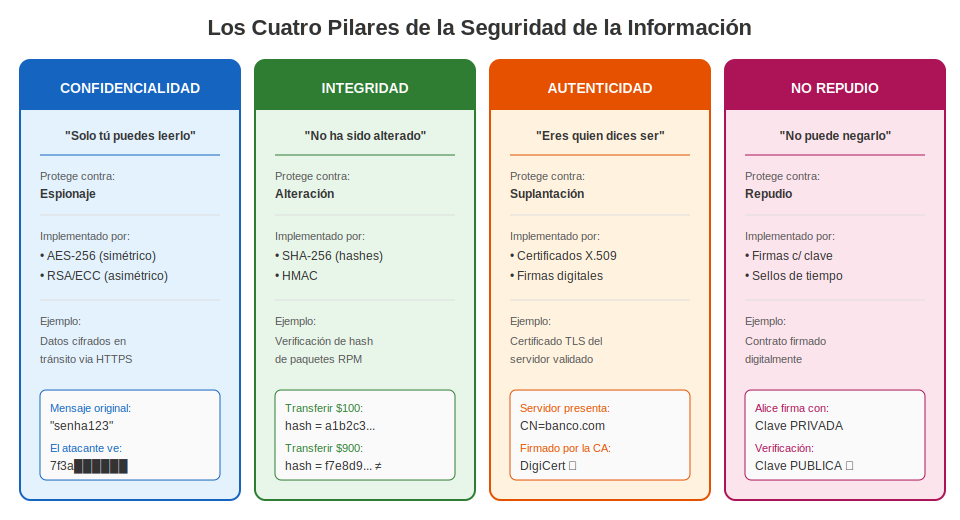
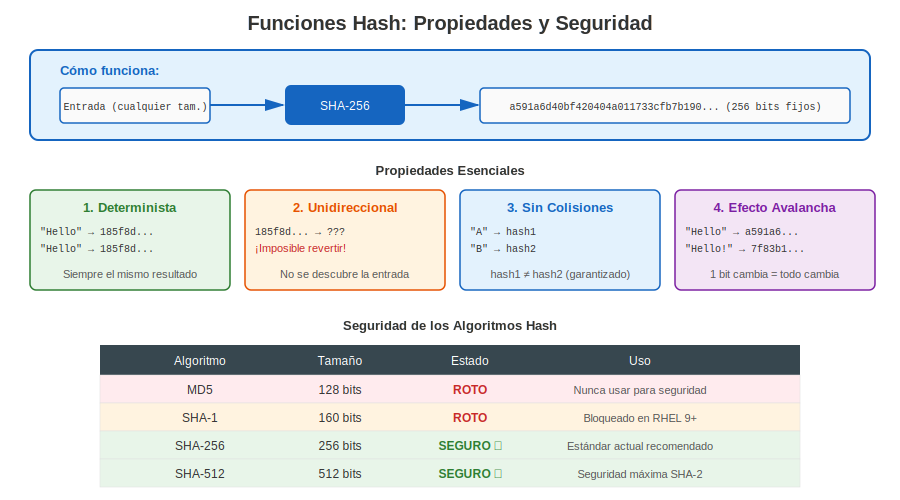
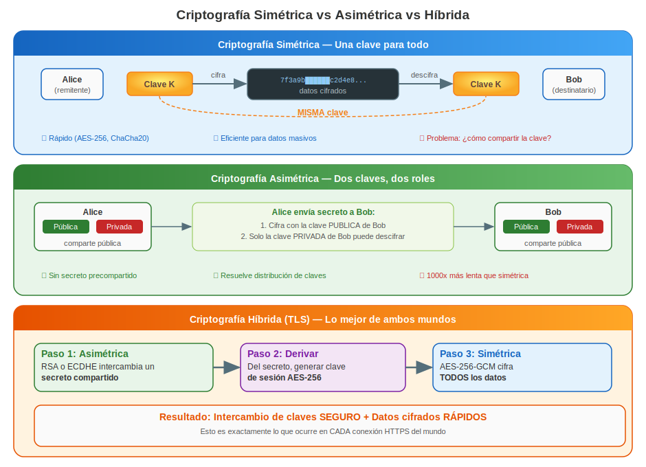
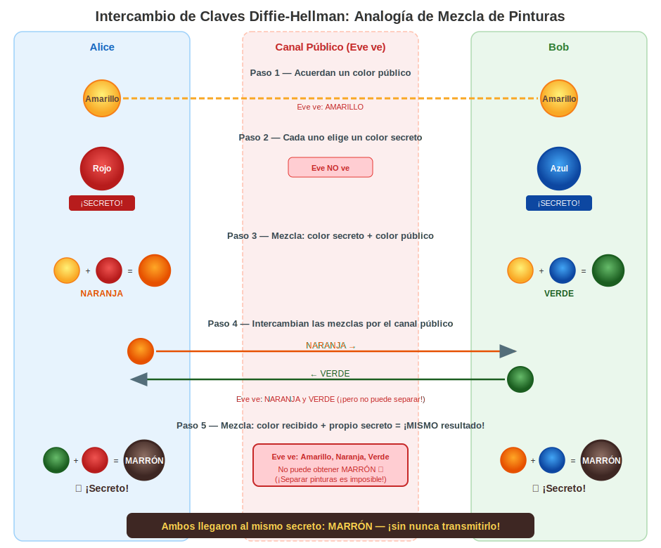
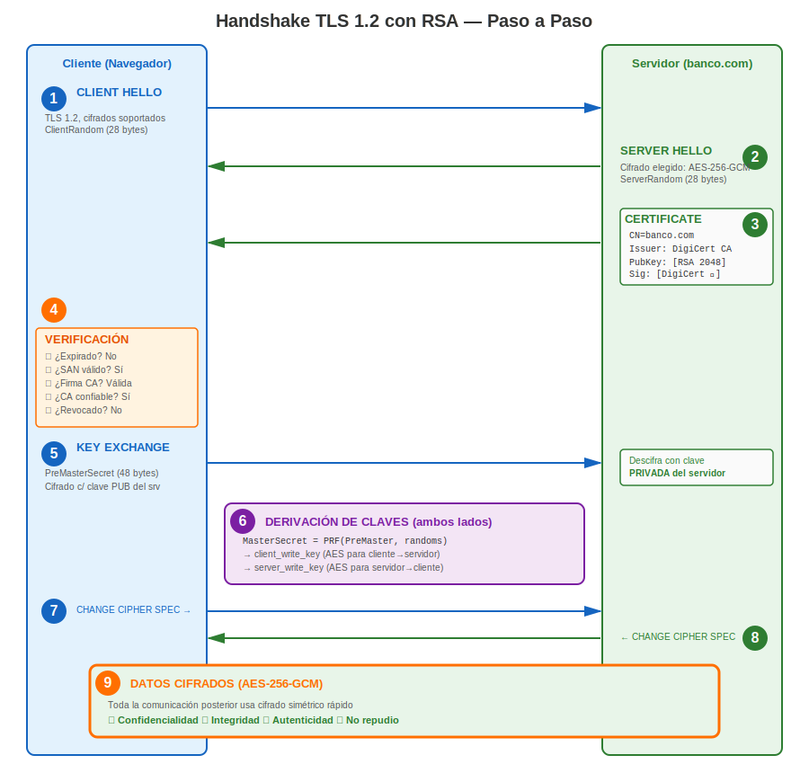
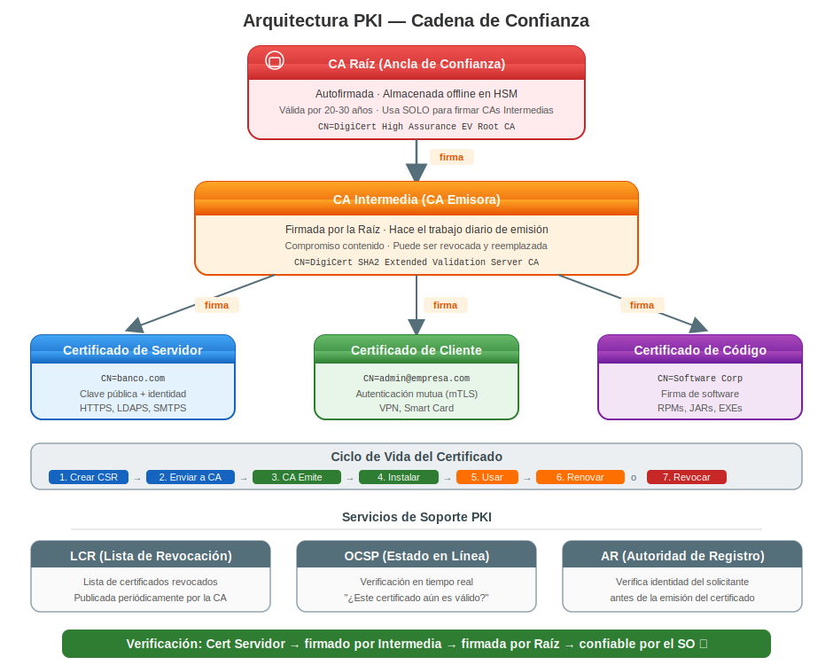
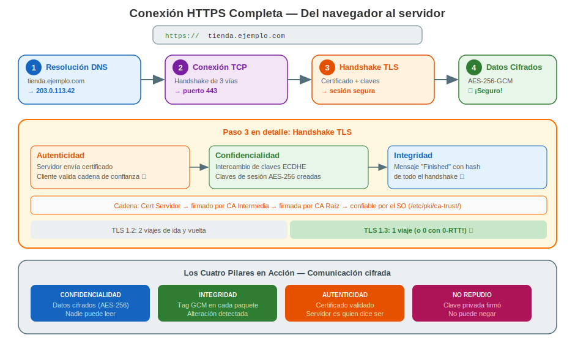

# Capítulo 1: Criptografía, Estructura PKI y Fundamentos

> **Antes de Empezar:** Este capítulo construye la base conceptual que necesitas antes de tocar un solo certificado. Al finalizar, entenderás *por qué* existe la criptografía, *cómo* funciona a nivel práctico, y *qué* ocurre detrás de escena cuando dos máquinas establecen una conexión segura.

---

## 1.1 ¿Por Qué Usar Criptografía?

Imagina enviar una postal. Cualquier persona que la manipule—carteros, vecinos, desconocidos—puede leerla. Ahora imagina que la postal contiene tu contraseña bancaria. Así es como se ve el tráfico de red sin cifrar.

Cada paquete que viaja por una red puede ser **interceptado**, **leído**, **modificado** o **falsificado**. Sin criptografía:

| Amenaza | Qué ocurre | Ejemplo real |
|---------|-----------|--------------|
| **Espionaje** | El atacante lee tus datos | Captura de contraseñas en Wi-Fi público |
| **Alteración** | El atacante modifica datos en tránsito | Inyección de malware en descarga de software |
| **Suplantación** | El atacante finge ser otra persona | Sitio bancario falso recopilando credenciales |
| **Repudio** | El remitente niega haber enviado un mensaje | Negar una transacción financiera |

La criptografía resuelve **los cuatro** problemas. No es opcional en sistemas modernos—es la base de toda comunicación segura.

---

## 1.2 Los Cuatro Pilares de la Seguridad de la Información

La criptografía proporciona cuatro garantías fundamentales. Todo sistema seguro depende de una combinación de estas:

### Confidencialidad — "Solo tú puedes leer esto"

La confidencialidad asegura que los datos son legibles **únicamente por el destinatario previsto**. Incluso si un atacante intercepta los datos, solo ve ruido sin sentido.

**Cómo se implementa:**
- **Cifrado simétrico** (AES-256): La misma clave cifra y descifra. Rápido, usado para datos masivos.
- **Cifrado asimétrico** (RSA, ECC): La clave pública cifra, la clave privada descifra. Usado para intercambio de claves.

**Contra qué protege:** Espionaje.

### Integridad — "Esto no ha sido alterado"

La integridad garantiza que los datos **no han sido alterados** entre remitente y destinatario. Si un solo bit cambia, la modificación se detecta.

**Cómo se implementa:**
- **Funciones hash** (SHA-256): Producen una huella digital de tamaño fijo de los datos.
- **HMAC**: Hash combinado con una clave secreta para integridad autenticada.
- **Firmas digitales**: Hash firmado con una clave privada.

```
 Original:  "Transferir $100 a Bob"  → SHA-256 → a1b2c3d4...
 Alterado:  "Transferir $900 a Bob"  → SHA-256 → f7e8d9c0...  ← ¡DIFERENTE!
```

**Contra qué protege:** Alteración.

### Autenticidad — "Eres quien dices ser"

La autenticidad prueba la **identidad de la parte comunicante**. Cuando te conectas al sitio de tu banco, necesitas la seguridad de que realmente es tu banco, no un impostor.

**Cómo se implementa:**
- **Certificados digitales** (X.509): Vinculan una clave pública a una identidad.
- **Autoridades Certificadoras (CAs)**: Terceros de confianza que verifican identidades.
- **Firmas digitales**: Prueban que un mensaje fue creado por el remitente declarado.

**Contra qué protege:** Suplantación.

### No Repudio — "No puedes negar esto"

El no repudio asegura que el remitente **no puede negar** haber enviado un mensaje o realizado una acción. Es el equivalente digital de una firma manuscrita en un contrato.

**Cómo se implementa:**
- **Firmas digitales con claves privadas**: Solo el poseedor de la clave puede producir la firma.
- **Sellado de tiempo**: Prueba cuándo ocurrió una acción.
- **Registros de auditoría con integridad criptográfica**: Registros a prueba de manipulación.

**Contra qué protege:** Repudio (negar responsabilidad).



### Resumen: Los Cuatro Pilares

| Pilar | Pregunta que responde | Implementado por | Protege contra |
|-------|----------------------|-----------------|----------------|
| **Confidencialidad** | ¿Alguien más puede leerlo? | Cifrado (AES, RSA) | Espionaje |
| **Integridad** | ¿Ha sido modificado? | Hashes (SHA-256), HMAC | Alteración |
| **Autenticidad** | ¿Quién lo envió? | Certificados, firmas | Suplantación |
| **No repudio** | ¿Puede el remitente negarlo? | Firmas digitales | Repudio |

---

## 1.3 Funciones Hash: Huellas Digitales de Datos

Una función hash toma una entrada de **cualquier tamaño** y produce una salida de **tamaño fijo**. Piensa en ella como una huella dactilar para datos.



### Propiedades y Ejemplos

**1. Determinista** — La misma entrada siempre produce la misma salida.
```
SHA-256("Hello") → 185f8db32271...  (siempre)
SHA-256("Hello") → 185f8db32271...  (siempre)
```

**2. Unidireccional (Resistencia a Preimagen)** — No es posible descubrir la entrada a partir de la salida.
```
185f8db32271... → ???  (computacionalmente inviable encontrar la entrada)
```

**3. Resistente a Colisiones** — Es prácticamente imposible encontrar dos entradas diferentes que produzcan la misma salida.
```
SHA-256("entrada A") → hash1
SHA-256("entrada B") → hash2
hash1 ≠ hash2  (con probabilidad abrumadora)
```

**4. Efecto Avalancha** — Un cambio mínimo en la entrada produce una salida completamente diferente.
```
SHA-256("Hello World")  → a591a6d40bf420404a011733cfb7b190...
SHA-256("Hello World!") → 7f83b1657ff1fc53b92dc18148a1d65d...
                                     ↑ ¡completamente diferente!
```

### ¿Son Seguros los Hashes?

No todos los algoritmos hash son iguales. Algunos han sido **rotos**:

| Algoritmo | Tamaño de Salida | Estado | Por qué |
|-----------|-----------------|--------|---------|
| **MD5** | 128 bits | **ROTO** | Colisiones encontradas en segundos. Nunca usar para seguridad. |
| **SHA-1** | 160 bits | **ROTO** | Google demostró colisión práctica en 2017 (SHAttered). |
| **SHA-256** | 256 bits | **SEGURO** | Sin ataques prácticos conocidos. Estándar actual. |
| **SHA-384** | 384 bits | **SEGURO** | Mayor margen de seguridad. |
| **SHA-512** | 512 bits | **SEGURO** | Seguridad máxima de la familia SHA-2. |
| **SHA-3** | 256+ bits | **SEGURO** | Diseño diferente (Keccak). Alternativa a prueba de futuro. |
| **BLAKE2** | 256+ bits | **SEGURO** | Muy rápido, usado en aplicaciones modernas. |

**"Roto" significa:** Un atacante puede encontrar dos entradas diferentes que producen el mismo hash (colisión). Esto permite falsificar documentos, certificados o firmas.

```bash
# Verifícalo tú mismo — calcula hashes en cualquier sistema RHEL:
echo -n "Hello World" | sha256sum
# a591a6d40bf420404a011733cfb7b190d62c65bf0bcda32b57b277d9ad9f146e

echo -n "Hello World" | md5sum
# b10a8db164e0754105b7a99be72e3fe5  ← ¡NO confíes en esto para seguridad!
```

### Usos Reales de los Hashes

| Caso de uso | Cómo | Ejemplo |
|-------------|------|---------|
| **Almacenamiento de contraseñas** | Almacena el hash, no la contraseña | `/etc/shadow` en Linux |
| **Integridad de archivos** | Compara hash antes/después | `sha256sum paquete.rpm` |
| **Firmas digitales** | Firma el hash, no los datos | Firma de certificados |
| **Deduplicación** | Identifica archivos idénticos | Sistemas de respaldo |
| **Blockchain** | Cadena de hashes | Prueba de trabajo de Bitcoin |

---

## 1.4 Criptografía Simétrica vs Asimétrica



### Simétrica: Una Clave para Todo

Remitente y destinatario comparten la **misma clave secreta**. Como un candado donde ambas partes tienen una copia de la misma llave.

| Propiedad | Valor |
|-----------|-------|
| **Velocidad** | Muy rápida (AES acelerado por hardware) |
| **Tamaño de clave** | 128 o 256 bits |
| **Problema** | ¿Cómo compartir la clave de forma segura? |
| **Ejemplos** | AES-128, AES-256, ChaCha20 |

### Asimétrica: Dos Claves, Dos Roles

Cada parte tiene un **par de claves**: una clave pública (comparte libremente) y una clave privada (nunca la compartas).

| Propiedad | Valor |
|-----------|-------|
| **Velocidad** | Lenta (1000x más lenta que la simétrica) |
| **Tamaño de clave** | 2048–4096 bits (RSA) o 256 bits (ECC) |
| **Ventaja** | No necesita compartir clave secreta previamente |
| **Ejemplos** | RSA, ECDSA, Ed25519 |

### Por Qué Necesitamos Ambas: Cifrado Híbrido

La criptografía asimétrica resuelve el problema de distribución de claves, pero es demasiado lenta para datos masivos. La solución: usar asimétrica para intercambiar una clave simétrica, luego usar simétrica para los datos.

Esto es exactamente lo que ocurre en cada conexión HTTPS.

---

## 1.5 Entendiendo el Intercambio de Claves: La Analogía de Mezcla de Colores

Antes de sumergirnos en el handshake TLS/RSA real, construyamos una intuición con una analogía visual. Esto explica el **intercambio de claves Diffie-Hellman**, el mecanismo usado en TLS moderno para establecer un secreto compartido.

### El Problema

Alice y Bob quieren acordar un **color secreto compartido** que Eve (la espía) no pueda descifrar, aunque Eve pueda ver todo lo que se envían entre sí.



### Por Qué Eve No Puede Hacer Trampa

Mezclar pintura es **fácil de hacer** pero **imposible de revertir**. No se puede separar pintura mezclada en sus componentes originales. En matemáticas, esto es análogo a:

- **Fácil:** Multiplicar dos primos grandes → obtener un producto (mezclar)
- **Difícil:** Factorizar un producto grande → encontrar los primos (separar)

Esta es la **función unidireccional** que hace funcionar la criptografía.

### De Colores a Números

| Analogía de Colores | Equivalente Criptográfico |
|--------------------|--------------------------|
| Color público (Amarillo) | Parámetros públicos (primo grande, generador) |
| Secreto de Alice (Rojo) | Clave privada de Alice |
| Secreto de Bob (Azul) | Clave privada de Bob |
| Color mezclado enviado (Naranja/Verde) | Clave pública (calculada desde la privada) |
| Secreto final compartido (Marrón) | Clave de sesión compartida |
| "No se puede separar la pintura" | El problema del logaritmo discreto es computacionalmente difícil |

---

## 1.6 El Handshake TLS: Cómo Funciona Realmente una Conexión Segura

Ahora veamos qué ocurre realmente cuando tu navegador se conecta a `https://banco.com`. Esto combina **todo** lo que hemos aprendido: hashes, criptografía asimétrica, criptografía simétrica, certificados e intercambio de claves.



### Recorrido Paso a Paso

**Pasos 1-2 (Hello):** Cliente y servidor intercambian capacidades y números aleatorios. Estos números aleatorios añaden frescura — garantizan que cada sesión es única, incluso entre las mismas partes.

**Paso 3 (Certificate):** El servidor prueba su identidad enviando su certificado X.509 que contiene su clave pública.

**Paso 4 (Verificación):** Este es el paso crítico de confianza. El cliente recorre la **cadena de confianza**:

Cada firma se verifica usando la **clave pública del emisor**. Si cualquier eslabón se rompe, el handshake falla.

**Paso 5 (Intercambio de Claves):** El cliente genera 48 bytes aleatorios (PreMasterSecret), los cifra con la clave pública RSA del servidor y los envía. Solo la clave privada del servidor puede descifrar — esta es la magia asimétrica.

**Paso 6 (Derivación de Claves):** Ambos lados calculan independientemente las mismas claves de sesión usando una Función Pseudo-Aleatoria (PRF). Aquí es donde transitamos de asimétrica lenta a simétrica rápida.

**Pasos 7-9 (Comunicación Cifrada):** A partir de aquí, todo se cifra con AES-256 — miles de veces más rápido que RSA.

### TLS 1.3 Moderno: Más Simple y Rápido

TLS 1.3 simplificó el handshake eliminando el intercambio de claves RSA (el secreto perfecto hacia adelante ahora es obligatorio) y reduciendo viajes de ida y vuelta:

---

## 1.7 Estructura PKI: La Arquitectura de Confianza

Infraestructura de Clave Pública (PKI) es el sistema que gestiona certificados digitales y claves públicas. Responde a la pregunta: **"¿Cómo sé que esta clave pública realmente pertenece a banco.com?"**



### ¿Por Qué una Cadena?

Las CAs Raíz son **extremadamente valiosas** — si se comprometen, cada certificado que hayan firmado se vuelve no confiable. Por eso las CAs Raíz son:
- Almacenadas en módulos de seguridad de hardware (HSMs) fuera de línea, aislados de la red
- Usadas solo para firmar certificados de CAs Intermedias
- Válidas por 20-30 años

Las CAs Intermedias hacen el trabajo diario de emitir certificados. Si se comprometen:
- Solo los certificados de esa Intermedia se ven afectados
- La Raíz puede revocar la Intermedia y crear una nueva
- El daño queda contenido

### Revocación: Qué Ocurre Cuando la Confianza se Rompe

Cuando una clave privada se compromete o un certificado ya no debe ser confiable:

| Método | Cómo funciona | Compensación |
|--------|-------------|-------------|
| **LCR** (Lista de Certificados Revocados) | La CA publica lista de números de serie revocados | Puede estar desactualizada (se actualiza periódicamente) |
| **OCSP** (Protocolo de Estado de Certificado en Línea) | El cliente pregunta a la CA "¿este cert aún es válido?" en tiempo real | Requiere red, preocupación de privacidad |
| **OCSP Stapling** | El servidor obtiene su propia respuesta OCSP y la adjunta al handshake | Lo mejor de ambos mundos |

---

## 1.8 Uniendo Todo: Un Ejemplo Completo

Rastreemos una conexión HTTPS completa de principio a fin, viendo cada concepto en acción:



---

## 1.9 Conclusiones Principales

Antes de avanzar a la gestión de certificados específica de RHEL, asegúrate de entender:

| Concepto | Resumen en una frase |
|----------|---------------------|
| **Hashes** | Huellas digitales unidireccionales que detectan cualquier cambio (usa SHA-256+). |
| **Cifrado simétrico** | La misma clave cifra y descifra — rápido, pero distribución de clave es difícil. |
| **Cifrado asimétrico** | Pares de claves pública/privada — resuelve distribución, pero es lento. |
| **Cifrado híbrido** | Usa asimétrico para intercambiar claves, luego simétrico para datos (TLS hace esto). |
| **Firmas digitales** | Hash + clave privada = prueba de identidad e integridad. |
| **Certificados** | Vinculan una clave pública a una identidad, firmados por una CA de confianza. |
| **PKI** | La arquitectura de confianza: CA Raíz → CA Intermedia → Certificado entidad final. |
| **Handshake TLS** | Autentica servidor, intercambia claves, luego cifra todo. |
| **Secreto hacia adelante** | Usa claves efímeras (ECDHE) para que sesiones pasadas permanezcan seguras. |

---

**Navegación del Capítulo**

| | [Siguiente: Capítulo 2 - Introducción a los Certificados en RHEL →](02-intro.html) |
|:---|---:|
