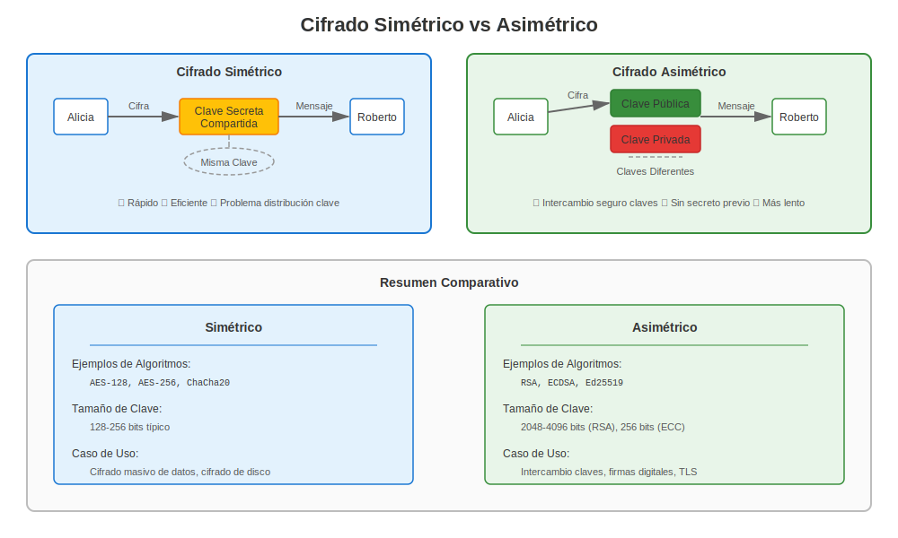
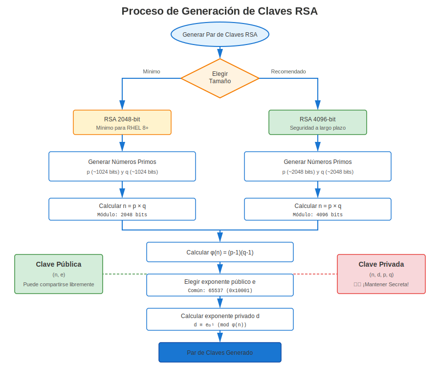
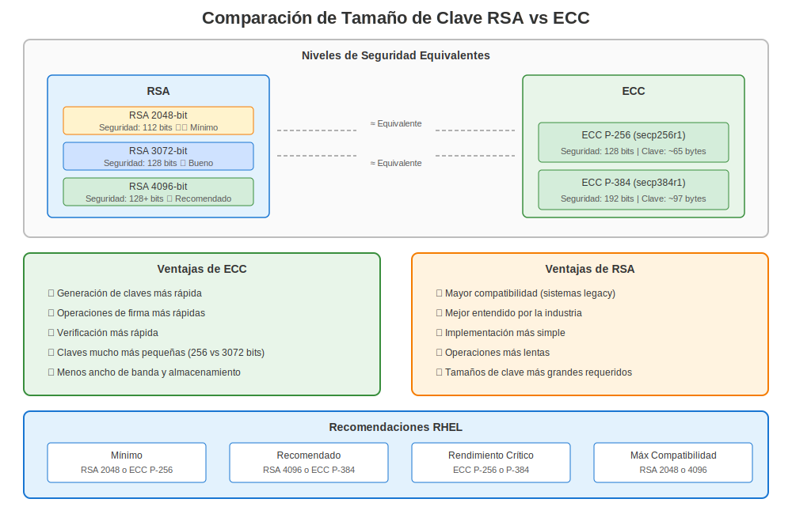

# Capítulo 4: Criptografía Básica para Administradores RHEL

> **Enfoque Práctico:** Aprende los conceptos de criptografía que necesitas para gestionar certificados en RHEL - ¡no se requiere un doctorado!

## 4.1 Simétrica vs Asimétrica



La criptografía simétrica (ej. AES) se basa en un *único* secreto compartido. En contraste, la criptografía asimétrica proporciona dos claves complementarias:

* **Clave pública** — compártela libremente, usada para cifrado o verificación de firma.
* **Clave privada** — mantenla secreta, usada para descifrado o firma.

## 4.2 RSA en Pocas Palabras



1. Selecciona dos números primos grandes *p* y *q*.
2. Calcula el módulo `n = p × q`.
3. Deriva el exponente público `e` y el exponente privado `d` tal que `e × d ≡ 1 (mod φ(n))`.
4. El par `(n, e)` es público; `(n, d)` es privado.

La fortaleza deriva de la dificultad de factorizar *n*.

## 4.3 Criptografía de Curva Elíptica (ECC)



ECC ofrece seguridad comparable con tamaños de clave mucho más pequeños al operar sobre puntos en curvas elípticas. Las curvas populares incluyen `secp256r1` (P-256) y Curve25519.

| Algoritmo | Tamaño de clave para seguridad de 128 bits |
|-----------|---------------------------------------------|
| RSA | 3072 bits |
| ECC | 256 bits |

## 4.4 Laboratorio de Generación de Claves (OpenSSL)

```bash
# Generar clave privada RSA de 3072 bits
openssl genpkey -algorithm RSA -pkeyopt rsa_keygen_bits:3072 -out rsa.key.pem

# Extraer clave pública
openssl pkey -in rsa.key.pem -pubout -out rsa.pub.pem

# Generar par de claves EC P-256
openssl ecparam -genkey -name prime256v1 -out ec.key.pem
openssl pkey -in ec.key.pem -pubout -out ec.pub.pem
```

Reutilizaremos estas claves en capítulos posteriores para crear certificados.

## 4.5 Cifrado Híbrido

En TLS, una clave de sesión simétrica se intercambia *usando* criptografía asimétrica (RSA o ECDHE). Esto proporciona lo mejor de ambos mundos: eficiencia e intercambio seguro de claves.

---

## 4.6 Consideraciones Específicas de RHEL

### Generación de Claves en RHEL por Versión

**RHEL 7 (OpenSSL 1.0.2k):**
```bash
# Estilo antiguo (aún funciona en todas las versiones)
openssl genrsa -out server.key 2048

# Extraer clave pública
openssl rsa -in server.key -pubout -out server.pub
```

**RHEL 8+ (OpenSSL 1.1.1k / 3.5.5):**
```bash
# Estilo moderno (recomendado)
openssl genpkey -algorithm RSA -out server.key -pkeyopt rsa_keygen_bits:2048

# Extraer clave pública
openssl pkey -in server.key -pubout -out server.pub
```

### Tamaños Mínimos de Clave por Versión de RHEL

| Versión RHEL | RSA Mínimo | ECC Mínimo | Aplicado Por |
|--------------|------------|------------|--------------|
| RHEL 7 | Ninguno (débil permitido) | Ninguno | Configuración manual |
| RHEL 8 | 2048 bits | P-256 | crypto-policy DEFAULT |
| RHEL 9 | 2048 bits | P-256 | crypto-policy DEFAULT |
| RHEL 10 | 2048 bits | P-256 | crypto-policy DEFAULT |

**Recomendación:** ¡Siempre usa RSA 2048+ o ECC P-256+ para compatibilidad!

### Pruebas en RHEL

```bash
# Generar par de claves de prueba (RHEL 8+)
openssl genpkey -algorithm RSA -out test.key -pkeyopt rsa_keygen_bits:2048

# Verificar clave
openssl pkey -in test.key -text -noout

# Crear datos de prueba
echo "Hola RHEL" > message.txt

# Firmar con clave privada
openssl dgst -sha256 -sign test.key -out message.sig message.txt

# Verificar con clave pública
openssl dgst -sha256 -verify test.pub -signature message.sig message.txt
# Verified OK
```

---

## Referencia Rápida

```
┌─────────────────────────────────────────────────────────────┐
│ CRIPTOGRAFÍA PARA ADMINISTRADORES RHEL                      │
├─────────────────────────────────────────────────────────────┤
│ Asimétrica:   Clave pública (compartir) + Privada (secreta) │
│ Algoritmos:   RSA, ECC (Curva Elíptica)                     │
│                                                             │
│ Tamaños RSA:  2048 bits (mínimo en RHEL 8+)                 │
│               4096 bits (recomendado)                       │
│                                                             │
│ Curvas ECC:   P-256 (secp256r1) - mínimo                    │
│               P-384 (secp384r1) - recomendado               │
│                                                             │
│ RHEL 7:       openssl genrsa -out key 2048                  │
│ RHEL 8/9/10:  openssl genpkey -algorithm RSA -out key       │
│                                                             │
│ Caso de uso:  Certificados TLS/SSL                          │
│ Seguridad:    Clave privada DEBE protegerse (chmod 600)     │
└─────────────────────────────────────────────────────────────┘
```

---

## 🧪 Laboratorio Práctico

**Lab 02: Generación de Claves**

Practica la generación de pares de claves criptográficas en este ejercicio práctico

- 📁 **Ubicación:** `labs/es_ES/02-key-generation/`
- ⏱️ **Tiempo:** 20-25 minutos
- 🎯 **Nivel:** Principiante

---

**Navegación del Capítulo**

| [← Anterior: Capítulo 3 - Resumen de Herramientas de Certificados en RHEL](03-rhel-tools-overview.md) | [Siguiente: Capítulo 5 - Certificados X.509 en RHEL →](05-x509-on-rhel.md) |
|:---|---:|
