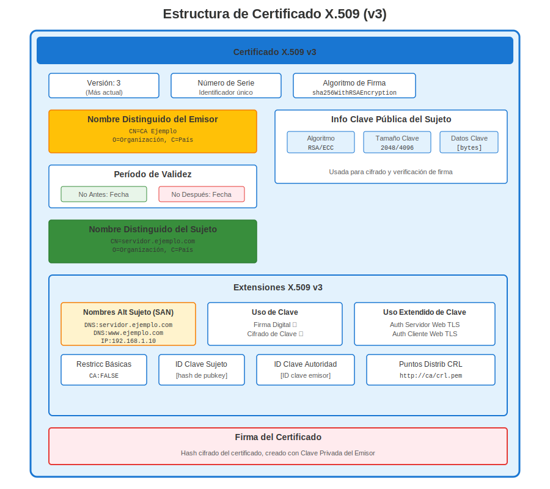
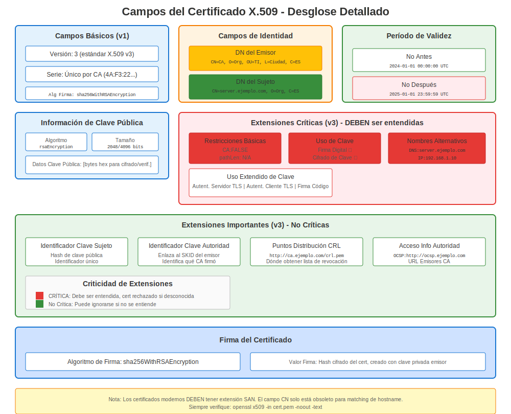
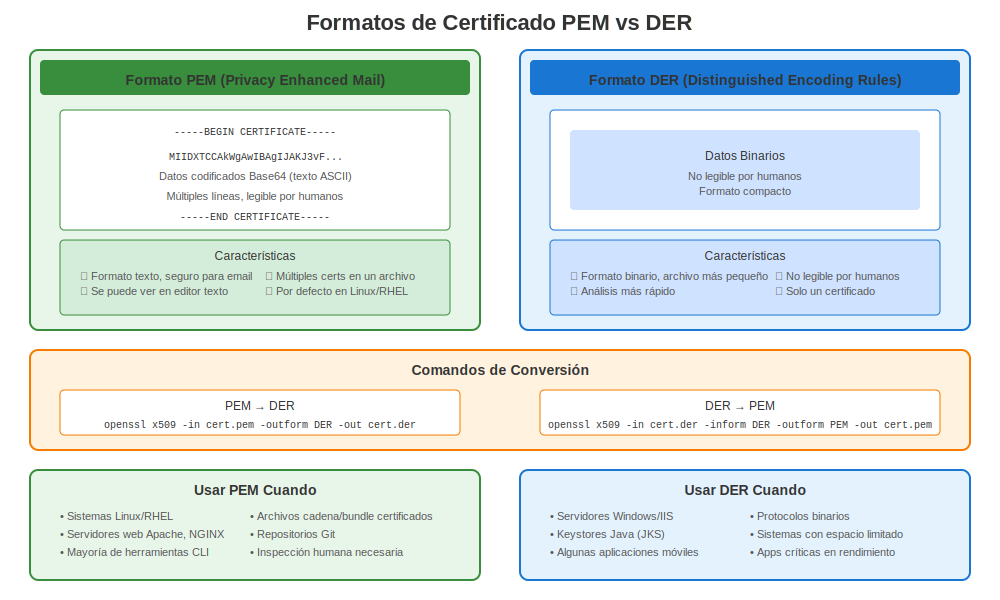

# Capítulo 5: Certificados X.509 en RHEL

> **Formato Estándar:** X.509 es el estándar de certificados usado en todas partes en RHEL. Aprende su estructura y cómo trabajar con él en sistemas Red Hat.

## 5.1 Orígenes del Estándar

X.509 surgió del proyecto de directorio X.500 (ITU-T, 1988) para definir un *certificado de identidad* estándar—un documento que vincula una clave pública a un nombre de sujeto, firmado por una autoridad confiable.

## 5.2 Anatomía del Certificado



| Campo | Propósito |
|-------|-----------|
| Version | Usualmente v3 (agrega extensiones) |
| Serial Number | Único por CA |
| Signature Algorithm | ej. `sha256WithRSAEncryption` |
| Issuer | Nombre Distinguido (DN) de CA |
| Validity | Fechas `Not Before` y `Not After` |
| Subject | DN de la entidad (CN, O, C…) |
| Subject Public Key Info | Algoritmo + Clave |
| Extensions | Key Usage, SAN, CRL DP, etc. |
| Signature | Firma digital de la CA |



## 5.3 Extensiones Comunes

* **Subject Alternative Name (SAN)** — Hosts/IPs vinculados al cert.
* **Key Usage / Extended Key Usage** — Operaciones permitidas (servidor TLS, firma de código…).
* **Basic Constraints** — Indica si el cert puede firmar otros (`CA:TRUE`).

## 5.4 Ver un Certificado

```bash
openssl x509 -in server.crt -noout -text
```

Observa que cada sección coincide con la tabla anterior.

## 5.5 Codificaciones PEM vs DER



* **PEM** — Base64 + encabezados `-----BEGIN CERTIFICATE-----` (más común en RHEL).
* **DER** — ASN.1 binario, útil para dispositivos embebidos.

---

## 5.6 X.509 en Sistemas RHEL

### Ubicaciones de Certificados en RHEL

```bash
# Ubicaciones estándar de certificados en RHEL
/etc/pki/tls/certs/          # Certificados de servidor (públicos)
/etc/pki/tls/private/        # Claves privadas (¡modo 600!)
/etc/pki/ca-trust/           # Certificados CA confiables
/etc/pki/nssdb/              # Base de datos NSS (Firefox, etc.)

# Ubicaciones específicas de servicios
/etc/httpd/conf/ssl.crt/     # Apache (alternativa)
/etc/nginx/certs/            # NGINX (personalizado)
/var/lib/pgsql/data/         # PostgreSQL
/etc/openldap/certs/         # OpenLDAP
```

### Ver Certificados en RHEL

```bash
# Ver detalles completos del certificado
openssl x509 -in /etc/pki/tls/certs/server.crt -noout -text

# Verificaciones rápidas (enfoque sysadmin RHEL)
openssl x509 -in server.crt -noout -subject             # ¿Para quién es?
openssl x509 -in server.crt -noout -issuer              # ¿Quién lo firmó?
openssl x509 -in server.crt -noout -dates               # ¿Cuándo es válido?
openssl x509 -in server.crt -noout -ext subjectAltName  # SANs (¡crítico!)

# Verificar si expiró
openssl x509 -in server.crt -noout -checkend 0
# Exit 0 = válido, Exit 1 = expirado
```

### Diferencias de Versión RHEL para X.509

| Versión RHEL | OpenSSL | Rigurosidad de Validación | Cambios Clave |
|--------------|---------|---------------------------|---------------|
| **RHEL 7** | 1.0.2k | Estándar | SANs recomendados |
| **RHEL 8** | 1.1.1k | Más estricto | SANs fuertemente recomendados |
| **RHEL 9** | 3.5.5 | Muy estricto | SANs requeridos, SHA-1 bloqueado |
| **RHEL 10** | 3.5.5 | Muy estricto | Igual que RHEL 9 |

**Punto Clave:** Los navegadores modernos y RHEL 9+ **requieren** SANs (Subject Alternative Names)!

### Crear Certificados X.509 en RHEL

```bash
# Flujo de trabajo completo en RHEL

# Paso 1: Generar clave privada
openssl genpkey -algorithm RSA -out server.key -pkeyopt rsa_keygen_bits:2048

# Paso 2: Crear CSR (Solicitud de Firma de Certificado)
openssl req -new -key server.key -out server.csr \
  -subj "/C=US/ST=State/O=Company/CN=server.example.com" \
  -addext "subjectAltName=DNS:server.example.com,DNS:www.example.com"

# Paso 3: Autofirmado (¡solo para pruebas!)
openssl x509 -req -days 365 -in server.csr -signkey server.key -out server.crt

# Paso 4: Ver tu certificado X.509
openssl x509 -in server.crt -noout -text

# Paso 5: Instalar en RHEL
sudo cp server.crt /etc/pki/tls/certs/
sudo cp server.key /etc/pki/tls/private/
sudo chmod 600 /etc/pki/tls/private/server.key
```

---

## Referencia Rápida

```
┌─────────────────────────────────────────────────────────────────────┐
│ CERTIFICADOS X.509 EN RHEL                                          │
├─────────────────────────────────────────────────────────────────────┤
│ Estándar:      X.509 v3 (con extensiones)                           │
│ Codificación:  PEM (Base64, legible por humanos)                    │
│                                                                     │
│ Ver:           openssl x509 -in cert.crt -noout -text               │
│ Sujeto:        openssl x509 -in cert.crt -noout -subject            │
│ Expiración:    openssl x509 -in cert.crt -noout -dates              │
│ SANs:          openssl x509 -in cert.crt -noout -ext subjectAltName │
│                                                                     │
│ Ubicación:     /etc/pki/tls/certs/ (certificados)                   │
│                /etc/pki/tls/private/ (claves, ¡modo 600!)           │
│                                                                     │
│ Crítico:       SANs son REQUERIDOS en RHEL 9+                       │
│                Firma SHA-256+ requerida en RHEL 8+                  │
└─────────────────────────────────────────────────────────────────────┘
```

---

## 🧪 Laboratorio Práctico

**Lab 04: Certificados X.509**

Crea certificados autofirmados, genera CSRs, inspecciona certificados y convierte formatos

- 📁 **Ubicación:** `labs/es_ES/04-x509-certificates/`
- ⏱️ **Tiempo:** 25-30 minutos
- 🎯 **Nivel:** Principiante

---

**Navegación del Capítulo**

| [← Anterior: Capítulo 4 - Criptografía Básica para Administradores RHEL](04-basic-cryptography.md) | [Siguiente: Capítulo 6 - Inmersión Profunda en el Almacén de Confianza de RHEL →](06-rhel-trust-store.md) |
|:---|---:|
