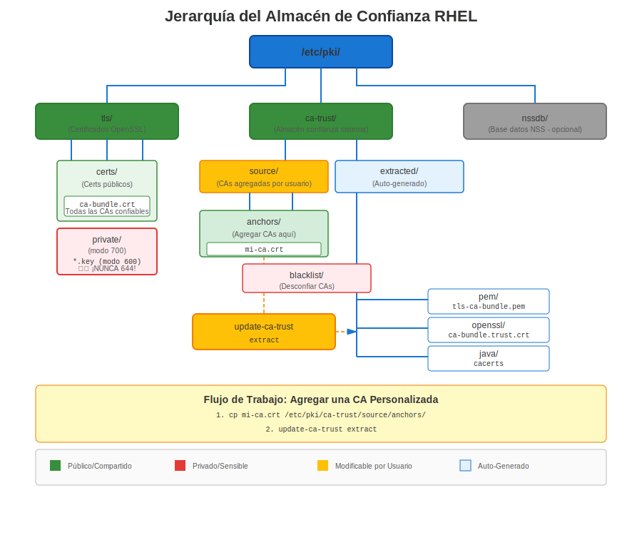
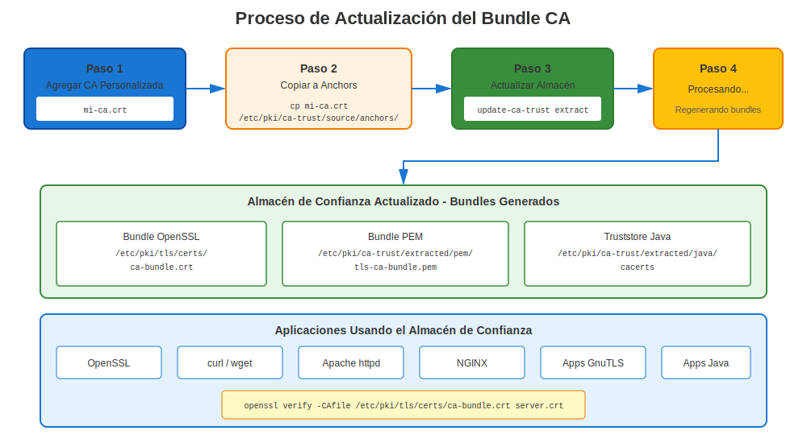

# Capítulo 6: Inmersión Profunda en el Almacén de Confianza de RHEL

> **Arquitectura de Confianza:** Entender cómo RHEL valida certificados y gestiona CAs confiables es esencial para resolver problemas de certificados. Este capítulo va más allá de lo básico: cubre la mecánica interna de `update-ca-trust`, cómo p11-kit procesa las fuentes de confianza, qué sucede con los certificados duplicados y cómo depurar problemas de confianza con `trust list`.

## 6.1 Arquitectura del Almacén de Confianza de RHEL



### Cómo RHEL Valida Certificados

Cuando cualquier aplicación en RHEL valida un certificado:

1. **Verificar firma del certificado** usando la clave pública del emisor
2. **Encontrar certificado del emisor** en el almacén de confianza
3. **Repetir hasta alcanzar la CA raíz** confiable
4. **Verificar que la CA raíz es confiable** por el sistema RHEL

**Ubicación del almacén de confianza:** `/etc/pki/ca-trust/`

### El Rol de p11-kit

El almacén de confianza de RHEL no es un archivo plano que las aplicaciones leen directamente. Es un sistema gestionado construido sobre **p11-kit**, que proporciona un módulo de confianza PKCS#11. Los componentes clave son:

| Componente | Rol |
|------------|-----|
| `p11-kit` | Middleware que carga módulos de confianza y los expone vía PKCS#11 |
| `p11-kit-trust` | El módulo de confianza (`/usr/lib64/pkcs11/p11-kit-trust.so`) que lee los certificados fuente |
| `update-ca-trust` | Script de shell que invoca `p11-kit extract` para regenerar los paquetes extraídos |
| `trust` | Interfaz CLI para inspeccionar y modificar objetos de confianza gestionados por p11-kit |

Aplicaciones como `curl`, `wget`, OpenSSL, GnuTLS y NSS consumen los paquetes **extraídos**. Nunca leen los directorios fuente directamente.

---

## 6.2 Estructura de Directorios del Almacén de Confianza

**RHEL 7/8:**
```
/etc/pki/ca-trust/
├── source/
│   ├── anchors/                   ← Certificados CA confiables agregados por el administrador
│   ├── blacklist/                 ← Certificados desconfiados agregados por el administrador
│   └── ca-bundle.legacy.crt       ← Paquete heredado (solo compatibilidad)
├── extracted/
│   ├── pem/
│   │   ├── tls-ca-bundle.pem      ← Para clientes TLS (curl, wget, Python...)
│   │   ├── email-ca-bundle.pem    ← Para validación de correo S/MIME
│   │   └── objsign-ca-bundle.pem  ← Para verificación de firma de código
│   ├── openssl/
│   │   └── ca-bundle.trust.crt    ← Formato "certificado confiable" de OpenSSL
│   ├── java/
│   │   └── cacerts                ← Keystore JKS de Java
│   └── edk2/
│       └── cacerts.bin            ← Formato de firmware UEFI
└── README

/usr/share/pki/ca-trust-source/
├── anchors/                       ← Anclas de confianza provistas por paquetes (desde RPMs)
├── blacklist/                     ← Certificados desconfiados provistos por paquetes
└── ca-bundle.trust.p11-kit        ← Paquete de CAs de Mozilla incluido por el RPM ca-certificates
```

**RHEL 9/10+:** El directorio `blacklist/` fue renombrado a `blocklist/`:
```
/etc/pki/ca-trust/
├── source/
│   ├── anchors/                   ← Certificados CA confiables agregados por el administrador
│   ├── blocklist/                 ← Certificados desconfiados agregados por el administrador
│   └── ca-bundle.legacy.crt       ← Paquete heredado (solo compatibilidad)
├── extracted/
│   └── (misma estructura que arriba)
└── README

/usr/share/pki/ca-trust-source/
├── anchors/                       ← Anclas de confianza provistas por paquetes (desde RPMs)
├── blocklist/                     ← Certificados desconfiados provistos por paquetes
└── ca-bundle.trust.p11-kit        ← Paquete de CAs de Mozilla incluido por el RPM ca-certificates
```

> **Convención de nombres:** A lo largo de este capítulo, `blacklist/` se refiere al nombre de directorio en RHEL 7/8 y `blocklist/` se refiere al nombre de directorio en RHEL 9/10+. Ambos cumplen el mismo propósito. Cuando veas una ruta como `source/blacklist/`, sustitúyela por `source/blocklist/` en RHEL 9+.

### Prioridad de Directorios Fuente

La cadena de procesamiento de `update-ca-trust` lee certificados de múltiples directorios fuente, procesados en un orden definido:

| Prioridad | Directorio | Gestionado por |
|-----------|-----------|----------------|
| 1 (más baja) | `/usr/share/pki/ca-trust-source/` | Paquetes RPM (`ca-certificates`) |
| 2 (más alta) | `/etc/pki/ca-trust/source/` | Administrador del sistema |

Dentro de cada ubicación:

- `anchors/` — Los certificados colocados aquí se tratan como **CAs confiables**
- `blacklist/` (RHEL 7/8) o `blocklist/` (RHEL 9+) — Los certificados colocados aquí se tratan como **explícitamente desconfiados**

Las rutas en `/etc/pki/` siempre anulan las rutas en `/usr/share/pki/`. Esto sigue la convención estándar de RHEL: `/usr/share/` contiene los valores predeterminados de paquetes, `/etc/` contiene las personalizaciones del administrador.

---

## 6.3 Qué Sucede Cuando Ejecutas `update-ca-trust`

### La Cadena de Ejecución

`update-ca-trust` es un script de shell (inspecciónalo tú mismo: `cat /usr/bin/update-ca-trust`). Cuando ejecutas `sudo update-ca-trust`, ocurre la siguiente secuencia:

**Paso 1: Recopilar todas las fuentes de confianza**

p11-kit lee cada archivo de certificado de estos directorios:

```
/usr/share/pki/ca-trust-source/anchors/
/usr/share/pki/ca-trust-source/blacklist/    ← RHEL 7/8
/usr/share/pki/ca-trust-source/blocklist/    ← RHEL 9+
/usr/share/pki/ca-trust-source/ca-bundle.trust.p11-kit
/etc/pki/ca-trust/source/anchors/
/etc/pki/ca-trust/source/blacklist/          ← RHEL 7/8
/etc/pki/ca-trust/source/blocklist/          ← RHEL 9+
```

Acepta formatos PEM (`.pem`, `.crt`), DER (`.der`) y objetos de confianza p11-kit (`.p11-kit`).

**Paso 2: Analizar atributos de confianza**

Para cada certificado, p11-kit determina su disposición de confianza. El formato PEM del archivo de certificado es relevante:

- **`-----BEGIN TRUSTED CERTIFICATE-----`** (formato "confiable" de OpenSSL) — Contiene el certificado **más** datos auxiliares de confianza: listas explícitas de OIDs de uso de clave confiados y rechazados. p11-kit lee estos atributos embebidos de confianza/rechazo directamente.
- **`-----BEGIN CERTIFICATE-----`** (PEM simple) o DER — Contiene **solo** el certificado sin metadatos de confianza. p11-kit asigna la confianza basándose únicamente en el directorio donde se coloca el archivo (`anchors/` = confiable, `blacklist/`/`blocklist/` = desconfiado).
- **Archivos en formato `.p11-kit`** — Contienen objetos de confianza PKCS#11 con atributos de grano fino (`trusted`, `x-distrusted`, OIDs de propósito). Utilizados por el archivo `ca-bundle.trust.p11-kit` incluido con el paquete `ca-certificates`.

> **Crítico:** Los formatos `BEGIN TRUSTED CERTIFICATE` y `BEGIN CERTIFICATE` **no son intercambiables**. Un archivo `BEGIN TRUSTED CERTIFICATE` lleva datos auxiliares de confianza — listas explícitas de OIDs de uso confiable y/o rechazado. Cuando no se listan usos (atributos de confianza vacíos), p11-kit lo interpreta como "confiable para nada" — efectivamente desconfiado. Si el mismo certificado también existe como `BEGIN CERTIFICATE` simple (que implica confianza para todos los propósitos), p11-kit detecta aserciones de confianza contradictorias y **marca el certificado como desconfiado**. Este conflicto ocurre en dos casos: (1) el `BEGIN TRUSTED CERTIFICATE` tiene usos rechazados explícitos, o (2) tiene atributos de confianza **vacíos** (ningún uso confiable, ningún uso rechazado). Ver Sección 6.6 para detalles.

**Paso 3: Fusionar y resolver conflictos**

Cuando el mismo certificado (identificado por su contenido codificado en DER) aparece en múltiples ubicaciones fuente, p11-kit aplica reglas de fusión:

1. **La desconfianza prevalece sobre la confianza.** Si un certificado aparece tanto en `anchors/` como en `blacklist/`/`blocklist/`, se desconfía de él.
2. **El administrador anula los paquetes.** Los atributos de confianza establecidos en `/etc/pki/ca-trust/source/` anulan los de `/usr/share/pki/ca-trust-source/`.
3. **Los atributos explícitos anulan los predeterminados.** Un archivo `.p11-kit` con restricciones de propósito específicas anula la confianza general otorgada a un PEM simple en `anchors/`.
4. **Los formatos de confianza en conflicto causan desconfianza.** Si el mismo certificado (huella digital idéntica) aparece como `BEGIN TRUSTED CERTIFICATE` (o `.p11-kit`) y como `BEGIN CERTIFICATE`, la desconfianza ocurre en **dos** casos:
   - El `BEGIN TRUSTED CERTIFICATE` tiene **usos rechazados explícitos** — el rechazo contradice la confianza implícita total del PEM simple.
   - El `BEGIN TRUSTED CERTIFICATE` tiene **atributos de confianza vacíos** (ningún uso confiable, ningún uso rechazado) — p11-kit interpreta "ningún uso listado" como "confiable para nada", lo que contradice el implícito "confiable para todos los propósitos" del PEM simple.

   En ambos casos, p11-kit **marca el certificado como desconfiado**.

> **Esta es la causa más común de desconfianza inesperada.** Un administrador copia un archivo PEM simple en `source/anchors/` sin darse cuenta de que el mismo certificado ya existe en `ca-bundle.trust.p11-kit` con atributos de uso rechazado o confianza vacía. El resultado: la CA queda desconfiada después de `update-ca-trust`, y los servicios que dependen de ella fallan silenciosamente.

**Paso 4: Extraer a paquetes específicos por formato**

p11-kit ejecuta comandos de extracción para cada formato de salida:

```bash
# Paquete PEM para TLS (el más comúnmente consumido)
p11-kit extract --format=pem-bundle \
    --filter=ca-anchors \
    --overwrite \
    --purpose=server-auth \
    /etc/pki/ca-trust/extracted/pem/tls-ca-bundle.pem

# Paquete PEM para correo (S/MIME)
p11-kit extract --format=pem-bundle \
    --filter=ca-anchors \
    --overwrite \
    --purpose=email-protection \
    /etc/pki/ca-trust/extracted/pem/email-ca-bundle.pem

# Paquete PEM para firma de código
p11-kit extract --format=pem-bundle \
    --filter=ca-anchors \
    --overwrite \
    --purpose=code-signing \
    /etc/pki/ca-trust/extracted/pem/objsign-ca-bundle.pem

# Formato "certificado confiable" de OpenSSL (incluye atributos de confianza/rechazo)
p11-kit extract --format=openssl-bundle \
    --filter=certificates \
    --overwrite \
    /etc/pki/ca-trust/extracted/openssl/ca-bundle.trust.crt

# Keystore de Java
p11-kit extract --format=java-cacerts \
    --filter=ca-anchors \
    --overwrite \
    --purpose=server-auth \
    /etc/pki/ca-trust/extracted/java/cacerts

# Formato UEFI EDK2
p11-kit extract --format=edk2-cacerts \
    --filter=ca-anchors \
    --overwrite \
    --purpose=server-auth \
    /etc/pki/ca-trust/extracted/edk2/cacerts.bin
```

**Paso 5: Actualizar enlaces simbólicos de compatibilidad**

El sistema mantiene enlaces simbólicos para que las rutas heredadas apunten a los paquetes extraídos:

```bash
/etc/pki/tls/certs/ca-bundle.crt → /etc/pki/ca-trust/extracted/pem/tls-ca-bundle.pem
/etc/pki/tls/certs/ca-bundle.trust.crt → /etc/pki/ca-trust/extracted/openssl/ca-bundle.trust.crt
/etc/pki/java/cacerts → /etc/pki/ca-trust/extracted/java/cacerts
```

### `update-ca-trust` vs `update-ca-trust extract`

Son **funcionalmente idénticos**. El script `update-ca-trust` acepta `extract` como subcomando, pero ejecutar `update-ca-trust` sin argumentos utiliza por defecto la acción `extract`. No hay diferencia en el comportamiento.

```bash
# Estos dos comandos producen resultados idénticos:
sudo update-ca-trust
sudo update-ca-trust extract
```

El subcomando `extract` existe para mayor explicitud en scripts y documentación. Históricamente, `update-ca-trust` también soportaba los subcomandos `enable` y `disable` (para alternar entre el nuevo almacén de confianza gestionado por p11-kit y el enfoque heredado de archivo plano), pero ya no son relevantes en sistemas RHEL modernos donde la gestión por p11-kit está siempre activa.

```bash
# Verificar estado actual (solo informativo en RHEL moderno)
update-ca-trust check
```

### Verificar Qué Cambió

Después de ejecutar `update-ca-trust`, puedes verificar el resultado:

```bash
# Contar CAs confiables en el paquete PEM
grep -c '^-----BEGIN CERTIFICATE-----' /etc/pki/ca-trust/extracted/pem/tls-ca-bundle.pem

# Listar todas las CAs confiables vía p11-kit
trust list --filter=ca-anchors | grep "label:" | wc -l

# Verificar si una CA específica está presente
trust list | grep -A 4 "My Company CA"
```

---

## 6.4 Agregar Certificados CA Personalizados



### Paso a Paso

```bash
# Paso 1: Copiar certificado CA (formato PEM o DER)
sudo cp company-ca.crt /etc/pki/ca-trust/source/anchors/

# Paso 2: Actualizar almacén de confianza
sudo update-ca-trust

# Paso 3: Verificar adición
trust list | grep -i "company"

# Paso 4: Probar
curl https://internal-server.example.com
```

**Funciona idénticamente en RHEL 7, 8, 9, 10.**

### Agregar con Restricciones de Propósito

Si una CA solo debe ser confiable para autenticación de servidor TLS (no para firma de correo ni firma de código), usa el comando `trust` en lugar del enfoque simple de copia de archivos:

```bash
# Confiar solo para autenticación de servidor TLS
sudo trust anchor --store /path/to/company-ca.crt

# O con restricción de propósito explícita vía formato p11-kit
# Crear un archivo .p11-kit con confianza restringida:
cat > /tmp/company-ca.p11-kit <<'EOF'
[p11-kit-object-v1]
class: x-certificate-extension
label: "My Company CA"
x-public-key-info: <extracted-from-cert>

[p11-kit-object-v1]
class: certificate
label: "My Company CA"
certificate-type: x-509
java-midp-security-domain: 0
trusted: true
x-distrusted: false

[p11-kit-object-v1]
class: x-certificate-extension
label: "My Company CA"
object-id: 2.5.29.37
value: "%06%08%2b%06%01%05%05%07%03%01"
EOF
```

El comando `trust anchor --store` maneja esto automáticamente y es el enfoque recomendado en RHEL 8+.

---

## 6.5 Características del Almacén de Confianza por Versión de RHEL

### Evolución de la Gestión de Confianza

| Versión RHEL | Comando trust | Desconfianza | Directorio de Desconfianza | Notas |
|--------------|---------------|--------------|---------------------------|-------|
| **RHEL 7** | Básico | Limitada | `blacklist/` | Gestión manual |
| **RHEL 8** | Mejorado | Soporte completo | `blacklist/` | Integración p11-kit |
| **RHEL 9** | Mejorado | Soporte completo | **`blocklist/`** | Renombrado de `blacklist/` |
| **RHEL 10** | Mejorado | Soporte completo | **`blocklist/`** | Igual que RHEL 9 |

**Mejora RHEL 8+:**
```bash
# Gestión avanzada de confianza (RHEL 8+)
trust anchor /path/to/ca.crt --purpose server-auth
trust anchor --remove "pkcs11:id=%CERT_ID%"
trust list --filter=ca-anchors

# Desconfiar de una CA comprometida
# RHEL 7/8:
sudo cp compromised.crt /etc/pki/ca-trust/source/blacklist/
# RHEL 9+:
sudo cp compromised.crt /etc/pki/ca-trust/source/blocklist/

sudo update-ca-trust
```

---

## 6.6 Certificados Duplicados: Qué Sucede y Cómo Manejarlos

### Variantes de Formato PEM e Implicaciones de Confianza

Antes de discutir duplicados, es esencial entender los tres formatos de encabezado PEM que RHEL utiliza, porque el formato en sí lleva semántica de confianza:

| Encabezado PEM | Datos de Confianza | Dónde Aparece |
|----------------|-------------------|---------------|
| `-----BEGIN CERTIFICATE-----` | **Ninguno** — solo certificado X.509 sin procesar | Archivos descargados, respuestas CSR, exportaciones manuales |
| `-----BEGIN TRUSTED CERTIFICATE-----` | **Embebidos** — incluye listas auxiliares de OIDs de confianza/rechazo | Paquete extraído de OpenSSL (`ca-bundle.trust.crt`), algunos archivos de proveedores |
| Formato `.p11-kit` (no es PEM) | **Estructurados** — objetos de confianza PKCS#11 con atributos de grano fino | `ca-bundle.trust.p11-kit` incluido por el RPM `ca-certificates` |

Puedes inspeccionar los atributos de confianza embebidos en un archivo `BEGIN TRUSTED CERTIFICATE`:

```bash
# Mostrar los datos auxiliares de confianza
openssl x509 -in cert.crt -noout -text -trustout 2>/dev/null | grep -A 5 "Trusted Uses\|Rejected Uses"
```

Un archivo `BEGIN TRUSTED CERTIFICATE` con "Rejected Uses: TLS Web Server Authentication" y un archivo `BEGIN CERTIFICATE` para el mismo cert (que no lleva información de rechazo) son **contradictorios** desde la perspectiva de p11-kit.

### Entender los Certificados "Duplicados"

Dos certificados pueden ser duplicados en diferentes niveles:

| Nivel de Coincidencia | Qué Significa | Cómo lo Trata p11-kit |
|-----------------------|---------------|------------------------|
| **Codificación DER idéntica, mismo formato** | Certificado idéntico byte por byte, misma envoltura de confianza | Deduplicado — aparece una vez en la salida |
| **Codificación DER idéntica, diferente formato de confianza** | Mismo certificado pero uno tiene atributos `BEGIN TRUSTED CERTIFICATE` / `.p11-kit` y el otro tiene `BEGIN CERTIFICATE` | **DESCONFIADO si el formato confiable tiene usos rechazados O atributos de confianza vacíos (ningún uso listado = "confiable para nada")** |
| **Mismo Subject + Serial + Issuer, diferente DER** | Mismo certificado lógico pero recodificado | Se tratan como **objetos separados** — ambos se cargan |
| **Mismo Subject DN, diferente Serial** | Certificados diferentes para la misma entidad (ej. CA reemitida) | Ambos válidos, ambos cargados independientemente |

La distinción crítica: **p11-kit identifica duplicados por contenido de certificado codificado en DER**, no por campos de metadatos. Sin embargo, "coincidir" el contenido DER es solo la mitad de la historia — lo que sucede después depende enteramente de si los **formatos de envoltura de confianza coinciden**:

- Si los bytes DER crudos del certificado son idénticos **y** todas las fuentes coinciden en la disposición de confianza → deduplicado, confiable
- Si los bytes DER crudos del certificado son idénticos **pero** una fuente tiene **OIDs de uso rechazado** embebidos y la otra no → **aserciones de confianza contradictorias → DESCONFIADO**
- Si los bytes DER crudos del certificado son idénticos **pero** una fuente tiene `BEGIN TRUSTED CERTIFICATE` con **atributos de confianza vacíos** (ningún uso confiable, ningún uso rechazado) → p11-kit interpreta como "confiable para nada" → **contradice confianza implícita total → DESCONFIADO**
- Si los bytes DER crudos del certificado son idénticos y una fuente tiene `BEGIN TRUSTED CERTIFICATE` con **solo usos confiables explícitos** (sin usos rechazados) → certificado es aceptado con los propósitos de confianza especificados
- Si los bytes DER crudos del certificado difieren (incluso por un solo byte) → p11-kit los trata como **certificados separados** y ambos se incluyen

### Escenario: Formatos de Confianza en Conflicto (Más Peligroso)

Este es el problema de "duplicados" más común y más dañino. Ocurre silenciosamente cuando un administrador copia un certificado en `source/anchors/` sin darse cuenta de que el mismo certificado ya existe en el paquete del sistema con **OIDs de uso rechazado** o **atributos de confianza vacíos** en sus datos de confianza.

**Ejemplo:**

```
/usr/share/pki/ca-trust-source/ca-bundle.trust.p11-kit
  → Contiene "My Corp CA" como objeto de confianza p11-kit con atributos de confianza específicos
    INCLUYENDO usos rechazados (ej.: "Rejected Uses: TLS Web Server Authentication")
    O con atributos de confianza vacíos (ningún uso confiable, ningún uso rechazado listado)

/etc/pki/ca-trust/source/anchors/my-corp-ca.crt
  → Mismo "My Corp CA" como PEM simple (-----BEGIN CERTIFICATE-----)
    (sin atributos de confianza — depende de la ubicación del directorio para confianza implícita)
```

**Resultado:** El mismo contenido DER del certificado ahora tiene **descripciones de confianza contradictorias**. El objeto de confianza p11-kit o rechaza explícitamente ciertos usos, o no lista ningún uso (lo que p11-kit interpreta como "confiable para nada"). El PEM simple no lleva metadatos de confianza, implicando confianza para todos los propósitos. p11-kit no puede reconciliar estas contradicciones, y **marca el certificado como desconfiado**. Después de ejecutar `update-ca-trust`:

- El certificado desaparece de `tls-ca-bundle.pem`
- `trust list` lo muestra con `trust: distrusted`
- Todos los servicios que dependen de esta CA comienzan a fallar con `certificate verify failed`

Este mismo problema ocurre con el formato `BEGIN TRUSTED CERTIFICATE` de OpenSSL cuando contiene usos rechazados O confianza vacía:

```
/etc/pki/ca-trust/extracted/openssl/ca-bundle.trust.crt
  → Contiene el certificado como -----BEGIN TRUSTED CERTIFICATE-----
    (con OIDs de "Rejected Uses" embebidos, O sin ningún uso confiable/rechazado listado)

/etc/pki/ca-trust/source/anchors/certificate.crt
  → Mismo certificado como -----BEGIN CERTIFICATE-----
    (sin datos embebidos de confianza — sin información de rechazo)
```

**Resultado:** Mismo desenlace — el rechazo o la confianza vacía en una fuente contradice la confianza implícita en la otra, certificado marcado como **desconfiado**.

> **Información clave:** En un `BEGIN TRUSTED CERTIFICATE`, "ningún uso confiable/rechazado listado" **NO** significa "confiable para todos los propósitos." Significa "confiable para **nada**." Esta es la distinción crítica respecto a un `BEGIN CERTIFICATE` simple en `anchors/`, donde la ubicación en el directorio otorga confianza implícita total. Para depurar, busque certificados duplicados en `/etc/pki/ca-trust/source/` y `/usr/share/pki/ca-trust-source/` y verifique si existe algún `BEGIN TRUSTED CERTIFICATE` sin Reject o con confianza vacía que pueda conflictuar con una copia PEM simple.

**Cómo solucionarlo:**

```bash
# Opción 1: Eliminar el duplicado PEM simple de anchors/
sudo rm /etc/pki/ca-trust/source/anchors/my-corp-ca.crt
sudo update-ca-trust

# Opción 2: Si NECESITAS el cert en anchors/, conviértelo al
# formato confiable que coincida con los atributos de confianza existentes:
openssl x509 -in my-corp-ca.crt -addtrust serverAuth \
    -addtrust emailProtection -out my-corp-ca-trusted.crt
sudo cp my-corp-ca-trusted.crt /etc/pki/ca-trust/source/anchors/
sudo update-ca-trust

# Verificar la corrección
trust list --filter=ca-anchors | grep -A 3 "My Corp CA"
```

### Escenario: Desconfianza Explícita

```
/usr/share/pki/ca-trust-source/ca-bundle.trust.p11-kit
  → Contiene "Legacy Corp CA" con confianza completa

/etc/pki/ca-trust/source/blacklist/legacy-corp-ca.crt    ← RHEL 7/8
/etc/pki/ca-trust/source/blocklist/legacy-corp-ca.crt    ← RHEL 9+
  → Mismo "Legacy Corp CA" como PEM simple, colocado en directorio de desconfianza
```

**Resultado:** La desconfianza prevalece por diseño. El certificado se excluye de `tls-ca-bundle.pem` y se marca como desconfiado en el paquete OpenSSL. Este es el comportamiento esperado cuando un administrador desconfía intencionalmente de una CA.

### Escenario: Certificados Casi Idénticos (Diferente DER)

Un problema más sutil ocurre cuando dos certificados parecen iguales pero no son idénticos byte por byte:

- Un certificado CA fue descargado de dos fuentes diferentes con un ajuste de línea PEM ligeramente diferente
- Un certificado CA fue recodificado (PEM → DER → PEM) y obtuvo metadatos de encabezado diferentes
- Una CA fue reemitida con el mismo Subject DN pero un nuevo par de claves y número de serie

En estos casos, p11-kit los trata como **certificados distintos**, y ambos terminan en los paquetes extraídos. Esto puede causar:

- Salida confusa de `trust list` con aparentes duplicados
- Tamaño de paquete incrementado (problema cosmético)
- Confusión en la construcción de cadenas si una copia es desconfiada y la otra es confiable pero tienen diferente contenido DER

### Cómo Detectar Certificados Duplicados

**Método 1: Comparación de huella digital + formato**

Extraer huellas digitales de todos los certificados fuente y buscar duplicados, incluyendo qué formato usa cada archivo:

```bash
# Escanear todos los directorios fuente por huellas SHA-256 duplicadas
# Y reportar el formato PEM de cada archivo
for dir in /usr/share/pki/ca-trust-source/anchors \
           /etc/pki/ca-trust/source/anchors; do
    for cert in "$dir"/*.crt "$dir"/*.pem 2>/dev/null; do
        [ -f "$cert" ] || continue
        fp=$(openssl x509 -in "$cert" -noout -fingerprint -sha256 2>/dev/null)
        fmt=$(head -1 "$cert" 2>/dev/null)
        [ -n "$fp" ] && echo "$fp  [$fmt]  $cert"
    done
done | sort

# Buscar la misma huella digital apareciendo con formatos diferentes:
# Si ves la misma huella digital tanto con "BEGIN CERTIFICATE" como con
# "BEGIN TRUSTED CERTIFICATE", esa es la fuente de un conflicto de confianza.
```

Si la misma huella digital aparece con encabezados PEM diferentes, has encontrado un conflicto de formato de confianza que causará desconfianza.

**Método 2: Usar `trust list` para detectar duplicados**

```bash
# Extraer todas las etiquetas y buscar duplicados
trust list --filter=ca-anchors | grep "^    label:" | sort | uniq -c | sort -rn | head -20
```

Si alguna etiqueta aparece más de una vez, investiga más:

```bash
# Mostrar detalles completos para un duplicado sospechoso
trust list | grep -B 2 -A 10 "label: DigiCert Global Root G2"
```

**Método 3: Comparar el paquete extraído contra archivos fuente**

```bash
# Contar certificados en el paquete PEM
grep -c 'BEGIN CERTIFICATE' /etc/pki/ca-trust/extracted/pem/tls-ca-bundle.pem

# Contar certificados únicos por huella digital
awk '/BEGIN CERT/,/END CERT/' /etc/pki/ca-trust/extracted/pem/tls-ca-bundle.pem | \
    csplit -z -f /tmp/cert- - '/BEGIN CERTIFICATE/' '{*}' 2>/dev/null
for f in /tmp/cert-*; do
    openssl x509 -in "$f" -noout -fingerprint -sha256 2>/dev/null
done | sort -u | wc -l
rm -f /tmp/cert-*
```

Si el conteo de certificados excede el conteo de huellas únicas, existen duplicados en el paquete extraído.

### Cómo Identificar Diferencias Entre Duplicados Sospechosos

Cuando tienes dos archivos de certificado que parecen ser la misma CA, compáralos en cuatro niveles:

**Nivel 1: Verificar el formato PEM (causa más común de conflictos)**

```bash
# Verificar qué encabezado PEM usa cada archivo
head -1 cert1.crt
head -1 cert2.crt

# "-----BEGIN CERTIFICATE-----"         → PEM simple, sin datos de confianza
# "-----BEGIN TRUSTED CERTIFICATE-----" → formato confiable de OpenSSL, TIENE datos de confianza
```

Si uno dice `BEGIN CERTIFICATE` y el otro dice `BEGIN TRUSTED CERTIFICATE`, has encontrado el problema. Causarán un conflicto de confianza incluso si el certificado subyacente es idéntico.

**Nivel 2: Comparar contenido de certificado codificado en DER**

```bash
# Comparar contenido codificado en DER (elimina encabezados PEM, diferencias de espaciado)
openssl x509 -in cert1.crt -outform DER -out /tmp/cert1.der
openssl x509 -in cert2.crt -outform DER -out /tmp/cert2.der
diff /tmp/cert1.der /tmp/cert2.der && echo "DER IDÉNTICO" || echo "DER DIFERENTE"
```

**Nivel 3: Comparar campos del certificado**

```bash
# Comparar subject, issuer, serial, validez y clave
for field in subject issuer serial dates fingerprint pubkey; do
    echo "=== $field ==="
    echo "cert1: $(openssl x509 -in cert1.crt -noout -$field 2>/dev/null)"
    echo "cert2: $(openssl x509 -in cert2.crt -noout -$field 2>/dev/null)"
done
```

**Nivel 4: Comparar atributos de confianza embebidos (si es formato TRUSTED CERTIFICATE)**

```bash
# Mostrar atributos de confianza para cada archivo
echo "=== atributos de confianza cert1 ==="
openssl x509 -in cert1.crt -noout -text -trustout 2>/dev/null | grep -A 5 "Trusted Uses\|Rejected Uses"
echo "=== atributos de confianza cert2 ==="
openssl x509 -in cert2.crt -noout -text -trustout 2>/dev/null | grep -A 5 "Trusted Uses\|Rejected Uses"
```

**Hallazgos comunes:**

| Observación | Explicación Probable | Impacto |
|-------------|---------------------|---------|
| Misma huella digital, mismo formato PEM | Duplicado inofensivo — p11-kit deduplica | Ninguno |
| Misma huella digital, **diferente formato PEM** (formato confiable con usos rechazados O confianza vacía) | Contradicción de confianza — usos rechazados o "confiable para nada" vs confianza implícita total | **Certificado marcado como DESCONFIADO** |
| Mismo subject + serial, diferente huella digital | Certificado recodificado o manipulado | Ambos cargados como objetos separados |
| Mismo subject, diferente serial | Certificado CA reemitido (nuevo par de claves o renovado) | Ambos cargados independientemente |
| Mismo subject + serial + huella digital, diferente salida de `trust list` | Mismo certificado con diferentes atributos de confianza aplicados | Posible desconfianza |

### Limpiar Duplicados

**Si el certificado ya está en el paquete del sistema (caso más común):**

Un certificado en `anchors/` que ya existe en `ca-bundle.trust.p11-kit` **no siempre es inofensivo** — si la copia en el paquete del sistema tiene OIDs de uso rechazado o atributos de confianza vacíos, el duplicado PEM simple causa desconfianza. Siempre verifica los atributos de confianza antes de asumir que un duplicado es benigno.

```bash
# 1. Verificar el formato del archivo en anchors/
head -1 /etc/pki/ca-trust/source/anchors/suspect.crt

# 2. Encontrar la huella digital
openssl x509 -in /etc/pki/ca-trust/source/anchors/suspect.crt -noout -fingerprint -sha256

# 3. Verificar si ese certificado existe en el paquete del sistema
trust list | grep -B5 -A5 "<subject del cert>"

# 4. Si el certificado ya existe en el paquete del sistema con atributos
#    de confianza apropiados, eliminar el duplicado de anchors/:
sudo rm /etc/pki/ca-trust/source/anchors/suspect.crt
sudo update-ca-trust

# 5. Verificar que el certificado ahora es confiable (no desconfiado)
trust list --filter=ca-anchors | grep -A 3 "<subject del cert>"
```

**Si necesitas mantener el certificado en anchors/ (CA personalizada no en el paquete del sistema):**

```bash
# Asegurar que el formato del archivo coincide con lo que p11-kit espera.
# Para CAs personalizadas no en el paquete del sistema, PEM simple está bien:
openssl x509 -in suspect.crt -out /etc/pki/ca-trust/source/anchors/suspect.crt
sudo update-ca-trust
```

---

## 6.7 Usar `trust list` para Identificar Certificados Desconfiados

El comando `trust list` es la herramienta principal para inspeccionar el estado del almacén de confianza después de ejecutar `update-ca-trust`.

### Uso Básico

```bash
# Listar todos los objetos de confianza (confiables + desconfiados)
trust list

# Listar solo anclas de CA confiables
trust list --filter=ca-anchors

# Listar solo certificados desconfiados
trust list --filter=blacklist     # RHEL 7/8
trust list --filter=blocklist     # RHEL 9+

# Listar todos los certificados (sin filtrar por disposición de confianza)
trust list --filter=certificates
```

### Anatomía de la Salida de `trust list`

Cada entrada en la salida de `trust list` se ve así:

```
pkcs11:id=%DE%28%F4%A4%FF%E5%B9%2F%A3%C5%03%D1%A3%49%A7%F9%96%2A%82%12;type=cert
    type: certificate
    label: DigiCert Global Root G2
    trust: anchor
    category: authority

pkcs11:id=%01%02%03...;type=cert
    type: certificate
    label: Legacy Compromised CA
    trust: distrusted
    category: authority
```

| Campo | Significado |
|-------|-------------|
| `pkcs11:id=...` | URI PKCS#11 que identifica únicamente este objeto |
| `type` | Siempre `certificate` para certificados CA |
| `label` | Nombre legible (CN del subject del certificado) |
| `trust: anchor` | El certificado es **confiable** como CA |
| `trust: distrusted` | El certificado está **explícitamente desconfiado** |
| `category: authority` | El certificado es una CA (tiene Basic Constraints CA:TRUE) |
| `category: other-entry` | El certificado es de entidad final o no clasificado |

### Encontrar Certificados Desconfiados

```bash
# Listar todos los certificados desconfiados con sus etiquetas
trust list --filter=blacklist     # RHEL 7/8
trust list --filter=blocklist     # RHEL 9+

# Contar certificados desconfiados
trust list --filter=blocklist | grep "^pkcs11:" | wc -l    # RHEL 9+

# Buscar un certificado desconfiado específico
trust list --filter=blocklist | grep -B 1 -A 4 "Symantec"  # RHEL 9+
```

### Rastrear un Certificado Desconfiado Hasta su Origen

Cuando `trust list --filter=blacklist` (RHEL 7/8) o `trust list --filter=blocklist` (RHEL 9+) muestra un certificado que no esperabas que estuviera desconfiado, necesitas encontrar dónde se origina la desconfianza:

```bash
# Paso 1: Obtener la etiqueta del certificado desconfiado
trust list --filter=blacklist     # RHEL 7/8
trust list --filter=blocklist     # RHEL 9+
# Ejemplo de salida:
# pkcs11:id=%AB%CD...;type=cert
#     type: certificate
#     label: Suspicious CA
#     trust: distrusted
#     category: authority

# Paso 2: Verificar directorio de desconfianza del administrador
# RHEL 7/8: blacklist/  |  RHEL 9+: blocklist/
for distrust_dir in /etc/pki/ca-trust/source/blacklist \
                    /etc/pki/ca-trust/source/blocklist; do
    [ -d "$distrust_dir" ] || continue
    echo "=== $distrust_dir ==="
    ls -la "$distrust_dir"/
    for f in "$distrust_dir"/*; do
        [ -f "$f" ] || continue
        subj=$(openssl x509 -in "$f" -noout -subject 2>/dev/null)
        echo "$f: $subj"
    done
done

# Paso 3: Verificar directorio de desconfianza provisto por paquetes
for distrust_dir in /usr/share/pki/ca-trust-source/blacklist \
                    /usr/share/pki/ca-trust-source/blocklist; do
    [ -d "$distrust_dir" ] || continue
    echo "=== $distrust_dir ==="
    ls -la "$distrust_dir"/
    for f in "$distrust_dir"/*; do
        [ -f "$f" ] || continue
        subj=$(openssl x509 -in "$f" -noout -subject 2>/dev/null)
        echo "$f: $subj"
    done
done

# Paso 4: Verificar atributos de desconfianza en el paquete principal p11-kit
grep -A 5 "Suspicious CA" /usr/share/pki/ca-trust-source/ca-bundle.trust.p11-kit
# Buscar "x-distrusted: true" o "nss-mozilla-ca-policy: false"
```

**Interpretación de resultados:**

| Encontrado en | Significado | Acción |
|---------------|-------------|--------|
| `/etc/pki/ca-trust/source/blacklist/` (RHEL 7/8) o `blocklist/` (RHEL 9+) | El administrador lo desconfió explícitamente | Intencional — verificar con el equipo si es inesperado |
| `/usr/share/pki/ca-trust-source/blacklist/` (RHEL 7/8) o `blocklist/` (RHEL 9+) | El paquete RPM lo desconfió | Mozilla/Red Hat revocó la confianza — consultar avisos de seguridad |
| `ca-bundle.trust.p11-kit` con atributos de desconfianza | Mozilla eliminó la confianza aguas arriba | Normal — la CA fue desconfiada por el programa de raíz de Mozilla NSS |
| **No en ningún directorio de desconfianza** | Probablemente un conflicto de formato de confianza — el mismo cert existe como `BEGIN CERTIFICATE` y como `BEGIN TRUSTED CERTIFICATE` / `.p11-kit` | Verificar `source/anchors/` por un duplicado PEM simple de un cert que ya está en el paquete del sistema (Sección 6.6) |

### Ejemplo Práctico: Depurar una CA Desconfiada

Un servicio falla con `certificate verify failed` y sospechas que la CA fue desconfiada:

```bash
# 1. Identificar la CA desde el certificado fallido
openssl x509 -in /etc/pki/tls/certs/server.crt -noout -issuer
# issuer=CN = Internal Corp CA, O = CorpCo

# 2. Verificar si el emisor es confiable
trust list --filter=ca-anchors | grep -A 3 "Internal Corp CA"
# Sin salida significa que NO está en las anclas confiables

# 3. Verificar si está activamente desconfiado
trust list --filter=blacklist | grep -A 3 "Internal Corp CA"   # RHEL 7/8
trust list --filter=blocklist | grep -A 3 "Internal Corp CA"   # RHEL 9+
# Si se encuentra aquí, la CA está explícitamente desconfiada

# 4. Verificar si está presente de alguna forma
trust list | grep -A 3 "Internal Corp CA"
# Si no se encuentra en ningún lado, nunca fue agregada al almacén de confianza

# 5. Si está desconfiada, encontrar el archivo fuente (verifica rutas de RHEL 7/8 y 9+)
find /etc/pki/ca-trust/source/blacklist/ \
     /etc/pki/ca-trust/source/blocklist/ \
     /usr/share/pki/ca-trust-source/blacklist/ \
     /usr/share/pki/ca-trust-source/blocklist/ \
     -type f 2>/dev/null | while read f; do
    if openssl x509 -in "$f" -noout -subject 2>/dev/null | grep -qi "Internal Corp CA"; then
        echo "ENCONTRADO: $f"
    fi
done

# 6. Si NO se encuentra en ningún directorio de desconfianza, verificar conflictos de formato de confianza:
#    buscar un PEM simple en anchors/ que duplique un cert en el paquete del sistema
for f in /etc/pki/ca-trust/source/anchors/*; do
    [ -f "$f" ] || continue
    if openssl x509 -in "$f" -noout -subject 2>/dev/null | grep -qi "Internal Corp CA"; then
        echo "DUPLICADO EN ANCHORS: $f"
        echo "  Formato: $(head -1 "$f")"
        echo "  Verificar si el mismo cert existe en ca-bundle.trust.p11-kit con formato de confianza diferente"
    fi
done

# 7. También verificar el paquete principal p11-kit
grep -B 2 -A 10 "Internal Corp CA" \
    /usr/share/pki/ca-trust-source/ca-bundle.trust.p11-kit
```

### Restaurar Confianza de un Certificado Desconfiado

Si determinas que un certificado fue incorrectamente desconfiado:

```bash
# Si la entrada de desconfianza está en /etc/pki/ (gestionada por el administrador)
# RHEL 7/8:
sudo rm /etc/pki/ca-trust/source/blacklist/the-cert.crt
# RHEL 9+:
sudo rm /etc/pki/ca-trust/source/blocklist/the-cert.crt

sudo update-ca-trust

# Si la desconfianza proviene del paquete ca-certificates, necesitas
# anularla agregando el certificado como ancla confiable:
sudo cp the-cert.crt /etc/pki/ca-trust/source/anchors/
sudo update-ca-trust
# Nota: esto funciona porque las anclas del administrador anulan la desconfianza
# a nivel de paquete para certificados que coinciden por contenido DER.

# Verificar que el certificado ahora es confiable
trust list --filter=ca-anchors | grep -A 3 "The Cert Label"
```

> **Advertencia:** Anular una decisión de desconfianza de Mozilla/Red Hat solo debe hacerse si tienes una razón de negocio específica y comprendes las implicaciones de seguridad. Las CAs son desconfiadas por causa (compromiso, emisión incorrecta, violaciones de políticas).

---

## 6.8 Depuración Avanzada con `trust` y `p11-kit`

### Inspeccionar Objetos de Confianza Individuales

```bash
# Volcar los atributos PKCS#11 completos para un certificado específico
trust dump --filter="pkcs11:id=%DE%28%F4%A4..." 

# Listar todos los atributos de todos los objetos de confianza (verboso, salida extensa)
trust dump
```

### Verificar la Cadena de Extracción

Si sospechas que `update-ca-trust` no está produciendo la salida esperada:

```bash
# Ejecutar la extracción manualmente con salida detallada
p11-kit extract --format=pem-bundle \
    --filter=ca-anchors \
    --purpose=server-auth \
    /tmp/test-tls-bundle.pem

# Comparar con el paquete del sistema
diff <(sort /tmp/test-tls-bundle.pem) \
     <(sort /etc/pki/ca-trust/extracted/pem/tls-ca-bundle.pem)

# Ejecutar con registro de depuración de p11-kit
P11_KIT_DEBUG=all update-ca-trust 2>&1 | head -100
```

### Verificar Completitud de la Cadena de Certificados

```bash
# Verificar un certificado de servidor contra el almacén de confianza del sistema
openssl verify -CAfile /etc/pki/ca-trust/extracted/pem/tls-ca-bundle.pem server.crt

# Si la cadena tiene intermedios, inclúyelos:
openssl verify -CAfile /etc/pki/ca-trust/extracted/pem/tls-ca-bundle.pem \
    -untrusted intermediate.crt server.crt

# Mostrar la cadena completa que OpenSSL construiría:
openssl verify -show_chain -CAfile /etc/pki/ca-trust/extracted/pem/tls-ca-bundle.pem server.crt
```

### Verificación Cruzada del Paquete OpenSSL

El formato "certificado confiable" de OpenSSL (`ca-bundle.trust.crt`) incluye atributos embebidos de confianza/rechazo que son distintos del paquete PEM simple. Puedes inspeccionarlos:

```bash
# Mostrar atributos de confianza para certificados en el paquete OpenSSL
openssl x509 -in /etc/pki/ca-trust/extracted/openssl/ca-bundle.trust.crt \
    -noout -text -trustout 2>/dev/null | grep -A 2 "Trusted Uses\|Rejected Uses"
```

### Verificar el Keystore de Java

```bash
# Listar todas las entradas en el almacén de confianza de Java
keytool -list -cacerts -storepass changeit 2>/dev/null | grep "trustedCertEntry" | wc -l

# Buscar una CA específica
keytool -list -cacerts -storepass changeit 2>/dev/null | grep -i "company"
```

---

## 6.9 Resolver Problemas de Confianza

### Enfoque Sistemático

**Síntoma:** Falló la verificación del certificado

**Paso 1: Identificar qué certificado está fallando y quién lo emitió**

```bash
# Obtener la cadena del emisor desde un servidor remoto
openssl s_client -connect server.example.com:443 -showcerts </dev/null 2>/dev/null | \
    openssl x509 -noout -issuer -subject

# O desde un archivo de certificado local
openssl x509 -in server.crt -noout -issuer -subject -serial
```

**Paso 2: Verificar si la CA emisora está en el almacén de confianza**

```bash
trust list --filter=ca-anchors | grep -i "ISSUER_CN_HERE"
```

**Paso 3: Verificar si la CA emisora está desconfiada**

```bash
trust list --filter=blacklist | grep -i "ISSUER_CN_HERE"    # RHEL 7/8
trust list --filter=blocklist | grep -i "ISSUER_CN_HERE"    # RHEL 9+
```

**Paso 4: Si falta, agregarla**

```bash
sudo cp issuer-ca.crt /etc/pki/ca-trust/source/anchors/
sudo update-ca-trust
```

**Paso 5: Si está desconfiada, encontrar el origen y decidir la acción**

```bash
# Rastrear el origen de la desconfianza (ver Sección 6.7)
# Verifica rutas de RHEL 7/8 (blacklist) y RHEL 9+ (blocklist)
find /etc/pki/ca-trust/source/blacklist/ \
     /etc/pki/ca-trust/source/blocklist/ \
     /usr/share/pki/ca-trust-source/blacklist/ \
     /usr/share/pki/ca-trust-source/blocklist/ \
     -name '*.crt' -o -name '*.pem' 2>/dev/null | while read f; do
    openssl x509 -in "$f" -noout -subject 2>/dev/null
done
```

### Problemas Comunes del Almacén de Confianza

| Problema | Causa | Solución |
|----------|-------|----------|
| CA no encontrada después de agregarla a anchors/ | Olvidó ejecutar `update-ca-trust` | Ejecutar `sudo update-ca-trust` |
| **CA desconfiada después de agregarla a anchors/** | **PEM simple en conflicto con formato `TRUSTED CERTIFICATE` o `.p11-kit` existente que tiene usos rechazados o confianza vacía** | **Eliminar el duplicado de anchors/ — el paquete del sistema ya lo tiene (Sección 6.6)** |
| CA sigue desconfiada después de agregarla a anchors/ | El contenido DER difiere de la copia desconfiada | Comparar huellas digitales; asegurar certificado idéntico |
| Aplicación Java no confía en la CA | Keystore de Java no regenerado | Ejecutar `sudo update-ca-trust` (reconstruye `cacerts`) |
| Confianza restaurada después de reiniciar | El administrador agregó el cert en `/usr/share/` (sobrescrito por actualizaciones RPM) | Usar siempre `/etc/pki/ca-trust/source/anchors/` |
| `trust list` muestra entradas duplicadas | Misma CA de subject desde múltiples fuentes con diferente contenido DER | Identificar y eliminar el archivo fuente redundante |
| `update-ca-trust` falla silenciosamente | Archivo de certificado corrupto en las fuentes | Verificar errores de sintaxis: `openssl x509 -in suspect.crt -noout` |

---

## Referencia Rápida

```
┌────────────────────────────────────────────────────────────────────────────────┐
│ REFERENCIA RÁPIDA DEL ALMACÉN DE CONFIANZA DE RHEL                             │
├────────────────────────────────────────────────────────────────────────────────┤
│                                                                                │
│  Agregar CA:    sudo cp ca.crt /etc/pki/ca-trust/source/anchors/               │
│                 sudo update-ca-trust                                           │
│                                                                                │
│  Desconfiar:    sudo cp bad.crt /etc/pki/ca-trust/source/blacklist/            │
│                 (RHEL 7/8) o .../source/blocklist/ (RHEL 9+)                   │
│                 sudo update-ca-trust                                           │
│                                                                                │
│  Verificar:     trust list --filter=ca-anchors | grep "Nombre CA"              │
│                 openssl verify -CAfile /etc/pki/ca-trust/extracted/            │
│                     pem/tls-ca-bundle.pem cert.crt                             │
│                                                                                │
│  Desconfiados:  trust list --filter=blacklist  (RHEL 7/8)                      │
│                 trust list --filter=blocklist  (RHEL 9+)                       │
│                                                                                │
│  Duplicados:    trust list --filter=ca-anchors | grep "label:" |               │
│                     sort | uniq -c | sort -rn                                  │
│                                                                                │
│  Comparar:      openssl x509 -in a.crt -outform DER | sha256sum                │
│                 openssl x509 -in b.crt -outform DER | sha256sum                │
│                                                                                │
│  Depurar:       P11_KIT_DEBUG=all update-ca-trust 2>&1                         │
│                                                                                │
│  Dirs fuente:   /etc/pki/ca-trust/source/{anchors,blacklist|blocklist}/        │
│                 /usr/share/pki/ca-trust-source/{anchors,blacklist|blocklist}/  │
│                                                                                │
│  Extraídos:     /etc/pki/ca-trust/extracted/pem/tls-ca-bundle.pem              │
│                 /etc/pki/ca-trust/extracted/openssl/ca-bundle.trust.crt        │
│                 /etc/pki/ca-trust/extracted/java/cacerts                       │
│                                                                                │
│  Pipeline:      update-ca-trust = update-ca-trust extract (idénticos)          │
│                                                                                │
│  Prioridad:     blacklist/blocklist > anchors                                  │
│                 /etc/pki/ > /usr/share/pki/                                    │
│                 atributos .p11-kit > PEM simple predeterminado                 │
│                                                                                │
│  PELIGRO:       Nunca agregar un PEM simple "BEGIN CERTIFICATE" a              │
│                 anchors/ si el mismo cert ya existe en el paquete del          │
│                 sistema como "BEGIN TRUSTED CERTIFICATE" o formato             │
│                 .p11-kit. Confianza vacía (sin usos) = "confiable para         │
│                 nada" = DESCONFIADO. Usos rechazados + PEM simple →            │
│                 también DESCONFIADO.                                           │
└────────────────────────────────────────────────────────────────────────────────┘
```

---

## 🧪 Laboratorio Práctico

**Lab 05: Gestión del Almacén de Confianza**

Agrega CAs personalizadas al almacén de confianza del sistema, gestiona atributos de confianza, detecta duplicados y depura certificados desconfiados.

- 📁 **Ubicación:** `labs/es_ES/05-trust-store/`
- ⏱️ **Tiempo:** 45 minutos
- 🎯 **Nivel:** Intermedio

---

**Navegación del Capítulo**

| [← Anterior: Capítulo 5 - Certificados X.509 en RHEL](05-x509-on-rhel.md) | [Siguiente: Capítulo 7 - Firmas Digitales y Verificación en RHEL →](07-signatures-verification.md) |
|:---|---:|
