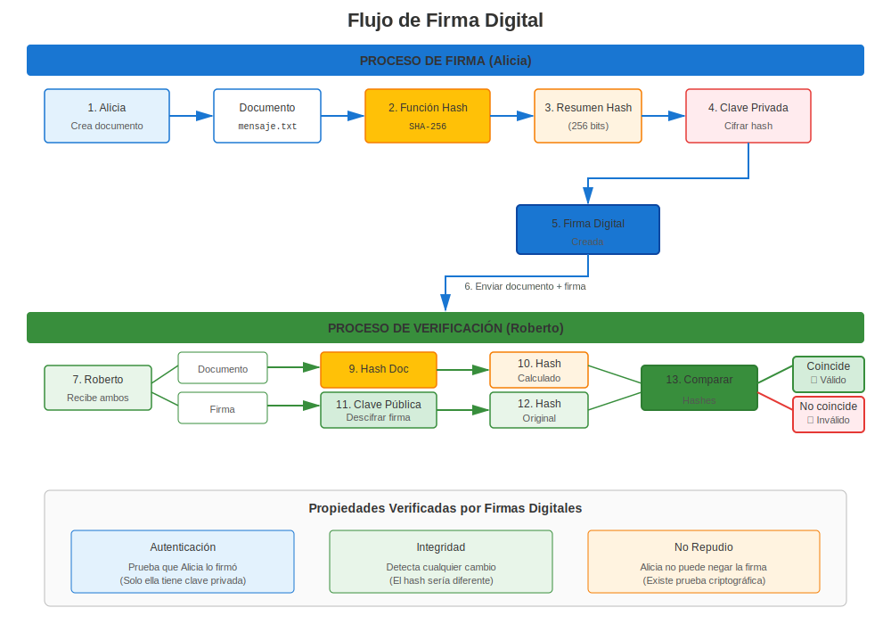
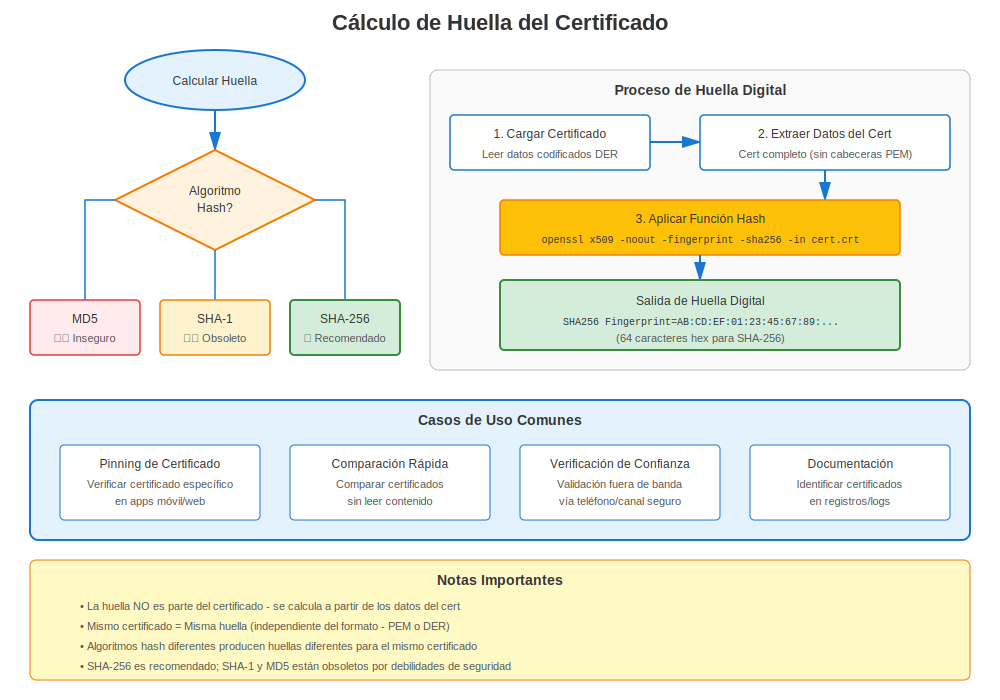

# Capítulo 7: Firmas Digitales y Verificación en RHEL

> **Cómo Funciona la Confianza:** Aprende cómo las firmas digitales habilitan la validación de certificados en sistemas RHEL.

## 7.1 Funciones Hash Criptográficas

Propiedades:
1. Deterministas
2. Resistencia a preimagen
3. Resistencia a colisiones
4. Efecto avalancha

Algoritmos populares: SHA-256, SHA-3, BLAKE2.

## 7.2 Construir Firmas



1. Calcular hash del mensaje.
2. Cifrar hash con clave *privada* → firma.
3. El receptor descifra la firma con clave *pública* y compara con su propio hash.

## 7.3 Huellas de Certificados



Una huella es simplemente el hash del certificado codificado en DER, usado para identificarlo únicamente, ej.:

```bash
openssl x509 -in server.crt -noout -fingerprint -sha256
```

## 7.4 Laboratorio: Firmar y Verificar un Archivo

```bash
# firmar
openssl dgst -sha256 -sign rsa.key.pem -out report.sig report.pdf
# verificar
openssl dgst -sha256 -verify rsa.pub.pem -signature report.sig report.pdf
```

## 7.5 Resumen

Las firmas vinculan datos a identidades; los hashes aseguran integridad. Juntos sustentan la validación de certificados y todas las operaciones PKI.

---

## 7.6 Algoritmos de Firma en RHEL

### Aprobados por Versión de RHEL

| Algoritmo | RHEL 7 | RHEL 8 | RHEL 9 | RHEL 10 |
|-----------|--------|--------|--------|---------|
| **SHA-256** | ✅ Sí | ✅ Sí | ✅ Sí | ✅ Sí |
| **SHA-384** | ✅ Sí | ✅ Sí | ✅ Sí | ✅ Sí |
| **SHA-512** | ✅ Sí | ✅ Sí | ✅ Sí | ✅ Sí |
| **SHA-1** | ✅ Sí | ⚠️ Obsoleto | ❌ Bloqueado | ❌ Bloqueado |
| **MD5** | ✅ Sí | ⚠️ Solo legacy | ❌ Bloqueado | ❌ Bloqueado |

**Crítico:** ¡RHEL 9+ bloquea SHA-1 y MD5 por seguridad!

### Verificar Certificados en RHEL

```bash
# Verificar cadena de certificado
openssl verify /etc/pki/tls/certs/server.crt

# Verificar contra CA específica
openssl verify -CAfile /etc/pki/tls/certs/ca-bundle.crt server.crt

# Verificar algoritmo de firma
openssl x509 -in server.crt -noout -text | grep "Signature Algorithm"
# Debe ser SHA-256+ en RHEL 8+
```

---

## Referencia Rápida

```
┌─────────────────────────────────────────────────────────────┐
│ FIRMAS DIGITALES EN RHEL                                    │
├─────────────────────────────────────────────────────────────┤
│ Propósito:       Probar autenticidad e integridad           │
│ Cómo:            Hash + Clave privada = Firma               │
│ Verificar:       Firma + Clave pública = Hash original      │
│                                                             │
│ Aprobados:       SHA-256, SHA-384, SHA-512                  │
│ Obsoleto:        SHA-1 (bloqueado en RHEL 9+)               │
│ Bloqueado:       MD5 (bloqueado en RHEL 9+)                 │
│                                                             │
│ Verificar cert:  openssl verify cert.crt                    │
│ Ver algoritmo:   openssl x509 -noout -text | grep Signature │
│ Huella:          openssl x509 -noout -fingerprint -sha256   │
└─────────────────────────────────────────────────────────────┘
```

---

## 🧪 Laboratorio Práctico

**Lab 03: Firmas Digitales**

Firma archivos, verifica firmas y detecta manipulaciones

- 📁 **Ubicación:** `labs/es_ES/03-digital-signatures/`
- ⏱️ **Tiempo:** 20 minutos
- 🎯 **Nivel:** Principiante

---

**Navegación del Capítulo**

| [← Anterior: Capítulo 6 - Inmersión Profunda en el Almacén de Confianza de RHEL](06-rhel-trust-store.md) | [Siguiente: Capítulo 8 - Versiones de RHEL y Evolución de Certificados →](../part-02-version-specific/08-rhel-versions-overview.md) |
|:---|---:|
