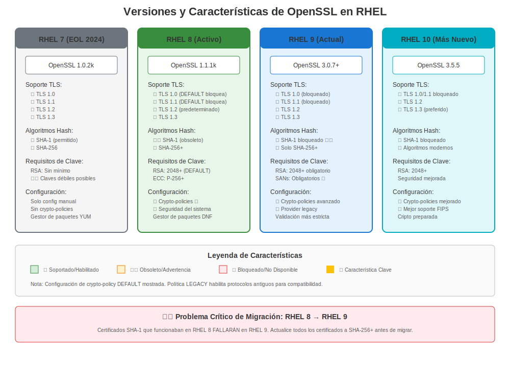

# Capítulo 8: Versiones de RHEL y Evolución de Certificados

> **Objetivo de Aprendizaje:** Entender cómo difiere la gestión de certificados entre RHEL 7, 8, 9 y 10 para que puedas identificar rápidamente comportamientos específicos de versión al resolver problemas.

---

## 8.1 Por Qué Importa la Versión de RHEL

Al resolver problemas de certificados en RHEL, la **primera pregunta** siempre debe ser: "¿En qué versión de RHEL estoy?"

La gestión de certificados ha evolucionado significativamente a través de las versiones de RHEL. Lo que funciona en RHEL 7 puede fallar en RHEL 9. Entender estas diferencias es crucial para:

- ✅ Elegir el enfoque de solución de problemas correcto
- ✅ Identificar errores específicos de versión
- ✅ Planificar migraciones
- ✅ Escribir scripts de automatización compatibles

---

## 8.2 Verificación Rápida de Versión

```bash
# Método 1: Verificar /etc/redhat-release
cat /etc/redhat-release
# Ejemplos de salida:
#   Red Hat Enterprise Linux Server release 7.9 (Maipo)
#   Red Hat Enterprise Linux release 8.10 (Ootpa)
#   Red Hat Enterprise Linux release 9.8 (Plow)
#   Red Hat Enterprise Linux release 10.2 (Coughlan)

# Método 2: Usar rpm
rpm -q --queryformat '%{VERSION}\n' redhat-release

# Método 3: Verificar versión de OpenSSL (indirecto pero útil)
openssl version
# RHEL 7: OpenSSL 1.0.2k
# RHEL 8: OpenSSL 1.1.1k
# RHEL 9: OpenSSL 3.5.5
# RHEL 10: OpenSSL 3.5.5
```

---

## 8.3 Resumen de Versiones RHEL


| Versión RHEL | Fecha GA | Fin de Soporte | Versión OpenSSL | Característica Clave de Certificados |
|--------------|----------|----------------|-----------------|--------------------------------------|
| **RHEL 7** | Junio 2014 | Junio 2024 | 1.0.2k-26 | Gestión manual tradicional |
| **RHEL 8** | Mayo 2019 | Mayo 2029 | 1.1.1k-14 | **Introducción de crypto-policies** |
| **RHEL 9** | Mayo 2022 | Mayo 2032 | 3.5.5-2 | OpenSSL 3.x, valores predeterminados más estrictos |
| **RHEL 10** | Mayo 2025 | Mayo 2035 | 3.5.5-2 | Fortalecimiento continuo, preparación PQC |

> **Fuente:** [Ciclo de Vida de Productos Red Hat](https://access.redhat.com/support/policy/updates/errata)



---

## 8.4 Resumen de Diferencias Principales

### RHEL 7 (Legado)

**Características:**
- ✅ Estable, bien entendido
- ✅ Máxima compatibilidad
- ⚠️ TLS 1.0/1.1 habilitado por defecto
- ⚠️ Cifrados débiles permitidos
- ⚠️ Gestión de certificados manual

**Paquete:** `openssl-1.0.2k-26.el7_9.x86_64`

**Cuándo lo Verás:**
- Sistemas legacy no migrados aún
- Aplicaciones que requieren versiones TLS antiguas
- Entornos conservadores

**Comando Clave:**
```bash
# Generar clave (estilo RHEL 7)
openssl genrsa -out server.key 2048
```

---

### RHEL 8 (Estándar Empresarial Actual)

**Características:**
- ✅ **Crypto-policies en todo el sistema** (¡cambio de juego!)
- ✅ TLS 1.2+ por defecto
- ✅ certmonger para renovación automática
- ✅ Suites de cifrado modernas
- ⚠️ Cambios incompatibles con RHEL 7

**Paquete:** `openssl-1.1.1k-14.el8_6.x86_64`

**Innovación Clave - Crypto-Policies:**
```bash
# Ver política actual
update-crypto-policies --show
# DEFAULT, LEGACY, FUTURE, o FIPS

# ¡Control de seguridad en todo el sistema!
sudo update-crypto-policies --set FUTURE
```

**Cuándo lo Verás:**
- La mayoría de despliegues empresariales
- Aplicaciones modernas
- Entornos FreeIPA

**Comando Clave:**
```bash
# Generar clave (estilo moderno RHEL 8)
openssl genpkey -algorithm RSA -pkeyopt rsa_keygen_bits:2048 -out server.key
```

---

### RHEL 9 (Estándar Moderno)

**Características:**
- ✅ OpenSSL 3.5.5 con arquitectura de proveedores
- ✅ TLS 1.2+ obligatorio
- ✅ Crypto-policies mejoradas
- ✅ Validación de certificados más estricta
- ⚠️ Cambios en API de OpenSSL 3.x
- ⚠️ Algoritmos legacy deshabilitados

**Paquete:** `openssl-3.5.5-2.el9_8.x86_64`

**Cambio Mayor - Arquitectura de Proveedores:**
```bash
# Listar proveedores crypto
openssl list -providers
# default, fips, legacy, base

# Algoritmos legacy requieren proveedor explícito
openssl md5 -provider legacy file.txt
```

**Cuándo lo Verás:**
- Nuevos despliegues
- Entornos conscientes de seguridad
- Últimas versiones de aplicaciones

**Comando Clave:**
```bash
# Generar clave EC (RHEL 9)
openssl genpkey -algorithm EC -pkeyopt ec_paramgen_curve:P-256 -out ec.key
```

---

### RHEL 10 (Lanzamiento Actual)

**Características:**
- ✅ Mismo OpenSSL 3.5.5 que RHEL 9.8
- ✅ Fortalecimiento de seguridad continuo
- ✅ Preparación para criptografía post-cuántica
- ✅ Soporte mejorado de certificados para contenedores
- ⚠️ Valores predeterminados aún más estrictos
- ⚠️ Eliminaciones legacy adicionales

**Paquete:** `openssl-3.5.5-2.el10_2.x86_64`

> **Nota:** RHEL 10.0 GA fue el 20 de mayo de 2025. Las características y capacidades pueden evolucionar a través de versiones menores (10.1, 10.2, etc.). Siempre consulta la documentación oficial para tu lanzamiento específico de RHEL 10.x.

**Enfoque Clave:**
- Base de criptografía resistente a cuántica
- Prácticas de seguridad modernas
- Cargas de trabajo nativas de contenedor y nube

**Cuándo lo Verás:**
- Despliegues completamente nuevos
- Requisitos de seguridad de vanguardia
- Iniciativas de preparación para el futuro

---

## 8.5 Diferencias Críticas de Versión

### Soporte de Versiones TLS

| Versión TLS | RHEL 7 | RHEL 8 | RHEL 9 | RHEL 10 |
|-------------|--------|--------|--------|---------|
| TLS 1.0 | ✅ Sí | ⚠️ Solo LEGACY | ❌ No | ❌ No |
| TLS 1.1 | ✅ Sí | ⚠️ Solo LEGACY | ❌ No | ❌ No |
| TLS 1.2 | ✅ Sí | ✅ Sí | ✅ Sí | ✅ Sí |
| TLS 1.3 | ❌ No | ✅ Sí | ✅ Sí (preferido) | ✅ Sí (preferido) |

### Disponibilidad de Herramientas de Certificados

| Herramienta | RHEL 7 | RHEL 8 | RHEL 9 | RHEL 10 |
|-------------|--------|--------|--------|---------|
| `openssl` | 1.0.2k | 1.1.1k | 3.5.5 | 3.5.5 |
| `certutil` (NSS) | ✅ Sí | ✅ Sí | ✅ Sí | ✅ Sí |
| `update-ca-trust` | ✅ Sí | ✅ Mejorado | ✅ Mejorado | ✅ Mejorado |
| `certmonger` | ✅ Sí | ✅ Mejorado | ✅ Mejorado | ✅ Mejorado |
| `crypto-policies` | ❌ No | ✅ Sí | ✅ Mejorado | ✅ Mejorado |
| `authconfig` | ✅ Sí | ❌ No (usar authselect) | ❌ No | ❌ No |

### Cambios Clave en Cifrado/Algoritmos

| Algoritmo/Característica | RHEL 7 | RHEL 8 | RHEL 9 | RHEL 10 |
|--------------------------|--------|--------|--------|---------|
| 3DES | ✅ Sí | ⚠️ LEGACY | ❌ No | ❌ No |
| RC4 | ✅ Sí | ❌ No | ❌ No | ❌ No |
| Firmas MD5 | ✅ Sí | ⚠️ LEGACY | ❌ No | ❌ No |
| Firmas SHA-1 | ✅ Sí | ⚠️ Obsoleto | ❌ No | ❌ No |
| RSA < 2048 bits | ✅ Sí | ❌ No | ❌ No | ❌ No |
| Claves DSA | ✅ Sí | ⚠️ LEGACY | ❌ No | ❌ No |

---

## 8.6 Problemas Comunes Específicos de Versión

### Problemas RHEL 7
```bash
# Problema: Suites de cifrado antiguas aceptadas
# Impacto: Vulnerabilidades de seguridad
# Solución: Configuración manual de cifrados Apache/NGINX
```

### Problemas RHEL 8
```bash
# Problema: La aplicación falla después de migración desde RHEL 7
# Razón: TLS 1.0/1.1 deshabilitado por defecto
# Solución Rápida: Usar temporalmente política LEGACY (no recomendado a largo plazo)
sudo update-crypto-policies --set LEGACY

# Mejor Solución: Actualizar aplicación para soportar TLS 1.2+
```

### Problemas RHEL 9
```bash
# Problema: Comandos OpenSSL fallan con errores de proveedor
# Razón: Arquitectura de proveedores OpenSSL 3.x
# Solución: Especificar proveedor explícitamente
openssl md5 -provider legacy file.txt

# Problema: Certificados SHA-1 rechazados
# Razón: Validación más estricta
# Solución: Reemitir certificados con SHA-256+
```

### Problemas RHEL 10
```bash
# Problema: Valores predeterminados aún más estrictos que RHEL 9
# Impacto: Certificados legacy pueden fallar validación
# Solución: Asegurar que todos los certificados usen algoritmos modernos
#           Verificar documentación específica de RHEL 10.x para tu versión menor
```

---

## 8.7 Impacto de Migración

### RHEL 7 → RHEL 8
**Impacto en Certificados:** MODERADO
- TLS 1.0/1.1 deshabilitado
- Cifrados débiles eliminados
- Integración certmonger requerida para automatización

**Acción Requerida:**
1. Auditar versiones TLS en uso
2. Actualizar configuraciones de cifrado
3. Probar aplicaciones con TLS 1.2+
4. Considerar crypto-policies

### RHEL 8 → RHEL 9
**Impacto en Certificados:** ALTO
- Cambios en API de OpenSSL 3.x
- Eliminación de algoritmos legacy
- Validación de certificados más estricta
- Cambios en arquitectura de proveedores

**Acción Requerida:**
1. Probar todas las operaciones de certificados
2. Actualizar scripts personalizados usando OpenSSL
3. Validar integridad de cadena de certificados
4. Verificar uso de SHA-1

### RHEL 9 → RHEL 10
**Impacto en Certificados:** BAJO-MODERADO
- Misma base OpenSSL (3.5.5)
- Fortalecimiento incremental
- Refinamientos de política

**Acción Requerida:**
1. Revisar documentación de RHEL 10.x
2. Probar compatibilidad de crypto-policy
3. Validar uso de algoritmos modernos

---

## 8.8 Elegir el Enfoque Correcto

### Para Solución de Problemas

```bash
# Siempre comenzar con verificación de versión
cat /etc/redhat-release

# Luego verificar versión de OpenSSL
openssl version

# Para RHEL 8+: Verificar crypto-policy
update-crypto-policies --show 2>/dev/null || echo "Pre-RHEL 8"
```

### Árbol de Decisión de Referencia Rápida

```
¿Es RHEL 7?
├─ SÍ → Verificar problemas de TLS/cifrado legacy
│       Probablemente se necesita configuración manual
│       Considerar planificación de migración
│
└─ NO → ¿Es RHEL 8?
    ├─ SÍ → ¡Verificar crypto-policies primero!
    │       Usar certmonger para automatización
    │       Considerar actualización a RHEL 9
    │
    └─ NO → ¿Es RHEL 9 o 10?
        └─ SÍ → Verificar problemas de proveedor OpenSSL 3.x
                Verificar algoritmos modernos en uso
                Aprovechar herramientas mejoradas
```

---

## 8.9 Conclusiones Clave

1. **Siempre verificar versión RHEL primero** al resolver problemas
2. **RHEL 8 introdujo crypto-policies** - cambio de juego para gestión de certificados
3. **RHEL 9 usa OpenSSL 3.x** - cambios significativos en API y comportamiento
4. **RHEL 10 continúa la base de RHEL 9** - mejoras incrementales
5. **Algoritmos legacy eliminados progresivamente** a través de versiones
6. **Las pruebas de migración son críticas** - el comportamiento de certificados cambia significativamente

---

## 8.10 ¿Qué Sigue?

Ahora que entiendes las diferencias de versiones RHEL, profundizaremos en:

- **Capítulo 9:** Gestión de Certificados en RHEL 7 (detallado)
- **Capítulo 10:** RHEL 8 y Crypto-Policies (detallado)
- **Capítulo 11:** Seguridad Moderna en RHEL 9 (detallado)
- **Capítulo 12:** Características Actuales de RHEL 10 (detallado)

---

## Tarjeta de Referencia Rápida

```
┌────────────────────────────────────────────────────────────┐
│ REFERENCIA RÁPIDA DE VERSIONES RHEL                        │
├─────────────┬───────────┬──────────────┬───────────────────┤
│ RHEL 7      │ 1.0.2k    │ Manual       │ Amigable legacy   │
│ RHEL 8      │ 1.1.1k    │ Crypto-pols  │ Estándar empresa  │
│ RHEL 9      │ 3.5.5     │ OpenSSL 3.x  │ Moderno seguro    │
│ RHEL 10     │ 3.5.5     │ Fortalecido  │ Preparado futuro  │
└─────────────┴───────────┴──────────────┴───────────────────┘

Verificar versión:   cat /etc/redhat-release
Verificar OpenSSL:   openssl version
Verificar política:  update-crypto-policies --show  (RHEL 8+)
```
---

**Navegación del Capítulo**

| [← Anterior: Capítulo 7 - Firmas Digitales y Verificación en RHEL](../part-01-fundamentals/07-signatures-verification.md) | [Siguiente: Capítulo 9 - Gestión de Certificados en RHEL 7 →](09-rhel7-management.md) |
|:---|---:|
