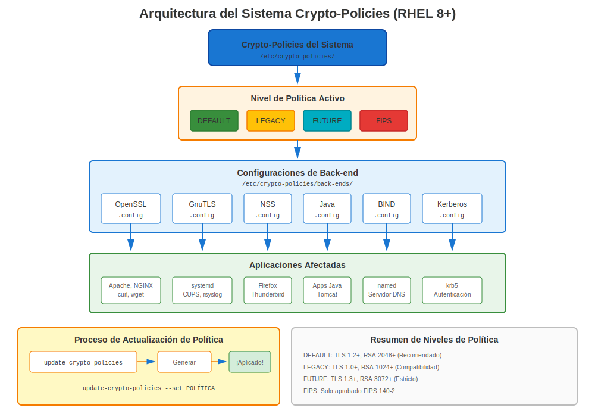
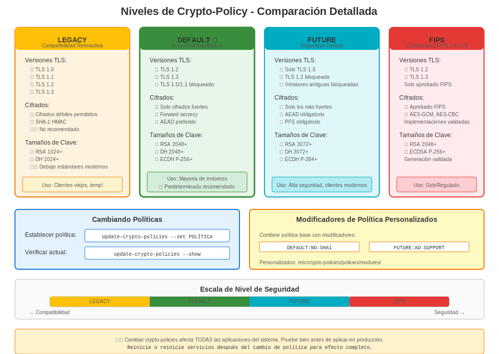

# Capítulo 10: RHEL 8 y Crypto-Policies

> **Cambio de Juego:** RHEL 8 introdujo crypto-policies, revolucionando cómo se gestionan certificados y criptografía en todo el sistema. Esta es la característica más importante que debes entender para RHEL 8.

---

## 10.1 ¿Qué Cambió en RHEL 8?

**Lanzamiento:** 7 de mayo de 2019
**Soporte Hasta:** 31 de mayo de 2029
**Versión Actual:** RHEL 8.10 (a partir de 2024)

**Cambios Principales Relacionados con Certificados:**

| Característica | RHEL 7 | RHEL 8 |
|----------------|--------|--------|
| OpenSSL | 1.0.2k | 1.1.1k-14 |
| TLS 1.3 | ❌ No | ✅ Sí |
| Crypto-Policies | ❌ No | ✅ **¡NUEVO!** |
| TLS 1.0/1.1 | ✅ Habilitado | ❌ Deshabilitado (DEFAULT) |
| certmonger | Básico | Mejorado |
| Seguridad Predeterminada | Mixta | Más Fuerte |

**Paquete:** `openssl-1.1.1k-14.el8_6.x86_64`

---

## 10.2 Entender Crypto-Policies



### La Idea Revolucionaria

**Problema RHEL 7:**
```
❌ Configurar Apache:     SSLProtocol, SSLCipherSuite
❌ Configurar NGINX:      ssl_protocols, ssl_ciphers
❌ Configurar Postfix:    smtpd_tls_protocols
❌ Configurar OpenLDAP:   olcTLSProtocolMin
❌ ¡Configurar cada aplicación de manera diferente!
```

**Solución RHEL 8:**
```
✅ Establecer UNA política en todo el sistema
✅ ¡Todas las aplicaciones cumplen automáticamente!
```

### Cómo Funciona

```
┌────────────────────────────────────────┐
│  update-crypto-policies --set DEFAULT  │  ← Comando único
└──────────────────┬─────────────────────┘
                   │
      ┌────────────┴────────────┐
      │ Sistema Crypto-Policies │
      └────────────┬────────────┘
                   │
    ┌──────────────┼──────────────┐
    ▼              ▼              ▼
 OpenSSL        GnuTLS         NSS
 Postfix        Apache         NGINX
 OpenSSH        Kerberos       BIND
 (¡todas apps!) (¡automático!) (¡consistente!)
```

---

## 10.3 Crypto-Policies Disponibles



### Las Cuatro Políticas Principales

```bash
# Verificar política actual
update-crypto-policies --show

# Políticas disponibles en RHEL 8:
```

| Política | Versiones TLS | RSA Mín | SHA-1 | 3DES | Caso de Uso |
|----------|---------------|---------|-------|------|-------------|
| **DEFAULT** | 1.2, 1.3 | 2048 | ❌ No | ❌ No | Estándar (recomendado) |
| **LEGACY** | 1.0+, todas | 1024 | ⚠️ Sí | ⚠️ Sí | Compatibilidad sistemas antiguos |
| **FUTURE** | 1.2, 1.3 | 3072 | ❌ No | ❌ No | Seguridad más estricta |
| **FIPS** | 1.2, 1.3 | 2048 | ❌ No | ❌ No | Cumplimiento federal |

### Detalles de Políticas

**Política DEFAULT:**
```yaml
Versiones TLS: 1.2, 1.3
RSA/DH Mínimo: 2048 bits
ECC Mínimo: secp256r1 (P-256)
Cifrados: AES-GCM, ChaCha20-Poly1305, AES-CBC
Firmas: SHA-256, SHA-384, SHA-512
Bloqueados: MD5, firmas SHA-1, 3DES, RC4, DSS
```

**Política LEGACY:**
```yaml
Versiones TLS: 1.0, 1.1, 1.2, 1.3
RSA/DH Mínimo: 1024 bits
Cifrados: Incluye 3DES, cifrados débiles
Firmas: Permite SHA-1
Uso: Solo para compatibilidad con sistemas antiguos (¡temporal!)
```

**Política FUTURE:**
```yaml
Versiones TLS: 1.2, 1.3 (cifrados más estrictos)
RSA/DH Mínimo: 3072 bits
ECC Mínimo: secp384r1 (P-384)
Firmas: SHA-384, SHA-512 preferidos
Bloqueados: Todo en DEFAULT, más otros
```

**Política FIPS:**
```yaml
Versiones TLS: 1.2, 1.3
Algoritmos: Solo aprobados FIPS 140-2
Requiere: Modo FIPS habilitado
Más estricto: Requisitos de cumplimiento federal
```

---

## 10.4 Cambiar Crypto-Policies

### Cambios Básicos de Política

```bash
#============================================#
# VER POLÍTICA ACTUAL
#============================================#

update-crypto-policies --show
# DEFAULT


#============================================#
# ESTABLECER POLÍTICA
#============================================#

# Establecer a FUTURE (más estricto)
sudo update-crypto-policies --set FUTURE

# Establecer a LEGACY (menos seguro, para compatibilidad)
sudo update-crypto-policies --set LEGACY

# Establecer a FIPS (requiere modo FIPS habilitado)
sudo fips-mode-setup --enable
sudo reboot
sudo update-crypto-policies --set FIPS

# Volver a DEFAULT
sudo update-crypto-policies --set DEFAULT


#============================================#
# APLICAR POLÍTICA (reiniciar servicios)
#============================================#

# Crypto-policies actualiza archivos de configuración, pero los servicios deben reiniciarse
sudo systemctl restart httpd nginx postfix

# O reiniciar (asegura que todo use la nueva política)
sudo reboot
```

### Qué Sucede Cuando Cambias la Política

```bash
# Ejemplo: Cambiar a política FUTURE

# Antes:
update-crypto-policies --show
# DEFAULT

# Después:
sudo update-crypto-policies --set FUTURE

# Los cambios ocurren en:
ls -l /etc/crypto-policies/back-ends/
# opensslcnf.config      ← Configuración OpenSSL actualizada
# gnutls.config          ← Configuración GnuTLS actualizada
# nss.config             ← Configuración NSS actualizada
# bind.config            ← Configuración BIND actualizada
# ... y más

# Ver política OpenSSL aplicada:
cat /etc/crypto-policies/back-ends/opensslcnf.config
```

---

## 10.5 Impacto de la Política en Certificados

### Impacto de la Política DEFAULT

```bash
#============================================#
# QUÉ PERMITE/BLOQUEA LA POLÍTICA DEFAULT
#============================================#

# ✅ PERMITIDO:
- TLS 1.2, 1.3
- RSA 2048+ bits
- AES-128-GCM, AES-256-GCM
- ChaCha20-Poly1305
- Firmas SHA-256, SHA-384, SHA-512

# ❌ BLOQUEADO:
- TLS 1.0, 1.1
- RSA < 2048 bits
- 3DES, RC4, DES
- Firmas MD5, SHA-1
- Claves DSA
- Cifrados de exportación
```

### Probar Contra la Política Actual

```bash
#============================================#
# PROBAR SI TU CERTIFICADO FUNCIONA
#============================================#

# Probar TLS 1.2
openssl s_client -connect server.example.com:443 -tls1_2

# Probar TLS 1.3
openssl s_client -connect server.example.com:443 -tls1_3

# Probar cifrado específico
openssl s_client -connect server.example.com:443 \
  -cipher 'ECDHE-RSA-AES256-GCM-SHA384'

# Ver qué cifrados están disponibles bajo la política actual
openssl ciphers -v | head -20
```

---

## 10.6 Características de OpenSSL 1.1.1 (RHEL 8)

### Nuevas Características

```bash
#============================================#
# SOPORTE TLS 1.3 (¡Nuevo en RHEL 8!)
#============================================#

# Probar TLS 1.3
openssl s_client -connect server.example.com:443 -tls1_3

# Beneficios de TLS 1.3:
# - Handshake más rápido
# - Forward secrecy obligatorio
# - Características obsoletas eliminadas


#============================================#
# GENERACIÓN DE CLAVES MODERNA
#============================================#

# Estilo antiguo (aún funciona)
openssl genrsa -out server.key 2048

# Estilo nuevo (preferido en RHEL 8)
openssl genpkey -algorithm RSA -out server.key \
  -pkeyopt rsa_keygen_bits:2048

# Claves EC (curva elíptica)
openssl genpkey -algorithm EC -out ec.key \
  -pkeyopt ec_paramgen_curve:P-256


#============================================#
# GENERACIÓN DE CSR MEJORADA
#============================================#

# CSR con SANs (¡mucho más fácil que RHEL 7!)
openssl req -new -key server.key -out server.csr \
  -subj "/CN=server.example.com" \
  -addext "subjectAltName=DNS:server.example.com,DNS:www.example.com,IP:10.0.0.100"

# Verificar SANs
openssl req -in server.csr -noout -text | grep -A2 "Subject Alternative Name"
```

---

## 10.7 Mejoras de certmonger en RHEL 8

### Características Mejoradas

```bash
#============================================#
# CERTMONGER EN RHEL 8
#============================================#

# Mejor integración con IPA
sudo ipa-getcert request \
  -f /etc/pki/tls/certs/web.crt \
  -k /etc/pki/tls/private/web.key \
  -D web.example.com \
  -K host/web.example.com@REALM \
  -C "systemctl reload httpd"  # ¡Comando post-guardado (mejorado!)

# Salida de estado mejorada
sudo getcert list -v

# Mejor reporte de errores
sudo getcert list -f /etc/pki/tls/certs/web.crt
# Muestra mensajes de error detallados si la renovación falla
```

**Mejoras de certmonger en RHEL 8:**
- ✅ Mejores mensajes de error
- ✅ Soporte de comando post-guardado
- ✅ Integración mejorada con IPA
- ✅ Renovación más confiable

---

## 10.8 Escenarios Comunes en RHEL 8

### Escenario 1: Migrado desde RHEL 7, App TLS 1.0 Falla

**Problema:**
```bash
# La aplicación funcionaba en RHEL 7
# Después de migración a RHEL 8: fallos de conexión
```

**Diagnóstico:**
```bash
# Verificar crypto-policy
update-crypto-policies --show
# DEFAULT  ← ¡TLS 1.0/1.1 deshabilitado!

# Verificar logs de aplicación
journalctl -xe | grep -i tls
# "wrong version number" o "no shared cipher"
```

**Solución Rápida (Temporal):**
```bash
# Usar política LEGACY para permitir TLS 1.0/1.1
sudo update-crypto-policies --set LEGACY
sudo systemctl restart <service>
```

**Solución Apropiada:**
```bash
# Actualizar aplicación para soportar TLS 1.2+
# O configurar aplicación específicamente (optar por no usar política)
```

### Escenario 2: Necesidad de Soportar Clientes Antiguos

**Problema:** Clientes Windows Server 2008, Java 7 no pueden conectarse

**Solución:**
```bash
# Opción 1: Política LEGACY (no recomendado a largo plazo)
sudo update-crypto-policies --set LEGACY

# Opción 2: Módulo de política personalizada
# Crear /etc/crypto-policies/policies/modules/COMPAT-OLD-CLIENTS.pmod
sudo update-crypto-policies --set DEFAULT:COMPAT-OLD-CLIENTS

# Opción 3: Optar por no usar política en servicio específico
# Configurar ese servicio para permitir TLS 1.0/1.1
```

### Escenario 3: Probar Antes de Producción

```bash
#============================================#
# PROBAR IMPACTO DE CRYPTO-POLICY
#============================================#

# Política actual
CURRENT=$(update-crypto-policies --show)

# Probar con política FUTURE
sudo update-crypto-policies --set FUTURE
sudo systemctl restart httpd

# Ejecutar pruebas
curl https://localhost/
# Suite de pruebas de aplicación

# Si hay problemas:
sudo update-crypto-policies --set $CURRENT  # Revertir
sudo systemctl restart httpd
```

---

## 10.9 Sobrescrituras por Aplicación

### Cuándo Sobrescribir

A veces necesitas que UNA aplicación opte por no usar la política del sistema:

**Ejemplo:** La app legacy necesita TLS 1.0, pero quieres DEFAULT para todo lo demás

```bash
#============================================#
# SOBRESCRITURA DE APACHE (Optar por No Usar)
#============================================#

# /etc/httpd/conf.d/ssl.conf
# Agregar esto para re-habilitar TLS 1.0 solo para Apache:
SSLProtocol all

# O usar Include para cargar crypto-policy
Include /etc/crypto-policies/back-ends/httpd.config
# Luego sobrescribir ajustes específicos después

# ⚠️ Nota: Esto opta por NO usar crypto-policies para Apache
# Ahora gestionas TLS de Apache manualmente otra vez
```

**Mejor:** Usar módulos de política (ver Capítulo 23 para detalles)

---

## 10.10 Resolver Problemas de Crypto-Policy

### Problemas Comunes

**Problema 1: "no shared cipher"**

```bash
# Diagnóstico
update-crypto-policies --show
# DEFAULT

# Probar qué cifrados están disponibles
openssl ciphers -v

# Verificar solicitud del cliente
openssl s_client -connect localhost:443 -cipher 'ALL'

# Solución: Usar temporalmente LEGACY para identificar problema
sudo update-crypto-policies --set LEGACY
# Si funciona → problema de compatibilidad de cifrado
# Solución apropiada: Actualizar cliente o crear política personalizada
```

**Problema 2: El servicio falla después de cambio de política**

```bash
# Síntoma
sudo systemctl status httpd
# Failed to start

# Verificar logs
sudo journalctl -xe -u httpd | grep -i tls

# Revertir política
sudo update-crypto-policies --set DEFAULT
sudo systemctl restart httpd
```

---

## 10.11 Mejores Prácticas para RHEL 8

### Recomendación: Usar Política DEFAULT

```bash
# Para la mayoría de entornos:
sudo update-crypto-policies --set DEFAULT

# Razones:
✅ Seguridad/compatibilidad equilibrada
✅ Probado por Red Hat
✅ Cumple estándares modernos
✅ Bloquea algoritmos débiles conocidos
✅ Funciona con la mayoría de clientes
```

### Cuándo Usar Otras Políticas

**Usar LEGACY cuando:**
- Soportar temporalmente clientes muy antiguos
- Período de migración desde RHEL 7
- Probar compatibilidad
- **Pero:** ¡Planifica volver a DEFAULT lo antes posible!

**Usar FUTURE cuando:**
- Requisitos de alta seguridad
- Todos los clientes son modernos
- Quieres los ajustes más estrictos
- Planificación anticipada

**Usar FIPS cuando:**
- Se requiere cumplimiento federal
- Contratos gubernamentales
- Industrias reguladas
- Se necesitan certificaciones de seguridad

---

## 10.12 Conclusiones Clave (RHEL 8)

1. **Crypto-policies son LA característica** - Apréndelas bien
2. **La política DEFAULT es buena** - No cambiar sin razón
3. **TLS 1.3 ahora disponible** - Más rápido y más seguro
4. **OpenSSL 1.1.1** - Características modernas, mejor sintaxis
5. **certmonger mejorado** - Mejor automatización
6. **Migración desde RHEL 7** - Probar exhaustivamente
7. **Planificar para RHEL 9** - OpenSSL 3.x viene

---

## Referencia Rápida

```
┌────────────────────────────────────────────────────────────────┐
│ REFERENCIA RÁPIDA CRYPTO-POLICIES RHEL 8                       │
├────────────────────────────────────────────────────────────────┤
│ OpenSSL:         1.1.1k-14                                     │
│ TLS:             1.2, 1.3 (política DEFAULT)                   │
│ Característica:  Crypto-policies en todo el sistema            │
│                                                                │
│ Ver política:    update-crypto-policies --show                 │
│ Establecer:      sudo update-crypto-policies --set <POLICY>    │
│ Políticas:       DEFAULT, LEGACY, FUTURE, FIPS                 │
│                                                                │
│ Archivos config: /etc/crypto-policies/back-ends/               │
│ Reiniciar:       systemctl restart <services>                  │
│                                                                │
│ Generar clave:   openssl genpkey -algorithm RSA -out key.pem   │
│ CSR con SANs:    openssl req -new -addext "subjectAltName=..." │
└────────────────────────────────────────────────────────────────┘
```
---

**Navegación del Capítulo**

| [← Anterior: Capítulo 9 - Gestión de Certificados en RHEL 7](09-rhel7-management.md) | [Siguiente: Capítulo 11 - Seguridad Moderna en RHEL 9 →](11-rhel9-modern-security.md) |
|:---|---:|
