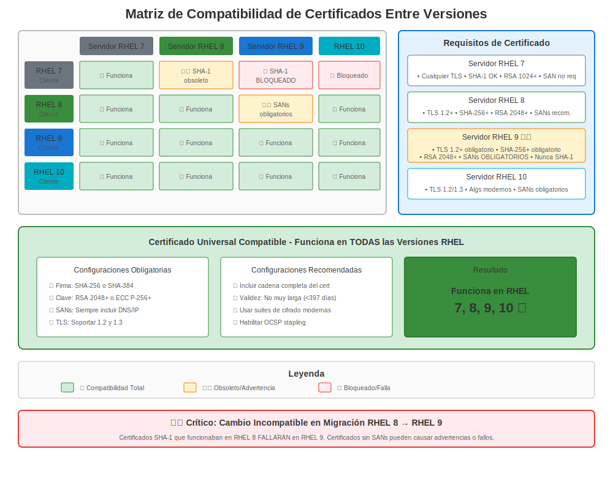

# Capítulo 13: Compatibilidad entre Versiones

> **Desafío del Mundo Real:** Tu entorno probablemente tiene sistemas RHEL 7, 8 y 9 todos comunicándose entre sí. ¿Cómo haces que los certificados funcionen en todas las versiones?

---

## 13.1 La Realidad del Entorno Mixto



La mayoría de las empresas no actualizan todo a la vez. Encontrarás:

```
Entorno de Producción (Típico):
├── Servidor de App Legacy (RHEL 7)
├── Servidor de Base de Datos (RHEL 8)
├── Capa Web (RHEL 9)
├── Nodo de Gestión (RHEL 10)
└── Clientes: Windows, Mac, Linux, Mobile
```

**Desafío:** Estos sistemas tienen diferentes:
- Soporte de versión TLS
- Suites de cifrado
- Reglas de validación de certificados
- Versiones de OpenSSL
- Crypto-policies (o falta de ellas)

---

## 13.2 Problemas Comunes de Compatibilidad

### Problema 1: Desajustes de Versión TLS

**Escenario:** Servidor RHEL 9 (solo TLS 1.2+) ← Cliente RHEL 7 (TLS 1.0/1.1 predeterminado)

```bash
# Cliente RHEL 7 intentando conectarse a servidor RHEL 9
curl https://rhel9-server.example.com/
# Error: SSL routines:ssl3_get_record:wrong version number

# Por qué: RHEL 7 intenta TLS 1.0 primero, RHEL 9 lo rechaza
```

**Solución:**
```bash
# Opción 1: Actualizar cliente RHEL 7 para usar TLS 1.2
# Editar /etc/httpd/conf.d/ssl.conf (si cliente Apache)
SSLProtocol all -SSLv3 -TLSv1 -TLSv1.1

# Opción 2: Política LEGACY temporal en RHEL 9 (NO recomendado)
# sudo update-crypto-policies --set LEGACY  # En servidor RHEL 9

# Opción 3: Mejor - ¡Actualizar sistemas RHEL 7!
```

### Problema 2: Desajustes de Suite de Cifrado

**Escenario:** Servidor moderno no soporta cifrados de cliente antiguo

```bash
# Cliente RHEL 7 → Servidor RHEL 9
openssl s_client -connect rhel9-server:443 -cipher '3DES'
# Error: no shared cipher
```

**Por qué:** 3DES está bloqueado en política DEFAULT de RHEL 8+

**Solución:**
```bash
# Verificar qué cifrados están disponibles
openssl ciphers -v 'HIGH:!aNULL:!MD5' | head

# Probar cifrado específico en cliente
openssl s_client -connect server:443 -cipher 'AES256-GCM-SHA384'

# En servidor RHEL 9, si DEBES soportar clientes antiguos:
sudo update-crypto-policies --set LEGACY  # ¡Temporal!
```

### Problema 3: Diferencias de Validación de Certificados

**Escenario:** Certificado firmado con SHA-1

```
Certificado con firma SHA-1:
├── ✅ Funciona en RHEL 7
├── ❌ Rechazado por RHEL 8 DEFAULT
├── ❌ Rechazado por RHEL 9
└── ❌ Rechazado por RHEL 10
```

**Solución:**
```bash
# Reemitir certificado con SHA-256 o mejor
openssl req -new -key server.key -out server.csr -sha256

# Verificar algoritmo de firma
openssl x509 -in cert.crt -noout -text | grep "Signature Algorithm"
# Debería mostrar: sha256WithRSAEncryption (o mejor)
```

---

## 13.3 Matriz de Compatibilidad

### Compatibilidad Cliente → Servidor

| Cliente ↓ Servidor → | Servidor RHEL 7 | Servidor RHEL 8 (DEFAULT) | Servidor RHEL 9 (DEFAULT) | Servidor RHEL 10 |
|-----------------------|-----------------|---------------------------|---------------------------|------------------|
| **Cliente RHEL 7** | ✅ Completo | ⚠️ Problema TLS 1.0/1.1 | ⚠️ Problema TLS 1.0/1.1 | ⚠️ Problema TLS 1.0/1.1 |
| **Cliente RHEL 8** | ✅ Completo | ✅ Completo | ✅ Completo | ✅ Completo |
| **Cliente RHEL 9** | ⚠️ Advertencia cifrado débil | ✅ Completo | ✅ Completo | ✅ Completo |
| **Cliente RHEL 10** | ⚠️ Advertencia cifrado débil | ✅ Completo | ✅ Completo | ✅ Completo |
| **Windows 10** | ✅ Completo | ✅ Completo | ✅ Completo | ✅ Completo |
| **Windows Server 2012** | ✅ Completo | ⚠️ Puede necesitar TLS 1.0/1.1 | ⚠️ Puede necesitar TLS 1.0/1.1 | ⚠️ Puede necesitar TLS 1.0/1.1 |
| **Java 7 antiguo** | ✅ Completo | ❌ No TLS 1.2 | ❌ No TLS 1.2 | ❌ No TLS 1.2 |

**Leyenda:**
- ✅ Funciona sin cambios
- ⚠️ Funciona con cambios de configuración
- ❌ Incompatible sin actualizaciones mayores

---

## 13.4 Requisitos de Certificado para Máxima Compatibilidad

### El Perfil de Certificado "Universal"

Para funcionar en todas las versiones de RHEL (7-10) y clientes externos:

```bash
# Requisitos del Certificado:
✅ Clave RSA: 2048 bits mínimo (4096 para preparación futura)
✅ Firma: SHA-256 o mejor (¡no SHA-1!)
✅ Subject Alternative Names (SANs) requeridos
✅ Validez: ≤ 365 días (requisito de navegador)
✅ Key Usage: Extensiones apropiadas establecidas

❌ Evitar: Firmas SHA-1
❌ Evitar: RSA < 2048 bits
❌ Evitar: SANs faltantes
❌ Evitar: Certificados solo CN
```

### Generar un Certificado Compatible

```bash
#============================================#
# PASO 1: Generar Clave (funciona en todas las versiones de RHEL)
#============================================#

# RSA 2048 (mínimo, compatible)
openssl genpkey -algorithm RSA -out universal.key -pkeyopt rsa_keygen_bits:2048

# O RSA 4096 (mejor, aún compatible)
openssl genpkey -algorithm RSA -out universal.key -pkeyopt rsa_keygen_bits:4096


#============================================#
# PASO 2: Crear CSR con SANs
#============================================#

openssl req -new -key universal.key -out universal.csr \
  -subj "/C=US/ST=State/L=City/O=Company/CN=server.example.com" \
  -addext "subjectAltName=DNS:server.example.com,DNS:www.example.com,IP:10.0.0.100" \
  -addext "keyUsage=digitalSignature,keyEncipherment" \
  -addext "extendedKeyUsage=serverAuth,clientAuth"


#============================================#
# PASO 3: Verificar CSR
#============================================#

openssl req -in universal.csr -noout -text | grep -A2 "Subject Alternative Name"
# Debería mostrar tus SANs

openssl req -in universal.csr -noout -text | grep "Public-Key"
# Debería mostrar: Public-Key: (2048 bit) o superior
```

---

## 13.5 Probar Compatibilidad entre Versiones

### Script de Suite de Pruebas

```bash
#!/bin/bash
# test-cert-compatibility.sh
# Prueba si el certificado funciona desde varias versiones de RHEL

SERVER_HOST="server.example.com"
SERVER_PORT="443"
CERT_FILE="/etc/pki/tls/certs/server.crt"

echo "=== Suite de Pruebas de Compatibilidad de Certificados ==="
echo ""

#============================================#
# PRUEBA 1: Propiedades del Certificado
#============================================#

echo "1. Propiedades del Certificado:"
echo "   Algoritmo de Firma:"
openssl x509 -in "$CERT_FILE" -noout -text | grep "Signature Algorithm" | head -1

echo "   Tamaño de Clave:"
openssl x509 -in "$CERT_FILE" -noout -text | grep "Public-Key"

echo "   SANs:"
openssl x509 -in "$CERT_FILE" -noout -ext subjectAltName 2>/dev/null || echo "   ¡No se encontraron SANs!"

echo ""


#============================================#
# PRUEBA 2: Soporte de Versión TLS
#============================================#

echo "2. Soporte de Versión TLS:"

for version in tls1 tls1_1 tls1_2 tls1_3; do
  if openssl s_client -connect "$SERVER_HOST:$SERVER_PORT" -"$version" </dev/null 2>&1 | grep -q "Cipher"; then
    echo "   ${version//_/.}: ✅ Soportado"
  else
    echo "   ${version//_/.}: ❌ No soportado"
  fi
done

echo ""


#============================================#
# PRUEBA 3: Compatibilidad de Suite de Cifrado
#============================================#

echo "3. Pruebas de Cifrado Comunes:"

# Cifrado moderno (RHEL 8+)
if openssl s_client -connect "$SERVER_HOST:$SERVER_PORT" -cipher 'ECDHE-RSA-AES256-GCM-SHA384' </dev/null 2>&1 | grep -q "Cipher"; then
  echo "   Cifrado moderno (ECDHE-RSA-AES256-GCM-SHA384): ✅"
else
  echo "   Cifrado moderno: ❌"
fi

# Cifrado legacy (RHEL 7)
if openssl s_client -connect "$SERVER_HOST:$SERVER_PORT" -cipher 'AES256-SHA' </dev/null 2>&1 | grep -q "Cipher"; then
  echo "   Cifrado legacy (AES256-SHA): ✅ (puede indicar política LEGACY)"
else
  echo "   Cifrado legacy: ❌ (bueno para seguridad)"
fi


#============================================#
# PRUEBA 4: Validación de Certificado
#============================================#

echo ""
echo "4. Validación de Certificado:"

if openssl verify -CAfile /etc/pki/tls/certs/ca-bundle.crt "$CERT_FILE" | grep -q "OK"; then
  echo "   Cadena de confianza: ✅ Válida"
else
  echo "   Cadena de confianza: ❌ Inválida"
fi

echo ""
echo "=== Prueba Completa ==="
```

Uso:
```bash
chmod +x test-cert-compatibility.sh
sudo ./test-cert-compatibility.sh
```

---

## 13.6 Manejar Escenarios Específicos de Compatibilidad

### Escenario 1: Cliente RHEL 7 → Servidor RHEL 9

**Problema:** La conexión falla con error de versión TLS

**Solución Lado Cliente (RHEL 7):**
```bash
# Para curl
curl --tlsv1.2 https://rhel9-server/

# Para wget
wget --secure-protocol=TLSv1_2 https://rhel9-server/

# Para aplicaciones usando OpenSSL, establecer variable de entorno
export OPENSSL_CONF=/etc/pki/tls/openssl-tls12.cnf

# Crear configuración personalizada
cat > /etc/pki/tls/openssl-tls12.cnf << 'EOF'
openssl_conf = default_conf

[default_conf]
ssl_conf = ssl_sect

[ssl_sect]
system_default = system_default_sect

[system_default_sect]
MinProtocol = TLSv1.2
CipherString = DEFAULT@SECLEVEL=1
EOF
```

**Solución Lado Servidor (RHEL 9) - NO RECOMENDADO:**
```bash
# ¡Solo si es absolutamente necesario y temporalmente!
sudo update-crypto-policies --set LEGACY
sudo systemctl restart httpd  # O tu servicio
```

### Escenario 2: Confianza CA Mixta

**Problema:** CA corporativa confiable en algunos sistemas pero no en otros

**Solución:** Almacén de confianza consistente en todas las versiones

```bash
#============================================#
# SCRIPT DE DESPLIEGUE (ejecutar en todas las versiones de RHEL)
#============================================#

#!/bin/bash
# deploy-corporate-ca.sh

CA_CERT_URL="http://pki.example.com/ca-chain.crt"
CA_CERT_FILE="/etc/pki/ca-trust/source/anchors/corporate-ca-chain.crt"

# Descargar certificado CA
curl -o "$CA_CERT_FILE" "$CA_CERT_URL"

# Actualizar almacén de confianza (funciona en todas las versiones de RHEL)
update-ca-trust extract

# Verificar
if trust list | grep -q "Corporate Root CA"; then
  echo "✅ CA corporativa instalada exitosamente"
else
  echo "❌ Falló la instalación de CA corporativa"
  exit 1
fi
```

### Escenario 3: Aplicación Usando Biblioteca TLS Antigua

**Problema:** La aplicación Java 7 no puede conectarse a servidores modernos

**Verificar Soporte TLS de Java:**
```bash
# Verificar versión de Java
java -version

# Probar soporte TLS
java -Djavax.net.debug=ssl:handshake -jar app.jar 2>&1 | grep "TLS"
```

**Opciones:**
```bash
# Opción 1: Actualizar Java (mejor)
sudo dnf install java-11-openjdk

# Opción 2: Habilitar TLS 1.2 en Java 7 (si actualización imposible)
# Agregar al inicio de Java:
-Dhttps.protocols=TLSv1.2

# Opción 3: Usar script wrapper
#!/bin/bash
export JAVA_OPTS="-Dhttps.protocols=TLSv1.2 -Djavax.net.ssl.trustStore=/etc/pki/java/cacerts"
java $JAVA_OPTS -jar /path/to/app.jar
```

---

## 13.7 Compatibilidad de Crypto-Policy

### Entender el Impacto de la Política entre Versiones

```bash
#============================================#
# RHEL 7 (Sin crypto-policies)
#============================================#

# Configuración manual en cada app
# Apache: /etc/httpd/conf.d/ssl.conf
# NGINX: /etc/nginx/nginx.conf
# Postfix: /etc/postfix/main.cf


#============================================#
# RHEL 8/9/10 (crypto-policies)
#============================================#

# Control en todo el sistema
update-crypto-policies --set DEFAULT

# Para soportar clientes RHEL 7, podría necesitarse:
update-crypto-policies --set LEGACY  # ¡Temporalmente!
```

### Equivalentes de Política para Entornos Mixtos

Si necesitas mantener compatibilidad:

**Opción A: Usar LEGACY en sistemas modernos (no recomendado a largo plazo)**
```bash
# En servidores RHEL 8/9/10
sudo update-crypto-policies --set LEGACY
```

**Opción B: Configurar RHEL 7 para coincidir con DEFAULT (recomendado)**
```bash
# En RHEL 7, configurar manualmente para coincidir con DEFAULT de RHEL 8+
# Ejemplo Apache:
SSLProtocol all -SSLv3 -TLSv1 -TLSv1.1
SSLCipherSuite HIGH:!aNULL:!MD5:!3DES:!CAMELLIA
SSLHonorCipherOrder on
```

---

## 13.8 Ruta de Migración: Actualización Gradual

### Fase 1: Preparar RHEL 7 (Pre-Migración)

```bash
# 1. Reemitir todos los certificados con SHA-256+
# 2. Probar compatibilidad TLS 1.2
# 3. Actualizar configuraciones de cifrado
# 4. Documentar inventario actual de certificados
```

### Fase 2: Desplegar RHEL 8 (Transición)

```bash
# 1. Comenzar con política LEGACY
sudo update-crypto-policies --set LEGACY

# 2. Desplegar servicios
# 3. Probar exhaustivamente
# 4. Cambiar gradualmente a DEFAULT
sudo update-crypto-policies --set DEFAULT
```

### Fase 3: Actualizar a RHEL 9 (Modernización)

```bash
# 1. Todos los clientes deberían ser RHEL 8+ o capaces de TLS 1.2
# 2. Usar política DEFAULT
# 3. Monitorear problemas de compatibilidad
# 4. Considerar política FUTURE después de estabilización
```

---

## 13.9 Resolver Problemas entre Versiones

### Comandos de Diagnóstico

```bash
#============================================#
# EN EL CLIENTE
#============================================#

# Probar versión TLS específica
openssl s_client -connect server:443 -tls1_2

# Probar con salida verbosa
curl -v --tlsv1.2 https://server/

# Verificar OpenSSL del cliente
openssl version
openssl ciphers -v


#============================================#
# EN EL SERVIDOR
#============================================#

# Verificar crypto-policy (RHEL 8+)
update-crypto-policies --show

# Verificar configuración de OpenSSL
openssl version
cat /etc/crypto-policies/back-ends/opensslcnf.config

# Probar certificado del servidor
openssl s_client -connect localhost:443 -servername $(hostname)

# Verificar logs de servicio
sudo journalctl -xe | grep -i tls
sudo tail -f /var/log/httpd/ssl_error_log
```

### Mensajes de Error Comunes

| Error | Causa | Solución |
|-------|-------|----------|
| "wrong version number" | Desajuste versión TLS | Actualizar cliente a TLS 1.2+ |
| "no shared cipher" | Incompatibilidad de cifrado | Verificar crypto-policy o configuración de cifrado |
| "certificate verify failed" | Problema de confianza o validación | Verificar confianza CA, validez de certificado |
| "sslv3 alert handshake failure" | Incompatibilidad de protocolo | Actualizar versiones TLS |
| "unsafe legacy renegotiation" | OpenSSL antiguo en cliente | Actualizar OpenSSL del cliente |

---

## 13.10 Mejores Prácticas para Entornos Mixtos

### 1. Estandarizar Emisión de Certificados

```yaml
# Estándar de Certificado (ejemplo)
Algorithm: RSA
Key Size: 2048 bits mínimo (4096 preferido)
Signature: SHA-256 o mejor
Validity: 365 días máximo
SANs: Siempre incluir
Extensions: Uso de clave apropiado establecido
```

### 2. Mantener Almacenes de Confianza Consistentes

```bash
# Script de despliegue para todos los sistemas
for host in rhel7-hosts rhel8-hosts rhel9-hosts; do
  ssh "$host" 'sudo cp /path/to/ca.crt /etc/pki/ca-trust/source/anchors/ && sudo update-ca-trust'
done
```

### 3. Probar Antes de Desplegar

```bash
# Matriz de pruebas
Cliente RHEL 7 → Servidor RHEL 7 ✓
Cliente RHEL 7 → Servidor RHEL 8 ✓
Cliente RHEL 7 → Servidor RHEL 9 ✓
Cliente RHEL 8 → Servidor RHEL 7 ✓
Cliente RHEL 8 → Servidor RHEL 9 ✓
Cliente RHEL 9 → Servidor RHEL 8 ✓
```

### 4. Documentar Tu Entorno

```markdown
## Matriz de Compatibilidad de Certificados

### Servidores:
- Servidor App 1: RHEL 7.9, TLS 1.0-1.2, RSA 2048
- Base de Datos: RHEL 8.10, política DEFAULT, RSA 2048
- Capa Web: RHEL 9.8, política DEFAULT, RSA 4096

### Limitaciones Conocidas:
- Los sistemas RHEL 7 requieren TLS 1.0/1.1 para app legacy X
- La base de datos requiere cifrado específico: AES256-GCM-SHA384

### Plan de Actualización:
- T1 2025: Migrar Servidor App 1 a RHEL 8
- T2 2025: Actualizar todos los certificados a RSA 4096
```

---

## 13.11 Conclusiones Clave

1. **Los entornos mixtos son normales** - Planificar para compatibilidad
2. **TLS 1.2+ es el mínimo** para sistemas modernos
3. **Firmas SHA-256+ requeridas** para RHEL 8+
4. **Crypto-policies cambiaron todo** (RHEL 8+)
5. **Probar en todas las versiones** antes de desplegar
6. **Documentar todo** - especialmente excepciones
7. **La ruta de actualización es gradual** - no apresurar, probar exhaustivamente

---

## Referencia Rápida

```
┌──────────────────────────────────────────────────────────────┐
│ LISTA DE VERIFICACIÓN DE COMPATIBILIDAD ENTRE VERSIONES      │
├──────────────────────────────────────────────────────────────┤
│ ✅ RSA 2048+ bits                                            │
│ ✅ Firma SHA-256+                                            │
│ ✅ SANs incluidos                                            │
│ ✅ Soporte TLS 1.2+                                          │
│ ✅ Cifrados modernos                                         │
│ ✅ Confianza CA consistente                                  │
│ ✅ Probado en todas las versiones                            │
└──────────────────────────────────────────────────────────────┘

Comando de prueba:
openssl s_client -connect server:443 -tls1_2 -servername server

Verificar política (RHEL 8+):
update-crypto-policies --show
```
---

**Navegación del Capítulo**

| [← Anterior: Capítulo 12 - Características Actuales de RHEL 10](12-rhel10-current.md) | [Siguiente: Capítulo 14 - Apache httpd en RHEL →](../part-03-services/14-apache-httpd.md) |
|:---|---:|
