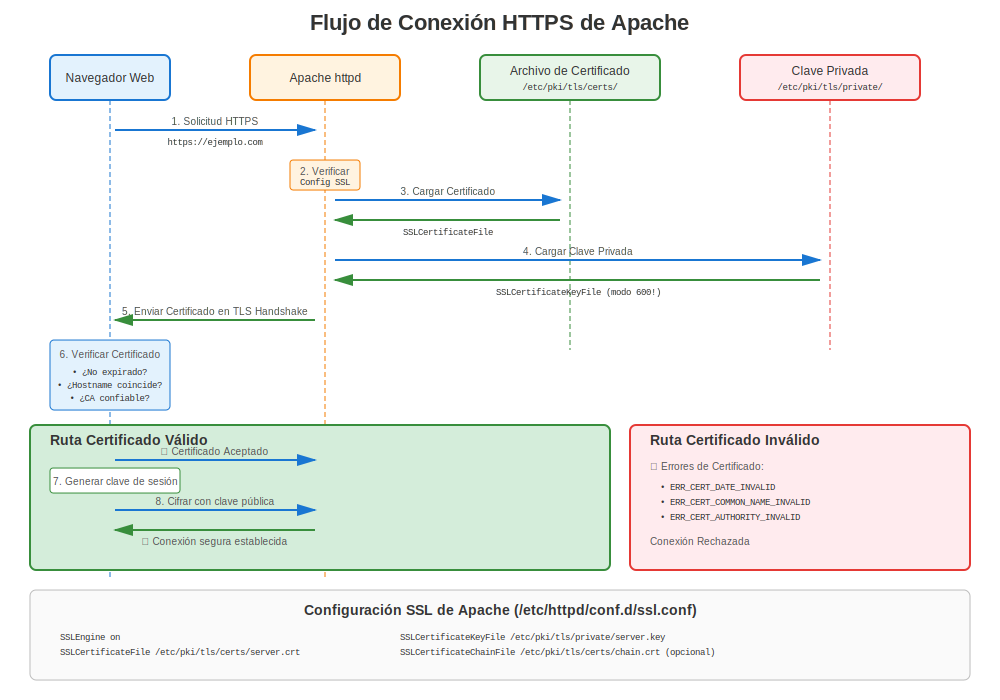
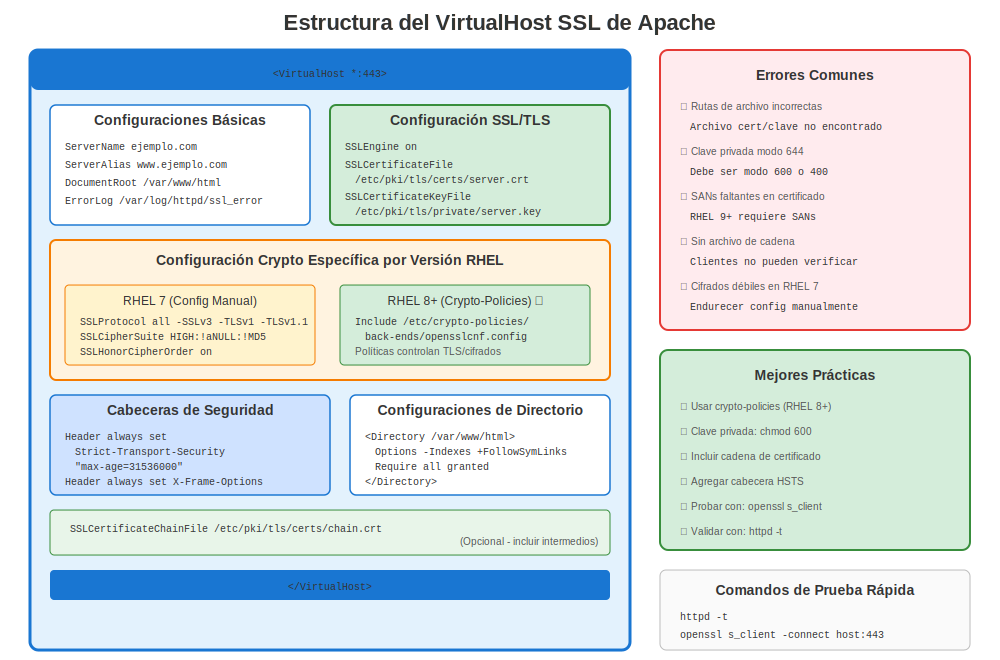

# Capítulo 14: Apache httpd en RHEL

> **Más Común:** Apache (httpd) es el servidor web más ampliamente desplegado en RHEL. Domina la configuración HTTPS de Apache en todas las versiones de RHEL.

---

## 14.1 Resumen de Apache en RHEL



**Nombre del Paquete:** `httpd`
**Módulo SSL/TLS:** `mod_ssl`
**Ubicación de Config:** `/etc/httpd/conf.d/ssl.conf`
**Ruta de Certificados:** `/etc/pki/tls/certs/`
**Ruta de Claves:** `/etc/pki/tls/private/`

### Comparación de Versiones

| Versión RHEL | Versión Apache | OpenSSL | Enfoque de Config |
|--------------|----------------|---------|-------------------|
| RHEL 7 | 2.4.6 | 1.0.2k | Configuración SSL manual |
| RHEL 8 | 2.4.37+ | 1.1.1k | Manual + crypto-policies |
| RHEL 9 | 2.4.53+ | 3.5.5 | Crypto-policies preferido |
| RHEL 10 | 2.4.62+ | 3.5.5 | Crypto-policies óptimo |

---

## 14.2 Instalación

### RHEL 7

```bash
#============================================#
# INSTALAR APACHE CON SSL (RHEL 7)
#============================================#

sudo yum install httpd mod_ssl -y
sudo systemctl enable httpd
sudo systemctl start httpd

# Abrir firewall
sudo firewall-cmd --permanent --add-service=http
sudo firewall-cmd --permanent --add-service=https
sudo firewall-cmd --reload

# Verificar
systemctl status httpd
```

### RHEL 8/9/10

```bash
#============================================#
# INSTALAR APACHE CON SSL (RHEL 8/9/10)
#============================================#

sudo dnf install httpd mod_ssl -y
sudo systemctl enable httpd
sudo systemctl start httpd

# Abrir firewall
sudo firewall-cmd --permanent --add-service=http
sudo firewall-cmd --permanent --add-service=https
sudo firewall-cmd --reload

# Verificar
systemctl status httpd
ss -tlnp | grep :443  # Verificar si escucha en 443
```

---

## 14.3 Configuración Básica SSL



### Configuración SSL Predeterminada

```bash
# Archivo principal de configuración SSL
/etc/httpd/conf.d/ssl.conf

# Directivas clave:
SSLEngine on
SSLCertificateFile /etc/pki/tls/certs/localhost.crt
SSLCertificateKeyFile /etc/pki/tls/private/localhost.key
```

### Ejemplo Completo de Virtual Host

```apache
#============================================#
# /etc/httpd/conf.d/ssl.conf
# O /etc/httpd/conf.d/mysite-ssl.conf
#============================================#

<VirtualHost *:443>
    ServerName www.example.com
    ServerAlias example.com
    DocumentRoot /var/www/html

    # Habilitar SSL/TLS
    SSLEngine on

    # Archivos de certificado
    SSLCertificateFile      /etc/pki/tls/certs/www.example.com.crt
    SSLCertificateKeyFile   /etc/pki/tls/private/www.example.com.key
    SSLCertificateChainFile /etc/pki/tls/certs/chain.crt

    # Protocolos TLS (RHEL 7 - config manual)
    SSLProtocol             all -SSLv3 -TLSv1 -TLSv1.1

    # Suite de cifrado (RHEL 7 - manual)
    SSLCipherSuite          HIGH:!aNULL:!MD5:!3DES:!RC4
    SSLHonorCipherOrder     on

    # HSTS (recomendado)
    Header always set Strict-Transport-Security "max-age=31536000; includeSubDomains"

    # Logging
    ErrorLog  /var/log/httpd/ssl_error_log
    CustomLog /var/log/httpd/ssl_access_log combined
</VirtualHost>
```

---

## 14.4 Configuración Específica por Versión

### RHEL 7: Configuración SSL Manual

```apache
#============================================#
# APACHE SSL - MEJORES PRÁCTICAS RHEL 7
#============================================#

<VirtualHost *:443>
    ServerName www.example.com
    SSLEngine on

    # Certificados
    SSLCertificateFile      /etc/pki/tls/certs/www.crt
    SSLCertificateKeyFile   /etc/pki/tls/private/www.key
    SSLCertificateChainFile /etc/pki/tls/certs/chain.crt

    # REQUERIDO: Deshabilitar versiones TLS antiguas manualmente
    SSLProtocol all -SSLv2 -SSLv3 -TLSv1 -TLSv1.1

    # REQUERIDO: Solo cifrados fuertes
    SSLCipherSuite ECDHE-ECDSA-AES256-GCM-SHA384:ECDHE-RSA-AES256-GCM-SHA384:ECDHE-ECDSA-CHACHA20-POLY1305:ECDHE-RSA-CHACHA20-POLY1305:ECDHE-ECDSA-AES128-GCM-SHA256:ECDHE-RSA-AES128-GCM-SHA256
    SSLHonorCipherOrder on

    # Encabezados de seguridad
    Header always set Strict-Transport-Security "max-age=31536000"
    Header always set X-Frame-Options DENY
    Header always set X-Content-Type-Options nosniff
</VirtualHost>
```

### RHEL 8/9/10: Integrado con Crypto-Policies

```apache
#============================================#
# APACHE SSL - RHEL 8/9/10 CON CRYPTO-POLICIES
#============================================#

<VirtualHost *:443>
    ServerName www.example.com
    SSLEngine on

    # Certificados
    SSLCertificateFile      /etc/pki/tls/certs/www.crt
    SSLCertificateKeyFile   /etc/pki/tls/private/www.key
    SSLCertificateChainFile /etc/pki/tls/certs/chain.crt

    # ¡NO NECESITAS establecer SSLProtocol o SSLCipherSuite!
    # Crypto-policies lo maneja automáticamente
    # (a menos que tengas requisitos específicos)

    # Encabezados de seguridad (aún manuales)
    Header always set Strict-Transport-Security "max-age=31536000"
    Header always set X-Frame-Options DENY
    Header always set X-Content-Type-Options nosniff
</VirtualHost>
```

**Diferencia Clave:** ¡En RHEL 8+, crypto-policies configura automáticamente versiones TLS y cifrados!

### Verificar Integración con Crypto-Policy

```bash
#============================================#
# VERIFICAR CRYPTO-POLICY (RHEL 8/9/10)
#============================================#

# Verificar política actual
update-crypto-policies --show

# Ver política específica de Apache
cat /etc/crypto-policies/back-ends/httpd.config

# Apache incluye esto automáticamente
grep -r "crypto-policies" /etc/httpd/
```

---

## 14.5 Generación de Certificados para Apache

### Flujo de Trabajo Completo

```bash
#============================================#
# GENERAR CERTIFICADO PARA APACHE (TODAS LAS VERSIONES)
#============================================#

# Paso 1: Generar clave privada
sudo openssl genpkey -algorithm RSA \
  -out /etc/pki/tls/private/www.example.com.key \
  -pkeyopt rsa_keygen_bits:2048

# Paso 2: Establecer permisos
sudo chmod 600 /etc/pki/tls/private/www.example.com.key
sudo chown root:root /etc/pki/tls/private/www.example.com.key

# Paso 3: Generar CSR con SANs
sudo openssl req -new \
  -key /etc/pki/tls/private/www.example.com.key \
  -out /tmp/www.example.com.csr \
  -subj "/C=US/ST=State/L=City/O=Company/CN=www.example.com" \
  -addext "subjectAltName=DNS:www.example.com,DNS:example.com"

# Paso 4: Enviar CSR a CA, recibir certificado

# Paso 5: Instalar certificado
sudo cp www.example.com.crt /etc/pki/tls/certs/
sudo chmod 644 /etc/pki/tls/certs/www.example.com.crt

# Paso 6: Si usas certificados intermedios, instalar cadena
sudo cp chain.crt /etc/pki/tls/certs/www.example.com-chain.crt

# Paso 7: Actualizar configuración de Apache (ver sección 14.3)

# Paso 8: Probar configuración
sudo apachectl configtest

# Paso 9: Recargar Apache
sudo systemctl reload httpd

# Paso 10: Probar HTTPS
curl -v https://www.example.com/
openssl s_client -connect www.example.com:443 -servername www.example.com
```

---

## 14.6 Integración con certmonger (¡Automatización!)

### Usar certmonger con Apache

```bash
#============================================#
# AUTOMATIZAR CERTIFICADOS APACHE CON CERTMONGER
#============================================#

# Instalar certmonger
sudo dnf install certmonger
sudo systemctl enable --now certmonger

# Opción 1: FreeIPA (CA Interna)
sudo ipa-getcert request \
  -f /etc/pki/tls/certs/www.example.com.crt \
  -k /etc/pki/tls/private/www.example.com.key \
  -D www.example.com \
  -K host/www.example.com@REALM \
  -C "systemctl reload httpd"  # ¡Auto-recargar Apache después de renovación!

# Opción 2: Let's Encrypt (RHEL 9+)
sudo getcert request \
  -c lets-encrypt \
  -f /etc/pki/tls/certs/www.example.com.crt \
  -k /etc/pki/tls/private/www.example.com.key \
  -D www.example.com \
  -C "systemctl reload httpd"

# Verificar estado
sudo getcert list

# Esperar estado MONITORING
# ¡El certificado se renueva automáticamente ~30 días antes de expirar!
```

**Beneficios:**
- ✅ Renovación automática
- ✅ Sin tiempo de inactividad (recarga, no reinicio)
- ✅ Rastrea expiración
- ✅ Alertas por email si falla

---

## 14.7 Let's Encrypt con certbot

> **⚠️ IMPORTANTE: EPEL Requerido**
>
> certbot **NO** está disponible en repositorios oficiales de RHEL. Requiere EPEL (Extra Packages for Enterprise Linux), un repositorio **mantenido por la comunidad**.
>
> Para entornos RHEL de producción, considera:
> - FreeIPA con certmonger (recomendado para RHEL)
> - Gestión manual de certificados
> - CA comercial con certmonger

```bash
#============================================#
# CONFIGURACIÓN DE CERTBOT (¡REQUIERE EPEL!)
#============================================#

# Paso 1: Habilitar EPEL (TODAS las versiones RHEL)
sudo dnf install https://dl.fedoraproject.org/pub/epel/epel-release-latest-$(rpm -E %rhel).noarch.rpm

# O en RHEL 8/9/10:
sudo dnf install epel-release

# Paso 2: Instalar certbot
sudo dnf install certbot python3-certbot-apache

# Paso 3: Obtener certificado (¡automatizado!)
sudo certbot --apache -d www.example.com -d example.com

# Paso 4: Certbot automáticamente:
#  - Genera certificado
#  - Configura Apache
#  - Configura temporizador de renovación
#  - Habilita redirección HTTPS

# Paso 5: Probar renovación automática
sudo certbot renew --dry-run

# Verificar temporizador de renovación
systemctl list-timers | grep certbot
```

**Pros:**
- ✅ Completamente automatizado
- ✅ Certificados gratuitos
- ✅ Configuración de Apache manejada automáticamente

**Contras:**
- ❌ Requiere EPEL (no soportado oficialmente por Red Hat)
- ❌ Dependencia externa (Let's Encrypt)
- ⚠️ El dominio debe ser públicamente accesible

---

## 14.8 Solución de Problemas de Apache HTTPS

### Lista de Verificación de Problemas Comunes

```bash
#============================================#
# LISTA DE VERIFICACIÓN SOLUCIÓN DE PROBLEMAS APACHE SSL
#============================================#

# 1. Verificar si mod_ssl está cargado
sudo httpd -M | grep ssl_module
# Debería mostrar: ssl_module (shared)

# 2. Verificar sintaxis de configuración
sudo apachectl configtest
# Debería mostrar: Syntax OK

# 3. Verificar que existan archivos de certificado
ls -l /etc/pki/tls/certs/www.crt
ls -l /etc/pki/tls/private/www.key

# 4. Verificar permisos
ls -l /etc/pki/tls/private/www.key
# Debería ser: -rw------- (600)

# 5. Verificar contexto SELinux
ls -Z /etc/pki/tls/certs/www.crt
ls -Z /etc/pki/tls/private/www.key
# Debería mostrar: cert_t

# 6. Probar coincidencia par certificado/clave
CERT_MOD=$(openssl x509 -noout -modulus -in /etc/pki/tls/certs/www.crt | openssl md5)
KEY_MOD=$(openssl rsa -noout -modulus -in /etc/pki/tls/private/www.key | openssl md5)
[ "$CERT_MOD" = "$KEY_MOD" ] && echo "✅ Coincide" || echo "❌ ¡No coincide!"

# 7. Verificar si el puerto 443 está escuchando
ss -tlnp | grep :443

# 8. Verificar firewall
sudo firewall-cmd --list-services | grep https

# 9. Probar localmente
curl -vk https://localhost/

# 10. Verificar logs
sudo tail -f /var/log/httpd/ssl_error_log
```

### Errores Comunes y Soluciones

| Mensaje de Error | Causa | Solución |
|------------------|-------|----------|
| "SSLCertificateFile: file does not exist" | Ruta incorrecta | Corregir ruta en ssl.conf |
| "Permission denied" en archivo de clave | Permisos incorrectos | `chmod 600` en clave |
| "certificate verify failed" | Problema de cadena | Instalar certs intermedios |
| "SSLCertificateKeyFile: file does not exist" | Clave faltante | Generar o restaurar clave |
| "Private key does not match certificate" | Desajuste cert/clave | Regenerar CSR con clave correcta |
| "SSL Library Error" | mod_ssl no cargado | Instalar paquete mod_ssl |
| "ca md too weak" (RHEL 9+) | Firma SHA-1 | Reemitir con SHA-256+ |
| "name mismatch" | Hostname no coincide CN/SAN | Corregir SANs del certificado |

---

## 14.9 Solución de Problemas Específica por Versión

### Específico RHEL 7

```bash
#============================================#
# PROBLEMAS APACHE RHEL 7
#============================================#

# Problema: Navegadores modernos rechazan TLS 1.0/1.1
# Solución: Deshabilitar TLS antiguo en ssl.conf
SSLProtocol all -SSLv2 -SSLv3 -TLSv1 -TLSv1.1

# Problema: Cifrados débiles marcados por escaneo
# Solución: Usar cifrados fuertes
SSLCipherSuite ECDHE-RSA-AES256-GCM-SHA384:ECDHE-RSA-AES128-GCM-SHA256:HIGH:!aNULL:!MD5
SSLHonorCipherOrder on

# Problema: Sin SANs en certificado
# Solución: Reemitir con SANs (ver 13.5)

# Probar
openssl s_client -connect localhost:443 -tls1_2
```

### Específico RHEL 8/9/10

```bash
#============================================#
# PROBLEMAS APACHE RHEL 8/9/10
#============================================#

# Problema: El servicio falla después de cambio de crypto-policy
# Diagnóstico:
update-crypto-policies --show
sudo journalctl -xe -u httpd | grep -i tls

# Solución 1: Verificar que la política sea correcta
sudo update-crypto-policies --set DEFAULT

# Solución 2: Verificar si sobrescribes manualmente la política
grep -E "SSLProtocol|SSLCipherSuite" /etc/httpd/conf.d/*.conf
# Si se encuentra, eliminar (dejar que crypto-policy lo maneje)

# Problema: Error "no shared cipher"
# Diagnóstico: Cliente muy antiguo o política muy estricta
# Solución temporal:
sudo update-crypto-policies --set LEGACY
sudo systemctl restart httpd

# Solución apropiada: Actualizar cliente o crear módulo de política personalizado
```

---

## 14.10 Mejores Prácticas de Seguridad

### Configuración SSL Apache Fortalecida

```apache
#============================================#
# CONFIGURACIÓN SSL FORTALECIDA (TODAS LAS VERSIONES)
#============================================#

<VirtualHost *:443>
    ServerName secure.example.com

    SSLEngine on
    SSLCertificateFile      /etc/pki/tls/certs/secure.crt
    SSLCertificateKeyFile   /etc/pki/tls/private/secure.key

    # RHEL 7: Configuración TLS manual
    # SSLProtocol TLSv1.2 TLSv1.3
    # SSLCipherSuite ECDHE-RSA-AES256-GCM-SHA384:ECDHE-RSA-AES128-GCM-SHA256
    # SSLHonorCipherOrder on

    # RHEL 8/9/10: Crypto-policies manejan lo anterior automáticamente

    # HSTS (forzar HTTPS por 1 año)
    Header always set Strict-Transport-Security "max-age=31536000; includeSubDomains; preload"

    # Prevenir clickjacking
    Header always set X-Frame-Options "DENY"

    # Prevenir MIME-type sniffing
    Header always set X-Content-Type-Options "nosniff"

    # Deshabilitar firma del servidor
    ServerSignature Off
    ServerTokens Prod

    # OCSP Stapling (RHEL 8/9/10)
    SSLUseStapling on
    SSLStaplingCache "shmcb:/var/run/ocsp(128000)"

    # Autenticación de certificado de cliente (opcional)
    # SSLVerifyClient require
    # SSLVerifyDepth 3
    # SSLCACertificateFile /etc/pki/tls/certs/client-ca.crt
</VirtualHost>

# Fuera de VirtualHost (configuraciones SSL globales)
SSLStaplingCache "shmcb:/var/run/ocsp(128000)"
```

---

## 14.11 Redirección HTTP a HTTPS

### Forzar HTTPS

```apache
#============================================#
# REDIRIGIR HTTP → HTTPS
#============================================#

# Método 1: VirtualHost Separado
<VirtualHost *:80>
    ServerName www.example.com
    Redirect permanent / https://www.example.com/
</VirtualHost>

<VirtualHost *:443>
    ServerName www.example.com
    # ... configuración SSL ...
</VirtualHost>

# Método 2: mod_rewrite
<VirtualHost *:80>
    ServerName www.example.com

    RewriteEngine On
    RewriteCond %{HTTPS} off
    RewriteRule ^(.*)$ https://%{HTTP_HOST}$1 [R=301,L]
</VirtualHost>
```

---

## 14.12 Probar Apache HTTPS

### Pruebas Comprehensivas

```bash
#============================================#
# SUITE DE PRUEBAS APACHE HTTPS
#============================================#

# Prueba 1: Sintaxis de configuración
sudo apachectl configtest

# Prueba 2: Módulo SSL cargado
sudo httpd -M | grep ssl

# Prueba 3: Puerto escuchando
ss -tlnp | grep :443

# Prueba 4: Conexión local
curl -vk https://localhost/

# Prueba 5: Hostname real
curl -v https://www.example.com/

# Prueba 6: Validación de certificado
openssl s_client -connect www.example.com:443 -servername www.example.com

# Prueba 7: TLS 1.2
openssl s_client -connect www.example.com:443 -tls1_2

# Prueba 8: TLS 1.3 (RHEL 8+)
openssl s_client -connect www.example.com:443 -tls1_3

# Prueba 9: Verificar detalles del certificado desde servidor
echo | openssl s_client -connect www.example.com:443 -servername www.example.com 2>&1 | \
  openssl x509 -noout -text | head -30

# Prueba 10: Prueba online (externa)
# Usar: https://www.ssllabs.com/ssltest/
```

---

## 14.13 Optimización de Rendimiento

### Ajuste de Rendimiento SSL/TLS

```apache
#============================================#
# AJUSTE DE RENDIMIENTO
#============================================#

<VirtualHost *:443>
    # ... configuración básica ...

    # Caché de sesión (mejora el rendimiento)
    SSLSessionCache         "shmcb:/var/cache/httpd/ssl_scache(512000)"
    SSLSessionCacheTimeout  300

    # OCSP Stapling (reduce búsqueda del lado del cliente)
    SSLUseStapling on
    SSLStaplingCache "shmcb:/var/run/ocsp(128000)"

    # Keep-Alive (reutilizar conexiones)
    KeepAlive On
    MaxKeepAliveRequests 100
    KeepAliveTimeout 5

    # HTTP/2 (RHEL 8/9/10)
    Protocols h2 h2c http/1.1
</VirtualHost>
```

---

## 14.14 Monitorear Apache HTTPS

### Qué Monitorear

```bash
#============================================#
# MONITOREO APACHE HTTPS
#============================================#

# Expiración de certificado
openssl s_client -connect localhost:443 -servername $(hostname -f) 2>/dev/null | \
  openssl x509 -noout -dates

# Estado del servicio
systemctl status httpd

# Conteo de conexiones
ss -tn | grep :443 | wc -l

# Monitoreo de log de errores
sudo tail -f /var/log/httpd/ssl_error_log

# Estado de certmonger (si se usa)
sudo getcert list -f /etc/pki/tls/certs/www.crt

# Análisis de log de acceso
sudo tail -f /var/log/httpd/ssl_access_log | grep -E "HTTP/[12]"
```

---

## 14.15 Guía Rápida de Solución de Problemas

```
¿Apache HTTPS No Funciona?

├─ ¿Apache no inicia?
│  ├─ Verificar: apachectl configtest
│  ├─ Verificar: journalctl -xe -u httpd
│  └─ Solución: Errores de configuración
│
├─ ¿No puedes conectar al puerto 443?
│  ├─ Verificar: ss -tlnp | grep :443
│  ├─ Verificar: firewall-cmd --list-services
│  └─ Solución: Abrir firewall, iniciar httpd
│
├─ ¿Advertencias de certificado en el navegador?
│  ├─ Verificar: Expiración de certificado
│  ├─ Verificar: Coincidencia de hostname (CN/SANs)
│  ├─ Verificar: Cadena de confianza
│  └─ Solución: Renovar cert, corregir SANs, instalar CA
│
├─ ¿Error "No shared cipher"?
│  ├─ Verificar: update-crypto-policies --show
│  ├─ Verificar: Versión TLS del cliente
│  └─ Solución: Actualizar política o cliente
│
└─ ¿Errores de permisos?
   ├─ Verificar: ls -lZ /etc/pki/tls/private/*.key
   ├─ Verificar: Denegaciones SELinux
   └─ Solución: chmod 600, restorecon
```

---

## 14.16 Conclusiones Clave

1. **Apache + mod_ssl** es el servidor web estándar de RHEL
2. **RHEL 7:** Configuración TLS manual requerida
3. **RHEL 8/9/10:** Crypto-policies simplifican la configuración
4. **Integración con certmonger** habilita automatización
5. **certbot requiere EPEL** (no soportado oficialmente)
6. **Siempre usar SANs** en certificados
7. **Probar exhaustivamente** antes de despliegue en producción

---

## Tarjeta de Referencia Rápida

```
┌─────────────────────────────────────────────────────────────────────┐
│ REFERENCIA RÁPIDA APACHE HTTPD HTTPS                                │
├─────────────────────────────────────────────────────────────────────┤
│ Instalar:       dnf install httpd mod_ssl                           │
│ Config:         /etc/httpd/conf.d/ssl.conf                          │
│ Certs:          /etc/pki/tls/certs/                                 │
│ Claves:         /etc/pki/tls/private/ (¡modo 600!)                  │
│                                                                     │
│ Probar config:  apachectl configtest                                │
│ Recargar:       systemctl reload httpd                              │
│ Logs:           /var/log/httpd/ssl_error_log                        │
│                                                                     │
│ certmonger:     ipa-getcert request ... -C "systemctl reload httpd" │
│ certbot:        certbot --apache (¡requiere EPEL!)                  │
│                                                                     │
│ Probar:         curl -v https://localhost/                          │
│                 openssl s_client -connect host:443                  │
└─────────────────────────────────────────────────────────────────────┘

⚠️ RHEL 8/9/10: Dejar que crypto-policies maneje config TLS/cifrado
⚠️ certbot requiere EPEL (no soportado oficialmente)
```

---

## 🧪 Laboratorio Práctico

**Lab 06: Configuración HTTPS de Apache**

Configura Apache con SSL/TLS en diferentes versiones de RHEL

- 📁 **Ubicación:** `labs/es_ES/06-apache-https/`
- ⏱️ **Tiempo:** 30-40 minutos
- 🎯 **Nivel:** Intermedio

---

**Navegación del Capítulo**

| [← Anterior: Capítulo 13 - Compatibilidad Entre Versiones](../part-02-version-specific/13-cross-version-compatibility.md) | [Siguiente: Capítulo 15 - NGINX en RHEL →](15-nginx.md) |
|:---|---:|
