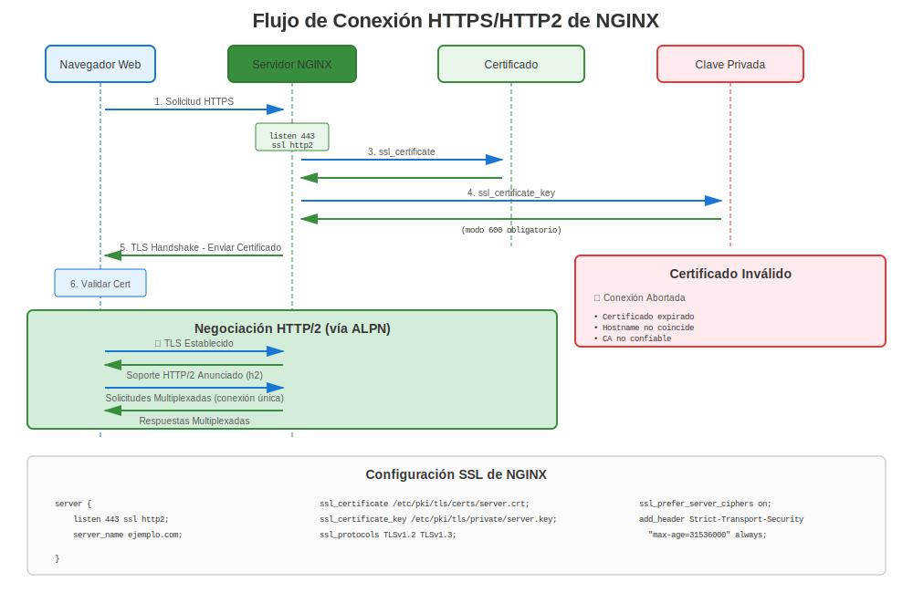

# Capítulo 15: NGINX en RHEL

> **Alto Rendimiento:** NGINX es un servidor web y proxy inverso de alto rendimiento popular. Aprende cómo configurar NGINX con certificados TLS en RHEL.

---

## 15.1 Resumen de NGINX en RHEL



**Nombre del Paquete:** `nginx`
**Ubicación de Config:** `/etc/nginx/nginx.conf`
**Ruta de Certificados:** `/etc/pki/tls/certs/` o `/etc/nginx/certs/`
**Ruta de Claves:** `/etc/pki/tls/private/` o `/etc/nginx/certs/`

### Fuentes de Instalación por Versión de RHEL

| Versión RHEL | Fuente NGINX | Cómo Instalar |
|--------------|--------------|---------------|
| RHEL 7 | **EPEL** (comunidad) | Habilitar EPEL, luego `yum install nginx` |
| RHEL 8 | **AppStream** (oficial) | `dnf module install nginx:1.20` |
| RHEL 9 | **AppStream** (oficial) | `dnf install nginx` |
| RHEL 10 | **AppStream** (oficial) | `dnf install nginx` |

> **Nota:** RHEL 7 requiere EPEL para NGINX. RHEL 8+ incluye NGINX en repos oficiales.

---

## 15.2 Instalación

### RHEL 7

```bash
#============================================#
# INSTALAR NGINX (RHEL 7 - REQUIERE EPEL)
#============================================#

# Paso 1: Habilitar EPEL
sudo yum install epel-release -y

# Paso 2: Instalar NGINX
sudo yum install nginx -y

# Paso 3: Habilitar e iniciar
sudo systemctl enable nginx
sudo systemctl start nginx

# Paso 4: Abrir firewall
sudo firewall-cmd --permanent --add-service=http
sudo firewall-cmd --permanent --add-service=https
sudo firewall-cmd --reload

# Verificar
systemctl status nginx
curl http://localhost/
```

### RHEL 8

```bash
#============================================#
# INSTALAR NGINX (RHEL 8 - DE APPSTREAM)
#============================================#

# Listar módulos NGINX disponibles
dnf module list nginx

# Instalar versión específica
sudo dnf module install nginx:1.20 -y

# O instalar predeterminado
sudo dnf install nginx -y

# Habilitar e iniciar
sudo systemctl enable nginx
sudo systemctl start nginx

# Abrir firewall
sudo firewall-cmd --permanent --add-service=http
sudo firewall-cmd --permanent --add-service=https
sudo firewall-cmd --reload
```

### RHEL 9/10

```bash
#============================================#
# INSTALAR NGINX (RHEL 9/10)
#============================================#

sudo dnf install nginx -y

sudo systemctl enable nginx
sudo systemctl start nginx

# Abrir firewall
sudo firewall-cmd --permanent --add-service=http
sudo firewall-cmd --permanent --add-service=https
sudo firewall-cmd --reload

# Verificar
systemctl status nginx
ss -tlnp | grep :443
```

---

## 15.3 Configuración Básica HTTPS

### Configuración TLS Mínima

```nginx
#============================================#
# /etc/nginx/nginx.conf o /etc/nginx/conf.d/default.conf
#============================================#

server {
    listen 80;
    server_name www.example.com;

    # Redirigir HTTP a HTTPS
    return 301 https://$server_name$request_uri;
}

server {
    listen 443 ssl http2;
    server_name www.example.com;

    # Archivos de certificado
    ssl_certificate     /etc/pki/tls/certs/www.example.com.crt;
    ssl_certificate_key /etc/pki/tls/private/www.example.com.key;

    # Protocolos TLS
    ssl_protocols TLSv1.2 TLSv1.3;

    # Cifrados
    ssl_ciphers HIGH:!aNULL:!MD5;
    ssl_prefer_server_ciphers on;

    # Directorio raíz
    root /usr/share/nginx/html;
    index index.html;

    location / {
        try_files $uri $uri/ =404;
    }
}
```

### Configuración de Producción Fortalecida

```nginx
#============================================#
# CONFIGURACIÓN HTTPS NGINX GRADO PRODUCCIÓN
#============================================#

server {
    listen 443 ssl http2;
    server_name api.example.com;

    # Certificados
    ssl_certificate     /etc/pki/tls/certs/api.example.com.crt;
    ssl_certificate_key /etc/pki/tls/private/api.example.com.key;

    # Versiones TLS
    ssl_protocols TLSv1.2 TLSv1.3;

    # Cifrados fuertes
    ssl_ciphers 'ECDHE-ECDSA-AES256-GCM-SHA384:ECDHE-RSA-AES256-GCM-SHA384:ECDHE-ECDSA-CHACHA20-POLY1305:ECDHE-RSA-CHACHA20-POLY1305:ECDHE-ECDSA-AES128-GCM-SHA256:ECDHE-RSA-AES128-GCM-SHA256';
    ssl_prefer_server_ciphers on;

    # Parámetros DH (opcional, para perfect forward secrecy)
    ssl_dhparam /etc/nginx/dhparam.pem;

    # Optimización de sesión SSL
    ssl_session_cache shared:SSL:10m;
    ssl_session_timeout 10m;
    ssl_session_tickets off;

    # OCSP Stapling
    ssl_stapling on;
    ssl_stapling_verify on;
    ssl_trusted_certificate /etc/pki/tls/certs/chain.crt;
    resolver 8.8.8.8 8.8.4.4 valid=300s;
    resolver_timeout 5s;

    # HSTS
    add_header Strict-Transport-Security "max-age=31536000; includeSubDomains; preload" always;

    # Encabezados de seguridad
    add_header X-Frame-Options DENY always;
    add_header X-Content-Type-Options nosniff always;
    add_header X-XSS-Protection "1; mode=block" always;

    # Logging
    access_log /var/log/nginx/api_access.log;
    error_log /var/log/nginx/api_error.log;

    location / {
        proxy_pass http://backend_servers;
        proxy_set_header Host $host;
        proxy_set_header X-Real-IP $remote_addr;
        proxy_set_header X-Forwarded-For $proxy_add_x_forwarded_for;
        proxy_set_header X-Forwarded-Proto $scheme;
    }
}
```

---

## 15.4 Configuración de Certificados

### Generar Certificados para NGINX

```bash
#============================================#
# GENERACIÓN DE CERTIFICADOS PARA NGINX
#============================================#

# Paso 1: Crear directorio de certs (opcional)
sudo mkdir -p /etc/nginx/certs
sudo chmod 755 /etc/nginx/certs

# Paso 2: Generar clave privada
sudo openssl genpkey -algorithm RSA \
  -out /etc/pki/tls/private/api.example.com.key \
  -pkeyopt rsa_keygen_bits:2048

# Paso 3: Establecer permisos
sudo chmod 600 /etc/pki/tls/private/api.example.com.key
sudo chown root:nginx /etc/pki/tls/private/api.example.com.key

# Paso 4: Generar CSR
sudo openssl req -new \
  -key /etc/pki/tls/private/api.example.com.key \
  -out /tmp/api.example.com.csr \
  -subj "/CN=api.example.com" \
  -addext "subjectAltName=DNS:api.example.com,DNS:www.api.example.com"

# Paso 5: Enviar a CA, recibir certificado

# Paso 6: Instalar certificado
sudo cp api.example.com.crt /etc/pki/tls/certs/
sudo chmod 644 /etc/pki/tls/certs/api.example.com.crt
```

---

## 15.5 Integración con certmonger

### Renovación Automatizada con certmonger

```bash
#============================================#
# CERTMONGER + NGINX
#============================================#

# Instalar certmonger
sudo dnf install certmonger
sudo systemctl enable --now certmonger

# Solicitar certificado de FreeIPA
sudo ipa-getcert request \
  -f /etc/pki/tls/certs/nginx.example.com.crt \
  -k /etc/pki/tls/private/nginx.example.com.key \
  -D nginx.example.com \
  -K host/nginx.example.com@REALM \
  -C "systemctl reload nginx"  # ¡Auto-recargar al renovar!

# O de Let's Encrypt (RHEL 9+)
sudo getcert request \
  -c lets-encrypt \
  -f /etc/pki/tls/certs/nginx.example.com.crt \
  -k /etc/pki/tls/private/nginx.example.com.key \
  -D nginx.example.com \
  -C "systemctl reload nginx"

# Monitorear estado
sudo getcert list
```

---

## 15.6 Let's Encrypt con certbot

> **⚠️ IMPORTANTE: EPEL Requerido**
>
> certbot **NO** está disponible en repositorios oficiales de RHEL. Requiere EPEL, un repositorio **mantenido por la comunidad**.
>
> **Instalación:** Todas las versiones RHEL requieren EPEL, pero el comando de habilitación varía según la versión. Consulte el [Capítulo 24](../part-04-automation/24-letsencrypt-certbot.md) para el flujo completo de certbot.

### RHEL 7

```bash
# Paso 1: Habilitar EPEL
sudo yum install https://dl.fedoraproject.org/pub/epel/epel-release-latest-7.noarch.rpm -y

# Paso 2: Instalar certbot con plugin NGINX
sudo yum install certbot python2-certbot-nginx -y
```

### RHEL 8

```bash
# Paso 1: Habilitar EPEL
sudo dnf install https://dl.fedoraproject.org/pub/epel/epel-release-latest-8.noarch.rpm -y
# O, con suscripción activa:
# sudo dnf install epel-release -y

# Paso 2: Instalar certbot con plugin NGINX
sudo dnf install certbot python3-certbot-nginx -y
```

### RHEL 9/10

```bash
# Paso 1: Habilitar EPEL
sudo dnf install epel-release -y

# Paso 2: Instalar certbot con plugin NGINX
sudo dnf install certbot python3-certbot-nginx -y
```

### Obtener y configurar el certificado (todas las versiones)

```bash
# Paso 3: Obtener e instalar certificado (¡automatizado!)
sudo certbot --nginx -d www.example.com -d example.com

# Certbot hará:
#  ✅ Generar certificado de Let's Encrypt
#  ✅ Actualizar configuración NGINX automáticamente
#  ✅ Configurar redirección HTTP a HTTPS
#  ✅ Configurar renovación automática

# Paso 4: Verificar temporizador de renovación automática
systemctl list-timers | grep certbot

# Paso 5: Probar renovación (simulación)
sudo certbot renew --dry-run

# ¡El certificado se renueva automáticamente cada 60 días!
```

**Recuerda:** EPEL tiene soporte comunitario, no de Red Hat. Para producción empresarial, considera FreeIPA + certmonger.

---

## 15.7 Proxy Inverso con TLS

### NGINX como Proxy de Terminación TLS

```nginx
#============================================#
# PROXY INVERSO NGINX CON TLS
#============================================#

upstream backend_servers {
    server 10.0.1.10:8080;
    server 10.0.1.11:8080;
    server 10.0.1.12:8080;
}

server {
    listen 443 ssl http2;
    server_name proxy.example.com;

    # Terminación TLS aquí
    ssl_certificate     /etc/pki/tls/certs/proxy.crt;
    ssl_certificate_key /etc/pki/tls/private/proxy.key;

    ssl_protocols TLSv1.2 TLSv1.3;
    ssl_ciphers HIGH:!aNULL:!MD5;

    # Proxy a backends (HTTP)
    location / {
        proxy_pass http://backend_servers;
        proxy_set_header Host $host;
        proxy_set_header X-Real-IP $remote_addr;
        proxy_set_header X-Forwarded-For $proxy_add_x_forwarded_for;
        proxy_set_header X-Forwarded-Proto https;
    }
}
```

---

## 15.8 Solución de Problemas NGINX HTTPS

### Comandos de Diagnóstico

```bash
#============================================#
# SOLUCIÓN DE PROBLEMAS NGINX HTTPS
#============================================#

# Probar sintaxis de configuración
sudo nginx -t

# Mostrar configuración completa (con includes)
sudo nginx -T

# Verificar rutas de certificado SSL
sudo nginx -T | grep ssl_certificate

# Verificar archivo de certificado
sudo openssl x509 -in /etc/pki/tls/certs/nginx.crt -noout -text

# Verificar archivo de clave
sudo openssl rsa -in /etc/pki/tls/private/nginx.key -check

# Verificar coincidencia par cert/clave
CERT=$(openssl x509 -noout -modulus -in /etc/pki/tls/certs/nginx.crt | openssl md5)
KEY=$(openssl rsa -noout -modulus -in /etc/pki/tls/private/nginx.key | openssl md5)
[ "$CERT" = "$KEY" ] && echo "✅ Coincide" || echo "❌ ¡Desajuste!"

# Verificar si NGINX está escuchando en 443
ss -tlnp | grep :443

# Verificar contexto SELinux
ls -Z /etc/pki/tls/certs/nginx.crt
ls -Z /etc/pki/tls/private/nginx.key

# Probar HTTPS localmente
curl -vk https://localhost/

# Verificar logs
sudo tail -f /var/log/nginx/error.log
```

### Errores HTTPS Comunes de NGINX

| Error | Causa | Solución |
|-------|-------|----------|
| "SSL: error:0200100D..." | Permission denied en clave | `chmod 600` en archivo de clave |
| "no ssl configured for the server" | Falta `ssl` en listen | Agregar `listen 443 ssl;` |
| "cannot load certificate" | Archivo no encontrado o inválido | Verificar ruta y formato cert |
| "PEM_read_bio:no start line" | Formato incorrecto | Asegurar que cert esté en formato PEM |
| "key values mismatch" | Cert/clave no coinciden | Regenerar con clave correcta |
| "nginx: [emerg] bind() failed" | Puerto ya en uso | Verificar `ss -tlnp \| grep :443` |

---

## 15.9 Configuración Específica por Versión

### RHEL 7: Configuración TLS Manual

```nginx
#============================================#
# NGINX RHEL 7 - CONFIGURACIÓN SSL MANUAL
#============================================#

server {
    listen 443 ssl;
    server_name www.example.com;

    ssl_certificate     /etc/pki/tls/certs/www.crt;
    ssl_certificate_key /etc/pki/tls/private/www.key;

    # REQUERIDO: Deshabilitar manualmente TLS débil
    ssl_protocols TLSv1.2;  # ¡No TLS 1.0/1.1!

    # REQUERIDO: Establecer manualmente cifrados fuertes
    ssl_ciphers 'ECDHE-RSA-AES256-GCM-SHA384:ECDHE-RSA-AES128-GCM-SHA256:HIGH:!aNULL:!MD5';
    ssl_prefer_server_ciphers on;

    # Encabezados de seguridad
    add_header Strict-Transport-Security "max-age=31536000" always;

    root /usr/share/nginx/html;
}
```

### RHEL 8/9/10: Con Crypto-Policies

```nginx
#============================================#
# NGINX RHEL 8/9/10 - CON CRYPTO-POLICIES
#============================================#

server {
    listen 443 ssl http2;
    server_name www.example.com;

    ssl_certificate     /etc/pki/tls/certs/www.crt;
    ssl_certificate_key /etc/pki/tls/private/www.key;

    # Configuración TLS mínima - ¡crypto-policies manejan el resto!
    ssl_protocols TLSv1.2 TLSv1.3;
    ssl_ciphers HIGH:!aNULL:!MD5;
    ssl_prefer_server_ciphers on;

    # O confiar completamente en crypto-policies:
    # (eliminar ssl_protocols y ssl_ciphers)
    # NGINX usará crypto-policy del sistema

    # Optimización de sesión
    ssl_session_cache shared:SSL:10m;
    ssl_session_timeout 10m;

    # OCSP Stapling
    ssl_stapling on;
    ssl_stapling_verify on;
    ssl_trusted_certificate /etc/pki/tls/certs/chain.crt;

    # HSTS
    add_header Strict-Transport-Security "max-age=31536000; includeSubDomains" always;

    root /usr/share/nginx/html;
}
```

---

## 15.10 Optimización de Rendimiento

### Ajuste de Rendimiento SSL/TLS

```nginx
#============================================#
# OPTIMIZACIÓN DE RENDIMIENTO SSL NGINX
#============================================#

http {
    # Caché de sesión SSL (reduce overhead de handshake)
    ssl_session_cache shared:SSL:50m;
    ssl_session_timeout 1d;
    ssl_session_tickets off;

    # Tamaños de buffer
    ssl_buffer_size 4k;  # Más pequeño = menor latencia, más grande = mejor throughput

    server {
        listen 443 ssl http2;
        server_name fast.example.com;

        ssl_certificate     /etc/pki/tls/certs/fast.crt;
        ssl_certificate_key /etc/pki/tls/private/fast.key;

        # Usar HTTP/2 para multiplexación
        # (ya habilitado en directiva listen)

        # Habilitar OCSP Stapling (reduce tiempo de búsqueda del cliente)
        ssl_stapling on;
        ssl_stapling_verify on;

        # Keep-alive
        keepalive_timeout 70;
        keepalive_requests 100;

        location / {
            proxy_pass http://backend;
            proxy_http_version 1.1;
            proxy_set_header Connection "";
        }
    }
}
```

---

## 15.11 Múltiples Certificados (SNI)

### Indicación de Nombre de Servidor (SNI)

```nginx
#============================================#
# MÚLTIPLES DOMINIOS CON CERTIFICADOS DIFERENTES
#============================================#

# Sitio 1
server {
    listen 443 ssl http2;
    server_name site1.example.com;

    ssl_certificate     /etc/pki/tls/certs/site1.crt;
    ssl_certificate_key /etc/pki/tls/private/site1.key;

    root /var/www/site1;
}

# Sitio 2
server {
    listen 443 ssl http2;
    server_name site2.example.com;

    ssl_certificate     /etc/pki/tls/certs/site2.crt;
    ssl_certificate_key /etc/pki/tls/private/site2.key;

    root /var/www/site2;
}

# Sitio 3 (comodín)
server {
    listen 443 ssl http2;
    server_name *.apps.example.com;

    ssl_certificate     /etc/pki/tls/certs/wildcard.apps.crt;
    ssl_certificate_key /etc/pki/tls/private/wildcard.apps.key;

    root /var/www/apps;
}
```

---

## 15.12 Autenticación de Certificado de Cliente

### TLS Mutuo (mTLS) con NGINX

```nginx
#============================================#
# NGINX CON AUTENTICACIÓN DE CERTIFICADO DE CLIENTE
#============================================#

server {
    listen 443 ssl http2;
    server_name secure.example.com;

    # Certificados del servidor
    ssl_certificate     /etc/pki/tls/certs/secure.crt;
    ssl_certificate_key /etc/pki/tls/private/secure.key;

    # Verificación de certificado de cliente
    ssl_client_certificate /etc/pki/tls/certs/client-ca.crt;
    ssl_verify_client on;  # o 'optional'
    ssl_verify_depth 3;

    # Pasar info de cert de cliente a backend
    location / {
        proxy_pass http://backend;
        proxy_set_header X-SSL-Client-Cert $ssl_client_cert;
        proxy_set_header X-SSL-Client-DN $ssl_client_s_dn;
        proxy_set_header X-SSL-Client-Verify $ssl_client_verify;
    }
}
```

---

## 15.13 Probar NGINX HTTPS

### Suite de Pruebas Comprehensiva

```bash
#============================================#
# PRUEBAS NGINX HTTPS
#============================================#

# Prueba 1: Sintaxis de configuración
sudo nginx -t
# nginx: configuration file /etc/nginx/nginx.conf test is successful

# Prueba 2: Mostrar configuración efectiva
sudo nginx -T | grep -A10 "server_name www.example.com"

# Prueba 3: Puerto escuchando
ss -tlnp | grep nginx

# Prueba 4: HTTPS local
curl -vk https://localhost/

# Prueba 5: Basado en hostname
curl -v https://www.example.com/

# Prueba 6: Verificar certificado desde servidor
echo | openssl s_client -connect www.example.com:443 -servername www.example.com 2>&1 | \
  openssl x509 -noout -subject -dates

# Prueba 7: TLS 1.2
openssl s_client -connect www.example.com:443 -tls1_2

# Prueba 8: TLS 1.3 (RHEL 8+)
openssl s_client -connect www.example.com:443 -tls1_3

# Prueba 9: Soporte HTTP/2
curl -I --http2 https://www.example.com/

# Prueba 10: Encabezados de seguridad
curl -I https://www.example.com/ | grep -i "strict-transport"
```

---

## 15.14 Problemas Comunes y Soluciones

### Problema 1: "Permission denied" en Clave Privada

```bash
# Síntoma
sudo nginx -t
# nginx: [emerg] SSL_CTX_use_PrivateKey_file() failed (SSL: error:0200100D:system library:fopen:Permission denied)

# Verificar permisos
ls -l /etc/pki/tls/private/nginx.key

# Solución
sudo chmod 600 /etc/pki/tls/private/nginx.key
sudo chown root:nginx /etc/pki/tls/private/nginx.key

# Si problema SELinux:
sudo restorecon -v /etc/pki/tls/private/nginx.key
```

### Problema 2: Cadena de Certificado No Enviada

```bash
# Probar desde cliente
openssl s_client -connect www.example.com:443 -showcerts

# Si muestra solo cert del servidor (no intermedios):
# Crear paquete de certificado
cat server.crt intermediate.crt > /etc/pki/tls/certs/bundle.crt

# Actualizar configuración NGINX
ssl_certificate /etc/pki/tls/certs/bundle.crt;

# Recargar
sudo systemctl reload nginx
```

### Problema 3: OCSP Stapling No Funciona

```bash
# Probar OCSP stapling
openssl s_client -connect www.example.com:443 -status -tlsextdebug 2>&1 | grep -A17 "OCSP"

# Causas comunes:
# 1. No hay resolver configurado
# Solución: Agregar a nginx.conf:
resolver 8.8.8.8 8.8.4.4 valid=300s;

# 2. Falta cadena de certificados confiables
# Solución:
ssl_trusted_certificate /etc/pki/tls/certs/chain.crt;

# 3. Firewall bloquea solicitudes OCSP
# Solución: Permitir HTTPS saliente
```

---

## 15.15 Mejores Prácticas de Seguridad

### Lista de Verificación

```markdown
✅ Usar solo TLS 1.2+ (deshabilitar 1.0/1.1)
✅ Cifrados fuertes con forward secrecy (ECDHE)
✅ Habilitar HSTS con max-age largo
✅ Habilitar OCSP Stapling
✅ Usar HTTP/2
✅ Permisos de archivo apropiados (600 para claves)
✅ Contextos SELinux correctos
✅ Validez de certificado ≤ 90 días con renovación automática
✅ Incluir SANs comprehensivos
✅ Encabezados de seguridad habilitados
```

---

## 15.16 Conclusiones Clave

1. **NGINX disponible en AppStream** (RHEL 8+) o EPEL (RHEL 7)
2. **Crypto-policies simplifican config** en RHEL 8/9/10
3. **certmonger se integra bien** con recarga automática
4. **certbot requiere EPEL** en todas las versiones RHEL
5. **SNI habilita múltiples certs** en la misma IP
6. **mTLS posible** para autenticación de cliente
7. **Probar exhaustivamente** - sintaxis, conectividad, seguridad

---

## Tarjeta de Referencia Rápida

```
┌──────────────────────────────────────────────────────────────┐
│ REFERENCIA RÁPIDA NGINX HTTPS                                │
├──────────────────────────────────────────────────────────────┤
│ Instalar:     dnf install nginx (RHEL 8/9/10)                │
│               yum install epel-release nginx (RHEL 7)        │
│                                                              │
│ Config:       /etc/nginx/nginx.conf                          │
│               /etc/nginx/conf.d/*.conf                       │
│                                                              │
│ SSL básico:   listen 443 ssl http2;                          │
│               ssl_certificate /path/to/cert.crt;             │
│               ssl_certificate_key /path/to/key.key;          │
│                                                              │
│ Probar:       nginx -t                                       │
│ Recargar:     systemctl reload nginx                         │
│ Logs:         /var/log/nginx/error.log                       │
│                                                              │
│ certbot:      certbot --nginx (¡requiere EPEL!)              │
│ certmonger:   ipa-getcert ... -C "systemctl reload nginx"    │
└──────────────────────────────────────────────────────────────┘

⚠️ certbot requiere EPEL en todas las versiones RHEL
✅ Usar certmonger para entornos empresariales
```

---

## 🧪 Laboratorio Práctico

**Lab 07: Configuración HTTPS de NGINX**

Configura NGINX con SSL/TLS y mejores prácticas de seguridad

- 📁 **Ubicación:** `labs/es_ES/07-nginx-https/`
- ⏱️ **Tiempo:** 30-35 minutos
- 🎯 **Nivel:** Intermedio

---

**Navegación del Capítulo**

| [← Anterior: Capítulo 14 - Apache httpd en RHEL](14-apache-httpd.md) | [Siguiente: Capítulo 16 - TLS en Servidor de Correo Postfix →](16-postfix-mail.md) |
|:---|---:|
