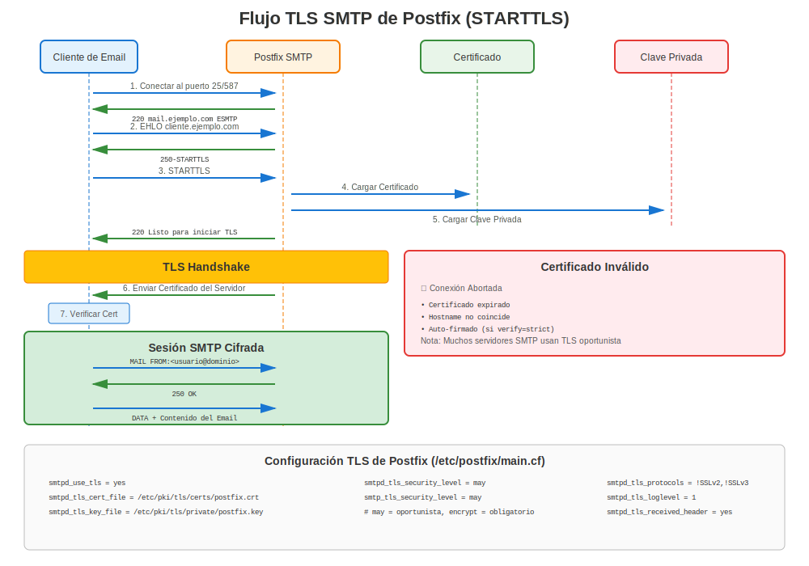

# Capítulo 16: TLS en Servidor de Correo Postfix

> **Seguridad del Email:** Aprende cómo configurar cifrado TLS para servidores de correo Postfix en RHEL, protegiendo las comunicaciones de email con certificados.

---

## 16.1 Resumen de Postfix en RHEL



**Nombre del Paquete:** `postfix`
**Ubicación de Config:** `/etc/postfix/main.cf`
**Ruta de Certificados:** `/etc/pki/tls/certs/`
**Ruta de Claves:** `/etc/pki/tls/private/`
**Puertos:** 25 (SMTP), 465 (SMTPS), 587 (Submission con STARTTLS)

### ¿Por Qué TLS para Email?

- ✅ **Cifrar email en tránsito** (prevenir escucha clandestina)
- ✅ **Autenticar servidores de correo** (prevenir suplantación)
- ✅ **Cumplir requisitos de cumplimiento** (HIPAA, PCI-DSS)
- ✅ **Prevenir spam/phishing** (SPF, DKIM, DMARC funcionan mejor con TLS)

---

## 16.2 Instalación

### Todas las Versiones RHEL

```bash
#============================================#
# INSTALAR POSTFIX
#============================================#

# Instalar Postfix
sudo dnf install postfix -y

# Detener y deshabilitar Sendmail (si está presente)
sudo systemctl stop sendmail 2>/dev/null
sudo systemctl disable sendmail 2>/dev/null

# Habilitar Postfix
sudo systemctl enable postfix
sudo systemctl start postfix

# Abrir firewall
sudo firewall-cmd --permanent --add-service=smtp
sudo firewall-cmd --permanent --add-service=smtps
sudo firewall-cmd --permanent --add-service=smtp-submission
sudo firewall-cmd --reload

# Verificar
systemctl status postfix
ss -tlnp | grep -E ':(25|465|587)'
```

---

## 16.3 Configuración TLS Lado Servidor

### Recibir Correo con TLS (SMTPD)

```bash
#============================================#
# /etc/postfix/main.cf - TLS DE SERVIDOR (RECEPCIÓN)
#============================================#

# Archivos de certificado
smtpd_tls_cert_file = /etc/pki/tls/certs/mail.example.com.crt
smtpd_tls_key_file = /etc/pki/tls/private/mail.example.com.key
smtpd_tls_CAfile = /etc/pki/tls/certs/ca-bundle.crt

# Nivel de seguridad TLS
smtpd_tls_security_level = may  # o 'encrypt' para requerir TLS

# Logging
smtpd_tls_loglevel = 1
smtpd_tls_received_header = yes

# Caché de sesión (rendimiento)
smtpd_tls_session_cache_database = btree:${data_directory}/smtpd_scache

# Autenticación - solo sobre TLS
smtpd_tls_auth_only = yes

# RHEL 7: Especificar protocolos manualmente
# smtpd_tls_protocols = !SSLv2, !SSLv3, !TLSv1, !TLSv1.1
# smtpd_tls_mandatory_protocols = !SSLv2, !SSLv3, !TLSv1, !TLSv1.1

# RHEL 8/9/10: Crypto-policies manejan protocolos automáticamente
# (no necesitas especificar smtpd_tls_protocols)
```

**Niveles de Seguridad Explicados:**

| Nivel | Comportamiento | Caso de Uso |
|-------|----------------|-------------|
| `none` | TLS deshabilitado | No recomendado |
| `may` | TLS opcional (oportunista) | Estándar (compatible) |
| `encrypt` | TLS requerido | Entornos de alta seguridad |
| `dane` | Validación basada en DNSSEC | Configuraciones avanzadas |

---

## 16.4 Configuración TLS Lado Cliente

### Enviar Correo con TLS (SMTP)

```bash
#============================================#
# /etc/postfix/main.cf - TLS DE CLIENTE (ENVÍO)
#============================================#

# Archivos de certificado (opcional para cliente)
smtp_tls_cert_file = /etc/pki/tls/certs/mail.example.com.crt
smtp_tls_key_file = /etc/pki/tls/private/mail.example.com.key
smtp_tls_CAfile = /etc/pki/tls/certs/ca-bundle.crt

# Nivel de seguridad TLS para salida
smtp_tls_security_level = may  # o 'encrypt' para requerir

# Logging
smtp_tls_loglevel = 1

# Caché de sesión
smtp_tls_session_cache_database = btree:${data_directory}/smtp_scache

# RHEL 7: Especificar protocolos
# smtp_tls_protocols = !SSLv2, !SSLv3, !TLSv1, !TLSv1.1
# smtp_tls_mandatory_protocols = !SSLv2, !SSLv3, !TLSv1, !TLSv1.1

# RHEL 8/9/10: Crypto-policies lo manejan
```

---

## 16.5 Configuración Completa TLS de Postfix

### Ejemplo de Configuración Completa

```bash
#============================================#
# CONFIGURACIÓN TLS COMPLETA DE POSTFIX
#============================================#

# 1. Generar certificado y clave
sudo openssl genpkey -algorithm RSA \
  -out /etc/pki/tls/private/mail.example.com.key \
  -pkeyopt rsa_keygen_bits:2048

sudo chmod 600 /etc/pki/tls/private/mail.example.com.key

# 2. Generar CSR
sudo openssl req -new \
  -key /etc/pki/tls/private/mail.example.com.key \
  -out /tmp/mail.example.com.csr \
  -subj "/CN=mail.example.com" \
  -addext "subjectAltName=DNS:mail.example.com,DNS:smtp.example.com"

# 3. Obtener certificado de CA, instalarlo
sudo cp mail.example.com.crt /etc/pki/tls/certs/
sudo chmod 644 /etc/pki/tls/certs/mail.example.com.crt

# 4. Editar /etc/postfix/main.cf
sudo vi /etc/postfix/main.cf

# Agregar configuración TLS (ver secciones 16.3 y 16.4)

# 5. Probar configuración
sudo postfix check

# 6. Recargar Postfix
sudo systemctl reload postfix

# 7. Probar SMTP TLS
openssl s_client -starttls smtp -connect mail.example.com:25
```

---

## 16.6 Configuración SMTPS (Puerto 465)

### Habilitar Servicio SMTPS

```bash
#============================================#
# /etc/postfix/master.cf - HABILITAR SMTPS
#============================================#

# Descomentar o agregar servicio SMTPS (puerto 465)
smtps     inet  n       -       n       -       -       smtpd
  -o syslog_name=postfix/smtps
  -o smtpd_tls_wrappermode=yes
  -o smtpd_sasl_auth_enable=yes
  -o smtpd_recipient_restrictions=permit_sasl_authenticated,reject
  -o milter_macro_daemon_name=ORIGINATING

# Recargar
sudo systemctl reload postfix

# Verificar
ss -tlnp | grep :465
```

### Probar SMTPS

```bash
# Conectar a SMTPS (TLS inmediato, sin STARTTLS)
openssl s_client -connect mail.example.com:465

# Debería mostrar handshake TLS inmediatamente
```

---

## 16.7 Puerto de Submission (587) con STARTTLS

### Habilitar Servicio Submission

```bash
#============================================#
# /etc/postfix/master.cf - HABILITAR SUBMISSION
#============================================#

# Descomentar o agregar servicio submission (puerto 587)
submission inet n       -       n       -       -       smtpd
  -o syslog_name=postfix/submission
  -o smtpd_tls_security_level=encrypt
  -o smtpd_sasl_auth_enable=yes
  -o smtpd_recipient_restrictions=permit_sasl_authenticated,reject
  -o milter_macro_daemon_name=ORIGINATING

# Recargar
sudo systemctl reload postfix

# Verificar
ss -tlnp | grep :587
```

### Probar Puerto Submission

```bash
# Probar STARTTLS en puerto 587
openssl s_client -starttls smtp -connect mail.example.com:587

# Debería mostrar:
# STARTTLS
# 220 2.0.0 Ready to start TLS
```

---

## 16.8 Integración con certmonger

### Gestión Automatizada de Certificados para Postfix

```bash
#============================================#
# CERTMONGER + POSTFIX
#============================================#

# Instalar certmonger
sudo dnf install certmonger
sudo systemctl enable --now certmonger

# Solicitar certificado de FreeIPA
sudo ipa-getcert request \
  -f /etc/pki/tls/certs/mail.example.com.crt \
  -k /etc/pki/tls/private/mail.example.com.key \
  -D mail.example.com \
  -K host/mail.example.com@REALM \
  -C "postfix reload"  # Auto-recargar Postfix después de renovación

# Verificar estado
sudo getcert list

# ¡Postfix usa automáticamente el certificado renovado!
```

---

## 16.9 Autenticación de Certificado de Cliente

### Requerir Certificados de Cliente (mTLS para SMTP)

```bash
#============================================#
# /etc/postfix/main.cf - AUTENTICACIÓN CERT CLIENTE
#============================================#

# Certificados de servidor (como antes)
smtpd_tls_cert_file = /etc/pki/tls/certs/mail.crt
smtpd_tls_key_file = /etc/pki/tls/private/mail.key

# Verificación de certificado de cliente
smtpd_tls_CAfile = /etc/pki/tls/certs/client-ca.crt
smtpd_tls_ask_ccert = yes
smtpd_tls_req_ccert = yes  # Requerir cert de cliente

# Mapear certificado a usuario
smtpd_recipient_restrictions =
  permit_tls_clientcerts,
  reject

# Recargar
sudo postfix reload
```

**Probar con certificado de cliente:**
```bash
openssl s_client -starttls smtp \
  -connect mail.example.com:25 \
  -cert client.crt \
  -key client.key \
  -CAfile ca.crt
```

---

## 16.10 Solución de Problemas Postfix TLS

### Comandos de Diagnóstico

```bash
#============================================#
# SOLUCIÓN DE PROBLEMAS POSTFIX TLS
#============================================#

# Verificar configuración de Postfix
sudo postconf | grep -i tls

# Probar sintaxis de configuración
sudo postfix check

# Ver ajustes TLS específicos
sudo postconf smtpd_tls_cert_file smtpd_tls_key_file

# Verificar que existan archivos de certificado
ls -l /etc/pki/tls/certs/mail.crt
ls -l /etc/pki/tls/private/mail.key

# Verificar coincidencia par cert/clave
CERT_MOD=$(openssl x509 -noout -modulus -in /etc/pki/tls/certs/mail.crt | openssl md5)
KEY_MOD=$(openssl rsa -noout -modulus -in /etc/pki/tls/private/mail.key | openssl md5)
[ "$CERT_MOD" = "$KEY_MOD" ] && echo "✅ Coincide" || echo "❌ ¡Desajuste!"

# Probar SMTP STARTTLS
openssl s_client -starttls smtp -connect mail.example.com:25

# Probar SMTPS (puerto 465)
openssl s_client -connect mail.example.com:465

# Verificar logs
sudo tail -f /var/log/maillog | grep -i tls

# Verificar cola de Postfix
mailq

# Logging verboso (para solución de problemas)
sudo postconf smtpd_tls_loglevel=2
sudo postfix reload
# Verificar /var/log/maillog para info TLS detallada
```

### Problemas Comunes de Postfix TLS

| Error | Causa | Solución |
|-------|-------|----------|
| "SSL_accept error" | Problema certificado/clave | Verificar coincidencia par cert/clave |
| "No shared cipher" | Incompatibilidad de cifrado | Verificar crypto-policy o cliente |
| "certificate verify failed" | Cadena de confianza rota | Instalar certs intermedios |
| "Permission denied" en clave | Permisos incorrectos | `chmod 600` en archivo de clave |
| "TLS is required but not available" | TLS no habilitado | Establecer `smtpd_tls_security_level = may` |
| "STARTTLS failed" | Problema TLS del cliente | Verificar soporte TLS del cliente |

---

## 16.11 Consideraciones Específicas por Versión

### RHEL 7

```bash
#============================================#
# POSTFIX TLS - ESPECÍFICO RHEL 7
#============================================#

# /etc/postfix/main.cf

# DEBE especificar manualmente protocolos TLS
smtpd_tls_protocols = !SSLv2, !SSLv3, !TLSv1, !TLSv1.1
smtpd_tls_mandatory_protocols = !SSLv2, !SSLv3, !TLSv1, !TLSv1.1

smtp_tls_protocols = !SSLv2, !SSLv3, !TLSv1, !TLSv1.1
smtp_tls_mandatory_protocols = !SSLv2, !SSLv3, !TLSv1, !TLSv1.1

# DEBE especificar manualmente cifrados
smtpd_tls_mandatory_ciphers = high
smtpd_tls_ciphers = high

smtp_tls_mandatory_ciphers = high
smtp_tls_ciphers = high

# Excluir cifrados débiles
smtpd_tls_mandatory_exclude_ciphers = aNULL, eNULL, EXPORT, DES, RC4, MD5, PSK, aECDH, EDH-DSS-DES-CBC3-SHA, EDH-RSA-DES-CBC3-SHA, KRB5-DES, CBC3-SHA
```

### RHEL 8/9/10

```bash
#============================================#
# POSTFIX TLS - RHEL 8/9/10 CON CRYPTO-POLICIES
#============================================#

# /etc/postfix/main.cf

# Archivos de certificado
smtpd_tls_cert_file = /etc/pki/tls/certs/mail.crt
smtpd_tls_key_file = /etc/pki/tls/private/mail.key
smtpd_tls_CAfile = /etc/pki/tls/certs/ca-bundle.crt

# Ajustes TLS (¡crypto-policies manejan protocolos/cifrados!)
smtpd_tls_security_level = may
smtpd_tls_auth_only = yes
smtpd_tls_loglevel = 1

# TLS de cliente
smtp_tls_cert_file = /etc/pki/tls/certs/mail.crt
smtp_tls_key_file = /etc/pki/tls/private/mail.key
smtp_tls_security_level = may
smtp_tls_loglevel = 1

# ¡Eso es todo! Mucho más simple que RHEL 7
# crypto-policies configuran automáticamente versiones TLS y cifrados
```

**Diferencia Clave:** ¡RHEL 8+ depende de crypto-policies, haciendo la configuración mucho más simple!

---

## 16.12 Probar Postfix TLS

### Suite de Pruebas Comprehensiva

```bash
#============================================#
# PRUEBAS POSTFIX TLS
#============================================#

# Prueba 1: STARTTLS en puerto 25
openssl s_client -starttls smtp -connect mail.example.com:25

# Buscar:
# - "250-STARTTLS" en capacidades del servidor
# - Handshake TLS exitoso
# - Detalles del certificado

# Prueba 2: SMTPS en puerto 465 (TLS directo)
openssl s_client -connect mail.example.com:465

# Prueba 3: Puerto submission 587 con STARTTLS
openssl s_client -starttls smtp -connect mail.example.com:587

# Prueba 4: Verificar certificado desde servidor
echo "QUIT" | openssl s_client -starttls smtp -connect mail.example.com:25 2>&1 | \
  openssl x509 -noout -subject -dates

# Prueba 5: Enviar email de prueba
echo "Test email" | mail -s "Prueba TLS" test@example.com

# Prueba 6: Verificar TLS en logs
sudo tail -f /var/log/maillog | grep TLS

# Prueba 7: Verificar si TLS se está usando
sudo postconf | grep -i tls | grep -i level
```

---

## 16.13 Mejores Prácticas de Seguridad

### Configuración Postfix TLS Fortalecida

```bash
#============================================#
# CONFIGURACIÓN POSTFIX TLS FORTALECIDA
#============================================#

# /etc/postfix/main.cf

# TLS de servidor (recibir correo)
smtpd_tls_cert_file = /etc/pki/tls/certs/mail.crt
smtpd_tls_key_file = /etc/pki/tls/private/mail.key
smtpd_tls_CAfile = /etc/pki/tls/certs/ca-bundle.crt

# REQUERIR TLS para autenticación
smtpd_tls_security_level = may
smtpd_tls_auth_only = yes

# TLS de cliente (enviar correo)
smtp_tls_cert_file = /etc/pki/tls/certs/mail.crt
smtp_tls_key_file = /etc/pki/tls/private/mail.key
smtp_tls_security_level = may

# RHEL 7: Deshabilitar manualmente protocolos débiles
smtpd_tls_protocols = !SSLv2, !SSLv3, !TLSv1, !TLSv1.1
smtp_tls_protocols = !SSLv2, !SSLv3, !TLSv1, !TLSv1.1

# Obligatorio para conexiones autenticadas
smtpd_tls_mandatory_protocols = !SSLv2, !SSLv3, !TLSv1, !TLSv1.1

# Ajustes de cifrado (RHEL 7)
smtpd_tls_mandatory_ciphers = high
smtpd_tls_exclude_ciphers = aNULL, eNULL, EXPORT, DES, RC4, MD5, PSK, aECDH, EDH-DSS-DES-CBC3-SHA, EDH-RSA-DES-CBC3-SHA, KRB5-DES, CBC3-SHA

# Caché de sesión
smtpd_tls_session_cache_database = btree:${data_directory}/smtpd_scache
smtp_tls_session_cache_database = btree:${data_directory}/smtp_scache

# Logging mejorado (temporal para solución de problemas)
smtpd_tls_loglevel = 1
smtp_tls_loglevel = 1

# Rendimiento
smtpd_tls_session_cache_timeout = 3600s
tls_random_source = dev:/dev/urandom
```

---

## 16.14 Dovecot IMAP/POP3 con TLS

### Configuración de Dovecot

Aunque este capítulo se enfoca en Postfix (SMTP), Dovecot a menudo se ejecuta junto para IMAP/POP3:

```bash
#============================================#
# DOVECOT TLS (/etc/dovecot/conf.d/10-ssl.conf)
#============================================#

# Habilitar SSL
ssl = required

# Archivos de certificado
ssl_cert = </etc/pki/tls/certs/mail.example.com.crt
ssl_key = </etc/pki/tls/private/mail.example.com.key

# CA para verificación de cert de cliente (opcional)
#ssl_ca = </etc/pki/tls/certs/ca-bundle.crt

# RHEL 8/9/10: crypto-policies lo manejan

# Protocolos TLS (RHEL 7)
#ssl_min_protocol = TLSv1.2

# Preferencias de suite de cifrado
#ssl_cipher_list = HIGH:!aNULL:!MD5

# Recargar
sudo systemctl reload dovecot
```

**Probar IMAPS:**
```bash
openssl s_client -connect mail.example.com:993

# Probar POP3S
openssl s_client -connect mail.example.com:995
```

---

## 16.15 Escenarios Comunes

### Escenario 1: TLS Oportunista (Estándar)

**Objetivo:** Aceptar conexiones cifradas y no cifradas

```bash
# /etc/postfix/main.cf
smtpd_tls_security_level = may  # TLS opcional
smtp_tls_security_level = may   # TLS opcional

# Por qué: Máxima compatibilidad
# Desventaja: Algunas conexiones pueden no estar cifradas
```

### Escenario 2: TLS Obligatorio (Alta Seguridad)

**Objetivo:** Rechazar conexiones no cifradas

```bash
# /etc/postfix/main.cf
smtpd_tls_security_level = encrypt  # REQUERIR TLS
smtp_tls_security_level = encrypt   # REQUERIR TLS

# Por qué: Máxima seguridad
# Desventaja: Sistemas antiguos pueden fallar al conectar
```

### Escenario 3: Certificado de Cliente para Relay

**Objetivo:** Permitir relay solo con certificado de cliente válido

```bash
# /etc/postfix/main.cf
smtpd_tls_cert_file = /etc/pki/tls/certs/mail.crt
smtpd_tls_key_file = /etc/pki/tls/private/mail.key
smtpd_tls_CAfile = /etc/pki/tls/certs/client-ca.crt

smtpd_tls_ask_ccert = yes
smtpd_tls_req_ccert = yes

smtpd_recipient_restrictions =
  permit_tls_clientcerts,
  reject_unauth_destination

# Solo clientes con cert válido de client-ca.crt pueden hacer relay
```

---

## 16.16 Monitorear Postfix TLS

### Qué Monitorear

```bash
#============================================#
# MONITOREO POSTFIX TLS
#============================================#

# Verificar uso de TLS en logs
sudo grep "TLS connection established" /var/log/maillog | tail -20

# Contar conexiones TLS vs no-TLS
sudo grep "connect from" /var/log/maillog | grep -c "TLS"

# Verificar errores TLS
sudo grep "TLS" /var/log/maillog | grep -i error

# Monitorear expiración de certificado
openssl x509 -in /etc/pki/tls/certs/mail.crt -noout -checkend $((86400*30))

# Estado de certmonger (si se usa)
sudo getcert list -f /etc/pki/tls/certs/mail.crt

# Verificar cola de errores TLS
mailq
```

### Script de Monitoreo

```bash
#!/bin/bash
# monitor-postfix-tls.sh

echo "=== Monitoreo TLS de Postfix ==="

# Expiración de certificado
echo "1. Expiración de Certificado:"
openssl x509 -in /etc/pki/tls/certs/mail.crt -noout -enddate

# Conexiones TLS hoy
echo ""
echo "2. Conexiones TLS Hoy:"
sudo grep "$(date '+%b %e')" /var/log/maillog | grep "TLS connection" | wc -l

# Errores TLS hoy
echo ""
echo "3. Errores TLS Hoy:"
sudo grep "$(date '+%b %e')" /var/log/maillog | grep -i "tls.*error" | tail -5

# Estado del servicio
echo ""
echo "4. Estado de Postfix:"
systemctl is-active postfix

# Puertos escuchando
echo ""
echo "5. Escuchando en:"
ss -tlnp | grep master | grep -E ':(25|465|587)'
```

---

## 16.17 Problemas Comunes y Soluciones

### Problema 1: Certificado No Confiable por Clientes

**Síntoma:** Los clientes obtienen advertencias de "certificado no confiable"

**Diagnóstico:**
```bash
# Probar cadena de certificado
openssl s_client -starttls smtp -connect mail.example.com:25 -showcerts

# Verificar si se incluyen certificados intermedios
sudo postconf smtpd_tls_cert_file
# Debería incluir cadena completa o usar smtpd_tls_chain_files
```

**Solución:**
```bash
# Opción 1: Incluir cadena en archivo de certificado
cat server.crt intermediate.crt > /etc/pki/tls/certs/mail-chain.crt

# Actualizar configuración
sudo postconf -e 'smtpd_tls_cert_file = /etc/pki/tls/certs/mail-chain.crt'
sudo postfix reload

# Opción 2: Usar archivo de cadena separado (Postfix 3.4+)
sudo postconf -e 'smtpd_tls_chain_files = /etc/pki/tls/certs/chain.crt'
```

### Problema 2: "Permission denied" en Clave Privada

**Síntoma:** Postfix no inicia, logs muestran error de permiso

**Solución:**
```bash
# Establecer permisos correctos
sudo chmod 600 /etc/pki/tls/private/mail.key
sudo chown root:postfix /etc/pki/tls/private/mail.key

# Corregir contexto SELinux
sudo restorecon -v /etc/pki/tls/private/mail.key

# Reiniciar Postfix
sudo systemctl restart postfix
```

### Problema 3: TLS No Ofrecido a Clientes

**Síntoma:** STARTTLS no mostrado en respuesta EHLO

**Diagnóstico:**
```bash
# Telnet al servidor
telnet mail.example.com 25
# Escribir: EHLO test
# Debería mostrar: 250-STARTTLS

# Si no se muestra, verificar configuración
sudo postconf smtpd_tls_security_level
# Debería ser 'may' o 'encrypt', no 'none'
```

**Solución:**
```bash
sudo postconf -e 'smtpd_tls_security_level = may'
sudo postfix reload
```

---

## 16.18 Tabla de Comparación de Versiones

| Característica | RHEL 7 | RHEL 8 | RHEL 9 | RHEL 10 |
|----------------|--------|--------|--------|---------|
| **Versión Postfix** | 2.10.x | 3.3.x+ | 3.5.x+ | 3.8.x+ |
| **OpenSSL** | 1.0.2k | 1.1.1k | 3.5.5 | 3.5.5 |
| **Config TLS** | Manual | Crypto-policies | Crypto-policies | Crypto-policies |
| **TLS Predeterminado** | Puede incluir 1.0/1.1 | TLS 1.2+ | TLS 1.2+ | TLS 1.3 preferido |
| **certmonger** | Básico | Mejorado | Soporte ACME | Soporte ACME |

---

## 16.19 Script de Configuración Rápida

```bash
#!/bin/bash
# setup-postfix-tls.sh - Configuración completa Postfix TLS

DOMAIN="example.com"
HOSTNAME="mail.$DOMAIN"

echo "=== Configuración Postfix TLS para $HOSTNAME ==="

# 1. Instalar Postfix
sudo dnf install -y postfix

# 2. Generar certificado (o usar certmonger)
sudo openssl genpkey -algorithm RSA \
  -out /etc/pki/tls/private/$HOSTNAME.key \
  -pkeyopt rsa_keygen_bits:2048

sudo chmod 600 /etc/pki/tls/private/$HOSTNAME.key

# 3. Generar autofirmado para pruebas (¡reemplazar con cert apropiado!)
sudo openssl req -new -x509 -days 365 \
  -key /etc/pki/tls/private/$HOSTNAME.key \
  -out /etc/pki/tls/certs/$HOSTNAME.crt \
  -subj "/CN=$HOSTNAME" \
  -addext "subjectAltName=DNS:$HOSTNAME,DNS:smtp.$DOMAIN"

# 4. Configurar Postfix
sudo postconf -e "smtpd_tls_cert_file = /etc/pki/tls/certs/$HOSTNAME.crt"
sudo postconf -e "smtpd_tls_key_file = /etc/pki/tls/private/$HOSTNAME.key"
sudo postconf -e "smtpd_tls_security_level = may"
sudo postconf -e "smtpd_tls_auth_only = yes"
sudo postconf -e "smtpd_tls_loglevel = 1"

sudo postconf -e "smtp_tls_cert_file = /etc/pki/tls/certs/$HOSTNAME.crt"
sudo postconf -e "smtp_tls_key_file = /etc/pki/tls/private/$HOSTNAME.key"
sudo postconf -e "smtp_tls_security_level = may"

# 5. Abrir firewall
sudo firewall-cmd --permanent --add-service=smtp
sudo firewall-cmd --permanent --add-service=smtps
sudo firewall-cmd --permanent --add-service=smtp-submission
sudo firewall-cmd --reload

# 6. Iniciar Postfix
sudo systemctl enable postfix
sudo systemctl restart postfix

# 7. Probar
echo "Probando SMTP STARTTLS..."
echo "QUIT" | openssl s_client -starttls smtp -connect localhost:25 2>&1 | grep -E "(CONNECTED|subject=)"

echo "✅ ¡Configuración Postfix TLS completa!"
echo "⚠️ Reemplazar cert autofirmado con certificado apropiado de CA"
```

---

## 16.20 Conclusiones Clave

1. **Postfix soporta TLS** en puertos 25 (STARTTLS), 465 (SMTPS), 587 (Submission)
2. **RHEL 7 requiere configuración TLS manual** (protocolos, cifrados)
3. **RHEL 8+ usa crypto-policies** (¡mucho más simple!)
4. **Niveles de seguridad:** `none`, `may`, `encrypt`, `dane`
5. **certmonger funciona excelente** con Postfix
6. **Siempre probar** con `openssl s_client -starttls smtp`
7. **Monitorear logs** para errores TLS

---

## Tarjeta de Referencia Rápida

```
┌──────────────────────────────────────────────────────────────┐
│ REFERENCIA RÁPIDA POSTFIX TLS                                │
├──────────────────────────────────────────────────────────────┤
│ Config:       /etc/postfix/main.cf                           │
│ Certs:        smtpd_tls_cert_file = /path/to/cert.crt        │
│ Claves:       smtpd_tls_key_file = /path/to/key.key          │
│ Seguridad:    smtpd_tls_security_level = may|encrypt         │
│                                                              │
│ Probar:       openssl s_client -starttls smtp -connect :25   │
│ Recargar:     postfix reload                                 │
│ Verificar:    postfix check                                  │
│ Logs:         tail -f /var/log/maillog | grep TLS            │
│                                                              │
│ Puertos:      25 (SMTP+STARTTLS)                             │
│               465 (SMTPS - TLS directo)                      │
│               587 (Submission con STARTTLS)                  │
│                                                              │
│ certmonger:   ipa-getcert ... -C "postfix reload"            │
└──────────────────────────────────────────────────────────────┘

⚠️ RHEL 7: Configuración manual de protocolo/cifrado necesaria
✅ RHEL 8/9/10: Crypto-policies manejan ajustes TLS
```

---

## 🧪 Laboratorio Práctico

**Lab 08: TLS de Postfix**

Configura TLS para servidor de correo Postfix

- 📁 **Ubicación:** `labs/es_ES/08-postfix-tls/`
- ⏱️ **Tiempo:** 30 minutos
- 🎯 **Nivel:** Intermedio

---

**Navegación del Capítulo**

| [← Anterior: Capítulo 15 - NGINX en RHEL](15-nginx.md) | [Siguiente: Capítulo 17 - OpenLDAP y Servicios de Directorio →](17-openldap-ldaps.md) |
|:---|---:|
