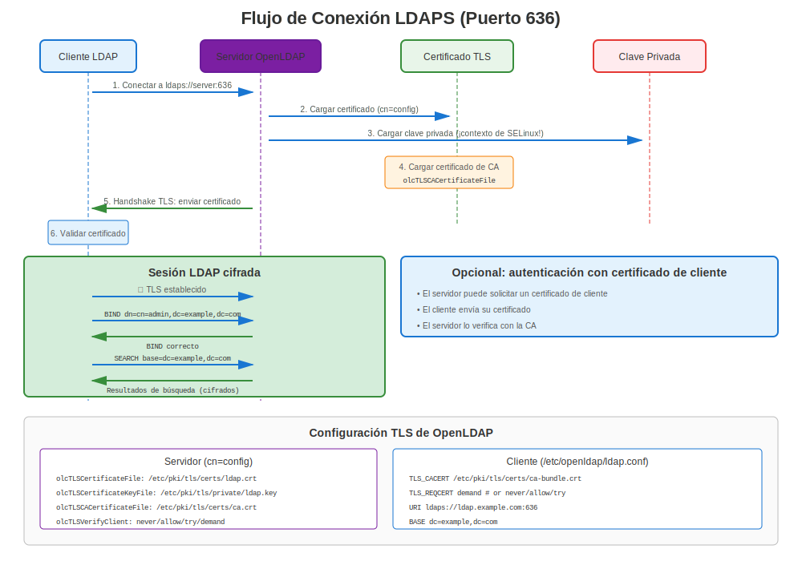

# Capítulo 17: OpenLDAP y Servicios de Directorio

> **Directorio Empresarial:** Aprende cómo asegurar servicios de directorio OpenLDAP con TLS/SSL en RHEL, protegiendo la autenticación de usuarios y consultas de directorio.

---

## 17.1 LDAP vs LDAPS vs STARTTLS



### Tres Formas de Asegurar LDAP

| Método | Puerto | Cifrado | Caso de Uso |
|--------|--------|---------|-------------|
| **LDAP** | 389 | ❌ Ninguno | Legacy, no recomendado |
| **LDAPS** | 636 | ✅ TLS desde el inicio | Preferido, cifrado |
| **LDAP+STARTTLS** | 389 | ✅ Actualizar a TLS | Alternativa a LDAPS |

**Recomendación:** Usar LDAPS (puerto 636) para simplicidad y seguridad.

---

## 17.2 Instalación de OpenLDAP

### Todas las Versiones RHEL

```bash
#============================================#
# INSTALAR SERVIDOR OPENLDAP
#============================================#

# Instalar servidor OpenLDAP
sudo dnf install openldap-servers openldap-clients -y

# Iniciar y habilitar
sudo systemctl enable slapd
sudo systemctl start slapd

# Abrir firewall
sudo firewall-cmd --permanent --add-service=ldap
sudo firewall-cmd --permanent --add-service=ldaps
sudo firewall-cmd --reload

# Verificar
systemctl status slapd
ss -tlnp | grep -E ':(389|636)'
```

---

## 17.3 Generar Certificados para LDAP

### Requisitos del Certificado

Los certificados LDAP deben incluir:
- ✅ **CN** coincidiendo con hostname del servidor LDAP
- ✅ **SANs** con FQDN del servidor LDAP
- ✅ **Server Authentication** key usage
- ✅ **Cadena de confianza válida**

```bash
#============================================#
# GENERAR CERTIFICADO DE SERVIDOR LDAP
#============================================#

# Paso 1: Generar clave privada
sudo openssl genpkey -algorithm RSA \
  -out /etc/openldap/certs/ldap.key \
  -pkeyopt rsa_keygen_bits:2048

# Paso 2: Establecer permisos (¡importante!)
sudo chmod 600 /etc/openldap/certs/ldap.key
sudo chown ldap:ldap /etc/openldap/certs/ldap.key

# Paso 3: Generar CSR
sudo openssl req -new \
  -key /etc/openldap/certs/ldap.key \
  -out /tmp/ldap.csr \
  -subj "/CN=ldap.example.com" \
  -addext "subjectAltName=DNS:ldap.example.com,DNS:dir.example.com"

# Paso 4: Obtener certificado de CA

# Paso 5: Instalar certificado
sudo cp ldap.crt /etc/openldap/certs/
sudo chmod 644 /etc/openldap/certs/ldap.crt
sudo chown ldap:ldap /etc/openldap/certs/ldap.crt

# Paso 6: Instalar certificado CA
sudo cp ca.crt /etc/openldap/certs/
sudo chmod 644 /etc/openldap/certs/ca.crt
```

---

## 17.4 Configuración TLS de OpenLDAP

### Método 1: cn=config (Configuración Dinámica)

```bash
#============================================#
# CONFIGURAR TLS CON cn=config (PREFERIDO)
#============================================#

# Crear archivo LDIF
cat > /tmp/tls-config.ldif << EOF
dn: cn=config
changetype: modify
add: olcTLSCertificateFile
olcTLSCertificateFile: /etc/openldap/certs/ldap.crt
-
add: olcTLSCertificateKeyFile
olcTLSCertificateKeyFile: /etc/openldap/certs/ldap.key
-
add: olcTLSCACertificateFile
olcTLSCACertificateFile: /etc/openldap/certs/ca.crt
-
replace: olcTLSProtocolMin
olcTLSProtocolMin: 3.2
EOF

# Aplicar configuración
sudo ldapmodify -Y EXTERNAL -H ldapi:/// -f /tmp/tls-config.ldif

# Reiniciar slapd
sudo systemctl restart slapd

# Verificar
sudo slapcat -b "cn=config" | grep -i tls
```

### Método 2: slapd.conf (Legacy)

```bash
#============================================#
# CONFIGURAR TLS CON slapd.conf (LEGACY)
#============================================#

# Editar /etc/openldap/slapd.conf

TLSCertificateFile      /etc/openldap/certs/ldap.crt
TLSCertificateKeyFile   /etc/openldap/certs/ldap.key
TLSCACertificateFile    /etc/openldap/certs/ca.crt

# RHEL 7: Especificar manualmente versión TLS
TLSProtocolMin          1.2

# Reiniciar
sudo systemctl restart slapd
```

---

## 17.5 Configuración de Cliente

### Configurar Cliente LDAP para TLS

```bash
#============================================#
# /etc/openldap/ldap.conf - CONFIG CLIENTE
#============================================#

# URI del servidor (usar ldaps:// para puerto 636)
URI ldaps://ldap.example.com

# Certificado CA para validación
TLS_CACERT /etc/pki/tls/certs/ca-bundle.crt

# Verificación de certificado
TLS_REQCERT demand  # requerir certificado válido

# RHEL 7: Especificar versión TLS mínima
# TLS_PROTOCOL_MIN 1.2
```

### Probar Conexión de Cliente LDAP

```bash
#============================================#
# PROBAR CONEXIÓN DE CLIENTE LDAPS
#============================================#

# Probar LDAPS (puerto 636)
ldapsearch -H ldaps://ldap.example.com:636 \
  -D "cn=admin,dc=example,dc=com" \
  -W \
  -b "dc=example,dc=com" \
  "(objectClass=*)"

# Probar LDAP con STARTTLS (puerto 389)
ldapsearch -H ldap://ldap.example.com:389 -ZZ \
  -D "cn=admin,dc=example,dc=com" \
  -W \
  -b "dc=example,dc=com"

# -ZZ fuerza STARTTLS (falla si no disponible)
# -Z intenta STARTTLS (continúa sin él si no disponible)
```

---

## 17.6 Integración con FreeIPA

**Nota:** FreeIPA se cubre en detalle en el Capítulo 19. Esto es un resumen rápido.

### FreeIPA Maneja LDAPS Automáticamente

```bash
#============================================#
# LDAPS DE FREEIPA (¡AUTOMÁTICO!)
#============================================#

# FreeIPA configura LDAPS automáticamente
# ¡No se necesita configuración manual de certificado!

# Probar LDAPS de FreeIPA
ldapsearch -H ldaps://ipa.example.com:636 \
  -D "uid=admin,cn=users,cn=accounts,dc=example,dc=com" \
  -W \
  -b "dc=example,dc=com"

# Certificados de FreeIPA gestionados por certmonger automáticamente
sudo getcert list | grep -A10 "Directory Server"
```

---

## 17.7 Probar OpenLDAP TLS

### Pruebas Comprehensivas

```bash
#============================================#
# PRUEBAS OPENLDAP TLS
#============================================#

# Prueba 1: Verificar si slapd está escuchando
ss -tlnp | grep slapd
# Debería mostrar puertos 389 y/o 636

# Prueba 2: Probar conexión LDAPS con OpenSSL
openssl s_client -connect ldap.example.com:636

# Buscar:
# - Handshake TLS exitoso
# - Detalles del certificado
# - Verify return code: 0 (ok)

# Prueba 3: Probar con ldapsearch (anónimo)
ldapsearch -H ldaps://ldap.example.com:636 \
  -x -b "" -s base "(objectClass=*)" namingContexts

# Prueba 4: Probar consulta autenticada
ldapsearch -H ldaps://ldap.example.com:636 \
  -D "cn=admin,dc=example,dc=com" \
  -W \
  -b "dc=example,dc=com" \
  "(uid=*)"

# Prueba 5: Probar STARTTLS
ldapsearch -H ldap://ldap.example.com:389 -ZZ \
  -x -b "" -s base

# Prueba 6: Verificar certificado desde servidor
echo | openssl s_client -connect ldap.example.com:636 2>&1 | \
  openssl x509 -noout -subject -issuer -dates
```

---

## 17.8 Solución de Problemas OpenLDAP TLS

### Comandos de Diagnóstico

```bash
#============================================#
# DIAGNÓSTICO OPENLDAP TLS
#============================================#

# Verificar configuración de slapd
sudo slapcat -b "cn=config" | grep -i tls

# Verificar archivos de certificado
sudo ls -lZ /etc/openldap/certs/

# Verificar permisos
# La clave debería ser legible por el usuario 'ldap'
sudo -u ldap cat /etc/openldap/certs/ldap.key >/dev/null && \
  echo "✅ Clave legible" || echo "❌ Permission denied"

# Verificar contexto SELinux
ls -Z /etc/openldap/certs/*.{crt,key}

# Verificar logs de slapd
sudo journalctl -u slapd -f

# Probar con OpenSSL verboso
openssl s_client -connect ldap.example.com:636 -showcerts -debug

# Probar STARTTLS
ldapsearch -H ldap://ldap.example.com:389 -ZZ -d 1
```

### Problemas Comunes de OpenLDAP TLS

| Error | Causa | Solución |
|-------|-------|----------|
| "TLS: can't connect" | Certificado/clave no legible | Verificar ownership: `chown ldap:ldap` |
| "TLS: hostname does not match" | Desajuste CN/SAN | Regenerar cert con hostname correcto |
| "Certificate verification failed" | CA no confiable | Agregar CA al almacén de confianza del cliente |
| "Permission denied" en clave | Ownership/permisos incorrectos | `chmod 600`, `chown ldap:ldap` |
| "TLS engine not initialized" | TLS no configurado | Agregar directivas TLS a configuración |
| "error:14094410:SSL routines" | Desajuste protocolo/cifrado | Verificar crypto-policy (RHEL 8+) |

---

## 17.9 Autenticación de Certificado de Cliente

### Requerir Certificados de Cliente

```bash
#============================================#
# OPENLDAP CON AUTENTICACIÓN CERT CLIENTE
#============================================#

# Configuración de servidor (cn=config)
cat > /tmp/client-cert.ldif << EOF
dn: cn=config
changetype: modify
add: olcTLSVerifyClient
olcTLSVerifyClient: demand
-
add: olcTLSCACertificateFile
olcTLSCACertificateFile: /etc/openldap/certs/client-ca.crt
EOF

sudo ldapmodify -Y EXTERNAL -H ldapi:/// -f /tmp/client-cert.ldif

# Reiniciar
sudo systemctl restart slapd
```

**Conexión de cliente con certificado:**
```bash
# El cliente debe proporcionar certificado
ldapsearch -H ldaps://ldap.example.com:636 \
  -x -b "dc=example,dc=com" \
  -ZZ

# Configurar cert de cliente en /etc/openldap/ldap.conf:
TLS_CERT /etc/openldap/certs/client.crt
TLS_KEY /etc/openldap/certs/client.key
```

---

## 17.10 Consideraciones Específicas por Versión

### RHEL 7

```bash
#============================================#
# OPENLDAP TLS - RHEL 7
#============================================#

# Especificación manual de protocolo TLS
# En slapd.conf o cn=config:
TLSProtocolMin 1.2

# O con cn=config:
olcTLSProtocolMin: 3.2  # 3.1=TLS1.0, 3.2=TLS1.1, 3.3=TLS1.2

# Configuración manual de cifrado
TLSCipherSuite HIGH:!aNULL:!MD5:!3DES

# Probar
openssl s_client -connect ldap.example.com:636 -tls1_2
```

### RHEL 8/9/10

```bash
#============================================#
# OPENLDAP TLS - RHEL 8/9/10
#============================================#

# Crypto-policies configuran TLS automáticamente
# ¡No necesitas especificar TLSProtocolMin o cifrados!

# Solo configurar certificados:
olcTLSCertificateFile: /etc/openldap/certs/ldap.crt
olcTLSCertificateKeyFile: /etc/openldap/certs/ldap.key
olcTLSCACertificateFile: /etc/openldap/certs/ca.crt

# Crypto-policy maneja el resto
update-crypto-policies --show
```

---

## 17.11 certmonger con OpenLDAP

### Gestión Automatizada de Certificados

```bash
#============================================#
# CERTMONGER + OPENLDAP
#============================================#

# Instalar certmonger
sudo dnf install certmonger
sudo systemctl enable --now certmonger

# Solicitar certificado de FreeIPA
sudo ipa-getcert request \
  -f /etc/openldap/certs/ldap.crt \
  -k /etc/openldap/certs/ldap.key \
  -D ldap.example.com \
  -K ldap/ldap.example.com@REALM \
  -C "systemctl restart slapd"  # Reiniciar slapd después de renovación

# Establecer ownership apropiado
sudo chown ldap:ldap /etc/openldap/certs/ldap.{crt,key}
sudo chmod 600 /etc/openldap/certs/ldap.key

# Monitorear
sudo getcert list
```

---

## 17.12 Solución de Problemas LDAPS

### Pasos de Diagnóstico

```bash
#============================================#
# SOLUCIÓN DE PROBLEMAS LDAPS
#============================================#

# Paso 1: Verificar que slapd está escuchando en 636
ss -tlnp | grep 636

# Paso 2: Verificar configuración de certificado
sudo slapcat -b "cn=config" | grep olcTLS

# Paso 3: Probar archivo de certificado
sudo openssl x509 -in /etc/openldap/certs/ldap.crt -noout -text

# Paso 4: Probar archivo de clave
sudo openssl rsa -in /etc/openldap/certs/ldap.key -check

# Paso 5: Verificar coincidencia cert/clave
CERT_MOD=$(openssl x509 -noout -modulus -in /etc/openldap/certs/ldap.crt | openssl md5)
KEY_MOD=$(openssl rsa -noout -modulus -in /etc/openldap/certs/ldap.key | openssl md5)
[ "$CERT_MOD" = "$KEY_MOD" ] && echo "✅ Coincide" || echo "❌ ¡Desajuste!"

# Paso 6: Verificar permisos
ls -l /etc/openldap/certs/
# La clave debería ser propiedad de ldap:ldap con modo 600

# Paso 7: Probar conexión
openssl s_client -connect ldap.example.com:636

# Paso 8: Verificar logs
sudo journalctl -u slapd | grep -i tls

# Paso 9: Probar desde cliente
ldapsearch -H ldaps://ldap.example.com:636 -x -b "" -s base

# Paso 10: Verificar SELinux
sudo ausearch -m avc -ts recent | grep ldap
```

---

## 17.13 Problemas Comunes y Soluciones

### Problema 1: Error "TLS: can't accept"

**Síntoma:** Conexión LDAPS rechazada

**Diagnóstico:**
```bash
sudo journalctl -u slapd | grep "TLS: can't accept"
```

**Causas y Soluciones:**
```bash
# Causa 1: Clave no legible por usuario ldap
sudo chown ldap:ldap /etc/openldap/certs/ldap.key
sudo chmod 600 /etc/openldap/certs/ldap.key

# Causa 2: Bloqueo de SELinux
sudo restorecon -Rv /etc/openldap/certs/
# O verificar denegaciones:
sudo ausearch -m avc -ts recent | grep ldap

# Causa 3: Desajuste certificado/clave
# Regenerar CSR con clave correcta
```

### Problema 2: "TLS: hostname does not match"

**Síntoma:** El cliente obtiene error de desajuste de hostname

**Diagnóstico:**
```bash
# Verificar CN y SANs del certificado
openssl x509 -in /etc/openldap/certs/ldap.crt -noout -subject -ext subjectAltName
```

**Solución:**
```bash
# Reemitir certificado con hostname correcto en SANs
openssl req -new -key /etc/openldap/certs/ldap.key -out /tmp/ldap.csr \
  -subj "/CN=ldap.example.com" \
  -addext "subjectAltName=DNS:ldap.example.com,DNS:ldap,IP:10.0.0.10"

# O en el lado del cliente: permitir verificación más laxa (NO recomendado para producción)
# En /etc/openldap/ldap.conf:
TLS_REQCERT allow  # en lugar de 'demand'
```

### Problema 3: Certificado No Confiable

**Síntoma:** "Certificate verification failed"

**Solución:**
```bash
# Agregar CA al almacén de confianza del sistema
sudo cp ldap-ca.crt /etc/pki/ca-trust/source/anchors/
sudo update-ca-trust

# O especificar CA en configuración de cliente
# /etc/openldap/ldap.conf:
TLS_CACERT /etc/openldap/certs/ca.crt
```

---

## 17.14 Mejores Prácticas de Seguridad

### Configuración OpenLDAP TLS Fortalecida

```ldif
#============================================#
# CONFIGURACIÓN LDAP TLS FORTALECIDA (cn=config)
#============================================#

dn: cn=config
changetype: modify
replace: olcTLSCertificateFile
olcTLSCertificateFile: /etc/openldap/certs/ldap.crt
-
replace: olcTLSCertificateKeyFile
olcTLSCertificateKeyFile: /etc/openldap/certs/ldap.key
-
replace: olcTLSCACertificateFile
olcTLSCACertificateFile: /etc/openldap/certs/ca.crt
-
replace: olcTLSProtocolMin
olcTLSProtocolMin: 3.3
-
replace: olcTLSCipherSuite
olcTLSCipherSuite: HIGH:!aNULL:!MD5:!RC4
-
add: olcTLSVerifyClient
olcTLSVerifyClient: never
```

**Aplicar:**
```bash
sudo ldapmodify -Y EXTERNAL -H ldapi:/// -f hardened-tls.ldif
sudo systemctl restart slapd
```

---

## 17.15 Integración con Servicios del Sistema

### SSSD con LDAPS (Autenticación del Sistema)

```bash
#============================================#
# CONFIGURAR SSSD PARA USAR LDAPS
#============================================#

# /etc/sssd/sssd.conf

[domain/example.com]
id_provider = ldap
auth_provider = ldap
ldap_uri = ldaps://ldap.example.com:636
ldap_search_base = dc=example,dc=com
ldap_tls_cacert = /etc/pki/tls/certs/ca-bundle.crt
ldap_tls_reqcert = demand

# Reiniciar SSSD
sudo systemctl restart sssd

# Probar
id ldapuser@example.com
```

---

## 17.16 Monitorear LDAP TLS

### Comandos de Monitoreo

```bash
#============================================#
# MONITOREAR LDAP TLS
#============================================#

# Verificar expiración de certificado
openssl s_client -connect ldap.example.com:636 2>/dev/null | \
  openssl x509 -noout -dates

# Verificar conexiones TLS
sudo journalctl -u slapd | grep "TLS established"

# Contar conexiones LDAPS vs LDAP
sudo journalctl -u slapd --since today | grep -c "conn=.*LDAPS"
sudo journalctl -u slapd --since today | grep -c "conn=.*LDAP"

# Verificar errores TLS
sudo journalctl -u slapd | grep -i "tls.*error"

# Estado de certmonger (si se usa)
sudo getcert list -d /etc/openldap/certs
```

---

## 17.17 Conclusiones Clave

1. **LDAPS (puerto 636)** es más simple que STARTTLS
2. **Ownership del certificado crítico** - Debe ser legible por usuario `ldap`
3. **cn=config preferido** sobre slapd.conf (RHEL moderno)
4. **FreeIPA maneja LDAPS automáticamente** - ¡Mucho más fácil!
5. **Configuración de cliente importa** - Establecer TLS_CACERT correctamente
6. **Probar exhaustivamente** - Usar `openssl s_client` y `ldapsearch -ZZ`
7. **certmonger automatiza** renovación de certificados

---

## Tarjeta de Referencia Rápida

```
┌──────────────────────────────────────────────────────────────┐
│ REFERENCIA RÁPIDA OPENLDAP TLS                               │
├──────────────────────────────────────────────────────────────┤
│ Config:        cn=config (dinámico) o slapd.conf (legacy)    │
│ Certs:         /etc/openldap/certs/                          │
│ Ownership:     chown ldap:ldap *.{crt,key}                   │
│ Permisos:      chmod 600 ldap.key                            │
│                                                              │
│ LDAPS:         Puerto 636 (TLS desde inicio)                 │
│ STARTTLS:      Puerto 389 (actualizar a TLS)                 │
│                                                              │
│ Probar LDAPS:  openssl s_client -connect host:636            │
│ Probar STLS:   ldapsearch -H ldap://host:389 -ZZ             │
│                                                              │
│ Cliente:       /etc/openldap/ldap.conf                       │
│                TLS_CACERT /path/to/ca.crt                    │
│                TLS_REQCERT demand                            │
│                                                              │
│ Logs:          journalctl -u slapd | grep TLS                │
└──────────────────────────────────────────────────────────────┘

⚠️ ¡La clave debe ser propiedad del usuario 'ldap'!
✅ Usar FreeIPA para gestión LDAP+TLS más fácil
```

---

## 🧪 Laboratorio Práctico

**Lab 09: LDAPS de OpenLDAP**

Configura LDAPS para servicios de directorio seguros

- 📁 **Ubicación:** `labs/es_ES/09-openldap-ldaps/`
- ⏱️ **Tiempo:** 35-40 minutos
- 🎯 **Nivel:** Intermedio

---

**Navegación del Capítulo**

| [← Anterior: Capítulo 16 - TLS en Servidor de Correo Postfix](16-postfix-mail.md) | [Siguiente: Capítulo 18 - TLS en Bases de Datos (PostgreSQL, MySQL) →](18-database-tls.md) |
|:---|---:|
