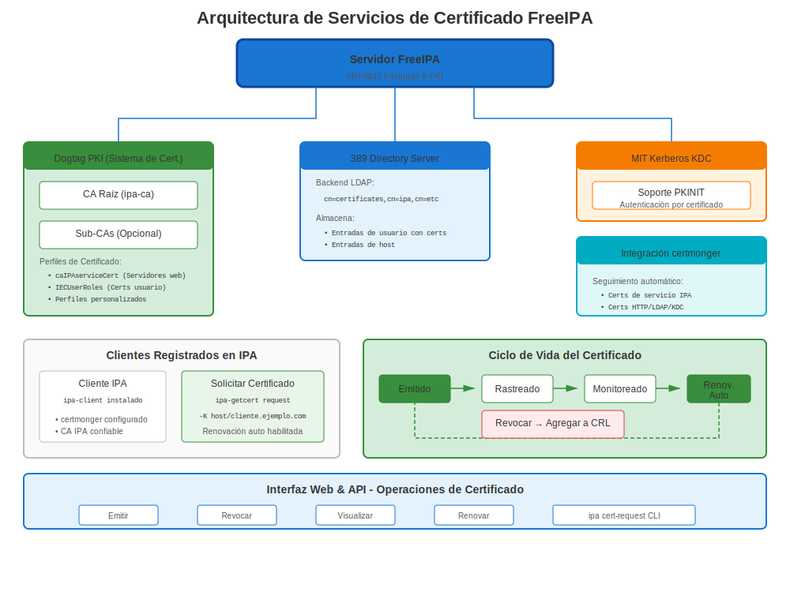
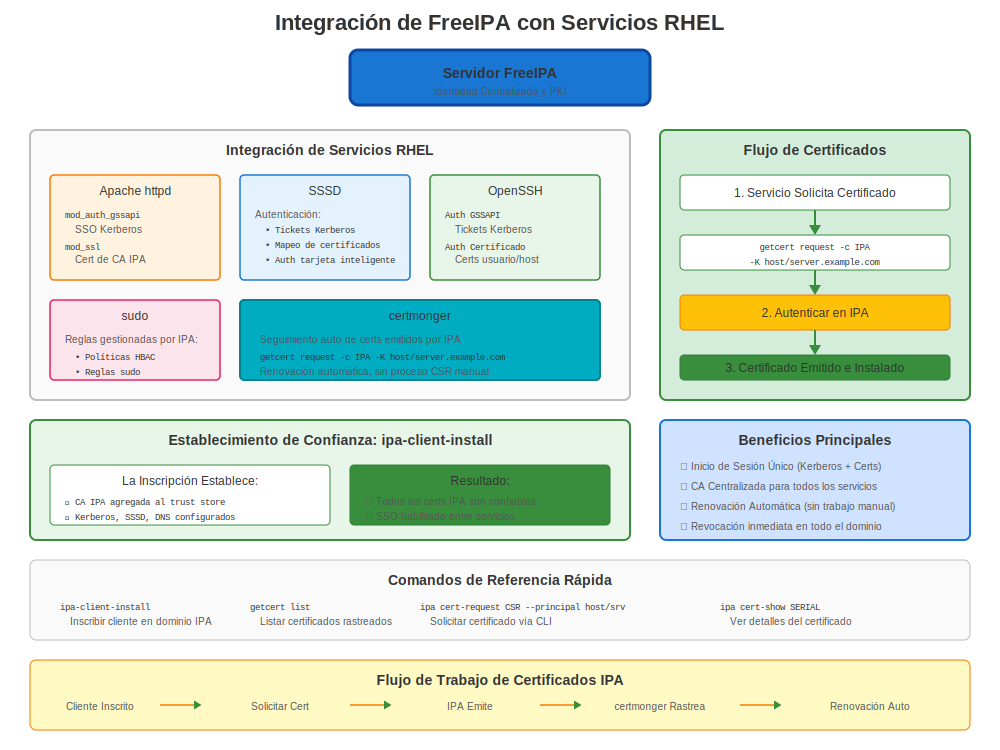

# Capítulo 19: Servicios de Certificados FreeIPA

> **CA Empresarial:** FreeIPA es la solución integrada de gestión de identidad y certificados de Red Hat. Es la forma recomendada de ejecutar una CA interna en RHEL.

---

## 19.1 ¿Qué es FreeIPA?



**FreeIPA** (Identidad, Política, Auditoría) es una solución integrada de gestión de información de seguridad que combina:
- 🔐 **Gestión de Identidad** (directorio LDAP)
- 🎫 **Autenticación** (Kerberos)
- 🔏 **Autoridad Certificadora** (Dogtag PKI)
- 📋 **Gestión de Políticas** (sudo, HBAC)
- 🔍 **DNS** (integración BIND)

### ¿Por Qué FreeIPA para Certificados?

**En lugar de:**
- ❌ Gestionar manualmente certificados por servidor
- ❌ Costos de CA externa
- ❌ Infraestructura PKI compleja

**FreeIPA Proporciona:**
- ✅ CA interna (¡gratis!)
- ✅ Inscripción automática de certificados
- ✅ Renovación automática vía certmonger
- ✅ Perfiles de certificados
- ✅ Gestión por UI web y CLI
- ✅ Integración con servicios RHEL

---

## 19.2 Instalación de FreeIPA (Servidor)

### Prerrequisitos

```bash
#============================================#
# PRERREQUISITOS PARA SERVIDOR FREEIPA
#============================================#

# Requisitos:
# - RHEL 7/8/9/10
# - Mínimo 2 GB RAM (4 GB recomendado)
# - Hostname completamente cualificado
# - Resolución DNS apropiada
# - Dirección IP estática

# Verificar hostname
hostnamectl
# Debe mostrar FQDN: ipa.example.com

# Verificar DNS
nslookup $(hostname -f)

# Establecer hostname si es necesario
sudo hostnamectl set-hostname ipa.example.com
```

### Instalar Servidor FreeIPA

```bash
#============================================#
# INSTALAR SERVIDOR FREEIPA
#============================================#

# Instalar paquetes
sudo dnf install ipa-server ipa-server-dns -y

# Ejecutar asistente de instalación
sudo ipa-server-install \
  --realm EXAMPLE.COM \
  --domain example.com \
  --ds-password 'DirectoryPassword123!' \
  --admin-password 'AdminPassword123!' \
  --hostname ipa.example.com \
  --setup-dns \
  --forwarder 8.8.8.8 \
  --forwarder 8.8.4.4 \
  --unattended

# La instalación toma 5-15 minutos

# Abrir firewall
sudo firewall-cmd --add-service={http,https,dns,ntp,freeipa-ldap,freeipa-ldaps,freeipa-replication} --permanent
sudo firewall-cmd --reload

# Verificar
sudo ipactl status

# Debería mostrar múltiples servicios ejecutándose:
# - Directory Service (389-ds)
# - Certificate Authority (pki-tomcatd)
# - Kerberos KDC
# - Apache Web Server
# - DNS (named)
```

### Acceder a la UI Web de FreeIPA

```bash
# Obtener ticket Kerberos
kinit admin
# Contraseña: AdminPassword123!

# Acceder a UI Web
# https://ipa.example.com/
# Usuario: admin
# Contraseña: AdminPassword123!
```

---

## 19.3 Inscribir Clientes

### Instalación de Cliente

```bash
#============================================#
# INSCRIBIR CLIENTE A FREEIPA
#============================================#

# En sistema cliente (web01.example.com)

# Instalar cliente IPA
sudo dnf install ipa-client -y

# Inscribir
sudo ipa-client-install \
  --domain example.com \
  --realm EXAMPLE.COM \
  --server ipa.example.com \
  --principal admin \
  --password 'AdminPassword123!' \
  --mkhomedir \
  --unattended

# Verificar
# sudo ipa-client-install --uninstall  # ¡Solo bromeando, no ejecutar esto!

# Verificar inscripción
ipa ping
# Pong!

# Verificar rastreo de certificados
sudo getcert list
# Muestra certmonger rastreando certificado de host
```

---

## 19.4 Solicitar Certificados de FreeIPA

### Método 1: UI Web

1. Navegar a https://ipa.example.com/
2. Identidad → Hosts → Seleccionar host → Acciones → Nuevo Certificado
3. O: Identidad → Servicios → Agregar servicio → Solicitar certificado

### Método 2: CLI (Recomendado)

```bash
#============================================#
# SOLICITAR CERTIFICADO DE FREEIPA
#============================================#

# Para servicio HTTP en web01
sudo ipa-getcert request \
  -f /etc/pki/tls/certs/web01.crt \
  -k /etc/pki/tls/private/web01.key \
  -K HTTP/web01.example.com@EXAMPLE.COM \
  -D web01.example.com \
  -C "systemctl reload httpd"

# Para servicio personalizado
sudo ipa-getcert request \
  -f /etc/pki/tls/certs/myapp.crt \
  -k /etc/pki/tls/private/myapp.key \
  -K myapp/web01.example.com@EXAMPLE.COM \
  -D myapp.example.com

# Verificar estado
sudo getcert list

# Esperar estado MONITORING (cert emitido)
```

### Método 3: ipa cert-request (Avanzado)

```bash
#============================================#
# AVANZADO: IPA CERT-REQUEST
#============================================#

# Generar CSR
openssl req -new -key server.key -out server.csr \
  -subj "/CN=server.example.com"

# Solicitar certificado vía IPA
ipa cert-request server.csr \
  --principal HTTP/server.example.com@EXAMPLE.COM

# Obtener ID de certificado de la salida
# Certificate: MIIDXTCCAkWgAwIBAgI...
# Request ID: 12345

# Recuperar certificado
ipa cert-show 12345 --out server.crt
```

---

## 19.5 Perfiles de Certificados

### Perfiles Disponibles

```bash
#============================================#
# PERFILES DE CERTIFICADOS FREEIPA
#============================================#

# Listar perfiles disponibles
ipa certprofile-find

# Perfiles comunes:
# - caIPAserviceCert: Certificados de servicio (HTTP, LDAP, etc.)
# - IECUserRoles: Certificados de usuario
# - smimeUserCert: Certificados email S/MIME
# - caSelfSignedCert: CA autofirmada

# Ver detalles del perfil
ipa certprofile-show caIPAserviceCert

# Crear perfil personalizado
ipa certprofile-import MyCustomProfile \
  --file custom-profile.cfg \
  --store TRUE
```

### Usar Perfil Específico

```bash
# Solicitar con perfil específico
sudo ipa-getcert request \
  -f /etc/pki/tls/certs/custom.crt \
  -k /etc/pki/tls/private/custom.key \
  -K HTTP/web01.example.com@EXAMPLE.COM \
  -T caIPAserviceCert  # Especificar perfil
```

---

## 19.6 Renovación Automática

### Cómo Funciona

**FreeIPA + certmonger = ¡Ciclo de Vida Automático de Certificados!**

```bash
#============================================#
# RENOVACIÓN AUTOMÁTICA CON FREEIPA
#============================================#

# certmonger automáticamente:
# 1. Rastrea expiración de certificado
# 2. Envía solicitud de renovación a IPA
# 3. Obtiene certificado renovado
# 4. Guarda en archivo
# 5. Ejecuta comando post-guardado (ej: reload httpd)

# Verificar estado de renovación
sudo getcert list

# Salida de ejemplo:
# Request ID '20240101000000':
#   status: MONITORING
#   stuck: no
#   key pair storage: type=FILE,location='/etc/pki/tls/private/web.key'
#   certificate: type=FILE,location='/etc/pki/tls/certs/web.crt'
#   CA: IPA
#   issuer: CN=Certificate Authority,O=EXAMPLE.COM
#   subject: CN=web01.example.com,O=EXAMPLE.COM
#   expires: 2025-01-01 00:00:00 UTC
#   pre-save command:
#   post-save command: systemctl reload httpd
#   track: yes
#   auto-renew: yes

# ¡La renovación ocurre automáticamente ~28 días antes de expirar!
```

### Renovación Manual (Si Se Necesita)

```bash
# Forzar renovación ahora
sudo ipa-getcert resubmit -f /etc/pki/tls/certs/web.crt

# O por ID de solicitud
sudo ipa-getcert resubmit -i 20240101000000

# Verificar si fue exitosa
sudo getcert list -f /etc/pki/tls/certs/web.crt
```

---

## 19.7 FreeIPA como CA Empresarial

### Gestión de Certificados CA

```bash
#============================================#
# GESTIÓN CA DE FREEIPA
#============================================#

# Ver certificado CA
ipa ca-show ipa

# Exportar certificado CA
ipa ca-show ipa --certificate --out /tmp/ipa-ca.crt

# Instalar en clientes (automático durante ipa-client-install)
# Manual: Copiar a almacén de confianza
sudo cp /tmp/ipa-ca.crt /etc/pki/ca-trust/source/anchors/
sudo update-ca-trust

# Renovar certificado CA (cuando sea necesario)
sudo ipa-cacert-manage renew

# Verificar expiración CA
sudo getcert list -d /var/lib/ipa | grep "CA:"
```

### Sub-CAs (Avanzado)

```bash
#============================================#
# SUB-CA DE FREEIPA (RHEL 8+)
#============================================#

# Crear sub-CA
ipa ca-add subca \
  --subject "CN=SubCA,O=EXAMPLE.COM" \
  --desc "Sub-CA de Departamento"

# Emitir certificado de sub-CA
sudo ipa-getcert request \
  -f /etc/pki/tls/certs/dept.crt \
  -k /etc/pki/tls/private/dept.key \
  -X subca \
  -K HTTP/dept.example.com@EXAMPLE.COM
```

---

## 19.8 Ejemplos de Integración de Servicios



### Apache con Certificados FreeIPA

```bash
#============================================#
# CONFIGURACIÓN COMPLETA APACHE + FREEIPA
#============================================#

# 1. Inscribir sistema a IPA (si aún no)
sudo ipa-client-install

# 2. Solicitar certificado para Apache
sudo ipa-getcert request \
  -f /etc/pki/tls/certs/$(hostname -f).crt \
  -k /etc/pki/tls/private/$(hostname -f).key \
  -K HTTP/$(hostname -f)@EXAMPLE.COM \
  -D $(hostname -f) \
  -C "systemctl reload httpd"

# 3. Esperar certificado
until sudo getcert list -f /etc/pki/tls/certs/$(hostname -f).crt | grep -q "MONITORING"; do
  sleep 5
  echo "Esperando certificado..."
done

# 4. Configurar Apache para usarlo
# /etc/httpd/conf.d/ssl.conf:
# SSLCertificateFile /etc/pki/tls/certs/$(hostname -f).crt
# SSLCertificateKeyFile /etc/pki/tls/private/$(hostname -f).key

# 5. Recargar Apache
sudo systemctl reload httpd

# ¡El certificado se renueva automáticamente!
```

### LDAP con Certificados FreeIPA

```bash
# El servicio LDAP propio de FreeIPA usa automáticamente certificados IPA
# ¡No se necesita configuración manual!

# Probar
ldapsearch -H ldaps://ipa.example.com:636 -x -b "dc=example,dc=com"
```

---

## 19.9 Solución de Problemas de Certificados FreeIPA

### Problemas Comunes

**Problema 1: CA_UNREACHABLE**

```bash
# Síntoma
sudo getcert list
# status: CA_UNREACHABLE

# Diagnóstico
# 1. Verificar conectividad con servidor IPA
ipa ping

# 2. Verificar ticket Kerberos
klist

# 3. Renovar ticket si expiró
kinit -k host/$(hostname -f)@EXAMPLE.COM

# 4. Verificar servicios IPA
ssh ipa.example.com "sudo ipactl status"

# 5. Reintentar
sudo ipa-getcert resubmit -i <request-id>
```

**Problema 2: Solicitud de Certificado Denegada**

```bash
# Verificar estado de solicitud
sudo getcert list -v

# Causas comunes:
# 1. Principal de servicio no existe
ipa service-find HTTP/$(hostname -f)

# Si no se encuentra, agregarlo:
ipa service-add HTTP/$(hostname -f)

# 2. Host no inscrito
ipa host-show $(hostname -f)

# 3. Permisos insuficientes
# Debe solicitar como principal de host inscrito
```

**Problema 3: Certificado No Renovado**

```bash
# Verificar logs de certmonger
sudo journalctl -u certmonger | tail -50

# Verificar estado CA de IPA
sudo ipactl status | grep "CA"

# Forzar renovación
sudo ipa-getcert resubmit -f /etc/pki/tls/certs/web.crt

# Verificar expiración de certificado CA
sudo openssl x509 -in /etc/ipa/ca.crt -noout -dates
```

---

## 19.10 Características Avanzadas

### Soporte ACME (RHEL 9+)

**¡FreeIPA puede actuar como servidor ACME!**

```bash
#============================================#
# HABILITAR ACME EN FREEIPA (RHEL 9+)
#============================================#

# En servidor IPA (RHEL 9+)
sudo ipa-acme-manage enable

# Verificar que ACME está disponible
curl https://ipa.example.com/acme/directory

# En cliente: Usar certbot o certmonger con ACME
sudo certbot register --server https://ipa.example.com/acme/directory
sudo certbot certonly --server https://ipa.example.com/acme/directory \
  -d web01.example.com
```

### Retención/Revocación de Certificados

```bash
#============================================#
# REVOCAR CERTIFICADOS
#============================================#

# Poner certificado en retención (temporal)
ipa cert-revoke 12345 --revocation-reason 6

# Revocar permanentemente
ipa cert-revoke 12345 --revocation-reason 1

# Razones:
# 0: unspecified
# 1: keyCompromise
# 2: cACompromise
# 4: superseded
# 6: certificateHold (puede ser removido)

# Remover de retención
ipa cert-remove-hold 12345

# Verificar estado de revocación
ipa cert-show 12345
```

---

## 19.11 Monitorear PKI de FreeIPA

### Verificaciones de Salud

```bash
#============================================#
# MONITOREO DE SALUD PKI FREEIPA
#============================================#

# Verificar estado general de IPA
sudo ipactl status

# Verificar subsistema CA
sudo systemctl status pki-tomcatd@pki-tomcat

# Verificar expiraciones de certificados
ipa-healthcheck --source ipahealthcheck.ipa.certs

# Verificar rastreo de certificados
sudo getcert list | grep -E "(Request|status|expires)"

# Monitorear certificado CA
openssl x509 -in /etc/ipa/ca.crt -noout -dates

# Verificar certificados expirando
ipa cert-find --validnotafter-from=$(date -d '+60 days' +%Y-%m-%d)
```

---

## 19.12 Respaldo y Recuperación

### Respaldar Servidor IPA

```bash
#============================================#
# RESPALDAR FREEIPA (INCLUYENDO CA)
#============================================#

# Respaldo completo
sudo ipa-backup --data --online

# Ubicación de respaldo
ls -lh /var/lib/ipa/backup/

# Incluir claves CA (¡solo respaldo offline!)
sudo ipactl stop
sudo ipa-backup --data --gpg
# Ingresar passphrase GPG
sudo ipactl start
```

### Restaurar Servidor IPA

```bash
# Restaurar desde respaldo
sudo ipactl stop
sudo ipa-restore /var/lib/ipa/backup/ipa-full-YYYY-MM-DD-HH-MM-SS/
sudo ipactl start
```

---

## 19.13 Mejores Prácticas

### Mejores Prácticas de Certificados FreeIPA

```markdown
✅ Usar FreeIPA para todos los certificados internos
✅ Dejar que certmonger maneje renovación (no renovar manualmente)
✅ Usar principales de servicio (HTTP/host, ldap/host, etc.)
✅ Agregar SANs al solicitar certificados
✅ Establecer comandos post-guardado (flag -C) para recarga de servicio
✅ Monitorear salud del servidor IPA regularmente
✅ Respaldar servidor IPA semanalmente (incluyendo claves CA)
✅ Tener al menos 2 réplicas IPA (HA)
✅ Monitorear expiración de certificado CA
✅ Probar renovación de certificado antes de expirar
✅ Usar perfiles de certificados para estandarización
```

---

## 19.14 Ejemplos de Integración

### Configuración Completa de Servicio con FreeIPA

```bash
#!/bin/bash
# setup-service-with-ipa.sh
# Flujo de trabajo completo para certificado de servicio desde FreeIPA

SERVICE_NAME="HTTP"  # O LDAP, postgresql, etc.
HOST=$(hostname -f)
PRINCIPAL="${SERVICE_NAME}/${HOST}@EXAMPLE.COM"
CERT_FILE="/etc/pki/tls/certs/${HOST}.crt"
KEY_FILE="/etc/pki/tls/private/${HOST}.key"
POST_COMMAND="systemctl reload httpd"

echo "=== Solicitando Certificado de FreeIPA ==="

# 1. Asegurar que el principal de servicio existe
if ! ipa service-show "${SERVICE_NAME}/${HOST}" &>/dev/null; then
  echo "Creando principal de servicio..."
  ipa service-add "${SERVICE_NAME}/${HOST}"
fi

# 2. Solicitar certificado
sudo ipa-getcert request \
  -f "$CERT_FILE" \
  -k "$KEY_FILE" \
  -K "$PRINCIPAL" \
  -D "$HOST" \
  -C "$POST_COMMAND"

# 3. Esperar certificado
echo "Esperando emisión de certificado..."
until sudo getcert list -f "$CERT_FILE" | grep -q "MONITORING"; do
  sleep 5
done

# 4. Verificar
echo "✅ ¡Certificado emitido!"
sudo openssl x509 -in "$CERT_FILE" -noout -subject -issuer -dates

# 5. ¡El certificado se renovará automáticamente!
echo "✅ Rastreo de certificado habilitado - renovación automática activa"
```

---

## 19.15 Conclusiones Clave

1. **FreeIPA es la CA interna recomendada de Red Hat**
2. **Combina identidad + certificados + autenticación**
3. **Integración con certmonger es automática**
4. **Los certificados se renuevan automáticamente** (¡sin trabajo manual!)
5. **Usar principales de servicio** (HTTP/host, ldap/host)
6. **Soporte ACME** en RHEL 9+ (puede reemplazar Let's Encrypt para interno)
7. **UI Web y CLI** ambos disponibles
8. **Escala a empresa** - Soporta réplicas, sub-CAs

---

## Tarjeta de Referencia Rápida

```
┌──────────────────────────────────────────────────────────────┐
│ REFERENCIA RÁPIDA SERVICIOS CERTIFICADOS FREEIPA             │
├──────────────────────────────────────────────────────────────┤
│ Instalar:         dnf install ipa-server                     │
│ Configurar:       ipa-server-install                         │
│ Estado:           ipactl status                              │
│ UI Web:           https://ipa.example.com/                   │
│                                                              │
│ Inscribir:        ipa-client-install                         │
│ Solicitar:        ipa-getcert request -K service/host@REALM  │
│ Listar:           getcert list                               │
│ Reenviar:         ipa-getcert resubmit -f /path/to/cert.crt  │
│                                                              │
│ Principal:        HTTP/host.example.com@REALM                │
│                   ldap/host.example.com@REALM                │
│                   postgresql/host.example.com@REALM          │
│                                                              │
│ Renovación auto:  Automática vía certmonger                  │
│ ACME:             ipa-acme-manage enable (RHEL 9+)           │
└──────────────────────────────────────────────────────────────┘

✅ Mejor para gestión de certificados empresarial interno
✅ Completamente integrado con RHEL
✅ ¡No se necesita renovación manual!
```
---

**Navegación del Capítulo**

| [← Anterior: Capítulo 18 - TLS en Bases de Datos (PostgreSQL, MySQL)](18-database-tls.md) | [Siguiente: Capítulo 20 - Otros Servicios RHEL con Certificados →](20-other-rhel-services.md) |
|:---|---:|
