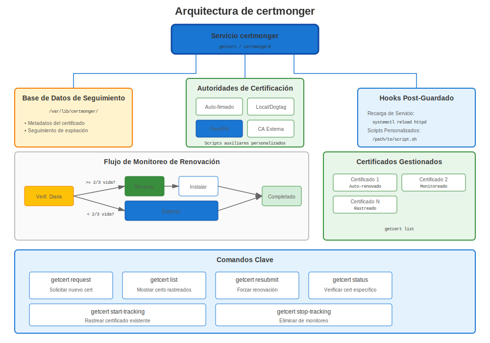
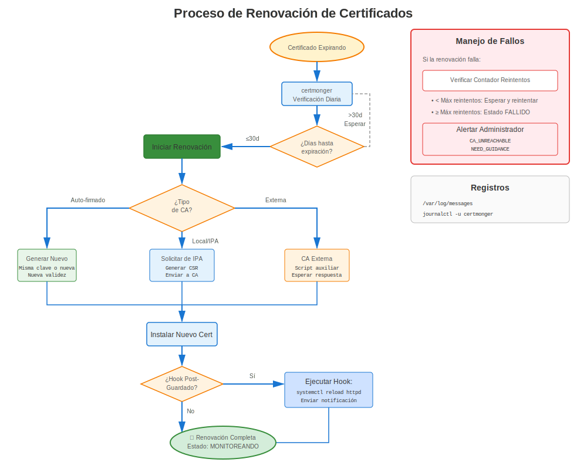
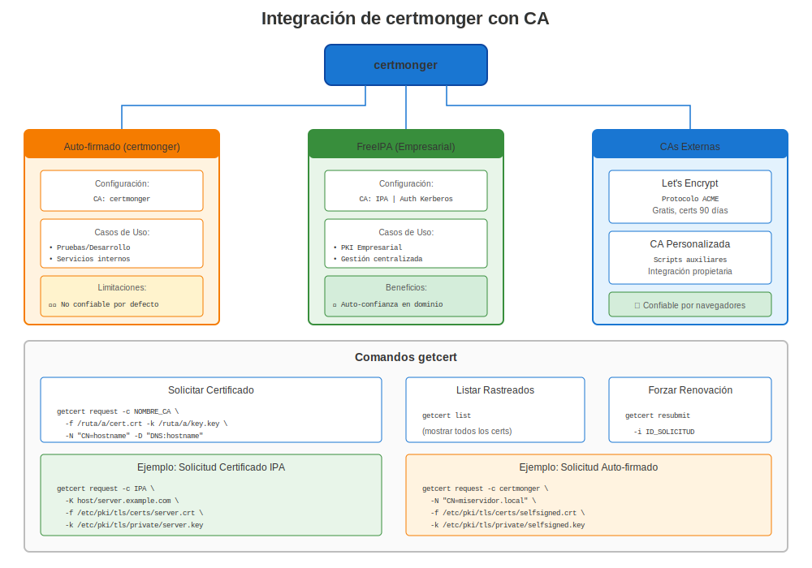

# Capítulo 22: Dominio de certmonger

> **Configúralo y Olvídalo:** certmonger es la herramienta de automatización de certificados integrada en RHEL. Domínala y nunca renovarás un certificado manualmente otra vez.

---

## 22.1 ¿Qué es certmonger?



**certmonger** es un demonio de rastreo de certificados y renovación automática para RHEL.

**Piénsalo como:**
- 📋 **Rastreador de certificados** - Monitorea fechas de expiración
- 🔄 **Renovador automático** - Renueva antes de expirar
- 🔗 **Integrador de CA** - Funciona con FreeIPA, CAs locales/internas y helpers de CA externa
- ⚙️ **Integración de servicios** - Ejecuta comandos después de renovación

### ¿Por Qué certmonger?

**Sin certmonger:**
```
❌ Rastreo manual de fechas de expiración
❌ Recordatorios de calendario para renovar
❌ Generación manual de CSR
❌ Reinicio manual de servicio después de renovación
❌ Riesgo de perder renovaciones → interrupciones
```

**Con certmonger:**
```
✅ Rastreo automático
✅ Renovación automática
✅ Recarga automática de servicio
✅ Monitoreo centralizado
✅ ¡Sin intervención manual!
```

---

## 22.2 Instalación y Configuración



### Todas las Versiones RHEL

```bash
#============================================#
# INSTALAR CERTMONGER
#============================================#

# Instalar
sudo dnf install certmonger -y

# Habilitar e iniciar
sudo systemctl enable certmonger
sudo systemctl start certmonger

# Verificar
systemctl status certmonger
sudo getcert list  # Debería mostrar lista vacía inicialmente
```

---

## 22.3 Uso Básico



### Solicitar un Certificado

```bash
#============================================#
# SOLICITUD BÁSICA DE CERTIFICADO
#============================================#

# Autofirmado (para pruebas)
sudo getcert request \
  -f /etc/pki/tls/certs/test.crt \
  -k /etc/pki/tls/private/test.key

# De FreeIPA
sudo ipa-getcert request \
  -f /etc/pki/tls/certs/web.crt \
  -k /etc/pki/tls/private/web.key \
  -K HTTP/$(hostname -f)@REALM \
  -D $(hostname -f)

# Para certificados públicos de Let's Encrypt, usa certbot (Capítulo 24).
# certmonger es la opción nativa para IPA, CA local y flujos basados en helpers.
```

### Verificar Estado

```bash
#============================================#
# VERIFICAR ESTADO DE CERTIFICADO
#============================================#

# Listar todos los certificados rastreados
sudo getcert list

# Verificar certificado específico por archivo
sudo getcert list -f /etc/pki/tls/certs/web.crt

# Verificar por ID de solicitud
sudo getcert list -i 20240101000000

# Salida verbosa
sudo getcert list -v
```

**Valores de Estado:**
- `MONITORING`: ✅ Certificado emitido, rastreando expiración
- `SUBMITTING`: 🔄 Enviando solicitud a CA
- `CA_UNREACHABLE`: ❌ No se puede alcanzar servidor CA
- `CA_REJECTED`: ❌ CA rechazó solicitud
- `NEED_KEY_GEN_PIN`: ⏸️ Esperando PIN (HSM/token)
- `PRE_SAVE_COMMAND`: 🔄 Ejecutando script pre-guardado
- `POST_SAVE_COMMAND`: 🔄 Ejecutando script post-guardado

---

## 22.4 Opciones Avanzadas

### Solicitud Completa con Todas las Opciones

```bash
#============================================#
# SOLICITUD COMPLETA CERTMONGER
#============================================#

sudo ipa-getcert request \
  -f /etc/pki/tls/certs/web.example.com.crt \              # Archivo de certificado
  -k /etc/pki/tls/private/web.example.com.key \            # Archivo de clave privada
  -K HTTP/web.example.com@EXAMPLE.COM \                    # Principal Kerberos
  -D web.example.com \                                     # Nombre DNS (SAN)
  -D www.example.com \                                     # SAN adicional
  -D api.example.com \                                     # Otro SAN
  -U id-kp-serverAuth \                                    # Uso de clave extendido
  -N CN=web.example.com,O=Example,C=US \                   # DN del sujeto
  -g 2048 \                                                # Tamaño de clave
  -G rsa \                                                 # Tipo de clave
  -T caIPAserviceCert \                                    # Perfil IPA
  -C "systemctl reload httpd" \                            # Comando post-guardado
  -B "systemctl stop httpd" \                              # Comando pre-guardado
  -v \                                                     # Verboso
  -w                                                       # Esperar completitud

# Verificar estado
sudo getcert list -f /etc/pki/tls/certs/web.example.com.crt
```

**Opciones Clave Explicadas:**

| Opción | Propósito | Ejemplo |
|--------|-----------|---------|
| `-f` | Ruta de archivo de certificado | `/etc/pki/tls/certs/web.crt` |
| `-k` | Ruta de archivo de clave privada | `/etc/pki/tls/private/web.key` |
| `-K` | Principal Kerberos | `HTTP/web.example.com@REALM` |
| `-D` | SAN DNS | `web.example.com` |
| `-N` | DN del sujeto | `CN=web,O=Example` |
| `-C` | Comando post-guardado | `systemctl reload httpd` |
| `-B` | Comando pre-guardado | `systemctl stop httpd` |
| `-c` | Nombre CA | `IPA` o `external-ca` |
| `-T` | Perfil de certificado | `caIPAserviceCert` |
| `-g` | Tamaño de clave | `2048` o `4096` |
| `-G` | Tipo de clave | `rsa` o `ec` |

---

## 22.5 Trabajar con Diferentes CAs

### FreeIPA (Recomendado para Interno)

```bash
#============================================#
# CERTMONGER + FREEIPA
#============================================#

# Prerrequisitos: Sistema inscrito a IPA
ipa-client-install

# Solicitar certificado
sudo ipa-getcert request \
  -f /etc/pki/tls/certs/internal.crt \
  -k /etc/pki/tls/private/internal.key \
  -K HTTP/$(hostname -f)@REALM \
  -D $(hostname -f) \
  -C "systemctl reload httpd"

# certmonger automáticamente:
# ✅ Envía solicitud a CA IPA
# ✅ Obtiene certificado
# ✅ Guarda en archivo
# ✅ Ejecuta comando de recarga
# ✅ Rastrea expiración
# ✅ Renueva ~28 días antes de expirar
```

### ACME público requiere certbot

```bash
#============================================#
# ACME PÚBLICO VS FLUJOS NATIVOS DE CERTMONGER
#============================================#

# Certificado público de Let's Encrypt:
# Usa certbot, no un perfil de CA falso en certmonger.
sudo certbot certonly --apache -d public.example.com

# Certificado nativo de FreeIPA / IdM:
sudo ipa-getcert request \
  -f /etc/pki/tls/certs/internal.crt \
  -k /etc/pki/tls/private/internal.key \
  -K HTTP/$(hostname -f)@REALM \
  -D $(hostname -f) \
  -C "systemctl reload httpd"
```

### CA Externa (Envío Manual)

```bash
#============================================#
# CERTMONGER CON CA EXTERNA
#============================================#

# Configurar helper de CA externa
sudo getcert add-ca -c external-ca \
  -e '/usr/local/bin/external-ca-submit.sh'

# Solicitar certificado
sudo getcert request \
  -c external-ca \
  -f /etc/pki/tls/certs/external.crt \
  -k /etc/pki/tls/private/external.key

# El script helper debe:
# 1. Leer CSR desde stdin
# 2. Enviar a CA externa
# 3. Retornar certificado en stdout
```

---

## 22.6 Gestionar Certificados Rastreados

### Modificar Rastreo

```bash
#============================================#
# MODIFICAR RASTREO DE CERTIFICADO EXISTENTE
#============================================#

# Actualizar comando post-guardado sin rekey
sudo getcert stop-tracking -f /etc/pki/tls/certs/web.crt
sudo getcert start-tracking \
  -f /etc/pki/tls/certs/web.crt \
  -k /etc/pki/tls/private/web.key \
  -C "systemctl reload httpd"
# Vuelva a añadir -c, -K, -D, etc. si la entrada original los usaba

# Agregar SAN adicional
sudo getcert resubmit -f /etc/pki/tls/certs/web.crt \
  -D additional.example.com

# Dejar de rastrear (mantener certificado)
sudo getcert stop-tracking -f /etc/pki/tls/certs/web.crt

# Eliminar completamente
sudo getcert stop-tracking -f /etc/pki/tls/certs/web.crt -r

# Comenzar a rastrear certificado existente
sudo getcert start-tracking \
  -f /etc/pki/tls/certs/existing.crt \
  -k /etc/pki/tls/private/existing.key
```

### Forzar Renovación

```bash
#============================================#
# FORZAR RENOVACIÓN INMEDIATA
#============================================#

# Por ruta de archivo
sudo ipa-getcert resubmit -f /etc/pki/tls/certs/web.crt

# Por ID de solicitud
sudo getcert resubmit -i 20240101000000

# Esperar renovación
sudo getcert list -f /etc/pki/tls/certs/web.crt
# Esperar estado: MONITORING
```

---

## 22.7 Tiempo de Renovación

### Entender Ventanas de Renovación

```
Ciclo de Vida del Certificado (365 días):

Día   0: Certificado emitido
      │
      │ [Operación normal]
      │
Día 243: Comienza ventana de renovación (certmonger intenta renovación)
      │ (2/3 del tiempo de vida del cert: 365 × 2/3 ≈ 243 días)
      │
      │ [Intentos de renovación cada 8 horas si CA disponible]
      │
Día 335: Advertencia si aún no renovado (quedan 30 días)
      │
Día 350: Crítico si aún no renovado (quedan 15 días)
      │
Día 365: El certificado expira → ¡INTERRUPCIÓN DEL SERVICIO si no se renueva!
```

**Comportamiento Predeterminado:**
- La renovación comienza a 2/3 del tiempo de vida del certificado
- Cert de 365 días → Renueva en día 243 (quedan 122 días)
- Cert de 90 días → Renueva en día 60 (quedan 30 días)

---

## 22.8 Comandos Post-Guardado

### Reload vs Restart

```bash
#============================================#
# ESTRATEGIAS DE COMANDO POST-GUARDADO
#============================================#

# PREFERIR: reload (sin tiempo de inactividad)
-C "systemctl reload httpd"
-C "systemctl reload nginx"
-C "postfix reload"

# A VECES NECESARIO: restart
-C "systemctl restart slapd"  # OpenLDAP requiere restart
-C "systemctl restart postgresql"  # PostgreSQL requiere restart

# MÚLTIPLES COMANDOS: Usar script
-C "/usr/local/bin/after-cert-renewal.sh"

# Ejemplo de script:
#!/bin/bash
# /usr/local/bin/after-cert-renewal.sh
systemctl reload httpd
systemctl reload nginx
systemctl reload postfix
logger "Certificados renovados vía certmonger"
```

---

## 22.9 Solución de Problemas certmonger

### Problemas Comunes

**Problema 1: CA_UNREACHABLE**

```bash
# Síntoma
sudo getcert list
# status: CA_UNREACHABLE

# Diagnóstico
# Para FreeIPA:
ipa ping  # Verificar conectividad IPA
klist  # Verificar ticket Kerberos

# Solución
kinit -k host/$(hostname -f)@REALM  # Renovar ticket de host
sudo ipa-getcert resubmit -f /etc/pki/tls/certs/web.crt

# Verificar servidor IPA
ssh ipa-server "sudo ipactl status"
```

**Problema 2: CA_REJECTED**

```bash
# Síntoma
sudo getcert list
# status: CA_REJECTED
# ca-error: Server at https://ipa.example.com/ipa/xml unwilling to issue certificate

# Causas comunes:
# 1. Principal de servicio no existe
ipa service-show HTTP/$(hostname -f)
# Si no se encuentra:
ipa service-add HTTP/$(hostname -f)

# 2. Host no inscrito
ipa host-show $(hostname -f)

# 3. Problema de permisos
# Verificar permisos IPA

# Reintentar
sudo ipa-getcert resubmit -f /etc/pki/tls/certs/web.crt
```

**Problema 3: Renovación No Está Ocurriendo**

```bash
# Verificar que certmonger está ejecutándose
systemctl status certmonger

# Verificar estado del certificado
sudo getcert list -f /etc/pki/tls/certs/web.crt

# Verificar logs de certmonger
sudo journalctl -u certmonger -f

# Forzar renovación
sudo ipa-getcert resubmit -f /etc/pki/tls/certs/web.crt

# Verificar ventana de renovación
# El certificado renueva a 2/3 del tiempo de vida
# Verificar fecha "expires" en salida de getcert list
```

---

## 22.10 IdM ACME vs Let's Encrypt público

### Mantén separados los flujos

```bash
#============================================#
# ELIGE LA HERRAMIENTA CORRECTA PARA LA CA CORRECTA
#============================================#

# Certificado público de Let's Encrypt:
# Usa certbot (ver Capítulo 24).
sudo certbot certonly --apache -d public.example.com -d www.public.example.com

# Certificado nativo de FreeIPA / IdM:
# Usa certmonger + ipa-getcert.
sudo ipa-getcert request \
  -f /etc/pki/tls/certs/internal.example.com.crt \
  -k /etc/pki/tls/private/internal.example.com.key \
  -K HTTP/internal.example.com@REALM \
  -D internal.example.com \
  -C "systemctl reload httpd"

# Si IdM ACME está habilitado, su directorio ACME es tu servidor IPA,
# no Let's Encrypt:
sudo certbot certonly \
  --server https://ipa.example.com/acme/directory \
  -d host.example.com
```

**Distinción importante:**
- **Let's Encrypt** = CA ACME pública de internet
- **IdM/FreeIPA ACME** = tu CA IPA interna exponiendo un endpoint ACME
- **certmonger** = rastreador/renovador nativo de RHEL para IPA y flujos basados en helpers

---

## 22.11 Monitorear certmonger

### Monitoreo de Estado

```bash
#============================================#
# MONITOREAR CERTMONGER
#============================================#

# Resumen de todos los certificados
sudo getcert list

# Contar certificados por estado
sudo getcert list | grep "status:" | sort | uniq -c

# Encontrar certificados expirando pronto (30 días)
for cert in $(sudo getcert list | grep "certificate:" | sed -n "s/.*location='\\([^']*\\)'.*/\\1/p"); do
  if ! openssl x509 -in "$cert" -noout -checkend $((86400*30)) 2>/dev/null; then
    echo "⚠️ Expira pronto: $cert"
  fi
done

# Verificar logs de certmonger
sudo journalctl -u certmonger --since today

# Observar actividad de renovación
sudo journalctl -u certmonger -f

# Verificar próximo tiempo de renovación
sudo getcert list | grep -A15 "Request ID" | grep "expires"
```

### Script de Verificación de Salud

```bash
#!/bin/bash
# certmonger-health-check.sh

echo "=== Verificación de Salud certmonger ==="

# ¿certmonger ejecutándose?
if systemctl is-active --quiet certmonger; then
  echo "✅ certmonger está ejecutándose"
else
  echo "❌ ¡certmonger NO está ejecutándose!"
  exit 1
fi

# Contar certificados rastreados
TOTAL=$(sudo getcert list | grep -c "Request ID")
echo "📋 Rastreando $TOTAL certificados"

# Verificar desglose de estado
echo ""
echo "Desglose de estado:"
sudo getcert list | grep "status:" | sort | uniq -c

# Verificar problemas
PROBLEMS=$(sudo getcert list | grep "status:" | grep -v "MONITORING" | wc -l)
if [ $PROBLEMS -gt 0 ]; then
  echo ""
  echo "⚠️ $PROBLEMS certificados necesitan atención:"
  sudo getcert list | grep -B5 "status:" | grep -E "(Request ID|status:)" | grep -v "MONITORING"
fi

# Verificar advertencias de expiración
echo ""
echo "Certificados expirando en 30 días:"
sudo getcert list | grep -A10 "Request ID" | grep "expires:" | \
  while read line; do
    # Parsear y verificar expiración
    # (simplificado - script de producción parsearía fechas apropiadamente)
    echo "$line"
  done
```

---

## 22.12 Configuración de certmonger

### Archivo de Configuración Principal

```bash
#============================================#
# CONFIGURACIÓN CERTMONGER
#============================================#

# Ubicación de configuración
/etc/certmonger/certmonger.conf

# Ubicación de base de datos (certificados rastreados)
/var/lib/certmonger/

# Listar CAs configuradas
sudo getcert list-cas

# Agregar CA personalizada
sudo getcert add-ca -c my-ca \
  -e '/usr/local/bin/my-ca-submit.sh'

# Eliminar CA
sudo getcert remove-ca -c my-ca
```

---

## 22.13 Mejores Prácticas

### Mejores Prácticas de certmonger

```markdown
✅ **Siempre usar comandos post-guardado** (flag -C) para recargar servicios
✅ **Rastrear todos los certificados de producción** con certmonger
✅ **Monitorear estado semanalmente** con `getcert list`
✅ **Probar renovación** antes de expirar con `resubmit`
✅ **Usar modo verboso** (-v) al resolver problemas
✅ **Configurar monitoreo** para estado CA_UNREACHABLE
✅ **Documentar IDs de solicitud** en tu inventario de certificados
✅ **Usar IPA/certmonger para certificados internos** y certbot para Let's Encrypt público
✅ **Mantener logs de certmonger** para pista de auditoría
✅ **Probar comandos post-guardado** independientemente antes de usar
```

### Qué Rastrear con certmonger

```bash
# ✅ RASTREAR con certmonger:
- Certificados de servidor web (Apache, NGINX)
- Certificados de servidor de correo (Postfix, Dovecot)
- Certificados de servidor LDAP (OpenLDAP)
- Certificados de aplicación (APIs, microservicios)
- Certificados de servicio (cualquier servicio habilitado para TLS)

# ❌ NO rastrear con certmonger:
- Certificados raíz CA (gestionados separadamente)
- Certificados de cliente para usuarios (ciclo de vida diferente)
- Certificados de prueba/temporales
- Certificados que gestionas con otras herramientas (certbot)
```

---

## 22.14 certmonger vs certbot

### ¿Cuándo Usar Cuál?

| Característica | certmonger | certbot |
|----------------|------------|---------|
| **Nativo RHEL** | ✅ Sí (incluido) | ❌ No (EPEL requerido) |
| **Soporte FreeIPA** | ✅ Nativo | ❌ No |
| **Let's Encrypt ACME público** | ❌ Usa certbot en su lugar | ✅ Sí (todas las versiones) |
| **CA Interna** | ✅ Excelente | ❌ No |
| **Config Apache/NGINX** | ⏸️ Manual | ✅ Automática |
| **Integración Servicio** | ✅ Comandos post-guardado | ⏸️ Limitada |
| **Tiempo Renovación** | 2/3 del tiempo de vida | 30 días antes |
| **Soporte Red Hat** | ✅ Sí | ❌ No (EPEL) |

**Recomendación:**
- **Interno/Empresa:** Usar certmonger + FreeIPA
- **Público/Simple:** Usar certbot (pero saber que requiere EPEL)
- **Certificados públicos en cualquier versión RHEL:** usar certbot para Let's Encrypt

---

## 22.15 Escenarios Avanzados

### Escenario 1: Renovación de Certificado de Alta Disponibilidad

```bash
# Múltiples servidores con mismo servicio

# Servidor 1:
sudo ipa-getcert request \
  -f /etc/pki/tls/certs/shared-service.crt \
  -k /etc/pki/tls/private/shared-service.key \
  -K HTTP/service.example.com@REALM \
  -D service.example.com \
  -C "systemctl reload httpd"

# Servidor 2: Misma configuración
# Resultado: Cada servidor gestiona su propio cert independientemente
# O: Usar cert compartido (copiar archivos, no recomendado)
```

### Escenario 2: Certificado Comodín

```bash
# Solicitar comodín de FreeIPA
sudo ipa-getcert request \
  -f /etc/pki/tls/certs/wildcard.crt \
  -k /etc/pki/tls/private/wildcard.key \
  -K HTTP/*.example.com@REALM \
  -D *.example.com \
  -D example.com \
  -C "/usr/local/bin/reload-all-services.sh"
```

### Escenario 3: Claves EC (Curva Elíptica)

```bash
# Solicitar con clave EC
sudo ipa-getcert request \
  -f /etc/pki/tls/certs/ec-cert.crt \
  -k /etc/pki/tls/private/ec-cert.key \
  -K HTTP/$(hostname -f)@REALM \
  -G ec \
  -g nistp256  # o nistp384, nistp521
```

---

## 22.16 Conclusiones Clave

1. **certmonger es la automatización de certificados de RHEL**
2. **Configúralo y olvídalo** - Renovación automática
3. **Funciona mejor con FreeIPA, CAs internas y renovaciones basadas en helpers**
4. **Comandos post-guardado** recargan servicios automáticamente
5. **Rastrea expiración** y renueva a 2/3 del tiempo de vida
6. **Estado MONITORING** significa que todo está bien
7. **getcert list** es tu herramienta principal de monitoreo

---

## Tarjeta de Referencia Rápida

```
┌──────────────────────────────────────────────────────────────────┐
│ REFERENCIA RÁPIDA DOMINIO DE CERTMONGER                          │
├──────────────────────────────────────────────────────────────────┤
│ Instalar:        dnf install certmonger                          │
│ Iniciar:         systemctl enable --now certmonger               │
│                                                                  │
│ Solicitar:       ipa-getcert request -f cert -k key -K principal │
│ Listar:          getcert list                                    │
│ Estado:          getcert list -f /path/to/cert.crt               │
│ Reenviar:        ipa-getcert resubmit -f /path/to/cert.crt       │
│ Dejar rastrear:  getcert stop-tracking -f /path/to/cert.crt      │
│                                                                  │
│ Estado:          MONITORING = ✅ Bien                            │
│                  CA_UNREACHABLE = ❌ Verificar IPA/CA            │
│                  CA_REJECTED = ❌ Verificar principal/permisos   │
│                                                                  │
│ Logs:            journalctl -u certmonger -f                     │
│ Renovación:      Automática a 2/3 del tiempo de vida del cert    │
│ Post-save:       -C "systemctl reload <servicio>"                │
└──────────────────────────────────────────────────────────────────┘

✅ Herramienta nativa RHEL (soportada por Red Hat)
✅ Perfecta para integración FreeIPA
✅ Mejor encaje para FreeIPA y flujos de renovación con seguimiento
```

---

## 🧪 Laboratorio Práctico

**Lab 11: Fundamentos de certmonger**

Automatiza la renovación de certificados con certmonger

- 📁 **Ubicación:** `labs/es_ES/11-certmonger-basics/`
- ⏱️ **Tiempo:** 30-35 minutos
- 🎯 **Nivel:** Intermedio

---

**Navegación del Capítulo**

| [← Anterior: Capítulo 21 - Mejores Prácticas para Certificados de Servicios](../part-03-services/21-service-best-practices.md) | [Siguiente: Capítulo 23 - Inmersión Profunda en Crypto-Policies →](23-crypto-policies-deep-dive.md) |
|:---|---:|
